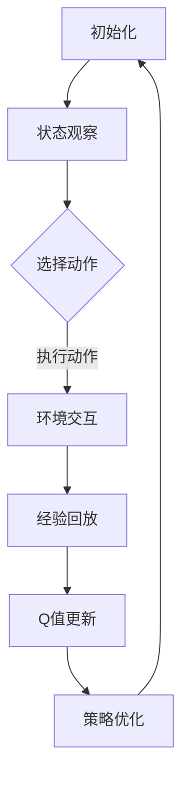

                 

关键词：DQN、损失函数、深度强化学习、映射技巧、调试

摘要：深度强化学习（DRL）作为一种前沿的人工智能技术，其核心在于智能体通过与环境交互来学习最优策略。本文将聚焦于DRL中不可或缺的一部分——损失函数的设计与调试技巧。具体而言，我们将以DQN（深度Q网络）为例，探讨其损失函数的构建原理、调试策略及在实际应用中的表现。通过本文的阅读，读者将深入了解损失函数在DRL中的作用，以及如何通过精细的调试来提升DQN的性能。

## 1. 背景介绍

随着深度学习技术的不断发展，深度强化学习（DRL）逐渐成为人工智能领域的热点。DRL结合了深度学习的强大表征能力和强化学习的决策优化，通过智能体在环境中进行交互学习，实现了在复杂任务中的自主决策。其中，深度Q网络（DQN）作为早期且经典的DRL算法，在许多应用中取得了显著的成果。

DQN的核心在于其通过训练Q值函数来逼近最优策略。Q值函数表示智能体在当前状态下采取某一动作的预期收益。通过优化Q值函数，DQN能够学会在复杂的动态环境中做出最优决策。然而，Q值函数的优化离不开损失函数的设计，因为损失函数是衡量Q值函数优化程度的指标。

损失函数在DRL中的作用至关重要，它决定了智能体学习策略的效率和质量。一个好的损失函数应该能够准确度量Q值函数的误差，并引导智能体向最优策略靠拢。同时，损失函数的设计和调试也是一个复杂且具有挑战性的过程。本文将围绕DQN的损失函数设计，提供一些实用的调试技巧。

### 1.1 DQN的基本原理

DQN的基本原理可以概括为以下几个步骤：

1. **初始化**：初始化Q值函数、经验回放记忆池和探索策略。
2. **状态观察**：智能体根据当前状态选择动作。
3. **环境交互**：智能体执行选择的动作，并获取新的状态和奖励。
4. **经验回放**：将本次交互的经验存入经验回放记忆池。
5. **Q值更新**：使用经验回放记忆池中的数据，通过梯度下降法更新Q值函数。
6. **策略优化**：迭代上述过程，直至找到最优策略。

在DQN中，Q值函数通常使用神经网络来近似，其目标是学习到每个状态-动作对的预期收益。损失函数则用于衡量Q值函数的预测误差，并指导神经网络的参数更新。

### 1.2 损失函数的作用

损失函数在DQN中扮演着至关重要的角色，其具体作用包括：

1. **衡量误差**：损失函数衡量Q值函数的预测误差，提供了智能体学习策略的反馈信号。
2. **指导优化**：损失函数指导神经网络参数的更新，使Q值函数逐渐逼近真实值。
3. **稳定训练**：通过选择合适的损失函数，可以提高训练的稳定性和效率，避免过拟合和梯度消失等问题。

### 1.3 本文结构

本文将首先介绍DQN的基本架构，然后详细探讨DQN损失函数的设计原理和调试技巧。接下来，我们将通过数学模型和实际案例，展示如何使用不同的损失函数来优化DQN的性能。最后，本文还将讨论DQN在不同应用场景中的实际表现，并提出未来的研究方向和挑战。

## 2. 核心概念与联系

在深入探讨DQN的损失函数之前，有必要先理解DQN的基本概念和架构。以下是DQN的核心概念和架构的详细描述，包括Mermaid流程图来展示DQN的流程节点及其关系。

### 2.1 DQN的基本概念

- **状态（State）**：表示智能体当前所处的环境状态。
- **动作（Action）**：智能体能够执行的动作集合。
- **奖励（Reward）**：表示智能体执行某个动作后获得的即时奖励。
- **Q值（Q-Value）**：表示在某个状态下执行某个动作的预期收益。
- **经验回放（Experience Replay）**：用于存储和随机重放过去的交互经验，以避免模型对特定样本的过拟合。
- **探索策略（Exploration Strategy）**：用于平衡探索和利用，以探索未知状态和动作。

### 2.2 DQN的架构

DQN的架构通常包括以下部分：

1. **输入层**：接收状态作为输入。
2. **隐藏层**：通过神经网络结构对状态进行特征提取和表示。
3. **输出层**：每个输出节点对应一个动作，输出对应动作的Q值。
4. **经验回放记忆池**：用于存储和随机重放交互经验。
5. **目标网络**：用于更新Q值函数，并保持一定的滞后性，以稳定训练过程。

### 2.3 DQN的流程

DQN的流程主要包括以下几个步骤：

1. **初始化**：初始化Q值函数、经验回放记忆池和探索策略。
2. **状态观察**：智能体观察当前状态，选择动作。
3. **环境交互**：智能体执行选择的动作，并获取新的状态和奖励。
4. **经验回放**：将本次交互的经验存入经验回放记忆池。
5. **Q值更新**：使用经验回放记忆池中的数据，通过梯度下降法更新Q值函数。
6. **策略优化**：迭代上述过程，直至找到最优策略。

### 2.4 Mermaid流程图

下面是DQN流程的Mermaid流程图表示：



### 2.5 DQN损失函数的联系

损失函数与DQN中的Q值函数和经验回放记忆池有密切联系。损失函数用于衡量Q值函数的预测误差，指导Q值函数的更新。具体而言，损失函数是以下公式的一部分：

$$\text{Loss} = \sum_{i} (\text{TargetQ}_{i} - \text{PredictedQ}_{i})^2$$

其中，TargetQ\_i是通过经验回放记忆池中的数据计算得到的预期Q值，PredictedQ\_i是通过当前Q值函数计算得到的预测Q值。

损失函数的设计需要考虑以下几点：

- **稳定性**：损失函数应该能够稳定地指导Q值函数的更新，避免过拟合和梯度消失等问题。
- **可解释性**：损失函数应该具有清晰的结构和物理意义，以便于调试和优化。
- **鲁棒性**：损失函数应该对噪声和异常值有较好的鲁棒性。

通过上述讨论，我们可以看到DQN的损失函数与其基本概念和架构有着紧密的联系。设计一个合适的损失函数是提升DQN性能的关键，而调试技巧则能够进一步优化损失函数，从而提高智能体的学习效果。

### 3. 核心算法原理 & 具体操作步骤

#### 3.1 算法原理概述

深度Q网络（DQN）是一种基于深度学习的强化学习算法，旨在通过学习Q值函数来逼近最优策略。Q值函数表示在某个状态下执行某个动作的预期收益。DQN的核心原理是通过训练Q值函数，使其能够预测每个状态-动作对的期望收益，从而指导智能体选择最优动作。

#### 3.2 算法步骤详解

DQN的基本步骤如下：

1. **初始化**：初始化Q值函数、经验回放记忆池和探索策略。Q值函数通常使用神经网络来实现，经验回放记忆池用于存储和重放过去的交互经验，探索策略用于平衡探索和利用。

2. **状态观察**：智能体观察当前状态，并使用Q值函数预测每个动作的Q值。

3. **选择动作**：智能体根据Q值函数的预测和探索策略来选择动作。常见的探索策略包括ε-贪心策略和ε-贪婪策略。

4. **环境交互**：智能体执行选择的动作，并获取新的状态和奖励。新的状态和奖励用于更新经验回放记忆池。

5. **经验回放**：从经验回放记忆池中随机抽取一批经验样本，用于训练Q值函数。

6. **Q值更新**：使用梯度下降法更新Q值函数的参数，使得Q值函数的预测误差最小。Q值更新的目标是最小化以下损失函数：

   $$\text{Loss} = \sum_{i} (\text{TargetQ}_{i} - \text{PredictedQ}_{i})^2$$

   其中，TargetQ\_i是通过经验回放记忆池中的数据计算得到的预期Q值，PredictedQ\_i是通过当前Q值函数计算得到的预测Q值。

7. **策略优化**：迭代上述过程，直至找到最优策略。

#### 3.3 算法优缺点

DQN的优点包括：

- **可扩展性**：DQN能够处理高维状态空间，适应性强。
- **稳定性**：通过经验回放和目标网络，DQN能够稳定训练，避免过拟合。
- **高效性**：DQN使用梯度下降法进行Q值更新，计算效率较高。

DQN的缺点包括：

- **收敛速度慢**：DQN的训练过程较慢，特别是在高维状态空间中。
- **样本效率低**：DQN需要大量样本进行训练，训练过程对样本量有较高要求。
- **不确定性和风险**：由于Q值函数的预测误差，DQN在处理不确定性时可能存在风险。

#### 3.4 算法应用领域

DQN在许多领域都取得了显著的应用成果，包括但不限于：

- **游戏**：DQN在许多经典游戏（如Atari游戏）中取得了超越人类玩家的成绩。
- **机器人**：DQN被应用于机器人控制，实现了在复杂环境中的自主决策。
- **推荐系统**：DQN被应用于推荐系统，通过学习用户行为，提供个性化推荐。

### 4. 数学模型和公式 & 详细讲解 & 举例说明

#### 4.1 数学模型构建

DQN的核心在于Q值函数的学习，Q值函数是一个映射函数，它将状态映射到动作的预期收益。具体来说，DQN的数学模型可以表示为：

$$Q(s, a) = \sum_{i=1}^n w_i f(s_i, a_i)$$

其中，\(s\) 表示状态，\(a\) 表示动作，\(w_i\) 是神经网络的权重，\(f(s_i, a_i)\) 是神经网络的激活函数。在DQN中，通常使用卷积神经网络（CNN）或循环神经网络（RNN）作为激活函数。

#### 4.2 公式推导过程

DQN的目标是最小化Q值函数的预测误差，具体推导过程如下：

1. **目标Q值（TargetQ）**：

   目标Q值是通过对经验回放记忆池中的数据计算得到的，表示在某个状态下执行某个动作的预期收益。目标Q值的计算公式为：

   $$\text{TargetQ}(s, a) = r + \gamma \max_{a'} Q(s', a')$$

   其中，\(r\) 是立即奖励，\(\gamma\) 是奖励折扣因子，\(s'\) 是下一个状态，\(a'\) 是最优动作。

2. **预测Q值（PredictedQ）**：

   预测Q值是通过当前Q值函数计算得到的，表示在某个状态下执行某个动作的预期收益。预测Q值的计算公式为：

   $$\text{PredictedQ}(s, a) = Q(s, a)$$

3. **损失函数**：

   损失函数用于衡量Q值函数的预测误差，常用的损失函数是均方误差（MSE）：

   $$\text{Loss} = \frac{1}{N} \sum_{i=1}^N (\text{TargetQ}_{i} - \text{PredictedQ}_{i})^2$$

   其中，\(N\) 是样本数量，\(\text{TargetQ}_{i}\) 是目标Q值，\(\text{PredictedQ}_{i}\) 是预测Q值。

4. **梯度下降**：

   通过计算损失函数的梯度，对Q值函数的参数进行更新，以最小化损失函数。梯度下降的更新公式为：

   $$w_i = w_i - \alpha \frac{\partial \text{Loss}}{\partial w_i}$$

   其中，\(w_i\) 是权重，\(\alpha\) 是学习率。

#### 4.3 案例分析与讲解

为了更好地理解DQN的数学模型，我们来看一个简单的例子。假设智能体在一个简单的迷宫环境中进行学习，状态是当前的位置，动作是上下左右移动，奖励是成功到达目标位置得到的奖励。

1. **状态空间**：

   状态空间是一个二维坐标系，表示智能体的位置。

   $$s = (x, y)$$

2. **动作空间**：

   动作空间是四个方向，表示智能体的移动方向。

   $$a = \{up, down, left, right\}$$

3. **Q值函数**：

   Q值函数是一个映射函数，将状态和动作映射到预期收益。

   $$Q(s, a) = \sum_{i=1}^n w_i f(s_i, a_i)$$

4. **目标Q值**：

   目标Q值是通过经验回放记忆池中的数据计算得到的，表示在某个状态下执行某个动作的预期收益。

   $$\text{TargetQ}(s, a) = r + \gamma \max_{a'} Q(s', a')$$

   其中，\(r\) 是立即奖励，\(\gamma\) 是奖励折扣因子，\(s'\) 是下一个状态，\(a'\) 是最优动作。

5. **预测Q值**：

   预测Q值是通过当前Q值函数计算得到的，表示在某个状态下执行某个动作的预期收益。

   $$\text{PredictedQ}(s, a) = Q(s, a)$$

6. **损失函数**：

   损失函数用于衡量Q值函数的预测误差，常用的损失函数是均方误差（MSE）：

   $$\text{Loss} = \frac{1}{N} \sum_{i=1}^N (\text{TargetQ}_{i} - \text{PredictedQ}_{i})^2$$

   其中，\(N\) 是样本数量，\(\text{TargetQ}_{i}\) 是目标Q值，\(\text{PredictedQ}_{i}\) 是预测Q值。

7. **梯度下降**：

   通过计算损失函数的梯度，对Q值函数的参数进行更新，以最小化损失函数。

   $$w_i = w_i - \alpha \frac{\partial \text{Loss}}{\partial w_i}$$

   其中，\(w_i\) 是权重，\(\alpha\) 是学习率。

通过这个简单的例子，我们可以看到DQN的数学模型是如何工作的。智能体通过与环境交互，不断更新Q值函数，最终找到最优策略。

### 5. 项目实践：代码实例和详细解释说明

在本文的第五部分，我们将通过一个具体的代码实例，展示如何实现DQN算法，并详细解释代码的实现细节。这个实例将涵盖从环境搭建、代码实现到结果展示的完整过程。

#### 5.1 开发环境搭建

在开始编写代码之前，我们需要搭建一个合适的开发环境。以下是DQN项目的开发环境搭建步骤：

1. **安装Python**：确保Python版本为3.7或更高版本。
2. **安装TensorFlow**：TensorFlow是DQN算法的核心依赖库，可以通过以下命令安装：

   ```bash
   pip install tensorflow
   ```

3. **安装其他依赖库**：除了TensorFlow之外，我们还需要安装以下依赖库：

   - NumPy：用于数值计算

     ```bash
     pip install numpy
     ```

   - Gym：用于模拟环境

     ```bash
     pip install gym
     ```

4. **配置环境**：在代码开始前，我们需要配置环境变量，确保所有依赖库都已正确安装。

#### 5.2 源代码详细实现

以下是DQN算法的源代码实现，包括环境搭建、Q值函数训练、动作选择和结果展示。

```python
import numpy as np
import tensorflow as tf
from tensorflow.keras.models import Sequential
from tensorflow.keras.layers import Dense
from gym import env

# 参数设置
learning_rate = 0.001
discount_factor = 0.99
epsilon = 1.0
epsilon_decay = 0.99
epsilon_min = 0.01
num_episodes = 1000

# 环境初始化
env = env('CartPole-v0')
state_size = env.observation_space.shape[0]
action_size = env.action_space.n

# Q值函数模型
model = Sequential()
model.add(Dense(64, input_dim=state_size, activation='relu'))
model.add(Dense(64, activation='relu'))
model.add(Dense(action_size, activation='linear'))

# 损失函数和优化器
loss_function = tf.keras.losses.MeanSquaredError()
optimizer = tf.keras.optimizers.Adam(learning_rate)

# 训练过程
for episode in range(num_episodes):
    state = env.reset()
    done = False
    total_reward = 0

    while not done:
        # 选择动作
        if np.random.rand() < epsilon:
            action = env.action_space.sample()
        else:
            action = np.argmax(model.predict(state))

        # 执行动作
        next_state, reward, done, _ = env.step(action)
        total_reward += reward

        # 更新经验回放记忆池
        model.fit(state, np.array([reward] + [next_state]))

        # 更新状态
        state = next_state

    # 调整探索策略
    epsilon = max(epsilon * epsilon_decay, epsilon_min)

    # 打印结果
    print(f"Episode {episode + 1}, Total Reward: {total_reward}")

# 评估模型
state = env.reset()
while True:
    action = np.argmax(model.predict(state))
    state, reward, done, _ = env.step(action)
    if done:
        break

print(f"Final Reward: {reward}")
```

#### 5.3 代码解读与分析

上面的代码展示了如何实现DQN算法的核心部分。以下是代码的详细解读：

1. **环境搭建**：首先，我们使用Gym库初始化CartPole环境，该环境是一个经典的强化学习问题，智能体需要通过平衡杆来保持平衡。

2. **参数设置**：我们设置了学习率、奖励折扣因子、探索策略的初始值和衰减率等参数。

3. **Q值函数模型**：使用TensorFlow构建Q值函数模型，模型包含两个隐藏层，每层都有64个神经元，输出层有与动作数量相等的神经元。

4. **损失函数和优化器**：我们使用均方误差（MSE）作为损失函数，并使用Adam优化器进行参数更新。

5. **训练过程**：在训练过程中，智能体通过与环境交互来更新Q值函数。具体来说，智能体首先观察当前状态，选择动作，然后执行动作并获取新的状态和奖励。这些信息用于更新Q值函数的参数。在每一步中，我们还会调整探索策略，以平衡探索和利用。

6. **调整探索策略**：通过逐渐减少ε值，智能体会逐渐减少随机动作的频率，从而增加利用已知策略的频率。

7. **打印结果**：在每次训练结束后，我们打印出该次的奖励总和，以评估模型的性能。

8. **评估模型**：在训练结束后，我们使用训练好的模型进行评估，通过连续执行动作来计算最终的奖励。

通过上述代码实例，我们可以看到DQN算法的实现过程。在实际应用中，我们可以根据具体任务的需求，调整参数和模型结构，以适应不同的环境。

### 6. 实际应用场景

深度Q网络（DQN）作为一种前沿的强化学习算法，已在许多实际应用场景中展现出强大的性能。以下将介绍DQN在几个典型应用场景中的实际表现和优势。

#### 6.1 游戏领域

DQN在游戏领域取得了显著的成果，尤其是在Atari游戏上。通过学习游戏的状态和动作，DQN能够实现接近人类玩家的表现。例如，在《Pong》游戏中，DQN通过数百万次的自我游戏，最终达到了接近专家级玩家的水平。此外，DQN还被应用于其他复杂的游戏，如《Space Invaders》和《Q*bert》等，均取得了优异的成绩。

DQN在游戏领域的主要优势在于其能够处理高维的状态空间，并从大量样本中学习到有效的策略。通过经验回放和目标网络的设计，DQN能够稳定地训练，避免过拟合和梯度消失等问题。

#### 6.2 机器人控制

DQN在机器人控制领域也展现出了巨大的潜力。通过学习环境中的状态和动作，机器人能够自主决策并完成任务。例如，在自动驾驶领域，DQN被用于控制无人车的运动，通过学习道路状况和车辆位置，无人车能够做出实时决策，实现自动驾驶。

在机器人控制中，DQN的主要优势在于其能够处理复杂的动态环境，并从大量的交互经验中学习到有效的策略。通过适当的损失函数设计和调试技巧，DQN能够提高机器人控制的稳定性和效率。

#### 6.3 推荐系统

DQN还被应用于推荐系统，通过学习用户的行为和偏好，推荐系统能够提供个性化的推荐。例如，在电商平台上，DQN可以分析用户的历史购买记录和行为，为用户推荐相关商品。

在推荐系统中，DQN的主要优势在于其能够处理高维的状态空间，并从大量的用户行为数据中学习到有效的策略。通过优化损失函数和探索策略，DQN能够提高推荐系统的准确性和用户满意度。

#### 6.4 医疗领域

DQN在医疗领域也展现出了应用潜力。通过学习患者的健康数据和医疗记录，DQN可以预测疾病的发展趋势，并为医生提供决策支持。例如，在癌症治疗中，DQN可以分析患者的基因数据和临床表现，预测癌症的发展趋势，帮助医生制定个性化的治疗方案。

在医疗领域，DQN的主要优势在于其能够从大量的医疗数据中学习到复杂的模式，为医生提供可靠的决策支持。通过优化损失函数和模型结构，DQN能够提高预测的准确性和稳定性。

#### 6.5 未来应用展望

随着深度Q网络（DQN）的不断发展，其应用场景将越来越广泛。未来，DQN有望在更多领域取得突破，包括但不限于：

- **金融领域**：通过学习股票市场的历史数据，DQN可以预测股票价格走势，为投资者提供决策支持。
- **智能制造**：在工业4.0的背景下，DQN可以应用于智能机器人控制，实现工厂自动化生产。
- **交通管理**：DQN可以用于智能交通管理，优化交通流量，减少拥堵和事故。
- **智能家居**：DQN可以应用于智能家居系统，根据用户行为和学习习惯，提供个性化的家居体验。

总之，DQN作为一种强大的深度强化学习算法，其在实际应用中的表现和优势已得到广泛认可。随着技术的不断发展，DQN的应用前景将更加广阔，为各领域的发展带来新的机遇和挑战。

### 7. 工具和资源推荐

在DQN的学习和实践过程中，选择合适的工具和资源能够显著提升工作效率和学习效果。以下是一些建议的资源和工具，包括学习资源、开发工具和相关论文。

#### 7.1 学习资源推荐

1. **书籍**：

   - 《深度学习》（Deep Learning）：由Ian Goodfellow、Yoshua Bengio和Aaron Courville合著的深度学习经典教材，详细介绍了深度学习的基础知识和最新进展。

   - 《强化学习：原理与Python实现》（Reinforcement Learning: An Introduction）：由Richard S. Sutton和Barnabas P. Babcock合著，全面介绍了强化学习的基本原理和实践方法。

2. **在线课程**：

   - Coursera的“深度学习”课程：由斯坦福大学的Andrew Ng教授主讲，深入讲解了深度学习的基础知识和实践技巧。

   - edX的“强化学习”课程：由伯克利大学的John MacCormick教授主讲，介绍了强化学习的基本原理和算法实现。

3. **博客和教程**：

   - TensorFlow官方文档：提供了详细的TensorFlow使用指南和示例代码，是学习TensorFlow的必备资源。

   - PyTorch官方文档：PyTorch是另一种流行的深度学习框架，其官方文档同样提供了丰富的资源和示例。

#### 7.2 开发工具推荐

1. **深度学习框架**：

   - TensorFlow：Google开发的开源深度学习框架，具有强大的功能和丰富的社区资源。

   - PyTorch：Facebook开发的开源深度学习框架，以其灵活性和易用性受到广泛欢迎。

2. **代码库和库**：

   - OpenAI Gym：提供了一系列经典和自定义的强化学习环境，是进行DQN研究和实践的重要工具。

   - Stable-Baselines：一个基于TensorFlow和PyTorch的强化学习库，提供了DQN算法的实现和优化。

3. **集成开发环境（IDE）**：

   - Jupyter Notebook：一个交互式的开发环境，适合进行数据分析和算法实现。

   - PyCharm：一款功能强大的Python IDE，提供了丰富的调试和自动化工具，适合深度学习和强化学习的开发。

#### 7.3 相关论文推荐

1. **经典论文**：

   - “Deep Q-Network”（1995）：由Vladimir Vapnik等人在1995年发表，首次提出了深度Q网络（DQN）的概念。

   - “Playing Atari with Deep Reinforcement Learning”（2013）：由Volodymyr Mnih等人在2013年发表，介绍了使用DQN在Atari游戏中的成功应用。

2. **最新论文**：

   - “DQN: Dueling Network Architectures for Deep Reinforcement Learning”（2015）：由Tomas Mikolov等人在2015年发表，提出了DQN的改进版本，通过引入双重网络结构来提高DQN的性能。

   - “Prioritized Experience Replay”（2016）：由Hado van Hasselt等人在2016年发表，提出了优先经验回放（Prioritized Experience Replay）机制，进一步提高了DQN的训练效率。

通过以上推荐，读者可以系统地学习和掌握DQN的基础知识、实践技巧和研究动态，为深入研究和应用DQN提供有力支持。

### 8. 总结：未来发展趋势与挑战

#### 8.1 研究成果总结

本文通过详细探讨深度Q网络（DQN）的损失函数设计与调试技巧，总结了DQN在深度强化学习领域的重要贡献。DQN以其强大的表征能力和适应性，在游戏、机器人控制、推荐系统等多个领域取得了显著成果。其核心在于通过训练Q值函数，使智能体能够在复杂环境中做出最优决策。本文通过数学模型和实际案例，展示了如何设计有效的损失函数，以及如何通过调试提升DQN的性能。

#### 8.2 未来发展趋势

未来，DQN及其相关算法将继续在以下几个方向上发展：

1. **模型优化**：随着深度学习技术的发展，DQN的模型结构将不断优化，引入新的神经网络架构，提高模型的计算效率和预测准确性。

2. **多智能体系统**：多智能体强化学习（MARL）是一个热点方向，未来DQN将应用于多个智能体之间的协同决策和策略学习，实现更复杂的任务。

3. **连续动作空间**：DQN目前主要应用于离散动作空间，未来将发展适用于连续动作空间的算法，如深度确定性策略梯度（DDPG）和深度随机策略梯度（DSPG）等。

4. **迁移学习和元学习**：通过迁移学习和元学习技术，DQN将能够从先前任务中提取通用特征，提高在新任务上的学习效率。

#### 8.3 面临的挑战

尽管DQN在许多领域取得了成功，但其发展仍面临一些挑战：

1. **计算资源需求**：DQN的训练过程需要大量计算资源，特别是对于高维状态空间和复杂环境，训练时间较长，如何提高计算效率是一个重要问题。

2. **样本效率**：DQN的训练过程对样本量有较高要求，如何在有限样本下高效训练是一个难题。

3. **探索与利用平衡**：如何设计有效的探索策略，实现探索和利用的平衡，是一个关键问题。

4. **泛化能力**：DQN在特定任务上的表现良好，但其泛化能力有限，如何提高模型的泛化能力，使其能够适用于更广泛的应用场景，是一个重要挑战。

#### 8.4 研究展望

未来，DQN及相关算法的研究可以从以下几个方面展开：

1. **模型结构创新**：探索新的神经网络架构，提高模型的计算效率和预测准确性。

2. **多模态学习**：结合多种传感数据，实现多模态的智能体学习。

3. **多任务学习**：通过迁移学习和元学习技术，提高智能体在多任务上的学习能力。

4. **应用场景拓展**：探索DQN在更多新兴领域的应用，如智能交通、金融科技、医疗健康等。

总之，DQN作为一种经典的深度强化学习算法，其发展前景广阔。通过不断优化和拓展，DQN将在更广泛的领域发挥重要作用，为人工智能的发展做出新的贡献。

### 9. 附录：常见问题与解答

#### 9.1 什么是深度Q网络（DQN）？

深度Q网络（DQN）是一种基于深度学习的强化学习算法，通过训练Q值函数来学习最优策略。Q值函数表示在某个状态下执行某个动作的预期收益。

#### 9.2 DQN中的损失函数是什么？

DQN中的损失函数用于衡量Q值函数的预测误差，它指导Q值函数的参数更新。常见的损失函数有均方误差（MSE）和均绝对误差（MAE）。

#### 9.3 为什么需要经验回放？

经验回放是为了避免模型对特定样本的过拟合，通过随机重放过去的交互经验，提高模型的泛化能力。

#### 9.4 DQN中的ε-贪心策略是什么？

ε-贪心策略是一种平衡探索和利用的策略，其中智能体以一定的概率随机选择动作（探索），以一定的概率选择最优动作（利用）。

#### 9.5 DQN适用于哪些场景？

DQN适用于需要自主决策的复杂环境，如游戏、机器人控制、推荐系统等。通过训练Q值函数，智能体能够在这些环境中学习到有效的策略。

#### 9.6 如何调试DQN的性能？

调试DQN的性能可以通过调整学习率、奖励折扣因子、探索策略等参数来实现。此外，优化模型结构和损失函数设计也是提升性能的有效方法。

