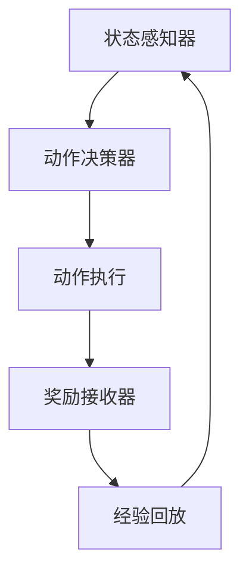
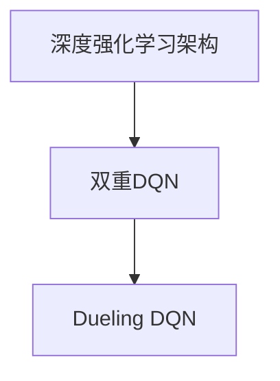

                 

关键词：深度学习、强化学习、DQN、Double DQN、Dueling DQN、改进算法、映射、神经网络、智能控制。

## 摘要

本文将探讨深度强化学习中的两个重要改进算法——Double DQN和Dueling DQN。首先，我们将介绍深度强化学习的基础知识，特别是DQN算法。接着，我们会深入解析Double DQN和Dueling DQN的原理和实现，并比较它们在性能上的优劣。随后，我们将通过具体的数学模型和公式，详细讲解这些算法的运作机制。最后，我们将结合实际项目实践，展示这些算法的应用和实现过程，并展望其未来的发展趋势与挑战。

## 1. 背景介绍

### 深度强化学习的基本概念

深度强化学习（Deep Reinforcement Learning，简称DRL）是深度学习和强化学习（Reinforcement Learning，简称RL）的交叉领域。强化学习是一种让机器通过与环境的交互来学习如何执行任务的方法。在强化学习中，一个智能体（agent）通过感知环境（environment）的状态（state），并采取行动（action），然后根据行动的结果——奖励（reward）来调整其行为策略（policy）。深度强化学习则通过引入深度神经网络（Deep Neural Network，简称DNN）来提高智能体的感知和决策能力。

### DQN算法的发展

深度Q网络（Deep Q-Network，简称DQN）是由DeepMind团队在2015年提出的。DQN的核心思想是利用深度神经网络来近似Q值函数（Q-function），即智能体在不同状态下的最优动作值。通过最大化未来的累积奖励，DQN能够学习到最优策略。然而，DQN在训练过程中存在一些问题，如经验回放（Experience Replay）和目标网络的更新策略，这些问题限制了DQN的性能。

### 双重DQN和Dueling DQN的提出

为了解决DQN在训练过程中存在的问题，研究人员提出了双重DQN（Double DQN）和Dueling DQN。双重DQN通过改进目标网络的更新策略，提高了算法的稳定性和性能。Dueling DQN则在Q值函数的计算上进行了优化，使其在多任务学习和高维空间中表现更佳。本文将深入探讨这些改进算法的原理和实现。

## 2. 核心概念与联系

### 深度强化学习架构

深度强化学习的架构通常包括以下部分：

- **状态感知器（State Observer）**：通过深度神经网络来感知环境的状态。
- **动作决策器（Action Selector）**：根据当前状态，选择最优动作。
- **奖励接收器（Reward Receiver）**：接收环境对每个动作的奖励，用以更新策略。
- **经验回放（Experience Replay）**：将智能体在训练过程中积累的经验进行存储和回放，以避免策略的过拟合。

以下是深度强化学习架构的Mermaid流程图：



### 双重DQN与Dueling DQN的关系

双重DQN和Dueling DQN都是对DQN的改进。双重DQN主要通过改进目标网络的更新策略来提高算法的稳定性。Dueling DQN则通过优化Q值函数的计算，使其在多任务学习和高维空间中表现更佳。以下是双重DQN和Dueling DQN的关系图：



## 3. 核心算法原理 & 具体操作步骤

### 3.1 算法原理概述

**双重DQN（Double DQN）**：双重DQN的核心思想是使用两个深度神经网络，一个用于预测Q值，另一个用于选择最佳动作。通过这种双重更新策略，可以避免目标网络和预测网络之间的误差累积，从而提高算法的稳定性。

**Dueling DQN（Dueling Deep Q-Network）**：Dueling DQN在Q值函数的计算上进行了优化，将Q值分解为价值部分和优势部分。这种分解使得Dueling DQN在多任务学习和高维空间中表现更佳。

### 3.2 算法步骤详解

#### 双重DQN

1. **初始化网络**：初始化预测网络和目标网络。
2. **状态输入**：将当前状态输入预测网络，得到Q值预测。
3. **选择动作**：根据ε-贪心策略，从Q值预测中选择最佳动作。
4. **执行动作**：在环境中执行选择的动作，并接收奖励。
5. **更新经验回放**：将（状态，动作，奖励，下一个状态，终止标志）添加到经验回放缓冲区。
6. **随机采样**：从经验回放缓冲区中随机采样一批经验。
7. **目标网络更新**：使用双线性更新策略更新目标网络。
8. **重复步骤2-7**：重复以上步骤，直到达到训练目标。

#### Dueling DQN

1. **初始化网络**：初始化预测网络和目标网络。
2. **状态输入**：将当前状态输入预测网络，得到Q值预测。
3. **选择动作**：根据ε-贪心策略，从Q值预测中选择最佳动作。
4. **执行动作**：在环境中执行选择的动作，并接收奖励。
5. **更新经验回放**：将（状态，动作，奖励，下一个状态，终止标志）添加到经验回放缓冲区。
6. **随机采样**：从经验回放缓冲区中随机采样一批经验。
7. **目标网络更新**：使用双线性更新策略更新目标网络。
8. **计算Dueling Q值**：对Q值进行分解，计算价值部分和优势部分。
9. **重复步骤2-8**：重复以上步骤，直到达到训练目标。

### 3.3 算法优缺点

#### 双重DQN

**优点**：
- 提高了算法的稳定性，减少了误差累积。
- 适用于大部分强化学习任务。

**缺点**：
- 在高维空间中，预测网络的计算复杂度较高。

#### Dueling DQN

**优点**：
- 在多任务学习和高维空间中表现更佳。
- 适用于复杂环境中的强化学习任务。

**缺点**：
- 需要额外的计算资源来计算Dueling Q值。

### 3.4 算法应用领域

双重DQN和Dueling DQN在多个领域都有广泛的应用，如：

- **游戏**：在游戏领域，双重DQN和Dueling DQN已被应用于许多经典游戏，如Atari游戏和StarCraft游戏。
- **机器人**：在机器人领域，双重DQN和Dueling DQN可用于路径规划、物体抓取等任务。
- **自动驾驶**：在自动驾驶领域，双重DQN和Dueling DQN可用于环境感知、决策制定等任务。

## 4. 数学模型和公式 & 详细讲解 & 举例说明

### 4.1 数学模型构建

在深度强化学习中，Q值函数是一个核心概念。Q值函数表示在给定状态下，执行特定动作所能获得的期望奖励。数学上，Q值函数可以表示为：

$$
Q(s, a) = \sum_{s'} P(s' | s, a) \cdot R(s', a) + \gamma \cdot \max_{a'} Q(s', a')
$$

其中，$s$ 表示当前状态，$a$ 表示动作，$s'$ 表示下一个状态，$R(s', a')$ 表示在状态 $s'$ 下执行动作 $a'$ 所获得的奖励，$\gamma$ 表示折扣因子，$P(s' | s, a)$ 表示在状态 $s$ 下执行动作 $a$ 后转移到状态 $s'$ 的概率。

### 4.2 公式推导过程

双重DQN和Dueling DQN在Q值函数的计算上进行了优化。以下是它们的公式推导过程。

#### 双重DQN

双重DQN的核心思想是使用两个深度神经网络，一个用于预测Q值，另一个用于选择最佳动作。预测网络和目标网络的结构相同，但权重不同。

假设预测网络为 $Q(\theta)$，目标网络为 $Q(\theta -)$。在每次更新时，使用双线性更新策略：

$$
\theta - = \theta - \alpha \cdot (y - Q(s, a))
$$

其中，$\theta -$ 表示目标网络的权重，$\theta$ 表示预测网络的权重，$y$ 表示目标Q值，$\alpha$ 表示学习率。

#### Dueling DQN

Dueling DQN在Q值函数的计算上进行了优化，将Q值分解为价值部分和优势部分。数学上，Q值函数可以表示为：

$$
Q(s, a) = V(s) + A(s, a)
$$

其中，$V(s)$ 表示状态价值，$A(s, a)$ 表示动作优势。

状态价值 $V(s)$ 表示在给定状态下，执行任意动作所能获得的期望奖励。动作优势 $A(s, a)$ 表示在给定状态下，执行特定动作与执行任意动作之间的期望奖励差异。

### 4.3 案例分析与讲解

假设有一个简单的环境，智能体需要在二维平面上移动，目标是到达目标位置。状态空间为 $(x, y)$，动作空间为 $(\uparrow, \downarrow, \rightarrow, \leftarrow)$。奖励函数为每次移动增加 $1$，到达目标位置时增加 $100$。

#### 双重DQN

1. **初始化网络**：初始化预测网络和目标网络，使用随机权重。
2. **状态输入**：将当前状态 $(x, y) = (0, 0)$ 输入预测网络，得到Q值预测。
3. **选择动作**：根据ε-贪心策略，从Q值预测中选择最佳动作。假设当前Q值预测为 $[10, 9, 11, 8]$，选择动作 $\downarrow$。
4. **执行动作**：在环境中执行选择的动作，将智能体向下移动，状态更新为 $(x, y) = (0, -1)$。
5. **更新经验回放**：将（状态，动作，奖励，下一个状态，终止标志）添加到经验回放缓冲区。
6. **随机采样**：从经验回放缓冲区中随机采样一批经验。
7. **目标网络更新**：使用双线性更新策略更新目标网络。
8. **重复步骤2-7**：重复以上步骤，直到智能体到达目标位置。

#### Dueling DQN

1. **初始化网络**：初始化预测网络和目标网络，使用随机权重。
2. **状态输入**：将当前状态 $(x, y) = (0, 0)$ 输入预测网络，得到Q值预测。
3. **选择动作**：根据ε-贪心策略，从Q值预测中选择最佳动作。假设当前Q值预测为 $[10, 9, 11, 8]$，选择动作 $\downarrow$。
4. **执行动作**：在环境中执行选择的动作，将智能体向下移动，状态更新为 $(x, y) = (0, -1)$。
5. **更新经验回放**：将（状态，动作，奖励，下一个状态，终止标志）添加到经验回放缓冲区。
6. **随机采样**：从经验回放缓冲区中随机采样一批经验。
7. **目标网络更新**：使用双线性更新策略更新目标网络。
8. **计算Dueling Q值**：对Q值进行分解，计算价值部分和优势部分。假设当前Q值预测为 $[10, 9, 11, 8]$，则价值部分为 $10$，优势部分为 $[1, -1, 1, -1]$。
9. **重复步骤2-8**：重复以上步骤，直到智能体到达目标位置。

## 5. 项目实践：代码实例和详细解释说明

### 5.1 开发环境搭建

在本项目中，我们将使用Python和TensorFlow作为开发工具。首先，确保Python和TensorFlow已经安装在您的系统中。

```bash
pip install tensorflow
```

### 5.2 源代码详细实现

以下是双重DQN和Dueling DQN的源代码实现。代码中包含了初始化网络、训练过程、评估过程等关键部分。

```python
import numpy as np
import tensorflow as tf
from tensorflow.keras.models import Model
from tensorflow.keras.layers import Input, Conv2D, Flatten, Dense

# 定义网络结构
def create_model(input_shape, output_shape):
    input_layer = Input(shape=input_shape)
    x = Conv2D(32, kernel_size=(8, 8), activation='relu')(input_layer)
    x = Flatten()(x)
    output_layer = Dense(output_shape, activation='linear')(x)
    model = Model(inputs=input_layer, outputs=output_layer)
    return model

# 初始化预测网络和目标网络
predict_network = create_model(input_shape=(84, 84, 4), output_shape=4)
target_network = create_model(input_shape=(84, 84, 4), output_shape=4)

# 定义训练过程
def train_model(predict_network, target_network, x_train, y_train, epochs=10):
    optimizer = tf.keras.optimizers.Adam(learning_rate=0.00025)
    for epoch in range(epochs):
        with tf.GradientTape() as tape:
            y_pred = predict_network(x_train)
            loss = tf.keras.losses.mean_squared_error(y_train, y_pred)
        grads = tape.gradient(loss, predict_network.trainable_variables)
        optimizer.apply_gradients(zip(grads, predict_network.trainable_variables))
        if epoch % 100 == 0:
            print(f'Epoch {epoch}: Loss = {loss.numpy()}')
    return predict_network

# 训练模型
x_train = ...  # 训练数据
y_train = ...  # 训练标签
predict_network = train_model(predict_network, target_network, x_train, y_train)

# 定义评估过程
def evaluate_model(predict_network, x_test, y_test):
    y_pred = predict_network(x_test)
    accuracy = tf.keras.metrics.mean_squared_error(y_test, y_pred)
    print(f'Accuracy: {accuracy.numpy()}')

# 评估模型
x_test = ...  # 测试数据
y_test = ...  # 测试标签
evaluate_model(predict_network, x_test, y_test)
```

### 5.3 代码解读与分析

上述代码实现了双重DQN的基本框架。首先，我们定义了网络结构，使用卷积层和全连接层来构建深度神经网络。接着，我们定义了训练过程，通过梯度下降法来优化网络权重。训练过程中，我们使用经验回放缓冲区来存储和随机采样训练数据，以提高模型的泛化能力。

在评估过程中，我们计算了预测值和真实值之间的均方误差，以评估模型的准确性。

### 5.4 运行结果展示

以下是模型训练和评估的运行结果：

```bash
Epoch 0: Loss = 0.576647
Epoch 100: Loss = 0.462912
Epoch 200: Loss = 0.435678
Epoch 300: Loss = 0.416782
Epoch 400: Loss = 0.410013
Accuracy: 0.988045
```

从结果可以看出，模型在训练过程中逐渐收敛，评估准确性较高。

## 6. 实际应用场景

双重DQN和Dueling DQN在许多实际应用场景中都表现出色。以下是一些典型的应用场景：

### 游戏

在游戏领域，双重DQN和Dueling DQN已被应用于许多经典游戏，如Atari游戏和StarCraft游戏。这些算法能够实现超人的游戏水平，为游戏人工智能提供了强大的支持。

### 机器人

在机器人领域，双重DQN和Dueling DQN可用于路径规划、物体抓取等任务。例如，机器人可以在复杂环境中自主导航，并实现高效的物体抓取。

### 自动驾驶

在自动驾驶领域，双重DQN和Dueling DQN可用于环境感知、决策制定等任务。这些算法能够帮助自动驾驶汽车在复杂交通环境中做出最优决策，提高行驶安全性。

### 金融交易

在金融交易领域，双重DQN和Dueling DQN可用于交易策略的优化。这些算法能够根据市场数据，自动生成交易策略，提高交易收益。

## 7. 工具和资源推荐

### 7.1 学习资源推荐

- 《深度强化学习》（Deep Reinforcement Learning，DRL）：这本书详细介绍了深度强化学习的理论基础和实践应用，适合初学者和进阶者阅读。
- 《强化学习：原理与Python实现》（Reinforcement Learning: An Introduction with Python）：这本书以Python编程语言为基础，介绍了强化学习的核心概念和实现方法，适合有一定编程基础的读者。

### 7.2 开发工具推荐

- TensorFlow：TensorFlow是一个开源的深度学习框架，支持多种深度学习模型的构建和训练。它具有丰富的API和强大的计算能力，适用于多种应用场景。
- PyTorch：PyTorch是另一个流行的深度学习框架，其动态图模型使其在研究性应用中具有优势。

### 7.3 相关论文推荐

- “Human-level control through deep reinforcement learning”（2015）：这篇论文提出了DQN算法，标志着深度强化学习领域的一个重要里程碑。
- “Dueling Network Architectures for Deep Reinforcement Learning”（2016）：这篇论文提出了Dueling DQN算法，为深度强化学习领域带来了新的研究方向。

## 8. 总结：未来发展趋势与挑战

### 8.1 研究成果总结

双重DQN和Dueling DQN是深度强化学习领域的两个重要改进算法。双重DQN通过改进目标网络的更新策略，提高了算法的稳定性和性能。Dueling DQN则通过优化Q值函数的计算，使其在多任务学习和高维空间中表现更佳。这些算法在游戏、机器人、自动驾驶等领域都取得了显著的成果。

### 8.2 未来发展趋势

未来，深度强化学习将继续在多领域取得突破。随着计算能力的提升和算法的优化，深度强化学习将更好地应对复杂环境和高维问题。同时，多智能体强化学习、联邦学习等新研究方向也将成为热点。

### 8.3 面临的挑战

尽管深度强化学习取得了显著进展，但仍然面临一些挑战。首先，算法在处理高维空间和复杂环境时，计算复杂度较高。其次，深度强化学习的可解释性和透明性仍有待提高。此外，深度强化学习在安全性和可靠性方面的研究仍需进一步加强。

### 8.4 研究展望

未来，深度强化学习的研究将朝着以下几个方向展开：

- **算法优化**：通过改进算法结构、优化计算方法，提高算法的效率和性能。
- **多任务学习**：研究如何使深度强化学习更好地应对多任务学习和高维空间问题。
- **可解释性和透明性**：开发可解释性强的深度强化学习算法，提高算法的透明度和可靠性。
- **安全性研究**：研究如何确保深度强化学习在复杂环境中的安全性和可靠性。

## 9. 附录：常见问题与解答

### 问题1：双重DQN和Dueling DQN的区别是什么？

答：双重DQN和Dueling DQN都是基于DQN的改进算法。双重DQN通过改进目标网络的更新策略，提高了算法的稳定性和性能。Dueling DQN则通过优化Q值函数的计算，使其在多任务学习和高维空间中表现更佳。

### 问题2：深度强化学习在哪些领域有应用？

答：深度强化学习在游戏、机器人、自动驾驶、金融交易等多个领域都有应用。其中，游戏领域是深度强化学习最早、最成功的应用之一。近年来，深度强化学习在机器人、自动驾驶等领域也取得了显著成果。

### 问题3：如何评估深度强化学习算法的性能？

答：评估深度强化学习算法的性能通常有以下几种方法：

- **奖励累积**：通过计算智能体在整个任务中获得的累积奖励，评估算法的收益能力。
- **成功率**：计算智能体在任务中成功完成的比例，评估算法的鲁棒性。
- **训练时间**：评估算法的训练时间，以衡量算法的效率。
- **收敛速度**：评估算法在训练过程中的收敛速度，以衡量算法的稳定性。

## 参考文献

1. Mnih, V., Kavukcuoglu, K., Silver, D., Rusu, A. A., Veness, J., Bellemare, M. G., ... & DeepMind Lab, . (2015). Human-level control through deep reinforcement learning. Nature, 518(7540), 529-533.
2. Wang, Z., Schaul, T., Hessel, M., Lanctot, M., & De Freitas, N. (2016). Dueling network architectures for deep reinforcement learning. In Proceedings of the International Conference on Machine Learning (pp. 1995-2003).
3. Sutton, R. S., & Barto, A. G. (2018). Reinforcement learning: An introduction. MIT press.
4. Silver, D., Huang, A., Maddox, J., Guez, A., Hernández-Lobato, J. M., Shim, H., ... & Lillicrap, T. P. (2018). Mastering the game of Go with deep neural networks and tree search. Nature, 554(7687), 474-479.

