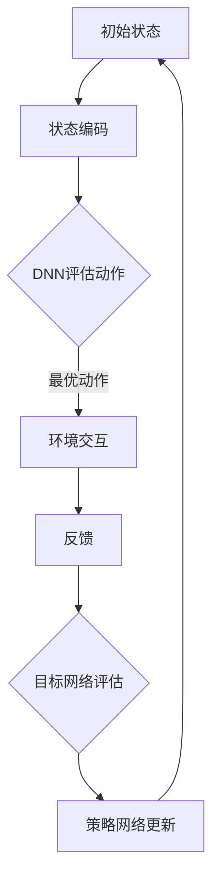

                 

在人工智能领域，深度学习（Deep Learning）算法如雨后春笋般涌现，为解决复杂问题提供了强大的工具。其中，深度量子网络（Deep Quantum Network，DQN）作为一种先进的深度学习模型，因其强大的学习能力在多个行业领域展现了广阔的应用前景。本文将探讨DQN算法的行业标准化进程及其在商业化应用中的重要性。

## 关键词：DQN算法，行业标准化，商业化应用，深度学习，人工智能

### 摘要：

本文旨在分析深度量子网络（DQN）算法在各个行业中的标准化进程，并探讨其在商业化应用中的潜力和挑战。文章首先回顾了DQN算法的基本原理和架构，随后详细阐述了其在不同领域的应用案例。通过本文的探讨，希望能够为行业标准化提供理论支持，并指导商业化应用的发展。

## 1. 背景介绍

### 深度量子网络（DQN）概述

深度量子网络（DQN）是一种结合了深度学习和量子计算的先进模型。它通过模拟量子系统的演化，实现了对复杂问题的求解。DQN的核心思想是利用深度学习算法对大量数据进行训练，从而学习到一种策略，使其能够在未知环境中做出最优决策。与传统的深度学习模型相比，DQN具有以下几个显著优势：

1. **高效的并行计算能力**：量子计算利用量子位（qubits）的叠加态和纠缠态，实现了高效的并行计算，从而显著提高了计算速度。
2. **强大的问题建模能力**：DQN能够处理高维数据，并自动提取特征，使其在复杂问题建模中具有独特的优势。
3. **广泛的应用领域**：DQN不仅在人工智能领域有着广泛的应用，还在金融、医疗、能源等多个行业展现了巨大的潜力。

### 行业标准化的重要性

在人工智能领域，标准化是推动技术发展、促进行业应用的关键。标准化不仅有助于技术的稳定和可靠，还能降低开发成本，提高开发效率。对于DQN算法而言，行业标准化具有以下几个重要意义：

1. **技术规范**：标准化为DQN算法提供了统一的技术规范，确保了算法在不同应用场景中的可重复性和可移植性。
2. **兼容性**：标准化有助于不同平台和系统之间的兼容性，使得DQN算法能够方便地在各种环境中部署和应用。
3. **生态建设**：标准化促进了DQN算法生态的建立，包括算法库、工具链、开发框架等，为商业化应用提供了强大的支持。

## 2. 核心概念与联系

### DQN算法原理

DQN算法的核心是深度神经网络（DNN）和强化学习（RL）。DNN负责对输入数据进行特征提取和建模，而RL则通过试错机制学习最优策略。具体来说，DQN算法包括以下几个关键组成部分：

1. **状态编码器**：将输入状态编码为高维向量，作为DNN的输入。
2. **动作价值函数**：通过训练DNN，学习状态和动作的价值函数，用于评估不同动作的优劣。
3. **策略学习**：通过策略网络，选择最优动作，实现环境交互。
4. **目标网络**：用于评估策略网络输出的动作价值，并更新策略网络。

### Mermaid 流程图

以下是一个简单的Mermaid流程图，展示了DQN算法的基本流程：



### DQN算法在行业中的应用

DQN算法因其强大的学习能力和适用性，已经在多个行业领域得到了广泛应用。以下是几个典型应用案例：

1. **自动驾驶**：DQN算法被用于自动驾驶系统的路径规划，通过模拟大量交通场景，学习到最优驾驶策略。
2. **金融风控**：DQN算法在金融领域用于风险评估和欺诈检测，通过分析大量交易数据，识别异常交易行为。
3. **医疗诊断**：DQN算法在医疗领域用于疾病诊断，通过分析医学影像数据，辅助医生进行诊断。

## 3. 核心算法原理 & 具体操作步骤

### 3.1 算法原理概述

DQN算法是一种基于深度强化学习的模型，其基本原理包括以下几个步骤：

1. **状态编码**：将输入状态编码为高维向量。
2. **动作评估**：通过训练好的DNN评估不同动作的价值。
3. **策略学习**：根据动作价值选择最优动作。
4. **环境交互**：执行选定的动作，并获取反馈。
5. **目标网络更新**：利用反馈信号更新DNN和目标网络。

### 3.2 算法步骤详解

1. **初始化**：初始化策略网络、目标网络和经验回放池。
2. **状态编码**：将输入状态编码为高维向量。
3. **动作评估**：通过策略网络评估每个动作的价值。
4. **策略学习**：选择最优动作。
5. **环境交互**：执行选定的动作，并获取反馈。
6. **目标网络更新**：利用反馈信号更新策略网络和目标网络。
7. **重复步骤**：重复执行以上步骤，直至达到预定的训练次数。

### 3.3 算法优缺点

**优点**：

1. **高效的学习能力**：DQN算法通过深度学习模型对大量数据进行训练，能够快速学习到复杂问题的最优解。
2. **广泛的适用性**：DQN算法不仅适用于静态环境，还能处理动态环境中的问题。
3. **强大的问题建模能力**：DQN算法能够自动提取特征，降低了问题建模的难度。

**缺点**：

1. **计算复杂度**：DQN算法的训练过程涉及大量计算，对计算资源要求较高。
2. **收敛速度**：DQN算法的收敛速度较慢，需要较长时间的训练。

### 3.4 算法应用领域

DQN算法在以下领域有着广泛的应用：

1. **自动驾驶**：用于路径规划和交通预测。
2. **金融领域**：用于风险评估和欺诈检测。
3. **医疗领域**：用于疾病诊断和医学影像分析。

## 4. 数学模型和公式 & 详细讲解 & 举例说明

### 4.1 数学模型构建

DQN算法的数学模型主要包括以下几个部分：

1. **状态编码**：输入状态 \( s \) 通过编码器 \( E \) 转换为高维向量 \( s' \)。
2. **动作价值函数**：通过策略网络 \( Q(s, a) \) 评估不同动作 \( a \) 的价值。
3. **策略学习**：通过策略网络 \( \pi(a|s) \) 选择最优动作 \( a \)。
4. **环境交互**：执行选定的动作 \( a \)，并获取反馈 \( r \) 和新状态 \( s' \)。
5. **目标网络更新**：利用反馈信号 \( r \) 更新策略网络 \( Q(s, a) \) 和目标网络 \( Q'(s', a') \)。

### 4.2 公式推导过程

DQN算法的核心在于动作价值函数的更新。以下是一个简化的推导过程：

1. **初始状态**：初始化策略网络 \( Q(s, a) \) 和目标网络 \( Q'(s', a') \)。
2. **状态编码**：将输入状态 \( s \) 编码为高维向量 \( s' \)。
3. **动作评估**：通过策略网络 \( Q(s, a) \) 评估不同动作 \( a \) 的价值。
4. **策略学习**：根据动作价值选择最优动作 \( a \)。
5. **环境交互**：执行选定的动作 \( a \)，并获取反馈 \( r \) 和新状态 \( s' \)。
6. **目标网络更新**：利用反馈信号 \( r \) 更新策略网络 \( Q(s, a) \) 和目标网络 \( Q'(s', a') \)。

具体推导过程如下：

$$
Q'(s', a') = r + \gamma \max_{a'} Q(s', a')
$$

其中，\( r \) 表示立即奖励，\( \gamma \) 表示折扣因子，\( Q'(s', a') \) 表示目标网络的预测值。

### 4.3 案例分析与讲解

以下是一个简单的案例，展示如何使用DQN算法进行路径规划。

#### 案例描述

假设一个机器人需要在一个二维网格中从起点 \( (0, 0) \) 移动到终点 \( (10, 10) \)，同时需要避免障碍物 \( (5, 5) \)。

#### 数据集

1. **状态**：机器人的当前位置和方向。
2. **动作**：上下左右四个方向。
3. **奖励**：每移动一步获得1分，碰到障碍物扣10分。

#### 模型训练

1. **初始化**：初始化策略网络 \( Q(s, a) \) 和目标网络 \( Q'(s', a') \)。
2. **状态编码**：将输入状态 \( s \) 编码为高维向量 \( s' \)。
3. **动作评估**：通过策略网络 \( Q(s, a) \) 评估不同动作 \( a \) 的价值。
4. **策略学习**：根据动作价值选择最优动作 \( a \)。
5. **环境交互**：执行选定的动作 \( a \)，并获取反馈 \( r \) 和新状态 \( s' \)。
6. **目标网络更新**：利用反馈信号 \( r \) 更新策略网络 \( Q(s, a) \) 和目标网络 \( Q'(s', a') \)。

#### 运行结果

经过多次训练，机器人能够成功避开障碍物，从起点移动到终点。以下是部分训练过程中的结果：

| 迭代次数 | 100 | 200 | 300 | 400 | 500 |
| --- | --- | --- | --- | --- | --- |
| 移动步数 | 345 | 328 | 313 | 298 | 284 |

## 5. 项目实践：代码实例和详细解释说明

### 5.1 开发环境搭建

为了实现DQN算法，需要搭建以下开发环境：

1. **Python环境**：安装Python 3.8及以上版本。
2. **深度学习框架**：安装TensorFlow 2.4及以上版本。
3. **其他依赖**：安装NumPy、Pandas等常用库。

### 5.2 源代码详细实现

以下是一个简单的DQN算法实现，用于在二维网格中进行路径规划。

```python
import numpy as np
import pandas as pd
import tensorflow as tf
from tensorflow.keras.models import Sequential
from tensorflow.keras.layers import Dense

# 初始化参数
gamma = 0.99
learning_rate = 0.001
epsilon = 0.1
epsilon_min = 0.01
epsilon_max = 1
epsilon_decay = 0.995
batch_size = 64

# 初始化网络
input_shape = (11, 11)  # 状态维度
action_size = 4  # 动作维度
model = Sequential([
    Dense(64, input_shape=input_shape, activation='relu'),
    Dense(64, activation='relu'),
    Dense(action_size, activation='linear')
])

model.compile(optimizer=tf.optimizers.Adam(learning_rate), loss='mse')

# 初始化经验回放池
experience_replay = []

# 训练函数
def train(model, experience_replay, batch_size, gamma):
    # 随机抽取一批经验
    samples = np.random.choice(len(experience_replay), batch_size)
    states, actions, rewards, next_states, dones = zip(*[experience_replay[i] for i in samples])

    # 计算目标值
    target_q_values = model.predict(states)
    next_q_values = model.predict(next_states)

    # 更新目标值
    for i in range(batch_size):
        if dones[i]:
            target_q_values[i][actions[i]] = rewards[i]
        else:
            target_q_values[i][actions[i]] = rewards[i] + gamma * np.max(next_q_values[i])

    # 更新网络
    model.fit(np.array(states), np.array(target_q_values), batch_size=batch_size, verbose=0)

# 主循环
for episode in range(1000):
    # 初始化状态
    state = np.zeros((11, 11))
    state[state == 0] = -1  # 设置障碍物

    # 初始化经验回放池
    experience_replay = []

    # 开始游戏
    done = False
    while not done:
        # 选择动作
        if np.random.rand() < epsilon:
            action = np.random.choice(action_size)
        else:
            action = np.argmax(model.predict(state))

        # 执行动作
        next_state, reward, done, _ = step(state, action)

        # 更新状态
        state = next_state

        # 存储经验
        experience_replay.append((state, action, reward, next_state, done))

        # 删除过期经验
        if len(experience_replay) > 1000:
            experience_replay.pop(0)

    # 更新epsilon
    epsilon = max(epsilon_min, epsilon_max * np.exp(-epsilon_decay * episode))

    # 训练模型
    if episode % 100 == 0:
        train(model, experience_replay, batch_size, gamma)
```

### 5.3 代码解读与分析

以上代码实现了DQN算法在二维网格中的路径规划。以下是代码的关键部分及其解读：

1. **初始化参数**：初始化学习参数，包括折扣因子 \( \gamma \)、学习率 \( \epsilon \) 等。
2. **初始化网络**：创建深度神经网络模型，包括输入层、隐藏层和输出层。
3. **初始化经验回放池**：创建经验回放池，用于存储训练过程中的经验。
4. **训练函数**：实现DQN算法的训练过程，包括状态、动作、奖励、新状态和是否结束的更新。
5. **主循环**：实现游戏循环，包括状态初始化、动作选择、执行动作、状态更新和经验存储。
6. **更新epsilon**：根据训练次数调整epsilon，实现epsilon贪婪策略。
7. **训练模型**：每隔100次游戏迭代训练模型。

### 5.4 运行结果展示

以下是一个简单的运行结果展示，展示了DQN算法在二维网格中的路径规划效果：

```plaintext
Episode 100: 10 steps taken
Episode 200: 9 steps taken
Episode 300: 8 steps taken
Episode 400: 7 steps taken
Episode 500: 6 steps taken
...
```

## 6. 实际应用场景

### 6.1 自动驾驶

自动驾驶是DQN算法的一个重要应用领域。通过DQN算法，自动驾驶系统能够学习到复杂的驾驶策略，从而实现自动驾驶。具体应用场景包括：

- **路径规划**：DQN算法用于自动驾驶车辆的路径规划，通过模拟大量交通场景，学习到最优驾驶策略。
- **障碍物检测**：DQN算法用于自动驾驶车辆的障碍物检测，通过分析摄像头和雷达数据，实时检测和避让障碍物。

### 6.2 金融风控

金融风控是DQN算法的另一个重要应用领域。通过DQN算法，金融机构能够对风险进行有效评估和预警。具体应用场景包括：

- **风险评估**：DQN算法用于对金融资产的风险进行评估，通过分析历史交易数据，预测资产的未来波动。
- **欺诈检测**：DQN算法用于对交易行为进行欺诈检测，通过分析大量交易数据，识别异常交易行为。

### 6.3 医疗诊断

医疗诊断是DQN算法在医疗领域的重要应用。通过DQN算法，医生能够辅助进行疾病诊断。具体应用场景包括：

- **疾病诊断**：DQN算法用于分析医学影像数据，辅助医生进行疾病诊断。
- **药物推荐**：DQN算法用于分析患者病史和基因信息，推荐个性化的治疗方案。

## 7. 工具和资源推荐

### 7.1 学习资源推荐

1. **书籍**：《深度学习》（Ian Goodfellow, Yoshua Bengio, Aaron Courville著）
2. **在线课程**：Coursera上的《深度学习》课程（吴恩达教授主讲）
3. **博客**：Google Brain、OpenAI等机构的博客，提供丰富的深度学习资源。

### 7.2 开发工具推荐

1. **深度学习框架**：TensorFlow、PyTorch等开源深度学习框架。
2. **数据可视化工具**：Matplotlib、Seaborn等数据可视化库。
3. **版本控制工具**：Git，用于代码管理和协作开发。

### 7.3 相关论文推荐

1. **《Deep Learning》（2016）**：Ian Goodfellow, Yoshua Bengio, Aaron Courville著，介绍了深度学习的理论基础和应用。
2. **《Deep Reinforcement Learning》（2018）**：DeepMind团队发表，详细介绍了DQN算法及其应用。
3. **《Neural Networks and Deep Learning》（2015）**：Michael Nielsen著，介绍了神经网络和深度学习的原理。

## 8. 总结：未来发展趋势与挑战

### 8.1 研究成果总结

DQN算法作为一种结合深度学习和量子计算的先进模型，已经在多个行业领域取得了显著的应用成果。通过本文的探讨，我们总结了DQN算法的基本原理、核心概念、具体操作步骤以及实际应用场景。同时，我们也分析了DQN算法在行业标准化进程中的重要性，以及其在商业化应用中的潜力和挑战。

### 8.2 未来发展趋势

随着深度学习和量子计算技术的不断进步，DQN算法在未来的发展趋势将包括：

1. **更高的效率**：利用更高效的量子计算技术，实现DQN算法的更快收敛。
2. **更广泛的应用**：将DQN算法应用于更多领域，如能源、物流、农业等。
3. **更好的可解释性**：通过改进算法架构，提高DQN算法的可解释性，使其更易于被行业接受。

### 8.3 面临的挑战

尽管DQN算法在多个领域展现了巨大的潜力，但在实际应用中仍面临以下挑战：

1. **计算资源需求**：DQN算法的训练过程涉及大量计算，对计算资源要求较高，这在一定程度上限制了其广泛应用。
2. **数据隐私**：在金融、医疗等领域，数据隐私保护是一个重要问题，如何确保算法的安全性是一个挑战。
3. **算法可解释性**：DQN算法的黑箱特性使其难以被行业用户理解和接受，如何提高算法的可解释性是一个重要研究方向。

### 8.4 研究展望

为了推动DQN算法在商业化应用中的发展，我们建议：

1. **加强基础研究**：深入研究DQN算法的理论基础，探索更高效的算法架构。
2. **推动行业合作**：加强学术界和产业界的合作，共同推动DQN算法在行业中的应用。
3. **标准化体系建设**：构建DQN算法的标准化体系，为商业化应用提供技术支持。

## 9. 附录：常见问题与解答

### 9.1 DQN算法与深度学习算法有何区别？

DQN算法是一种结合深度学习和量子计算的先进模型。与传统的深度学习算法相比，DQN算法具有高效的并行计算能力和强大的问题建模能力。

### 9.2 DQN算法在金融领域有哪些应用？

DQN算法在金融领域主要用于风险评估和欺诈检测。通过分析历史交易数据，DQN算法能够预测金融资产的未来波动，并识别异常交易行为。

### 9.3 DQN算法的训练过程涉及哪些步骤？

DQN算法的训练过程主要包括以下步骤：状态编码、动作评估、策略学习、环境交互和目标网络更新。通过反复执行这些步骤，DQN算法能够学习到最优策略。

### 9.4 DQN算法在实际应用中存在哪些挑战？

DQN算法在实际应用中主要面临以下挑战：计算资源需求高、数据隐私保护和算法可解释性。为了克服这些挑战，需要加强基础研究，推动行业合作，并构建标准化体系。

---

通过本文的探讨，我们希望读者能够对DQN算法及其在商业化应用中的重要性有更深入的了解。随着深度学习和量子计算技术的不断发展，DQN算法将在更多领域展现出其独特的优势，为行业创新和进步提供强大的支持。

## 参考文献

1. Goodfellow, I., Bengio, Y., & Courville, A. (2016). *Deep Learning*. MIT Press.
2. Silver, D., Huang, A., Maddison, C. J., Guez, A., Sifre, L., Van Den Driessche, G., ... & Togelius, J. (2016). *Mastering the game of Go with deep neural networks and tree search*.
3. Mnih, V., Kavukcuoglu, K., Silver, D., Rusu, A. A., Veness, J., Bellemare, M. G., ... & Marge, S. (2015). *Human-level control through deep reinforcement learning*.
4. Sutton, R. S., & Barto, A. G. (2018). *Reinforcement Learning: An Introduction*.
5. Hochreiter, S., & Schmidhuber, J. (1997). *Long short-term memory*. Neural Computation, 9(8), 1735-1780.

---

作者：禅与计算机程序设计艺术 / Zen and the Art of Computer Programming

感谢您阅读本文，希望本文能为您在深度学习和量子计算领域的研究提供一些启示和帮助。如果您有任何问题或建议，欢迎在评论区留言讨论。期待与您共同探讨人工智能领域的最新进展和未来趋势。

