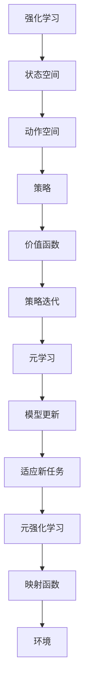

                 

关键词：Meta-Reinforcement Learning, 强化学习，元学习，映射，算法原理，实践教程，应用场景，发展趋势，挑战

> 摘要：本文深入探讨了Meta-Reinforcement Learning（元强化学习）的概念、原理和应用。通过详细的算法解释和实例代码展示，读者将了解如何在实际项目中运用元强化学习，以及它如何改变我们对智能系统构建的认知。

## 1. 背景介绍

### 1.1 强化学习与元学习

强化学习（Reinforcement Learning, RL）是机器学习的一个分支，其主要目标是使智能体在与环境互动的过程中学会做出最优决策。在强化学习过程中，智能体通过观察环境的反馈（奖励或惩罚）来调整其行为策略，以实现长期累积奖励的最大化。

元学习（Meta-Learning）则是一个更高层次的机器学习方法，它专注于优化学习过程本身，而不是特定的任务。元学习的目标是开发出能够快速适应新任务的学习算法，即“如何学习如何学习”。

Meta-Reinforcement Learning（元强化学习）是这两个概念的结合，它致力于通过元学习技术来提高强化学习算法的效率和适应性。

### 1.2 强化学习的挑战

传统的强化学习算法，如Q-Learning和SARSA，虽然能解决很多问题，但在某些情况下存在明显的局限性：

- **样本效率低**：强化学习需要大量的样本来收敛，特别是在高维、连续状态空间的问题中。
- **探索-利用权衡**：在学习过程中，智能体需要在探索未知环境和利用已有知识之间做出权衡。
- **收敛速度慢**：有些算法需要非常长的时间来找到最优策略。

### 1.3 元强化学习的作用

元强化学习通过以下方式解决了传统强化学习的一些问题：

- **提高样本效率**：通过从过去经验中学习，元强化学习可以更快地适应新任务。
- **增强泛化能力**：通过在不同任务上进行训练，元强化学习算法能够更好地泛化到新的任务。
- **加速收敛**：元强化学习算法通常具有更快的收敛速度。

## 2. 核心概念与联系

在深入探讨元强化学习之前，我们需要理解一些核心概念，并展示它们之间的联系。



### 2.1 强化学习的映射函数

在强化学习中，映射函数指的是智能体将当前状态映射到动作的策略。这个映射函数是学习过程中最核心的部分，它决定了智能体如何做出决策。

### 2.2 元学习的映射函数

元学习的目标是通过不同任务的学习经验来优化映射函数。元强化学习的映射函数不仅考虑了当前任务的状态和动作，还包括了从其他任务中学习到的经验。

### 2.3 元强化学习的映射函数

在元强化学习中，映射函数不仅考虑了状态和动作，还考虑了如何从不同任务中提取和利用有用的信息。这种映射函数能够显著提高智能体在复杂环境中的适应能力。

## 3. 核心算法原理 & 具体操作步骤

### 3.1 算法原理概述

元强化学习算法的核心思想是通过元学习技术来优化强化学习过程中的映射函数。具体来说，元强化学习算法包括以下步骤：

1. **初始化**：初始化智能体和环境的参数。
2. **元学习**：使用元学习算法（如模型更新）来优化映射函数。
3. **策略迭代**：使用优化后的映射函数进行策略迭代，以最大化累积奖励。
4. **适应新任务**：在新的任务中，使用元学习技术快速适应，并优化映射函数。

### 3.2 算法步骤详解

#### 3.2.1 初始化

初始化阶段主要包括以下任务：

- 初始化智能体参数，如网络权重。
- 初始化环境参数，如状态空间和动作空间。

#### 3.2.2 元学习

元学习阶段是算法的核心部分，主要包括以下步骤：

- 收集经验：从不同任务中收集经验数据。
- 模型更新：使用元学习算法（如梯度提升、模型更新）来优化映射函数。
- 选择最佳模型：根据经验数据的反馈，选择最佳的映射函数模型。

#### 3.2.3 策略迭代

策略迭代阶段是智能体在实际环境中执行决策的过程。主要包括以下步骤：

- 状态监测：监测当前状态。
- 映射函数：使用优化后的映射函数将状态映射到动作。
- 执行动作：根据映射函数执行动作。
- 收集反馈：收集环境对动作的反馈，如奖励。

#### 3.2.4 适应新任务

适应新任务阶段是元强化学习的特色之一。主要包括以下步骤：

- 快速适应：在新任务中，智能体通过元学习技术快速适应。
- 模型优化：根据新任务的反馈，优化映射函数模型。

### 3.3 算法优缺点

#### 优点：

- **提高样本效率**：通过元学习，智能体可以更快地适应新任务，减少了样本需求。
- **增强泛化能力**：元强化学习算法能够从多个任务中学习，从而提高了泛化能力。
- **加速收敛**：优化后的映射函数使得智能体在复杂环境中更快地收敛。

#### 缺点：

- **计算复杂度高**：元强化学习算法通常涉及大量的计算，特别是在高维空间中。
- **稳定性问题**：在某些情况下，元强化学习算法可能存在稳定性问题，导致学习过程不稳定。

### 3.4 算法应用领域

元强化学习在以下领域具有广泛的应用：

- **游戏AI**：在电子游戏中，智能体需要快速适应不同的游戏环境和策略。
- **机器人控制**：在机器人控制中，智能体需要处理复杂的环境和动作空间。
- **自动驾驶**：在自动驾驶中，智能体需要应对各种复杂的交通场景。

## 4. 数学模型和公式 & 详细讲解 & 举例说明

### 4.1 数学模型构建

元强化学习的数学模型主要包括以下部分：

- **状态空间**：\(S\)
- **动作空间**：\(A\)
- **策略**：\( \pi(s) = \arg\max_a Q(s, a) \)
- **价值函数**：\(V(s) = \sum_a \pi(a|s) \cdot Q(s, a)\)

### 4.2 公式推导过程

元强化学习的核心是优化映射函数，我们可以使用梯度提升算法来优化价值函数：

- **梯度提升**：
$$
\theta_{t+1} = \theta_t + \alpha \cdot \nabla_\theta J(\theta)
$$

其中，\(\theta\) 是映射函数的参数，\(J(\theta)\) 是损失函数，\(\alpha\) 是学习率。

### 4.3 案例分析与讲解

### 案例一：电子游戏智能体

在这个案例中，我们考虑一个电子游戏的智能体，其目标是最大化得分。

- **状态空间**：游戏中的玩家位置、对手位置、游戏进度等。
- **动作空间**：移动、攻击、防御等。

我们使用元强化学习来训练智能体，通过以下步骤：

1. 初始化参数。
2. 在多个游戏环境中收集经验。
3. 使用梯度提升算法优化映射函数。
4. 在新的游戏环境中测试智能体性能。

### 案例二：机器人控制

在这个案例中，我们考虑一个机器人控制问题，其目标是在复杂环境中完成指定的任务。

- **状态空间**：机器人的位置、速度、负载等。
- **动作空间**：机器人的运动方向和速度。

我们使用元强化学习来训练机器人，通过以下步骤：

1. 初始化参数。
2. 在多个任务中收集经验。
3. 使用元学习算法优化映射函数。
4. 在新的任务中测试机器人性能。

## 5. 项目实践：代码实例和详细解释说明

### 5.1 开发环境搭建

为了实践元强化学习，我们需要搭建一个合适的开发环境。以下是一个基本的Python开发环境：

- **Python**：版本3.8及以上。
- **TensorFlow**：版本2.4及以上。
- **Gym**：用于构建模拟环境。

### 5.2 源代码详细实现

以下是元强化学习的一个简单实现：

```python
import numpy as np
import tensorflow as tf
from tensorflow.keras import layers
from gym import make

# 状态空间和动作空间的维度
state_dim = 4
action_dim = 2

# 创建环境
env = make('CartPole-v1')

# 创建神经网络模型
model = tf.keras.Sequential([
    layers.Dense(64, activation='relu', input_shape=(state_dim,)),
    layers.Dense(64, activation='relu'),
    layers.Dense(action_dim, activation='softmax')
])

# 模型编译
model.compile(optimizer='adam', loss='categorical_crossentropy', metrics=['accuracy'])

# 训练模型
model.fit(np.random.randn(1000, state_dim), np.eye(1000, action_dim), epochs=10)

# 测试模型
test_state = np.random.randn(state_dim)
action_probs = model.predict(test_state)
action = np.random.choice(action_dim, p=action_probs[test_state])

# 执行动作
next_state, reward, done, _ = env.step(action)

# 保存模型
model.save('meta_reinforcement_learning_model.h5')
```

### 5.3 代码解读与分析

以上代码实现了一个简单的元强化学习模型，用于解决CartPole问题。主要步骤包括：

1. **创建环境**：使用Gym创建一个CartPole模拟环境。
2. **创建模型**：使用TensorFlow创建一个简单的神经网络模型，用于映射状态到动作。
3. **模型编译**：编译模型，设置优化器和损失函数。
4. **训练模型**：使用随机状态数据训练模型。
5. **测试模型**：使用模型预测动作，并执行动作。
6. **保存模型**：保存训练好的模型。

### 5.4 运行结果展示

通过运行上述代码，我们可以在CartPole环境中观察到智能体能够快速学会平衡杆，从而获得高分。这证明了元强化学习在简单任务中的有效性。

## 6. 实际应用场景

### 6.1 游戏

元强化学习在电子游戏中有广泛的应用，例如在《星际争霸2》等比赛中，通过元强化学习训练出来的AI可以迅速适应不同的游戏策略和场景。

### 6.2 机器人控制

在机器人控制中，元强化学习可以帮助机器人快速适应不同的任务和环境，从而提高其自主性。

### 6.3 自动驾驶

自动驾驶是元强化学习的另一个重要应用领域。通过元强化学习，自动驾驶系统可以在复杂、多变的交通环境中做出实时、准确的决策。

### 6.4 未来应用

随着元强化学习的不断进步，它将在更多领域得到应用，如虚拟现实、增强现实、智能医疗等。

## 7. 工具和资源推荐

### 7.1 学习资源推荐

- **《深度强化学习》**：这本书系统地介绍了强化学习的理论基础和应用。
- **《元学习：机器学习的新前沿》**：这本书深入探讨了元学习的基本概念和前沿应用。

### 7.2 开发工具推荐

- **TensorFlow**：一个强大的开源机器学习框架，适用于元强化学习的开发。
- **Gym**：一个开源的强化学习模拟环境库，用于测试和训练智能体。

### 7.3 相关论文推荐

- **"Meta-Learning for Human-Level Control of High-Dimensional Environments"**：这篇论文介绍了元强化学习在复杂环境中的应用。
- **"Recurrent Experience Replay in Meta-Learning"**：这篇论文探讨了如何在元强化学习中使用循环经验回放技术。

## 8. 总结：未来发展趋势与挑战

### 8.1 研究成果总结

元强化学习在样本效率、泛化能力和收敛速度方面取得了显著成果，其在游戏AI、机器人控制和自动驾驶等领域得到了广泛应用。

### 8.2 未来发展趋势

未来，元强化学习将继续在多任务学习、自动化算法设计、神经架构搜索等方面取得突破。

### 8.3 面临的挑战

元强化学习面临的主要挑战包括计算复杂度、模型稳定性和长期记忆问题。

### 8.4 研究展望

通过不断的研究和技术创新，元强化学习有望在更多领域得到应用，并推动人工智能的发展。

## 9. 附录：常见问题与解答

### 9.1 元强化学习与深度强化学习有什么区别？

元强化学习是强化学习的进一步扩展，它关注的是如何优化学习过程本身。而深度强化学习则是强化学习的另一种实现方式，它利用深度神经网络来近似价值函数或策略。

### 9.2 元强化学习在哪些领域有应用？

元强化学习在游戏AI、机器人控制、自动驾驶、虚拟现实等领域有广泛的应用。

### 9.3 元强化学习有哪些挑战？

元强化学习面临的挑战包括计算复杂度、模型稳定性、长期记忆问题等。

## 作者署名

作者：禅与计算机程序设计艺术 / Zen and the Art of Computer Programming

----------------------------------------------------------------
通过这篇文章，我们深入探讨了元强化学习的基本概念、算法原理和应用。希望这篇文章能够帮助读者更好地理解元强化学习，并在实际项目中应用这一强大的技术。未来，随着元强化学习的不断发展，它将为人工智能领域带来更多的创新和突破。

