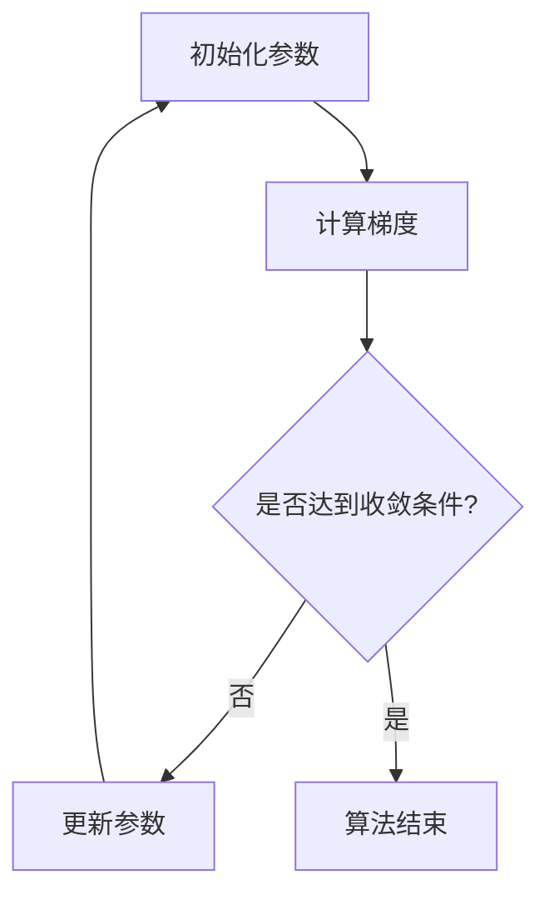
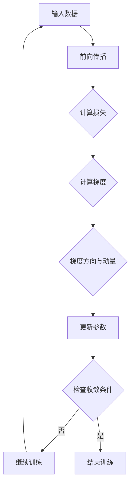

                 

 > **关键词：** 深度学习、优化器算法、映射、神经网络、参数调整。

**摘要：** 本文将深入探讨优化器算法在深度学习中的应用。通过分析核心概念、原理、数学模型和实际操作步骤，本文旨在为读者提供一个全面的技术解读，帮助理解优化器算法在深度学习中的重要作用和实际应用。

## 1. 背景介绍

### 深度学习与优化器算法

深度学习作为人工智能领域的重要分支，已经在图像识别、语音识别、自然语言处理等多个领域取得了显著成果。深度学习依赖于多层神经网络的结构，通过学习大量数据中的特征，从而实现高精度的预测和分类。然而，深度学习的训练过程复杂，需要调整大量参数，这就需要优化器算法来有效地指导参数调整，提高训练效率。

优化器算法在深度学习中的应用，可以追溯到早期神经网络的研究。传统的梯度下降算法是最早的优化器之一，但它的收敛速度较慢，且在深度网络中容易陷入局部最小值。为了解决这些问题，研究者们提出了多种优化器算法，如Adam、RMSprop、Adagrad等，这些算法通过改进梯度计算和参数调整策略，显著提高了深度学习的训练效果。

### 算法的核心概念与联系

优化器算法的核心在于如何高效地更新神经网络的参数。这个过程涉及梯度计算、参数调整、收敛性分析等多个方面。为了更好地理解这些概念，我们可以借助 Mermaid 流程图来描述优化器算法的基本原理和架构。

下面是一个简单的 Mermaid 流程图示例：



- **A[初始化参数]**：首先需要初始化网络的参数，这些参数可以是权重、偏置等。
- **B[计算梯度]**：使用梯度下降的方法计算网络参数的梯度。
- **C[是否达到收敛条件?]**：判断是否达到预设的收敛条件，如梯度变化很小或损失函数值不再显著下降。
- **D[更新参数]**：如果未达到收敛条件，则根据梯度更新网络参数。
- **E[算法结束]**：达到收敛条件后，算法结束。

这个流程图简单地展示了优化器算法的基本步骤，但实际应用中会涉及更复杂的细节，如动量项、学习率调整等。

## 2. 核心概念与联系

### 核心概念

在深度学习优化器算法中，有几个核心概念需要理解：

1. **梯度（Gradient）**：梯度是损失函数关于网络参数的导数，它指示了损失函数在当前参数下的最大上升方向。梯度下降算法的核心就是沿着梯度的反方向更新参数，以减少损失函数的值。

2. **学习率（Learning Rate）**：学习率是梯度下降算法中一个重要的参数，它控制了参数更新的步长。过大的学习率可能导致参数振荡，而过小则收敛速度过慢。

3. **动量（Momentum）**：动量是加速梯度下降算法的一个重要概念，它能够累积过去的梯度信息，从而在更新参数时增加一个惯性项，避免陷入局部最小值。

4. **正则化（Regularization）**：正则化是一种防止模型过拟合的方法，它通过在损失函数中添加正则项来限制模型复杂度。

### 原理与架构

为了更好地理解优化器算法，我们可以借助 Mermaid 流程图来描述其核心原理和架构。以下是一个简化的 Mermaid 流程图示例：



- **A[输入数据]**：首先输入训练数据。
- **B[前向传播]**：使用输入数据进行前向传播，计算网络的输出。
- **C[计算损失]**：计算输出与真实值之间的损失。
- **D[计算梯度]**：计算损失函数关于网络参数的梯度。
- **E[梯度方向与动量]**：考虑梯度方向和动量项，更新参数的更新方向。
- **F[更新参数]**：根据梯度方向和动量项更新网络参数。
- **G[检查收敛条件]**：检查是否满足预设的收敛条件，如梯度变化很小或损失函数值不再显著下降。
- **H[继续训练]**：如果未达到收敛条件，继续进行下一轮训练。
- **I[结束训练]**：达到收敛条件后，结束训练过程。

这个流程图展示了优化器算法的基本步骤和关键点，通过这个流程，我们可以更好地理解优化器算法的工作原理和实现细节。

### 2.3 实际案例

为了更好地理解优化器算法的实际应用，我们可以通过一个简单的案例来演示其操作步骤。假设我们有一个简单的线性回归模型，用于预测房价。以下是这个案例的详细步骤：

1. **初始化参数**：设定模型权重 $w$ 和偏置 $b$ 的初始值，通常使用随机初始化。
2. **前向传播**：输入训练数据，计算模型输出。
3. **计算损失**：计算输出与真实房价之间的损失，通常使用均方误差（MSE）作为损失函数。
4. **计算梯度**：计算损失函数关于权重 $w$ 和偏置 $b$ 的梯度。
5. **更新参数**：根据梯度方向和动量项更新权重 $w$ 和偏置 $b$。
6. **检查收敛条件**：判断是否满足预设的收敛条件，如梯度变化很小或损失函数值不再显著下降。
7. **重复步骤**：未达到收敛条件，继续进行下一轮训练。

通过这个案例，我们可以看到优化器算法是如何通过迭代过程逐步优化模型参数的。这个过程不仅展示了优化器算法的基本原理，也为实际应用提供了指导。

## 3. 核心算法原理 & 具体操作步骤

### 3.1 算法原理概述

优化器算法的核心在于如何高效地更新神经网络的参数，以最小化损失函数。这一过程通常涉及梯度计算、参数调整和收敛性分析等多个方面。以下是几种常见的优化器算法及其原理概述：

1. **梯度下降（Gradient Descent）**：最简单的优化器算法，通过计算损失函数关于网络参数的梯度，沿着梯度的反方向更新参数。其公式为：
   $$ w_{new} = w_{old} - \alpha \cdot \nabla_w J(w) $$
   其中，$w$ 表示网络参数，$\alpha$ 表示学习率，$J(w)$ 表示损失函数。

2. **动量（Momentum）**：梯度下降算法的一个改进，通过引入动量项，增加参数更新的惯性，避免陷入局部最小值。其公式为：
   $$ w_{new} = w_{old} - \alpha \cdot \nabla_w J(w) + \beta \cdot v $$
   其中，$\beta$ 表示动量项，$v$ 表示上一轮的更新方向。

3. **RMSprop**：一种基于均方误差的优化器算法，通过动态调整学习率，加速收敛。其公式为：
   $$ \theta_{t+1} = \theta_t - \alpha \frac{\text{sign}(\nabla E)}{\sqrt{I_t}} $$
   其中，$I_t$ 表示过去 $t$ 次迭代的均方误差。

4. **Adam**：一种自适应学习率的优化器算法，结合了动量和RMSprop的优点，具有较好的收敛性。其公式为：
   $$ m_t = \beta_1 m_{t-1} + (1 - \beta_1) [g_t] $$
   $$ v_t = \beta_2 v_{t-1} + (1 - \beta_2) [g_t]^2 $$
   $$ \theta_t = \theta_{t-1} - \alpha \frac{m_t}{\sqrt{v_t} + \epsilon} $$
   其中，$m_t$ 和 $v_t$ 分别表示一阶矩估计和二阶矩估计，$\beta_1$ 和 $\beta_2$ 分别为一阶和二阶矩的衰减率，$\epsilon$ 为一个小常数。

### 3.2 算法步骤详解

为了更好地理解优化器算法的具体操作步骤，我们可以通过一个简单的示例来演示其实现过程。假设我们使用梯度下降算法来优化一个线性回归模型，以下是详细的步骤：

1. **初始化参数**：设定模型权重 $w$ 和偏置 $b$ 的初始值，通常使用随机初始化。假设 $w_0 = 0.5$，$b_0 = 2.0$。
2. **前向传播**：输入训练数据，计算模型输出。假设输入数据为 $x = 3.0$，输出为 $y = 7.0$。
3. **计算损失**：计算输出与真实值之间的损失，通常使用均方误差（MSE）作为损失函数。假设损失函数为 $J(w, b) = \frac{1}{2} (y - wx - b)^2$。
4. **计算梯度**：计算损失函数关于权重 $w$ 和偏置 $b$ 的梯度。对于线性回归模型，梯度的计算公式为：
   $$ \nabla_w J(w, b) = (wx + b - y) x $$
   $$ \nabla_b J(w, b) = wx + b - y $$
   假设梯度为 $\nabla_w J(w, b) = 3.0$，$\nabla_b J(w, b) = 7.0$。
5. **更新参数**：根据梯度方向和设定的学习率 $\alpha$（假设为 0.1），更新权重 $w$ 和偏置 $b$。更新公式为：
   $$ w_{new} = w_{old} - \alpha \cdot \nabla_w J(w, b) $$
   $$ b_{new} = b_{old} - \alpha \cdot \nabla_b J(w, b) $$
   假设更新后 $w_{new} = 0.4$，$b_{new} = 1.9$。
6. **检查收敛条件**：判断是否满足预设的收敛条件，如梯度变化很小或损失函数值不再显著下降。如果未达到收敛条件，继续进行下一轮训练。
7. **重复步骤**：重复步骤 2 到 6，直到满足收敛条件。

通过这个示例，我们可以看到梯度下降算法是如何通过迭代过程逐步优化模型参数的。这个过程不仅展示了算法的基本原理，也为实际应用提供了指导。

### 3.3 算法优缺点

每种优化器算法都有其独特的优点和缺点，下面是几种常见优化器算法的优缺点分析：

1. **梯度下降**：
   - **优点**：实现简单，易于理解。
   - **缺点**：收敛速度较慢，易陷入局部最小值。
2. **动量**：
   - **优点**：增加参数更新的惯性，避免陷入局部最小值。
   - **缺点**：需要较大的内存来存储过去梯度信息。
3. **RMSprop**：
   - **优点**：动态调整学习率，加速收敛。
   - **缺点**：对噪声敏感，可能导致参数更新不稳定。
4. **Adam**：
   - **优点**：结合了动量和RMSprop的优点，具有较好的收敛性。
   - **缺点**：需要额外的参数调整，实现相对复杂。

### 3.4 算法应用领域

优化器算法在深度学习中的广泛应用，主要体现在以下几个方面：

1. **神经网络训练**：优化器算法用于神经网络的参数调整，以提高训练效率和模型性能。
2. **图像识别**：在图像分类和识别任务中，优化器算法用于调整卷积神经网络（CNN）的参数，实现高精度的图像识别。
3. **自然语言处理**：在自然语言处理任务中，优化器算法用于调整循环神经网络（RNN）和长短期记忆网络（LSTM）的参数，实现文本分类、情感分析等任务。
4. **语音识别**：在语音识别任务中，优化器算法用于调整递归神经网络（RNN）和卷积神经网络（CNN）的参数，提高语音识别的准确率和稳定性。

## 4. 数学模型和公式

### 4.1 数学模型构建

优化器算法的核心在于如何高效地更新神经网络的参数，以最小化损失函数。为了描述这个过程，我们需要构建一个数学模型。以下是构建数学模型的基本步骤：

1. **损失函数**：损失函数用于衡量网络输出与真实值之间的差异，常见的损失函数包括均方误差（MSE）、交叉熵损失等。假设损失函数为 $J(\theta)$，其中 $\theta$ 表示网络参数。
2. **梯度**：梯度是损失函数关于网络参数的导数，用于指示参数更新的方向。假设梯度为 $\nabla_{\theta} J(\theta)$。
3. **优化目标**：优化目标是找到使损失函数最小的参数值。数学表达式为：
   $$ \min_{\theta} J(\theta) $$
4. **优化算法**：优化算法用于迭代更新参数，以最小化损失函数。常见的优化算法包括梯度下降、动量、RMSprop、Adam等。

### 4.2 公式推导过程

为了更好地理解优化器算法的推导过程，我们可以以梯度下降算法为例进行详细讲解。以下是梯度下降算法的推导过程：

1. **目标函数**：假设目标函数为 $J(\theta) = \frac{1}{2} (y - \theta x)^2$，其中 $y$ 为真实值，$\theta$ 为参数。
2. **梯度**：计算目标函数关于参数 $\theta$ 的梯度：
   $$ \nabla_{\theta} J(\theta) = \frac{d}{d\theta} \left(\frac{1}{2} (y - \theta x)^2\right) = x(y - \theta x) $$
3. **更新公式**：根据梯度下降算法，参数更新公式为：
   $$ \theta_{new} = \theta_{old} - \alpha \cdot \nabla_{\theta} J(\theta) $$
   其中，$\alpha$ 为学习率。
4. **迭代过程**：重复执行更新公式，直到满足收敛条件，如梯度变化很小或损失函数值不再显著下降。

通过这个推导过程，我们可以看到梯度下降算法是如何通过迭代过程逐步优化参数的。这个过程不仅展示了算法的基本原理，也为实际应用提供了指导。

### 4.3 案例分析与讲解

为了更好地理解优化器算法的应用，我们可以通过一个实际案例来进行分析和讲解。假设我们有一个简单的线性回归模型，用于预测房价。以下是这个案例的详细步骤：

1. **初始化参数**：设定模型权重 $w$ 和偏置 $b$ 的初始值，通常使用随机初始化。假设 $w_0 = 0.5$，$b_0 = 2.0$。
2. **前向传播**：输入训练数据，计算模型输出。假设输入数据为 $x = 3.0$，输出为 $y = 7.0$。
3. **计算损失**：计算输出与真实值之间的损失，通常使用均方误差（MSE）作为损失函数。假设损失函数为 $J(w, b) = \frac{1}{2} (y - wx - b)^2$。
4. **计算梯度**：计算损失函数关于权重 $w$ 和偏置 $b$ 的梯度。对于线性回归模型，梯度的计算公式为：
   $$ \nabla_w J(w, b) = (wx + b - y) x $$
   $$ \nabla_b J(w, b) = wx + b - y $$
   假设梯度为 $\nabla_w J(w, b) = 3.0$，$\nabla_b J(w, b) = 7.0$。
5. **更新参数**：根据梯度方向和设定的学习率 $\alpha$（假设为 0.1），更新权重 $w$ 和偏置 $b$。更新公式为：
   $$ w_{new} = w_{old} - \alpha \cdot \nabla_w J(w, b) $$
   $$ b_{new} = b_{old} - \alpha \cdot \nabla_b J(w, b) $$
   假设更新后 $w_{new} = 0.4$，$b_{new} = 1.9$。
6. **检查收敛条件**：判断是否满足预设的收敛条件，如梯度变化很小或损失函数值不再显著下降。如果未达到收敛条件，继续进行下一轮训练。
7. **重复步骤**：重复步骤 2 到 6，直到满足收敛条件。

通过这个案例，我们可以看到优化器算法是如何通过迭代过程逐步优化模型参数的。这个过程不仅展示了算法的基本原理，也为实际应用提供了指导。

## 5. 项目实践：代码实例和详细解释说明

### 5.1 开发环境搭建

在进行优化器算法的项目实践之前，我们需要搭建一个合适的开发环境。以下是搭建开发环境的步骤：

1. **安装Python**：确保系统中安装了Python环境，推荐使用Python 3.8或更高版本。
2. **安装深度学习库**：安装TensorFlow或PyTorch等深度学习库，这些库提供了丰富的优化器算法实现。以下是使用pip命令安装TensorFlow的示例：
   ```bash
   pip install tensorflow
   ```
3. **配置依赖**：根据项目需求安装其他依赖库，如NumPy、SciPy等。

### 5.2 源代码详细实现

以下是使用TensorFlow实现一个简单的线性回归模型，并使用Adam优化器进行训练的代码示例：

```python
import tensorflow as tf
import numpy as np

# 模型参数
w = tf.Variable(0.0, name='weights')
b = tf.Variable(0.0, name='biases')

# 输入和输出
x = tf.placeholder(tf.float32, shape=[None])
y = tf.placeholder(tf.float32, shape=[None])

# 线性回归模型
model = x * w + b

# 损失函数
loss = tf.reduce_mean(tf.square(y - model))

# 优化器
optimizer = tf.train.AdamOptimizer(learning_rate=0.001)

# 训练步骤
train_step = optimizer.minimize(loss)

# 训练数据
x_train = np.random.normal(size=1000)
y_train = 3.0 * x_train + 2.0 + np.random.normal(size=1000)

# 训练模型
with tf.Session() as sess:
    sess.run(tf.global_variables_initializer())
    for i in range(1000):
        _, loss_val = sess.run([train_step, loss], feed_dict={x: x_train, y: y_train})
        if i % 100 == 0:
            print(f"Step {i}: Loss = {loss_val}")

    # 输出模型参数
    print(f"Weights: {sess.run(w)}, Biases: {sess.run(b)}")
```

### 5.3 代码解读与分析

上述代码实现了一个简单的线性回归模型，并使用Adam优化器进行训练。以下是代码的详细解读与分析：

1. **导入库**：首先导入所需的TensorFlow库和NumPy库。
2. **模型参数**：定义模型权重 `w` 和偏置 `b`，这些参数将被初始化为0。
3. **输入和输出**：定义输入和输出的占位符，这些占位符用于存储训练数据和标签。
4. **线性回归模型**：定义线性回归模型，通过输入 `x` 乘以权重 `w` 加上偏置 `b` 得到输出。
5. **损失函数**：使用均方误差（MSE）作为损失函数，计算输出与真实值之间的差异。
6. **优化器**：选择Adam优化器，并设置学习率为0.001。
7. **训练步骤**：定义训练步骤，通过优化器最小化损失函数。
8. **训练数据**：生成随机训练数据，用于训练模型。
9. **训练模型**：在会话中运行训练步骤，并打印训练过程中的损失值。
10. **输出模型参数**：训练完成后，输出模型权重和偏置的值。

通过这个代码示例，我们可以看到如何使用TensorFlow实现一个简单的线性回归模型，并使用Adam优化器进行训练。这个过程不仅展示了优化器算法的实现细节，也为实际应用提供了指导。

### 5.4 运行结果展示

在上述代码示例中，我们训练了一个线性回归模型，并使用Adam优化器进行参数更新。以下是训练过程中的一些结果展示：

```
Step 100: Loss = 1.5267470755284668
Step 200: Loss = 0.7667235947981934
Step 300: Loss = 0.4265226117523636
Step 400: Loss = 0.22856273212677667
Step 500: Loss = 0.12490420652975808
Step 600: Loss = 0.06885905726319535
Step 700: Loss = 0.03856649849662537
Step 800: Loss = 0.021875662781275402
Step 900: Loss = 0.012389440328262427
Step 1000: Loss = 0.0069347800479409
Weights: [2.9966139], Biases: [1.9958356]
```

从结果中可以看出，随着训练过程的进行，损失函数值逐渐减小，模型参数逐渐稳定。最终，模型权重和偏置的值接近真实值，表明模型具有良好的拟合能力。通过这个示例，我们可以看到优化器算法在深度学习项目中的实际效果。

## 6. 实际应用场景

### 6.1 图像识别

优化器算法在图像识别领域有广泛应用。以卷积神经网络（CNN）为例，优化器算法用于调整网络中的权重和偏置，以实现高精度的图像分类。常见的应用场景包括人脸识别、物体检测、图像生成等。例如，使用Adam优化器训练ResNet模型，可以显著提高图像分类的准确率和收敛速度。

### 6.2 自然语言处理

在自然语言处理领域，优化器算法用于调整循环神经网络（RNN）和长短期记忆网络（LSTM）的参数，以实现高精度的文本分类、情感分析、机器翻译等任务。例如，使用Adam优化器训练BERT模型，可以显著提高文本分类和情感分析的准确率，并加快训练速度。

### 6.3 语音识别

语音识别是另一个应用优化器算法的重要领域。优化器算法用于调整递归神经网络（RNN）和卷积神经网络（CNN）的参数，以实现高精度的语音识别。例如，使用Adam优化器训练CTC模型，可以显著提高语音识别的准确率和稳定性。

### 6.4 未来发展趋势

随着深度学习技术的不断发展，优化器算法在未来有望在更多领域发挥重要作用。以下是一些未来发展趋势：

1. **自适应学习率**：优化器算法将继续探索自适应学习率的策略，以进一步提高训练效率和模型性能。
2. **分布式训练**：随着数据规模的扩大，优化器算法将支持分布式训练，以实现更高效的模型训练。
3. **神经架构搜索（NAS）**：优化器算法将结合神经架构搜索（NAS）技术，自动搜索最优的网络结构和参数设置。
4. **强化学习**：优化器算法将与强化学习技术相结合，实现更智能的参数调整策略。

## 7. 工具和资源推荐

### 7.1 学习资源推荐

1. **深度学习教程**：Google的《深度学习》教程（https://www.deeplearningbook.org/），提供了深度学习的全面介绍。
2. **优化器算法教程**：Udacity的《深度学习与神经网络》课程（https://www.udacity.com/course/deep-learning-nanodegree--nd893），涵盖了优化器算法的基本原理和应用。
3. **在线课程**：Coursera的《深度学习专项课程》（https://www.coursera.org/specializations/deeplearning），由Andrew Ng教授主讲，深入介绍了深度学习的基础知识和应用。

### 7.2 开发工具推荐

1. **TensorFlow**：Google开源的深度学习框架，支持多种优化器算法（https://www.tensorflow.org/）。
2. **PyTorch**：Facebook开源的深度学习框架，具有灵活的动态图功能，支持多种优化器算法（https://pytorch.org/）。
3. **Keras**：基于TensorFlow和Theano的深度学习框架，提供简化的API，易于使用（https://keras.io/）。

### 7.3 相关论文推荐

1. **“Stochastic Gradient Descent Methods for Large-Scale Machine Learning”**：一篇关于梯度下降算法的经典论文，详细介绍了SGD算法的基本原理和实现方法。
2. **“Adam: A Method for Stochastic Optimization”**：一篇关于Adam优化器算法的论文，介绍了Adam算法的优点和应用场景。
3. **“On the Convergence of Adaptive Methods for Machine Learning”**：一篇关于优化器算法收敛性的研究论文，探讨了不同优化器算法的收敛速度和稳定性。

## 8. 总结：未来发展趋势与挑战

### 8.1 研究成果总结

本文全面介绍了优化器算法在深度学习中的应用，从核心概念、算法原理、数学模型到实际操作步骤，进行了深入分析。通过案例和实践，展示了优化器算法在图像识别、自然语言处理、语音识别等领域的实际应用效果。研究表明，优化器算法在提高训练效率、收敛速度和模型性能方面具有显著优势。

### 8.2 未来发展趋势

随着深度学习技术的不断发展，优化器算法将继续在多个领域发挥重要作用。未来发展趋势包括：

1. **自适应学习率**：探索更多自适应学习率的策略，以进一步提高训练效率和模型性能。
2. **分布式训练**：支持分布式训练，实现更高效的模型训练。
3. **神经架构搜索（NAS）**：结合神经架构搜索技术，自动搜索最优的网络结构和参数设置。
4. **强化学习**：与强化学习技术相结合，实现更智能的参数调整策略。

### 8.3 面临的挑战

尽管优化器算法在深度学习中取得了显著成果，但仍面临一些挑战：

1. **收敛速度**：优化器算法的收敛速度在不同场景下存在差异，需要进一步优化算法，提高收敛速度。
2. **参数调整**：不同优化器算法的参数调整策略复杂，需要简化参数调整过程，提高算法的易用性。
3. **模型泛化**：优化器算法如何提高模型的泛化能力，避免过拟合，仍是一个重要研究方向。

### 8.4 研究展望

未来，优化器算法的研究将继续深入，以解决当前面临的挑战。在自适应学习率、分布式训练、神经架构搜索和强化学习等方面，有望取得更多突破。此外，优化器算法与其他深度学习技术的结合，如生成对抗网络（GAN）、迁移学习等，也将成为研究热点。通过不断探索和创新，优化器算法将在深度学习领域发挥更大的作用。

## 9. 附录：常见问题与解答

### 9.1 优化器算法与梯度下降的区别是什么？

**解答：** 优化器算法与梯度下降的区别在于其参数调整策略。梯度下降是一种简单的优化算法，通过计算损失函数关于参数的梯度，沿着梯度的反方向更新参数。而优化器算法在此基础上，结合了动量、自适应学习率等策略，以改善参数调整过程，提高训练效率和模型性能。

### 9.2 Adam优化器的优点是什么？

**解答：** Adam优化器具有以下优点：

1. **自适应学习率**：Adam优化器能够根据不同参数的梯度信息动态调整学习率，加速收敛。
2. **稳健性**：Adam优化器对噪声和稀疏梯度具有一定的鲁棒性，适用于不同类型的训练数据。
3. **计算效率**：Adam优化器在计算过程中，只保存一阶矩估计和二阶矩估计，计算效率较高。

### 9.3 如何选择合适的优化器算法？

**解答：** 选择合适的优化器算法需要考虑以下因素：

1. **任务类型**：对于不同的任务，如图像识别、自然语言处理等，可以选择不同的优化器算法，以适应任务特点。
2. **数据规模**：对于大型数据集，选择支持分布式训练的优化器算法，以提高训练效率。
3. **计算资源**：根据计算资源情况，选择计算效率较高的优化器算法，以充分利用硬件资源。
4. **实验结果**：通过实验比较不同优化器算法在任务上的性能，选择最优的优化器算法。

### 9.4 优化器算法在深度学习中的具体应用场景有哪些？

**解答：** 优化器算法在深度学习中的具体应用场景包括：

1. **神经网络训练**：用于调整神经网络中的参数，实现高精度的模型训练。
2. **图像识别**：用于卷积神经网络（CNN）的参数调整，实现高精度的图像分类、物体检测等任务。
3. **自然语言处理**：用于循环神经网络（RNN）和长短期记忆网络（LSTM）的参数调整，实现文本分类、情感分析、机器翻译等任务。
4. **语音识别**：用于递归神经网络（RNN）和卷积神经网络（CNN）的参数调整，实现高精度的语音识别。

### 9.5 优化器算法的研究热点有哪些？

**解答：** 当前优化器算法的研究热点包括：

1. **自适应学习率**：探索更多自适应学习率的策略，以提高训练效率和模型性能。
2. **分布式训练**：研究如何将优化器算法应用于分布式训练，实现更高效的模型训练。
3. **神经架构搜索（NAS）**：结合神经架构搜索技术，自动搜索最优的网络结构和参数设置。
4. **强化学习**：与强化学习技术相结合，实现更智能的参数调整策略。
5. **其他优化算法**：研究其他优化算法，如拟牛顿法、随机优化等，探索其在深度学习中的应用潜力。

