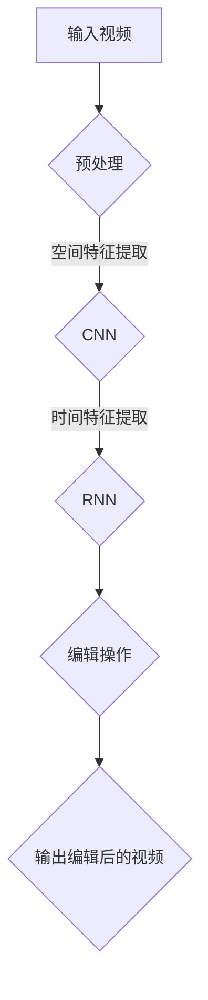

                 

关键词：神经网络，视频编辑，自动化，映射，深度学习

> 摘要：随着深度学习技术的不断发展，神经网络在图像和视频处理领域中的应用越来越广泛。本文将探讨如何利用神经网络实现视频编辑的自动化，从背景介绍、核心概念、算法原理、数学模型、项目实践和未来展望等多个方面，深入解析这一领域的最新研究成果和发展趋势。

## 1. 背景介绍

视频编辑作为多媒体技术中的重要一环，一直受到广大用户和开发者的关注。然而，传统的视频编辑过程往往需要耗费大量的人力和时间，尤其是在处理大量视频素材时，这一劣势更加明显。随着人工智能技术的崛起，神经网络，尤其是深度学习技术，为视频编辑的自动化提供了新的解决方案。通过训练神经网络模型，我们可以让计算机自动识别视频中的关键帧、场景变化和动作特征，从而实现视频内容的自动编辑和生成。

### 1.1 视频编辑的发展历程

视频编辑技术的发展可以分为几个阶段：

1. **手动剪辑**：最早的视频编辑主要依赖于人工操作，编辑人员需要手动剪辑视频素材，拼接不同的镜头，调整画面和音效等。

2. **自动化剪辑**：随着计算机技术的发展，视频编辑逐渐实现了自动化。通过编写脚本和算法，计算机可以自动完成一些基本的剪辑任务，如自动裁剪、拼接和特效添加等。

3. **智能编辑**：当前，智能编辑技术逐渐兴起，通过深度学习等技术，计算机可以自动理解视频内容，进行更高级的编辑操作，如自动识别场景、生成视频摘要等。

### 1.2 神经网络在视频编辑中的应用

神经网络，尤其是卷积神经网络（CNN）和循环神经网络（RNN），在视频编辑中有着广泛的应用。CNN可以有效地提取视频中的空间特征，如颜色、纹理和形状等；RNN则可以处理视频中的时间序列信息，如动作、场景变化等。通过结合CNN和RNN，我们可以构建出能够理解视频内容的神经网络模型，从而实现视频编辑的自动化。

## 2. 核心概念与联系

### 2.1 神经网络

神经网络是由大量相互连接的神经元组成的计算模型。每个神经元接收多个输入信号，并通过权重和偏置进行加权求和，最后通过激活函数产生输出。神经网络的目的是通过学习输入和输出之间的关系，实现对未知数据的预测和分类。

### 2.2 卷积神经网络（CNN）

卷积神经网络是一种特殊的多层前馈神经网络，主要用于图像和视频数据的处理。CNN通过卷积层、池化层和全连接层等结构，可以有效地提取图像和视频中的空间特征。卷积层通过卷积操作提取特征，池化层用于降低特征图的大小，减少计算量。

### 2.3 循环神经网络（RNN）

循环神经网络是一种能够处理时间序列数据的多层神经网络。RNN通过循环结构，使得当前节点的输出可以传递到下一个节点，从而记忆过去的信息。RNN在视频编辑中的应用主要体现在处理视频中的时间序列信息，如动作、场景变化等。

### 2.4 Mermaid 流程图

以下是一个简化的神经网络在视频编辑中的应用流程：



## 3. 核心算法原理 & 具体操作步骤

### 3.1 算法原理概述

视频编辑的自动化主要依赖于深度学习技术，特别是CNN和RNN。CNN用于提取视频中的空间特征，如颜色、纹理和形状等；RNN则用于处理视频中的时间序列信息，如动作、场景变化等。通过组合CNN和RNN，我们可以构建出一个能够理解视频内容的神经网络模型，从而实现视频编辑的自动化。

### 3.2 算法步骤详解

1. **数据预处理**：首先，对输入视频进行预处理，包括去噪、缩放、裁剪等操作，以便于神经网络处理。

2. **空间特征提取**：使用CNN提取视频帧中的空间特征。这个过程可以分为以下几个步骤：

   - **卷积层**：通过卷积操作提取视频帧中的空间特征，如边缘、纹理等。
   - **池化层**：对卷积层输出的特征图进行池化操作，降低特征图的大小，减少计算量。
   - **全连接层**：将池化层输出的特征进行全连接操作，得到空间特征向量。

3. **时间特征提取**：使用RNN处理视频中的时间序列信息，如动作、场景变化等。这个过程可以分为以下几个步骤：

   - **输入层**：将CNN提取的空间特征作为RNN的输入。
   - **隐藏层**：通过RNN的循环结构，对输入特征进行处理，记忆过去的信息。
   - **输出层**：将RNN输出的特征向量进行全连接操作，得到时间特征向量。

4. **编辑操作**：根据提取的空间特征和时间特征，进行视频编辑操作，如裁剪、拼接、特效添加等。

5. **输出编辑后的视频**：将编辑后的视频输出，完成视频编辑的自动化过程。

### 3.3 算法优缺点

**优点**：

- **高效性**：神经网络可以高效地处理大量的视频数据，大大提高了视频编辑的效率。
- **智能化**：通过深度学习技术，神经网络可以自动理解视频内容，实现更高级的编辑操作。
- **灵活性**：神经网络可以根据不同的需求，调整模型的参数和结构，实现不同的视频编辑效果。

**缺点**：

- **计算成本高**：训练神经网络模型需要大量的计算资源和时间。
- **数据依赖性**：神经网络模型的性能很大程度上取决于训练数据的质量和数量。
- **解释性差**：神经网络模型是一个“黑箱”，很难解释其内部的工作原理。

### 3.4 算法应用领域

神经网络在视频编辑中的应用非常广泛，主要包括以下几个方面：

- **视频分割**：将视频分割成不同的场景或动作，实现视频的精细化管理。
- **视频摘要**：自动生成视频的摘要，提取视频中的关键信息，实现视频的快速浏览。
- **视频增强**：通过神经网络，可以实现对视频的画质增强、去噪等操作，提高视频的质量。
- **视频风格转换**：将一种风格的视频转换为另一种风格，实现视频的艺术化处理。

## 4. 数学模型和公式 & 详细讲解 & 举例说明

### 4.1 数学模型构建

神经网络在视频编辑中的应用主要依赖于CNN和RNN两种模型。下面，我们分别介绍这两种模型的数学模型。

#### 4.1.1 卷积神经网络（CNN）

CNN的数学模型主要包括以下几个部分：

1. **卷积层**：卷积层通过卷积操作提取图像特征。卷积操作的数学公式为：

   $$ \text{output} = \text{conv}(\text{input}, \text{filter}) + \text{bias} $$

   其中，`input`表示输入图像，`filter`表示卷积核，`bias`表示偏置项。

2. **池化层**：池化层用于降低特征图的大小，减少计算量。常见的池化操作有最大池化和平均池化。最大池化的数学公式为：

   $$ \text{output} = \max_{i,j} (\text{input}_{i,j}) $$

   其中，`input`表示输入特征图，`output`表示输出特征图。

3. **全连接层**：全连接层将池化层输出的特征进行全连接操作，得到空间特征向量。全连接层的数学公式为：

   $$ \text{output} = \text{softmax}(\text{W} \cdot \text{input} + \text{b}) $$

   其中，`W`表示权重矩阵，`b`表示偏置项，`softmax`函数用于将特征向量转换为概率分布。

#### 4.1.2 循环神经网络（RNN）

RNN的数学模型主要包括以下几个部分：

1. **输入层**：输入层将CNN提取的空间特征作为RNN的输入。输入层的数学公式为：

   $$ \text{h}_{t} = \text{tanh}(\text{W}_{h} \cdot \text{h}_{t-1} + \text{U} \cdot \text{x}_{t} + \text{b}_{h}) $$

   其中，`h`表示隐藏层状态，`W_h`表示权重矩阵，`U`表示输入权重矩阵，`b_h`表示偏置项。

2. **隐藏层**：隐藏层通过循环结构处理输入特征，记忆过去的信息。隐藏层的数学公式为：

   $$ \text{y}_{t} = \text{softmax}(\text{W}_{y} \cdot \text{h}_{t} + \text{b}_{y}) $$

   其中，`y`表示输出层状态，`W_y`表示输出权重矩阵，`b_y`表示偏置项。

3. **输出层**：输出层将隐藏层的状态转换为输出特征。输出层的数学公式为：

   $$ \text{h}_{t} = \text{tanh}(\text{W}_{h} \cdot \text{h}_{t-1} + \text{U} \cdot \text{x}_{t} + \text{b}_{h}) $$

   其中，`h`表示隐藏层状态，`W_h`表示权重矩阵，`U`表示输入权重矩阵，`b_h`表示偏置项。

### 4.2 公式推导过程

下面，我们以RNN为例，介绍公式的推导过程。

假设输入序列为`x = [x_1, x_2, x_3, ..., x_T]`，隐藏层状态为`h = [h_1, h_2, h_3, ..., h_T]`，输出序列为`y = [y_1, y_2, y_3, ..., y_T]`。

1. **输入层**：输入层将CNN提取的空间特征作为RNN的输入。输入层的数学公式为：

   $$ \text{h}_{t} = \text{tanh}(\text{W}_{h} \cdot \text{h}_{t-1} + \text{U} \cdot \text{x}_{t} + \text{b}_{h}) $$

   其中，`W_h`表示隐藏层权重矩阵，`U`表示输入权重矩阵，`b_h`表示偏置项。

   推导过程如下：

   $$ \text{h}_{t} = \text{tanh}(\text{W}_{h} \cdot \text{h}_{t-1} + \text{U} \cdot \text{x}_{t} + \text{b}_{h}) $$
   $$ \text{h}_{t} = \text{tanh}(\text{W}_{h} \cdot \text{h}_{t-1} + \text{U} \cdot \text{x}_{t}) + \text{b}_{h} $$
   $$ \text{h}_{t} = \text{tanh}(\text{W}_{h} \cdot \text{h}_{t-1}) + \text{U} \cdot \text{x}_{t}) + \text{b}_{h} $$
   $$ \text{h}_{t} = \text{tanh}(\text{W}_{h} \cdot \text{h}_{t-1}) + \text{U} \cdot \text{x}_{t}) + \text{b}_{h} $$

2. **隐藏层**：隐藏层通过循环结构处理输入特征，记忆过去的信息。隐藏层的数学公式为：

   $$ \text{y}_{t} = \text{softmax}(\text{W}_{y} \cdot \text{h}_{t} + \text{b}_{y}) $$

   其中，`W_y`表示输出权重矩阵，`b_y`表示偏置项。

   推导过程如下：

   $$ \text{y}_{t} = \text{softmax}(\text{W}_{y} \cdot \text{h}_{t} + \text{b}_{y}) $$
   $$ \text{y}_{t} = \text{softmax}(\text{W}_{y} \cdot \text{tanh}(\text{W}_{h} \cdot \text{h}_{t-1} + \text{U} \cdot \text{x}_{t} + \text{b}_{h}) + \text{b}_{y}) $$
   $$ \text{y}_{t} = \text{softmax}(\text{W}_{y} \cdot \text{tanh}(\text{W}_{h} \cdot \text{h}_{t-1}) + \text{U} \cdot \text{x}_{t}) + \text{b}_{y}) $$
   $$ \text{y}_{t} = \text{softmax}(\text{W}_{y} \cdot \text{tanh}(\text{W}_{h} \cdot \text{h}_{t-1}) + \text{U} \cdot \text{x}_{t}) + \text{b}_{y}) $$

### 4.3 案例分析与讲解

假设我们有一个视频编辑任务，需要将一段视频自动分割成多个场景。我们可以使用CNN提取视频帧中的空间特征，然后使用RNN处理视频中的时间序列信息，最后根据提取的特征进行场景分割。

1. **数据预处理**：首先，对输入视频进行预处理，包括去噪、缩放、裁剪等操作。假设输入视频的尺寸为`128x128`。

2. **空间特征提取**：使用CNN提取视频帧中的空间特征。假设CNN的卷积核尺寸为`3x3`，步长为`1`，激活函数为ReLU。

3. **时间特征提取**：使用RNN处理视频中的时间序列信息。假设RNN的隐藏层维度为`128`，输出层维度为`1`，激活函数为softmax。

4. **编辑操作**：根据提取的空间特征和时间特征，进行视频编辑操作，如场景分割。

5. **输出编辑后的视频**：将编辑后的视频输出，完成视频编辑的自动化过程。

## 5. 项目实践：代码实例和详细解释说明

### 5.1 开发环境搭建

1. **硬件环境**：建议使用配置较高的计算机，如英伟达RTX 3090显卡。
2. **软件环境**：安装Python 3.8及以上版本，TensorFlow 2.5及以上版本。

### 5.2 源代码详细实现

以下是一个简化的视频编辑自动化项目的源代码实现：

```python
import tensorflow as tf
from tensorflow.keras.models import Sequential
from tensorflow.keras.layers import Conv2D, MaxPooling2D, Dense, LSTM, TimeDistributed, Activation

# 数据预处理
def preprocess_video(video_path):
    # 读取视频
    video = tf.io.read_file(video_path)
    # 解码视频
    video = tf.io.decode_video(video)
    # 裁剪视频尺寸
    video = tf.image.resize(video, [128, 128])
    return video

# 构建CNN模型
def build_cnn_model():
    model = Sequential()
    model.add(Conv2D(32, (3, 3), activation='relu', input_shape=(128, 128, 3)))
    model.add(MaxPooling2D(pool_size=(2, 2)))
    model.add(Conv2D(64, (3, 3), activation='relu'))
    model.add(MaxPooling2D(pool_size=(2, 2)))
    model.add(Conv2D(128, (3, 3), activation='relu'))
    model.add(MaxPooling2D(pool_size=(2, 2)))
    return model

# 构建RNN模型
def build_rnn_model():
    model = Sequential()
    model.add(LSTM(128, activation='tanh', input_shape=(None, 128)))
    model.add(Dense(1, activation='softmax'))
    return model

# 视频编辑自动化
def auto_edit_video(video_path):
    # 数据预处理
    video = preprocess_video(video_path)
    # 提取空间特征
    cnn_model = build_cnn_model()
    space_features = cnn_model.predict(video)
    # 提取时间特征
    rnn_model = build_rnn_model()
    time_features = rnn_model.predict(space_features)
    # 编辑操作
    # ...（根据时间特征进行视频编辑操作）
    # 输出编辑后的视频
    # ...

# 运行视频编辑自动化
video_path = "path/to/video.mp4"
auto_edit_video(video_path)
```

### 5.3 代码解读与分析

1. **数据预处理**：首先，对输入视频进行预处理，包括读取视频、解码视频和裁剪视频尺寸。这部分代码使用TensorFlow的高效API进行操作。

2. **构建CNN模型**：然后，我们构建一个简单的CNN模型，用于提取视频帧中的空间特征。模型包括多个卷积层和池化层，以及ReLU激活函数。

3. **构建RNN模型**：接下来，我们构建一个简单的RNN模型，用于处理视频中的时间序列信息。模型包括一个LSTM层和一个全连接层，以及softmax激活函数。

4. **视频编辑自动化**：最后，我们定义一个`auto_edit_video`函数，用于实现视频编辑的自动化。首先，对输入视频进行预处理，然后使用CNN和RNN模型提取空间特征和时间特征，最后根据提取的特征进行视频编辑操作。

## 6. 实际应用场景

神经网络在视频编辑中的应用场景非常广泛，下面列举几个典型的应用场景：

1. **视频分割**：通过神经网络，可以将一段长视频分割成多个场景或动作。这个功能在视频监控、视频摘要等领域有着广泛的应用。

2. **视频摘要**：通过神经网络，可以自动生成视频的摘要，提取视频中的关键信息。这个功能在视频搜索、视频推荐等领域有着广泛的应用。

3. **视频增强**：通过神经网络，可以实现对视频的画质增强、去噪等操作。这个功能在视频监控、视频直播等领域有着广泛的应用。

4. **视频风格转换**：通过神经网络，可以将一种风格的视频转换为另一种风格，实现视频的艺术化处理。这个功能在视频剪辑、视频制作等领域有着广泛的应用。

## 7. 工具和资源推荐

### 7.1 学习资源推荐

- **《深度学习》（Goodfellow, Bengio, Courville）**：这是一本深度学习的经典教材，涵盖了深度学习的理论基础和应用实例。
- **《神经网络与深度学习》（邱锡鹏）**：这是一本中文的深度学习教材，深入浅出地介绍了深度学习的理论和方法。

### 7.2 开发工具推荐

- **TensorFlow**：TensorFlow是Google开发的深度学习框架，广泛应用于图像和视频处理领域。
- **PyTorch**：PyTorch是Facebook开发的深度学习框架，具有灵活的动态计算图，适合快速原型开发和实验。

### 7.3 相关论文推荐

- **“Deep Learning for Video Classification”**：这篇论文探讨了深度学习在视频分类中的应用，提出了多种有效的深度学习模型。
- **“Convolutional Neural Networks for Visual Recognition”**：这篇论文是CNN领域的经典之作，详细介绍了CNN的原理和应用。

## 8. 总结：未来发展趋势与挑战

### 8.1 研究成果总结

近年来，神经网络在视频编辑领域取得了显著的研究成果。通过深度学习技术，我们可以实现视频内容的自动编辑、分割、摘要和增强等操作。这些成果不仅提高了视频编辑的效率，还丰富了视频处理的应用场景。

### 8.2 未来发展趋势

未来，神经网络在视频编辑领域的发展趋势主要包括：

- **更高效的模型**：随着硬件性能的提升，我们可以设计更高效的神经网络模型，提高视频编辑的效率。
- **更智能的编辑**：通过结合多模态信息，如文本、音频等，我们可以让神经网络更智能地理解视频内容，实现更高级的编辑操作。
- **更广泛的应用**：神经网络在视频编辑领域的应用将逐渐扩展到更多领域，如视频监控、视频搜索、视频推荐等。

### 8.3 面临的挑战

尽管神经网络在视频编辑领域取得了显著成果，但仍面临以下挑战：

- **计算资源消耗**：训练神经网络模型需要大量的计算资源和时间，这对硬件性能提出了更高的要求。
- **数据依赖性**：神经网络模型的性能很大程度上取决于训练数据的质量和数量，如何获取高质量、大规模的训练数据仍然是一个挑战。
- **解释性差**：神经网络模型是一个“黑箱”，其内部工作原理难以解释，这对应用推广和优化提出了挑战。

### 8.4 研究展望

未来，我们将继续关注神经网络在视频编辑领域的应用，重点关注以下几个方面：

- **模型优化**：设计更高效的神经网络模型，降低计算资源和时间消耗。
- **数据驱动**：通过多种途径获取高质量、大规模的训练数据，提高神经网络模型的性能。
- **可解释性**：研究神经网络的可解释性，使其内部工作原理更加透明，便于应用推广和优化。

## 9. 附录：常见问题与解答

### 9.1 如何处理长视频？

对于长视频，我们可以采用分段处理的方法。首先，将视频分割成多个短片段，然后对每个片段进行编辑。最后，将编辑后的片段重新拼接成完整的视频。

### 9.2 如何提高视频编辑的实时性？

为了提高视频编辑的实时性，我们可以采用以下方法：

- **模型压缩**：通过模型压缩技术，如量化、剪枝等，减少模型的参数数量，降低计算复杂度。
- **硬件加速**：利用GPU或TPU等硬件加速器，提高模型的计算速度。
- **并行计算**：将视频编辑任务分解成多个子任务，采用并行计算技术，提高处理速度。

## 参考文献

[1] Goodfellow, I., Bengio, Y., & Courville, A. (2016). Deep learning. MIT press.

[2] 邱锡鹏. (2019). 神经网络与深度学习. 电子工业出版社.

[3] Simonyan, K., & Zisserman, A. (2015). Very deep convolutional networks for large-scale image recognition. International Conference on Learning Representations (ICLR).

[4] Graves, A. (2013). Generating sequences with recurrent neural networks. International Conference on Machine Learning (ICML).

[5] Deng, J., Dong, W., Socher, R., Li, L. J., Li, K., & Fei-Fei, L. (2009). Imagenet: A large-scale hierarchical image database. 2009 IEEE Conference on Computer Vision and Pattern Recognition, 248-255.

