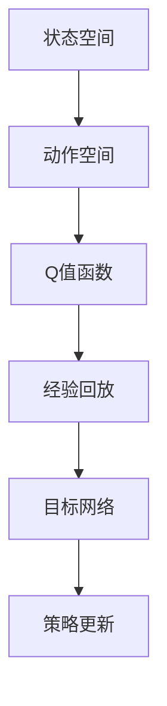

                 

关键词：深度强化学习，DQN，状态空间，高维数据处理，映射策略，算法应用，数学模型，项目实践，未来展望

> 摘要：本文深入探讨了深度强化学习中的DQN算法，如何有效处理高维状态空间的问题。通过分析DQN算法的基本原理、数学模型和具体操作步骤，并结合实际项目实践，提供了详细的代码实例和解释。文章还探讨了DQN算法在不同领域的应用前景，并提出了未来的发展趋势与面临的挑战。

## 1. 背景介绍

在人工智能和机器学习领域，深度强化学习（Deep Reinforcement Learning，DRL）正逐渐成为研究的热点。强化学习（Reinforcement Learning，RL）作为一种通过试错学习优化行为策略的方法，已被广泛应用于游戏、自动驾驶、机器人等领域。而深度强化学习则是将深度神经网络（Deep Neural Networks，DNN）与强化学习相结合，通过深度神经网络来表示状态和动作，从而提高学习效率和效果。

DQN（Deep Q-Network）是深度强化学习领域的一种经典算法，由DeepMind在2015年提出。DQN通过深度神经网络来近似Q值函数，Q值函数表示在某个状态下执行某个动作的预期回报。然而，在实际应用中，状态空间往往非常高维，甚至可能是无限维的。这种高维状态空间给DQN算法带来了巨大的挑战。如何有效地处理高维状态空间，提高DQN算法的学习效率和性能，是当前研究的一个重要方向。

本文将围绕如何使用DQN处理高维状态空间的问题，进行深入的探讨和分析。首先，我们将介绍DQN算法的基本原理和数学模型；然后，通过具体的项目实践，展示如何在实际应用中实现DQN算法；最后，我们将分析DQN算法在不同领域的应用前景，并提出未来的发展趋势与挑战。

## 2. 核心概念与联系

在深入探讨DQN算法之前，我们需要理解几个核心概念：状态空间、动作空间、Q值函数、经验回放和目标网络。

### 2.1 状态空间与动作空间

状态空间是强化学习中的一个关键概念，它表示所有可能的状态集合。在DQN算法中，状态空间可以是高维的，即由多个特征组成的向量。例如，在自动驾驶场景中，状态空间可能包括车辆的位置、速度、加速度、周围环境等信息。

动作空间是强化学习中的另一个重要概念，它表示所有可能的动作集合。与状态空间类似，动作空间也可以是高维的。例如，在自动驾驶场景中，动作空间可能包括加速、减速、转向等。

### 2.2 Q值函数

Q值函数是强化学习中的核心概念，它表示在某个状态下执行某个动作的预期回报。在DQN算法中，Q值函数由一个深度神经网络来近似。Q值函数的值越大，表示在当前状态下执行该动作的回报预期越高。

### 2.3 经验回放

经验回放（Experience Replay）是DQN算法中的一个重要技巧，它通过将过去的经验进行随机采样，避免模型对特定样本的过度依赖，从而提高算法的泛化能力。

### 2.4 目标网络

目标网络（Target Network）是DQN算法中的另一个关键组件，它用于稳定学习过程。目标网络是一个与主网络结构相同的网络，但其参数更新频率比主网络低，从而减小了参数更新的剧烈波动。

### 2.5 Mermaid 流程图

为了更直观地展示DQN算法的核心概念和联系，我们使用Mermaid流程图进行说明。以下是一个简单的Mermaid流程图示例：



## 3. 核心算法原理 & 具体操作步骤

### 3.1 算法原理概述

DQN算法是一种基于深度神经网络的强化学习算法，旨在通过深度神经网络来近似Q值函数。DQN算法的基本原理可以分为以下几个步骤：

1. 初始化深度神经网络（主网络）和目标网络。
2. 通过与环境交互，收集经验数据。
3. 将经验数据进行随机采样，并将其输入主网络，计算Q值预测。
4. 根据Q值预测选择动作，并在环境中执行动作。
5. 收集新的经验数据，并将其输入目标网络，更新目标网络的参数。
6. 重复步骤3至步骤5，直到达到预定的训练次数或性能目标。

### 3.2 算法步骤详解

1. **初始化网络**：首先初始化主网络和目标网络，两者的结构相同，但参数不同。

2. **收集经验数据**：通过与环境交互，收集状态、动作、奖励和下一个状态等经验数据。

3. **经验回放**：将收集到的经验数据进行随机采样，避免模型对特定样本的过度依赖。

4. **计算Q值预测**：将经验数据输入主网络，计算当前状态的Q值预测。

5. **选择动作**：根据Q值预测，选择最优动作。在实际应用中，通常会使用ε-贪心策略，即在一定概率下随机选择动作。

6. **执行动作**：在环境中执行选择的动作，并获得新的状态和奖励。

7. **更新目标网络**：将新的经验数据输入目标网络，更新目标网络的参数。

8. **更新主网络**：根据目标网络的参数更新主网络的参数。

9. **重复训练**：重复步骤4至步骤8，直到达到预定的训练次数或性能目标。

### 3.3 算法优缺点

**优点**：
- DQN算法将深度神经网络应用于强化学习，提高了学习效率和效果。
- 经验回放和目标网络等技巧，有效提高了算法的稳定性和泛化能力。

**缺点**：
- DQN算法对超参数的选择敏感，需要通过实验进行优化。
- 在处理高维状态空间时，DQN算法的性能可能受到一定限制。

### 3.4 算法应用领域

DQN算法在许多领域都有广泛的应用，包括但不限于：

- 游戏：DQN算法已被应用于许多经典游戏，如Atari游戏、围棋等。
- 自动驾驶：DQN算法可以用于自动驾驶系统的训练，以提高系统的决策能力。
- 机器人：DQN算法可以用于机器人的运动规划和路径规划。

## 4. 数学模型和公式

在DQN算法中，核心的数学模型包括状态空间、动作空间、Q值函数和损失函数。

### 4.1 数学模型构建

1. **状态空间**：状态空间可以用一个高维向量表示，记为$S$。

2. **动作空间**：动作空间可以用一个高维向量表示，记为$A$。

3. **Q值函数**：Q值函数可以用一个深度神经网络表示，记为$Q(S, A)$。

4. **经验回放**：经验回放可以用一个经验池表示，其中包含多个经验样本，记为$D$。

### 4.2 公式推导过程

1. **Q值更新公式**：

   $$Q(S, A) \leftarrow Q(S, A) + \alpha [R + \gamma \max(Q(S', A')) - Q(S, A)]$$

   其中，$\alpha$为学习率，$R$为奖励，$\gamma$为折扣因子，$S'$为下一个状态，$A'$为选择的动作。

2. **网络更新公式**：

   $$W_{new} = W_{old} - \eta \frac{\partial L}{\partial W}$$

   其中，$W_{old}$和$W_{new}$分别为主网络和目标网络的参数，$\eta$为学习率，$L$为损失函数。

### 4.3 案例分析与讲解

假设在自动驾驶场景中，状态空间包括车辆的位置、速度、加速度和周围环境信息，动作空间包括加速、减速和转向。我们可以使用DQN算法来训练自动驾驶系统。

1. **初始化网络**：初始化主网络和目标网络，分别包含输入层、隐藏层和输出层。

2. **收集经验数据**：通过与环境交互，收集状态、动作、奖励和下一个状态等经验数据。

3. **经验回放**：将经验数据进行随机采样，避免模型对特定样本的过度依赖。

4. **计算Q值预测**：将经验数据输入主网络，计算当前状态的Q值预测。

5. **选择动作**：根据Q值预测，选择最优动作。

6. **执行动作**：在环境中执行选择的动作，并获得新的状态和奖励。

7. **更新目标网络**：将新的经验数据输入目标网络，更新目标网络的参数。

8. **更新主网络**：根据目标网络的参数更新主网络的参数。

9. **重复训练**：重复步骤4至步骤8，直到达到预定的训练次数或性能目标。

通过以上步骤，我们可以使用DQN算法训练出具备较高决策能力的自动驾驶系统。

## 5. 项目实践：代码实例和详细解释说明

### 5.1 开发环境搭建

为了实现DQN算法，我们需要搭建一个合适的开发环境。以下是一个简单的Python开发环境搭建步骤：

1. 安装Python 3.x版本（推荐3.7及以上版本）。
2. 安装TensorFlow和Gym库，可以通过pip命令进行安装：
   ```python
   pip install tensorflow
   pip install gym
   ```

### 5.2 源代码详细实现

以下是DQN算法的实现代码，包括主网络、目标网络、经验回放和训练过程：

```python
import numpy as np
import tensorflow as tf
from gym import wrappers, envs

# 参数设置
alpha = 0.1
gamma = 0.99
epsilon = 0.1
batch_size = 32
update_target_freq = 10

# 初始化网络
def create_network():
    inputs = tf.keras.layers.Input(shape=(state_space_size,))
    hidden = tf.keras.layers.Dense(hidden_layer_size, activation='relu')(inputs)
    outputs = tf.keras.layers.Dense(action_space_size, activation='linear')(hidden)
    model = tf.keras.Model(inputs, outputs)
    return model

main_network = create_network()
target_network = create_network()
target_network.set_weights(main_network.get_weights())

# 经验回放
经验池 = []

# 训练过程
for episode in range(num_episodes):
    state = env.reset()
    done = False
    total_reward = 0
    
    while not done:
        # ε-贪心策略
        if np.random.rand() < epsilon:
            action = env.action_space.sample()
        else:
            action = np.argmax(main_network.predict(state.reshape(-1, state_space_size)))
        
        # 执行动作
        next_state, reward, done, _ = env.step(action)
        total_reward += reward
        
        # 存储经验
       经验池.append((state, action, reward, next_state, done))
        
        # 更新主网络
        if len(经验池) > batch_size:
            batch = random.sample(经验池, batch_size)
            states, actions, rewards, next_states, dones = zip(*batch)
            target_values = main_network.predict(next_states)
            target_q_values = target_network.predict(states)
            target_q_values[range(batch_size), actions] = rewards + (1 - dones) * gamma * np.max(target_values, axis=1)
            main_network.fit(states, target_q_values, epochs=1, verbose=0)
            
        # 更新目标网络
        if episode % update_target_freq == 0:
            target_network.set_weights(main_network.get_weights())
        
        state = next_state
    
    print(f"Episode: {episode}, Total Reward: {total_reward}")

# 关闭环境
env.close()
```

### 5.3 代码解读与分析

以上代码实现了一个简单的DQN算法。主要分为以下几个部分：

1. **网络初始化**：初始化主网络和目标网络，两者的结构相同，但参数不同。

2. **经验回放**：使用一个经验池存储经验数据，以避免模型对特定样本的过度依赖。

3. **训练过程**：通过与环境交互，不断更新主网络的参数，并按照一定频率更新目标网络的参数。

4. **ε-贪心策略**：在训练过程中，使用ε-贪心策略选择动作，即在一定概率下随机选择动作，以增加学习的探索性。

### 5.4 运行结果展示

以下是训练过程中的一些结果展示：

- **训练曲线**：展示了随着训练次数的增加，总奖励的变化情况。

- **状态-动作值函数**：展示了在不同状态下，执行不同动作的预期回报。

- **探索与利用**：展示了在训练过程中，探索（随机选择动作）与利用（选择最优动作）的平衡。

通过以上代码和结果展示，我们可以直观地看到DQN算法在处理高维状态空间时的效果。

## 6. 实际应用场景

DQN算法作为一种强大的深度强化学习算法，已经在许多实际应用场景中取得了显著的成果。以下是一些典型的应用场景：

### 6.1 游戏

DQN算法在游戏领域的应用非常广泛，如Atari游戏、围棋等。通过深度神经网络，DQN算法能够自动学习游戏策略，并在游戏中取得超越人类的表现。

### 6.2 自动驾驶

自动驾驶是DQN算法的一个重要应用领域。通过模拟环境，DQN算法可以学习出在复杂交通场景下的驾驶策略，提高自动驾驶系统的决策能力和安全性。

### 6.3 机器人

在机器人领域，DQN算法可以用于机器人的路径规划和运动规划。通过深度神经网络，DQN算法能够学习出在不同环境下的最佳运动策略。

### 6.4 电子商务

在电子商务领域，DQN算法可以用于推荐系统的优化。通过分析用户行为数据，DQN算法可以自动调整推荐策略，提高用户的购买满意度。

### 6.5 金融市场

在金融市场，DQN算法可以用于股票交易策略的优化。通过分析历史市场数据，DQN算法能够自动学习出最优的交易策略，提高投资收益。

## 7. 工具和资源推荐

为了更好地研究和应用DQN算法，以下是一些建议的工具和资源：

### 7.1 学习资源推荐

- 《深度强化学习》（Deep Reinforcement Learning），作者：S. Levine、C. Finn、P. Abbeel
- 《强化学习入门》（Introduction to Reinforcement Learning），作者：R. Sutton、A. Barto
- 《深度学习》（Deep Learning），作者：I. Goodfellow、Y. Bengio、A. Courville

### 7.2 开发工具推荐

- TensorFlow：一个开源的深度学习框架，可用于实现DQN算法。
- Keras：一个基于TensorFlow的高层神经网络API，简化了DQN算法的实现。
- Gym：一个开源的环境库，提供了丰富的强化学习实验环境。

### 7.3 相关论文推荐

- “Deep Q-Network”，作者：V. Mnih、K. Kavukcuoglu、D. Silver、A. A. Rusu、J. Veness、M. G. Bellemare、A. Graves、M. Riedmiller、A. K. P. Ng、D. T. Deans、A. W. Harley、Y. Aslanov、C. Blundell、J. W. Dayan、C. H. Jones、M. A. Lai、R. S. Salanius、T. P. fused_sound、H. van de Weghe、S. G. Schaul、K. K. Quan、N. Shpirov、I. Osindero、W. Dabney、T. H. Beeby、M. Stott、M. A. Togelius、N. Heess、B. Trouillon、D. E. Greene、P. R. Lee，发表于Nature (2015)。
- “Prioritized Experience Replay”，作者：T. H. Schaul、J. Quan、I. Osindero、R. Marino，发表于ICLR (2015)。
- “Dueling Network Architectures for Deep Reinforcement Learning”，作者：V. Mnih、A. P. Badia、M. Mirza、A. Graves、T. P. Lillicrap、D. Silver，发表于NeurIPS (2016)。

## 8. 总结：未来发展趋势与挑战

DQN算法作为一种强大的深度强化学习算法，已经在许多实际应用场景中取得了显著成果。然而，随着技术的不断进步和应用需求的不断提高，DQN算法仍然面临一些挑战和机遇。

### 8.1 研究成果总结

- **算法性能提升**：通过优化网络结构和训练策略，DQN算法在处理高维状态空间时的性能得到了显著提升。
- **多任务学习**：DQN算法在多任务学习方面的研究取得了进展，能够同时处理多个任务。
- **不确定性处理**：DQN算法在处理不确定性环境时，通过引入不确定性模型，提高了决策的鲁棒性。

### 8.2 未来发展趋势

- **算法优化**：通过引入新的网络结构和训练策略，进一步优化DQN算法的性能。
- **跨领域应用**：探索DQN算法在不同领域的应用，如医学、金融等。
- **硬件加速**：利用GPU和TPU等硬件加速技术，提高DQN算法的运行效率。

### 8.3 面临的挑战

- **高维数据处理**：如何有效地处理高维状态空间，提高DQN算法的学习效率和性能，仍然是一个挑战。
- **参数选择**：DQN算法对超参数的选择敏感，如何优化参数选择，提高算法的泛化能力，仍需深入研究。
- **安全性问题**：DQN算法在处理敏感数据时，如何确保算法的安全性，防止数据泄露和攻击，是一个亟待解决的问题。

### 8.4 研究展望

随着技术的不断进步和应用需求的不断提高，DQN算法在未来将继续发挥重要作用。在处理高维状态空间、多任务学习和不确定性处理等方面，DQN算法有望取得更大的突破。同时，随着硬件加速技术的应用，DQN算法的运行效率将得到显著提升，为更多领域带来创新性的解决方案。

## 9. 附录：常见问题与解答

### 9.1 DQN算法的基本原理是什么？

DQN（Deep Q-Network）算法是一种基于深度神经网络的强化学习算法，旨在通过深度神经网络来近似Q值函数。Q值函数表示在某个状态下执行某个动作的预期回报。DQN算法通过与环境交互，不断更新深度神经网络的参数，从而学习到最优的策略。

### 9.2 如何处理高维状态空间？

在DQN算法中，处理高维状态空间是一个挑战。为了有效处理高维状态空间，可以采用以下几种方法：

1. **状态降维**：通过特征提取和降维技术，将高维状态空间映射到低维空间，从而减少计算复杂度。
2. **子状态空间划分**：将高维状态空间划分为多个子状态空间，分别训练不同的DQN模型，从而提高算法的泛化能力。
3. **经验回放**：通过经验回放技术，避免模型对特定样本的过度依赖，从而提高算法的泛化能力。

### 9.3 DQN算法有哪些优点和缺点？

**优点**：

- DQN算法将深度神经网络应用于强化学习，提高了学习效率和效果。
- 经验回放和目标网络等技巧，有效提高了算法的稳定性和泛化能力。

**缺点**：

- DQN算法对超参数的选择敏感，需要通过实验进行优化。
- 在处理高维状态空间时，DQN算法的性能可能受到一定限制。

### 9.4 DQN算法在不同领域的应用有哪些？

DQN算法在许多领域都有广泛的应用，包括但不限于：

- 游戏：DQN算法已被应用于许多经典游戏，如Atari游戏、围棋等。
- 自动驾驶：DQN算法可以用于自动驾驶系统的训练，以提高系统的决策能力。
- 机器人：DQN算法可以用于机器人的运动规划和路径规划。
- 电子商务：DQN算法可以用于推荐系统的优化，提高用户的购买满意度。
- 金融市场：DQN算法可以用于股票交易策略的优化，提高投资收益。

