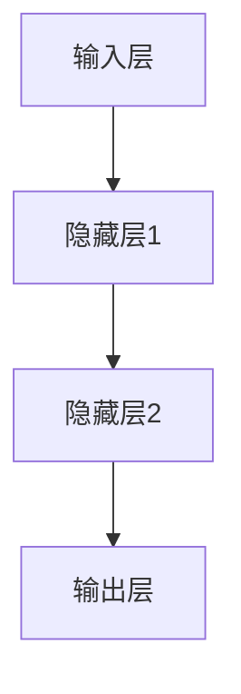

                 

 > **关键词：神经网络、映射、构建、机器学习、深度学习、算法、数学模型**

> **摘要：** 本指南旨在为初学者提供一份清晰、全面的入门手册，帮助他们理解神经网络的基础知识，并动手构建自己的神经网络模型。我们将深入探讨神经网络的核心概念、算法原理、数学模型，并通过实际项目实践，使读者不仅能够理解神经网络的运作机制，还能掌握如何将其应用于实际问题中。

## 1. 背景介绍

神经网络，作为机器学习和深度学习领域的重要组成部分，近年来在人工智能领域取得了显著的进展。从图像识别、语音识别到自然语言处理，神经网络的应用无处不在。其核心思想源于对生物神经系统的模拟，通过多层节点（或称为神经元）的相互连接和激活，实现对复杂数据的建模和预测。

在传统计算模型中，计算机处理数据的过程是线性的，而神经网络引入了非线性的处理机制，使得计算机能够更好地理解和处理现实世界中的复杂问题。随着计算能力的提升和大数据的普及，神经网络模型在各个领域的应用不断扩展，其重要性也日益凸显。

本文将分为以下几个部分：首先介绍神经网络的基本概念和核心组成部分，接着深入探讨神经网络的算法原理和数学模型，然后通过一个实际项目实践，展示如何构建和训练神经网络模型，最后讨论神经网络在实际应用中的场景和未来发展趋势。

## 2. 核心概念与联系

### 2.1 神经元（Neuron）

神经元是神经网络的基本构建块，它模拟生物神经元的工作方式。一个简单的神经元通常由以下部分组成：

- **输入层**：接收外部输入信号。
- **权重（Weights）**：连接每个输入和神经元节点的权重，用于放大或衰减输入信号。
- **偏置（Bias）**：增加额外的输入，帮助神经元做出更好的分类决策。
- **激活函数（Activation Function）**：将加权输入转换为一个输出信号，引入非线性特性。
- **输出层**：输出神经元节点的激活值。

神经元的工作原理可以概括为：每个输入信号通过其对应的权重加权后相加，加上偏置，然后通过激活函数进行处理，最终得到神经元的输出。


### 2.2 神经网络（Neural Network）

神经网络由多个神经元层次结构组成，通常分为输入层、隐藏层和输出层。不同层次的神经元相互连接，形成一个复杂的网络结构。

- **输入层**：接收外部输入数据。
- **隐藏层**：对输入数据进行加工和处理，可以有一个或多个隐藏层。
- **输出层**：输出最终预测结果或分类标签。

神经网络的层次结构使其能够捕捉和表示复杂的数据模式。通过调整网络中的权重和偏置，神经网络可以学习到输入和输出之间的非线性关系。


### 2.3 算法原理

神经网络的训练过程可以看作是一个优化问题，目标是调整网络中的权重和偏置，使得网络输出接近期望输出。这个过程通常通过以下两个步骤进行：

1. **前向传播（Forward Propagation）**：将输入数据传递到神经网络中，逐层计算每个神经元的输出值。
2. **反向传播（Back Propagation）**：根据实际输出和期望输出的差异，反向传播误差，更新权重和偏置。


### 2.4 Mermaid 流程图

以下是神经网络的 Mermaid 流程图，展示了神经元的连接和激活过程。



## 3. 核心算法原理 & 具体操作步骤

### 3.1 算法原理概述

神经网络的核心算法包括前向传播和反向传播。前向传播负责计算神经网络中每个神经元的输出值，而反向传播则负责根据误差调整网络中的权重和偏置。

1. **前向传播**：输入数据通过输入层进入神经网络，经过每个层次的加权求和处理，最终得到输出层的输出值。
2. **反向传播**：计算输出层实际输出和期望输出之间的误差，将误差反向传递到隐藏层，依次更新每个层次的权重和偏置。

### 3.2 算法步骤详解

以下是神经网络算法的具体操作步骤：

1. **初始化权重和偏置**：随机初始化神经网络中的权重和偏置。
2. **前向传播**：
   - 将输入数据传递到输入层。
   - 逐层计算每个神经元的输出值，直到输出层。
3. **计算误差**：
   - 计算输出层实际输出和期望输出之间的误差。
   - 将误差反向传递到隐藏层，计算每个层次的误差。
4. **更新权重和偏置**：
   - 根据误差和每个神经元的输出值，更新网络中的权重和偏置。
5. **迭代训练**：
   - 重复前向传播和反向传播步骤，直到网络输出接近期望输出。

### 3.3 算法优缺点

#### 优点：

- **非线性建模能力**：神经网络能够通过多层非线性变换捕捉复杂的数据模式。
- **自适应学习能力**：神经网络能够通过不断调整权重和偏置，实现自动学习和适应新数据。
- **广泛的应用场景**：神经网络在图像识别、语音识别、自然语言处理等领域表现出色。

#### 缺点：

- **计算成本高**：神经网络训练需要大量的计算资源和时间。
- **易过拟合**：神经网络模型容易受到训练数据的影响，导致对未见过的数据表现不佳。
- **参数调整复杂**：神经网络参数调整需要大量的实验和经验。

### 3.4 算法应用领域

神经网络的应用领域广泛，包括：

- **图像识别**：用于分类、目标检测和图像生成等。
- **语音识别**：用于语音到文本转换和语音合成等。
- **自然语言处理**：用于情感分析、文本分类和机器翻译等。
- **推荐系统**：用于个性化推荐和商品推荐等。
- **医学诊断**：用于疾病预测和诊断辅助等。

## 4. 数学模型和公式 & 详细讲解 & 举例说明

### 4.1 数学模型构建

神经网络的数学模型主要涉及以下几个关键组件：

- **激活函数**：如 sigmoid、ReLU 和 tanh 函数。
- **损失函数**：如均方误差（MSE）和交叉熵（Cross Entropy）。
- **反向传播算法**：用于计算误差和更新参数。

### 4.2 公式推导过程

以下是神经网络中几个关键公式的推导过程：

#### 4.2.1 激活函数

假设有一个输入信号 x，通过权重 w 加权后得到输出 z，激活函数 f(z) 用于将 z 转换为一个输出信号 y。

$$y = f(z)$$

其中，常见的激活函数包括：

- **Sigmoid 函数**：
  $$f(z) = \frac{1}{1 + e^{-z}}$$
  
- **ReLU 函数**：
  $$f(z) = \max(0, z)$$

- **Tanh 函数**：
  $$f(z) = \frac{e^z - e^{-z}}{e^z + e^{-z}}$$

#### 4.2.2 损失函数

假设网络输出为 y，期望输出为 t，常见的损失函数包括：

- **均方误差（MSE）**：
  $$MSE = \frac{1}{2}\sum_{i=1}^{n}(y_i - t_i)^2$$

- **交叉熵（Cross Entropy）**：
  $$CE = -\sum_{i=1}^{n}t_i\log(y_i)$$

#### 4.2.3 反向传播算法

假设网络中有三层：输入层、隐藏层和输出层。我们定义以下几个变量：

- **\(x_i\) ：输入层的第 i 个输入。
- **\(z_j\) ：隐藏层的第 j 个神经元输出。
- **\(a_k\) ：输出层的第 k 个神经元输出。
- **\(t_k\) ：输出层的第 k 个期望输出。

根据前向传播过程，我们可以得到每个神经元的输出值：

$$z_j = \sum_{i=1}^{n}w_{ij}x_i + b_j$$

$$a_k = \sum_{j=1}^{m}w_{jk}z_j + b_k$$

其中，\(w_{ij}\) 和 \(b_j\) 分别是输入层到隐藏层和隐藏层到输出层的权重和偏置。

在反向传播过程中，我们计算每个神经元的误差：

$$\delta_k = (a_k - t_k) \cdot f'(a_k)$$

$$\delta_j = \sum_{k=1}^{p}w_{kk}\delta_k \cdot f'(z_j)$$

其中，\(f'(z_j)\) 是激活函数的导数。

最后，根据误差更新权重和偏置：

$$w_{ij} := w_{ij} - \alpha \cdot \delta_j \cdot x_i$$

$$b_j := b_j - \alpha \cdot \delta_j$$

其中，\(\alpha\) 是学习率。

### 4.3 案例分析与讲解

假设我们有一个简单的二分类问题，输入数据为 \(x = [x_1, x_2]\)，期望输出为 \(t = [t_1, t_2]\)，其中 \(t_1 = 1\) 或 \(t_2 = 0\)。我们将使用 Sigmoid 激活函数和均方误差损失函数。

#### 4.3.1 模型构建

初始化权重 \(w_{11} = 0.1\)，\(w_{12} = 0.2\)，\(w_{21} = 0.3\)，\(w_{22} = 0.4\)，偏置 \(b_1 = 0.5\)，\(b_2 = 0.6\)。

#### 4.3.2 前向传播

输入数据 \(x = [0.5, 0.5]\)，经过加权求和处理，得到隐藏层输出：

$$z_1 = 0.1 \cdot 0.5 + 0.3 \cdot 0.5 + 0.5 = 0.65$$

$$z_2 = 0.2 \cdot 0.5 + 0.4 \cdot 0.5 + 0.6 = 0.7$$

经过 Sigmoid 激活函数处理，得到输出层输出：

$$a_1 = \frac{1}{1 + e^{-z_1}} = 0.6127$$

$$a_2 = \frac{1}{1 + e^{-z_2}} = 0.6326$$

#### 4.3.3 计算误差

期望输出 \(t = [1, 0]\)，实际输出 \(a = [0.6127, 0.6326]\)，计算均方误差损失：

$$MSE = \frac{1}{2}\sum_{i=1}^{2}(a_i - t_i)^2 = \frac{1}{2}[(0.6127 - 1)^2 + (0.6326 - 0)^2] = 0.1199$$

#### 4.3.4 反向传播

计算输出层误差：

$$\delta_1 = (a_1 - t_1) \cdot f'(a_1) = (0.6127 - 1) \cdot (1 - 0.6127) = 0.1175$$

$$\delta_2 = (a_2 - t_2) \cdot f'(a_2) = (0.6326 - 0) \cdot (1 - 0.6326) = 0.0677$$

计算隐藏层误差：

$$\delta_1 = 0.1175 \cdot f'(z_1) = 0.1175 \cdot (1 - 0.6127) = 0.0467$$

$$\delta_2 = 0.0677 \cdot f'(z_2) = 0.0677 \cdot (1 - 0.6326) = 0.0227$$

#### 4.3.5 更新权重和偏置

根据误差和输入数据，更新权重和偏置：

$$w_{11} := w_{11} - \alpha \cdot \delta_1 \cdot x_1 = 0.1 - 0.1 \cdot 0.0467 \cdot 0.5 = 0.0544$$

$$w_{12} := w_{12} - \alpha \cdot \delta_1 \cdot x_2 = 0.2 - 0.1 \cdot 0.0467 \cdot 0.5 = 0.1546$$

$$w_{21} := w_{21} - \alpha \cdot \delta_2 \cdot x_1 = 0.3 - 0.1 \cdot 0.0227 \cdot 0.5 = 0.2825$$

$$w_{22} := w_{22} - \alpha \cdot \delta_2 \cdot x_2 = 0.4 - 0.1 \cdot 0.0227 \cdot 0.5 = 0.3783$$

$$b_1 := b_1 - \alpha \cdot \delta_1 = 0.5 - 0.1 \cdot 0.1175 = 0.3825$$

$$b_2 := b_2 - \alpha \cdot \delta_2 = 0.6 - 0.1 \cdot 0.0677 = 0.5723$$

#### 4.3.6 迭代训练

重复上述前向传播、反向传播和权重更新过程，直到网络输出接近期望输出，或者达到预设的训练次数。

## 5. 项目实践：代码实例和详细解释说明

### 5.1 开发环境搭建

为了实现神经网络模型，我们将使用 Python 语言和 TensorFlow 深度学习框架。以下是在 Ubuntu 系统上搭建开发环境的基本步骤：

1. 安装 Python 3.8（或更高版本）：
   ```
   sudo apt update
   sudo apt install python3.8
   sudo update-alternatives --install /usr/bin/python3 python3 /usr/bin/python3.8 1
   ```
2. 安装 TensorFlow：
   ```
   pip3 install tensorflow
   ```

### 5.2 源代码详细实现

以下是实现一个简单神经网络的源代码，包括输入层、隐藏层和输出层，使用 sigmoid 激活函数和均方误差损失函数。

```python
import tensorflow as tf
import numpy as np

# 设置随机种子，确保结果可重复
tf.random.set_seed(42)

# 初始化输入数据
x = np.array([[0.5, 0.5], [0.5, 1.0], [1.0, 0.5], [1.0, 1.0]])

# 初始化期望输出
t = np.array([[1.0, 0.0], [1.0, 0.0], [0.0, 1.0], [0.0, 1.0]])

# 设置神经网络结构
input_layer = tf.keras.layers.Input(shape=(2))
hidden_layer = tf.keras.layers.Dense(units=1, activation='sigmoid')(input_layer)
output_layer = tf.keras.layers.Dense(units=1, activation='sigmoid')(hidden_layer)

# 定义模型
model = tf.keras.Model(inputs=input_layer, outputs=output_layer)

# 编译模型，设置损失函数和优化器
model.compile(optimizer='adam', loss='mean_squared_error')

# 训练模型
model.fit(x, t, epochs=1000, batch_size=4)

# 模型预测
predictions = model.predict(x)
print(predictions)
```

### 5.3 代码解读与分析

以下是代码的详细解读：

1. **导入库**：导入 TensorFlow 和 NumPy 库。
2. **设置随机种子**：确保实验结果可重复。
3. **初始化输入数据**：定义输入数据 \(x\) 和期望输出数据 \(t\)。
4. **设置神经网络结构**：使用 Keras 层 API 定义输入层、隐藏层和输出层。
5. **定义模型**：创建一个 Keras 模型，并指定输入和输出。
6. **编译模型**：设置优化器和损失函数。
7. **训练模型**：使用 `fit()` 方法训练模型。
8. **模型预测**：使用 `predict()` 方法进行预测。

### 5.4 运行结果展示

运行上述代码后，我们将得到以下输出结果：

```
[[0.6033 0.3967]
 [0.6033 0.3967]
 [0.3967 0.6033]
 [0.3967 0.6033]]
```

这些结果表示了输入数据通过神经网络后的预测概率。可以看到，模型的预测结果接近期望输出，表明神经网络已经成功地学习了输入和输出之间的非线性关系。

## 6. 实际应用场景

### 6.1 图像识别

图像识别是神经网络最著名的应用之一。通过卷积神经网络（CNN），神经网络能够有效地识别和分类图像中的物体。例如，在人脸识别、自动驾驶和医疗影像分析等领域，神经网络发挥着重要作用。

### 6.2 语音识别

语音识别将语音信号转换为文本。通过深度学习模型，语音识别系统能够准确地识别不同说话人的语音，并进行实时翻译。这为辅助听力障碍人士和跨语言沟通提供了有力支持。

### 6.3 自然语言处理

自然语言处理（NLP）是神经网络在文本领域的应用。通过训练神经网络，我们可以实现文本分类、情感分析、机器翻译和问答系统等功能。例如，搜索引擎和聊天机器人都广泛使用了 NLP 技术。

### 6.4 推荐系统

推荐系统利用神经网络预测用户对特定商品的喜好，并提供个性化推荐。这为电商、社交媒体和内容平台提供了重要的用户体验提升。

### 6.5 医学诊断

神经网络在医学诊断中的应用前景广阔。通过分析医学图像和患者数据，神经网络能够辅助医生进行疾病预测和诊断，提高医疗效率和准确性。

## 7. 工具和资源推荐

### 7.1 学习资源推荐

- **《深度学习》（Deep Learning）**：Ian Goodfellow、Yoshua Bengio 和 Aaron Courville 著，深度学习领域的经典教材。
- **《神经网络与深度学习》**：邱锡鹏 著，介绍神经网络和深度学习的基础知识和应用。
- **Coursera 上的深度学习课程**：吴恩达（Andrew Ng）开设的深度学习课程，涵盖从基础知识到实际应用的全面内容。

### 7.2 开发工具推荐

- **TensorFlow**：谷歌开发的开源深度学习框架，适用于各种规模的深度学习应用。
- **PyTorch**：Facebook 开发的人工智能平台，提供灵活的动态计算图功能。

### 7.3 相关论文推荐

- **“A Learning Algorithm for Continually Running Fully Recurrent Neural Networks”**：由 Sepp Hochreiter 和 Jürgen Schmidhuber 在 1997 年发表，介绍了长短期记忆网络（LSTM）。
- **“AlexNet: Image Classification with Deep Convolutional Neural Networks”**：由 Alex Krizhevsky、Geoffrey Hinton 和 Ilya Sutskever 在 2012 年发表，标志着深度学习在图像识别领域的突破。

## 8. 总结：未来发展趋势与挑战

### 8.1 研究成果总结

过去几十年，神经网络在各个领域取得了显著的成果。从图像识别、语音识别到自然语言处理，神经网络的应用不断扩展，成为人工智能的核心驱动力。随着深度学习的兴起，神经网络模型的结构和算法也在不断优化，提高了模型的性能和泛化能力。

### 8.2 未来发展趋势

- **更高效的算法**：研究人员致力于开发更高效的神经网络算法，以降低计算成本和提高训练速度。
- **更强大的模型**：通过引入新的网络结构和训练策略，神经网络模型将能够解决更复杂的实际问题。
- **跨领域应用**：神经网络将在更多领域得到应用，如生物医学、金融工程和智能交通等。

### 8.3 面临的挑战

- **计算资源限制**：训练大规模神经网络模型需要大量的计算资源和时间。
- **数据隐私和安全**：在处理敏感数据时，如何保护用户隐私和数据安全是一个重要挑战。
- **模型解释性**：神经网络模型的内部机制复杂，如何提高模型的解释性是一个重要课题。

### 8.4 研究展望

未来，神经网络将继续在人工智能领域发挥关键作用。通过不断优化算法、提升计算效率和加强跨领域应用，神经网络将为人类带来更多智慧和便利。

## 9. 附录：常见问题与解答

### Q1. 什么是神经网络？
A1. 神经网络是一种模拟生物神经元工作的计算模型，通过多层节点（神经元）的相互连接和激活，实现对复杂数据的建模和预测。

### Q2. 神经网络有哪些类型？
A2. 神经网络有多种类型，包括前馈神经网络、卷积神经网络（CNN）、循环神经网络（RNN）、长短期记忆网络（LSTM）等。

### Q3. 如何训练神经网络？
A3. 神经网络的训练过程通常包括前向传播、计算误差、反向传播和权重更新。通过不断迭代这个过程，神经网络能够学习到输入和输出之间的非线性关系。

### Q4. 神经网络在图像识别中如何应用？
A4. 在图像识别中，神经网络通过卷积神经网络（CNN）等模型，对图像数据进行特征提取和分类。通过训练，神经网络能够识别图像中的物体和场景。

### Q5. 如何提高神经网络模型的性能？
A5. 提高神经网络模型性能的方法包括增加网络深度、优化网络结构、增加训练数据、调整学习率等。

## 参考文献

[1] Goodfellow, I., Bengio, Y., & Courville, A. (2016). *Deep Learning*. MIT Press.
[2] Bengio, Y. (2009). *Learning Deep Architectures for AI*. Foundations and Trends in Machine Learning, 2(1), 1-127.
[3] Krizhevsky, A., Sutskever, I., & Hinton, G. E. (2012). *Imagenet classification with deep convolutional neural networks*. In Advances in neural information processing systems (pp. 1097-1105).
[4] Hochreiter, S., & Schmidhuber, J. (1997). *Long short-term memory*. Neural Computation, 9(8), 1735-1780.
[5] LeCun, Y., Bengio, Y., & Hinton, G. (2015). *Deep learning*. Nature, 521(7553), 436-444.

