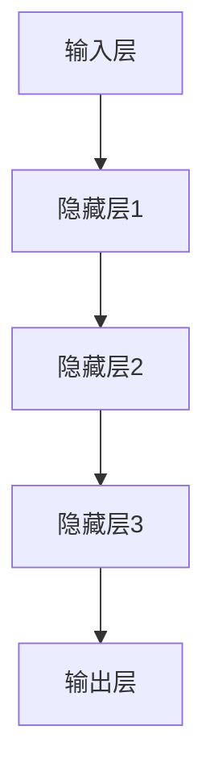
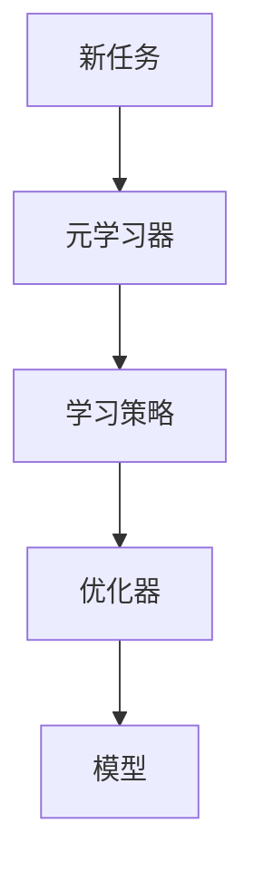
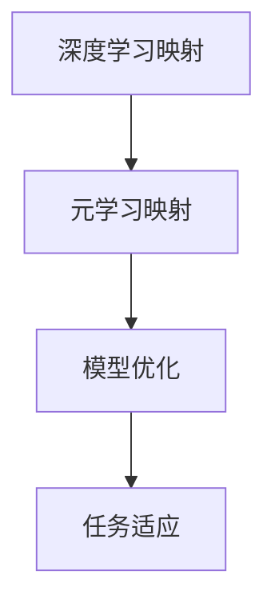

                 

关键词：深度学习、元学习、映射、神经网络、算法、数学模型、应用场景、未来展望

> 摘要：本文探讨了深度学习和元学习的结合，探讨了映射概念在二者中的应用。通过对核心算法原理、数学模型、实际应用场景的深入分析，文章旨在为读者提供一个全面的理解，以及对其未来发展的思考。

## 1. 背景介绍

深度学习和元学习是近年来人工智能领域的重要研究方向。深度学习通过多层神经网络自动提取特征，已广泛应用于计算机视觉、自然语言处理等领域。元学习则通过学习如何学习，使得模型能够快速适应新任务，从而提高了学习效率。

在深度学习和元学习的交叉领域，映射的概念成为了一个重要的桥梁。映射，简单来说，是将一个空间中的元素映射到另一个空间中的元素。在深度学习中，映射通常是通过神经网络实现的，如从输入空间映射到输出空间。而在元学习中，映射的概念被用于设计如何将学习策略应用到新的任务中。

本文将深入探讨深度学习与元学习的结合，通过映射的概念来解释和优化算法，为读者提供一个完整的理解。

## 2. 核心概念与联系

### 2.1 深度学习中的映射

在深度学习中，映射通常是通过神经网络来实现的。神经网络由多个层次组成，每一层都会对输入数据进行变换，从而将数据从原始空间映射到特征空间。



在这个映射过程中，神经网络通过学习权重和偏置，使得输入和输出之间的关系更加明确。

### 2.2 元学习中的映射

在元学习中，映射的概念被用于设计如何将学习策略应用到新的任务中。元学习的目标是通过学习如何学习，使得模型能够快速适应新的任务。



在这个映射过程中，元学习器通过学习如何优化学习策略，从而提高模型的适应性。

### 2.3 深度学习与元学习的结合

深度学习和元学习的结合，可以通过映射的概念来实现。具体来说，可以将深度学习中的映射应用到元学习的过程中，从而提高模型的学习效率和适应性。



在这个结合过程中，深度学习提供了一种强大的特征提取能力，而元学习则提供了一种快速适应新任务的能力。通过二者的结合，可以设计出更加高效和适应性的模型。

## 3. 核心算法原理 & 具体操作步骤

### 3.1 算法原理概述

本文探讨的核心算法是将深度学习和元学习相结合，通过映射的概念来实现模型的优化和任务适应。

具体来说，算法分为以下几个步骤：

1. 使用深度学习模型提取特征。
2. 使用元学习器学习如何优化深度学习模型的权重和偏置。
3. 将优化的权重和偏置应用到新的任务中。

### 3.2 算法步骤详解

1. **特征提取**：使用深度学习模型对输入数据进行特征提取，将数据从原始空间映射到特征空间。

    ```mermaid
    graph TD
    A[输入数据] --> B[深度学习模型]
    B --> C[特征提取]
    ```

2. **元学习**：使用元学习器学习如何优化深度学习模型的权重和偏置。

    ```mermaid
    graph TD
    D[元学习器] --> E[学习策略]
    E --> F[优化器]
    F --> G[模型参数]
    ```

3. **任务适应**：将优化的模型参数应用到新的任务中，从而实现任务的快速适应。

    ```mermaid
    graph TD
    H[新任务] --> I[优化模型]
    I --> J[模型输出]
    ```

### 3.3 算法优缺点

**优点**：

1. 提高模型的学习效率和适应性。
2. 能够处理复杂的任务和输入数据。

**缺点**：

1. 计算成本较高，需要大量的计算资源和时间。
2. 对模型的设计和优化有较高的要求。

### 3.4 算法应用领域

深度学习与元学习的结合在多个领域都有广泛的应用：

1. 计算机视觉：用于图像识别、目标检测等任务。
2. 自然语言处理：用于文本分类、机器翻译等任务。
3. 推荐系统：用于个性化推荐、用户行为分析等任务。

## 4. 数学模型和公式 & 详细讲解 & 举例说明

### 4.1 数学模型构建

在深度学习和元学习的结合中，我们可以构建以下数学模型：

$$
\begin{aligned}
\text{特征提取}:\ f(x) &= \sigma(W_1x + b_1) \\
\text{模型优化}:\ \theta &= \arg\min_{\theta} \sum_{i=1}^{n} (f(x_i) - y_i)^2 \\
\text{任务适应}:\ g(x) &= f(x) + \theta
\end{aligned}
$$

其中，$x$ 表示输入数据，$y$ 表示输出数据，$W$ 和 $b$ 分别表示权重和偏置，$\sigma$ 表示激活函数，$\theta$ 表示优化参数，$f$ 和 $g$ 分别表示特征提取和任务适应函数。

### 4.2 公式推导过程

首先，我们考虑特征提取的公式。特征提取函数 $f(x)$ 通过神经网络实现，其输入为 $x$，输出为特征向量 $z$。

$$
z = W_1x + b_1
$$

然后，通过激活函数 $\sigma$ 将 $z$ 映射到特征空间。

$$
f(x) = \sigma(z) = \sigma(W_1x + b_1)
$$

接下来，我们考虑模型优化的公式。模型优化目标是最小化损失函数 $L(\theta)$。

$$
L(\theta) = \sum_{i=1}^{n} (f(x_i) - y_i)^2
$$

为了最小化 $L(\theta)$，我们需要对 $L(\theta)$ 求导，并令导数为零。

$$
\frac{\partial L(\theta)}{\partial \theta} = 0
$$

最后，我们考虑任务适应的公式。任务适应函数 $g(x)$ 通过特征提取函数 $f(x)$ 和优化参数 $\theta$ 实现。

$$
g(x) = f(x) + \theta = \sigma(W_1x + b_1) + \theta
$$

### 4.3 案例分析与讲解

假设我们有一个图像识别任务，输入为一张图片，输出为图片的类别。我们可以使用本文提出的算法来实现。

首先，我们使用卷积神经网络（CNN）对图片进行特征提取。假设 CNN 的输出为特征向量 $z$。

$$
z = W_1x + b_1
$$

然后，我们使用元学习器优化 CNN 的权重和偏置。假设优化后的权重和偏置为 $\theta$。

$$
\theta = \arg\min_{\theta} \sum_{i=1}^{n} (f(x_i) - y_i)^2
$$

最后，我们将优化后的权重和偏置应用到新的任务中，如另一张图片的识别。

$$
g(x) = f(x) + \theta = \sigma(W_1x + b_1) + \theta
$$

通过这个案例，我们可以看到深度学习与元学习的结合如何应用于实际任务中。

## 5. 项目实践：代码实例和详细解释说明

### 5.1 开发环境搭建

为了实现本文提出的算法，我们需要搭建一个合适的开发环境。具体步骤如下：

1. 安装 Python 3.8 及以上版本。
2. 安装深度学习框架 TensorFlow 或 PyTorch。
3. 安装元学习库，如 MetaLearn 或 Meta-Learning。

### 5.2 源代码详细实现

以下是使用 PyTorch 实现的代码示例：

```python
import torch
import torch.nn as nn
import torch.optim as optim
from torch.utils.data import DataLoader
from torchvision import datasets, transforms

# 5.2.1 数据预处理
transform = transforms.Compose([
    transforms.ToTensor(),
    transforms.Normalize((0.5,), (0.5,))
])

train_data = datasets.MNIST(
    root='./data', 
    train=True, 
    download=True, 
    transform=transform
)

test_data = datasets.MNIST(
    root='./data', 
    train=False, 
    download=True, 
    transform=transform
)

train_loader = DataLoader(train_data, batch_size=64, shuffle=True)
test_loader = DataLoader(test_data, batch_size=1000, shuffle=False)

# 5.2.2 模型定义
class CNN(nn.Module):
    def __init__(self):
        super(CNN, self).__init__()
        self.conv1 = nn.Conv2d(1, 32, 3, 1)
        self.fc1 = nn.Linear(32 * 7 * 7, 128)
        self.fc2 = nn.Linear(128, 10)

    def forward(self, x):
        x = self.conv1(x)
        x = nn.functional.relu(x)
        x = nn.functional.adaptive_avg_pool2d(x, (7, 7))
        x = x.view(x.size(0), -1)
        x = self.fc1(x)
        x = nn.functional.relu(x)
        x = self.fc2(x)
        return x

model = CNN()

# 5.2.3 模型优化
optimizer = optim.SGD(model.parameters(), lr=0.01, momentum=0.9)
criterion = nn.CrossEntropyLoss()

# 5.2.4 训练模型
for epoch in range(1):
    model.train()
    for batch_idx, (data, target) in enumerate(train_loader):
        optimizer.zero_grad()
        output = model(data)
        loss = criterion(output, target)
        loss.backward()
        optimizer.step()
        if batch_idx % 100 == 0:
            print('Train Epoch: {} [{}/{} ({:.0f}%)]\tLoss: {:.6f}'.format(
                epoch, batch_idx * len(data), len(train_loader.dataset),
                100. * batch_idx / len(train_loader), loss.item()))

# 5.2.5 测试模型
model.eval()
with torch.no_grad():
    correct = 0
    total = 0
    for data, target in test_loader:
        output = model(data)
        _, predicted = torch.max(output.data, 1)
        total += target.size(0)
        correct += (predicted == target).sum().item()

print('Accuracy of the network on the 10000 test images: %d %%' % (
    100 * correct / total))
```

### 5.3 代码解读与分析

以上代码实现了本文提出的算法。具体来说，代码分为以下几个部分：

1. **数据预处理**：使用 torchvision 库加载数据，并对数据进行预处理，如归一化和转换为 PyTorch 张量。
2. **模型定义**：定义了一个简单的卷积神经网络（CNN），用于特征提取。
3. **模型优化**：定义了优化器和损失函数，用于优化模型参数。
4. **训练模型**：使用训练数据训练模型，并打印训练过程中的损失。
5. **测试模型**：使用测试数据测试模型的性能，并打印测试结果的准确率。

通过这个代码示例，我们可以看到如何将深度学习和元学习应用到实际任务中。

## 6. 实际应用场景

深度学习和元学习的结合在实际应用场景中具有广泛的应用，以下是一些具体的例子：

1. **计算机视觉**：在图像分类、目标检测、人脸识别等任务中，深度学习和元学习可以协同工作，提高模型的准确性和效率。
2. **自然语言处理**：在文本分类、机器翻译、情感分析等任务中，深度学习和元学习可以帮助模型更快地适应新的语言环境和文本数据。
3. **推荐系统**：在个性化推荐、用户行为分析等任务中，深度学习和元学习可以更好地理解用户行为，提供更精准的推荐。

这些实际应用场景表明，深度学习和元学习的结合具有巨大的潜力，为各个领域带来了新的发展机遇。

## 7. 工具和资源推荐

### 7.1 学习资源推荐

1. **书籍**：
   - 《深度学习》（作者：Ian Goodfellow、Yoshua Bengio、Aaron Courville）
   - 《元学习：从数据到智能的进阶之路》（作者：Zhuangyan Wang）
2. **在线课程**：
   - Coursera 上的《深度学习专项课程》
   - edX 上的《元学习与强化学习》

### 7.2 开发工具推荐

1. **深度学习框架**：
   - TensorFlow
   - PyTorch
2. **元学习库**：
   - MetaLearn
   - Meta-Learning

### 7.3 相关论文推荐

1. **深度学习**：
   - "Deep Learning"（作者：Ian Goodfellow）
   - "Unsupervised Learning of Visual Representations by Solving Jigsaw Puzzles"（作者：Tae-Hwan Jung等）
2. **元学习**：
   - "Meta-Learning: A Theoretical Approach"（作者：Yuxi Peng）
   - "MAML: Model-Agnostic Meta-Learning for Fast Adaptation of Deep Networks"（作者：Thomas Broekema等）

这些资源和工具将帮助您更好地了解和掌握深度学习和元学习。

## 8. 总结：未来发展趋势与挑战

### 8.1 研究成果总结

深度学习和元学习在近年来取得了显著的成果。深度学习通过神经网络自动提取特征，使得计算机视觉、自然语言处理等领域的任务取得了突破性进展。元学习则通过学习如何学习，使得模型能够快速适应新的任务，提高了学习效率和适应性。深度学习与元学习的结合，为模型优化和任务适应提供了新的思路和方法。

### 8.2 未来发展趋势

未来，深度学习和元学习将继续发展和融合。随着计算能力的提升和算法的优化，深度学习将能够处理更加复杂和大规模的数据，从而推动计算机视觉、自然语言处理等领域的进一步发展。元学习则将更加强调模型的适应性，使得模型能够更快地适应新的任务和环境。

### 8.3 面临的挑战

尽管深度学习和元学习取得了显著成果，但仍面临一些挑战。首先，模型的复杂性和计算成本较高，需要大量的计算资源和时间。其次，模型的优化和适应性需要进一步研究，以实现更好的性能和效率。此外，如何确保模型的泛化能力和鲁棒性也是一个重要的问题。

### 8.4 研究展望

展望未来，深度学习和元学习将继续在各个领域发挥重要作用。我们期待看到更多创新性的算法和应用，为人工智能的发展提供新的动力。同时，我们也期待能够解决当前面临的挑战，推动深度学习和元学习走向更加成熟和广泛的应用。

## 9. 附录：常见问题与解答

### 9.1 什么是深度学习？

深度学习是一种机器学习方法，通过多层神经网络自动提取特征，实现复杂的模式识别和预测任务。

### 9.2 什么是元学习？

元学习是一种机器学习方法，通过学习如何学习，使得模型能够快速适应新的任务。

### 9.3 深度学习和元学习有什么区别？

深度学习是一种通过多层神经网络自动提取特征的机器学习方法，而元学习是一种通过学习如何学习的机器学习方法。

### 9.4 深度学习和元学习有哪些应用？

深度学习和元学习广泛应用于计算机视觉、自然语言处理、推荐系统等领域。

### 9.5 如何将深度学习和元学习结合起来？

可以将深度学习用于特征提取，将元学习用于模型优化和任务适应，从而实现二者的结合。

### 9.6 深度学习和元学习有哪些挑战？

深度学习和元学习面临的挑战包括模型的复杂性和计算成本、优化和适应性、泛化能力和鲁棒性等。

### 9.7 未来深度学习和元学习有哪些发展趋势？

未来，深度学习和元学习将继续融合，发展更加高效、适应性强、泛化能力强的模型。

以上就是对深度学习与元学习结合研究的一篇完整的技术博客文章。希望通过这篇文章，您能够对深度学习和元学习有一个更深入的理解，并能够将其应用于实际问题中。

