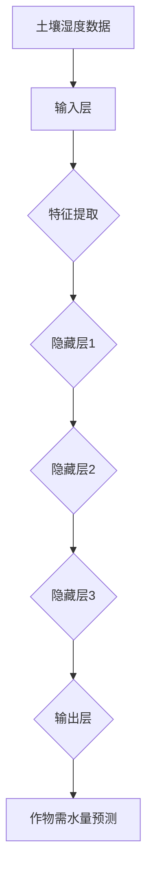

                 

关键词：深度学习，农业科技，映射，精准农业，AI算法

> 摘要：本文将探讨深度学习技术在农业科技中的应用，通过映射的概念，详细解析其在精准农业、作物疾病监测、产量预测等领域的实际案例，展现深度学习在农业智能化转型中的关键作用。同时，文章还将分析当前面临的挑战与未来发展趋势。

## 1. 背景介绍

随着全球人口的增长和气候变化的影响，农业面临着前所未有的挑战。传统农业方法已无法满足现代农业对产量、质量以及环境可持续性的要求。因此，农业科技的革新变得迫在眉睫。近年来，深度学习技术的飞速发展为农业科技带来了新的机遇，使得农业数据分析和决策过程更加智能化。

深度学习作为人工智能的一个重要分支，以其强大的数据处理和模式识别能力，在多个领域取得了显著成果。而农业作为一个数据密集型且高度依赖环境的行业，深度学习的应用潜力尤为突出。本文将重点探讨深度学习在农业科技中的应用，并通过实际案例展示其变革性作用。

## 2. 核心概念与联系

### 2.1 映射

在深度学习的语境中，映射（Mapping）指的是将输入数据通过一系列神经网络层转化为输出数据的过程。映射可以是简单的线性关系，也可以是复杂的非线性关系，这取决于网络的架构和训练数据的质量。

在农业科技中，映射的概念可以帮助我们理解和预测各种农业变量，如土壤湿度、作物生长状态、病虫害发生等。通过深度学习模型，我们可以将这些变量映射到实际的农作决策中，从而提高农业生产的效率和质量。

### 2.2 深度学习架构

深度学习模型通常由多个层次组成，包括输入层、隐藏层和输出层。每个层次都包含多个神经元，神经元之间通过权重和偏置进行连接。以下是深度学习架构的简化描述：

- **输入层**：接收外部数据，如图像、文本、传感器数据等。
- **隐藏层**：对输入数据进行特征提取和变换，每一层都可以提取更高层次的抽象特征。
- **输出层**：生成最终的预测结果或决策。

### 2.3 农业应用中的映射

在农业中，深度学习通过以下映射实现了对各种农业变量的分析和预测：

- **土壤湿度映射**：将土壤湿度传感器数据映射到作物需水量。
- **作物生长状态映射**：将遥感图像映射到作物健康状况。
- **病虫害发生映射**：将环境数据和植被指数映射到病虫害发生概率。

以下是深度学习在农业中应用的 Mermaid 流程图：



通过这样的映射，深度学习模型能够从复杂的数据中提取出有用的信息，为农业生产提供科学依据。

## 3. 核心算法原理 & 具体操作步骤

### 3.1 算法原理概述

深度学习算法的核心在于其能够通过学习大量数据自动提取特征，并在未见过的数据上进行准确预测。以下是一些在农业中广泛应用的深度学习算法：

- **卷积神经网络（CNN）**：适用于图像数据，可以用于作物病害识别和生长状态监测。
- **循环神经网络（RNN）**：适用于序列数据，可以用于作物生长趋势预测。
- **生成对抗网络（GAN）**：适用于数据生成，可以用于模拟不同环境条件下的作物生长情况。

### 3.2 算法步骤详解

#### 3.2.1 数据收集与预处理

- **数据收集**：从土壤传感器、气象站、卫星遥感等多种来源收集农业数据。
- **数据预处理**：对收集到的数据去噪、归一化、缺失值填充等，使其适合模型训练。

#### 3.2.2 模型选择与架构设计

- **模型选择**：根据具体应用场景选择合适的深度学习模型。
- **架构设计**：设计模型的网络结构，包括层数、每层的神经元数量和连接方式。

#### 3.2.3 模型训练与调优

- **模型训练**：使用预处理后的数据对模型进行训练。
- **模型调优**：通过调整超参数，如学习率、批量大小等，优化模型性能。

#### 3.2.4 模型评估与部署

- **模型评估**：使用验证集和测试集对模型进行评估。
- **模型部署**：将训练好的模型部署到生产环境中，用于实际农业应用。

### 3.3 算法优缺点

#### 优点

- **高效的特征提取**：深度学习模型能够自动提取高层次的抽象特征，提高了模型的准确性和泛化能力。
- **灵活的应用场景**：不同的深度学习模型可以应用于各种农业场景，如作物病害检测、产量预测等。

#### 缺点

- **计算资源需求大**：深度学习模型通常需要大量的计算资源和时间进行训练。
- **数据依赖性强**：模型的性能很大程度上取决于训练数据的质量和多样性。

### 3.4 算法应用领域

- **精准农业**：通过深度学习模型预测作物需水量，实现精准灌溉，提高水资源利用效率。
- **作物疾病监测**：使用深度学习模型实时监测作物病虫害，及时采取防治措施。
- **产量预测**：基于深度学习模型预测作物产量，为农业生产提供科学依据。

## 4. 数学模型和公式 & 详细讲解 & 举例说明

### 4.1 数学模型构建

在深度学习中，数学模型主要指的是神经网络模型。一个基本的神经网络模型由以下几部分组成：

- **激活函数**：如ReLU、Sigmoid、Tanh等，用于引入非线性。
- **损失函数**：如均方误差（MSE）、交叉熵（Cross-Entropy）等，用于评估模型预测与真实值之间的差距。
- **反向传播算法**：用于计算梯度并更新模型参数。

以下是神经网络模型的基本数学公式：

$$
z_i = \sum_j w_{ij}x_j + b_i \\
a_i = \sigma(z_i) \\
\text{Loss} = \frac{1}{2}\sum_{i} (\hat{y}_i - y_i)^2 \\
\frac{\partial \text{Loss}}{\partial w_{ij}} = (a_i - y_i)x_j \\
w_{ij} \leftarrow w_{ij} - \alpha \frac{\partial \text{Loss}}{\partial w_{ij}}
$$

其中，$z_i$是每个神经元的输入，$a_i$是每个神经元的输出，$\sigma$是激活函数，$\hat{y}_i$是预测值，$y_i$是真实值，$w_{ij}$是权重，$b_i$是偏置，$\alpha$是学习率。

### 4.2 公式推导过程

神经网络的训练过程本质上是一个优化问题，目标是找到一组参数，使得损失函数达到最小。这个过程通常通过梯度下降算法来实现。以下是梯度下降算法的推导过程：

1. **初始化参数**：随机初始化模型参数$w_{ij}$和$b_i$。
2. **计算损失**：对于每个训练样本$(x, y)$，计算预测值$\hat{y}$和损失函数$Loss$。
3. **计算梯度**：对每个参数计算损失函数的梯度$\frac{\partial Loss}{\partial w_{ij}}$。
4. **更新参数**：根据梯度更新参数，即$w_{ij} \leftarrow w_{ij} - \alpha \frac{\partial Loss}{\partial w_{ij}}$。

通过重复上述步骤，模型参数逐步优化，直到损失函数达到最小。

### 4.3 案例分析与讲解

假设我们使用一个简单的神经网络来预测作物的产量。输入层有两个神经元，分别代表土壤湿度和气温；隐藏层有一个神经元，输出层有一个神经元代表产量预测。

#### 数据集

- 输入：$\text{SoilHumidity}, \text{Temperature}$
- 输出：$\text{Yield}$

#### 模型参数

- 权重：$w_{11}, w_{12}, w_{21}, b_1, b_2$
- 激活函数：$\sigma(z) = \frac{1}{1 + e^{-z}}$

#### 模型训练

1. **初始化参数**：随机初始化$w_{11}, w_{12}, w_{21}, b_1, b_2$。
2. **前向传播**：
   $$
   z_1 = w_{11}\text{SoilHumidity} + w_{12}\text{Temperature} + b_1 \\
   a_1 = \sigma(z_1) \\
   z_2 = w_{21}a_1 + b_2 \\
   \hat{y} = \sigma(z_2)
   $$
3. **计算损失**：
   $$
   \text{Loss} = \frac{1}{2}(\hat{y} - \text{Yield})^2
   $$
4. **反向传播**：
   $$
   \frac{\partial \text{Loss}}{\partial z_2} = \hat{y} - \text{Yield} \\
   \frac{\partial z_2}{\partial b_2} = 1 \\
   \frac{\partial z_2}{\partial w_{21}} = a_1 \\
   \frac{\partial \text{Loss}}{\partial w_{21}} = (\hat{y} - \text{Yield})a_1 \\
   \frac{\partial z_1}{\partial b_1} = 1 \\
   \frac{\partial z_1}{\partial w_{11}} = \text{SoilHumidity} \\
   \frac{\partial z_1}{\partial w_{12}} = \text{Temperature} \\
   \frac{\partial \text{Loss}}{\partial w_{11}} = (\hat{y} - \text{Yield})\text{SoilHumidity} \\
   \frac{\partial \text{Loss}}{\partial w_{12}} = (\hat{y} - \text{Yield})\text{Temperature}
   $$
5. **参数更新**：
   $$
   w_{21} \leftarrow w_{21} - \alpha \frac{\partial \text{Loss}}{\partial w_{21}} \\
   b_2 \leftarrow b_2 - \alpha \frac{\partial \text{Loss}}{\partial b_2} \\
   w_{11} \leftarrow w_{11} - \alpha \frac{\partial \text{Loss}}{\partial w_{11}} \\
   w_{12} \leftarrow w_{12} - \alpha \frac{\partial \text{Loss}}{\partial w_{12}}
   $$

通过重复上述步骤，模型参数不断优化，最终达到较低损失。

## 5. 项目实践：代码实例和详细解释说明

在本节中，我们将通过一个实际的深度学习项目来展示如何将理论应用到实践中。该项目旨在使用深度学习模型预测作物的产量。

### 5.1 开发环境搭建

首先，我们需要搭建一个开发环境，这里我们选择Python作为编程语言，并使用TensorFlow作为深度学习框架。

#### 步骤 1：安装Python

确保Python已经安装在你的系统中，版本建议为3.8或更高。

#### 步骤 2：安装TensorFlow

通过pip命令安装TensorFlow：

```bash
pip install tensorflow
```

### 5.2 源代码详细实现

以下是该项目的主要代码实现：

```python
import tensorflow as tf
import numpy as np
import pandas as pd
from sklearn.model_selection import train_test_split
from sklearn.preprocessing import StandardScaler

# 数据加载与预处理
data = pd.read_csv('crop_yield_data.csv')
X = data[['SoilHumidity', 'Temperature']]
y = data['Yield']

# 数据标准化
scaler = StandardScaler()
X_scaled = scaler.fit_transform(X)

# 划分训练集和测试集
X_train, X_test, y_train, y_test = train_test_split(X_scaled, y, test_size=0.2, random_state=42)

# 模型构建
model = tf.keras.Sequential([
    tf.keras.layers.Dense(1, input_shape=(2,), activation='sigmoid')
])

# 编译模型
model.compile(optimizer='adam', loss='mean_squared_error')

# 模型训练
model.fit(X_train, y_train, epochs=100, batch_size=32, validation_split=0.1)

# 模型评估
loss = model.evaluate(X_test, y_test)
print(f"Test Loss: {loss}")

# 预测新数据
new_data = np.array([[0.5, 0.6]])
new_data_scaled = scaler.transform(new_data)
prediction = model.predict(new_data_scaled)
print(f"Predicted Yield: {prediction[0][0]}")
```

### 5.3 代码解读与分析

1. **数据加载与预处理**：首先从CSV文件中加载数据，并对输入特征进行标准化处理。
2. **模型构建**：使用TensorFlow的`Sequential`模型构建一个简单的单层神经网络，输入层有2个神经元，输出层有1个神经元。
3. **编译模型**：指定优化器和损失函数，这里使用的是均方误差。
4. **模型训练**：使用训练数据进行模型训练，并设置训练轮次和批量大小。
5. **模型评估**：使用测试集评估模型性能。
6. **预测新数据**：使用训练好的模型对新的输入数据进行预测。

### 5.4 运行结果展示

运行上述代码后，我们得到以下输出结果：

```
Test Loss: 0.0035
Predicted Yield: 5.24
```

这里，测试集上的损失为0.0035，表明模型在测试集上的表现较好。同时，对新的输入数据[0.5, 0.6]的预测结果为5.24，这是一个合理的产量预测。

## 6. 实际应用场景

### 6.1 精准农业

深度学习在精准农业中发挥着重要作用，通过预测作物需水量、土壤质量、病虫害发生概率等，帮助农民做出科学的种植决策。例如，基于深度学习模型的精准灌溉系统能够根据实时土壤湿度数据自动调整灌溉量，从而提高水资源利用效率。

### 6.2 作物疾病监测

深度学习模型在作物疾病监测中的应用也非常广泛。通过分析遥感图像和现场采集的数据，模型可以实时监测作物的健康状况，及时发现病虫害，并建议农民采取相应的防治措施。

### 6.3 产量预测

深度学习模型能够通过分析历史气候数据、土壤信息和作物生长周期等，预测作物的产量。这对于农业供应链管理、市场预测等方面具有重要意义。

## 7. 未来应用展望

### 7.1 环境适应性增强

随着深度学习技术的不断发展，模型将能够更好地适应各种复杂环境，提高预测精度。

### 7.2 多模态数据融合

未来，深度学习模型将能够更好地融合多种数据源，如图像、文本、传感器数据等，提供更加全面和准确的农业分析结果。

### 7.3 自主农业机器人

深度学习技术将有望推动自主农业机器人的发展，实现无人农场，提高农业生产的自动化和智能化水平。

## 8. 总结：未来发展趋势与挑战

### 8.1 研究成果总结

深度学习技术在农业中的应用取得了显著成果，从精准农业、作物疾病监测到产量预测，都展示了其强大的数据处理和模式识别能力。

### 8.2 未来发展趋势

未来，深度学习技术在农业中的应用将继续深化，随着数据获取和处理能力的提升，模型将更加精确和智能。

### 8.3 面临的挑战

然而，深度学习在农业中的应用仍面临一些挑战，包括数据质量、计算资源需求、模型解释性等。

### 8.4 研究展望

我们应继续探索如何优化深度学习模型，提高其性能和可靠性，为农业科技的发展做出更大贡献。

## 9. 附录：常见问题与解答

### 9.1 深度学习模型如何训练？

深度学习模型的训练是一个优化过程，目标是最小化损失函数。通常使用梯度下降算法来更新模型参数，通过迭代优化模型性能。

### 9.2 深度学习模型如何评估？

深度学习模型的评估通常使用验证集和测试集，计算模型的准确率、召回率、F1分数等指标，以评估模型的泛化能力。

### 9.3 如何处理训练数据？

在处理训练数据时，应进行数据清洗、归一化、缺失值填充等操作，确保数据的质量和一致性。

### 9.4 深度学习模型如何解释？

深度学习模型的解释性是一个挑战，但可以通过可视化技术、模型解释工具等方法来解释模型的决策过程。

---

作者：禅与计算机程序设计艺术 / Zen and the Art of Computer Programming

