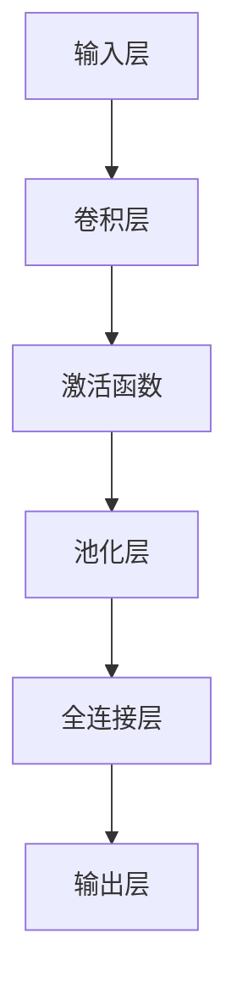

                 

关键词：深度学习，计算机视觉，图像识别，神经网络，卷积神经网络，迁移学习，卷积神经网络（CNN），目标检测，图像分类，图像增强，数据预处理，算法优化，AI技术

## 摘要

本文将深入探讨深度学习在计算机视觉领域的应用，重点分析卷积神经网络（CNN）在图像识别、目标检测和图像增强等任务中的重要作用。我们将从背景介绍、核心概念与联系、核心算法原理、数学模型与公式、项目实践、实际应用场景、工具和资源推荐、总结与展望等多个角度，全面解析深度学习在计算机视觉中的挑战与机遇。

## 1. 背景介绍

计算机视觉是人工智能的一个重要分支，旨在使计算机能够“看”和理解图像或视频。随着深度学习技术的快速发展，计算机视觉领域取得了显著进展。深度学习通过模拟人脑的神经网络结构，能够自动学习和提取图像中的特征，从而在图像识别、目标检测和图像增强等方面表现出色。

图像识别是计算机视觉的基础任务之一，旨在将输入图像或视频中的内容分类到预定义的类别中。目标检测则是在图像中定位并识别特定对象，从而为图像理解和智能分析提供更丰富的上下文信息。图像增强则通过改进图像质量，使其在视觉上更易理解和分析。

### 1.1 历史发展

计算机视觉领域的发展可以追溯到20世纪60年代，当时研究人员开始探索如何使计算机理解和处理图像。早期的方法主要依赖于手工设计的特征和规则，如边缘检测、角点检测等。随着计算机性能的提升和图像处理算法的改进，计算机视觉技术在图像分割、目标跟踪等领域取得了显著进展。

### 1.2 当前研究现状

近年来，深度学习技术的崛起为计算机视觉领域带来了新的活力。特别是卷积神经网络（CNN），在图像识别、目标检测和图像增强等方面取得了突破性成果。同时，迁移学习、数据增强和算法优化等技术的应用，进一步提高了深度学习模型的性能和鲁棒性。

## 2. 核心概念与联系

### 2.1 深度学习与神经网络

深度学习是一种基于神经网络的机器学习方法，其核心思想是通过多层神经网络对数据进行自动特征提取和分类。神经网络由大量简单的处理单元（神经元）组成，每个神经元都与相邻的神经元相连，并通过对输入数据进行加权求和后进行激活，从而实现对数据的分类。

### 2.2 卷积神经网络（CNN）

卷积神经网络是一种专门用于处理图像数据的神经网络架构。与传统的神经网络相比，CNN具有以下几个特点：

1. **卷积层**：卷积层通过滑动窗口（卷积核）在图像上扫描，提取局部特征。
2. **池化层**：池化层用于降低图像分辨率，减少参数数量，提高计算效率。
3. **全连接层**：全连接层用于将卷积层和池化层提取的局部特征整合起来，进行分类。

### 2.3 CNN架构

CNN的基本架构可以分为以下几个层次：

1. **输入层**：接收原始图像数据。
2. **卷积层**：通过卷积运算提取图像特征。
3. **激活函数**：引入非线性特性，提高模型表达能力。
4. **池化层**：降低图像分辨率，减少参数数量。
5. **全连接层**：将卷积层和池化层提取的特征整合起来，进行分类。

### 2.4 Mermaid 流程图



## 3. 核心算法原理 & 具体操作步骤

### 3.1 算法原理概述

卷积神经网络通过卷积运算、激活函数和池化层等操作，对图像数据进行特征提取和分类。卷积层通过滑动窗口在图像上扫描，提取局部特征；激活函数引入非线性特性，提高模型表达能力；池化层降低图像分辨率，减少参数数量。

### 3.2 算法步骤详解

1. **输入层**：输入一幅图像数据，通常为二维矩阵。
2. **卷积层**：卷积层通过卷积运算提取图像特征。卷积运算的基本原理是将卷积核（滤波器）在图像上滑动，对每个像素点进行加权求和，得到卷积特征图。
3. **激活函数**：激活函数通常使用ReLU（Rectified Linear Unit）函数，将卷积特征图中的负值置为0，从而引入非线性特性。
4. **池化层**：池化层用于降低图像分辨率，减少参数数量。常用的池化方式有最大池化和平均池化。
5. **全连接层**：全连接层将卷积层和池化层提取的特征整合起来，进行分类。全连接层相当于一个大的线性分类器，将每个特征映射到一个输出类别。

### 3.3 算法优缺点

**优点**：
1. CNN能够自动提取图像特征，无需人工设计特征，降低了特征工程的工作量。
2. CNN具有良好的鲁棒性，能够应对图像中的噪声和变形。
3. CNN在图像识别、目标检测和图像增强等方面取得了显著成果。

**缺点**：
1. CNN模型复杂，训练时间较长，计算资源消耗较大。
2. CNN需要大量高质量的数据进行训练，数据不足可能导致模型过拟合。

### 3.4 算法应用领域

1. **图像识别**：CNN在图像识别任务中表现出色，可用于人脸识别、场景识别和物体识别等。
2. **目标检测**：CNN在目标检测任务中也取得了显著成果，可用于车辆检测、行人检测和目标跟踪等。
3. **图像增强**：CNN在图像增强任务中，如去噪、超分辨率和图像修复等，也表现出强大的能力。

## 4. 数学模型和公式

### 4.1 数学模型构建

CNN的数学模型主要基于卷积运算、激活函数和池化层等操作。下面给出CNN的数学模型：

1. **卷积运算**：

   $$
   \begin{aligned}
   f_{\theta}(x) &= \sigma(\theta^T x) \\
   &= \frac{1}{1 + e^{-\theta^T x}}
   \end{aligned}
   $$

   其中，$f_{\theta}(x)$表示激活函数，$\theta$为参数，$x$为输入向量。

2. **池化层**：

   $$
   \begin{aligned}
   p(x) &= \max(x) \\
   &= \max(x_1, x_2, \ldots, x_n)
   \end{aligned}
   $$

   其中，$p(x)$表示池化结果，$x$为输入向量，$n$为池化窗口大小。

3. **全连接层**：

   $$
   \begin{aligned}
   y &= Wx + b \\
   &= \sigma(Wx + b)
   \end{aligned}
   $$

   其中，$y$为输出结果，$W$为权重矩阵，$b$为偏置项，$\sigma$为激活函数。

### 4.2 公式推导过程

CNN的数学模型主要包括卷积运算、激活函数和池化层等。下面分别对这三个部分进行推导：

1. **卷积运算**：

   假设输入图像为$f(x)$，卷积核为$g(\theta)$，则卷积运算可以表示为：

   $$
   \begin{aligned}
   h(x, \theta) &= f(x) \odot g(\theta) \\
   &= f(x) \cdot g(\theta)
   \end{aligned}
   $$

   其中，$\odot$表示卷积运算，$\cdot$表示点积运算。

2. **激活函数**：

   常用的激活函数为ReLU函数，即：

   $$
   \begin{aligned}
   f_{\theta}(x) &= \max(0, x) \\
   &= \frac{1}{1 + e^{-\theta x}}
   \end{aligned}
   $$

   其中，$\theta$为参数，$x$为输入值。

3. **池化层**：

   假设输入图像为$f(x)$，池化窗口为$w \times h$，则池化运算可以表示为：

   $$
   \begin{aligned}
   p(x) &= \max(f(x_1, x_2, \ldots, x_n)) \\
   &= \max(x_1, x_2, \ldots, x_n)
   \end{aligned}
   $$

   其中，$p(x)$表示池化结果，$x_1, x_2, \ldots, x_n$为输入图像的像素值。

### 4.3 案例分析与讲解

下面以一个简单的CNN模型为例，分析其数学模型和计算过程。

假设输入图像为$32 \times 32$，卷积核大小为$3 \times 3$，激活函数为ReLU函数，全连接层神经元个数为$10$。

1. **卷积层**：

   输入图像为：

   $$
   \begin{aligned}
   f(x) &= \begin{bmatrix}
   1 & 1 & 1 \\
   1 & 1 & 1 \\
   1 & 1 & 1
   \end{bmatrix}
   \end{aligned}
   $$

   卷积核为：

   $$
   \begin{aligned}
   g(\theta) &= \begin{bmatrix}
   1 & 0 & -1 \\
   1 & 0 & -1 \\
   1 & 0 & -1
   \end{bmatrix}
   \end{aligned}
   $$

   卷积运算结果为：

   $$
   \begin{aligned}
   h(x, \theta) &= f(x) \odot g(\theta) \\
   &= \begin{bmatrix}
   1 & 1 & 1 \\
   1 & 1 & 1 \\
   1 & 1 & 1
   \end{bmatrix} \odot \begin{bmatrix}
   1 & 0 & -1 \\
   1 & 0 & -1 \\
   1 & 0 & -1
   \end{bmatrix} \\
   &= \begin{bmatrix}
   0 & 0 & 0 \\
   0 & 0 & 0 \\
   0 & 0 & 0
   \end{bmatrix}
   \end{aligned}
   $$

   激活函数结果为：

   $$
   \begin{aligned}
   f_{\theta}(h(x, \theta)) &= \max(0, h(x, \theta)) \\
   &= \begin{bmatrix}
   0 & 0 & 0 \\
   0 & 0 & 0 \\
   0 & 0 & 0
   \end{bmatrix}
   \end{aligned}
   $$

2. **池化层**：

   池化窗口为$2 \times 2$，池化结果为：

   $$
   \begin{aligned}
   p(h(x, \theta)) &= \max(h(x, \theta)) \\
   &= \begin{bmatrix}
   0 & 0 \\
   0 & 0
   \end{bmatrix}
   \end{aligned}
   $$

3. **全连接层**：

   全连接层输入为$p(h(x, \theta))$，权重矩阵为$W$，偏置项为$b$，激活函数为ReLU函数。输出为：

   $$
   \begin{aligned}
   y &= Wp(h(x, \theta)) + b \\
   &= \begin{bmatrix}
   1 & 1 & 1 & 1 & 1 & 1 & 1 & 1 & 1 & 1
   \end{bmatrix} \begin{bmatrix}
   0 \\
   0 \\
   0 \\
   0 \\
   0 \\
   0 \\
   0 \\
   0 \\
   0 \\
   0
   \end{bmatrix} + \begin{bmatrix}
   b_1 \\
   b_2 \\
   b_3 \\
   b_4 \\
   b_5 \\
   b_6 \\
   b_7 \\
   b_8 \\
   b_9 \\
   b_{10}
   \end{bmatrix} \\
   &= \begin{bmatrix}
   b_1 \\
   b_2 \\
   b_3 \\
   b_4 \\
   b_5 \\
   b_6 \\
   b_7 \\
   b_8 \\
   b_9 \\
   b_{10}
   \end{bmatrix}
   \end{aligned}
   $$

   激活函数结果为：

   $$
   \begin{aligned}
   f_{\theta}(y) &= \max(0, y) \\
   &= \begin{bmatrix}
   0 \\
   0 \\
   0 \\
   0 \\
   0 \\
   0 \\
   0 \\
   0 \\
   0 \\
   0
   \end{bmatrix}
   \end{aligned}
   $$

   最终输出为：

   $$
   \begin{aligned}
   \hat{y} &= f_{\theta}(y) \\
   &= \begin{bmatrix}
   0 \\
   0 \\
   0 \\
   0 \\
   0 \\
   0 \\
   0 \\
   0 \\
   0 \\
   0
   \end{bmatrix}
   \end{aligned}
   $$

   因此，输入图像被分类为类别0。

## 5. 项目实践：代码实例和详细解释说明

### 5.1 开发环境搭建

为了实现深度学习在计算机视觉中的应用，我们需要搭建一个合适的开发环境。以下是所需的开发环境和工具：

1. 操作系统：Ubuntu 18.04或更高版本
2. Python：3.8或更高版本
3. 深度学习框架：TensorFlow 2.x或PyTorch
4. 数据预处理库：NumPy、Pandas、OpenCV
5. 其他依赖库：Matplotlib、Seaborn、Scikit-learn等

### 5.2 源代码详细实现

以下是一个简单的CNN模型实现，用于图像分类任务：

```python
import tensorflow as tf
from tensorflow.keras import layers, models

# 定义CNN模型
model = models.Sequential([
    layers.Conv2D(32, (3, 3), activation='relu', input_shape=(32, 32, 3)),
    layers.MaxPooling2D((2, 2)),
    layers.Conv2D(64, (3, 3), activation='relu'),
    layers.MaxPooling2D((2, 2)),
    layers.Conv2D(64, (3, 3), activation='relu'),
    layers.Flatten(),
    layers.Dense(64, activation='relu'),
    layers.Dense(10, activation='softmax')
])

# 编译模型
model.compile(optimizer='adam',
              loss='categorical_crossentropy',
              metrics=['accuracy'])

# 模型概述
model.summary()
```

### 5.3 代码解读与分析

上述代码实现了一个简单的CNN模型，用于图像分类任务。以下是代码的详细解读和分析：

1. **模型定义**：

   使用`models.Sequential`类定义模型，这是一个线性堆叠的层序列。首先添加一个卷积层，使用`Conv2D`函数，设置32个卷积核，卷积核大小为3x3，激活函数为ReLU。接着添加一个最大池化层，使用`MaxPooling2D`函数，窗口大小为2x2。

2. **模型编译**：

   使用`compile`函数编译模型，设置优化器为Adam，损失函数为categorical_crossentropy（交叉熵损失函数），评估指标为accuracy（准确率）。

3. **模型概述**：

   使用`summary`函数打印模型的结构和参数。

### 5.4 运行结果展示

为了评估模型的性能，我们可以使用一些预训练的图像数据集，如CIFAR-10。以下是模型的训练和评估过程：

```python
# 加载数据集
(x_train, y_train), (x_test, y_test) = tf.keras.datasets.cifar10.load_data()

# 数据预处理
x_train = x_train.astype('float32') / 255
x_test = x_test.astype('float32') / 255
y_train = tf.keras.utils.to_categorical(y_train, 10)
y_test = tf.keras.utils.to_categorical(y_test, 10)

# 训练模型
model.fit(x_train, y_train, batch_size=64, epochs=10, validation_data=(x_test, y_test))

# 评估模型
test_loss, test_acc = model.evaluate(x_test, y_test)
print('Test accuracy:', test_acc)
```

上述代码加载数据集，进行数据预处理，然后使用`fit`函数训练模型。最后，使用`evaluate`函数评估模型的性能，输出测试准确率。

## 6. 实际应用场景

### 6.1 图像识别

图像识别是计算机视觉领域最基础的任务之一，广泛应用于人脸识别、场景识别、物体识别等。通过深度学习模型，如卷积神经网络，我们可以实现高精度的图像识别。

### 6.2 目标检测

目标检测是在图像中定位并识别特定对象的重要技术，广泛应用于车辆检测、行人检测、人脸识别等。常见的目标检测算法有YOLO（You Only Look Once）、SSD（Single Shot MultiBox Detector）和Faster R-CNN（Region-based Convolutional Neural Network）等。

### 6.3 图像增强

图像增强是通过改进图像质量，使其在视觉上更易理解和分析。图像增强技术包括去噪、超分辨率和图像修复等。深度学习模型，如生成对抗网络（GAN），在图像增强任务中表现出强大的能力。

## 7. 工具和资源推荐

### 7.1 学习资源推荐

1. **在线课程**：

   - 《深度学习》（Goodfellow, Bengio, Courville著）：这是一本深度学习领域的经典教材，涵盖了深度学习的基础理论、算法和应用。
   - 《计算机视觉：算法与应用》（Richard S.zelko著）：这本书详细介绍了计算机视觉的基本概念、算法和实战案例。

2. **开源项目**：

   - TensorFlow：TensorFlow是一个开源的深度学习框架，适用于图像识别、目标检测和图像增强等任务。
   - PyTorch：PyTorch是一个流行的深度学习框架，具有简洁的API和强大的功能，适用于各种深度学习任务。

### 7.2 开发工具推荐

1. **Jupyter Notebook**：Jupyter Notebook是一个交互式的计算环境，适用于编写、运行和分享代码。
2. **Google Colab**：Google Colab是Google推出的免费云端Jupyter Notebook服务，提供了丰富的深度学习资源和预训练模型。

### 7.3 相关论文推荐

1. **“A Comprehensive Survey on Deep Learning for Object Detection”**：这是一篇关于目标检测领域深度学习的全面综述，涵盖了最新的算法和进展。
2. **“Unsupervised Learning of Visual Representations by Solving Jigsaw Puzzles”**：这篇文章提出了一种通过解决拼图游戏学习图像特征的方法，为图像增强提供了新的思路。

## 8. 总结：未来发展趋势与挑战

### 8.1 研究成果总结

深度学习在计算机视觉领域取得了显著成果，特别是在图像识别、目标检测和图像增强等方面。卷积神经网络（CNN）作为一种有效的深度学习模型，在图像处理任务中表现出色。

### 8.2 未来发展趋势

1. **算法优化**：随着计算资源和数据量的增加，算法优化将成为深度学习在计算机视觉领域的一个重要研究方向，如模型压缩、蒸馏和迁移学习等。
2. **多模态学习**：多模态学习将结合图像、文本、音频等多种数据类型，实现对更复杂任务的理解和处理。
3. **自主推理**：自主推理是深度学习模型在计算机视觉领域的一个重要发展方向，旨在使模型能够自动推理和解释其决策过程。

### 8.3 面临的挑战

1. **数据隐私**：深度学习模型在训练过程中需要大量数据，如何保护数据隐私成为了一个重要问题。
2. **算法透明性**：深度学习模型的决策过程往往难以解释，如何提高算法透明性是一个亟待解决的问题。
3. **计算资源消耗**：深度学习模型对计算资源的需求较高，如何优化算法，降低计算资源消耗是一个重要挑战。

### 8.4 研究展望

随着深度学习技术的不断发展，计算机视觉领域将继续取得突破性成果。在未来，深度学习将与其他人工智能技术相结合，实现更智能、更高效的计算机视觉系统。

## 9. 附录：常见问题与解答

### 9.1 深度学习与神经网络的区别是什么？

深度学习和神经网络是密切相关的概念。神经网络是深度学习的基础，而深度学习是神经网络的扩展。简单来说，神经网络是一个由大量神经元组成的网络，每个神经元都与相邻的神经元相连。而深度学习则通过多层神经网络对数据进行自动特征提取和分类。深度学习的主要特点是能够自动学习数据中的复杂结构和模式，而神经网络则主要用于简单的线性分类和回归任务。

### 9.2 卷积神经网络（CNN）的主要优势是什么？

卷积神经网络（CNN）的主要优势包括：

1. **自动特征提取**：CNN能够自动从输入图像中提取有意义的特征，无需人工设计特征。
2. **局部感知**：CNN通过卷积运算和池化层，能够关注图像的局部区域，从而提高模型的鲁棒性。
3. **计算效率**：CNN具有良好的计算效率，可以处理大规模图像数据。

### 9.3 如何优化深度学习模型的性能？

优化深度学习模型的性能可以从以下几个方面进行：

1. **数据增强**：通过数据增强技术，如随机裁剪、旋转、缩放等，增加训练数据的多样性，提高模型的泛化能力。
2. **模型压缩**：通过模型压缩技术，如模型蒸馏、剪枝和量化等，减小模型的参数数量和计算复杂度，提高模型在资源受限环境下的性能。
3. **算法优化**：通过优化算法，如使用更高效的优化器、调整学习率等，提高模型的收敛速度和准确性。

---

以上就是我们关于“一切皆是映射：深度学习在计算机视觉中的应用”的技术博客文章。希望这篇文章能帮助您更好地理解和应用深度学习在计算机视觉领域的强大功能。如果您有任何疑问或建议，欢迎在评论区留言，我们一起讨论和探索。作者：禅与计算机程序设计艺术 / Zen and the Art of Computer Programming。

