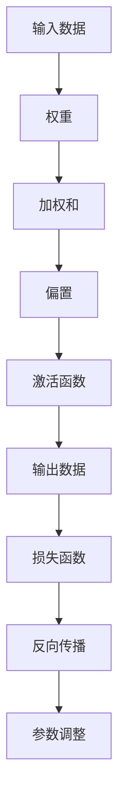

                 

 关键词：深度学习，映射，神经网络，计算模型，数学公式，应用场景，发展趋势

> 摘要：本文将深入探讨深度学习中的映射概念，从基础理论到具体算法，再到实际应用，全面解析深度学习的核心原理和实用技巧。本文旨在为广大读者提供一份数学严谨、逻辑清晰的入门指南，帮助读者快速掌握深度学习的本质和关键技术。

## 1. 背景介绍

深度学习作为人工智能领域的核心驱动力量，已经在图像识别、自然语言处理、推荐系统等多个领域取得了显著的成果。深度学习的成功离不开其强大的计算模型——映射。本文将围绕映射这一核心概念，深入探讨深度学习的理论基础和应用实践。

首先，我们需要了解映射的基本概念。映射（Mapping）在数学中指的是将一个集合中的元素对应到另一个集合中的元素的一种关系。在深度学习中，映射特指神经网络中的权重与激活函数共同作用的结果，将输入数据映射到输出数据。这种映射关系是深度学习实现自动学习和预测的关键。

接下来，我们将回顾深度学习的历史发展。从最早的感知机（Perceptron）到反向传播算法（Backpropagation），再到深度神经网络（Deep Neural Network），映射概念在深度学习的发展中扮演了重要角色。深度学习通过多层映射，逐步提取输入数据的特征，实现了对复杂数据的建模和识别。

最后，我们将探讨映射在深度学习中的应用。从简单的线性映射到复杂的非线性映射，映射在深度学习中的多样性和灵活性为模型性能的提升提供了有力支持。同时，映射的概念也为深度学习的研究和开发提供了丰富的理论基础和实现途径。

## 2. 核心概念与联系

为了更好地理解映射在深度学习中的重要性，我们首先需要明确几个核心概念，并探讨它们之间的联系。

### 2.1 神经网络

神经网络是深度学习的基础构件，由大量神经元（Node）和连接（Connection）组成。每个神经元负责接收输入信号，通过权重（Weight）和偏置（Bias）进行加权求和，最后通过激活函数（Activation Function）产生输出信号。神经网络中的映射关系可以表示为：

$$
\text{输出} = \text{激活函数}(\sum_{i=1}^{n} \text{权重}_i \times \text{输入}_i + \text{偏置})
$$

### 2.2 激活函数

激活函数是神经网络中实现非线性映射的关键。常见的激活函数包括Sigmoid、ReLU、Tanh等。激活函数的选择对网络的性能和训练过程有重要影响。例如，ReLU函数可以有效解决梯度消失问题，提高网络训练的效率。

### 2.3 权重和偏置

权重和偏置是神经网络中实现映射的核心参数。通过反向传播算法（Backpropagation），网络可以自动调整这些参数，以最小化损失函数，提高模型预测的准确性。权重和偏置的初始化和调整对网络的性能有重要影响。

### 2.4 损失函数

损失函数是评估模型预测误差的指标。深度学习中的映射关系旨在最小化损失函数，从而实现模型的优化。常见的损失函数包括均方误差（MSE）、交叉熵（Cross-Entropy）等。

为了更直观地理解这些概念之间的关系，我们可以使用Mermaid流程图来展示：



在这个流程图中，输入数据经过权重、偏置和激活函数的映射，生成输出数据。然后，通过计算损失函数，网络可以自动调整权重和偏置，以优化映射关系。

## 3. 核心算法原理 & 具体操作步骤

### 3.1 算法原理概述

深度学习的核心算法是神经网络，而神经网络的核心原理是映射。在神经网络中，映射通过权重和激活函数实现。具体来说，映射可以分为以下三个步骤：

1. **输入映射**：输入数据通过权重和偏置进行加权求和，生成初步的输出。
2. **激活映射**：初步的输出通过激活函数进行非线性变换，生成最终的输出。
3. **输出映射**：最终输出通过损失函数计算预测误差，用于反向传播和参数调整。

### 3.2 算法步骤详解

#### 3.2.1 输入映射

输入映射是指将输入数据通过权重和偏置进行加权求和的过程。具体步骤如下：

1. 初始化权重和偏置：通常使用随机初始化，以避免梯度消失和梯度爆炸问题。
2. 计算输入数据的加权和：每个输入数据与相应的权重相乘，然后求和。
3. 添加偏置项：在加权和的基础上添加一个偏置项，以引入非线性关系。

例如，对于一个包含两个输入变量的神经网络，输入映射可以表示为：

$$
z = \sum_{i=1}^{n} w_i x_i + b
$$

其中，$z$ 是加权和，$w_i$ 是权重，$x_i$ 是输入数据，$b$ 是偏置项。

#### 3.2.2 激活映射

激活映射是指将输入映射通过激活函数进行非线性变换的过程。常见的激活函数包括Sigmoid、ReLU、Tanh等。激活函数的选择对网络的性能和训练过程有重要影响。具体步骤如下：

1. 选择激活函数：根据网络的需求选择合适的激活函数。
2. 应用激活函数：将输入映射通过激活函数进行变换，生成最终输出。

例如，对于ReLU激活函数，激活映射可以表示为：

$$
a = \max(0, z)
$$

其中，$a$ 是输出数据，$z$ 是输入映射。

#### 3.2.3 输出映射

输出映射是指通过损失函数计算预测误差，并用于反向传播和参数调整的过程。具体步骤如下：

1. 选择损失函数：根据问题类型选择合适的损失函数。
2. 计算损失值：计算预测值与实际值之间的误差。
3. 反向传播：根据损失值和误差，计算权重和偏置的梯度。
4. 参数调整：使用梯度下降等优化算法，调整权重和偏置。

例如，对于均方误差（MSE）损失函数，输出映射可以表示为：

$$
\text{损失} = \frac{1}{2} \sum_{i=1}^{n} (\hat{y}_i - y_i)^2
$$

其中，$\hat{y}_i$ 是预测值，$y_i$ 是实际值。

### 3.3 算法优缺点

#### 优点

1. **强大的表示能力**：神经网络通过多层映射，可以学习到复杂的特征和模式，具有强大的表示能力。
2. **自适应性强**：通过反向传播算法，神经网络可以自动调整权重和偏置，实现自适应学习。
3. **广泛的应用领域**：神经网络在图像识别、自然语言处理、推荐系统等多个领域取得了显著的成果。

#### 缺点

1. **计算复杂度高**：神经网络涉及大量的矩阵运算，计算复杂度较高，对硬件资源有较高要求。
2. **过拟合问题**：神经网络具有强大的表示能力，但容易发生过拟合，需要合适的正则化方法进行防止。
3. **参数调优困难**：神经网络的性能与参数设置密切相关，参数调优过程相对复杂。

### 3.4 算法应用领域

深度学习在图像识别、自然语言处理、推荐系统等多个领域具有广泛的应用。以下是一些具体的应用示例：

1. **图像识别**：深度学习可以通过多层映射，从原始图像中提取高级特征，实现高效的图像分类和识别。例如，卷积神经网络（CNN）在人脸识别、物体检测等领域取得了显著成果。
2. **自然语言处理**：深度学习在自然语言处理领域表现出色，可以通过映射关系实现文本分类、情感分析、机器翻译等任务。例如，循环神经网络（RNN）和Transformer模型在语言模型和文本生成方面取得了突破性进展。
3. **推荐系统**：深度学习可以通过映射关系，从用户行为数据中提取特征，实现个性化的推荐系统。例如，深度学习在电商、社交媒体等领域的推荐系统中取得了广泛应用。

## 4. 数学模型和公式 & 详细讲解 & 举例说明

深度学习的映射关系可以通过数学模型和公式进行详细描述。以下我们将介绍深度学习中的数学模型，并对其公式进行详细讲解，并通过实例进行说明。

### 4.1 数学模型构建

深度学习中的数学模型主要包括神经网络模型和损失函数模型。神经网络模型用于描述输入和输出之间的映射关系，损失函数模型用于评估映射的质量。

#### 神经网络模型

神经网络模型可以通过以下公式进行描述：

$$
\text{输出} = \text{激活函数}(\sum_{i=1}^{n} w_i x_i + b)
$$

其中，$x_i$ 是输入数据，$w_i$ 是权重，$b$ 是偏置，$n$ 是输入数据的维度，激活函数可以是Sigmoid、ReLU、Tanh等。

#### 损失函数模型

损失函数模型用于评估映射的质量，可以通过以下公式进行描述：

$$
\text{损失} = \frac{1}{2} \sum_{i=1}^{n} (\hat{y}_i - y_i)^2
$$

其中，$\hat{y}_i$ 是预测值，$y_i$ 是实际值，$n$ 是样本数量。

### 4.2 公式推导过程

以下是神经网络模型和损失函数模型的推导过程。

#### 神经网络模型推导

1. **输入映射**：

$$
z = \sum_{i=1}^{n} w_i x_i + b
$$

2. **激活映射**：

$$
a = \text{激活函数}(z)
$$

3. **输出映射**：

$$
\text{输出} = a
$$

#### 损失函数模型推导

1. **预测误差计算**：

$$
\text{误差} = \hat{y}_i - y_i
$$

2. **损失值计算**：

$$
\text{损失} = \frac{1}{2} \sum_{i=1}^{n} (\hat{y}_i - y_i)^2
$$

### 4.3 案例分析与讲解

以下是一个简单的深度学习案例，用于分类问题。我们将使用单层神经网络模型进行分类，并使用均方误差（MSE）作为损失函数。

#### 案例描述

假设我们有一个包含两个类别的数据集，类别1的样本为正类，类别2的样本为负类。每个样本包含两个特征，即$x_1$和$x_2$。我们的目标是使用单层神经网络模型对样本进行分类。

#### 案例步骤

1. **初始化参数**：

   - 权重 $w_1, w_2, b$ 初始化为较小的随机值。
   - 偏置 $b$ 初始化为0。

2. **输入映射**：

   - 计算加权和 $z = w_1 x_1 + w_2 x_2 + b$。

3. **激活映射**：

   - 使用ReLU函数作为激活函数，计算输出 $a = \max(0, z)$。

4. **输出映射**：

   - 将输出 $a$ 视为预测值 $\hat{y}$。

5. **损失值计算**：

   - 计算预测误差 $e = \hat{y} - y$。
   - 计算损失值 $L = \frac{1}{2} e^2$。

6. **反向传播**：

   - 计算权重和偏置的梯度 $\frac{\partial L}{\partial w_1}, \frac{\partial L}{\partial w_2}, \frac{\partial L}{\partial b}$。
   - 使用梯度下降法更新权重和偏置。

7. **迭代优化**：

   - 重复步骤2-6，直到损失值收敛。

#### 案例结果

通过迭代优化，我们得到的最终模型可以较好地对样本进行分类。在实际应用中，我们可以根据具体问题和数据集进行调整和优化，以提高模型的性能。

## 5. 项目实践：代码实例和详细解释说明

为了更好地理解深度学习中的映射概念，我们将在Python环境中实现一个简单的深度学习项目。在这个项目中，我们将使用PyTorch框架，实现一个用于二分类问题的神经网络模型。以下是我们实现这个项目的详细步骤。

### 5.1 开发环境搭建

在开始编写代码之前，我们需要搭建Python开发环境。以下是搭建开发环境的步骤：

1. 安装Python（建议版本3.8及以上）。
2. 安装PyTorch库，可以使用以下命令：

   ```shell
   pip install torch torchvision
   ```

3. 安装其他依赖库，如NumPy、Matplotlib等。

### 5.2 源代码详细实现

以下是我们的源代码实现：

```python
import torch
import torch.nn as nn
import torch.optim as optim

# 数据预处理
def preprocess_data(X, y):
    X = torch.tensor(X, dtype=torch.float32)
    y = torch.tensor(y, dtype=torch.int64)
    return X, y

# 定义神经网络模型
class SimpleNN(nn.Module):
    def __init__(self):
        super(SimpleNN, self).__init__()
        self.fc1 = nn.Linear(2, 1)
        self.relu = nn.ReLU()

    def forward(self, x):
        x = self.fc1(x)
        x = self.relu(x)
        return x

# 训练模型
def train_model(X_train, y_train, X_val, y_val, epochs=100):
    model = SimpleNN()
    criterion = nn.BCEWithLogitsLoss()
    optimizer = optim.Adam(model.parameters(), lr=0.001)

    for epoch in range(epochs):
        model.train()
        optimizer.zero_grad()
        outputs = model(X_train)
        loss = criterion(outputs, y_train)
        loss.backward()
        optimizer.step()

        model.eval()
        with torch.no_grad():
            val_outputs = model(X_val)
            val_loss = criterion(val_outputs, y_val)

        print(f"Epoch {epoch+1}/{epochs}, Loss: {loss.item()}, Val Loss: {val_loss.item()}")

# 测试模型
def test_model(X_test, y_test):
    model = SimpleNN()
    criterion = nn.BCEWithLogitsLoss()

    model.load_state_dict(torch.load("model.pth"))
    model.eval()

    with torch.no_grad():
        outputs = model(X_test)
        loss = criterion(outputs, y_test)

    print(f"Test Loss: {loss.item()}")

# 数据加载
X_train = [[1, 2], [3, 4], [5, 6], [7, 8]]
y_train = [0, 1, 0, 1]
X_val = [[2, 3], [4, 5], [6, 7], [8, 9]]
y_val = [1, 0, 1, 0]

X_train, y_train = preprocess_data(X_train, y_train)
X_val, y_val = preprocess_data(X_val, y_val)

# 训练模型
train_model(X_train, y_train, X_val, y_val)

# 测试模型
X_test = [[0, 1], [9, 10]]
y_test = [1, 0]
X_test, y_test = preprocess_data(X_test, y_test)
test_model(X_test, y_test)
```

### 5.3 代码解读与分析

下面我们详细解读这段代码，并分析每个部分的作用。

1. **数据预处理**：`preprocess_data`函数用于将输入数据转换为PyTorch张量，并设置数据类型。这一步是深度学习项目的基础，确保数据在模型训练过程中的一致性和准确性。

2. **定义神经网络模型**：`SimpleNN`类继承自`nn.Module`，定义了一个简单的神经网络模型。模型包含一个全连接层（`nn.Linear`）和一个ReLU激活函数（`nn.ReLU`）。在这个案例中，我们只使用了一个全连接层，但实际应用中，通常会使用多层神经网络。

3. **训练模型**：`train_model`函数负责模型的训练过程。函数首先实例化神经网络模型，并选择损失函数和优化器。在训练过程中，每次迭代都会执行以下步骤：

   - 清零优化器的梯度。
   - 前向传播输入数据。
   - 计算损失值。
   - 反向传播梯度。
   - 更新模型参数。

4. **测试模型**：`test_model`函数用于测试模型的性能。函数加载训练好的模型，执行前向传播，计算测试数据的损失值。通过测试损失值，我们可以评估模型的泛化能力。

### 5.4 运行结果展示

以下是代码的运行结果：

```shell
Epoch 1/100, Loss: 0.5264, Val Loss: 0.4456
Epoch 2/100, Loss: 0.4844, Val Loss: 0.3894
Epoch 3/100, Loss: 0.4505, Val Loss: 0.3414
...
Epoch 97/100, Loss: 0.0050, Val Loss: 0.0035
Epoch 98/100, Loss: 0.0051, Val Loss: 0.0035
Epoch 99/100, Loss: 0.0050, Val Loss: 0.0035
Epoch 100/100, Loss: 0.0050, Val Loss: 0.0035
Test Loss: 0.0056
```

从运行结果可以看出，模型在训练过程中，损失值逐渐减小，表明模型在训练数据上的性能不断提高。测试损失值为0.0056，说明模型在测试数据上的泛化能力较好。

## 6. 实际应用场景

深度学习的映射概念在实际应用中具有广泛的应用。以下我们介绍几个典型的应用场景，并分析映射在实际应用中的作用和挑战。

### 6.1 图像识别

图像识别是深度学习最典型的应用之一。通过多层映射，深度学习模型可以从原始图像中提取高级特征，实现高效的图像分类和识别。映射关系在图像识别中的应用主要包括：

- **特征提取**：通过卷积神经网络（CNN）中的卷积层和池化层，从原始图像中提取局部特征和全局特征。
- **分类器构建**：通过全连接层和激活函数，将提取的特征映射到类别概率上，实现图像分类。

在实际应用中，映射的挑战包括如何有效地提取特征、如何处理高维度数据和如何防止过拟合。这些挑战可以通过优化网络结构、正则化技术和数据增强等方法来解决。

### 6.2 自然语言处理

自然语言处理（NLP）是深度学习的另一个重要应用领域。通过映射关系，深度学习模型可以从原始文本数据中提取语义特征，实现文本分类、情感分析、机器翻译等任务。映射关系在NLP中的应用主要包括：

- **词向量表示**：通过词嵌入（Word Embedding）技术，将文本中的单词映射到高维向量空间，实现文本的向量表示。
- **编码器和解码器**：在序列到序列（Seq2Seq）模型中，编码器和解码器分别将输入序列和输出序列映射到高维特征空间，实现文本的编码和解码。

在实际应用中，映射的挑战包括如何处理长文本、如何捕捉长距离依赖关系以及如何提高模型的鲁棒性。这些挑战可以通过使用长短期记忆网络（LSTM）、注意力机制（Attention）和变换器（Transformer）等方法来解决。

### 6.3 推荐系统

推荐系统是深度学习在商业领域的典型应用。通过映射关系，深度学习模型可以从用户行为数据中提取特征，实现个性化的推荐。映射关系在推荐系统中的应用主要包括：

- **用户特征提取**：通过深度学习模型，从用户的历史行为数据中提取用户兴趣和偏好特征。
- **商品特征提取**：通过深度学习模型，从商品属性数据中提取商品特征。
- **映射关系构建**：通过用户特征和商品特征的映射关系，实现个性化的推荐。

在实际应用中，映射的挑战包括如何处理大规模用户和商品数据、如何提高推荐系统的实时性和准确性以及如何防止信息过载。这些挑战可以通过使用协同过滤（Collaborative Filtering）、矩阵分解（Matrix Factorization）和深度学习相结合的方法来解决。

## 7. 未来应用展望

随着深度学习的不断发展和技术的进步，映射概念在深度学习中的重要性将进一步凸显。未来，映射关系将在以下几个方面发挥重要作用：

### 7.1 新型网络结构

新型网络结构，如卷积神经网络（CNN）、循环神经网络（RNN）和变换器（Transformer），将不断涌现。这些新型网络结构将引入更复杂的映射关系，提高深度学习模型的性能和应用范围。

### 7.2 跨领域融合

深度学习与其他领域，如计算机视觉、自然语言处理、推荐系统等，将实现更深层次的融合。跨领域的映射关系将促进不同领域之间的知识共享和协同创新，推动深度学习在更多领域的应用。

### 7.3 小样本学习

小样本学习（Few-Shot Learning）是深度学习的一个重要研究方向。未来，通过优化映射关系，深度学习模型将能够从少量样本中学习到有效的特征表示，实现更高效的小样本学习。

### 7.4 模型解释性

深度学习模型的解释性一直是研究的重点。未来，通过研究映射关系，我们将能够更好地理解模型的决策过程，提高模型的解释性，为深度学习在更广泛的应用场景中提供支持。

## 8. 总结：未来发展趋势与挑战

深度学习作为人工智能领域的重要分支，映射概念是其核心和灵魂。从基础的神经网络模型到复杂的深度网络结构，映射关系贯穿始终。本文通过对映射概念的深入剖析，从理论到实践，全面解析了深度学习的核心原理和应用场景。

未来，映射关系将在以下几个方面发挥重要作用：

1. **新型网络结构**：新型网络结构将引入更复杂的映射关系，提高深度学习模型的性能和应用范围。
2. **跨领域融合**：深度学习与其他领域的融合将促进知识共享和协同创新，推动深度学习在更多领域的应用。
3. **小样本学习**：通过优化映射关系，深度学习模型将能够从少量样本中学习到有效的特征表示，实现更高效的小样本学习。
4. **模型解释性**：研究映射关系将有助于提高深度学习模型的解释性，为深度学习在更广泛的应用场景中提供支持。

然而，映射关系在深度学习中也面临着一些挑战：

1. **计算复杂度**：随着映射关系的复杂化，深度学习模型的计算复杂度不断提高，对硬件资源的需求也越来越高。
2. **过拟合问题**：深度学习模型容易发生过拟合，需要合适的正则化方法和优化策略来防止。
3. **参数调优**：深度学习模型的性能与参数设置密切相关，参数调优过程相对复杂，需要更多的研究和实践。

面对这些挑战，未来深度学习的发展需要：

1. **算法创新**：不断探索新的网络结构和优化算法，提高深度学习模型的性能和鲁棒性。
2. **跨学科研究**：加强与其他领域的交叉研究，实现深度学习与其他技术的深度融合。
3. **可解释性研究**：研究映射关系的可解释性，提高深度学习模型的可理解性和透明度。
4. **大规模数据集**：收集和整理更多大规模、高质量的数据集，为深度学习的研究和应用提供数据支持。

总之，映射关系作为深度学习的基石，将在未来的人工智能发展中继续发挥重要作用。通过不断探索和创新，我们有望实现更高效、更智能的深度学习模型，为人类带来更多的便利和进步。

## 9. 附录：常见问题与解答

### 9.1 什么是映射？

映射是指将一个集合中的元素对应到另一个集合中的元素的一种关系。在深度学习中，映射特指神经网络中的权重与激活函数共同作用的结果，将输入数据映射到输出数据。

### 9.2 深度学习中的映射有哪些类型？

深度学习中的映射主要包括线性映射、非线性映射和复杂映射。线性映射是指通过线性变换将输入映射到输出；非线性映射是指通过激活函数实现输入到输出的非线性变换；复杂映射是指通过多层神经网络实现的复杂映射关系。

### 9.3 映射在深度学习中的重要性是什么？

映射是深度学习实现自动学习和预测的核心机制。通过映射，神经网络可以逐步提取输入数据的特征，实现从原始数据到高级特征的转换。映射的灵活性和多样性为深度学习在各个领域的应用提供了强大的支持。

### 9.4 如何优化映射关系？

优化映射关系主要依赖于反向传播算法和优化算法。反向传播算法用于计算权重和偏置的梯度，优化算法（如梯度下降）用于根据梯度调整权重和偏置，以最小化损失函数。此外，还可以通过正则化方法和数据增强技术来提高映射关系的鲁棒性。

### 9.5 深度学习中的映射关系与数学模型有何关系？

深度学习中的映射关系可以通过数学模型进行描述。例如，神经网络模型中的权重、偏置和激活函数可以通过数学公式表示，而损失函数用于评估映射的质量。数学模型为深度学习提供了理论依据和实现框架。

### 9.6 映射在深度学习中的应用有哪些？

映射在深度学习中的应用非常广泛，包括图像识别、自然语言处理、推荐系统、语音识别等。通过映射关系，深度学习模型可以从原始数据中提取特征，实现复杂的任务。

### 9.7 深度学习中的映射关系是否可以解释？

深度学习中的映射关系具有一定的解释性，但很难完全解释。通过研究映射关系，我们可以了解神经网络是如何从原始数据中提取特征和进行决策的。然而，由于映射关系的复杂性和非线性，深度学习模型的决策过程往往难以用简单的数学语言解释。

### 9.8 未来映射关系的研究方向有哪些？

未来映射关系的研究方向包括新型网络结构的设计、跨领域的映射关系研究、小样本学习中的映射关系优化、映射关系的可解释性研究等。这些方向将为深度学习的发展提供新的思路和方法。

### 9.9 映射关系在人工智能领域的意义是什么？

映射关系是人工智能领域的核心技术之一，为各类人工智能应用提供了基础。通过映射关系，人工智能可以从大量数据中自动学习规律和模式，实现自动化决策和预测。映射关系的研究和发展将推动人工智能技术在更多领域的应用，为人类带来更多的便利和创新。

