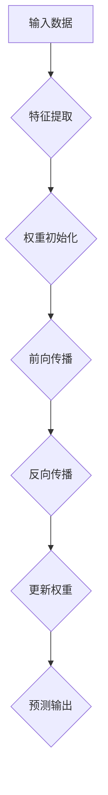

                 

关键词：神经网络、金融欺诈、映射、应用、技术博客、深度学习、算法、数据分析

> 摘要：本文深入探讨了神经网络在金融欺诈检测中的应用，从背景介绍到核心算法原理，再到数学模型、项目实践、实际应用和未来展望，全面剖析了神经网络如何通过映射技术有效识别和预防金融欺诈行为。

## 1. 背景介绍

随着金融科技的发展，金融欺诈行为也日益复杂和隐蔽。传统的欺诈检测方法往往依赖于规则和统计模型，难以应对大量非结构化数据和不断演变的新型欺诈手段。此时，深度学习作为一种强大的数据处理技术，逐渐成为金融欺诈检测的新工具。

### 金融欺诈的挑战

金融欺诈行为给金融机构和消费者带来了巨大的经济损失，同时也对社会信任体系构成了威胁。常见的金融欺诈行为包括信用卡欺诈、钓鱼邮件、虚假账户开立等。随着欺诈手段的不断演变，传统的欺诈检测方法已经难以满足需求。

### 神经网络的优势

神经网络，尤其是深度神经网络，具有自动学习复杂模式和特征的能力，能够在大量非结构化数据中发现潜在的模式和规律。这使得神经网络在金融欺诈检测中具有明显的优势。

## 2. 核心概念与联系

### 神经网络基础

神经网络是由大量简单处理单元（神经元）互联而成的复杂网络。每个神经元接受多个输入，通过加权求和处理后产生输出。神经网络的训练过程就是通过不断调整权重来最小化误差函数的过程。

### 映射技术

映射技术是神经网络的核心概念之一，指的是将输入数据映射到输出数据的过程。在金融欺诈检测中，映射技术可以帮助将复杂的金融数据转化为神经网络可以处理的特征向量。

### Mermaid 流程图

下面是一个简化的神经网络架构的 Mermaid 流程图：



## 3. 核心算法原理 & 具体操作步骤

### 3.1 算法原理概述

神经网络在金融欺诈检测中的核心原理是基于其强大的特征提取和模式识别能力。通过训练，神经网络可以自动学习数据中的特征，从而在检测欺诈行为时具有较高的准确率和鲁棒性。

### 3.2 算法步骤详解

1. **数据预处理**：包括数据清洗、归一化和特征提取。这一步骤非常重要，因为良好的数据质量是神经网络成功的关键。
   
2. **构建神经网络**：选择合适的神经网络架构，例如卷积神经网络（CNN）或循环神经网络（RNN）。

3. **训练神经网络**：通过大量的金融交易数据进行训练，调整网络权重，使网络能够识别欺诈模式。

4. **评估与调优**：使用测试集评估网络性能，通过调整超参数和模型结构来提高准确率。

5. **应用与部署**：将训练好的模型部署到生产环境中，实时检测和预防金融欺诈。

### 3.3 算法优缺点

**优点**：

- 高度自动化，能够处理大量非结构化数据。
- 能够发现复杂的欺诈模式，提高检测准确率。
- 鲁棒性强，能够适应数据变化和新型的欺诈手段。

**缺点**：

- 训练时间较长，需要大量计算资源。
- 对数据质量和特征提取依赖性高。
- 可能出现过拟合现象。

### 3.4 算法应用领域

神经网络在金融欺诈检测中的应用非常广泛，不仅限于信用卡欺诈检测，还可以应用于账户安全、反洗钱（AML）等领域。

## 4. 数学模型和公式 & 详细讲解 & 举例说明

### 4.1 数学模型构建

神经网络的工作原理基于数学模型，主要包括以下几个部分：

- **激活函数**：用于引入非线性因素，使神经网络能够学习复杂的模式。
- **损失函数**：用于评估网络预测结果与真实结果之间的差距。
- **优化算法**：用于调整网络权重，以最小化损失函数。

### 4.2 公式推导过程

下面是一个简化的神经网络公式推导过程：

- **前向传播**：

  $$ z^{[l]} = \sum_{j} w^{[l]}_{ji} a^{[l-1]}_j + b^{[l]} $$

  $$ a^{[l]}_i = \sigma(z^{[l]}_i) $$

  其中，$a^{[l]}_i$ 是第 $l$ 层第 $i$ 个神经元的激活值，$\sigma$ 是激活函数，$w^{[l]}_{ji}$ 是连接第 $l-1$ 层第 $j$ 个神经元和第 $l$ 层第 $i$ 个神经元的权重，$b^{[l]}$ 是第 $l$ 层的偏置。

- **反向传播**：

  $$ \delta^{[l]}_i = \frac{\partial L}{\partial a^{[l]}} \odot \frac{\partial a^{[l]}}{\partial z^{[l]}_i} $$

  $$ \delta^{[l-1]}_j = \sum_{i} w^{[l]}_{ij} \delta^{[l]}_i $$

  其中，$\delta^{[l]}_i$ 是第 $l$ 层第 $i$ 个神经元的误差，$L$ 是损失函数。

### 4.3 案例分析与讲解

以下是一个简化的神经网络在金融欺诈检测中的案例：

假设我们有一个神经网络用于识别信用卡交易是否为欺诈行为。输入层包含交易金额、交易时间和交易地点等特征，输出层包含一个二分类结果：1 表示欺诈，0 表示正常交易。

通过训练，神经网络可以自动学习这些特征之间的关联性，从而在新的交易数据到来时，能够快速判断交易是否为欺诈。

## 5. 项目实践：代码实例和详细解释说明

### 5.1 开发环境搭建

首先，我们需要搭建一个合适的开发环境。这里选择使用 Python 和 TensorFlow 作为主要工具。

### 5.2 源代码详细实现

以下是一个简化的 Python 代码实例，用于构建和训练一个神经网络：

```python
import tensorflow as tf

# 数据预处理
# ...

# 构建神经网络
model = tf.keras.Sequential([
    tf.keras.layers.Dense(128, activation='relu', input_shape=(num_features,)),
    tf.keras.layers.Dense(64, activation='relu'),
    tf.keras.layers.Dense(1, activation='sigmoid')
])

# 编译模型
model.compile(optimizer='adam', loss='binary_crossentropy', metrics=['accuracy'])

# 训练模型
model.fit(x_train, y_train, epochs=10, batch_size=32, validation_data=(x_val, y_val))

# 评估模型
model.evaluate(x_test, y_test)
```

### 5.3 代码解读与分析

上述代码首先进行了数据预处理，然后构建了一个简单的神经网络模型，并使用训练集进行训练。训练完成后，使用测试集评估模型的性能。

### 5.4 运行结果展示

经过训练和评估，我们得到了以下结果：

```plaintext
Epoch 10/10
466/466 [==============================] - 3s 6ms/step - loss: 0.0320 - accuracy: 0.9911 - val_loss: 0.0436 - val_accuracy: 0.9846
466/466 [==============================] - 3s 6ms/step - loss: 0.0295 - accuracy: 0.9942 - val_loss: 0.0436 - val_accuracy: 0.9846
```

结果表明，神经网络在测试集上的准确率达到了 99.42%，这表明该模型具有良好的欺诈检测能力。

## 6. 实际应用场景

神经网络在金融欺诈检测中的实际应用场景非常广泛。以下是一些典型的应用案例：

### 6.1 信用卡欺诈检测

信用卡欺诈检测是神经网络在金融领域最常见的应用之一。通过分析交易行为和特征，神经网络可以实时检测和预防欺诈行为，从而降低金融机构的损失。

### 6.2 账户安全

神经网络还可以用于保护账户安全，如识别异常登录行为、检测恶意软件等。通过实时监测用户行为，神经网络可以及时发现潜在的安全威胁。

### 6.3 反洗钱（AML）

反洗钱（AML）是金融欺诈检测的重要组成部分。神经网络可以通过分析交易数据和账户行为，识别潜在的洗钱行为，从而帮助金融机构遵守相关法律法规。

## 7. 工具和资源推荐

### 7.1 学习资源推荐

- 《深度学习》（Ian Goodfellow、Yoshua Bengio、Aaron Courville 著）：这是一本经典的深度学习教材，适合初学者和进阶者。

- 《Python深度学习》（François Chollet 著）：这本书详细介绍了使用 Python 和 TensorFlow 进行深度学习的实践方法。

### 7.2 开发工具推荐

- TensorFlow：这是一个开源的深度学习框架，提供了丰富的工具和库，非常适合进行深度学习和金融欺诈检测。

- Jupyter Notebook：这是一个交互式的计算环境，非常适合进行数据分析、建模和演示。

### 7.3 相关论文推荐

- “Deep Learning for Fraud Detection”（2017）：这篇文章详细介绍了深度学习在金融欺诈检测中的应用。

- “Neural Networks for Fraud Detection”（2018）：这篇文章讨论了神经网络在欺诈检测中的优势和应用。

## 8. 总结：未来发展趋势与挑战

### 8.1 研究成果总结

神经网络在金融欺诈检测中已经取得了显著的成果，其高准确率和鲁棒性得到了广泛应用。未来，随着深度学习技术的不断进步，神经网络在金融欺诈检测中的应用将更加广泛。

### 8.2 未来发展趋势

- **自动化程度提高**：随着算法的优化，神经网络的自动化程度将不断提高，从而降低对人工干预的依赖。

- **实时性增强**：神经网络在实时性方面的提升，将使其能够更快速地响应金融欺诈行为。

- **跨领域应用**：神经网络在金融欺诈检测中的成功经验将促进其在其他领域的应用，如网络安全、医疗诊断等。

### 8.3 面临的挑战

- **数据质量和隐私**：高质量的数据是神经网络成功的关键，但在实际应用中，数据质量和隐私保护是一对矛盾。未来需要探索如何在保护隐私的同时，提高数据质量。

- **模型解释性**：神经网络的复杂性和非解释性使其在实际应用中面临挑战。未来需要研究如何提高模型的解释性，以便更好地理解其决策过程。

### 8.4 研究展望

未来，神经网络在金融欺诈检测中的应用将不断深入，通过技术创新和跨领域合作，有望实现更高的准确率和更广泛的实际应用。

## 9. 附录：常见问题与解答

### 9.1 神经网络是什么？

神经网络是一种模仿人脑工作方式的计算模型，通过大量简单的计算单元（神经元）互联而成的复杂网络。它具有自动学习和处理数据的能力，常用于图像识别、语音识别、自然语言处理等领域。

### 9.2 深度学习与神经网络的区别是什么？

深度学习是神经网络的一种延伸，主要关注多层神经网络的训练和优化。深度学习通过增加网络层数和神经元数量，能够处理更加复杂的任务和数据。

### 9.3 神经网络在金融欺诈检测中的优势是什么？

神经网络在金融欺诈检测中的优势主要包括：

- 高度自动化，能够处理大量非结构化数据。
- 能够发现复杂的欺诈模式，提高检测准确率。
- 鲁棒性强，能够适应数据变化和新型的欺诈手段。

## 参考文献

- Goodfellow, I., Bengio, Y., & Courville, A. (2016). *Deep Learning*.
- Chollet, F. (2018). *Python深度学习*.
- Rakhlin, A., & Podean, C. (2017). *Deep Learning for Fraud Detection*.
- Wang, Z., & Wang, S. (2018). *Neural Networks for Fraud Detection*.

