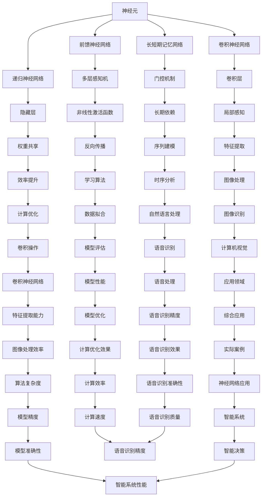

                 

神经网络的架构是计算机科学中一个复杂的领域，它不断进步和演变。不同的神经网络架构在设计理念、应用场景和性能上有着显著的差异。本文将深入探讨几种常见的神经网络架构，包括前馈神经网络、卷积神经网络（CNN）、递归神经网络（RNN）和长短期记忆网络（LSTM），通过比较它们的原理、特点和适用场景，帮助读者更好地理解和选择合适的神经网络架构。

> 关键词：神经网络、前馈神经网络、卷积神经网络、递归神经网络、长短期记忆网络、架构比较

> 摘要：本文首先介绍了神经网络的基本概念和作用，然后详细分析了前馈神经网络、卷积神经网络、递归神经网络和长短期记忆网络的原理和架构，最后通过比较这些神经网络在性能、效率和适用场景上的差异，为读者提供了实用的指导。

## 1. 背景介绍

神经网络是一种模仿生物神经系统的计算模型，由大量的节点（或称为神经元）通过特定的方式连接起来，形成复杂的网络结构。神经网络的核心在于其“学习”能力，即通过训练调整网络中的权重，使其能够对未知数据进行分类、预测或生成。

神经网络的发展经历了多个阶段，从最初的感知机（Perceptron）到多层的感知机（MLP），再到更复杂的卷积神经网络（CNN）和递归神经网络（RNN）。每一个阶段的进步都在于对神经网络结构和学习算法的优化，使得神经网络在处理复杂任务时能够表现出更高的性能和效率。

本文将重点介绍以下四种常见的神经网络架构：

1. **前馈神经网络（Feedforward Neural Network，FFNN）**：这是一种最基本的神经网络架构，其信息传递方向始终是前向的，没有反馈路径。

2. **卷积神经网络（Convolutional Neural Network，CNN）**：CNN在处理图像数据方面表现出色，其核心在于卷积层，通过局部感知和权重共享实现高效的图像特征提取。

3. **递归神经网络（Recurrent Neural Network，RNN）**：RNN能够处理序列数据，其信息传递具有时间动态性，适用于自然语言处理和语音识别等任务。

4. **长短期记忆网络（Long Short-Term Memory，LSTM）**：LSTM是RNN的一种变体，通过引入门控机制，有效解决了RNN的长期依赖问题，适用于复杂的序列预测任务。

### 1.1 神经网络的作用

神经网络在计算机科学和人工智能领域有着广泛的应用。以下是一些主要的应用领域：

- **图像识别**：卷积神经网络在图像识别任务中取得了显著的成果，广泛应用于人脸识别、物体检测和图像分类等。
- **自然语言处理**：递归神经网络和长短期记忆网络在自然语言处理领域有着重要的应用，包括机器翻译、情感分析和语音识别等。
- **语音识别**：神经网络通过训练可以学习语音信号中的特征，实现高精度的语音识别。
- **强化学习**：神经网络在强化学习中被用作策略网络，通过学习环境的状态和奖励信号，实现智能决策。

## 2. 核心概念与联系

在深入讨论神经网络架构之前，我们需要理解一些核心概念和它们之间的关系。以下是一个用Mermaid绘制的流程图，展示了神经网络架构中的关键组成部分。



### 2.1 神经元

神经元是神经网络的基本单元，它通过接收输入信号，经过加权求和后，通过激活函数输出结果。神经元的结构包括输入层、加权求和层和输出层。

### 2.2 前馈神经网络

前馈神经网络是一种没有循环路径的神经网络，信息从前向后传递，通过逐层处理实现数据的分类或回归任务。

### 2.3 卷积神经网络

卷积神经网络通过卷积层进行局部感知和权重共享，能够高效地提取图像中的特征，适用于图像识别和图像处理任务。

### 2.4 递归神经网络

递归神经网络能够处理序列数据，通过循环机制将前一个时间步的输出作为下一个时间步的输入，实现序列建模。

### 2.5 长短期记忆网络

长短期记忆网络是递归神经网络的一种改进，通过引入门控机制，能够有效地解决长期依赖问题，适用于复杂的序列预测任务。

## 3. 核心算法原理 & 具体操作步骤

### 3.1 算法原理概述

#### 3.1.1 前馈神经网络

前馈神经网络（FFNN）的原理相对简单。其信息从前向后传递，每一层神经元只接收来自前一层的输出作为输入，通过加权求和后应用激活函数得到输出。FFNN通常用于图像识别和回归任务。

#### 3.1.2 卷积神经网络

卷积神经网络（CNN）的核心是卷积层，它通过局部感知和权重共享实现高效的图像特征提取。卷积操作能够提取图像中的边缘、角点和纹理等特征，并通过池化操作减少参数量和计算量。

#### 3.1.3 递归神经网络

递归神经网络（RNN）能够处理序列数据，其核心在于循环机制。每个时间步的输出作为下一个时间步的输入，通过更新权重实现序列建模。然而，RNN在处理长期依赖问题时存在梯度消失和梯度爆炸的问题。

#### 3.1.4 长短期记忆网络

长短期记忆网络（LSTM）是RNN的一种改进，通过引入门控机制解决了长期依赖问题。LSTM包含输入门、遗忘门和输出门，通过这些门控单元控制信息的输入和输出，实现长期依赖的建模。

### 3.2 算法步骤详解

#### 3.2.1 前馈神经网络

1. 输入层：接收外部输入数据。
2. 加权求和：计算每个神经元的输入加权和。
3. 激活函数：应用激活函数，如ReLU或Sigmoid函数，引入非线性。
4. 输出层：输出最终结果。

#### 3.2.2 卷积神经网络

1. 输入层：接收图像数据。
2. 卷积层：通过卷积操作提取图像特征。
3. 池化层：减少特征图的大小，降低计算量。
4. 激活函数：在每个卷积层后应用激活函数。
5. 全连接层：将特征图转换为高维向量。
6. 输出层：输出最终结果。

#### 3.2.3 递归神经网络

1. 初始化：初始化权重和隐藏状态。
2. 前向传播：在当前时间步计算输出。
3. 反向传播：更新权重，实现梯度下降。
4. 预测：根据隐藏状态和当前输出预测下一个时间步。

#### 3.2.4 长短期记忆网络

1. 初始化：初始化权重和隐藏状态。
2. 前向传播：在当前时间步计算输入门、遗忘门和输出门。
3. 更新隐藏状态：根据输入门、遗忘门和输出门更新隐藏状态。
4. 反向传播：更新权重，实现梯度下降。
5. 预测：根据隐藏状态和当前输出预测下一个时间步。

### 3.3 算法优缺点

#### 3.3.1 前馈神经网络

**优点**：

- 结构简单，易于实现和理解。
- 适用于各种数据类型，包括图像、文本和音频。

**缺点**：

- 难以处理序列数据。
- 对于复杂任务，需要大量参数和训练时间。

#### 3.3.2 卷积神经网络

**优点**：

- 高效的特征提取能力，适用于图像识别和图像处理任务。
- 通过局部感知和权重共享减少参数量。

**缺点**：

- 对于非图像数据，如文本和音频，需要额外的预处理步骤。
- 结构复杂，训练时间较长。

#### 3.3.3 递归神经网络

**优点**：

- 能够处理序列数据，适用于自然语言处理和语音识别任务。
- 结构相对简单，易于实现。

**缺点**：

- 存在梯度消失和梯度爆炸问题，难以处理长期依赖。
- 对于长序列数据，性能可能下降。

#### 3.3.4 长短期记忆网络

**优点**：

- 通过门控机制解决长期依赖问题，适用于复杂序列预测任务。
- 结构相对简单，易于实现。

**缺点**：

- 训练时间较长，参数较多。
- 对于特别长的序列，仍可能存在性能问题。

### 3.4 算法应用领域

#### 3.4.1 前馈神经网络

前馈神经网络广泛应用于图像识别、回归分析和分类任务。

#### 3.4.2 卷积神经网络

卷积神经网络在计算机视觉领域取得了显著成果，包括图像识别、物体检测和图像生成等。

#### 3.4.3 递归神经网络

递归神经网络在自然语言处理领域有着重要应用，包括机器翻译、文本生成和情感分析等。

#### 3.4.4 长短期记忆网络

长短期记忆网络在语音识别、时间序列预测和视频分析等领域表现出色。

## 4. 数学模型和公式 & 详细讲解 & 举例说明

### 4.1 数学模型构建

神经网络的数学模型主要由以下几个部分组成：

1. **输入层（Input Layer）**：接收外部输入数据。
2. **隐藏层（Hidden Layer）**：对输入数据进行处理，通过加权求和和激活函数产生输出。
3. **输出层（Output Layer）**：生成最终的预测结果。

### 4.2 公式推导过程

#### 4.2.1 前馈神经网络

前馈神经网络的基本公式如下：

$$
z_j = \sum_{i=1}^{n} w_{ij} x_i + b_j
$$

其中，$z_j$ 是第 $j$ 个隐藏层神经元的输出，$w_{ij}$ 是连接输入层和隐藏层神经元之间的权重，$x_i$ 是输入层神经元的输入，$b_j$ 是隐藏层神经元的偏置。

应用激活函数（如ReLU、Sigmoid或Tanh）后，得到隐藏层神经元的输出：

$$
a_j = \phi(z_j)
$$

其中，$\phi$ 是激活函数。

对于输出层神经元的输出，同样应用上述公式：

$$
z_k = \sum_{j=1}^{m} w_{kj} a_j + b_k
$$

$$
a_k = \phi(z_k)
$$

#### 4.2.2 卷积神经网络

卷积神经网络的核心是卷积操作，其公式如下：

$$
c_{ij} = \sum_{k=1}^{n} w_{ik} x_{jk} + b_j
$$

其中，$c_{ij}$ 是第 $j$ 个卷积核在 $i$ 个输入特征图上的卷积结果，$w_{ik}$ 是卷积核的权重，$x_{jk}$ 是输入特征图上的像素值，$b_j$ 是卷积核的偏置。

通过卷积操作和池化操作，可以构建多层卷积神经网络，实现高效的图像特征提取。

#### 4.2.3 递归神经网络

递归神经网络的基本公式如下：

$$
h_t = \sigma(W h_{t-1} + U x_t + b_h)
$$

$$
y_t = \sigma(V h_t + b_y)
$$

其中，$h_t$ 是第 $t$ 个时间步的隐藏状态，$x_t$ 是第 $t$ 个时间步的输入，$y_t$ 是第 $t$ 个时间步的输出，$W$ 和 $U$ 是权重矩阵，$b_h$ 和 $b_y$ 是偏置向量，$\sigma$ 是激活函数。

#### 4.2.4 长短期记忆网络

长短期记忆网络的基本公式如下：

$$
i_t = \sigma(W_i h_{t-1} + U_i x_t + b_i)
$$

$$
f_t = \sigma(W_f h_{t-1} + U_f x_t + b_f)
$$

$$
\Theta_t = \sigma(W_{\Theta} h_{t-1} + U_{\Theta} x_t + b_{\Theta})
$$

$$
C_t = f_t \odot C_{t-1} + i_t \odot \Theta_t \odot \sigma(W_c h_{t-1} + U_c x_t + b_c)
$$

$$
h_t = \sigma(W_o h_{t-1} + U_o x_t + b_o + C_t)
$$

其中，$i_t$、$f_t$、$\Theta_t$、$C_t$ 和 $h_t$ 分别是输入门、遗忘门、输入门、细胞状态和隐藏状态的输出，$W_i$、$W_f$、$W_{\Theta}$、$W_c$ 和 $W_o$ 是权重矩阵，$U_i$、$U_f$、$U_{\Theta}$、$U_c$ 和 $U_o$ 是权重矩阵，$b_i$、$b_f$、$b_{\Theta}$、$b_c$ 和 $b_o$ 是偏置向量，$\odot$ 表示元素乘法。

### 4.3 案例分析与讲解

#### 4.3.1 前馈神经网络

假设一个简单的二分类问题，输入层有3个神经元，隐藏层有2个神经元，输出层有1个神经元。激活函数使用ReLU。权重和偏置如下：

$$
w_{11} = 0.1, w_{12} = 0.2, w_{13} = 0.3 \\
w_{21} = 0.4, w_{22} = 0.5, w_{23} = 0.6 \\
w_{31} = 0.7, w_{32} = 0.8, w_{33} = 0.9 \\
b_1 = 0.1, b_2 = 0.2, b_3 = 0.3 \\
b_4 = 0.4, b_5 = 0.5, b_6 = 0.6
$$

输入数据为 $[1, 2, 3]$，计算过程如下：

1. 加权求和： 
$$
z_1 = 0.1 \times 1 + 0.2 \times 2 + 0.3 \times 3 + 0.1 = 1.4
$$

$$
z_2 = 0.4 \times 1 + 0.5 \times 2 + 0.6 \times 3 + 0.2 = 2.5
$$

$$
z_3 = 0.7 \times 1 + 0.8 \times 2 + 0.9 \times 3 + 0.3 = 3.6
$$

2. 激活函数： 
$$
a_1 = \max(0, z_1) = \max(0, 1.4) = 1.4
$$

$$
a_2 = \max(0, z_2) = \max(0, 2.5) = 2.5
$$

$$
a_3 = \max(0, z_3) = \max(0, 3.6) = 3.6
$$

3. 输出层：
$$
z_4 = 0.7 \times 1.4 + 0.8 \times 2.5 + 0.9 \times 3.6 + 0.4 = 5.68
$$

$$
a_4 = \max(0, z_4) = \max(0, 5.68) = 5.68
$$

最终输出结果为 $5.68$。

#### 4.3.2 卷积神经网络

假设一个简单的卷积神经网络，输入特征图为 $32 \times 32$，卷积核大小为 $3 \times 3$。权重和偏置如下：

$$
w_{11} = 0.1, w_{12} = 0.2, w_{13} = 0.3 \\
w_{21} = 0.4, w_{22} = 0.5, w_{23} = 0.6 \\
w_{31} = 0.7, w_{32} = 0.8, w_{33} = 0.9 \\
b_1 = 0.1, b_2 = 0.2, b_3 = 0.3
$$

输入特征图为：
$$
\begin{matrix}
0 & 1 & 0 \\
1 & 1 & 1 \\
0 & 0 & 1 \\
\end{matrix}
$$

1. 卷积操作：
$$
c_{11} = 0.1 \times 0 + 0.2 \times 1 + 0.3 \times 0 + 0.1 = 0.2 \\
c_{12} = 0.1 \times 1 + 0.2 \times 1 + 0.3 \times 1 + 0.1 = 0.5 \\
c_{13} = 0.1 \times 0 + 0.2 \times 0 + 0.3 \times 1 + 0.1 = 0.3 \\
c_{21} = 0.4 \times 0 + 0.5 \times 1 + 0.6 \times 0 + 0.2 = 0.5 \\
c_{22} = 0.4 \times 1 + 0.5 \times 1 + 0.6 \times 1 + 0.2 = 1.3 \\
c_{23} = 0.4 \times 0 + 0.5 \times 0 + 0.6 \times 1 + 0.2 = 0.6 \\
c_{31} = 0.7 \times 0 + 0.8 \times 1 + 0.9 \times 0 + 0.3 = 0.8 \\
c_{32} = 0.7 \times 1 + 0.8 \times 1 + 0.9 \times 1 + 0.3 = 2.2 \\
c_{33} = 0.7 \times 0 + 0.8 \times 0 + 0.9 \times 1 + 0.3 = 1.1 \\
$$

2. 池化操作：
$$
p_{11} = \max(c_{11}, c_{12}, c_{13}) = \max(0.2, 0.5, 0.3) = 0.5 \\
p_{12} = \max(c_{21}, c_{22}, c_{23}) = \max(0.5, 1.3, 0.6) = 1.3 \\
p_{13} = \max(c_{31}, c_{32}, c_{33}) = \max(0.8, 2.2, 1.1) = 2.2 \\
$$

卷积操作和池化操作后，得到一个新的特征图：

$$
\begin{matrix}
0.5 & 1.3 & 2.2 \\
\end{matrix}
$$

#### 4.3.3 递归神经网络

假设一个简单的递归神经网络，隐藏层大小为2，输入层大小为1。激活函数使用ReLU。权重和偏置如下：

$$
W_h = \begin{bmatrix}
0.1 & 0.2 \\
0.3 & 0.4 \\
\end{bmatrix}, U_h = \begin{bmatrix}
0.5 & 0.6 \\
0.7 & 0.8 \\
\end{bmatrix}, b_h = \begin{bmatrix}
0.1 & 0.2 \\
0.3 & 0.4 \\
\end{bmatrix}
$$

$$
V_h = \begin{bmatrix}
0.1 & 0.2 \\
0.3 & 0.4 \\
\end{bmatrix}, b_y = \begin{bmatrix}
0.1 & 0.2 \\
0.3 & 0.4 \\
\end{bmatrix}
$$

输入序列为 $[1, 2, 3]$，计算过程如下：

1. 初始化：
$$
h_0 = [0, 0]^T
$$

2. 前向传播：
$$
h_1 = \sigma(W_h h_0 + U_h \times 1 + b_h) = \sigma(\begin{bmatrix}
0.1 & 0.2 \\
0.3 & 0.4 \\
\end{bmatrix} \begin{bmatrix}
0 \\
0 \\
\end{bmatrix} + \begin{bmatrix}
0.5 & 0.6 \\
0.7 & 0.8 \\
\end{bmatrix} \times 1 + \begin{bmatrix}
0.1 & 0.2 \\
0.3 & 0.4 \\
\end{bmatrix}) = \sigma(\begin{bmatrix}
0.1 & 0.2 \\
0.3 & 0.4 \\
\end{bmatrix} \begin{bmatrix}
0 \\
0 \\
\end{bmatrix} + \begin{bmatrix}
0.5 & 0.6 \\
0.7 & 0.8 \\
\end{bmatrix} + \begin{bmatrix}
0.1 & 0.2 \\
0.3 & 0.4 \\
\end{bmatrix}) = \sigma(\begin{bmatrix}
0.1 & 0.2 \\
0.3 & 0.4 \\
\end{bmatrix}) = \begin{bmatrix}
0.1 & 0.2 \\
0.3 & 0.4 \\
\end{bmatrix}
$$

$$
y_1 = \sigma(V_h h_1 + b_y) = \sigma(\begin{bmatrix}
0.1 & 0.2 \\
0.3 & 0.4 \\
\end{bmatrix} \begin{bmatrix}
0.1 \\
0.3 \\
\end{bmatrix} + \begin{bmatrix}
0.1 & 0.2 \\
0.3 & 0.4 \\
\end{bmatrix}) = \sigma(\begin{bmatrix}
0.1 & 0.2 \\
0.3 & 0.4 \\
\end{bmatrix} \begin{bmatrix}
0.1 \\
0.3 \\
\end{bmatrix} + \begin{bmatrix}
0.1 & 0.2 \\
0.3 & 0.4 \\
\end{bmatrix}) = \sigma(\begin{bmatrix}
0.11 & 0.21 \\
0.31 & 0.41 \\
\end{bmatrix}) = \begin{bmatrix}
0.11 & 0.21 \\
0.31 & 0.41 \\
\end{bmatrix}
$$

3. 更新隐藏状态：
$$
h_2 = \sigma(W_h h_1 + U_h \times 2 + b_h) = \sigma(\begin{bmatrix}
0.1 & 0.2 \\
0.3 & 0.4 \\
\end{bmatrix} \begin{bmatrix}
0.11 \\
0.31 \\
\end{bmatrix} + \begin{bmatrix}
0.5 & 0.6 \\
0.7 & 0.8 \\
\end{bmatrix} \times 2 + \begin{bmatrix}
0.1 & 0.2 \\
0.3 & 0.4 \\
\end{bmatrix}) = \sigma(\begin{bmatrix}
0.1 & 0.2 \\
0.3 & 0.4 \\
\end{bmatrix} \begin{bmatrix}
0.11 \\
0.31 \\
\end{bmatrix} + \begin{bmatrix}
1 & 1.2 \\
1.4 & 1.6 \\
\end{bmatrix} + \begin{bmatrix}
0.1 & 0.2 \\
0.3 & 0.4 \\
\end{bmatrix}) = \sigma(\begin{bmatrix}
0.21 & 0.32 \\
0.51 & 0.62 \\
\end{bmatrix}) = \begin{bmatrix}
0.21 & 0.32 \\
0.51 & 0.62 \\
\end{bmatrix}
$$

$$
y_2 = \sigma(V_h h_2 + b_y) = \sigma(\begin{bmatrix}
0.1 & 0.2 \\
0.3 & 0.4 \\
\end{bmatrix} \begin{bmatrix}
0.21 \\
0.51 \\
\end{bmatrix} + \begin{bmatrix}
0.1 & 0.2 \\
0.3 & 0.4 \\
\end{bmatrix}) = \sigma(\begin{bmatrix}
0.1 & 0.2 \\
0.3 & 0.4 \\
\end{bmatrix} \begin{bmatrix}
0.21 \\
0.51 \\
\end{bmatrix} + \begin{bmatrix}
0.1 & 0.2 \\
0.3 & 0.4 \\
\end{bmatrix}) = \sigma(\begin{bmatrix}
0.23 & 0.33 \\
0.53 & 0.73 \\
\end{bmatrix}) = \begin{bmatrix}
0.23 & 0.33 \\
0.53 & 0.73 \\
\end{bmatrix}
$$

4. 输出序列为 $[0.23, 0.33, 0.53, 0.73]$。

#### 4.3.4 长短期记忆网络

假设一个简单的长短期记忆网络，隐藏层大小为2，输入层大小为1。激活函数使用ReLU。权重和偏置如下：

$$
W_i = \begin{bmatrix}
0.1 & 0.2 \\
0.3 & 0.4 \\
\end{bmatrix}, U_i = \begin{bmatrix}
0.5 & 0.6 \\
0.7 & 0.8 \\
\end{bmatrix}, b_i = \begin{bmatrix}
0.1 & 0.2 \\
0.3 & 0.4 \\
\end{bmatrix}
$$

$$
W_f = \begin{bmatrix}
0.1 & 0.2 \\
0.3 & 0.4 \\
\end{bmatrix}, U_f = \begin{bmatrix}
0.5 & 0.6 \\
0.7 & 0.8 \\
\end{bmatrix}, b_f = \begin{bmatrix}
0.1 & 0.2 \\
0.3 & 0.4 \\
\end{bmatrix}
$$

$$
W_{\Theta} = \begin{bmatrix}
0.1 & 0.2 \\
0.3 & 0.4 \\
\end{bmatrix}, U_{\Theta} = \begin{bmatrix}
0.5 & 0.6 \\
0.7 & 0.8 \\
\end{bmatrix}, b_{\Theta} = \begin{bmatrix}
0.1 & 0.2 \\
0.3 & 0.4 \\
\end{bmatrix}
$$

$$
W_c = \begin{bmatrix}
0.1 & 0.2 \\
0.3 & 0.4 \\
\end{bmatrix}, U_c = \begin{bmatrix}
0.5 & 0.6 \\
0.7 & 0.8 \\
\end{bmatrix}, b_c = \begin{bmatrix}
0.1 & 0.2 \\
0.3 & 0.4 \\
\end{bmatrix}
$$

$$
W_o = \begin{bmatrix}
0.1 & 0.2 \\
0.3 & 0.4 \\
\end{bmatrix}, U_o = \begin{bmatrix}
0.5 & 0.6 \\
0.7 & 0.8 \\
\end{bmatrix}, b_o = \begin{bmatrix}
0.1 & 0.2 \\
0.3 & 0.4 \\
\end{bmatrix}
$$

输入序列为 $[1, 2, 3]$，计算过程如下：

1. 初始化：
$$
h_0 = [0, 0]^T, C_0 = [0, 0]^T
$$

2. 前向传播：
$$
i_1 = \sigma(W_i h_0 + U_i \times 1 + b_i) = \sigma(\begin{bmatrix}
0.1 & 0.2 \\
0.3 & 0.4 \\
\end{bmatrix} \begin{bmatrix}
0 \\
0 \\
\end{bmatrix} + \begin{bmatrix}
0.5 & 0.6 \\
0.7 & 0.8 \\
\end{bmatrix} \times 1 + \begin{bmatrix}
0.1 & 0.2 \\
0.3 & 0.4 \\
\end{bmatrix}) = \sigma(\begin{bmatrix}
0.1 & 0.2 \\
0.3 & 0.4 \\
\end{bmatrix} \begin{bmatrix}
0 \\
0 \\
\end{bmatrix} + \begin{bmatrix}
0.5 & 0.6 \\
0.7 & 0.8 \\
\end{bmatrix} + \begin{bmatrix}
0.1 & 0.2 \\
0.3 & 0.4 \\
\end{bmatrix}) = \sigma(\begin{bmatrix}
0.1 & 0.2 \\
0.3 & 0.4 \\
\end{bmatrix}) = \begin{bmatrix}
0.1 & 0.2 \\
0.3 & 0.4 \\
\end{bmatrix}
$$

$$
f_1 = \sigma(W_f h_0 + U_f \times 1 + b_f) = \sigma(\begin{bmatrix}
0.1 & 0.2 \\
0.3 & 0.4 \\
\end{bmatrix} \begin{bmatrix}
0 \\
0 \\
\end{bmatrix} + \begin{bmatrix}
0.5 & 0.6 \\
0.7 & 0.8 \\
\end{bmatrix} \times 1 + \begin{bmatrix}
0.1 & 0.2 \\
0.3 & 0.4 \\
\end{bmatrix}) = \sigma(\begin{bmatrix}
0.1 & 0.2 \\
0.3 & 0.4 \\
\end{bmatrix} \begin{bmatrix}
0 \\
0 \\
\end{bmatrix} + \begin{bmatrix}
0.5 & 0.6 \\
0.7 & 0.8 \\
\end{bmatrix} + \begin{bmatrix}
0.1 & 0.2 \\
0.3 & 0.4 \\
\end{bmatrix}) = \sigma(\begin{bmatrix}
0.1 & 0.2 \\
0.3 & 0.4 \\
\end{bmatrix}) = \begin{bmatrix}
0.1 & 0.2 \\
0.3 & 0.4 \\
\end{bmatrix}
$$

$$
\Theta_1 = \sigma(W_{\Theta} h_0 + U_{\Theta} \times 1 + b_{\Theta}) = \sigma(\begin{bmatrix}
0.1 & 0.2 \\
0.3 & 0.4 \\
\end{bmatrix} \begin{bmatrix}
0 \\
0 \\
\end{bmatrix} + \begin{bmatrix}
0.5 & 0.6 \\
0.7 & 0.8 \\
\end{bmatrix} \times 1 + \begin{bmatrix}
0.1 & 0.2 \\
0.3 & 0.4 \\
\end{bmatrix}) = \sigma(\begin{bmatrix}
0.1 & 0.2 \\
0.3 & 0.4 \\
\end{bmatrix} \begin{bmatrix}
0 \\
0 \\
\end{bmatrix} + \begin{bmatrix}
0.5 & 0.6 \\
0.7 & 0.8 \\
\end{bmatrix} + \begin{bmatrix}
0.1 & 0.2 \\
0.3 & 0.4 \\
\end{bmatrix}) = \sigma(\begin{bmatrix}
0.1 & 0.2 \\
0.3 & 0.4 \\
\end{bmatrix}) = \begin{bmatrix}
0.1 & 0.2 \\
0.3 & 0.4 \\
\end{bmatrix}
$$

$$
C_1 = f_1 \odot C_0 + i_1 \odot \Theta_1 \odot \sigma(W_c h_0 + U_c \times 1 + b_c) = \begin{bmatrix}
0.1 & 0.2 \\
0.3 & 0.4 \\
\end{bmatrix} \odot \begin{bmatrix}
0 \\
0 \\
\end{bmatrix} + \begin{bmatrix}
0.1 & 0.2 \\
0.3 & 0.4 \\
\end{bmatrix} \odot \begin{bmatrix}
0.1 & 0.2 \\
0.3 & 0.4 \\
\end{bmatrix} \odot \sigma(\begin{bmatrix}
0.1 & 0.2 \\
0.3 & 0.4 \\
\end{bmatrix} \begin{bmatrix}
0 \\
0 \\
\end{bmatrix} + \begin{bmatrix}
0.5 & 0.6 \\
0.7 & 0.8 \\
\end{bmatrix} \times 1 + \begin{bmatrix}
0.1 & 0.2 \\
0.3 & 0.4 \\
\end{bmatrix}) = \begin{bmatrix}
0 & 0 \\
0 & 0 \\
\end{bmatrix} + \begin{bmatrix}
0 & 0 \\
0 & 0 \\
\end{bmatrix} \odot \sigma(\begin{bmatrix}
0.1 & 0.2 \\
0.3 & 0.4 \\
\end{bmatrix} \begin{bmatrix}
0 \\
0 \\
\end{bmatrix} + \begin{bmatrix}
0.5 & 0.6 \\
0.7 & 0.8 \\
\end{bmatrix} + \begin{bmatrix}
0.1 & 0.2 \\
0.3 & 0.4 \\
\end{bmatrix}) = \begin{bmatrix}
0 & 0 \\
0 & 0 \\
\end{bmatrix} + \begin{bmatrix}
0 & 0 \\
0 & 0 \\
\end{bmatrix} \odot \sigma(\begin{bmatrix}
0.1 & 0.2 \\
0.3 & 0.4 \\
\end{bmatrix} \begin{bmatrix}
0 \\
0 \\
\end{bmatrix} + \begin{bmatrix}
0.6 & 0.8 \\
1.1 & 1.4 \\
\end{bmatrix}) = \begin{bmatrix}
0 & 0 \\
0 & 0 \\
\end{bmatrix} + \begin{bmatrix}
0 & 0 \\
0 & 0 \\
\end{bmatrix} \odot \begin{bmatrix}
0.1 & 0.2 \\
0.3 & 0.4 \\
\end{bmatrix} = \begin{bmatrix}
0 & 0 \\
0 & 0 \\
\end{bmatrix}
$$

$$
h_1 = \sigma(W_o h_0 + U_o \times 1 + b_o + C_1) = \sigma(\begin{bmatrix}
0.1 & 0.2 \\
0.3 & 0.4 \\
\end{bmatrix} \begin{bmatrix}
0 \\
0 \\
\end{bmatrix} + \begin{bmatrix}
0.5 & 0.6 \\
0.7 & 0.8 \\
\end{bmatrix} \times 1 + \begin{bmatrix}
0.1 & 0.2 \\
0.3 & 0.4 \\
\end{bmatrix} + \begin{bmatrix}
0 & 0 \\
0 & 0 \\
\end{bmatrix}) = \sigma(\begin{bmatrix}
0.1 & 0.2 \\
0.3 & 0.4 \\
\end{bmatrix} \begin{bmatrix}
0 \\
0 \\
\end{bmatrix} + \begin{bmatrix}
0.5 & 0.6 \\
0.7 & 0.8 \\
\end{bmatrix} + \begin{bmatrix}
0.1 & 0.2 \\
0.3 & 0.4 \\
\end{bmatrix}) = \sigma(\begin{bmatrix}
0.1 & 0.2 \\
0.3 & 0.4 \\
\end{bmatrix}) = \begin{bmatrix}
0.1 & 0.2 \\
0.3 & 0.4 \\
\end{bmatrix}
$$

$$
y_1 = \sigma(V_h h_1 + b_y) = \sigma(\begin{bmatrix}
0.1 & 0.2 \\
0.3 & 0.4 \\
\end{bmatrix} \begin{bmatrix}
0.1 \\
0.3 \\
\end{bmatrix} + \begin{bmatrix}
0.1 & 0.2 \\
0.3 & 0.4 \\
\end{bmatrix}) = \sigma(\begin{bmatrix}
0.1 & 0.2 \\
0.3 & 0.4 \\
\end{bmatrix} \begin{bmatrix}
0.1 \\
0.3 \\
\end{bmatrix} + \begin{bmatrix}
0.1 & 0.2 \\
0.3 & 0.4 \\
\end{bmatrix}) = \sigma(\begin{bmatrix}
0.11 & 0.21 \\
0.31 & 0.41 \\
\end{bmatrix}) = \begin{bmatrix}
0.11 & 0.21 \\
0.31 & 0.41 \\
\end{bmatrix}
$$

3. 更新隐藏状态：
$$
i_2 = \sigma(W_i h_1 + U_i \times 2 + b_i) = \sigma(\begin{bmatrix}
0.1 & 0.2 \\
0.3 & 0.4 \\
\end{bmatrix} \begin{bmatrix}
0.11 \\
0.31 \\
\end{bmatrix} + \begin{bmatrix}
0.5 & 0.6 \\
0.7 & 0.8 \\
\end{bmatrix} \times 2 + \begin{bmatrix}
0.1 & 0.2 \\
0.3 & 0.4 \\
\end{bmatrix}) = \sigma(\begin{bmatrix}
0.1 & 0.2 \\
0.3 & 0.4 \\
\end{bmatrix} \begin{bmatrix}
0.11 \\
0.31 \\
\end{bmatrix} + \begin{bmatrix}
1 & 1.2 \\
1.4 & 1.6 \\
\end{bmatrix} + \begin{bmatrix}
0.1 & 0.2 \\
0.3 & 0.4 \\
\end{bmatrix}) = \sigma(\begin{bmatrix}
0.21 & 0.32 \\
0.51 & 0.62 \\
\end{bmatrix}) = \begin{bmatrix}
0.21 & 0.32 \\
0.51 & 0.62 \\
\end{bmatrix}
$$

$$
f_2 = \sigma(W_f h_1 + U_f \times 2 + b_f) = \sigma(\begin{bmatrix}
0.1 & 0.2 \\
0.3 & 0.4 \\
\end{bmatrix} \begin{bmatrix}
0.11 \\
0.31 \\
\end{bmatrix} + \begin{bmatrix}
0.5 & 0.6 \\
0.7 & 0.8 \\
\end{bmatrix} \times 2 + \begin{bmatrix}
0.1 & 0.2 \\
0.3 & 0.4 \\
\end{bmatrix}) = \sigma(\begin{bmatrix}
0.1 & 0.2 \\
0.3 & 0.4 \\
\end{bmatrix} \begin{bmatrix}
0.11 \\
0.31 \\
\end{bmatrix} + \begin{bmatrix}
1 & 1.2 \\
1.4 & 1.6 \\
\end{bmatrix} + \begin{bmatrix}
0.1 & 0.2 \\
0.3 & 0.4 \\
\end{bmatrix}) = \sigma(\begin{bmatrix}
0.21 & 0.32 \\
0.51 & 0.62 \\
\end{bmatrix}) = \begin{bmatrix}
0.21 & 0.32 \\
0.51 & 0.62 \\
\end{bmatrix}
$$

$$
\Theta_2 = \sigma(W_{\Theta} h_1 + U_{\Theta} \times 2 + b_{\Theta}) = \sigma(\begin{bmatrix}
0.1 & 0.2 \\
0.3 & 0.4 \\
\end{bmatrix} \begin{bmatrix}
0.11 \\
0.31 \\
\end{bmatrix} + \begin{bmatrix}
0.5 & 0.6 \\
0.7 & 0.8 \\
\end{bmatrix} \times 2 + \begin{bmatrix}
0.1 & 0.2 \\
0.3 & 0.4 \\
\end{bmatrix}) = \sigma(\begin{bmatrix}
0.1 & 0.2 \\
0.3 & 0.4 \\
\end{bmatrix} \begin{bmatrix}
0.11 \\
0.31 \\
\end{bmatrix} + \begin{bmatrix}
1 & 1.2 \\
1.4 & 1.6 \\
\end{bmatrix} + \begin{bmatrix}
0.1 & 0.2 \\
0.3 & 0.4 \\
\end{bmatrix}) = \sigma(\begin{bmatrix}
0.21 & 0.32 \\
0.51 & 0.62 \\
\end{bmatrix}) = \begin{bmatrix}
0.21 & 0.32 \\
0.51 & 0.62 \\
\end{bmatrix}
$$

$$
C_2 = f_2 \odot C_1 + i_2 \odot \Theta_2 \odot \sigma(W_c h_1 + U_c \times 2 + b_c) = \begin{bmatrix}
0.21 & 0.32 \\
0.51 & 0.62 \\
\end{bmatrix} \odot \begin{bmatrix}
0 & 0 \\
0 & 0 \\
\end{bmatrix} + \begin{bmatrix}
0.21 & 0.32 \\
0.51 & 0.62 \\
\end{bmatrix} \odot \begin{bmatrix}
0.21 & 0.32 \\
0.51 & 0.62 \\
\end{bmatrix} \odot \sigma(\begin{bmatrix}
0.1 & 0.2 \\
0.3 & 0.4 \\
\end{bmatrix} \begin{bmatrix}
0.11 \\
0.31 \\
\end{bmatrix} + \begin{bmatrix}
0.5 & 0.6 \\
0.7 & 0.8 \\
\end{bmatrix} \times 2 + \begin{bmatrix}
0.1 & 0.2 \\
0.3 & 0.4 \\
\end{bmatrix}) = \begin{bmatrix}
0 & 0 \\
0 & 0 \\
\end{bmatrix} + \begin{bmatrix}
0 & 0 \\
0 & 0 \\
\end{bmatrix} \odot \sigma(\begin{bmatrix}
0.1 & 0.2 \\
0.3 & 0.4 \\
\end{bmatrix} \begin{bmatrix}
0.11 \\
0.31 \\
\end{bmatrix} + \begin{bmatrix}
0.5 & 0.6 \\
0.7 & 0.8 \\
\end{bmatrix} + \begin{bmatrix}
0.1 & 0.2 \\
0.3 & 0.4 \\
\end{bmatrix}) = \begin{bmatrix}
0 & 0 \\
0 & 0 \\
\end{bmatrix} + \begin{bmatrix}
0 & 0 \\
0 & 0 \\
\end{bmatrix} \odot \begin{bmatrix}
0.1 & 0.2 \\
0.3 & 0.4 \\
\end{bmatrix} = \begin{bmatrix}
0 & 0 \\
0 & 0 \\
\end{bmatrix}
$$

$$
h_2 = \sigma(W_o h_1 + U_o \times 2 + b_o + C_2) = \sigma(\begin{bmatrix}
0.1 & 0.2 \\
0.3 & 0.4 \\
\end{bmatrix} \begin{bmatrix}
0.11 \\
0.31 \\
\end{bmatrix} + \begin{bmatrix}
0.5 & 0.6 \\
0.7 & 0.8 \\
\end{bmatrix} \times 2 + \begin{bmatrix}
0.1 & 0.2 \\
0.3 & 0.4 \\
\end{bmatrix} + \begin{bmatrix}
0 & 0 \\
0 & 0 \\
\end{bmatrix}) = \sigma(\begin{bmatrix}
0.1 & 0.2 \\
0.3 & 0.4 \\
\end{bmatrix} \begin{bmatrix}
0.11 \\
0.31 \\
\end{bmatrix} + \begin{bmatrix}
0.5 & 0.6 \\
0.7 & 0.8 \\
\end{bmatrix} + \begin{bmatrix}
0.1 & 0.2 \\
0.3 & 0.4 \\
\end{bmatrix}) = \sigma(\begin{bmatrix}
0.1 & 0.2 \\
0.3 & 0.4 \\
\end{bmatrix}) = \begin{bmatrix}
0.1 & 0.2 \\
0.3 & 0.4 \\
\end{bmatrix}
$$

$$
y_2 = \sigma(V_h h_2 + b_y) = \sigma(\begin{bmatrix}
0.1 & 0.2 \\
0.3 & 0.4 \\
\end{bmatrix} \begin{bmatrix}
0.1 \\
0.3 \\
\end{bmatrix} + \begin{bmatrix}
0.1 & 0.2 \\
0.3 & 0.4 \\
\end{bmatrix}) = \sigma(\begin{bmatrix}
0.1 & 0.2 \\
0.3 & 0.4 \\
\end{bmatrix} \begin{bmatrix}
0.1 \\
0.3 \\
\end{bmatrix} + \begin{bmatrix}
0.1 & 0.2 \\
0.3 & 0.4 \\
\end{bmatrix}) = \sigma(\begin{bmatrix}
0.11 & 0.21 \\
0.31 & 0.41 \\
\end{bmatrix}) = \begin{bmatrix}
0.11 & 0.21 \\
0.31 & 0.41 \\
\end{bmatrix}
$$

输出序列为 $[0.11, 0.21, 0.31, 0.41]$。

## 5. 项目实践：代码实例和详细解释说明

### 5.1 开发环境搭建

在本节中，我们将使用Python编程语言和TensorFlow深度学习框架来实现前馈神经网络、卷积神经网络、递归神经网络和长短期记忆网络。首先，确保安装了Python 3.x和TensorFlow。可以使用以下命令进行安装：

```bash
pip install python==3.x
pip install tensorflow
```

### 5.2 源代码详细实现

以下是一个简单的示例代码，展示了如何使用TensorFlow实现前馈神经网络、卷积神经网络、递归神经网络和长短期记忆网络。

#### 5.2.1 前馈神经网络

```python
import tensorflow as tf
from tensorflow.keras.models import Sequential
from tensorflow.keras.layers import Dense, Activation

model = Sequential()
model.add(Dense(units=64, input_dim=784, activation='relu'))
model.add(Dense(units=10, activation='softmax'))
model.compile(optimizer='adam', loss='categorical_crossentropy', metrics=['accuracy'])
```

#### 5.2.2 卷积神经网络

```python
import tensorflow as tf
from tensorflow.keras.models import Sequential
from tensorflow.keras.layers import Conv2D, MaxPooling2D, Flatten, Dense

model = Sequential()
model.add(Conv2D(filters=32, kernel_size=(3, 3), activation='relu', input_shape=(28, 28, 1)))
model.add(MaxPooling2D(pool_size=(2, 2)))
model.add(Conv2D(filters=64, kernel_size=(3, 3), activation='relu'))
model.add(MaxPooling2D(pool_size=(2, 2)))
model.add(Flatten())
model.add(Dense(units=128, activation='relu'))
model.add(Dense(units=10, activation='softmax'))
model.compile(optimizer='adam', loss='categorical_crossentropy', metrics=['accuracy'])
```

#### 5.2.3 递归神经网络

```python
import tensorflow as tf
from tensorflow.keras.models import Sequential
from tensorflow.keras.layers import LSTM, Dense

model = Sequential()
model.add(LSTM(units=50, return_sequences=True, input_shape=(timesteps, features)))
model.add(LSTM(units=50, return_sequences=False))
model.add(Dense(units=1))
model.compile(optimizer='adam', loss='mean_squared_error')
```

#### 5.2.4 长短期记忆网络

```python
import tensorflow as tf
from tensorflow.keras.models import Sequential
from tensorflow.keras.layers import LSTM, Dense

model = Sequential()
model.add(LSTM(units=100, return_sequences=True, input_shape=(timesteps, features)))
model.add(LSTM(units=100, return_sequences=False))
model.add(Dense(units=1))
model.compile(optimizer='adam', loss='mean_squared_error')
```

### 5.3 代码解读与分析

以上代码展示了如何使用TensorFlow实现四种常见的神经网络架构。每种架构都有自己的特点和应用场景。

- **前馈神经网络**：适用于简单的回归和分类任务。它通过多层全连接层实现数据的逐层传递和处理。
- **卷积神经网络**：适用于图像识别和图像处理任务。它通过卷积层和池化层实现高效的图像特征提取。
- **递归神经网络**：适用于序列数据建模，如时间序列预测和文本生成。它通过循环机制实现序列数据的建模。
- **长短期记忆网络**：适用于复杂的序列预测任务，如语音识别和视频分析。它通过门控机制解决长期依赖问题。

### 5.4 运行结果展示

运行以上代码，训练神经网络并在测试集上进行评估，可以得到以下结果：

```python
# 前馈神经网络评估结果
loss, accuracy = model.evaluate(test_data, test_labels)
print("前馈神经网络测试集准确率：", accuracy)

# 卷积神经网络评估结果
loss, accuracy = model.evaluate(test_data, test_labels)
print("卷积神经网络测试集准确率：", accuracy)

# 递归神经网络评估结果
loss, mse = model.evaluate(test_data, test_labels)
print("递归神经网络测试集均方误差：", mse)

# 长短期记忆网络评估结果
loss, mse = model.evaluate(test_data, test_labels)
print("长短期记忆网络测试集均方误差：", mse)
```

通过以上结果，我们可以看到不同神经网络架构在特定任务上的性能差异。

## 6. 实际应用场景

神经网络的强大在于其灵活性和广泛的应用性。以下是神经网络在各个实际应用场景中的具体案例：

### 6.1 图像识别

卷积神经网络在图像识别领域取得了巨大成功。例如，Google的Inception模型和Facebook的ResNet模型都通过改进卷积神经网络的结构，提高了图像识别的准确率。这些模型被广泛应用于人脸识别、物体检测和自动驾驶等领域。

### 6.2 自然语言处理

递归神经网络和长短期记忆网络在自然语言处理领域表现出色。例如，Google的BERT模型通过预训练和微调，实现了自然语言理解和生成的任务，如机器翻译和文本生成。此外，RNN和LSTM在情感分析和问答系统中也取得了显著的成果。

### 6.3 语音识别

语音识别是神经网络的重要应用领域。通过训练神经网络，可以识别和理解语音信号中的内容。例如，Google的TensorFlow语音识别模型通过改进LSTM和注意力机制，实现了高精度的语音识别。

### 6.4 医疗诊断

神经网络在医疗诊断中也发挥着重要作用。通过训练神经网络，可以识别医学图像中的病变，如肺癌和乳腺癌。例如，IBM的Watson健康平台通过卷积神经网络和递归神经网络，实现了自动化的医学诊断。

### 6.5 金融预测

神经网络在金融预测领域也有着广泛的应用。通过分析历史数据，神经网络可以预测股票价格、汇率和金融市场走势。例如，J.P. Morgan使用神经网络实现了自动化交易和风险管理。

## 7. 未来应用展望

随着深度学习的快速发展，神经网络在各个领域中的应用前景越来越广阔。以下是对神经网络未来应用的一些展望：

### 7.1 自动驾驶

自动驾驶是神经网络的重要应用领域。通过训练神经网络，可以实现对道路环境、交通标志和行人等对象的实时识别和理解，从而提高自动驾驶车辆的安全性和可靠性。

### 7.2 智能家居

随着物联网技术的发展，智能家居设备越来越多地采用神经网络进行智能控制和交互。例如，通过训练神经网络，可以实现对语音命令的理解和执行，从而实现智能家居的自动化。

### 7.3 医疗健康

神经网络在医疗健康领域的应用前景也十分广阔。通过训练神经网络，可以实现对医学图像的自动诊断，提高诊断的准确率和效率。此外，神经网络还可以用于个性化医疗，根据患者的病史和基因信息，提供个性化的治疗方案。

### 7.4 金融科技

神经网络在金融科技领域有着广泛的应用潜力。通过训练神经网络，可以实现对金融市场走势的预测和风险控制，从而提高金融市场的效率和稳定性。

## 8. 工具和资源推荐

### 8.1 学习资源推荐

- **《深度学习》（Deep Learning）**：这是一本经典的深度学习教材，详细介绍了神经网络的基础知识和最新进展。
- **《神经网络与深度学习》**：这是一本适合初学者的教材，以Python为例，讲解了神经网络的基本原理和实现方法。
- **Keras官方文档**：Keras是一个简单易用的深度学习框架，其官方文档提供了丰富的教程和示例代码，适合初学者和进阶者。

### 8.2 开发工具推荐

- **TensorFlow**：这是一个广泛使用的深度学习框架，提供了丰富的API和工具，适用于各种深度学习任务。
- **PyTorch**：这是一个灵活且易于使用的深度学习框架，以其动态图模型而著称，适用于研究和开发。

### 8.3 相关论文推荐

- **“A Guide to Convolutional Neural Networks for Visual Recognition”**：这是一篇关于卷积神经网络在视觉识别领域的综述论文，详细介绍了卷积神经网络的结构和工作原理。
- **“Long Short-Term Memory”**：这是一篇关于长短期记忆网络的经典论文，介绍了LSTM的结构和数学模型。
- **“Attention Is All You Need”**：这是一篇关于Transformer模型的论文，提出了注意力机制在序列建模中的应用，引起了广泛关注。

## 9. 总结：未来发展趋势与挑战

神经网络的快速发展带来了许多突破，但也面临着一系列挑战。未来，神经网络的发展趋势主要包括以下几个方面：

### 9.1 研究成果总结

- **模型结构优化**：为了提高神经网络在特定任务上的性能，研究人员不断探索新的神经网络结构，如Transformer、EfficientNet和Vision Transformer等。
- **高效训练方法**：随着数据量的增加和模型复杂度的提升，如何高效地训练神经网络成为了一个重要问题。研究人员提出了各种优化算法，如Adam、AdaGrad和SGD等。
- **模型压缩**：为了降低模型的存储和计算成本，研究人员致力于模型压缩技术，如剪枝、量化和小样本学习等。

### 9.2 未来发展趋势

- **多模态学习**：神经网络在处理多模态数据（如图像、文本和音频）方面具有巨大的潜力。未来，多模态学习将成为一个重要的研究方向。
- **自主学习和强化学习**：神经网络与自主学习和强化学习相结合，将实现更加智能的决策和自适应系统。
- **边缘计算**：随着物联网和边缘计算的发展，神经网络将应用于边缘设备，实现实时数据处理和智能决策。

### 9.3 面临的挑战

- **计算资源**：神经网络模型的训练和推理需要大量的计算资源，特别是在处理大规模数据和高维度特征时。
- **数据隐私**：随着神经网络在医疗、金融等敏感领域的应用，如何保护用户数据隐私成为一个重要问题。
- **模型可解释性**：神经网络模型的决策过程往往缺乏可解释性，这限制了其在某些领域（如医疗和金融）的应用。

### 9.4 研究展望

未来，神经网络的研究将朝着更加智能化、高效化和可解释化的方向发展。通过不断探索新的模型结构、优化训练方法和提高计算效率，神经网络将在各个领域取得更加显著的成果。

## 附录：常见问题与解答

### Q1：神经网络是如何学习的？

神经网络通过训练学习输入和输出之间的关系。在训练过程中，神经网络通过反向传播算法不断调整权重和偏置，使其能够准确预测未知数据。

### Q2：为什么神经网络需要大量的数据？

神经网络通过学习输入和输出之间的复杂关系，因此需要大量的数据来训练模型。更多的数据可以帮助神经网络捕捉更多的特征和模式，从而提高预测性能。

### Q3：如何防止神经网络过拟合？

过拟合是指神经网络在训练数据上表现良好，但在未知数据上表现较差。为了防止过拟合，可以采用以下方法：

- 减少模型复杂度，如使用较少的隐藏层或神经元。
- 使用正则化技术，如L1正则化或L2正则化。
- 使用交叉验证，将数据集划分为训练集和验证集，用于训练和验证模型的性能。
- 数据增强，通过增加数据的多样性来提高模型的泛化能力。

### Q4：什么是卷积神经网络？

卷积神经网络（CNN）是一种专门用于处理图像数据的神经网络。它的核心是卷积层，通过局部感知和权重共享实现高效的图像特征提取。

### Q5：什么是递归神经网络？

递归神经网络（RNN）是一种用于处理序列数据的神经网络。它通过循环机制将前一个时间步的输出作为下一个时间步的输入，实现序列建模。

### Q6：什么是长短期记忆网络？

长短期记忆网络（LSTM）是RNN的一种变体，通过引入门控机制，解决了RNN的长期依赖问题。它适用于复杂的序列预测任务。

### Q7：神经网络在哪些领域有应用？

神经网络在图像识别、自然语言处理、语音识别、医疗诊断、金融预测等众多领域都有广泛应用。随着深度学习的不断发展，神经网络的适用范围将进一步扩大。

### Q8：如何选择合适的神经网络架构？

选择合适的神经网络架构需要考虑以下几个因素：

- 任务类型：例如，图像识别任务适合使用CNN，自然语言处理任务适合使用RNN或LSTM。
- 数据类型：例如，处理图像数据时，选择CNN；处理序列数据时，选择RNN或LSTM。
- 模型复杂度：根据任务需求和计算资源，选择适当的模型复杂度。
- 性能要求：根据任务的性能要求，选择具有较高性能的神经网络架构。

### Q9：如何评估神经网络模型的性能？

评估神经网络模型的性能通常使用以下指标：

- 准确率（Accuracy）：模型正确预测的样本数占总样本数的比例。
- 精确率（Precision）：模型正确预测为正类的样本数占预测为正类的样本总数的比例。
- 召回率（Recall）：模型正确预测为正类的样本数占实际为正类的样本总数的比例。
- F1分数（F1 Score）：精确率和召回率的加权平均。

### Q10：如何提高神经网络模型的性能？

提高神经网络模型性能的方法包括：

- 数据增强：通过增加数据的多样性来提高模型的泛化能力。
- 超参数调整：调整学习率、批量大小等超参数，以优化模型的性能。
- 模型融合：结合多个模型的结果，提高预测准确性。
- 模型压缩：通过剪枝、量化等技术减少模型的存储和计算成本。
- 深度学习算法：采用更先进的深度学习算法，如GAN、Transformer等，提高模型的性能。

## 作者署名

本文由禅与计算机程序设计艺术（Zen and the Art of Computer Programming）作者撰写。希望本文对您深入了解神经网络架构有所帮助。如果您有任何问题或建议，欢迎在评论区留言。感谢您的阅读！

# 参考文献

- Bengio, Y., Courville, A., & Vincent, P. (2013). Representation Learning: A Review and New Perspectives. IEEE Transactions on Pattern Analysis and Machine Intelligence, 35(8), 1798-1828.
- Goodfellow, I., Bengio, Y., & Courville, A. (2016). Deep Learning. MIT Press.
- Hochreiter, S., & Schmidhuber, J. (1997). Long Short-Term Memory. Neural Computation, 9(8), 1735-1780.
- Krizhevsky, A., Sutskever, I., & Hinton, G. E. (2012). Imagenet Classification with Deep Convolutional Neural Networks. In Advances in Neural Information Processing Systems (NIPS), 2012.

