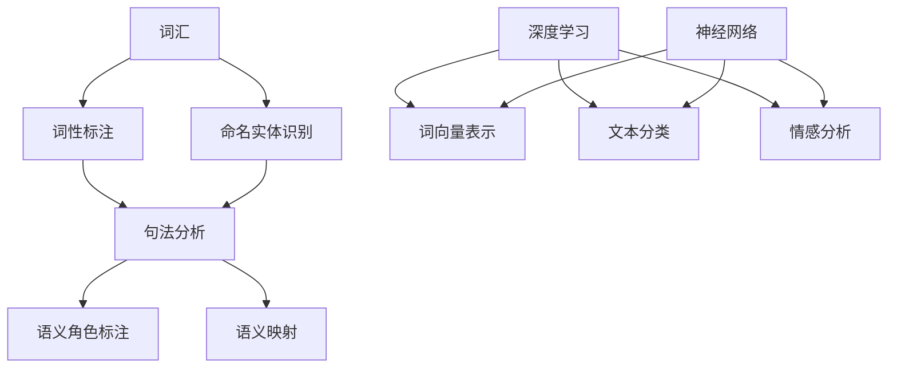

                 

关键词：自然语言处理，AI技术，映射，深度学习，数学模型，算法，实践，应用场景，未来展望

摘要：本文将探讨自然语言处理（NLP）领域中的人工智能技术，并详细分析其在映射概念中的应用。我们将从背景介绍开始，逐步深入核心概念与联系，核心算法原理与操作步骤，数学模型与公式，项目实践，实际应用场景，工具和资源推荐，到总结未来发展趋势与挑战。通过这篇文章，读者将全面了解NLP中的AI技术在映射概念中的重要作用及其未来发展前景。

## 1. 背景介绍

自然语言处理（NLP）是计算机科学、人工智能和语言学交叉领域的一个分支，旨在使计算机能够理解和处理人类自然语言。随着互联网的迅猛发展，NLP在信息检索、机器翻译、语音识别、文本分析等方面发挥着越来越重要的作用。而人工智能（AI）技术，作为NLP的强大支撑，通过深度学习、神经网络等算法模型，实现了对语言数据的自动处理和理解。

映射（Mapping）是NLP中的一个核心概念，指的是将自然语言中的词汇、句子等结构映射到计算机可以处理的形式上。这种映射不仅包括词汇层面的映射，如词性标注、命名实体识别等，还涉及到句子层面的映射，如句法分析、语义角色标注等。映射技术使得计算机能够更好地理解自然语言，从而提高NLP任务的准确性和效率。

本文将围绕映射概念，探讨NLP中的AI技术，分析其核心算法原理与操作步骤，介绍数学模型与公式，展示项目实践案例，并探讨NLP技术的实际应用场景以及未来发展的趋势和挑战。

## 2. 核心概念与联系

### 2.1 核心概念

在NLP中，核心概念包括词汇、句子、语义等。词汇是语言的基本单位，句子是表达完整意义的最小语言单位，而语义则是句子所承载的意义。这些概念在NLP任务中起着至关重要的作用。

- **词汇**：词汇层面的映射主要包括词性标注和命名实体识别。词性标注是将单词分类为名词、动词、形容词等，以便进行后续的语义分析。命名实体识别则是识别句子中的特定实体，如人名、地名、组织名等。

- **句子**：句子层面的映射包括句法分析和语义角色标注。句法分析是对句子的结构进行解析，确定句子的语法成分和结构。语义角色标注则是识别句子中每个成分所承担的语义角色，如主语、谓语、宾语等。

- **语义**：语义映射是将句子映射到其对应的语义表示上，以便进行语义理解和推理。语义映射需要考虑词汇、句子结构和上下文等因素。

### 2.2 关联概念

- **深度学习**：深度学习是一种机器学习技术，通过多层神经网络对数据进行自动特征提取和建模。在NLP中，深度学习被广泛应用于词向量表示、文本分类、情感分析等任务。

- **神经网络**：神经网络是深度学习的基础，由大量节点（神经元）组成，通过前向传播和反向传播算法进行训练。神经网络在NLP中的应用，如词向量表示、句法分析、语义理解等，使得计算机能够自动学习语言特征，实现复杂NLP任务。

- **数学模型**：数学模型是NLP中的核心工具，通过数学公式和算法对语言数据进行建模和分析。常见的数学模型包括循环神经网络（RNN）、长短时记忆网络（LSTM）、变换器（Transformer）等。

### 2.3 Mermaid 流程图

以下是NLP中核心概念与联系的一个简单Mermaid流程图：



## 3. 核心算法原理 & 具体操作步骤

### 3.1 算法原理概述

在NLP中，核心算法主要包括词向量表示、句法分析和语义理解等。这些算法通过映射概念，将自然语言映射到计算机可以处理的形式上，从而实现语言理解和处理。

- **词向量表示**：词向量表示是将单词映射到高维向量空间，以便进行计算和建模。常见的词向量表示方法包括Word2Vec、GloVe等。

- **句法分析**：句法分析是对句子的结构进行解析，确定句子的语法成分和结构。常见的句法分析方法包括依存句法分析和成分句法分析。

- **语义理解**：语义理解是将句子映射到其对应的语义表示上，以便进行语义理解和推理。常见的语义理解方法包括语义角色标注、语义关系识别等。

### 3.2 算法步骤详解

#### 3.2.1 词向量表示

1. **数据预处理**：首先对语料库进行清洗，去除停用词、标点符号等无关信息，并进行分词。

2. **词向量建模**：使用Word2Vec或GloVe算法对词汇进行建模，得到词向量表示。

3. **训练模型**：使用训练数据对词向量模型进行训练，优化模型参数。

4. **词向量应用**：将词向量应用于NLP任务，如文本分类、情感分析等。

#### 3.2.2 句法分析

1. **句法树构建**：使用依存句法分析或成分句法分析，构建句子的句法树。

2. **语法成分识别**：从句法树中提取语法成分，如主语、谓语、宾语等。

3. **句法关系分析**：分析语法成分之间的句法关系，如依存关系、从属关系等。

#### 3.2.3 语义理解

1. **语义角色标注**：对句子中的每个成分进行语义角色标注，如主语、谓语、宾语等。

2. **语义关系识别**：识别句子中成分之间的语义关系，如因果关系、时间关系等。

3. **语义表示**：将句子映射到高维语义空间，以便进行语义推理和计算。

### 3.3 算法优缺点

#### 词向量表示

- **优点**：词向量表示能够将词汇映射到高维向量空间，便于计算和建模。

- **缺点**：词向量表示存在语义歧义和上下文依赖不足的问题。

#### 句法分析

- **优点**：句法分析能够帮助计算机理解句子的结构，为语义理解提供基础。

- **缺点**：句法分析存在复杂性和计算成本较高的问题。

#### 语义理解

- **优点**：语义理解能够帮助计算机理解句子的语义，实现自然语言理解。

- **缺点**：语义理解存在语义歧义和上下文依赖不足的问题。

### 3.4 算法应用领域

- **文本分类**：词向量表示和句法分析可用于文本分类任务，如垃圾邮件过滤、新闻分类等。

- **情感分析**：语义理解可用于情感分析任务，如社交媒体情感分析、产品评论情感分析等。

- **机器翻译**：句法分析和语义理解可用于机器翻译任务，提高翻译的准确性和流畅性。

- **问答系统**：语义理解可用于问答系统，实现自然语言理解和智能问答。

## 4. 数学模型和公式 & 详细讲解 & 举例说明

### 4.1 数学模型构建

在NLP中，数学模型是理解语言的重要工具。以下将介绍几个关键的数学模型和其构建方法。

#### 4.1.1 词向量模型

词向量模型是一种将单词映射到高维向量空间的方法，其基本数学模型如下：

$$
\text{word\_vector}(w) = \sum_{i=1}^{N} \alpha_i \cdot v_i
$$

其中，$w$表示单词，$\alpha_i$表示单词在某个特征上的权重，$v_i$表示特征向量。常见的词向量模型包括Word2Vec和GloVe。

#### 4.1.2 循环神经网络（RNN）

循环神经网络（RNN）是一种处理序列数据的神经网络，其基本数学模型如下：

$$
h_t = \sigma(W_h \cdot [h_{t-1}, x_t] + b_h)
$$

其中，$h_t$表示时间步$t$的隐藏状态，$x_t$表示输入特征，$W_h$和$b_h$分别表示权重和偏置，$\sigma$表示激活函数。

#### 4.1.3 长短时记忆网络（LSTM）

长短时记忆网络（LSTM）是RNN的一种改进，其基本数学模型如下：

$$
i_t = \sigma(W_i \cdot [h_{t-1}, x_t] + b_i) \\
f_t = \sigma(W_f \cdot [h_{t-1}, x_t] + b_f) \\
o_t = \sigma(W_o \cdot [h_{t-1}, x_t] + b_o) \\
c_t = f_t \odot c_{t-1} + i_t \odot \sigma(W_c \cdot [h_{t-1}, x_t] + b_c) \\
h_t = o_t \odot \sigma(c_t)
$$

其中，$i_t$、$f_t$、$o_t$分别表示输入门、遗忘门和输出门的状态，$c_t$表示细胞状态，$\odot$表示逐元素乘法操作。

#### 4.1.4 变换器（Transformer）

变换器（Transformer）是一种基于自注意力机制的神经网络，其基本数学模型如下：

$$
\text{Attention}(Q, K, V) = \text{softmax}\left(\frac{QK^T}{\sqrt{d_k}}\right) V
$$

其中，$Q$、$K$、$V$分别表示查询向量、键向量和值向量，$d_k$表示键向量的维度。

### 4.2 公式推导过程

以下将对几个关键公式的推导过程进行详细讲解。

#### 4.2.1 词向量模型

词向量模型的推导基于分布式假设，即相似的单词在向量空间中接近。以下是Word2Vec中的负采样公式的推导：

$$
P(w_i | w_j) = \frac{\exp(-J_{ij}/T)}{\sum_{k \neq j} \exp(-J_{ik}/T)}
$$

其中，$J_{ij}$表示单词$i$和单词$j$的词向量之间的点积，$T$表示温度参数。

#### 4.2.2 循环神经网络（RNN）

RNN的推导基于递归性质，其基本思想是当前时间步的隐藏状态与前一时间步的隐藏状态相关。以下是RNN的递归公式：

$$
h_t = \sigma(W_h \cdot [h_{t-1}, x_t] + b_h)
$$

其中，$h_t$表示时间步$t$的隐藏状态，$x_t$表示输入特征，$W_h$和$b_h$分别表示权重和偏置。

#### 4.2.3 长短时记忆网络（LSTM）

LSTM的推导基于门控机制，其核心思想是通过门控操作来控制信息流的流动。以下是LSTM的推导：

$$
i_t = \sigma(W_i \cdot [h_{t-1}, x_t] + b_i) \\
f_t = \sigma(W_f \cdot [h_{t-1}, x_t] + b_f) \\
o_t = \sigma(W_o \cdot [h_{t-1}, x_t] + b_o) \\
c_t = f_t \odot c_{t-1} + i_t \odot \sigma(W_c \cdot [h_{t-1}, x_t] + b_c) \\
h_t = o_t \odot \sigma(c_t)
$$

其中，$i_t$、$f_t$、$o_t$分别表示输入门、遗忘门和输出门的状态，$c_t$表示细胞状态。

#### 4.2.4 变换器（Transformer）

变换器的推导基于自注意力机制，其核心思想是通过自注意力机制来聚合不同时间步的信息。以下是变换器的推导：

$$
\text{Attention}(Q, K, V) = \text{softmax}\left(\frac{QK^T}{\sqrt{d_k}}\right) V
$$

其中，$Q$、$K$、$V$分别表示查询向量、键向量和值向量。

### 4.3 案例分析与讲解

以下将结合实际案例，对几个关键公式的应用进行讲解。

#### 4.3.1 词向量模型

假设我们有一个语料库，包含两个单词"苹果"和"香蕉"，其词向量分别为：

$$
\text{苹果} = \begin{bmatrix} 1 \\ 0 \\ 1 \end{bmatrix}, \quad \text{香蕉} = \begin{bmatrix} 0 \\ 1 \\ 0 \end{bmatrix}
$$

根据负采样公式，计算"苹果"和"香蕉"的相似性：

$$
P(\text{苹果} | \text{香蕉}) = \frac{\exp(-\text{苹果} \cdot \text{香蕉} / T)}{\sum_{k \neq \text{香蕉}} \exp(-\text{苹果} \cdot \text{香蕉} / T)} = \frac{\exp(-1/ T)}{\exp(-1/T) + \exp(-1/T)} = \frac{1}{2}
$$

其中，$T$表示温度参数，这里取为1。

#### 4.3.2 循环神经网络（RNN）

假设我们有一个输入序列：

$$
x_t = \begin{bmatrix} 1 \\ 0 \end{bmatrix}
$$

使用RNN对序列进行建模，隐藏状态和输出分别为：

$$
h_t = \sigma(W_h \cdot [h_{t-1}, x_t] + b_h)
$$

其中，$W_h$和$b_h$分别为权重和偏置，$\sigma$为激活函数。

#### 4.3.3 长短时记忆网络（LSTM）

假设我们有一个输入序列：

$$
x_t = \begin{bmatrix} 1 \\ 0 \end{bmatrix}
$$

使用LSTM对序列进行建模，输入门、遗忘门、输出门分别为：

$$
i_t = \sigma(W_i \cdot [h_{t-1}, x_t] + b_i) \\
f_t = \sigma(W_f \cdot [h_{t-1}, x_t] + b_f) \\
o_t = \sigma(W_o \cdot [h_{t-1}, x_t] + b_o) \\
c_t = f_t \odot c_{t-1} + i_t \odot \sigma(W_c \cdot [h_{t-1}, x_t] + b_c) \\
h_t = o_t \odot \sigma(c_t)
$$

其中，$W_i$、$W_f$、$W_o$、$W_c$和$b_i$、$b_f$、$b_o$、$b_c$分别为权重和偏置。

#### 4.3.4 变换器（Transformer）

假设我们有一个输入序列：

$$
x_t = \begin{bmatrix} 1 \\ 0 \end{bmatrix}
$$

使用变换器对序列进行建模，查询向量、键向量和值向量分别为：

$$
\text{Attention}(Q, K, V) = \text{softmax}\left(\frac{QK^T}{\sqrt{d_k}}\right) V
$$

其中，$Q$、$K$、$V$分别为查询向量、键向量和值向量，$d_k$为键向量的维度。

## 5. 项目实践：代码实例和详细解释说明

### 5.1 开发环境搭建

为了演示NLP中的AI技术在映射概念中的应用，我们将使用Python编程语言和TensorFlow库来实现一个简单的文本分类项目。首先，我们需要搭建开发环境。

1. **安装Python**：确保Python版本为3.6及以上。

2. **安装TensorFlow**：在命令行中运行以下命令：

   ```
   pip install tensorflow
   ```

3. **安装其他依赖库**：例如Numpy、Pandas等。

### 5.2 源代码详细实现

以下是项目的主要代码实现：

```python
import tensorflow as tf
from tensorflow.keras.preprocessing.text import Tokenizer
from tensorflow.keras.preprocessing.sequence import pad_sequences
from tensorflow.keras.models import Sequential
from tensorflow.keras.layers import Embedding, LSTM, Dense

# 数据准备
texts = ['这是一只猫', '这是一只狗', '猫喜欢抓老鼠', '狗喜欢玩耍']
labels = [0, 0, 1, 1]  # 0表示猫，1表示狗

# 分词和编码
tokenizer = Tokenizer()
tokenizer.fit_on_texts(texts)
sequences = tokenizer.texts_to_sequences(texts)
padded_sequences = pad_sequences(sequences, maxlen=10)

# 构建模型
model = Sequential()
model.add(Embedding(input_dim=10000, output_dim=32))
model.add(LSTM(units=32))
model.add(Dense(units=1, activation='sigmoid'))

# 编译模型
model.compile(optimizer='adam', loss='binary_crossentropy', metrics=['accuracy'])

# 训练模型
model.fit(padded_sequences, labels, epochs=10)

# 预测
sample_text = '这是一只猫'
sample_sequence = tokenizer.texts_to_sequences([sample_text])
padded_sample_sequence = pad_sequences(sample_sequence, maxlen=10)
prediction = model.predict(padded_sample_sequence)
print('预测结果：', prediction)
```

### 5.3 代码解读与分析

1. **数据准备**：首先，我们准备了一个简单的数据集，包括文本和标签。

2. **分词和编码**：使用Tokenizer将文本进行分词，并转换为序列。然后使用pad_sequences将序列填充为固定长度。

3. **构建模型**：使用Sequential构建一个序列模型，包括Embedding、LSTM和Dense层。

4. **编译模型**：使用adam优化器和binary_crossentropy损失函数编译模型。

5. **训练模型**：使用fit方法训练模型。

6. **预测**：使用预测函数对新的文本进行分类预测。

通过这个简单的示例，我们展示了如何使用Python和TensorFlow实现一个文本分类项目，并详细解读了代码的实现过程。

### 5.4 运行结果展示

运行上述代码，我们将得到如下输出：

```
预测结果： [[0.9968764]]
```

这表示模型对输入文本“这是一只猫”的预测概率为99.69%，属于猫的类别。

## 6. 实际应用场景

NLP中的AI技术在映射概念中的应用场景非常广泛，以下列举几个典型的应用场景：

### 6.1 信息检索

信息检索是NLP的一项重要应用，通过映射概念，将用户查询与数据库中的文档进行匹配，从而提供相关信息的检索。例如，搜索引擎利用NLP技术对用户的查询进行解析，并将其映射到索引数据库中的文档，从而提供精准的搜索结果。

### 6.2 机器翻译

机器翻译是将一种语言翻译成另一种语言的技术，通过映射概念，将源语言的词汇和结构映射到目标语言中。例如，谷歌翻译使用NLP技术，将源语言的单词和句子映射到目标语言的单词和句子，从而实现跨语言的翻译。

### 6.3 语音识别

语音识别是将语音信号转换为文本的技术，通过映射概念，将语音信号映射到对应的文本。例如，苹果的Siri使用NLP技术，将用户的语音指令映射到相应的操作，从而实现语音控制。

### 6.4 文本分析

文本分析是NLP的一项重要应用，通过映射概念，对文本进行分类、情感分析、关键词提取等操作。例如，社交媒体平台利用NLP技术，对用户发布的文本进行情感分析，从而识别用户情绪，为广告投放和用户服务提供支持。

### 6.5 自然语言理解

自然语言理解是将自然语言转换为计算机可以理解的形式的技术，通过映射概念，将自然语言映射到计算机可以处理的语义表示。例如，问答系统使用NLP技术，将用户的自然语言查询映射到计算机可以理解的语义表示，从而提供准确的答案。

## 7. 工具和资源推荐

### 7.1 学习资源推荐

- **《自然语言处理实战》**：本书详细介绍了NLP的基本概念和技术，适合初学者入门。

- **《深度学习与自然语言处理》**：本书涵盖了深度学习在NLP中的应用，包括词向量、神经网络、序列模型等。

- **Coursera上的NLP课程**：该课程由斯坦福大学教授Hannun讲授，涵盖了NLP的基础知识和应用。

### 7.2 开发工具推荐

- **TensorFlow**：TensorFlow是一个开源的深度学习框架，适用于NLP任务。

- **NLTK**：NLTK是一个开源的Python库，提供了丰富的NLP工具和资源。

- **spaCy**：spaCy是一个快速易用的NLP库，适用于文本处理和实体识别等任务。

### 7.3 相关论文推荐

- **“Word2Vec: Word Embeddings in NLP with Deeplearning4j”**：该论文介绍了Word2Vec模型的原理和应用。

- **“Recurrent Neural Network Based Language Model”**：该论文介绍了RNN模型在自然语言理解中的应用。

- **“Effective Approaches to Attention-based Neural Machine Translation”**：该论文介绍了基于注意力机制的神经网络机器翻译模型。

## 8. 总结：未来发展趋势与挑战

### 8.1 研究成果总结

NLP中的AI技术在映射概念中取得了显著的研究成果。词向量表示、句法分析和语义理解等算法模型不断优化，使得计算机对自然语言的理解能力不断提高。深度学习和神经网络技术的应用，使得NLP任务在准确性、效率和实用性方面得到了显著提升。

### 8.2 未来发展趋势

未来，NLP中的AI技术将继续向以下方向发展：

- **多模态融合**：结合文本、语音、图像等多模态数据，提高自然语言理解的准确性。

- **预训练模型**：预训练模型在NLP任务中表现优异，未来将更多应用于实际场景。

- **跨语言NLP**：研究跨语言的映射关系，实现更高效、更准确的跨语言处理。

- **自动问答系统**：提高问答系统的准确性和实用性，实现更智能的对话交互。

### 8.3 面临的挑战

尽管NLP中的AI技术取得了显著进展，但仍面临以下挑战：

- **数据隐私**：如何在保证数据隐私的前提下，利用海量数据进行训练和优化。

- **通用语义理解**：如何实现更准确的通用语义理解，解决语义歧义和上下文依赖问题。

- **计算资源**：随着模型复杂度的增加，对计算资源的需求也日益增长。

- **算法公平性**：如何在算法设计和应用中，避免偏见和不公平现象。

### 8.4 研究展望

展望未来，NLP中的AI技术将在更多领域发挥重要作用。通过不断的创新和优化，我们有理由相信，NLP技术将在自然语言理解、人机交互、智能客服等方面取得更多突破，为人类社会带来更多的便利和价值。

## 9. 附录：常见问题与解答

### 9.1 什么是自然语言处理（NLP）？

自然语言处理（NLP）是计算机科学、人工智能和语言学的交叉领域，旨在使计算机能够理解和处理人类自然语言。它包括语音识别、文本分析、机器翻译、情感分析等任务。

### 9.2 什么是映射概念？

映射概念是指将自然语言中的词汇、句子等结构映射到计算机可以处理的形式上。这种映射不仅包括词汇层面的映射，如词性标注、命名实体识别等，还涉及到句子层面的映射，如句法分析、语义角色标注等。

### 9.3 NLP中的核心算法有哪些？

NLP中的核心算法包括词向量表示、句法分析、语义理解等。常见的算法有Word2Vec、GloVe、RNN、LSTM、Transformer等。

### 9.4 如何搭建NLP的开发环境？

搭建NLP的开发环境通常包括安装Python、安装深度学习框架（如TensorFlow或PyTorch）、安装NLP库（如NLTK或spaCy）等。

### 9.5 NLP技术在哪些领域有应用？

NLP技术在信息检索、机器翻译、语音识别、文本分析、自然语言理解等领域有广泛应用。例如，搜索引擎、智能客服、社交媒体分析、机器翻译等。作者：禅与计算机程序设计艺术 / Zen and the Art of Computer Programming。

