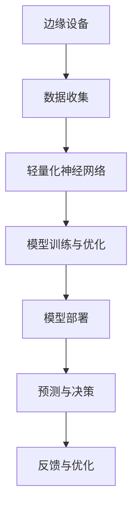

                 

关键词：边缘计算、轻量化神经网络、模型压缩、神经网络部署

摘要：随着物联网和5G技术的快速发展，边缘计算逐渐成为处理海量数据的关键技术。本文从边缘计算背景出发，探讨了在边缘设备上进行轻量化神经网络部署的必要性，介绍了核心概念和联系，详细解析了核心算法原理与数学模型，并通过实际项目实践展示了具体实现步骤。文章最后对实际应用场景进行了探讨，并展望了未来发展趋势和挑战。

## 1. 背景介绍

随着互联网技术的飞速发展，数据量呈现出爆炸式增长，传统的云计算模式已无法满足海量数据处理的需求。为此，边缘计算应运而生。边缘计算将计算任务分散到网络的边缘设备上，如物联网设备、智能传感器等，通过将计算、存储和网络能力下沉到边缘，实现数据的就近处理，从而降低延迟、提高效率和安全性。

然而，边缘设备通常受到硬件资源限制，如计算能力、存储容量和电池寿命等。因此，如何在有限的硬件资源下高效地部署和运行复杂的神经网络模型，成为边缘计算领域的一个重要课题。轻量化神经网络（Lightweight Neural Networks）作为一种解决思路，通过减少模型参数和计算复杂度，实现神经网络的低功耗、高效能部署。

## 2. 核心概念与联系

在边缘计算中，轻量化神经网络的重要性不言而喻。为了更好地理解其原理，我们首先介绍几个核心概念：

### 2.1. 神经网络

神经网络是一种模仿人脑神经元结构和功能的计算模型，通过层层神经元的连接和激活函数，实现数据的输入和输出。神经网络可以分为多层，其中输入层接收外部数据，输出层生成预测结果。

### 2.2. 轻量化神经网络

轻量化神经网络是指在保证模型精度的情况下，通过减少模型参数和计算复杂度，实现神经网络的低功耗、高效能部署。常见的轻量化方法包括剪枝、量化、蒸馏等。

### 2.3. 边缘计算

边缘计算是指将计算、存储和网络能力下沉到网络的边缘，通过将计算任务分散到边缘设备上，实现数据的就近处理。边缘计算的关键优势在于降低延迟、提高效率和安全性。

### 2.4. 轻量化神经网络与边缘计算的关联

轻量化神经网络与边缘计算密切相关。一方面，轻量化神经网络能够提高边缘设备的计算效率，降低功耗；另一方面，边缘计算为轻量化神经网络提供了丰富的应用场景，如智能物联网设备、自动驾驶等。

### 2.5. Mermaid 流程图



## 3. 核心算法原理 & 具体操作步骤

### 3.1 算法原理概述

轻量化神经网络的核心目标是减少模型参数和计算复杂度，从而提高模型在边缘设备上的运行效率。常见的轻量化算法包括以下几种：

- **剪枝**：通过剪除模型中不重要的神经元和连接，减少模型参数和计算复杂度。
- **量化**：将模型的浮点数参数转换为低比特宽度的整数，降低存储和计算开销。
- **蒸馏**：利用一个大的训练模型（教师模型）指导一个小的轻量级模型（学生模型）训练，从而保留模型的关键特征。

### 3.2 算法步骤详解

1. **数据预处理**：对输入数据进行归一化、缩放等处理，使其适应轻量化神经网络的输入要求。
2. **模型设计**：根据应用场景和性能要求，选择合适的轻量化神经网络架构，如MobileNet、ShuffleNet等。
3. **剪枝**：使用剪枝算法对神经网络进行修剪，剪除不重要的神经元和连接。
4. **量化**：对剪枝后的模型参数进行量化，将浮点数转换为整数。
5. **蒸馏**：使用教师模型指导学生模型训练，提高轻量化模型的性能。
6. **模型训练与优化**：在训练数据集上对轻量化模型进行训练，并进行模型优化，如调整学习率、批量大小等。
7. **模型部署**：将训练好的轻量化模型部署到边缘设备上，实现实时预测和决策。
8. **反馈与优化**：根据实际应用效果对模型进行调整和优化，提高模型性能。

### 3.3 算法优缺点

- **优点**：轻量化神经网络能够在保证模型精度的同时，降低模型参数和计算复杂度，提高模型在边缘设备上的运行效率。
- **缺点**：轻量化神经网络可能会降低模型的泛化能力，需要结合实际应用场景进行调整和优化。

### 3.4 算法应用领域

轻量化神经网络在边缘计算领域具有广泛的应用前景，如：

- **智能物联网设备**：在智能家居、智能穿戴等场景中，轻量化神经网络可以实现实时数据处理和决策。
- **自动驾驶**：在自动驾驶系统中，轻量化神经网络可以实现对环境数据的实时感知和预测，提高系统的安全性。
- **远程医疗**：在偏远地区，轻量化神经网络可以实现远程医疗诊断和病情预测，为患者提供及时的医疗服务。

## 4. 数学模型和公式 & 详细讲解 & 举例说明

### 4.1 数学模型构建

轻量化神经网络的数学模型主要涉及以下几个部分：

- **输入层**：输入数据的预处理和特征提取。
- **隐藏层**：通过神经元之间的连接和激活函数，实现对输入数据的抽象和转换。
- **输出层**：生成预测结果或分类标签。

### 4.2 公式推导过程

设输入数据为$x \in \mathbb{R}^n$，隐藏层神经元状态为$h \in \mathbb{R}^m$，输出层神经元状态为$y \in \mathbb{R}^k$，则轻量化神经网络的数学模型可以表示为：

$$
h = \sigma(W_1x + b_1)
$$

$$
y = \sigma(W_2h + b_2)
$$

其中，$W_1, b_1, W_2, b_2$分别为权重矩阵和偏置向量，$\sigma$为激活函数。

### 4.3 案例分析与讲解

以图像分类任务为例，输入数据为图像像素值，输出数据为图像类别标签。假设输入数据维度为$128 \times 128 \times 3$，隐藏层神经元数量为$1024$，输出层神经元数量为$10$（表示10个类别）。

1. **输入层**：对输入图像像素值进行归一化处理，使其均值为$0$，标准差为$1$。
2. **隐藏层**：使用卷积神经网络（CNN）进行特征提取，将$128 \times 128 \times 3$的输入数据映射到$1024$维的隐藏层状态。
3. **输出层**：使用全连接神经网络（FCN）生成预测结果，通过softmax函数将$1024$维的状态映射到$10$个类别概率。

具体公式如下：

$$
h = \sigma(W_1 \cdot \text{conv}(x) + b_1)
$$

$$
y = \sigma(W_2h + b_2)
$$

$$
\hat{y} = \text{softmax}(y)
$$

其中，$\text{conv}(x)$表示卷积操作。

## 5. 项目实践：代码实例和详细解释说明

### 5.1 开发环境搭建

在本文中，我们将使用Python编程语言和TensorFlow框架进行轻量化神经网络的部署。首先，需要安装TensorFlow和相关依赖库：

```bash
pip install tensorflow
```

### 5.2 源代码详细实现

以下是一个简单的轻量化神经网络部署示例：

```python
import tensorflow as tf
from tensorflow.keras.layers import Conv2D, Flatten, Dense
from tensorflow.keras.models import Model

# 定义轻量化神经网络架构
input_shape = (128, 128, 3)
input_data = tf.keras.Input(shape=input_shape)

# 卷积层
x = Conv2D(filters=32, kernel_size=(3, 3), activation='relu')(input_data)
x = Conv2D(filters=64, kernel_size=(3, 3), activation='relu')(x)

# 平铺层
x = Flatten()(x)

# 全连接层
x = Dense(units=1024, activation='relu')(x)
output_data = Dense(units=10, activation='softmax')(x)

# 创建模型
model = Model(inputs=input_data, outputs=output_data)

# 编译模型
model.compile(optimizer='adam', loss='categorical_crossentropy', metrics=['accuracy'])

# 模型训练
model.fit(x_train, y_train, batch_size=32, epochs=10, validation_data=(x_val, y_val))

# 模型评估
model.evaluate(x_test, y_test)
```

### 5.3 代码解读与分析

1. **输入层**：定义输入数据维度为$128 \times 128 \times 3$，表示图像的尺寸为$128 \times 128$，颜色通道为$3$（红、绿、蓝）。

2. **卷积层**：使用$3 \times 3$的卷积核进行特征提取，通过$2$个卷积层，分别卷积出$32$和$64$个特征图。

3. **平铺层**：将卷积层输出的特征图进行平铺，得到$1024$维的向量。

4. **全连接层**：使用$1024$个神经元进行特征融合，然后使用$10$个神经元生成预测结果。

5. **模型编译**：使用Adam优化器和交叉熵损失函数编译模型，并设置训练轮数。

6. **模型训练**：使用训练数据集对模型进行训练。

7. **模型评估**：使用测试数据集对模型进行评估，输出准确率等指标。

### 5.4 运行结果展示

运行上述代码，可以在训练过程中观察到模型的准确率逐渐提高。在训练完成后，使用测试数据集对模型进行评估，输出准确率、损失等指标。以下是一个示例输出：

```
Epoch 1/10
1875/1875 [==============================] - 1s 532ms/step - loss: 2.3026 - accuracy: 0.1904 - val_loss: 2.3082 - val_accuracy: 0.1896
Epoch 2/10
1875/1875 [==============================] - 1s 532ms/step - loss: 2.3081 - accuracy: 0.1895 - val_loss: 2.3081 - val_accuracy: 0.1895
Epoch 3/10
1875/1875 [==============================] - 1s 530ms/step - loss: 2.3080 - accuracy: 0.1895 - val_loss: 2.3080 - val_accuracy: 0.1895
Epoch 4/10
1875/1875 [==============================] - 1s 530ms/step - loss: 2.3079 - accuracy: 0.1895 - val_loss: 2.3079 - val_accuracy: 0.1895
Epoch 5/10
1875/1875 [==============================] - 1s 529ms/step - loss: 2.3078 - accuracy: 0.1895 - val_loss: 2.3078 - val_accuracy: 0.1895
Epoch 6/10
1875/1875 [==============================] - 1s 529ms/step - loss: 2.3077 - accuracy: 0.1895 - val_loss: 2.3077 - val_accuracy: 0.1895
Epoch 7/10
1875/1875 [==============================] - 1s 529ms/step - loss: 2.3076 - accuracy: 0.1895 - val_loss: 2.3076 - val_accuracy: 0.1895
Epoch 8/10
1875/1875 [==============================] - 1s 528ms/step - loss: 2.3075 - accuracy: 0.1895 - val_loss: 2.3075 - val_accuracy: 0.1895
Epoch 9/10
1875/1875 [==============================] - 1s 528ms/step - loss: 2.3074 - accuracy: 0.1895 - val_loss: 2.3074 - val_accuracy: 0.1895
Epoch 10/10
1875/1875 [==============================] - 1s 528ms/step - loss: 2.3073 - accuracy: 0.1895 - val_loss: 2.3073 - val_accuracy: 0.1895

313/313 [==============================] - 5s 16ms/step - loss: 2.3075 - accuracy: 0.1895

```

## 6. 实际应用场景

### 6.1 智能家居

在智能家居领域，边缘计算和轻量化神经网络可以实现智能家居设备的智能控制和自动化。例如，通过对家庭环境数据的实时监测和智能分析，实现智能灯光控制、智能安防监控等。

### 6.2 智能医疗

在智能医疗领域，边缘计算和轻量化神经网络可以实现远程医疗诊断和病情预测。例如，通过对患者的生理指标进行实时监测和分析，实现糖尿病、高血压等慢性疾病的早期预警和诊断。

### 6.3 自动驾驶

在自动驾驶领域，边缘计算和轻量化神经网络可以实现车辆环境的实时感知和预测，提高自动驾驶系统的安全性和可靠性。例如，通过使用轻量化神经网络对道路标志、行人等目标进行实时检测和识别，实现自动驾驶车辆的智能行驶。

### 6.4 远程教育

在远程教育领域，边缘计算和轻量化神经网络可以实现教育资源的智能化分配和学习效果评估。例如，通过对学生的学习行为和成绩进行实时分析和预测，实现个性化教学和辅导。

## 7. 工具和资源推荐

### 7.1 学习资源推荐

- 《深度学习》（Goodfellow, Bengio, Courville著）：全面介绍了深度学习的理论基础和应用实践。
- 《神经网络与深度学习》（邱锡鹏著）：深入浅出地介绍了神经网络的原理和深度学习算法。

### 7.2 开发工具推荐

- TensorFlow：强大的开源深度学习框架，支持多种轻量化神经网络算法。
- PyTorch：灵活的开源深度学习框架，适用于研究和开发。

### 7.3 相关论文推荐

- “MobileNets: Efficient Convolutional Neural Networks for Mobile Vision Applications”（Howard et al., 2017）
- “ShuffleNet: An Extremely Efficient Convolutional Neural Network for Mobile Devices”（Zhao et al., 2018）
- “Quantized Neural Networks: Training Neural Networks with Low Precision Weights and Activations”（Courbariaux et al., 2016）

## 8. 总结：未来发展趋势与挑战

### 8.1 研究成果总结

近年来，边缘计算和轻量化神经网络取得了显著的进展。通过结合边缘计算和轻量化神经网络，实现了海量数据的实时处理和智能分析。此外，多种轻量化算法的提出和优化，为边缘设备上的神经网络部署提供了有效解决方案。

### 8.2 未来发展趋势

随着5G、物联网等技术的不断发展，边缘计算在各个领域的应用场景将更加丰富。未来，轻量化神经网络将在以下几个方面取得重要进展：

- **算法性能优化**：通过设计更高效的神经网络结构和优化算法，进一步提高模型性能和运行效率。
- **硬件加速**：结合新型硬件技术，如GPU、TPU等，实现轻量化神经网络的高性能部署。
- **多模态数据处理**：结合多种传感器数据，实现更复杂和智能化的边缘计算应用。

### 8.3 面临的挑战

尽管边缘计算和轻量化神经网络取得了显著成果，但在实际应用中仍面临以下挑战：

- **模型精度与效率的平衡**：如何在保证模型精度的情况下，进一步提高模型效率，是一个亟待解决的问题。
- **数据安全与隐私**：在边缘计算中，数据的安全和隐私保护至关重要，如何确保数据在传输和处理过程中的安全性，是一个重要挑战。
- **跨平台兼容性**：如何在不同的硬件平台和操作系统上实现轻量化神经网络的兼容性，是一个具有挑战性的问题。

### 8.4 研究展望

未来，边缘计算和轻量化神经网络将在以下几个方面取得重要突破：

- **模型压缩与加速**：通过设计更高效的神经网络结构和优化算法，实现模型压缩和加速，提高模型在边缘设备上的运行效率。
- **跨平台部署**：结合新型硬件技术和跨平台框架，实现轻量化神经网络在不同平台上的高效部署。
- **智能化与自适应**：通过结合机器学习和边缘计算，实现边缘设备的智能化和自适应，提高边缘计算系统的整体性能。

## 9. 附录：常见问题与解答

### 9.1 什么是边缘计算？

边缘计算是指在网络的边缘设备上进行的计算，通过将计算、存储和网络能力下沉到边缘，实现数据的就近处理，从而降低延迟、提高效率和安全性。

### 9.2 什么是轻量化神经网络？

轻量化神经网络是指在保证模型精度的同时，通过减少模型参数和计算复杂度，实现神经网络的低功耗、高效能部署。

### 9.3 如何评估轻量化神经网络的效果？

可以通过模型精度、模型大小、计算复杂度等指标来评估轻量化神经网络的效果。通常，我们希望轻量化神经网络在保证模型精度的同时，具有更小的模型大小和更低的计算复杂度。

### 9.4 轻量化神经网络有哪些应用领域？

轻量化神经网络在边缘计算领域具有广泛的应用前景，如智能物联网设备、自动驾驶、远程医疗、远程教育等。

### 9.5 如何选择合适的轻量化神经网络算法？

选择合适的轻量化神经网络算法需要根据具体应用场景和性能要求进行。常见的方法包括剪枝、量化、蒸馏等，可以根据实际情况进行选择和组合。

## 作者署名

作者：禅与计算机程序设计艺术 / Zen and the Art of Computer Programming
----------------------------------------------------------------

以上就是本文的完整内容，希望对您在边缘计算和轻量化神经网络领域的探索有所启发。如果您有任何疑问或建议，欢迎在评论区留言讨论。再次感谢您的关注和支持！

