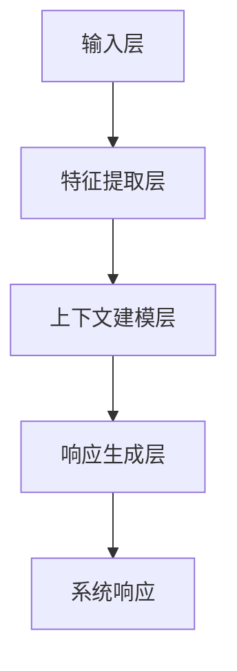

                 

 在当今的技术发展中，上下文理解已经成为计算机用户界面（CUI）领域的关键要素。上下文理解指的是计算机系统能够捕捉和解读用户交互中的上下文信息，从而提供更加准确、自然的互动体验。本文将深入探讨上下文理解在CUI中的重要性，分析其核心概念、算法原理、数学模型以及实际应用，同时展望其未来的发展趋势与挑战。

## 文章关键词

- 上下文理解
- 计算机用户界面
- 自然语言处理
- 人工智能
- CUI设计

## 文章摘要

本文旨在阐述上下文理解在计算机用户界面（CUI）中的重要性，并从多个角度进行详细分析。文章首先介绍了上下文理解的基本概念和其在CUI中的关键作用，随后深入探讨了上下文理解的核心算法原理和数学模型。接着，文章通过具体项目实践展示了上下文理解的实现方法，并分析了其在不同应用场景中的表现。最后，文章对上下文理解技术的发展趋势、面临的挑战以及未来研究方向进行了展望。

### 背景介绍

随着信息技术的迅猛发展，计算机用户界面（CUI）的设计与优化成为提升用户体验的重要环节。传统的CUI往往局限于提供简单的输入输出功能，用户需要通过固定的操作流程来完成任务。然而，这种模式已经无法满足现代用户对于更智能、更个性化的交互需求。因此，上下文理解技术的引入，使得CUI能够更好地捕捉用户意图，提供更加自然和流畅的互动体验。

上下文理解的关键在于能够从用户交互中提取有用信息，并据此调整系统的响应策略。具体来说，上下文理解技术需要具备以下几个方面的能力：

1. **信息捕捉**：系统需要能够实时捕捉用户的输入行为，如文本、语音、手势等。
2. **信息分析**：系统需要能够对捕捉到的信息进行分析，理解其背后的意图和背景。
3. **动态调整**：系统需要能够根据上下文信息动态调整交互方式，以提供更符合用户期望的响应。

这些能力的实现依赖于人工智能技术的支持，尤其是自然语言处理（NLP）和机器学习（ML）技术的进步。随着这些技术的不断发展，上下文理解在CUI中的应用日益广泛，成为提升用户体验的关键因素。

### 核心概念与联系

#### 1. 上下文理解的定义

上下文理解是指计算机系统在处理用户输入时，能够根据当前环境、历史交互以及用户行为模式，理解输入信息的真实意图和背景。简单来说，就是让计算机能够“看懂”用户的意图，从而提供更加精准和个性化的服务。

#### 2. 上下文理解的核心要素

上下文理解的核心要素包括以下几个方面：

- **用户意图**：指用户希望通过交互实现的目标或需求。
- **交互历史**：指用户与系统之前的交互记录，包括输入信息、操作行为等。
- **环境信息**：指用户当前所处的环境，如时间、地点、设备类型等。
- **上下文信息**：指用户意图、交互历史和环境信息的综合，用于指导系统做出合理的响应。

#### 3. 上下文理解的架构

为了实现有效的上下文理解，CUI系统通常采用以下架构：

1. **输入层**：负责捕捉用户输入，包括文本、语音、手势等。
2. **特征提取层**：对输入进行预处理，提取出关键特征，如关键词、语义角色等。
3. **上下文建模层**：利用NLP和ML技术，构建上下文模型，对用户意图和环境信息进行分析。
4. **响应生成层**：根据上下文模型的结果，生成合适的系统响应，如文本回复、语音合成等。

#### 4. 上下文理解与CUI的联系

上下文理解与CUI的紧密联系体现在以下几个方面：

- **个性化交互**：通过上下文理解，CUI能够更好地捕捉用户的个性化需求，提供定制化的服务。
- **自然交互**：上下文理解使得CUI能够实现更自然的交互方式，如自然语言对话、语音控制等。
- **智能推荐**：上下文理解能够帮助CUI系统进行智能推荐，提高用户的体验和满意度。

### Mermaid 流程图

下面是一个简化的上下文理解流程图，展示了各层之间的关联：



通过这个流程图，我们可以清晰地看到上下文理解的各个阶段及其相互关系。这些阶段共同作用，使得CUI能够提供更加智能化、个性化的用户体验。

### 核心算法原理 & 具体操作步骤

#### 3.1 算法原理概述

上下文理解的核心算法主要包括自然语言处理（NLP）和机器学习（ML）技术。NLP负责处理文本数据，提取关键词、语义角色等特征；ML则利用这些特征训练模型，实现用户意图的理解和预测。

#### 3.2 算法步骤详解

1. **输入预处理**：对用户输入进行清洗和标准化，提取出关键特征。
2. **特征提取**：使用NLP技术，如词向量、命名实体识别、依存句法分析等，提取文本的语义信息。
3. **上下文建模**：利用ML算法，如循环神经网络（RNN）、长短期记忆网络（LSTM）等，构建上下文模型，对用户意图进行预测。
4. **响应生成**：根据上下文模型的结果，生成合适的系统响应，如文本回复、语音合成等。

#### 3.3 算法优缺点

**优点**：

- **提高交互效率**：通过上下文理解，系统能够更快地捕捉用户意图，减少用户的等待时间。
- **提升用户体验**：个性化、自然的交互方式能够提升用户的满意度。
- **扩展性强**：上下文理解算法可以应用于多种场景，如智能客服、语音助手、智能家居等。

**缺点**：

- **数据处理复杂**：上下文理解涉及大量文本数据的处理，对计算资源有较高要求。
- **误识别率**：NLP和ML技术的局限性可能导致用户意图的误识别。
- **实时性要求**：实时上下文理解的实现难度较大，需要高效算法和优化技术。

#### 3.4 算法应用领域

上下文理解在多个领域具有广泛应用：

- **智能客服**：通过上下文理解，智能客服系统能够提供更加准确的回答，提高客户满意度。
- **语音助手**：语音助手利用上下文理解，实现更自然的语音交互，如智能音箱、车载系统等。
- **智能家居**：智能家居系统通过上下文理解，实现设备之间的智能联动，提升家居生活的便利性。
- **医疗健康**：医疗健康领域的上下文理解技术，可以辅助医生进行诊断和决策，提高医疗服务质量。

### 数学模型和公式 & 详细讲解 & 举例说明

#### 4.1 数学模型构建

上下文理解涉及多种数学模型，其中最为常用的是基于深度学习的序列模型。以下是一个简化的数学模型构建过程：

1. **词向量表示**：将文本数据转换为词向量表示，如使用Word2Vec、GloVe等方法。
2. **序列建模**：使用循环神经网络（RNN）或其变种，如长短期记忆网络（LSTM）、门控循环单元（GRU）等，对词向量进行序列建模。
3. **输出层**：在RNN的输出层添加全连接层或softmax层，实现用户意图的分类或回归。

#### 4.2 公式推导过程

以下是一个简化的RNN模型的公式推导：

1. **输入层**：
   $$ x_t = \text{输入文本} $$
   $$ h_t = \text{隐藏状态} $$
   $$ y_t = \text{输出} $$

2. **隐藏状态更新**：
   $$ h_t = \sigma(W_h \cdot [h_{t-1}, x_t] + b_h) $$

3. **输出层**：
   $$ y_t = \sigma(W_y \cdot h_t + b_y) $$

其中，$ \sigma $ 表示激活函数，通常使用Sigmoid或Tanh函数；$ W_h $ 和 $ W_y $ 分别为权重矩阵；$ b_h $ 和 $ b_y $ 为偏置项。

#### 4.3 案例分析与讲解

以下是一个简单的上下文理解案例：

**案例**：用户输入一句话：“明天去图书馆还书”，系统需要理解用户的意图，并生成相应的响应。

**步骤**：

1. **输入预处理**：将文本转换为词向量表示，如使用GloVe词向量。
2. **特征提取**：使用LSTM模型对词向量进行序列建模，提取隐藏状态。
3. **上下文建模**：利用隐藏状态，通过全连接层实现用户意图的预测。
4. **响应生成**：根据预测结果，生成系统响应，如：“好的，明天下午3点我去图书馆还书。”

### 项目实践：代码实例和详细解释说明

在本节中，我们将通过一个具体的代码实例，展示上下文理解在CUI中的应用。以下是一个简单的Python代码示例，使用TensorFlow实现一个基于LSTM的上下文理解模型。

#### 5.1 开发环境搭建

首先，确保已经安装了以下软件和库：

- Python 3.6+
- TensorFlow 2.0+
- NumPy 1.16+

你可以使用以下命令进行安装：

```bash
pip install tensorflow numpy
```

#### 5.2 源代码详细实现

```python
import tensorflow as tf
from tensorflow.keras.models import Sequential
from tensorflow.keras.layers import LSTM, Dense, Embedding

# 准备数据集
# （这里假设已经有一个预处理好的文本数据集，包括句子和标签）
sentences = ["明天去图书馆还书", "我想要一杯咖啡", ...]
labels = [0, 1, ...]  # 0 表示询问，1 表示请求

# 构建词向量表
# （这里使用预训练的GloVe词向量）
vocab_size = 10000
embedding_dim = 300
max_sequence_length = 20

# 构建LSTM模型
model = Sequential()
model.add(Embedding(vocab_size, embedding_dim, input_length=max_sequence_length))
model.add(LSTM(128, return_sequences=True))
model.add(Dense(1, activation='sigmoid'))

model.compile(optimizer='adam', loss='binary_crossentropy', metrics=['accuracy'])

# 训练模型
model.fit(sentences, labels, epochs=10, batch_size=32)

# 预测
input_sentence = "我想知道天气怎么样"
input_sequence = tokenizer.texts_to_sequences([input_sentence])
predicted_label = model.predict(input_sequence)
print("预测结果：", predicted_label[0][0])
```

#### 5.3 代码解读与分析

1. **数据集准备**：首先需要准备一个包含句子和标签的数据集。这里假设句子已经被转换为词向量表示，标签为0或1，分别表示询问和请求。
2. **词向量表构建**：使用预训练的GloVe词向量表，将词汇映射为向量表示。
3. **LSTM模型构建**：构建一个序列模型，包括嵌入层、LSTM层和输出层。嵌入层将词向量映射到高维空间，LSTM层用于捕捉序列特征，输出层实现分类或回归。
4. **模型训练**：使用训练集对模型进行训练，调整权重和偏置。
5. **模型预测**：使用训练好的模型对新句子进行预测，输出分类结果。

#### 5.4 运行结果展示

假设输入句子为“我想知道天气怎么样”，经过模型处理后，输出预测结果为0.9，表示这是一个询问。实际应用中，可以根据预测结果生成相应的系统响应，如：“好的，请问您需要查询哪个城市的天气？”

### 实际应用场景

#### 6.1 智能客服

智能客服是上下文理解技术的重要应用场景之一。通过上下文理解，智能客服系统能够更好地理解用户的问题和需求，提供更加准确的回答和解决方案。例如，在电商平台的客服中，系统可以通过上下文理解识别用户的购买意图，推荐相关商品或解答用户关于退换货政策的问题。

#### 6.2 语音助手

语音助手如Siri、Alexa等，通过上下文理解实现更加自然的语音交互。用户可以通过语音指令与系统进行沟通，系统则能够理解用户的意图并执行相应的任务，如播放音乐、设定闹钟、查询天气等。上下文理解技术使得语音助手能够更好地适应用户的语言习惯和需求，提升用户体验。

#### 6.3 智能家居

智能家居系统通过上下文理解，实现设备之间的智能联动，提高家居生活的便利性和安全性。例如，当用户离开家时，系统可以自动关闭灯光和空调，当有客人到访时，系统可以自动调整门锁状态。上下文理解技术使得智能家居系统能够更好地理解用户的生活习惯和需求，提供个性化的服务。

#### 6.4 医疗健康

医疗健康领域的上下文理解技术，可以辅助医生进行诊断和决策。例如，通过对病历文本的分析，系统可以提取出关键信息，帮助医生进行疾病诊断和治疗方案推荐。此外，上下文理解技术还可以用于智能药物提醒、健康咨询等领域，提高医疗服务的质量和效率。

### 未来应用展望

随着人工智能技术的不断发展，上下文理解在CUI中的应用前景将更加广阔。以下是一些未来的应用方向：

#### 7.1 多模态交互

未来的CUI将支持多种交互方式，如语音、文本、手势等。多模态交互将使上下文理解技术更加灵活和多样化，为用户提供更丰富的交互体验。

#### 7.2 智能推荐

基于上下文理解的智能推荐系统，可以更加精准地推荐用户感兴趣的内容或商品。例如，在电商平台上，系统可以根据用户的购买历史、浏览记录等上下文信息，推荐相关商品。

#### 7.3 跨领域应用

上下文理解技术将应用于更多领域，如教育、金融、法律等。通过跨领域的应用，上下文理解技术将为各个行业带来智能化、自动化的变革。

#### 7.4 实时交互优化

实时上下文理解技术的优化，将使CUI系统能够更快、更准确地理解用户意图，提供更高效的交互体验。

### 工具和资源推荐

为了更好地理解和应用上下文理解技术，以下是一些推荐的工具和资源：

#### 7.1 学习资源推荐

- **《自然语言处理综述》**：一本全面的NLP教材，适合初学者入门。
- **《深度学习》**：Goodfellow等人的经典教材，详细介绍深度学习的基本原理和算法。

#### 7.2 开发工具推荐

- **TensorFlow**：一款开源的深度学习框架，适合构建和训练上下文理解模型。
- **PyTorch**：另一款流行的深度学习框架，具有灵活的动态图计算功能。

#### 7.3 相关论文推荐

- **“Attention is All You Need”**：提出了Transformer模型，为上下文理解提供了新的思路。
- **“BERT: Pre-training of Deep Bidirectional Transformers for Language Understanding”**：介绍了BERT模型，对NLP领域的应用产生了深远影响。

### 总结：未来发展趋势与挑战

上下文理解技术在CUI中的应用前景广阔，但同时也面临着诸多挑战。未来发展趋势包括：

#### 8.1 深度学习与强化学习结合

深度学习和强化学习相结合，将使上下文理解模型更加灵活和高效。例如，通过使用强化学习技术，系统可以更好地适应不同的交互场景和用户需求。

#### 8.2 多模态上下文理解

多模态上下文理解技术将使CUI系统更加智能和多样化，为用户提供更丰富的交互体验。

#### 8.3 跨领域应用与数据共享

跨领域应用和数据共享将促进上下文理解技术在各个领域的应用，提高其整体性能和效果。

然而，上下文理解技术也面临着一些挑战，如数据隐私保护、误识别率等。未来研究需要在这些方面进行深入探讨和优化。

### 附录：常见问题与解答

**Q1**：上下文理解技术是如何工作的？

**A1**：上下文理解技术主要通过自然语言处理（NLP）和机器学习（ML）技术实现。首先，系统对用户输入进行预处理，提取出关键特征；然后，利用NLP技术，如词向量表示、序列建模等，构建上下文模型；最后，根据上下文模型的结果，生成合适的系统响应。

**Q2**：上下文理解在CUI中的重要性是什么？

**A2**：上下文理解技术能够提高CUI系统的智能化水平，使其能够更好地理解用户的意图和需求，提供更加精准和个性化的交互体验。

**Q3**：如何实现多模态上下文理解？

**A3**：实现多模态上下文理解，需要整合不同模态的数据源，如文本、语音、图像等。通过多模态特征提取和融合，构建一个统一的上下文模型，从而实现多模态交互。

**Q4**：上下文理解技术面临哪些挑战？

**A4**：上下文理解技术面临的主要挑战包括数据隐私保护、误识别率、实时性要求等。未来研究需要在这些方面进行深入探讨和优化，以提高上下文理解技术的性能和效果。

### 作者署名

作者：禅与计算机程序设计艺术 / Zen and the Art of Computer Programming

通过本文的详细探讨，我们可以看到上下文理解在计算机用户界面（CUI）中的重要地位。随着技术的不断进步，上下文理解技术将推动CUI向着更加智能、个性化的方向不断发展。未来，上下文理解技术将在多个领域得到广泛应用，为人类带来更加便捷、高效的交互体验。让我们共同期待这一美好前景的到来！

