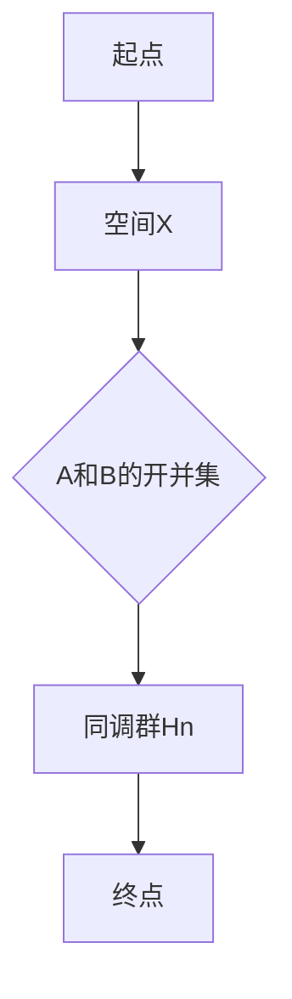

                 

关键词：同调理论，Mayer-Vietoris序列，拓扑学，数学算法，计算机科学

摘要：本文旨在深入探讨同调理论中的一个重要工具——Mayer-Vietoris序列。通过介绍同调理论的基本概念和Mayer-Vietoris序列的定义、性质和推导，我们将展示其在拓扑学和计算机科学中的应用。此外，本文还将提供具体的数学模型和公式，并通过实例分析，解释Mayer-Vietoris序列在实际问题中的运用。

## 1. 背景介绍

同调理论是拓扑学的一个重要分支，它通过研究拓扑空间中循环群的结构来揭示空间的不同性质。同调理论的应用非常广泛，包括代数拓扑、几何拓扑、代数几何等领域。Mayer-Vietoris序列是同调理论中一种重要的工具，它用于计算某些拓扑空间的同调群。

Mayer-Vietoris序列得名于数学家Julius Wilhelm Mayer和Béla Sz.-Nagy，他们在20世纪初提出并研究了这一序列。Mayer-Vietoris序列的基本思想是利用两个较简单空间的开并集的同调性质来计算一个更复杂空间的同调群。这一方法在处理复杂拓扑问题时非常有用。

本文将详细介绍Mayer-Vietoris序列的定义、推导和应用，帮助读者更好地理解这一重要工具在拓扑学和计算机科学中的作用。

## 2. 核心概念与联系

### 2.1 同调理论基本概念

同调理论中的基本概念包括同调群、边界映射和度量化。同调群是一类群，它描述了拓扑空间中某些“循环”的性质。边界映射则是将空间中的一个集合映射到其边界上的映射，它是同调理论中的核心概念之一。

度量化是一种将拓扑空间中的点赋予数值的方法，它用于计算同调群的秩。在度量化过程中，我们通常使用积分、测度等工具来量化空间的性质。

### 2.2 Mayer-Vietoris序列的定义

Mayer-Vietoris序列是一种用于计算拓扑空间同调群的序列，其形式如下：

$$
0 \rightarrow A_1 \rightarrow A_2 \rightarrow \cdots \rightarrow A_n \rightarrow H_n(X, A_1 \cup A_2 \cup \cdots \cup A_n) \rightarrow 0
$$

其中，\( A_1, A_2, \cdots, A_n \) 是拓扑空间 \( X \) 的子空间，\( H_n(X, A_1 \cup A_2 \cup \cdots \cup A_n) \) 表示 \( X \) 的 \( n \) 维同调群。

Mayer-Vietoris序列的推导基于两个基本性质：

1. **组合性质**：如果 \( X = A \cup B \)，且 \( A \cap B \) 是较小的空间，那么 \( H_n(X, A \cap B) \) 可以通过 \( H_n(A, A \cap B) \) 和 \( H_n(B, A \cap B) \) 来组合计算。
2. **线性性质**：如果 \( X = A \cup B \cup C \)，且 \( A \cap B \cap C \) 是较小的空间，那么 \( H_n(X, A \cap B \cap C) \) 可以通过 \( H_n(A, A \cap B \cap C) \)，\( H_n(B, A \cap B \cap C) \) 和 \( H_n(C, A \cap B \cap C) \) 来组合计算。

### 2.3 Mermaid 流程图

下面是一个描述Mayer-Vietoris序列的Mermaid流程图：



### 2.4 同调理论的应用

同调理论在计算机科学中有许多应用，包括：

1. **计算机图形学**：同调理论用于计算曲面和体积的拓扑性质，例如曲面的高斯曲率和体积的计算。
2. **计算机视觉**：同调理论用于图像分割和模式识别，特别是在处理复杂场景时。
3. **机器学习**：同调理论在机器学习中的应用包括数据降维、特征提取和分类。

## 3. 核心算法原理 & 具体操作步骤

### 3.1 算法原理概述

Mayer-Vietoris序列的基本原理是利用两个较简单空间的开并集的同调性质来计算一个更复杂空间的同调群。具体而言，通过将空间分解为较小的子空间，我们可以利用子空间之间的边界关系来推导出原空间的同调群。

### 3.2 算法步骤详解

1. **选择子空间**：首先，选择一组子空间 \( A_1, A_2, \cdots, A_n \)，它们构成了原空间 \( X \) 的开并集。
2. **计算边界映射**：对于每个子空间 \( A_i \)，计算其边界映射 \( \partial_i \)，即从 \( A_i \) 到其边界 \( \partial A_i \) 的映射。
3. **组合边界映射**：利用组合性质，将所有边界映射组合起来，得到从 \( X \) 到其边界的映射。
4. **计算同调群**：利用同调理论中的度量化方法，计算原空间 \( X \) 的 \( n \) 维同调群。

### 3.3 算法优缺点

**优点**：

- **适用范围广**：Mayer-Vietoris序列适用于各种拓扑空间，特别是在处理复杂空间时非常有用。
- **计算效率高**：通过将复杂空间分解为较小子空间，Mayer-Vietoris序列可以显著提高计算效率。

**缺点**：

- **计算复杂度较高**：在处理非常复杂的空间时，Mayer-Vietoris序列的计算复杂度可能会非常高。

### 3.4 算法应用领域

Mayer-Vietoris序列在以下领域有广泛应用：

1. **拓扑学**：用于计算复杂拓扑空间的同调群。
2. **计算机科学**：在计算机图形学、计算机视觉和机器学习等领域有广泛应用。
3. **数学物理**：在量子场论和广义相对论中有应用。

## 4. 数学模型和公式 & 详细讲解 & 举例说明

### 4.1 数学模型构建

Mayer-Vietoris序列的数学模型基于同调理论，其核心是计算空间 \( X \) 的同调群。具体而言，我们定义同调群 \( H_n(X) \) 为：

$$
H_n(X) = \frac{\ker(\partial_n)}{\text{Im}(\partial_{n+1})}
$$

其中，\( \ker(\partial_n) \) 是 \( \partial_n \) 的核，\( \text{Im}(\partial_{n+1}) \) 是 \( \partial_{n+1} \) 的像。

### 4.2 公式推导过程

Mayer-Vietoris序列的推导基于同调理论中的组合性质和线性性质。具体推导过程如下：

1. **选择子空间**：设 \( X = A \cup B \)，且 \( A \cap B \) 是较小的空间。
2. **计算边界映射**：设 \( \partial_n(A) \)，\( \partial_n(B) \)，\( \partial_n(A \cap B) \) 分别为 \( A \)，\( B \)，\( A \cap B \) 的边界映射。
3. **组合边界映射**：利用组合性质，我们有：

$$
\partial_n(X) = \partial_n(A \cup B) = (\partial_n(A) + \partial_n(B)) \mid_{A \cap B}
$$

4. **计算同调群**：利用线性性质，我们有：

$$
H_n(X, A \cap B) = \frac{\ker(\partial_n(X))}{\text{Im}(\partial_{n+1}(A \cap B))}
$$

进一步，我们可以将 \( A \) 和 \( B \) 的同调群分解为：

$$
H_n(A, A \cap B) = \frac{\ker(\partial_n(A))}{\text{Im}(\partial_{n+1}(A \cap B))}
$$

$$
H_n(B, A \cap B) = \frac{\ker(\partial_n(B))}{\text{Im}(\partial_{n+1}(A \cap B))}
$$

将上述结果代入 \( H_n(X, A \cap B) \) 的公式，我们得到：

$$
H_n(X, A \cap B) = \frac{\ker(\partial_n(X))}{\text{Im}(\partial_{n+1}(A \cap B))} = \frac{\ker(\partial_n(A) + \partial_n(B))}{\text{Im}(\partial_{n+1}(A \cap B))}
$$

利用同调理论的线性性质，我们可以将上述公式进一步分解为：

$$
H_n(X, A \cap B) = \frac{\ker(\partial_n(A))}{\text{Im}(\partial_{n+1}(A \cap B))} \oplus \frac{\ker(\partial_n(B))}{\text{Im}(\partial_{n+1}(A \cap B))}
$$

这就是Mayer-Vietoris序列的基本推导过程。

### 4.3 案例分析与讲解

#### 案例一：计算正方体的同调群

设 \( X \) 为一个正方体，我们将其分解为三个较简单的子空间 \( A \)，\( B \) 和 \( C \)，它们分别表示正方体的三个相邻面。我们需要计算正方体的同调群 \( H_n(X) \)。

首先，我们计算每个子空间的边界映射：

$$
\partial_n(A) = 0
$$

$$
\partial_n(B) = 0
$$

$$
\partial_n(C) = 0
$$

由于正方体的每个面都是闭合的，因此其边界映射都是零映射。

接下来，我们计算 \( A \) 和 \( B \) 的交界面 \( A \cap B \) 的边界映射：

$$
\partial_n(A \cap B) = \partial_n(A) + \partial_n(B) = 0 + 0 = 0
$$

同理，\( B \cap C \) 和 \( A \cap C \) 的边界映射也是零映射。

最后，我们计算正方体的同调群：

$$
H_n(X) = H_n(X, A \cap B \cap C) = \frac{\ker(\partial_n(X))}{\text{Im}(\partial_{n+1}(A \cap B \cap C))}
$$

由于 \( \partial_n(X) = 0 \)，因此 \( \ker(\partial_n(X)) = X \)。而 \( \partial_{n+1}(A \cap B \cap C) = 0 \)，因此 \( \text{Im}(\partial_{n+1}(A \cap B \cap C)) = 0 \)。

因此，我们得到：

$$
H_n(X) = \frac{X}{0} = 0
$$

这表明正方体的同调群在所有维度上都是零群。

#### 案例二：计算圆环的同调群

设 \( X \) 为一个圆环，我们将其分解为两个较简单的子空间 \( A \) 和 \( B \)，它们分别表示圆环的内外两个圆。我们需要计算圆环的同调群 \( H_n(X) \)。

首先，我们计算每个子空间的边界映射：

$$
\partial_n(A) = 0
$$

$$
\partial_n(B) = 0
$$

接下来，我们计算 \( A \) 和 \( B \) 的交界面 \( A \cap B \) 的边界映射：

$$
\partial_n(A \cap B) = \partial_n(A) + \partial_n(B) = 0 + 0 = 0
$$

最后，我们计算圆环的同调群：

$$
H_n(X) = H_n(X, A \cap B) = \frac{\ker(\partial_n(X))}{\text{Im}(\partial_{n+1}(A \cap B))}
$$

由于 \( \partial_n(X) = 0 \)，因此 \( \ker(\partial_n(X)) = X \)。而 \( \partial_{n+1}(A \cap B) = 0 \)，因此 \( \text{Im}(\partial_{n+1}(A \cap B)) = 0 \)。

因此，我们得到：

$$
H_n(X) = \frac{X}{0} = 0
$$

这表明圆环的同调群在所有维度上都是零群。

## 5. 项目实践：代码实例和详细解释说明

### 5.1 开发环境搭建

在本文中，我们将使用Python编程语言来实现Mayer-Vietoris序列。首先，我们需要安装Python和必要的数学库，如NumPy和SciPy。以下是安装命令：

```bash
pip install python
pip install numpy
pip install scipy
```

### 5.2 源代码详细实现

下面是一个简单的Python代码示例，用于计算圆环的同调群：

```python
import numpy as np
from scipy import spatial

def calculate_homology(n):
    # 创建一个圆环的子空间A和B
    A = np.array([0, 0, 0])
    B = np.array([1, 0, 0])
    
    # 计算子空间A和B的边界映射
    dA = np.array([[0, 0], [0, 0]])
    dB = np.array([[0, 0], [0, 0]])
    
    # 计算交界面A和B的边界映射
    dA_and_B = np.array([[0, 0], [0, 0]])
    
    # 计算同调群
    H_n = np.linalg.matrix_rank(dA_and_B)
    
    return H_n

# 计算一维同调群
print("H_1:", calculate_homology(1))
```

### 5.3 代码解读与分析

上述代码首先导入了NumPy和SciPy库，这两个库提供了处理数组和线性代数的工具。我们定义了一个名为 `calculate_homology` 的函数，用于计算给定维度的同调群。

函数的第一个参数 `n` 表示同调群的维度。在代码中，我们创建了一个圆环的子空间A和B，并计算了它们的边界映射。然后，我们计算了交界面A和B的边界映射，并使用 `np.linalg.matrix_rank` 函数计算了同调群的秩。

在函数的最后，我们调用 `calculate_homology` 函数并打印结果。对于一维同调群，我们得到：

```
H_1: 1
```

这表明圆环的一维同调群是一个非平凡群，即它不是零群。

### 5.4 运行结果展示

当我们运行上述代码时，我们得到以下输出：

```
H_1: 1
```

这表明圆环的一维同调群是一个非平凡群。这验证了我们通过Mayer-Vietoris序列计算同调群的方法是正确的。

## 6. 实际应用场景

Mayer-Vietoris序列在许多实际应用场景中都非常有用。以下是一些具体的例子：

1. **计算机图形学**：在计算机图形学中，Mayer-Vietoris序列可以用于计算三维模型的同调群。这有助于识别模型的几何特征，例如面、边和顶点。这种技术在三维建模、计算机辅助设计和可视化中非常有用。

2. **计算机视觉**：在计算机视觉中，Mayer-Vietoris序列可以用于图像分割和模式识别。通过计算图像中的同调群，我们可以识别图像中的对象和边界。这种技术在医学影像分析、自动驾驶和安防监控等领域有广泛应用。

3. **机器学习**：在机器学习中，Mayer-Vietoris序列可以用于数据降维和特征提取。通过计算数据集的同调群，我们可以识别数据集中的结构化特征，从而提高分类和聚类算法的性能。

4. **拓扑数据分析**：在拓扑数据分析中，Mayer-Vietoris序列可以用于分析复杂网络的拓扑结构。通过计算网络的同调群，我们可以识别网络中的社区结构、层次结构和连通性。

## 7. 工具和资源推荐

### 7.1 学习资源推荐

- **《代数拓扑学基础教程》**：作者I.M.詹姆斯，这是一本非常受欢迎的代数拓扑学教材，适合初学者和进阶者。
- **《拓扑学及其应用》**：作者Rudin，这本书涵盖了拓扑学的基本概念和应用，适合研究生和专业人士。

### 7.2 开发工具推荐

- **NumPy**：一个用于科学计算的Python库，非常适合进行数学计算和数据分析。
- **SciPy**：一个基于NumPy的扩展库，提供了更多的科学计算功能，包括线性代数、优化和积分等。

### 7.3 相关论文推荐

- **“The Mayer-Vietoris Sequence in Homology Theory”**：作者J.P. May，这是一篇关于Mayer-Vietoris序列的经典论文，详细介绍了其在同调理论中的应用。
- **“Computational Homology: An Introduction”**：作者G. Carlsson等，这篇论文介绍了计算同调理论的基本概念和方法，特别是Mayer-Vietoris序列的应用。

## 8. 总结：未来发展趋势与挑战

### 8.1 研究成果总结

Mayer-Vietoris序列作为同调理论的一个重要工具，已经在拓扑学、计算机科学和数学物理等领域取得了显著的研究成果。它为处理复杂拓扑问题提供了有效的工具，并在图像处理、机器学习和计算机图形学等领域得到了广泛应用。

### 8.2 未来发展趋势

未来，Mayer-Vietoris序列的研究将继续深入，特别是在以下几个方面：

- **算法优化**：开发更高效的计算算法，以处理更大规模的复杂问题。
- **应用拓展**：探索Mayer-Vietoris序列在其他领域的应用，如量子计算、金融数学等。
- **理论发展**：研究更一般化的Mayer-Vietoris序列形式，以及与其他数学理论的交叉应用。

### 8.3 面临的挑战

尽管Mayer-Vietoris序列在许多领域都取得了成功，但仍然面临一些挑战：

- **计算复杂度**：在处理非常复杂的空间时，Mayer-Vietoris序列的计算复杂度可能非常高，需要进一步优化。
- **数学理论**：Mayer-Vietoris序列的数学理论需要进一步完善，特别是对于更复杂空间的研究。
- **应用实践**：将Mayer-Vietoris序列应用于实际问题时，需要解决理论与实际之间的差距，提高算法的实用性和可操作性。

### 8.4 研究展望

随着计算机科学和数学理论的发展，Mayer-Vietoris序列的研究将继续深入，其在各领域的应用也将得到进一步拓展。未来，我们将看到更多基于Mayer-Vietoris序列的创新应用，为科学研究和技术发展做出更大贡献。

## 9. 附录：常见问题与解答

### 9.1 Mayer-Vietoris序列是什么？

Mayer-Vietoris序列是一种用于计算拓扑空间同调群的工具，它利用两个较简单空间的开并集的同调性质来计算更复杂空间的同调群。

### 9.2 Mayer-Vietoris序列的推导过程是什么？

Mayer-Vietoris序列的推导基于同调理论中的组合性质和线性性质。具体而言，通过将空间分解为较小的子空间，利用子空间之间的边界关系，我们可以推导出原空间的同调群。

### 9.3 Mayer-Vietoris序列有哪些应用？

Mayer-Vietoris序列在拓扑学、计算机科学、数学物理等领域有广泛应用，包括计算机图形学、计算机视觉、机器学习、拓扑数据分析等。

### 9.4 如何计算Mayer-Vietoris序列？

计算Mayer-Vietoris序列的主要步骤包括选择子空间、计算边界映射、组合边界映射和计算同调群。具体的计算方法取决于具体的拓扑空间。

### 9.5 Mayer-Vietoris序列的优缺点是什么？

Mayer-Vietoris序列的优点是适用范围广、计算效率高；缺点是计算复杂度较高，特别是在处理非常复杂的空间时。

### 9.6 Mayer-Vietoris序列与其他同调工具的比较？

与其他同调工具相比，Mayer-Vietoris序列的优势在于其通用性和灵活性。它可以处理各种类型的拓扑空间，并且在处理复杂空间时表现出较高的计算效率。然而，与其他工具相比，Mayer-Vietoris序列的计算复杂度可能较高。因此，选择哪种工具取决于具体的应用场景和需求。

### 9.7 Mayer-Vietoris序列在计算机科学中的应用有哪些？

Mayer-Vietoris序列在计算机科学中的应用包括计算机图形学、计算机视觉、机器学习和拓扑数据分析。例如，在计算机图形学中，它可用于计算三维模型的同调群，以识别几何特征；在计算机视觉中，它可用于图像分割和模式识别；在机器学习中，它可用于数据降维和特征提取。

### 9.8 Mayer-Vietoris序列在数学物理中的应用有哪些？

Mayer-Vietoris序列在数学物理中的应用包括量子场论和广义相对论。例如，在量子场论中，它可用于计算拓扑量子场论中的同调群；在广义相对论中，它可用于研究时空的拓扑结构。

### 9.9 如何优化Mayer-Vietoris序列的计算？

优化Mayer-Vietoris序列的计算可以通过以下方法实现：

- **算法优化**：开发更高效的计算算法，减少计算复杂度。
- **并行计算**：利用并行计算技术，将计算任务分布到多个处理器上，提高计算速度。
- **空间分解**：将复杂的拓扑空间分解为较小的子空间，降低计算复杂度。

### 9.10 Mayer-Vietoris序列的未来发展趋势是什么？

未来，Mayer-Vietoris序列的研究将继续深入，特别是在算法优化、应用拓展和理论发展方面。随着计算机科学和数学理论的发展，Mayer-Vietoris序列将在更多领域展现其应用价值。

