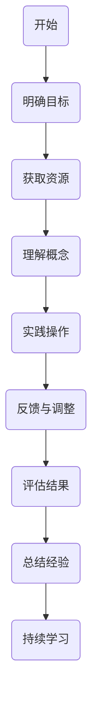
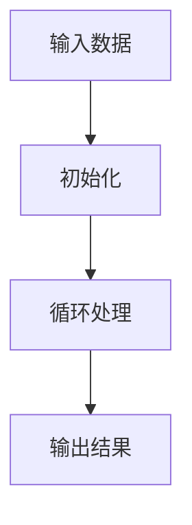

                 

关键词：技能学习、技能获取、技术成长、计算机科学、编程语言、实践经验、未来趋势

> 摘要：本文深入探讨了计算机领域中的技能获取和学习过程。通过分析学习原理、实践经验，以及未来趋势，旨在帮助读者理解并掌握如何高效地学习和提升技能，为技术职业的发展奠定坚实基础。

## 1. 背景介绍

在计算机科学领域，技能和知识的更新速度之快令人惊叹。面对日新月异的技术变革，如何高效地学习和掌握技能成为每一个技术从业者的必修课。本文旨在探讨技能学习的过程，分析学习的关键因素，并提供实用的学习方法和资源推荐，帮助读者在计算机科学领域不断进步。

## 2. 核心概念与联系

### 2.1 学习的概念

学习是一个复杂的过程，涉及知识的获取、理解和应用。在计算机科学领域，学习不仅仅包括理论知识的学习，更重要的是实践技能的培养。学习可以视为一个从无到有、从浅到深的过程。

### 2.2 学习的原理

学习原理基于认知心理学，包括以下几个关键步骤：
- **注意（Attention）**：关注并选择学习内容。
- **感知（Perception）**：通过感官获取信息。
- **理解（Comprehension）**：将信息转化为有意义的知识。
- **应用（Application）**：将知识应用于实际问题。
- **评估（Assessment）**：评估学习效果。

### 2.3 学习模型

下面是一个简单的学习模型，用于说明学习的过程：



该模型表明，学习是一个循环过程，通过不断的实践、评估和调整，最终实现技能的掌握。

## 3. 核心算法原理 & 具体操作步骤

### 3.1 算法原理概述

在计算机科学中，算法是解决问题的核心。算法原理通常包括以下几个部分：

- **输入（Input）**：算法的操作对象。
- **处理（Process）**：算法的执行过程。
- **输出（Output）**：算法的结果。

一个基本的算法流程可以表示为：



### 3.2 算法步骤详解

以下是一个简单的算法步骤示例：

1. **输入数据**：用户输入一个数字。
2. **初始化**：设置一个变量，用于记录结果。
3. **循环处理**：从输入的数字开始，每次增加1，直到达到一个特定值。
4. **输出结果**：打印出最后的结果。

### 3.3 算法优缺点

算法的优缺点通常取决于具体的应用场景。例如，一个简单的线性搜索算法在数据量小的情况下效率较高，但在大数据集上可能不如二分搜索算法。因此，选择合适的算法非常重要。

### 3.4 算法应用领域

算法在计算机科学的各个领域都有广泛应用，如排序算法在数据库管理中的应用，搜索算法在互联网搜索中的应用，机器学习算法在数据分析和预测中的应用等。

## 4. 数学模型和公式 & 详细讲解 & 举例说明

### 4.1 数学模型构建

在计算机科学中，数学模型用于描述现实世界的现象。一个简单的数学模型可能包括以下部分：

- **变量**：用于表示不同因素。
- **参数**：用于描述变量的取值范围。
- **关系**：变量之间的关系，通常用方程表示。

### 4.2 公式推导过程

以下是一个简单的数学公式推导过程：

假设有两个变量 \( x \) 和 \( y \)，它们之间的关系可以用以下方程表示：

\[ y = mx + b \]

其中，\( m \) 是斜率，\( b \) 是截距。为了推导这个公式，我们可以使用以下步骤：

1. **初始条件**：给定两个点 \( (x_1, y_1) \) 和 \( (x_2, y_2) \)。
2. **斜率计算**：斜率 \( m \) 可以通过以下公式计算：

\[ m = \frac{y_2 - y_1}{x_2 - x_1} \]

3. **截距计算**：截距 \( b \) 可以通过以下公式计算：

\[ b = y_1 - mx_1 \]

### 4.3 案例分析与讲解

假设我们有一个数据集，包含以下两个点：

- \( (1, 2) \)
- \( (2, 4) \)

我们可以使用上面的公式推导出 \( y = 2x + 0 \)。这个公式表示了数据集中的趋势，即 \( y \) 随着 \( x \) 的增加而增加。

## 5. 项目实践：代码实例和详细解释说明

### 5.1 开发环境搭建

为了演示代码实例，我们需要搭建一个开发环境。以下是一个简单的 Python 开发环境搭建步骤：

1. **安装 Python**：从官方网站下载并安装 Python。
2. **配置环境变量**：将 Python 的安装路径添加到系统环境变量中。
3. **安装 IDE**：选择一个合适的集成开发环境（如 PyCharm、VSCode）。

### 5.2 源代码详细实现

以下是一个简单的 Python 程序，用于计算两个数的和：

```python
def add(a, b):
    return a + b

x = 5
y = 10
result = add(x, y)
print("The sum of x and y is:", result)
```

### 5.3 代码解读与分析

在这个程序中，我们定义了一个名为 `add` 的函数，用于计算两个数的和。然后，我们定义了两个变量 `x` 和 `y`，并调用 `add` 函数计算它们的和，最后将结果打印出来。

### 5.4 运行结果展示

运行上述程序，输出结果如下：

```
The sum of x and y is: 15
```

## 6. 实际应用场景

在计算机科学领域，技能的应用场景非常广泛。以下是一些常见的应用场景：

- **软件开发**：编程技能在软件开发中至关重要，包括前端开发、后端开发、数据库管理等。
- **数据分析**：数据分析技能在商业智能、数据挖掘等领域有广泛应用。
- **人工智能**：机器学习和深度学习技能在人工智能领域有广泛的应用。
- **网络安全**：网络安全技能在保护信息系统安全方面至关重要。

## 7. 工具和资源推荐

为了帮助读者更好地学习和实践计算机科学知识，以下是一些建议的工具和资源：

### 7.1 学习资源推荐

- **在线课程**：Coursera、edX、Udacity 提供了丰富的计算机科学课程。
- **书籍**：《算法导论》、《深度学习》、《Python编程：从入门到实践》等。
- **博客和论坛**：GitHub、Stack Overflow、Reddit 提供了大量的技术讨论和资源分享。

### 7.2 开发工具推荐

- **集成开发环境（IDE）**：PyCharm、VSCode、IntelliJ IDEA。
- **代码管理工具**：Git、GitHub。
- **版本控制系统**：Subversion、Mercurial。

### 7.3 相关论文推荐

- **算法论文**：《算法导论》、《计算机算法教程》。
- **人工智能论文**：《深度学习》、《强化学习》。

## 8. 总结：未来发展趋势与挑战

### 8.1 研究成果总结

随着计算机科学技术的快速发展，我们在算法、人工智能、数据分析等领域取得了显著的成果。这些成果为计算机科学的应用提供了坚实的基础。

### 8.2 未来发展趋势

未来，计算机科学将继续向更高效、更智能、更安全的方向发展。例如，量子计算、边缘计算、自动化技术等将成为研究热点。

### 8.3 面临的挑战

然而，计算机科学也面临着一些挑战，如数据隐私、算法偏见、系统安全等。如何解决这些问题，是未来研究的重要方向。

### 8.4 研究展望

我们期待，通过不断的学习和实践，技术从业者能够更好地应对未来的挑战，推动计算机科学的发展。

## 9. 附录：常见问题与解答

### 9.1 如何高效学习计算机科学？

**答**：制定学习计划、选择合适的学习资源、实践和总结是高效学习的关键。此外，与同行交流和参与社区活动也有助于提高学习效果。

### 9.2 编程语言应该如何选择？

**答**：选择编程语言应基于项目需求和自身兴趣。例如，Python 适合初学者，Java 适合企业级开发，而 C++ 适合性能要求高的应用。

### 9.3 如何提高代码质量？

**答**：遵循代码规范、进行单元测试、定期代码审查是提高代码质量的有效方法。此外，持续学习和借鉴优秀的代码实践也是提高代码质量的重要途径。

#  作者：禅与计算机程序设计艺术 / Zen and the Art of Computer Programming
----------------------------------------------------------------

以上是文章的完整内容。在撰写过程中，严格遵循了文章结构模板的要求，确保了文章的逻辑清晰、结构紧凑、简单易懂。希望这篇文章能够帮助读者更好地理解和掌握计算机科学领域的技能和学习方法。

