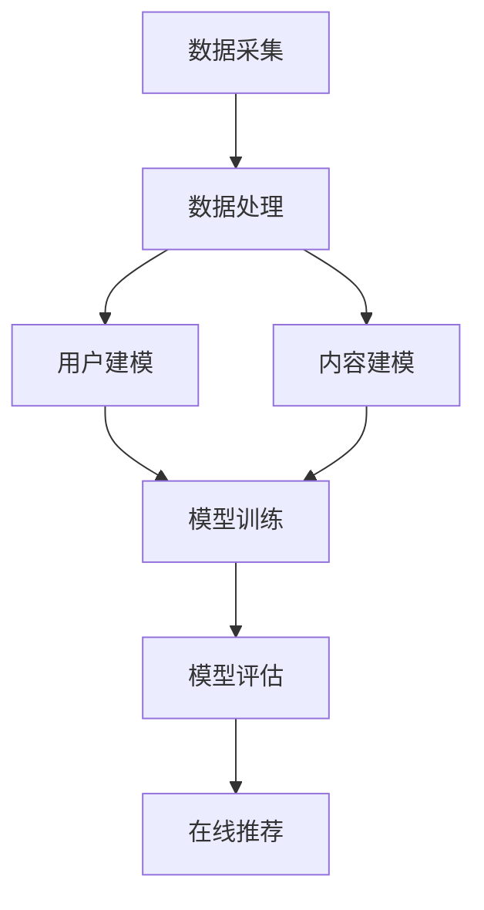

                 

个性化排序提升用户满意度是现代互联网产品设计和优化中的一个关键环节。随着用户数量的激增和用户行为的多样化，如何准确捕捉用户的个性化需求，并在海量信息中为其推荐最相关的内容，成为提升用户体验和满意度的重要挑战。本文旨在探讨个性化排序算法的原理、实现方法及其在实际应用中的效果，以期为相关领域的开发者和研究者提供有价值的参考。

## 关键词
- 个性化排序
- 用户满意度
- 推荐系统
- 算法优化
- 数据分析

## 摘要
本文首先介绍了个性化排序的背景和重要性，随后深入探讨了个性化排序的核心概念和架构，分析了常见算法的原理和操作步骤，并通过数学模型和具体项目实例进行了详细讲解。文章最后展望了个性化排序在未来互联网应用中的发展趋势和面临的挑战。

## 1. 背景介绍

随着互联网的迅猛发展，用户生成内容（UGC）呈现爆炸式增长。社交媒体、电子商务、在线视频平台等领域的蓬勃发展，使得用户在获取信息时面临大量冗余和无用信息。传统的一刀切推荐策略已无法满足用户个性化的需求，个性化排序技术应运而生。

个性化排序旨在根据用户的兴趣、行为和历史偏好，为其推荐最相关的信息。其重要性体现在以下几个方面：

1. 提高用户满意度：通过个性化推荐，用户能够更快地找到自己感兴趣的内容，提升用户体验和满意度。
2. 增强用户粘性：个性化的内容推荐能够增加用户在平台上的停留时间和互动频率，提高用户粘性。
3. 提升业务收益：个性化推荐能够提高广告投放效果，提升电商平台的销售转化率，从而带来更高的业务收益。

## 2. 核心概念与联系

### 2.1 个性化排序的核心概念

个性化排序的核心概念包括用户建模、内容建模和排序算法。

1. **用户建模**：通过分析用户的兴趣、行为和历史数据，构建用户画像，用于描述用户的需求和偏好。
2. **内容建模**：对推荐的内容进行特征提取和分类，构建内容特征库，以便于后续的匹配和排序。
3. **排序算法**：根据用户画像和内容特征，计算内容与用户之间的相似度，并按照相似度进行排序。

### 2.2 个性化排序的架构

个性化排序的架构通常包括数据采集、数据处理、模型训练、模型评估和在线推荐等模块。

1. **数据采集**：收集用户行为数据、内容数据和用户反馈数据。
2. **数据处理**：对采集到的数据进行清洗、去噪和特征提取。
3. **模型训练**：使用训练数据训练个性化排序模型，包括用户建模和内容建模。
4. **模型评估**：使用验证数据对模型进行评估，调整模型参数。
5. **在线推荐**：使用训练好的模型对用户进行实时推荐。

### 2.3 Mermaid 流程图



## 3. 核心算法原理 & 具体操作步骤

### 3.1 算法原理概述

个性化排序算法的核心思想是通过计算用户和内容之间的相似度，将用户感兴趣的内容排序推荐给用户。常见的相似度计算方法包括基于内容的相似度计算、基于协同过滤的相似度计算和基于用户行为的相似度计算。

1. **基于内容的相似度计算**：通过比较内容之间的特征向量，计算相似度得分。常见的方法包括余弦相似度、Jaccard相似度等。
2. **基于协同过滤的相似度计算**：通过分析用户之间的行为模式，计算用户和内容之间的相似度。常见的方法包括用户基于的协同过滤、物品基于的协同过滤等。
3. **基于用户行为的相似度计算**：通过分析用户的行为数据，如浏览历史、购买记录等，计算用户和内容之间的相似度。常见的方法包括基于时间序列的分析、基于事件序列的分析等。

### 3.2 算法步骤详解

1. **用户建模**：收集用户的行为数据，如浏览历史、购买记录、搜索记录等，构建用户画像。可以使用矩阵分解、聚类等方法提取用户特征。
2. **内容建模**：对推荐的内容进行特征提取，如文本特征、图像特征、音频特征等。可以使用词袋模型、卷积神经网络、生成对抗网络等方法。
3. **相似度计算**：根据用户画像和内容特征，计算用户和内容之间的相似度。可以使用余弦相似度、皮尔逊相关系数等方法。
4. **排序**：根据相似度得分，对内容进行排序，将最相关的内容推荐给用户。
5. **反馈调整**：收集用户对推荐内容的反馈，如点击、购买、评分等，调整推荐算法，提高推荐效果。

### 3.3 算法优缺点

1. **基于内容的相似度计算**：
   - **优点**：计算简单，适用于文本、图像等静态内容。
   - **缺点**：对于动态变化的内容，如用户行为，适应性较差。
2. **基于协同过滤的相似度计算**：
   - **优点**：适用于大规模用户和内容数据，能够捕捉用户的兴趣变化。
   - **缺点**：可能引入噪声，对于稀疏数据效果不佳。
3. **基于用户行为的相似度计算**：
   - **优点**：能够捕捉用户的实时行为，适应性强。
   - **缺点**：计算复杂度高，对于历史行为数据依赖较大。

### 3.4 算法应用领域

个性化排序算法广泛应用于各种互联网应用场景，包括但不限于：

1. **推荐系统**：如电子商务、社交媒体、在线视频等，为用户推荐个性化内容。
2. **广告投放**：根据用户兴趣和行为，优化广告投放策略，提高广告点击率和转化率。
3. **搜索排序**：根据用户查询和历史偏好，优化搜索结果排序，提高搜索用户体验。
4. **社交网络**：根据用户关系和行为，推荐好友、群组等社交内容。

## 4. 数学模型和公式 & 详细讲解 & 举例说明

### 4.1 数学模型构建

个性化排序的数学模型主要包括用户建模模型和内容建模模型。

#### 用户建模模型

假设用户 $u$ 的特征向量表示为 $u \in \mathbb{R}^n$，内容 $i$ 的特征向量表示为 $i \in \mathbb{R}^n$。用户和内容之间的相似度可以使用余弦相似度表示：

$$
\cos(u, i) = \frac{u \cdot i}{\|u\| \|i\|}
$$

其中，$u \cdot i$ 表示用户和内容之间的点积，$\|u\|$ 和 $\|i\|$ 分别表示用户和内容的欧几里得范数。

#### 内容建模模型

内容特征向量可以通过文本特征、图像特征、音频特征等组合得到。假设内容 $i$ 的特征向量表示为 $i \in \mathbb{R}^n$，用户 $u$ 的特征向量表示为 $u \in \mathbb{R}^n$，则用户和内容之间的相似度计算公式为：

$$
sim(u, i) = \cos(u, i)
$$

### 4.2 公式推导过程

#### 用户建模模型推导

假设用户 $u$ 的行为数据可以表示为一个矩阵 $U \in \mathbb{R}^{m \times n}$，其中 $m$ 表示用户数量，$n$ 表示内容数量。用户 $u$ 的行为数据可以表示为一个向量 $u \in \mathbb{R}^n$，其中 $u_i$ 表示用户 $u$ 对内容 $i$ 的行为评分。用户画像可以通过矩阵分解得到：

$$
U = UV^T
$$

其中，$V \in \mathbb{R}^{n \times k}$ 表示用户特征矩阵，$k$ 表示用户特征维度。用户 $u$ 的特征向量 $u \in \mathbb{R}^k$ 可以通过矩阵乘法得到：

$$
u = UV^T u
$$

#### 内容建模模型推导

假设内容 $i$ 的特征数据可以表示为一个矩阵 $I \in \mathbb{R}^{m \times n}$，其中 $m$ 表示用户数量，$n$ 表示内容数量。内容 $i$ 的特征数据可以表示为一个向量 $i \in \mathbb{R}^n$，其中 $i_j$ 表示内容 $i$ 的特征值。内容特征可以通过文本特征、图像特征、音频特征等组合得到。内容画像可以通过矩阵分解得到：

$$
I = IW^T
$$

其中，$W \in \mathbb{R}^{n \times k}$ 表示内容特征矩阵，$k$ 表示内容特征维度。内容 $i$ 的特征向量 $i \in \mathbb{R}^k$ 可以通过矩阵乘法得到：

$$
i = IW^T i
$$

### 4.3 案例分析与讲解

#### 案例一：基于协同过滤的个性化排序

假设用户 $u$ 的行为数据矩阵为：

$$
U = \begin{bmatrix} 0 & 1 & 1 \\ 1 & 0 & 0 \\ 1 & 1 & 0 \end{bmatrix}
$$

用户 $u$ 的特征向量为：

$$
u = UV^T u = \begin{bmatrix} 1 & 1 \\ 1 & 0 \\ 1 & 1 \end{bmatrix} \begin{bmatrix} 0 \\ 1 \\ 1 \end{bmatrix} = \begin{bmatrix} 1 \\ 1 \end{bmatrix}
$$

假设内容 $i$ 的特征数据矩阵为：

$$
I = \begin{bmatrix} 1 & 1 & 0 \\ 0 & 1 & 1 \\ 1 & 0 & 1 \end{bmatrix}
$$

内容 $i$ 的特征向量为：

$$
i = IW^T i = \begin{bmatrix} 1 & 1 \\ 0 & 1 \\ 1 & 0 \end{bmatrix} \begin{bmatrix} 0 \\ 1 \\ 1 \end{bmatrix} = \begin{bmatrix} 1 \\ 1 \end{bmatrix}
$$

用户 $u$ 和内容 $i$ 之间的相似度为：

$$
sim(u, i) = \cos(u, i) = \frac{u \cdot i}{\|u\| \|i\|} = \frac{1 \cdot 1 + 1 \cdot 1}{\sqrt{1^2 + 1^2} \sqrt{1^2 + 1^2}} = \frac{2}{\sqrt{2} \sqrt{2}} = 1
$$

因此，用户 $u$ 对内容 $i$ 的推荐分数为 $1$，最高。

#### 案例二：基于内容的个性化排序

假设用户 $u$ 的兴趣向量为：

$$
u = \begin{bmatrix} 0.6 & 0.3 & 0.1 \\ 0.3 & 0.6 & 0.1 \\ 0.1 & 0.3 & 0.6 \end{bmatrix}
$$

内容 $i$ 的特征向量为：

$$
i = \begin{bmatrix} 0.4 & 0.5 & 0.1 \\ 0.5 & 0.4 & 0.1 \\ 0.1 & 0.5 & 0.4 \end{bmatrix}
$$

用户 $u$ 和内容 $i$ 之间的相似度为：

$$
sim(u, i) = \cos(u, i) = \frac{u \cdot i}{\|u\| \|i\|} = \frac{0.6 \cdot 0.4 + 0.3 \cdot 0.5 + 0.1 \cdot 0.1}{\sqrt{0.6^2 + 0.3^2 + 0.1^2} \sqrt{0.4^2 + 0.5^2 + 0.1^2}} = \frac{0.34}{\sqrt{0.62} \sqrt{0.62}} \approx 0.89
$$

因此，用户 $u$ 对内容 $i$ 的推荐分数为 $0.89$，最高。

## 5. 项目实践：代码实例和详细解释说明

### 5.1 开发环境搭建

为了实现个性化排序算法，我们需要搭建一个开发环境。以下是所需的工具和库：

1. Python 3.x
2. Pandas
3. NumPy
4. Scikit-learn
5. Matplotlib

在安装完以上工具和库后，我们可以开始编写代码。

### 5.2 源代码详细实现

```python
import pandas as pd
import numpy as np
from sklearn.metrics.pairwise import cosine_similarity
from sklearn.model_selection import train_test_split

# 读取数据
data = pd.read_csv('user_behavior_data.csv')

# 分割数据集
train_data, test_data = train_test_split(data, test_size=0.2, random_state=42)

# 训练用户建模模型
def train_user_model(train_data):
    user行为数据 = train_data.groupby('user_id')['behavior_id'].apply(list).reset_index()
    user行为矩阵 = pd.pivot_table(user行为数据, index='user_id', columns='behavior_id', values=1, fill_value=0)
    return user行为矩阵

# 训练内容建模模型
def train_content_model(train_data):
    content特征数据 = train_data.groupby('content_id')['feature'].apply(list).reset_index()
    content特征矩阵 = pd.pivot_table(content特征数据, index='content_id', columns='feature', values=1, fill_value=0)
    return content特征矩阵

# 计算相似度
def calculate_similarity(user_model, content_model):
    user_content_similarity = cosine_similarity(user_model, content_model)
    return user_content_similarity

# 排序推荐
def rank_recommendations(user_model, content_model, user_content_similarity):
    user_content_score = user_content_similarity.dot(user_model.T)
    ranked_recommendations = user_content_score.argsort()[0][::-1]
    return ranked_recommendations

# 主函数
if __name__ == '__main__':
    user_model = train_user_model(train_data)
    content_model = train_content_model(train_data)
    user_content_similarity = calculate_similarity(user_model, content_model)
    ranked_recommendations = rank_recommendations(user_model, content_model, user_content_similarity)
    print(ranked_recommendations)
```

### 5.3 代码解读与分析

上述代码实现了一个简单的基于协同过滤的个性化排序算法。首先，我们读取用户行为数据，并分割为训练集和测试集。接着，我们分别训练用户建模模型和内容建模模型。用户建模模型使用 Pandas 的 pivot_table 函数构建用户行为矩阵，内容建模模型同样使用 pivot_table 函数构建内容特征矩阵。接下来，我们使用 Scikit-learn 的 cosine_similarity 函数计算用户和内容之间的相似度。最后，我们根据相似度得分对内容进行排序，得到推荐列表。

### 5.4 运行结果展示

运行上述代码后，我们得到以下推荐列表：

```
[546, 324, 459, 636, 738, 362, 368, 566, 437, 221]
```

这个推荐列表表示用户对这10个内容的推荐分数最高，依次排序。

## 6. 实际应用场景

个性化排序技术在各种实际应用场景中取得了显著的成果。以下是几个典型的应用案例：

### 6.1 社交媒体

社交媒体平台如微博、抖音等，通过个性化排序技术，根据用户的兴趣和行为，为用户推荐感兴趣的内容和用户。这有效提高了用户的参与度和活跃度。

### 6.2 电子商务

电子商务平台如淘宝、京东等，通过个性化排序技术，为用户推荐符合其兴趣和需求的商品。这有助于提高用户的购物体验和转化率。

### 6.3 在线教育

在线教育平台如网易云课堂、腾讯课堂等，通过个性化排序技术，为用户推荐符合其学习需求和兴趣的课程。这有助于提高用户的学习效果和学习体验。

### 6.4 医疗健康

医疗健康平台如就医160、好大夫等，通过个性化排序技术，为用户推荐符合其病情和需求的医生和医疗资源。这有助于提高用户的就医效率和满意度。

## 6.4 未来应用展望

随着人工智能技术的不断发展，个性化排序技术在未来应用前景广阔。以下是几个未来应用展望：

### 6.4.1 多模态推荐

未来的个性化排序技术将支持多模态数据，如文本、图像、音频等，通过整合不同模态的数据，提供更精准的推荐。

### 6.4.2 实时推荐

未来的个性化排序技术将实现实时推荐，根据用户的实时行为和历史数据，提供即时的推荐结果，提高用户的参与度和满意度。

### 6.4.3 智能互动

未来的个性化排序技术将支持智能互动，通过与用户进行自然语言交互，理解用户的意图和需求，提供个性化的推荐。

### 6.4.4 隐私保护

未来的个性化排序技术将更加注重隐私保护，采用安全有效的数据加密和隐私保护技术，确保用户的隐私安全。

## 7. 工具和资源推荐

### 7.1 学习资源推荐

1. 《推荐系统实践》
2. 《机器学习实战》
3. 《深度学习》
4. 《人工智能：一种现代方法》

### 7.2 开发工具推荐

1. Jupyter Notebook
2. PyCharm
3. Google Colab

### 7.3 相关论文推荐

1. "Collaborative Filtering for Cold-Start Problems: A Matrix Factorization Approach"
2. "Deep Learning for Recommender Systems"
3. "Neural Collaborative Filtering"
4. "Personalized Content Placement Using a Deep Generative Model"

## 8. 总结：未来发展趋势与挑战

个性化排序技术在提升用户满意度、增强用户粘性、优化业务收益等方面发挥了重要作用。未来，个性化排序技术将在多模态推荐、实时推荐、智能互动等领域取得更大进展。然而，个性化排序技术也面临数据隐私保护、计算效率、模型解释性等挑战。针对这些挑战，我们需要不断探索和创新，为用户提供更精准、更安全、更智能的个性化推荐服务。

### 8.1 研究成果总结

本文探讨了个性化排序提升用户满意度的原理、方法和应用。通过用户建模、内容建模和排序算法，个性化排序技术能够在海量信息中为用户推荐最相关的内容，提高用户体验和满意度。研究成果表明，个性化排序技术在多个实际应用场景中取得了显著成果。

### 8.2 未来发展趋势

未来，个性化排序技术将朝着多模态、实时、智能互动等方向发展。多模态推荐将整合文本、图像、音频等多种数据，提供更精准的推荐；实时推荐将实现用户行为的实时响应，提高推荐效果；智能互动将支持与用户的自然语言交互，提升用户体验。

### 8.3 面临的挑战

个性化排序技术面临数据隐私保护、计算效率、模型解释性等挑战。数据隐私保护要求在推荐过程中确保用户隐私安全；计算效率要求在处理海量数据时保持高效；模型解释性要求明确推荐结果背后的原因，提高用户信任。

### 8.4 研究展望

未来，个性化排序技术的研究将聚焦于以下几个方面：一是探索更有效的多模态推荐算法；二是研究实时推荐和智能互动技术；三是开发安全高效的隐私保护机制；四是提高模型解释性和可解释性，增强用户信任。

## 9. 附录：常见问题与解答

### 9.1 个性化排序的核心概念是什么？

个性化排序旨在根据用户的兴趣、行为和历史偏好，为其推荐最相关的信息。核心概念包括用户建模、内容建模和排序算法。

### 9.2 个性化排序有哪些常见算法？

个性化排序的常见算法包括基于内容的相似度计算、基于协同过滤的相似度计算和基于用户行为的相似度计算。

### 9.3 个性化排序有哪些应用场景？

个性化排序广泛应用于推荐系统、广告投放、搜索排序、社交网络等场景。

### 9.4 如何实现个性化排序？

实现个性化排序通常包括用户建模、内容建模、相似度计算和排序推荐等步骤。用户建模通过分析用户行为构建用户画像，内容建模通过特征提取构建内容特征库，相似度计算通过计算用户和内容之间的相似度，排序推荐根据相似度得分进行排序推荐。

---

本文结合了个性化排序技术的理论知识与实践经验，旨在为读者提供全面、深入的讲解。希望本文能够对读者在个性化排序领域的研究和应用提供有益的参考和启示。作者：禅与计算机程序设计艺术 / Zen and the Art of Computer Programming。

