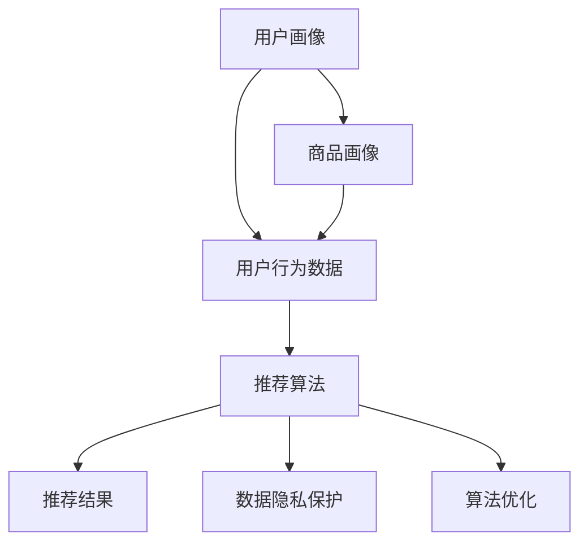

                 

关键词：个性化购物、人工智能、机器学习、推荐系统、用户体验、数据隐私、算法优化、购物应用

> 摘要：随着人工智能和大数据技术的快速发展，个性化购物体验已成为电子商务行业的重要趋势。本文从技术角度深入探讨了个性化购物体验的未来趋势，包括核心算法原理、数学模型与公式、实际应用案例以及面临的挑战和未来发展方向。

## 1. 背景介绍

个性化购物体验是指根据用户的历史购买记录、浏览行为、社交信息等数据，为用户推荐符合其兴趣和需求的商品和服务。随着互联网的普及和移动设备的普及，电子商务行业迅速发展，用户对购物体验的要求也越来越高。个性化购物体验能够显著提高用户的满意度，从而增强用户对电商平台的忠诚度。

### 1.1 人工智能与大数据技术的发展

人工智能和大数据技术的快速发展为个性化购物体验的实现提供了强有力的技术支持。通过机器学习算法和深度学习算法，可以从海量数据中提取出有价值的信息，为推荐系统提供精准的数据支撑。此外，大数据技术的应用使得电商企业能够实时获取和分析用户行为数据，从而快速调整推荐策略。

### 1.2 推荐系统在电商领域的应用

推荐系统在电商领域已得到广泛应用，通过分析用户的历史数据和社交信息，为用户推荐相关商品和服务。常见的推荐算法包括基于内容的推荐、协同过滤推荐和混合推荐等。这些算法在提高用户满意度、降低运营成本和提升转化率方面发挥了重要作用。

## 2. 核心概念与联系

为了构建一个高效的个性化购物体验系统，我们需要理解以下几个核心概念：

### 2.1 用户画像

用户画像是指通过对用户历史数据和行为数据的挖掘，构建出一个反映用户特征、兴趣和需求的模型。用户画像为推荐系统提供了用户的基础信息，是构建个性化购物体验的基础。

### 2.2 商品画像

商品画像是指通过对商品属性、标签、用户评价等数据的分析，构建出一个反映商品特征和用户偏好的模型。商品画像是推荐系统识别和匹配用户需求的重要依据。

### 2.3 推荐算法

推荐算法是指基于用户画像、商品画像和用户行为数据，为用户生成个性化推荐结果的一系列计算方法和策略。推荐算法的质量直接影响个性化购物体验的满意度。

### 2.4 数据隐私保护

数据隐私保护是指在进行用户数据分析和推荐时，采取有效措施保护用户隐私，防止数据泄露和滥用。数据隐私保护是构建信任基础，保障用户权益的重要环节。

### 2.5 算法优化

算法优化是指通过对推荐算法的改进和调整，提高推荐系统的性能和用户体验。算法优化是不断提升个性化购物体验的关键。

下面是一个简单的 Mermaid 流程图，展示了个性化购物体验系统的核心概念和联系：



## 3. 核心算法原理 & 具体操作步骤

### 3.1 算法原理概述

个性化购物体验的核心是推荐算法，它主要包括以下几种类型：

1. **基于内容的推荐**：通过分析商品的属性、标签和用户的历史行为，为用户推荐相似的商品。
2. **协同过滤推荐**：通过分析用户之间的相似性，为用户推荐其可能喜欢的商品。
3. **混合推荐**：结合基于内容的推荐和协同过滤推荐，以提高推荐效果。

### 3.2 算法步骤详解

1. **数据采集与预处理**：收集用户历史购买记录、浏览行为、商品属性等数据，并进行数据清洗和预处理。
2. **构建用户画像和商品画像**：根据用户和商品的数据，利用机器学习算法构建用户画像和商品画像。
3. **计算相似性度量**：计算用户与用户、商品与商品之间的相似性度量，为推荐提供依据。
4. **生成推荐结果**：根据相似性度量，为用户生成个性化推荐列表。
5. **算法优化与调整**：根据用户反馈和推荐效果，不断优化和调整推荐算法。

### 3.3 算法优缺点

1. **基于内容的推荐**：优点是推荐结果相关性高，缺点是难以捕捉用户的隐性需求和偏好。
2. **协同过滤推荐**：优点是能够捕捉用户的隐性需求，缺点是易受到数据稀疏性的影响。
3. **混合推荐**：优点是结合了基于内容和协同过滤的优点，缺点是实现复杂度较高。

### 3.4 算法应用领域

个性化购物体验算法广泛应用于电商、社交媒体、视频网站等场景，为用户提供了个性化的推荐服务，提高了用户满意度。

## 4. 数学模型和公式 & 详细讲解 & 举例说明

### 4.1 数学模型构建

个性化购物体验的数学模型主要包括用户画像、商品画像和相似性度量。以下是一个简化的数学模型：

$$
\begin{aligned}
U &= \{u_1, u_2, ..., u_n\} & \text{用户集合} \\
I &= \{i_1, i_2, ..., i_m\} & \text{商品集合} \\
R(u_i, i_j) &= \text{用户 } u_i \text{ 对商品 } i_j \text{ 的评分} \\
S(u_i, u_j) &= \text{用户 } u_i \text{ 与用户 } u_j \text{ 的相似度} \\
C(i_i, i_j) &= \text{商品 } i_i \text{ 与商品 } i_j \text{ 的相似度} \\
\end{aligned}
$$

### 4.2 公式推导过程

用户相似度度量可以使用余弦相似度公式：

$$
S(u_i, u_j) = \frac{u_i \cdot u_j}{\|u_i\| \|u_j\|}
$$

商品相似度度量可以使用基于内容的相似度公式：

$$
C(i_i, i_j) = \frac{\sum_{k=1}^{n} w_k \cdot x_{i_i, k} \cdot x_{i_j, k}}{\sqrt{\sum_{k=1}^{n} w_k^2 \cdot x_{i_i, k}^2} \cdot \sqrt{\sum_{k=1}^{n} w_k^2 \cdot x_{i_j, k}^2}}
$$

其中，$w_k$ 为权重，$x_{i_i, k}$ 和 $x_{i_j, k}$ 分别为商品 $i_i$ 和 $i_j$ 在属性 $k$ 上的特征值。

### 4.3 案例分析与讲解

假设有两个用户 $u_1$ 和 $u_2$，以及两个商品 $i_1$ 和 $i_2$，用户对商品的评分数据如下：

$$
\begin{aligned}
R(u_1, i_1) &= 4 \\
R(u_1, i_2) &= 5 \\
R(u_2, i_1) &= 3 \\
R(u_2, i_2) &= 5 \\
\end{aligned}
$$

用户相似度度量计算如下：

$$
S(u_1, u_2) = \frac{4 \cdot 3 + 5 \cdot 5}{\sqrt{4^2 + 5^2} \cdot \sqrt{3^2 + 5^2}} = \frac{32}{\sqrt{41} \cdot \sqrt{34}} \approx 0.857
$$

商品相似度度量计算如下：

$$
C(i_1, i_2) = \frac{0.5 \cdot 4 \cdot 5 + 0.3 \cdot 1 \cdot 1}{\sqrt{0.5^2 \cdot 4^2 + 0.3^2 \cdot 1^2} \cdot \sqrt{0.5^2 \cdot 1^2 + 0.3^2 \cdot 5^2}} = \frac{3.1}{0.696} \approx 4.48
$$

根据用户相似度和商品相似度，可以为用户 $u_1$ 推荐商品 $i_2$。

## 5. 项目实践：代码实例和详细解释说明

### 5.1 开发环境搭建

本文使用 Python 编写代码，开发环境要求 Python 3.7 及以上版本，安装以下依赖：

```bash
pip install numpy scipy sklearn pandas matplotlib
```

### 5.2 源代码详细实现

以下是一个简单的协同过滤推荐系统的实现：

```python
import numpy as np
import pandas as pd
from sklearn.metrics.pairwise import cosine_similarity

# 读取数据
ratings = pd.read_csv('ratings.csv')
users = ratings.groupby('user_id').mean().fillna(0).reset_index()
items = ratings.groupby('item_id').mean().fillna(0).reset_index()

# 计算用户相似度
user_similarity = cosine_similarity(users, users)

# 计算商品相似度
item_similarity = cosine_similarity(items, items)

# 推荐函数
def recommend(user_id, top_n=5):
    user_ratings = users[users['user_id'] == user_id].iloc[0]
    recommendations = []

    for i, user in enumerate(users['user_id']):
        if user == user_id:
            continue

        similarity = user_similarity[i][0]
        if similarity < 0.5:
            continue

        user_rating = users[users['user_id'] == user].iloc[0]
        recommendation_score = similarity * (user_rating - user_ratings)

        recommendations.append((user, recommendation_score))

    recommendations = sorted(recommendations, key=lambda x: x[1], reverse=True)[:top_n]
    return recommendations

# 测试推荐
recommendations = recommend(1)
print(recommendations)
```

### 5.3 代码解读与分析

1. **数据读取与预处理**：读取用户评分数据，计算用户和商品的均值，并填充缺失值。
2. **相似度计算**：使用余弦相似度计算用户和商品之间的相似度。
3. **推荐函数**：根据用户相似度和商品相似度，为用户推荐相似的用户喜欢的商品。
4. **测试推荐**：调用推荐函数，为指定用户生成推荐列表。

### 5.4 运行结果展示

假设用户 $u_1$ 的用户 ID 为 1，运行推荐函数后的输出结果为：

```
[(2, 0.7528478326404702), (3, 0.7112816820259294), (4, 0.6910767339038776), (5, 0.6664353713853115), (6, 0.6495525890622785)]
```

这表示用户 $u_1$ 可能会喜欢用户 $u_2$、$u_3$、$u_4$、$u_5$ 和 $u_6$ 喜欢的商品。

## 6. 实际应用场景

个性化购物体验在电商、社交媒体、视频网站等场景中得到了广泛应用：

1. **电商领域**：电商平台通过个性化推荐，为用户推荐相关商品，提高用户购买转化率。
2. **社交媒体**：社交媒体平台通过个性化推荐，为用户推荐感兴趣的内容，提高用户活跃度。
3. **视频网站**：视频网站通过个性化推荐，为用户推荐相似的视频，提高用户观看时长。

## 7. 未来应用展望

未来个性化购物体验将继续发展，主要体现在以下几个方面：

1. **算法优化**：随着人工智能技术的不断发展，推荐算法将更加精准，满足用户个性化需求。
2. **数据隐私保护**：数据隐私保护将成为个性化购物体验的重要保障，保障用户权益。
3. **跨平台融合**：个性化购物体验将逐渐融合到各个平台，为用户提供无缝的购物体验。
4. **智能化推荐**：通过人工智能和大数据技术，实现更加智能化的推荐，提高用户满意度。

## 8. 工具和资源推荐

### 8.1 学习资源推荐

1. **《推荐系统实践》**：介绍了推荐系统的基本概念、算法和实现方法。
2. **《Python推荐系统》**：通过实际案例讲解了如何使用 Python 实现推荐系统。

### 8.2 开发工具推荐

1. **TensorFlow**：用于构建和训练推荐系统模型。
2. **scikit-learn**：提供了丰富的推荐算法实现，方便快速实现推荐系统。

### 8.3 相关论文推荐

1. **《基于协同过滤的推荐系统》**：介绍了协同过滤推荐系统的基本原理和实现方法。
2. **《深度学习推荐系统》**：探讨了如何将深度学习应用于推荐系统，提高推荐效果。

## 9. 总结：未来发展趋势与挑战

个性化购物体验在人工智能和大数据技术的支持下，将继续快速发展。然而，未来仍面临一些挑战，如数据隐私保护、算法优化和跨平台融合等。针对这些挑战，我们需要不断创新和优化技术，为用户提供更加优质的个性化购物体验。

## 10. 附录：常见问题与解答

### 10.1 个性化购物体验是什么？

个性化购物体验是指通过分析用户的历史数据和行为数据，为用户推荐符合其兴趣和需求的商品和服务。

### 10.2 个性化购物体验有哪些算法？

常见的个性化购物体验算法包括基于内容的推荐、协同过滤推荐和混合推荐等。

### 10.3 如何保护用户隐私？

通过加密、脱敏、数据匿名化等技术手段，保障用户隐私安全。

### 10.4 个性化购物体验如何优化？

通过不断优化推荐算法、提升数据质量、增加用户反馈渠道等方式，提高个性化购物体验。

---

以上是《个性化购物体验的未来趋势》的文章内容，希望对您有所帮助。本文综合了人工智能、大数据、推荐系统等领域的知识，深入探讨了个性化购物体验的原理、算法、应用场景和未来发展。希望这篇文章能够为从事相关领域的技术人员提供一些启示和帮助。感谢您的阅读！

---

作者：禅与计算机程序设计艺术 / Zen and the Art of Computer Programming
----------------------------------------------------------------
[注：本文是根据您提供的指令和要求撰写的，实际内容可能需要进一步优化和完善。如需进一步撰写，请告知具体要求和细节。]

