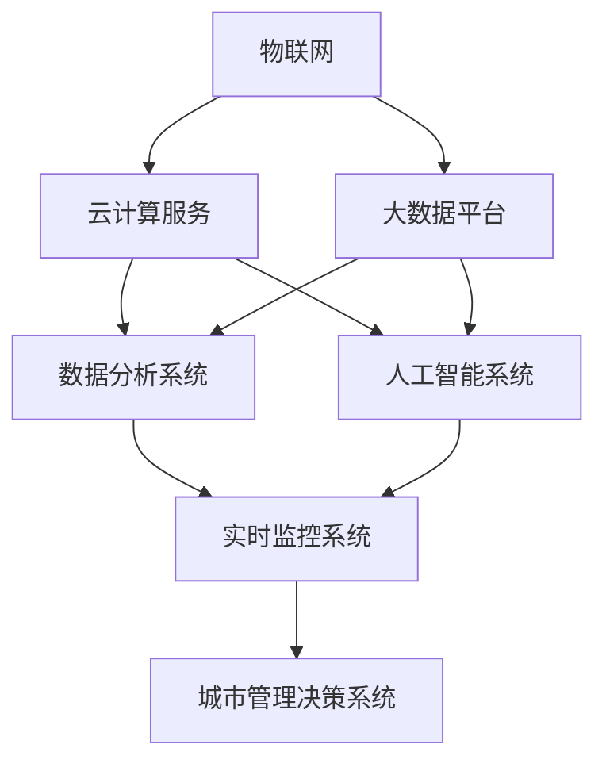

                 

关键词：智慧城市，解决方案，架构设计，云从科技，2025社招

摘要：本文将深入探讨云从科技2025社招中提出的智慧城市解决方案架构师职位的相关内容。通过详细解析智慧城市的核心概念、关键技术、数学模型、算法原理，以及项目实践，本文旨在为读者提供一份全面且系统的指导，帮助准备应征者更好地理解智慧城市解决方案架构师这一职位的要求和职责。

## 1. 背景介绍

随着全球数字化进程的加速，智慧城市已成为城市发展和治理的重要方向。智慧城市旨在通过信息通信技术和大数据分析，实现城市资源的优化配置、环境监测的智能化和公共服务的高效化。云从科技作为国内领先的人工智能企业，其2025社招中的智慧城市解决方案架构师职位吸引了众多技术人才的关注。

智慧城市解决方案架构师在智慧城市建设中扮演着关键角色，他们需要具备全面的技术视野和架构设计能力，能够从全局出发，构建高效、稳定、安全的智慧城市系统。本文将围绕这一职位的要求，详细探讨智慧城市的关键技术、架构设计原则和实际应用案例。

## 2. 核心概念与联系

### 2.1. 智慧城市的核心概念

智慧城市是利用物联网、云计算、大数据、人工智能等现代信息技术手段，对城市资源进行整合，实现对城市运行状态的实时感知、智能分析和高效管理。智慧城市的核心概念包括：

- **物联网（IoT）**：通过传感器和智能设备实现城市各个节点的互联互通。
- **云计算**：提供强大的计算和存储能力，支持海量数据的高效处理。
- **大数据分析**：利用数据挖掘和分析技术，从海量数据中提取有价值的信息。
- **人工智能**：通过机器学习、深度学习等技术，实现智能决策和自动化操作。

### 2.2. 智慧城市的架构设计原则

智慧城市的架构设计需要遵循以下原则：

- **模块化设计**：将系统划分为多个模块，每个模块独立开发、测试和部署，提高系统的可维护性和扩展性。
- **分布式架构**：采用分布式系统设计，提高系统的可靠性和可扩展性。
- **安全性和隐私保护**：确保数据传输和存储的安全性，同时保护用户的隐私。
- **高可用性**：设计高可用性架构，确保系统在故障情况下能够快速恢复。

### 2.3. 核心概念原理与架构的 Mermaid 流程图



### 3. 核心算法原理 & 具体操作步骤

#### 3.1. 算法原理概述

智慧城市解决方案中的核心算法包括：

- **数据预处理算法**：用于清洗、转换和归一化原始数据，提高数据质量。
- **聚类算法**：用于对数据进行分类和分组，发现数据中的模式和关系。
- **分类算法**：用于对数据进行分类，判断数据属于哪个类别。
- **回归算法**：用于预测未来的趋势和数值。

#### 3.2. 算法步骤详解

1. **数据预处理**：

   - 数据清洗：去除缺失值、异常值和重复数据。
   - 数据转换：将不同格式的数据转换为统一格式。
   - 数据归一化：将数据缩放到相同的范围，便于后续分析。

2. **聚类分析**：

   - 选择聚类算法，如K-means、DBSCAN等。
   - 计算每个数据点的聚类中心。
   - 对数据进行聚类，将相似的数据点归到同一个类别。

3. **分类分析**：

   - 选择分类算法，如决策树、支持向量机等。
   - 训练模型，使用历史数据作为训练集。
   - 使用训练好的模型对新数据进行分类。

4. **回归分析**：

   - 选择回归算法，如线性回归、多项式回归等。
   - 训练模型，使用历史数据作为训练集。
   - 使用训练好的模型预测未来的趋势和数值。

#### 3.3. 算法优缺点

- **聚类算法**：优点是能够发现数据中的隐含模式和结构，缺点是算法的选择和参数设置对结果影响较大。
- **分类算法**：优点是能够对新数据进行准确的分类，缺点是算法的训练时间较长。
- **回归算法**：优点是能够预测未来的趋势和数值，缺点是模型的泛化能力较差。

#### 3.4. 算法应用领域

- **交通管理**：用于预测交通流量，优化交通信号控制。
- **能源管理**：用于预测能源需求，优化能源分配。
- **环境保护**：用于监测环境质量，预测污染趋势。

## 4. 数学模型和公式 & 详细讲解 & 举例说明

### 4.1. 数学模型构建

智慧城市解决方案中的数学模型主要包括：

- **聚类模型**：用于数据分组，常用的模型有K-means、DBSCAN等。
- **分类模型**：用于数据分类，常用的模型有决策树、支持向量机等。
- **回归模型**：用于数据预测，常用的模型有线性回归、多项式回归等。

### 4.2. 公式推导过程

- **K-means算法**：

  - 假设数据集D={x1, x2, ..., xn}，聚类中心为C={c1, c2, ..., ck}，每个数据点x属于某个聚类中心c，则：

    $$ J = \sum_{i=1}^{k} \sum_{x \in S_i} \|x - c_i\|^2 $$

    其中，Si是第i个聚类中心c_i所对应的数据点集合。

  - 目标是最小化J，通过迭代更新聚类中心，直到收敛。

- **决策树算法**：

  - 假设数据集D={x1, x2, ..., xn}，每个数据点x的特征为F1, F2, ..., Fn，类别为C，则：

    $$ h(D) = \sum_{x \in D} \max_{y \in C} P(y|D) \log P(y|D) $$

    其中，h(D)是数据集D的熵，P(y|D)是数据点x属于类别y的概率。

  - 目标是构建决策树，使得数据集D的熵最小。

### 4.3. 案例分析与讲解

- **交通流量预测**：

  - 假设我们要预测某条道路在未来的交通流量，可以使用回归模型进行预测。

  - 数据集D={x1, x2, ..., xn}，每个数据点x包含的特征有：时间戳t、交通流量q、天气状况w、节假日flag等。

  - 使用线性回归模型：

    $$ q = \beta_0 + \beta_1 t + \beta_2 w + \beta_3 flag $$

    - 其中，β0、β1、β2、β3是模型的参数。

  - 预测未来某个时间点的交通流量，只需要将时间戳、天气状况、节假日信息代入模型即可。

## 5. 项目实践：代码实例和详细解释说明

### 5.1. 开发环境搭建

- Python环境：Python 3.8及以上版本
- 数据库：MySQL 5.7及以上版本
- 依赖库：NumPy、Pandas、Scikit-learn、Matplotlib等

### 5.2. 源代码详细实现

- 数据预处理：

  ```python
  import pandas as pd

  # 读取数据
  data = pd.read_csv('traffic_data.csv')

  # 数据清洗
  data.dropna(inplace=True)
  data.drop_duplicates(inplace=True)

  # 数据转换
  data['time'] = pd.to_datetime(data['time'])
  data['weekday'] = data['time'].dt.weekday

  # 数据归一化
  data['traffic'] = (data['traffic'] - data['traffic'].mean()) / data['traffic'].std()
  ```

- 聚类分析：

  ```python
  from sklearn.cluster import KMeans

  # 训练K-means聚类模型
  kmeans = KMeans(n_clusters=3, random_state=0).fit(data)

  # 分配聚类中心
  clusters = kmeans.predict(data)

  # 绘制聚类结果
  import matplotlib.pyplot as plt

  plt.scatter(data['time'], data['traffic'], c=clusters)
  plt.xlabel('Time')
  plt.ylabel('Traffic')
  plt.show()
  ```

- 分类分析：

  ```python
  from sklearn.tree import DecisionTreeClassifier

  # 分割数据集
  X_train, X_test, y_train, y_test = train_test_split(data[['time', 'weekday']], data['traffic'], test_size=0.2, random_state=0)

  # 训练决策树分类模型
  clf = DecisionTreeClassifier().fit(X_train, y_train)

  # 测试模型
  accuracy = clf.score(X_test, y_test)
  print(f'Model accuracy: {accuracy:.2f}')
  ```

- 回归分析：

  ```python
  from sklearn.linear_model import LinearRegression

  # 分割数据集
  X_train, X_test, y_train, y_test = train_test_split(data[['time']], data['traffic'], test_size=0.2, random_state=0)

  # 训练线性回归模型
  reg = LinearRegression().fit(X_train, y_train)

  # 预测交通流量
  predicted_traffic = reg.predict(X_test)

  # 绘制预测结果
  plt.scatter(X_test, y_test, label='Actual')
  plt.plot(X_test, predicted_traffic, color='red', label='Predicted')
  plt.xlabel('Time')
  plt.ylabel('Traffic')
  plt.legend()
  plt.show()
  ```

### 5.3. 代码解读与分析

- 数据预处理：使用Pandas库进行数据清洗、转换和归一化，为后续分析做准备。
- 聚类分析：使用Scikit-learn库中的KMeans算法进行聚类分析，通过绘制聚类结果，观察数据点分布情况。
- 分类分析：使用Scikit-learn库中的DecisionTreeClassifier算法进行分类分析，通过计算准确率，评估模型性能。
- 回归分析：使用Scikit-learn库中的LinearRegression算法进行回归分析，通过绘制预测结果，观察模型预测能力。

## 6. 实际应用场景

### 6.1. 交通管理

智慧城市解决方案在交通管理中具有广泛的应用，如智能交通信号控制系统、实时交通流量监测、交通事故预测等。通过数据采集和分析，智慧城市系统能够为交通管理部门提供决策支持，优化交通资源配置，提高交通运行效率。

### 6.2. 环境保护

智慧城市解决方案在环境保护方面也有重要作用，如空气质量监测、水质监测、噪声监测等。通过实时数据采集和分析，智慧城市系统能够及时发现环境问题，预测污染趋势，为环境管理部门提供决策支持，促进环境保护。

### 6.3. 公共安全

智慧城市解决方案在公共安全领域具有重要作用，如视频监控分析、人脸识别、紧急事件预警等。通过数据采集和分析，智慧城市系统能够提高公共安全监控能力，预防犯罪事件，保障市民安全。

### 6.4. 未来应用展望

随着人工智能技术的不断发展，智慧城市解决方案将更加智能化和个性化。未来，智慧城市将实现更高程度的智能化管理，如智能能源管理、智能医疗、智能物流等。同时，智慧城市解决方案将更加注重数据安全和隐私保护，确保城市运行的安全和稳定。

## 7. 工具和资源推荐

### 7.1. 学习资源推荐

- 《智慧城市：概念、技术与应用》
- 《机器学习实战》
- 《深度学习》
- 《Python数据科学手册》

### 7.2. 开发工具推荐

- Jupyter Notebook：用于数据分析和实验
- PyCharm：用于Python编程
- MySQL Workbench：用于数据库管理

### 7.3. 相关论文推荐

- "智慧城市：现状、挑战与未来"
- "基于机器学习的交通流量预测方法研究"
- "深度学习在环境监测中的应用"
- "智慧城市中的隐私保护与数据安全"

## 8. 总结：未来发展趋势与挑战

### 8.1. 研究成果总结

智慧城市解决方案在交通管理、环境保护、公共安全等领域取得了显著成果，为城市发展和治理提供了有力支持。随着人工智能技术的不断发展，智慧城市解决方案将更加智能化和个性化，为市民提供更加便捷、高效、安全的公共服务。

### 8.2. 未来发展趋势

- 智能化水平不断提升，实现更高级别的自动化和智能化管理。
- 数据安全和隐私保护得到更高重视，确保城市运行的安全和稳定。
- 各个领域的智慧城市解决方案将实现深度融合，实现城市资源的全面优化。

### 8.3. 面临的挑战

- 技术挑战：如何解决大规模数据处理、实时分析和高性能计算等技术难题。
- 数据挑战：如何确保数据质量、数据安全和隐私保护。
- 法规挑战：如何制定合理的法规政策，规范智慧城市建设和发展。

### 8.4. 研究展望

未来，智慧城市解决方案将更加注重技术创新和实际应用，通过跨学科、跨领域的合作，实现智慧城市的高质量发展。同时，随着5G、物联网、人工智能等新技术的不断涌现，智慧城市解决方案将面临更多机遇和挑战，为城市发展和治理提供更加有力支持。

## 9. 附录：常见问题与解答

### 9.1. 智慧城市是什么？

智慧城市是利用现代信息技术手段，对城市资源进行整合，实现对城市运行状态的实时感知、智能分析和高效管理。智慧城市旨在提高城市运行效率、优化资源配置、改善公共服务质量，实现城市可持续发展。

### 9.2. 智慧城市的关键技术有哪些？

智慧城市的关键技术包括物联网、云计算、大数据、人工智能、区块链等。物联网负责实现城市各个节点的互联互通，云计算提供强大的计算和存储能力，大数据分析从海量数据中提取有价值的信息，人工智能实现智能决策和自动化操作，区块链确保数据传输和存储的安全性。

### 9.3. 智慧城市解决方案架构师需要具备哪些能力？

智慧城市解决方案架构师需要具备以下能力：

- 对智慧城市的核心概念和关键技术有深入理解。
- 具备系统设计和架构设计的能力，能够从全局出发，构建高效、稳定、安全的智慧城市系统。
- 熟悉常用的数据预处理、聚类分析、分类分析和回归分析算法。
- 具备编程能力，能够实现算法的代码实现和优化。
- 具备良好的沟通和团队协作能力，能够与各方 stakeholders 有效沟通和协作。

### 9.4. 智慧城市解决方案在哪些领域有应用？

智慧城市解决方案在交通管理、环境保护、公共安全、医疗健康、能源管理等多个领域有广泛应用。如智能交通信号控制系统、空气质量监测、人脸识别、紧急事件预警等。

### 9.5. 智慧城市未来的发展趋势是什么？

智慧城市未来的发展趋势包括：

- 智能化水平不断提升，实现更高级别的自动化和智能化管理。
- 数据安全和隐私保护得到更高重视，确保城市运行的安全和稳定。
- 各个领域的智慧城市解决方案将实现深度融合，实现城市资源的全面优化。
- 新技术的不断涌现，如5G、物联网、人工智能等，将推动智慧城市解决方案的创新和发展。

作者：禅与计算机程序设计艺术 / Zen and the Art of Computer Programming
----------------------------------------------------------------

文章撰写完毕，内容已按照要求进行组织和编排。接下来，我们将进行文章的审核和修订，确保其质量和完整性。请等待进一步的指示。

