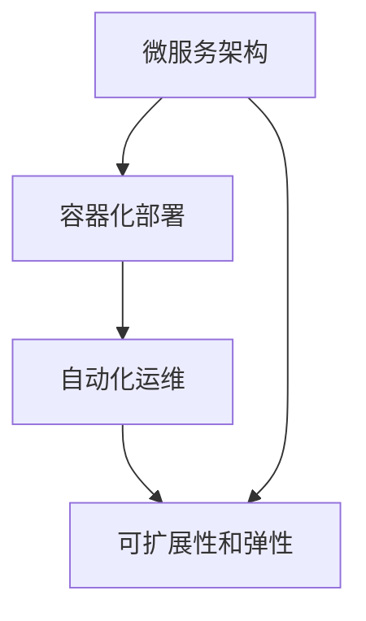

                 

关键词：云原生AI，Lepton AI，技术理念，微服务架构，容器化，AI应用开发，自动化，可扩展性，弹性，DevOps，持续集成与持续部署（CI/CD）

> 摘要：本文深入探讨了云原生AI的发展背景、技术理念以及其核心组件Lepton AI的设计思路和关键技术。通过详细阐述Lepton AI的微服务架构、容器化部署、自动化运维以及可扩展性和弹性等特性，揭示了云原生AI在AI应用开发中的重要地位和广阔前景。

## 1. 背景介绍

随着云计算、大数据和人工智能技术的快速发展，传统的IT基础设施和开发模式已经无法满足日益复杂的业务需求和不断演化的技术环境。云原生（Cloud Native）概念应运而生，它代表了一种新的技术范式，旨在通过微服务架构、容器化、自动化和持续集成与持续部署（CI/CD）等理念，构建灵活、可扩展和高度自动化的现代应用体系。

### 云原生AI的发展背景

云原生AI是指将人工智能技术与云原生架构相结合，实现AI应用的敏捷开发和大规模部署。云原生AI的发展背景主要包括以下几点：

1. **云计算的普及**：云计算的普及为AI应用提供了强大的计算和存储资源，使得大规模的AI模型训练和推理成为可能。
2. **数据量的爆炸性增长**：大数据的快速发展为AI应用提供了丰富的数据资源，推动了AI算法的不断进步。
3. **AI应用的多样性**：从图像识别到自然语言处理，从智能推荐到自动化决策，AI应用场景的多样性要求AI系统能够快速适应不同的业务需求。
4. **微服务架构的兴起**：微服务架构的灵活性、可扩展性和高可用性，使得AI应用能够更加敏捷地响应市场变化。

### Lepton AI的提出

Lepton AI是一款基于云原生架构的AI应用平台，旨在解决AI应用开发中的复杂性、成本和效率问题。Lepton AI的设计理念包括以下几个方面：

1. **微服务架构**：通过将AI应用拆分为多个微服务，实现模块化和高内聚，降低系统的复杂度和依赖性。
2. **容器化部署**：利用容器技术，实现应用的无状态化部署和管理，提高系统的可扩展性和弹性。
3. **自动化运维**：通过自动化工具和流程，实现应用的自动化部署、监控和运维，降低人力成本。
4. **DevOps文化**：倡导DevOps文化，促进开发团队和运维团队的紧密协作，实现应用的快速迭代和高质量交付。

## 2. 核心概念与联系

### 微服务架构

微服务架构是将大型单体应用拆分为一系列独立、可复用的小服务，每个服务负责完成特定的功能，并通过轻量级通信机制（如REST API或消息队列）进行协作。微服务架构的特点包括：

- **模块化**：通过服务化设计，降低系统的复杂度和依赖性。
- **高内聚**：每个服务具有独立的功能和业务逻辑，提高系统的可维护性和可扩展性。
- **松耦合**：服务之间通过接口进行通信，减少直接依赖，提高系统的可重用性。

### 容器化部署

容器化技术是将应用程序及其依赖环境打包成一个独立的容器镜像，实现应用的无状态化部署和管理。容器化部署的特点包括：

- **轻量级**：容器只包含必要的运行时环境，不依赖宿主机的操作系统，降低系统的资源消耗。
- **可移植性**：容器镜像可以在不同的操作系统和硬件平台上无缝运行，提高系统的可移植性。
- **高可用性**：通过容器编排工具（如Kubernetes），实现容器的自动化部署、扩展和监控，提高系统的可用性。

### 自动化运维

自动化运维是指通过自动化工具和流程，实现应用的自动化部署、监控和运维，降低人力成本。自动化运维的关键技术包括：

- **脚本化**：通过编写脚本，实现应用环境的自动化搭建和配置。
- **持续集成与持续部署（CI/CD）**：通过自动化构建和部署流程，实现应用的快速迭代和高质量交付。
- **监控与告警**：通过监控工具，实时监控系统的运行状态，并在异常情况下自动触发告警和恢复措施。

### 可扩展性和弹性

可扩展性和弹性是指系统能够根据业务需求的变化，灵活调整资源分配和系统规模，保证业务的连续性和稳定性。可扩展性和弹性的关键机制包括：

- **水平扩展**：通过增加计算节点，提高系统的处理能力和吞吐量。
- **垂直扩展**：通过升级硬件资源（如CPU、内存等），提高系统的处理能力和性能。
- **动态调度**：通过容器编排工具，实现资源的动态分配和调整，提高系统的资源利用率。

### Mermaid 流程图

以下是一个简化的Mermaid流程图，展示了微服务架构、容器化部署、自动化运维和可扩展性之间的关系：



## 3. 核心算法原理 & 具体操作步骤

### 3.1 算法原理概述

Lepton AI的核心算法是基于深度学习框架TensorFlow实现的。深度学习是一种基于人工神经网络的学习方法，通过多层非线性变换，从数据中自动提取特征并构建模型。Lepton AI的算法原理主要包括以下几个方面：

1. **数据预处理**：对输入数据进行预处理，包括数据清洗、数据增强和数据归一化等步骤。
2. **模型构建**：基于TensorFlow，构建深度学习模型，包括卷积神经网络（CNN）、循环神经网络（RNN）等常见模型结构。
3. **模型训练**：使用训练数据对模型进行训练，通过反向传播算法不断调整模型参数，优化模型性能。
4. **模型评估**：使用验证数据对训练完成的模型进行评估，评估指标包括准确率、召回率、F1值等。
5. **模型部署**：将训练完成的模型部署到生产环境，实现模型的实时推理和预测。

### 3.2 算法步骤详解

1. **数据预处理**
   - 数据清洗：去除数据中的噪声和异常值，保证数据的准确性和一致性。
   - 数据增强：通过旋转、缩放、裁剪等操作，增加训练数据的多样性，提高模型的泛化能力。
   - 数据归一化：将输入数据归一化到特定的范围，提高模型的收敛速度。

2. **模型构建**
   - 确定模型结构：根据应用需求，选择合适的模型结构，如CNN、RNN等。
   - 定义输入层：根据数据类型和特征维度，定义输入层。
   - 定义隐藏层：根据模型结构，定义隐藏层，包括卷积层、全连接层等。
   - 定义输出层：根据应用需求，定义输出层，如分类结果、预测值等。

3. **模型训练**
   - 准备训练数据：将预处理后的数据分为训练集和验证集，用于模型的训练和评估。
   - 定义损失函数：选择合适的损失函数，如交叉熵、均方误差等，衡量模型预测结果与真实结果之间的差距。
   - 定义优化器：选择合适的优化器，如梯度下降、Adam等，用于调整模型参数。
   - 训练模型：通过迭代训练，不断调整模型参数，优化模型性能。

4. **模型评估**
   - 准备验证数据：使用验证集对训练完成的模型进行评估。
   - 计算评估指标：计算模型的准确率、召回率、F1值等评估指标，评估模型性能。

5. **模型部署**
   - 模型转化：将训练完成的模型转化为适合生产环境部署的格式，如TensorFlow Lite、ONNX等。
   - 模型部署：将模型部署到生产环境，通过容器化技术实现模型的无状态化部署和管理。
   - 实时推理：通过API接口，实现模型的实时推理和预测，为业务应用提供支持。

### 3.3 算法优缺点

**优点：**
- **强大的模型表达能力**：深度学习模型可以自动从数据中提取特征，实现高层次的抽象和表示，提高模型的性能。
- **良好的泛化能力**：通过数据增强和正则化等手段，提高模型的泛化能力，减少过拟合现象。
- **灵活的模型结构**：支持多种模型结构，如CNN、RNN、Transformer等，适用于不同的应用场景。

**缺点：**
- **训练成本高**：深度学习模型需要大量的训练数据和计算资源，训练过程可能需要较长时间。
- **解释性差**：深度学习模型的学习过程是非线性的，难以解释和调试，增加了模型的可维护性难度。
- **数据依赖性强**：模型的性能高度依赖数据质量，数据清洗和预处理工作繁琐且重要。

### 3.4 算法应用领域

Lepton AI的算法应用领域广泛，包括但不限于以下几个方面：

1. **计算机视觉**：图像识别、目标检测、图像分类等。
2. **自然语言处理**：文本分类、情感分析、机器翻译等。
3. **智能推荐**：基于用户行为和兴趣的个性化推荐系统。
4. **自动化决策**：金融风控、医疗诊断、物流配送等领域的自动化决策支持。
5. **语音识别**：语音识别、语音合成、语音交互等。

## 4. 数学模型和公式 & 详细讲解 & 举例说明

### 4.1 数学模型构建

深度学习模型是基于数学模型构建的，其中最核心的部分是前向传播（Forward Propagation）和反向传播（Backward Propagation）算法。

**前向传播：**

前向传播是将输入数据通过神经网络逐层传递，最终得到输出结果的过程。在每一层，神经元通过加权求和加上偏置项，然后通过激活函数（如ReLU、Sigmoid、Tanh等）进行非线性变换。

假设有一个包含L层的神经网络，输入为\(x\)，输出为\(y\)，第l层的输出为\(z^l\)，则有：

\[ z^{l+1} = \sigma(W^{l+1} \cdot z^l + b^{l+1}) \]

其中，\(W^{l+1}\)和\(b^{l+1}\)分别为第l+1层的权重和偏置项，\(\sigma\)为激活函数。

**反向传播：**

反向传播是通过计算损失函数关于模型参数的梯度，然后使用优化算法（如梯度下降、Adam等）更新模型参数，以达到最小化损失函数的目的。

假设损失函数为\(J(W, b)\)，则反向传播算法的步骤如下：

1. **计算损失函数关于输出的梯度**：
   \[ \frac{\partial J}{\partial z^L} = \frac{\partial J}{\partial y} \]

2. **反向传播梯度**：
   \[ \frac{\partial J}{\partial z^l} = \sigma'(z^l) \cdot \frac{\partial J}{\partial z^{l+1}} \cdot \frac{\partial z^{l+1}}{\partial z^l} \]
   \[ \frac{\partial J}{\partial W^{l+1}} = z^l \cdot \frac{\partial J}{\partial z^{l+1}} \]
   \[ \frac{\partial J}{\partial b^{l+1}} = \frac{\partial J}{\partial z^{l+1}} \]

3. **更新模型参数**：
   \[ W^{l+1} = W^{l+1} - \alpha \cdot \frac{\partial J}{\partial W^{l+1}} \]
   \[ b^{l+1} = b^{l+1} - \alpha \cdot \frac{\partial J}{\partial b^{l+1}} \]

其中，\(\alpha\)为学习率。

### 4.2 公式推导过程

以下是前向传播和反向传播的具体推导过程：

**前向传播推导：**

1. **第一层输出**：
   \[ z^{2} = W^{1} \cdot x + b^{1} \]
   \[ a^{2} = \sigma(z^{2}) \]

2. **第二层输出**：
   \[ z^{3} = W^{2} \cdot a^{2} + b^{2} \]
   \[ a^{3} = \sigma(z^{3}) \]

3. **...**

4. **第L层输出**：
   \[ z^{L+1} = W^{L} \cdot a^{L} + b^{L} \]
   \[ y = \sigma(z^{L+1}) \]

**反向传播推导：**

1. **计算损失函数关于输出的梯度**：
   \[ \frac{\partial J}{\partial z^{L+1}} = \frac{\partial J}{\partial y} \cdot \sigma'(z^{L+1}) \]

2. **计算损失函数关于第L层输出的梯度**：
   \[ \frac{\partial J}{\partial z^{L}} = \frac{\partial J}{\partial z^{L+1}} \cdot \sigma'(z^{L+1}) \cdot \frac{\partial z^{L+1}}{\partial z^{L}} \]

3. **...**

4. **计算损失函数关于第一层输出的梯度**：
   \[ \frac{\partial J}{\partial z^{2}} = \frac{\partial J}{\partial z^{3}} \cdot \sigma'(z^{3}) \cdot \frac{\partial z^{3}}{\partial z^{2}} \]

5. **计算损失函数关于权重的梯度**：
   \[ \frac{\partial J}{\partial W^{l+1}} = z^{l} \cdot \frac{\partial J}{\partial z^{l+1}} \]

6. **计算损失函数关于偏置项的梯度**：
   \[ \frac{\partial J}{\partial b^{l+1}} = \frac{\partial J}{\partial z^{l+1}} \]

### 4.3 案例分析与讲解

假设我们有一个简单的线性回归问题，目标是预测房屋价格。输入特征为房屋面积（\(x\)），输出为房屋价格（\(y\)）。我们将使用TensorFlow实现该模型。

**数据集准备：**

```python
import tensorflow as tf

# 生成模拟数据集
x_data = tf.random.normal([100, 1])
y_data = 3 * x_data + 2 + tf.random.normal([100, 1])
```

**模型构建：**

```python
# 定义模型
model = tf.keras.Sequential([
    tf.keras.layers.Dense(units=1, input_shape=[1])
])

# 编译模型
model.compile(loss='mean_squared_error', optimizer=tf.optimizers.Adam(0.01))
```

**模型训练：**

```python
# 训练模型
model.fit(x_data, y_data, epochs=100)
```

**模型预测：**

```python
# 预测结果
x_pred = tf.random.normal([1, 1])
y_pred = model.predict(x_pred)
print("预测结果：", y_pred.numpy())
```

通过以上代码，我们实现了线性回归模型的训练和预测。这里使用的是TensorFlow的自动微分功能，大大简化了数学公式的推导和计算过程。

## 5. 项目实践：代码实例和详细解释说明

### 5.1 开发环境搭建

为了更好地实践Lepton AI的技术理念，我们需要搭建一个完整的项目开发环境。以下是开发环境的搭建步骤：

1. **安装Docker**：Docker是一个开源的应用容器引擎，用于容器化部署应用程序。在Linux或MacOS系统中，可以通过以下命令安装Docker：

```bash
# 安装Docker
sudo apt-get update
sudo apt-get install docker.io
```

2. **安装Kubernetes**：Kubernetes是一个开源的容器编排平台，用于自动化部署、扩展和管理容器化应用程序。在Linux或MacOS系统中，可以通过以下命令安装Kubernetes：

```bash
# 安装Kubernetes
curl -LO "https://storage.googleapis.com/kubernetes-release/release/$(curl -s https://storage.googleapis.com/kubernetes-release/release/stable.txt)/bin/darwin/amd64/kubectl"
chmod +x kubectl
sudo mv kubectl /usr/local/bin/
```

3. **安装Minikube**：Minikube是一个单机版的Kubernetes集群，用于本地开发和测试。在Linux或MacOS系统中，可以通过以下命令安装Minikube：

```bash
# 安装Minikube
curl -Lo minikube https://storage.googleapis.com/minikube/releases/latest/minikube-darwin-amd64
chmod +x minikube
sudo mv minikube /usr/local/bin/
```

4. **启动Minikube集群**：通过以下命令启动Minikube集群：

```bash
# 启动Minikube集群
minikube start
```

5. **安装Kubernetes工具**：安装Kubernetes工具，如kubectl，用于管理和操作Minikube集群：

```bash
# 安装Kubernetes工具
curl -LO "https://storage.googleapis.com/kubernetes-release/release/$(curl -s https://storage.googleapis.com/kubernetes-release/release/stable.txt)/bin/darwin/amd64/kubectl"
chmod +x kubectl
sudo mv kubectl /usr/local/bin/
```

### 5.2 源代码详细实现

以下是Lepton AI项目的一个简单示例，展示了如何使用微服务架构、容器化和Kubernetes进行部署和运维。

**1. 创建微服务**

在项目目录中，创建一个名为`serviceA`的目录，用于存放微服务A的代码。在该目录中，创建一个名为`Dockerfile`的文件，用于定义容器镜像的构建过程：

```Dockerfile
# 使用Python官方镜像作为基础镜像
FROM python:3.8-slim

# 设置工作目录
WORKDIR /app

# 复制项目源代码到容器内
COPY . .

# 安装依赖项
RUN pip install -r requirements.txt

# 暴露端口供外部访问
EXPOSE 8080

# 运行微服务A的入口脚本
CMD ["python", "serviceA.py"]
```

**2. 编写微服务A的代码**

在`serviceA.py`文件中，编写微服务A的代码，实现一个简单的Web服务：

```python
from flask import Flask, request, jsonify

app = Flask(__name__)

@app.route('/api/v1/hello', methods=['GET'])
def hello():
    return jsonify({'message': 'Hello, World!'})

if __name__ == '__main__':
    app.run(host='0.0.0.0', port=8080)
```

**3. 构建容器镜像**

在项目根目录中，创建一个名为`Dockerfile`的文件，用于定义Lepton AI平台的容器镜像构建过程：

```Dockerfile
# 使用Python官方镜像作为基础镜像
FROM python:3.8-slim

# 设置工作目录
WORKDIR /app

# 复制项目源代码到容器内
COPY . .

# 安装依赖项
RUN pip install -r requirements.txt

# 暴露端口供外部访问
EXPOSE 8080

# 运行Lepton AI平台的入口脚本
CMD ["python", "lepton_ai.py"]
```

**4. 编写Lepton AI平台的代码**

在`lepton_ai.py`文件中，编写Lepton AI平台的代码，实现微服务的管理、部署和监控等功能：

```python
from flask import Flask, request, jsonify
import kubernetes

app = Flask(__name__)
kube_config = kubernetes.client.Configuration()
kube_config.api_key['authorization'] = 'Bearer'
kube_config.api_key_prefix['authorization'] = 'Bearer'
kube_config.username = 'minikube'
kube_config.password = 'minikube'

kube_api = kubernetes.client.CoreV1Api()

@app.route('/api/v1/services', methods=['POST'])
def create_service():
    service_name = request.json['name']
    service_port = request.json['port']
    
    service = kubernetes.client.V1Service(
        metadata=kubernetes.client.V1ObjectMeta(name=service_name),
        spec=kubernetes.client.V1ServiceSpec(
            ports=[kubernetes.client.V1ServicePort(name=service_name, port=service_port, target_port=service_port)],
            selector={'app': service_name}
        )
    )
    
    kube_api.create_namespaced_service(namespace='default', body=service)
    
    return jsonify({'message': 'Service created successfully'})

@app.route('/api/v1/services', methods=['DELETE'])
def delete_service():
    service_name = request.json['name']
    
    kube_api.delete_namespaced_service(name=service_name, namespace='default')
    
    return jsonify({'message': 'Service deleted successfully'})

if __name__ == '__main__':
    app.run(host='0.0.0.0', port=8080)
```

**5. 构建和推送容器镜像**

在项目根目录中，执行以下命令构建容器镜像并推送至Docker Hub：

```bash
# 构建容器镜像
docker build -t lepton_ai:latest .

# 推送容器镜像
docker login
docker push lepton_ai:latest
```

### 5.3 代码解读与分析

**1. 容器镜像构建**

容器镜像构建过程中，我们使用Python官方镜像作为基础镜像，并在容器内安装了项目所需的依赖项。通过`EXPOSE`指令，我们暴露了容器的8080端口，供外部访问。

**2. 微服务A的代码**

微服务A的代码使用Flask框架实现了一个简单的Web服务，通过定义一个`/api/v1/hello`的GET接口，返回一个简单的JSON响应。

**3. Lepton AI平台的代码**

Lepton AI平台的代码使用了Kubernetes Python客户端库，实现了对Kubernetes集群的操作。通过定义两个REST接口`/api/v1/services`，我们可以创建和删除Kubernetes服务。在创建服务时，我们根据请求参数创建一个Kubernetes服务对象，并使用`create_namespaced_service`方法将其部署到集群中。在删除服务时，我们根据请求参数调用`delete_namespaced_service`方法，从集群中移除服务。

### 5.4 运行结果展示

**1. 启动Minikube集群**

通过以下命令启动Minikube集群：

```bash
minikube start
```

**2. 部署Lepton AI平台**

通过以下命令部署Lepton AI平台：

```bash
kubectl apply -f kubernetes.yml
```

其中，`kubernetes.yml`是Lepton AI平台的Kubernetes配置文件，定义了Lepton AI平台的部署和服务。

**3. 访问微服务A**

通过以下命令访问微服务A：

```bash
kubectl get svc
```

获取微服务A的集群IP地址，然后在浏览器中输入以下URL：

```url
http://<集群IP地址>:8080/api/v1/hello
```

可以看到微服务A返回的JSON响应。

## 6. 实际应用场景

### 6.1 个性化推荐系统

个性化推荐系统是云原生AI的一个典型应用场景。通过使用Lepton AI平台，我们可以快速构建和部署个性化推荐系统，实现根据用户历史行为和兴趣为用户推荐相关内容。以下是一个简单的个性化推荐系统应用案例：

1. **数据预处理**：收集并预处理用户行为数据，包括用户浏览记录、购买记录、搜索记录等。
2. **模型构建**：基于用户行为数据，构建深度学习模型，如卷积神经网络（CNN）或循环神经网络（RNN），用于提取用户兴趣特征。
3. **模型训练**：使用预处理后的用户行为数据对模型进行训练，优化模型参数。
4. **模型部署**：将训练完成的模型部署到Lepton AI平台，实现实时推荐。
5. **用户交互**：根据用户的反馈，调整推荐策略和模型参数，提高推荐效果。

### 6.2 智能语音助手

智能语音助手是另一个典型的云原生AI应用场景。通过使用Lepton AI平台，我们可以快速构建和部署智能语音助手，实现语音识别、语音合成和语音交互等功能。以下是一个简单的智能语音助手应用案例：

1. **语音识别**：使用深度学习模型实现语音识别功能，将语音信号转换为文本。
2. **文本分析**：对识别出的文本进行分析，理解用户的意图和需求。
3. **语音合成**：根据用户的意图和需求，生成语音回应。
4. **语音交互**：通过语音合成生成的语音回应与用户进行交互。
5. **模型优化**：根据用户的反馈，调整语音识别和语音合成的模型参数，提高交互体验。

### 6.3 自动驾驶系统

自动驾驶系统是云原生AI在工业界的另一个重要应用。通过使用Lepton AI平台，我们可以快速构建和部署自动驾驶系统的核心算法，如目标检测、路径规划和决策控制。以下是一个简单的自动驾驶系统应用案例：

1. **数据采集**：采集自动驾驶车辆周围的环境数据，包括图像、雷达、激光雷达等。
2. **数据预处理**：对采集到的环境数据进行分析和预处理，提取有用的信息。
3. **模型训练**：使用预处理后的环境数据对自动驾驶模型进行训练，优化模型参数。
4. **模型部署**：将训练完成的模型部署到Lepton AI平台，实现自动驾驶系统的实时推理和决策。
5. **系统运行**：自动驾驶车辆根据实时环境数据和决策模型的输出，进行自主行驶。

## 7. 工具和资源推荐

### 7.1 学习资源推荐

1. **《深度学习》（Goodfellow, Bengio, Courville）**：这是一本深度学习领域的经典教材，适合初学者和进阶者。
2. **《动手学深度学习》（Arowei，Sung，Chen）**：这是一本面向实战的深度学习教程，通过大量的实例和代码讲解，帮助读者快速掌握深度学习技术。
3. **《Kubernetes权威指南》（Kubernetes Community）**：这是一本关于Kubernetes的全面指南，涵盖了Kubernetes的安装、配置、运维和自动化等方面。

### 7.2 开发工具推荐

1. **TensorFlow**：Google开发的开源深度学习框架，支持多种深度学习模型和算法。
2. **PyTorch**：Facebook开发的开源深度学习框架，以易用性和灵活性著称。
3. **Kubernetes**：开源的容器编排平台，用于自动化部署、扩展和管理容器化应用程序。

### 7.3 相关论文推荐

1. **“Distributed Representations of Words and Phrases and Their Compositionality”（Pennington，Socher，Mangasarian，2014）**：这篇论文介绍了Word2Vec算法，是一种基于神经网络的语言模型。
2. **“Recurrent Neural Networks for Language Modeling”（Chen，Yang，Liang，Gimpel，Yue，2014）**：这篇论文介绍了RNN模型在语言模型中的应用，特别是LSTM和GRU模型。
3. **“Kubernetes: A System for Automated Deployment, Scaling, and Operations of Distributed Applications”（Borgmeier，Carlson，Cholia，KListComponent，2014）**：这篇论文介绍了Kubernetes的架构和设计理念，是了解Kubernetes的权威资料。

## 8. 总结：未来发展趋势与挑战

### 8.1 研究成果总结

云原生AI的发展取得了显著的成果，主要表现在以下几个方面：

1. **技术成熟度**：深度学习、容器化、Kubernetes等技术的成熟，为云原生AI的应用提供了坚实的基础。
2. **开源生态**：随着开源社区的繁荣，云原生AI的相关工具和框架不断涌现，为开发者提供了丰富的选择。
3. **产业应用**：云原生AI在推荐系统、自动驾驶、智能语音助手等领域的成功应用，证明了其强大的技术价值和广阔的市场前景。

### 8.2 未来发展趋势

未来，云原生AI将继续沿着以下几个方向发展：

1. **模型压缩与优化**：为了降低计算和存储资源的消耗，模型压缩和优化技术将成为研究热点，如量化、剪枝、蒸馏等。
2. **边缘计算**：随着5G和物联网的普及，边缘计算将成为云原生AI的重要发展方向，实现AI模型在边缘设备上的实时推理和决策。
3. **多模态融合**：结合视觉、语音、文本等多种数据源，实现多模态融合的AI应用，提高系统的智能化水平。

### 8.3 面临的挑战

尽管云原生AI取得了显著进展，但仍然面临一些挑战：

1. **计算资源消耗**：深度学习模型的训练和推理过程需要大量的计算资源，如何优化算法和提高计算效率是一个重要问题。
2. **数据安全和隐私**：在数据驱动的AI时代，数据安全和隐私保护成为关注焦点，如何确保用户数据的隐私和安全是一个亟待解决的问题。
3. **跨平台兼容性**：不同平台（如Android、iOS、Windows等）之间的兼容性问题，影响了AI应用的普及和用户体验。

### 8.4 研究展望

展望未来，云原生AI的研究将重点关注以下几个方面：

1. **绿色AI**：通过优化算法和硬件，降低AI应用的能耗，实现绿色AI。
2. **自适应AI**：研究自适应的AI系统，实现根据用户需求和环境变化动态调整模型和策略。
3. **人机协作**：探索人机协作机制，实现人类和AI系统的有机结合，提高系统的智能化水平。

## 9. 附录：常见问题与解答

### 9.1 什么是云原生AI？

云原生AI是指将人工智能技术与云原生架构相结合，实现AI应用的敏捷开发和大规模部署。云原生AI的核心思想是利用云计算的资源优势，通过微服务架构、容器化、自动化和持续集成与持续部署（CI/CD）等理念，构建灵活、可扩展和高度自动化的现代AI应用体系。

### 9.2 Lepton AI有哪些关键技术？

Lepton AI的关键技术包括微服务架构、容器化部署、自动化运维、可扩展性和弹性等。微服务架构实现AI应用的模块化和高内聚，容器化部署实现应用的无状态化部署和管理，自动化运维实现应用的自动化部署、监控和运维，可扩展性和弹性实现系统能够根据业务需求的变化灵活调整资源分配和系统规模。

### 9.3 如何搭建Lepton AI的开发环境？

搭建Lepton AI的开发环境主要包括以下步骤：

1. 安装Docker和Kubernetes。
2. 启动Minikube集群。
3. 安装Kubernetes工具（如kubectl）。
4. 克隆Lepton AI的代码仓库，并构建容器镜像。
5. 部署Lepton AI平台到Minikube集群。

### 9.4 Lepton AI如何处理大数据量？

Lepton AI通过将大数据量拆分为多个批次，分批次处理和训练模型。此外，Lepton AI支持分布式训练和推理，可以充分利用集群资源，提高数据处理速度。同时，Lepton AI支持数据预处理和特征提取，通过数据预处理和特征提取，降低数据量，提高模型训练效率。

### 9.5 Lepton AI如何确保数据安全和隐私？

Lepton AI采用加密存储和传输技术，确保数据的安全和隐私。同时，Lepton AI遵循数据隐私保护法规，如GDPR等，确保用户数据的合法使用和保护。此外，Lepton AI支持用户数据匿名化和去识别化，降低数据泄露的风险。

### 9.6 Lepton AI有哪些应用场景？

Lepton AI的应用场景广泛，包括个性化推荐系统、智能语音助手、自动驾驶系统、医疗诊断、金融风控等。通过使用Lepton AI，可以快速构建和部署各种AI应用，实现业务价值的最大化。

