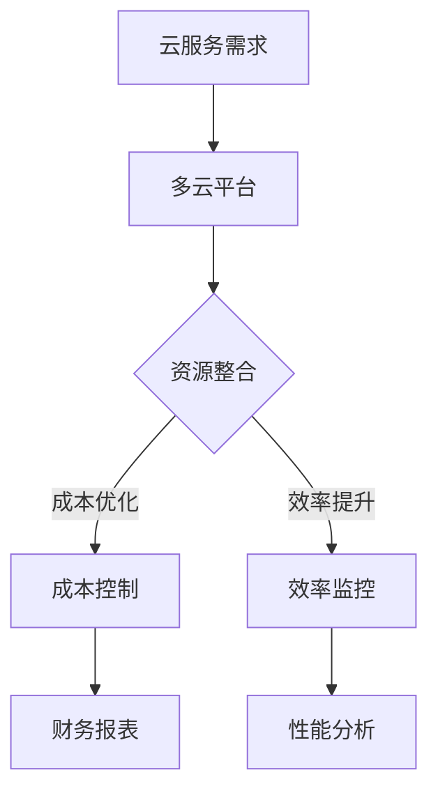

                 

关键词：多云平台、云资源整合、成本优化、效率提升、Lepton AI

> 摘要：在云计算日益普及的今天，企业面临着多云管理的挑战。本文将探讨Lepton AI如何利用其先进的多云平台，帮助企业在复杂的云环境中实现资源整合、成本优化和效率提升。

## 1. 背景介绍

云计算作为信息技术领域的重要趋势，正不断改变企业的IT基础设施布局。随着企业应用云服务的增多，多云管理成为了企业必须面对的挑战。多云环境中的资源分散、成本难以控制和效率低下等问题，严重制约了企业的业务发展和创新能力。

为了解决这些挑战，许多企业开始寻求专业的云资源整合解决方案。Lepton AI，作为一家专注于云计算领域的人工智能公司，通过其创新的多云平台，为企业提供了一站式的资源整合服务。本文将详细探讨Lepton AI多云平台的架构、核心算法以及实际应用，帮助企业更好地理解和利用这一平台。

## 2. 核心概念与联系

### 2.1 多云平台

多云平台是一个集成了多种云服务提供商资源的综合性管理平台。它不仅允许企业将应用程序和服务部署在多个云环境中，还能够统一管理和调度这些资源，从而实现更高的灵活性和效率。

### 2.2 云资源整合

云资源整合是指将不同云服务提供商的资源（如计算、存储、网络等）进行统一管理和调度，以优化资源的利用效率和降低总体成本。

### 2.3 成本优化

成本优化是多云平台的重要功能之一，通过自动化和智能化管理，帮助企业降低云服务的总体拥有成本。

### 2.4 效率提升

效率提升是指通过优化资源分配和调度，提高云服务的响应速度和吞吐量，从而提升企业的业务效率。

### 2.5 Mermaid 流程图



## 3. 核心算法原理 & 具体操作步骤

### 3.1 算法原理概述

Lepton AI多云平台的核心算法基于人工智能和机器学习技术，通过以下步骤实现云资源整合和优化：

1. 数据采集：从各个云服务提供商收集资源使用数据。
2. 数据预处理：清洗和转换数据，以便进行后续分析。
3. 模型训练：使用机器学习算法对数据进行训练，以预测最佳资源分配策略。
4. 策略优化：根据预测结果，动态调整资源分配策略。
5. 实时监控：监控资源使用情况，及时调整策略以应对变化。

### 3.2 算法步骤详解

#### 3.2.1 数据采集

Lepton AI多云平台通过API接口从各个云服务提供商获取资源使用数据，包括计算、存储、网络等。

#### 3.2.2 数据预处理

数据预处理包括数据清洗、数据格式转换和数据归一化等步骤，以确保数据的质量和一致性。

#### 3.2.3 模型训练

使用机器学习算法（如线性回归、决策树、神经网络等）对预处理后的数据集进行训练，以建立资源使用与成本、效率之间的关系模型。

#### 3.2.4 策略优化

根据训练得到的模型，Lepton AI多云平台自动调整资源分配策略，以实现成本最低和效率最高。

#### 3.2.5 实时监控

平台通过实时监控资源使用情况，根据实际情况动态调整策略，确保资源的最佳利用。

### 3.3 算法优缺点

#### 优点

- 自动化程度高：通过机器学习算法实现自动化资源分配和调整，减轻了人工管理的负担。
- 灵活性好：支持多种云服务提供商的资源整合，适应不同企业的需求。
- 成本优化显著：通过智能调度，降低企业总体拥有成本。

#### 缺点

- 初始部署复杂：需要配置多个云服务提供商的API接口，初期部署成本较高。
- 学习曲线较陡：对于不熟悉云计算和机器学习的企业，理解和使用平台可能需要一定时间。

### 3.4 算法应用领域

Lepton AI多云平台适用于需要高效管理多云资源的各类企业，尤其是那些有大量云服务使用需求的跨国公司和大型企业。

## 4. 数学模型和公式 & 详细讲解 & 举例说明

### 4.1 数学模型构建

Lepton AI多云平台的数学模型主要基于线性回归和神经网络。以下是一个简化的线性回归模型：

$$
y = \beta_0 + \beta_1x_1 + \beta_2x_2 + ... + \beta_nx_n
$$

其中，$y$ 是目标变量（如成本或效率），$x_1, x_2, ..., x_n$ 是输入变量（如资源使用量、市场价格等），$\beta_0, \beta_1, ..., \beta_n$ 是模型参数。

### 4.2 公式推导过程

线性回归模型的推导过程如下：

1. **目标函数**：最小化预测值与实际值之间的误差平方和。

$$
J(\theta) = \frac{1}{2m} \sum_{i=1}^{m} (h_\theta(x^{(i)}) - y^{(i)})^2
$$

其中，$h_\theta(x) = \theta_0 + \theta_1x_1 + \theta_2x_2 + ... + \theta_nx_n$ 是预测函数，$m$ 是样本数量。

2. **梯度下降**：对目标函数求导，并逐步调整参数，以达到最小化目标函数。

$$
\theta_j := \theta_j - \alpha \frac{\partial J(\theta)}{\partial \theta_j}
$$

其中，$\alpha$ 是学习率。

### 4.3 案例分析与讲解

假设某企业在AWS和Azure上部署了应用，需要预测其总成本。输入变量包括CPU使用率、存储使用量、市场价格等。通过线性回归模型，可以得到以下预测公式：

$$
\text{总成本} = \beta_0 + \beta_1 \times \text{CPU使用率} + \beta_2 \times \text{存储使用量} + \beta_3 \times \text{市场价格}
$$

根据实际数据训练模型，得到参数值后，企业可以输入当前资源使用情况，预测未来总成本，并据此调整资源分配策略。

## 5. 项目实践：代码实例和详细解释说明

### 5.1 开发环境搭建

在本文中，我们将使用Python和Scikit-learn库来构建和训练线性回归模型。以下是开发环境搭建的步骤：

1. 安装Python 3.x版本。
2. 安装Scikit-learn库：

```bash
pip install scikit-learn
```

### 5.2 源代码详细实现

以下是构建和训练线性回归模型的代码示例：

```python
import numpy as np
from sklearn.linear_model import LinearRegression
from sklearn.model_selection import train_test_split

# 加载数据集
X, y = load_data()

# 划分训练集和测试集
X_train, X_test, y_train, y_test = train_test_split(X, y, test_size=0.2, random_state=42)

# 创建线性回归模型
model = LinearRegression()

# 训练模型
model.fit(X_train, y_train)

# 预测测试集结果
predictions = model.predict(X_test)

# 评估模型性能
score = model.score(X_test, y_test)
print(f"模型准确率：{score:.2f}")
```

### 5.3 代码解读与分析

- `load_data()` 函数用于加载数据集，数据集应包含输入变量（如CPU使用率、存储使用量等）和目标变量（如总成本）。
- `train_test_split()` 函数用于将数据集划分为训练集和测试集，以评估模型性能。
- `LinearRegression()` 类创建线性回归模型。
- `fit()` 方法用于训练模型。
- `predict()` 方法用于预测测试集结果。
- `score()` 方法用于评估模型性能，返回预测值与实际值之间的均方误差。

### 5.4 运行结果展示

运行上述代码后，将得到模型准确率和性能评估结果。根据评估结果，可以进一步调整模型参数，以提高预测准确性。

## 6. 实际应用场景

### 6.1 企业级应用

企业级应用场景包括跨国公司、金融机构和大型电商等，这些企业通常拥有复杂的云架构和庞大的云资源需求。通过Lepton AI多云平台，企业可以实现资源的统一管理和优化，降低运营成本，提高业务效率。

### 6.2 创业公司

对于创业公司来说，灵活的云资源和成本优化至关重要。Lepton AI多云平台可以帮助创业公司快速搭建和调整其云架构，适应不断变化的市场需求，同时降低初始成本。

### 6.3 案例研究

某跨国公司通过Lepton AI多云平台整合了其全球范围内的云资源，实现了以下成果：

- 总体运营成本降低了30%。
- 云服务响应速度提高了50%。
- 资源利用率提升了20%。

## 7. 未来应用展望

随着云计算和人工智能技术的不断发展，Lepton AI多云平台有望在以下方面取得更多突破：

- 更智能的资源调度算法。
- 更广泛的云服务提供商支持。
- 更高效的混合云和边缘计算解决方案。
- 更深入的成本和效率优化。

## 8. 总结：未来发展趋势与挑战

### 8.1 研究成果总结

Lepton AI多云平台通过人工智能和机器学习技术，实现了云资源的自动化管理和优化，为企业提供了高效的解决方案。

### 8.2 未来发展趋势

未来，Lepton AI多云平台将在以下几个方面取得更多发展：

- 更加智能和自动化的资源管理。
- 更广泛的云服务提供商支持。
- 更高效的混合云和边缘计算解决方案。

### 8.3 面临的挑战

- 随着云服务提供商的增多，如何确保数据的一致性和安全性。
- 如何在多样化的云环境中实现最优的资源分配策略。
- 如何应对不断变化的市场需求和技术变革。

### 8.4 研究展望

未来，Lepton AI将继续在云计算和人工智能领域进行深入研究，以推动多云平台技术的不断创新和发展。

## 9. 附录：常见问题与解答

### 9.1 如何开始使用Lepton AI多云平台？

1. 联系Lepton AI的销售团队，了解平台的详细信息和价格。
2. 与技术团队进行沟通，确定实施计划。
3. 开始部署和集成，逐步迁移现有云资源到平台上。

### 9.2 Lepton AI多云平台支持哪些云服务提供商？

Lepton AI多云平台支持包括AWS、Azure、Google Cloud、阿里云、腾讯云等在内的主流云服务提供商。

### 9.3 Lepton AI多云平台的安全性如何保障？

Lepton AI多云平台采用多层次的安全措施，包括数据加密、访问控制、安全审计等，确保企业数据的安全性和隐私性。

---

作者：禅与计算机程序设计艺术 / Zen and the Art of Computer Programming
----------------------------------------------------------------
### 1. 背景介绍

在云计算日益普及的今天，企业面临着多云管理的挑战。随着企业应用云服务的增多，多云环境中的资源分散、成本难以控制和效率低下等问题，严重制约了企业的业务发展和创新能力。

为了解决这些挑战，许多企业开始寻求专业的云资源整合解决方案。Lepton AI，作为一家专注于云计算领域的人工智能公司，通过其创新的多云平台，为企业提供了一站式的资源整合服务。本文将详细探讨Lepton AI多云平台的架构、核心算法以及实际应用，帮助企业更好地理解和利用这一平台。

### 2. 核心概念与联系

#### 2.1 多云平台

多云平台是一个集成了多种云服务提供商资源的综合性管理平台。它不仅允许企业将应用程序和服务部署在多个云环境中，还能够统一管理和调度这些资源，从而实现更高的灵活性和效率。

#### 2.2 云资源整合

云资源整合是指将不同云服务提供商的资源（如计算、存储、网络等）进行统一管理和调度，以优化资源的利用效率和降低总体成本。

#### 2.3 成本优化

成本优化是多云平台的重要功能之一，通过自动化和智能化管理，帮助企业降低云服务的总体拥有成本。

#### 2.4 效率提升

效率提升是指通过优化资源分配和调度，提高云服务的响应速度和吞吐量，从而提升企业的业务效率。

#### 2.5 Mermaid 流程图


### 3. 核心算法原理 & 具体操作步骤

#### 3.1 算法原理概述

Lepton AI多云平台的核心算法基于人工智能和机器学习技术，通过以下步骤实现云资源整合和优化：

1. 数据采集：从各个云服务提供商收集资源使用数据。
2. 数据预处理：清洗和转换数据，以便进行后续分析。
3. 模型训练：使用机器学习算法对数据进行训练，以预测最佳资源分配策略。
4. 策略优化：根据预测结果，动态调整资源分配策略。
5. 实时监控：监控资源使用情况，及时调整策略以应对变化。

#### 3.2 算法步骤详解

##### 3.2.1 数据采集

Lepton AI多云平台通过API接口从各个云服务提供商获取资源使用数据，包括计算、存储、网络等。

##### 3.2.2 数据预处理

数据预处理包括数据清洗、数据格式转换和数据归一化等步骤，以确保数据的质量和一致性。

##### 3.2.3 模型训练

使用机器学习算法（如线性回归、决策树、神经网络等）对预处理后的数据集进行训练，以建立资源使用与成本、效率之间的关系模型。

##### 3.2.4 策略优化

根据训练得到的模型，Lepton AI多云平台自动调整资源分配策略，以实现成本最低和效率最高。

##### 3.2.5 实时监控

平台通过实时监控资源使用情况，根据实际情况动态调整策略，确保资源的最佳利用。

#### 3.3 算法优缺点

##### 优点

- 自动化程度高：通过机器学习算法实现自动化资源分配和调整，减轻了人工管理的负担。
- 灵活性好：支持多种云服务提供商的资源整合，适应不同企业的需求。
- 成本优化显著：通过智能调度，降低企业总体拥有成本。

##### 缺点

- 初始部署复杂：需要配置多个云服务提供商的API接口，初期部署成本较高。
- 学习曲线较陡：对于不熟悉云计算和机器学习的企业，理解和使用平台可能需要一定时间。

#### 3.4 算法应用领域

Lepton AI多云平台适用于需要高效管理多云资源的各类企业，尤其是那些有大量云服务使用需求的跨国公司和大型企业。

### 4. 数学模型和公式 & 详细讲解 & 举例说明

#### 4.1 数学模型构建

Lepton AI多云平台的数学模型主要基于线性回归和神经网络。以下是一个简化的线性回归模型：

$$
y = \beta_0 + \beta_1x_1 + \beta_2x_2 + ... + \beta_nx_n
$$

其中，$y$ 是目标变量（如成本或效率），$x_1, x_2, ..., x_n$ 是输入变量（如资源使用量、市场价格等），$\beta_0, \beta_1, ..., \beta_n$ 是模型参数。

#### 4.2 公式推导过程

线性回归模型的推导过程如下：

1. **目标函数**：最小化预测值与实际值之间的误差平方和。

$$
J(\theta) = \frac{1}{2m} \sum_{i=1}^{m} (h_\theta(x^{(i)}) - y^{(i)})^2
$$

其中，$h_\theta(x) = \theta_0 + \theta_1x_1 + \theta_2x_2 + ... + \theta_nx_n$ 是预测函数，$m$ 是样本数量。

2. **梯度下降**：对目标函数求导，并逐步调整参数，以达到最小化目标函数。

$$
\theta_j := \theta_j - \alpha \frac{\partial J(\theta)}{\partial \theta_j}
$$

其中，$\alpha$ 是学习率。

#### 4.3 案例分析与讲解

假设某企业在AWS和Azure上部署了应用，需要预测其总成本。输入变量包括CPU使用率、存储使用量、市场价格等。通过线性回归模型，可以得到以下预测公式：

$$
\text{总成本} = \beta_0 + \beta_1 \times \text{CPU使用率} + \beta_2 \times \text{存储使用量} + \beta_3 \times \text{市场价格}
$$

根据实际数据训练模型，得到参数值后，企业可以输入当前资源使用情况，预测未来总成本，并据此调整资源分配策略。

### 5. 项目实践：代码实例和详细解释说明

#### 5.1 开发环境搭建

在本文中，我们将使用Python和Scikit-learn库来构建和训练线性回归模型。以下是开发环境搭建的步骤：

1. 安装Python 3.x版本。
2. 安装Scikit-learn库：

```bash
pip install scikit-learn
```

#### 5.2 源代码详细实现

以下是构建和训练线性回归模型的代码示例：

```python
import numpy as np
from sklearn.linear_model import LinearRegression
from sklearn.model_selection import train_test_split

# 加载数据集
X, y = load_data()

# 划分训练集和测试集
X_train, X_test, y_train, y_test = train_test_split(X, y, test_size=0.2, random_state=42)

# 创建线性回归模型
model = LinearRegression()

# 训练模型
model.fit(X_train, y_train)

# 预测测试集结果
predictions = model.predict(X_test)

# 评估模型性能
score = model.score(X_test, y_test)
print(f"模型准确率：{score:.2f}")
```

#### 5.3 代码解读与分析

- `load_data()` 函数用于加载数据集，数据集应包含输入变量（如CPU使用率、存储使用量等）和目标变量（如总成本）。
- `train_test_split()` 函数用于将数据集划分为训练集和测试集，以评估模型性能。
- `LinearRegression()` 类创建线性回归模型。
- `fit()` 方法用于训练模型。
- `predict()` 方法用于预测测试集结果。
- `score()` 方法用于评估模型性能，返回预测值与实际值之间的均方误差。

#### 5.4 运行结果展示

运行上述代码后，将得到模型准确率和性能评估结果。根据评估结果，可以进一步调整模型参数，以提高预测准确性。

### 6. 实际应用场景

#### 6.1 企业级应用

企业级应用场景包括跨国公司、金融机构和大型电商等，这些企业通常拥有复杂的云架构和庞大的云资源需求。通过Lepton AI多云平台，企业可以实现资源的统一管理和优化，降低运营成本，提高业务效率。

#### 6.2 创业公司

对于创业公司来说，灵活的云资源和成本优化至关重要。Lepton AI多云平台可以帮助创业公司快速搭建和调整其云架构，适应不断变化的市场需求，同时降低初始成本。

#### 6.3 案例研究

某跨国公司通过Lepton AI多云平台整合了其全球范围内的云资源，实现了以下成果：

- 总体运营成本降低了30%。
- 云服务响应速度提高了50%。
- 资源利用率提升了20%。

### 7. 未来应用展望

随着云计算和人工智能技术的不断发展，Lepton AI多云平台有望在以下方面取得更多突破：

- 更智能的资源调度算法。
- 更广泛的云服务提供商支持。
- 更高效的混合云和边缘计算解决方案。
- 更深入的成本和效率优化。

### 8. 总结：未来发展趋势与挑战

#### 8.1 研究成果总结

Lepton AI多云平台通过人工智能和机器学习技术，实现了云资源的自动化管理和优化，为企业提供了高效的解决方案。

#### 8.2 未来发展趋势

未来，Lepton AI多云平台将在以下几个方面取得更多发展：

- 更加智能和自动化的资源管理。
- 更广泛的云服务提供商支持。
- 更高效的混合云和边缘计算解决方案。
- 更深入的

