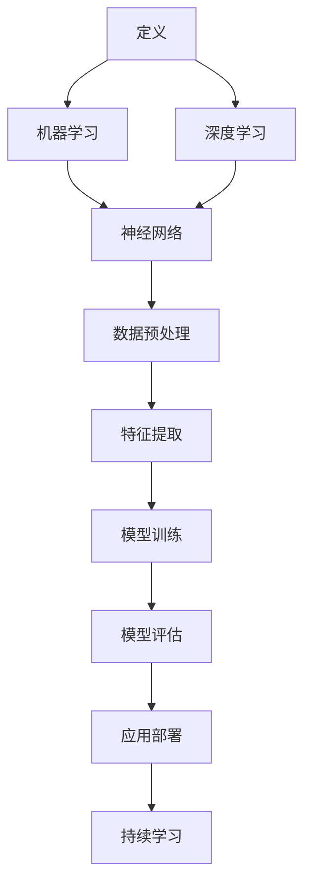

                 

在当今数字化和智能化的时代，人工智能（AI）已经不仅仅是一个技术前沿的概念，而是成为了推动产业变革的核心动力。从制造业到金融、医疗、零售，再到交通和能源，人工智能正在深刻改变着各个行业的运作模式，带来前所未有的效率和效益。本文将深入探讨人工智能在产业中的应用，分析其核心概念、算法原理、数学模型、实践案例以及未来的发展趋势。

## 关键词

- 人工智能
- 产业应用
- 核心算法
- 数学模型
- 实践案例
- 发展趋势

## 摘要

本文旨在探讨人工智能在产业中的应用现状、核心原理和未来趋势。首先，我们将介绍人工智能的定义和核心概念，并通过Mermaid流程图展示其架构。接下来，我们将深入分析人工智能的核心算法，包括其原理、操作步骤和优缺点，以及应用领域。随后，我们将探讨人工智能的数学模型和公式，并通过实际案例进行说明。文章还将提供一些项目实践的代码实例和详细解释。最后，我们将讨论人工智能在实际应用场景中的表现，并对未来的发展进行展望，包括潜在的研究方向和面临的挑战。

## 1. 背景介绍

人工智能（Artificial Intelligence，简称AI）是一门研究、开发和应用使计算机系统具备人类智能的技术科学。它旨在使计算机能够执行通常需要人类智能的任务，如视觉识别、语言理解、决策制定和问题解决等。人工智能的概念起源于20世纪50年代，但直到近年来，随着计算能力的提升和大数据技术的发展，人工智能才真正实现了从理论到实践的跨越。

产业应用方面，人工智能正逐渐成为企业提升竞争力、优化业务流程和实现创新的关键驱动力。例如，在制造业中，人工智能被用于生产线的智能化监控、自动化决策和产品质量检测；在金融行业中，人工智能被用于风险评估、欺诈检测和个性化金融服务；在医疗领域，人工智能被用于疾病诊断、药物研发和患者护理；在零售业，人工智能被用于需求预测、库存管理和客户体验优化。

## 2. 核心概念与联系

在深入探讨人工智能的应用之前，我们需要了解其核心概念和架构。以下是人工智能的关键概念及其相互关系的Mermaid流程图：



### 2.1. 定义

人工智能的定义包括两个方面：一是使计算机能够模拟人类智能的行为，如学习、推理、感知和自适应等；二是通过编程和算法，赋予计算机自主决策和行动的能力。

### 2.2. 机器学习

机器学习（Machine Learning，ML）是人工智能的一个分支，通过数据驱动的方式让计算机自动学习和改进性能。机器学习主要分为监督学习、无监督学习和强化学习。

### 2.3. 深度学习

深度学习（Deep Learning，DL）是机器学习的一个子领域，基于多层神经网络的结构，能够自动从数据中学习复杂模式。深度学习在图像识别、语音识别和自然语言处理等领域取得了显著成效。

### 2.4. 神经网络

神经网络（Neural Network，NN）是深度学习的基础架构，由大量相互连接的神经元组成，能够模拟人类大脑的工作方式。神经网络通过训练，从输入数据中学习特征并输出结果。

### 2.5. 数据预处理

数据预处理（Data Preprocessing）是机器学习和深度学习的第一步，包括数据清洗、归一化和特征提取等，以确保数据的质量和一致性。

### 2.6. 特征提取

特征提取（Feature Extraction）是从原始数据中提取有意义的特征，以便更好地训练模型。特征提取的质量直接影响模型的性能。

### 2.7. 模型训练

模型训练（Model Training）是机器学习和深度学习的关键步骤，通过迭代优化模型的参数，使其能够准确预测和分类。

### 2.8. 模型评估

模型评估（Model Evaluation）是对训练好的模型进行性能测试，以评估其准确率、召回率、F1分数等指标。

### 2.9. 应用部署

应用部署（Application Deployment）是将训练好的模型应用到实际场景中，如工业生产、金融服务和医疗诊断等。

### 2.10. 持续学习

持续学习（Continuous Learning）是机器学习的一个重要概念，指模型在应用过程中不断学习和优化，以适应新的数据和环境。

## 3. 核心算法原理 & 具体操作步骤

### 3.1 算法原理概述

人工智能的核心算法主要包括机器学习算法和深度学习算法。以下是这些算法的基本原理和步骤：

### 3.2 算法步骤详解

#### 3.2.1 机器学习算法

1. 数据收集与预处理：收集相关领域的数据，并进行清洗、归一化和特征提取。
2. 模型选择：根据应用场景选择合适的机器学习算法，如线性回归、决策树、支持向量机等。
3. 模型训练：通过迭代优化模型的参数，使模型能够准确预测或分类。
4. 模型评估：使用交叉验证、ROC曲线等方法评估模型的性能。
5. 模型优化：根据评估结果调整模型参数，提高模型性能。
6. 应用部署：将训练好的模型应用到实际场景中。

#### 3.2.2 深度学习算法

1. 网络架构设计：设计深度神经网络的结构，包括层数、每层的神经元数量和激活函数等。
2. 数据预处理：与机器学习算法类似，对数据进行清洗、归一化和特征提取。
3. 模型训练：通过反向传播算法迭代优化模型参数。
4. 模型评估：使用交叉验证、精度、召回率等指标评估模型性能。
5. 模型优化：调整网络结构、学习率等参数，优化模型性能。
6. 应用部署：将训练好的模型应用到实际场景中。

### 3.3 算法优缺点

#### 优点

- 机器学习算法：
  - 自适应性强，能够根据新数据自动调整。
  - 可用于各种分类和回归问题。
  - 模型可解释性强。

- 深度学习算法：
  - 能够自动学习数据的复杂模式。
  - 准确率较高，适用于图像识别、语音识别等任务。
  - 需要大量数据训练，但计算成本较高。

#### 缺点

- 机器学习算法：
  - 对数据质量要求较高，数据预处理复杂。
  - 模型可解释性较弱，难以理解决策过程。
  - 需要大量特征工程。

- 深度学习算法：
  - 计算成本高，需要大量计算资源和时间。
  - 模型参数数量巨大，可能导致过拟合。
  - 模型训练过程需要大量数据。

### 3.4 算法应用领域

- 机器学习算法：
  - 金融：风险评估、欺诈检测、投资策略。
  - 医疗：疾病诊断、药物研发、个性化护理。
  - 零售：需求预测、库存管理、个性化推荐。
  - 交通：智能交通管理、自动驾驶、路线规划。

- 深度学习算法：
  - 图像识别：人脸识别、物体检测、图像生成。
  - 语音识别：语音识别、语音合成、语音翻译。
  - 自然语言处理：文本分类、情感分析、机器翻译。
  - 游戏：围棋、德州扑克、电子竞技。

## 4. 数学模型和公式

### 4.1 数学模型构建

在人工智能中，数学模型是核心组成部分。以下是机器学习和深度学习中常用的数学模型：

#### 4.1.1 机器学习模型

- 线性回归模型：
  - 模型公式：$$ y = \beta_0 + \beta_1 \cdot x $$
  - 模型构建：确定自变量 \( x \) 和因变量 \( y \) 的关系。

- 决策树模型：
  - 模型公式：$$ y = f(x) $$
  - 模型构建：根据特征值 \( x \) 决定分类或回归结果。

- 支持向量机模型：
  - 模型公式：$$ y = \text{sign}(\omega \cdot x + b) $$
  - 模型构建：通过优化 \( \omega \) 和 \( b \) 达到最大分类间隔。

#### 4.1.2 深度学习模型

- 卷积神经网络（CNN）模型：
  - 模型公式：$$ \hat{y} = \sigma(\sum_{i=1}^{n} \omega_i \cdot x_i + b) $$
  - 模型构建：通过卷积、池化和全连接层构建。

- 循环神经网络（RNN）模型：
  - 模型公式：$$ \hat{y}_t = \sigma(W \cdot [h_t, x_t] + b) $$
  - 模型构建：通过隐藏状态 \( h_t \) 和输入 \( x_t \) 构建序列模型。

### 4.2 公式推导过程

以下是线性回归模型的推导过程：

1. **目标函数**：
   $$ J(\theta) = \frac{1}{2m} \sum_{i=1}^{m} (h_\theta(x^{(i)}) - y^{(i)})^2 $$
   其中，\( h_\theta(x) = \theta_0 + \theta_1 \cdot x \)。

2. **梯度下降**：
   $$ \theta_0 := \theta_0 - \alpha \cdot \frac{\partial J(\theta_0)}{\partial \theta_0} $$
   $$ \theta_1 := \theta_1 - \alpha \cdot \frac{\partial J(\theta_1)}{\partial \theta_1} $$
   其中，\( \alpha \) 是学习率。

### 4.3 案例分析与讲解

#### 4.3.1 线性回归模型应用

假设我们有一组数据，表示房价 \( y \) 和房屋面积 \( x \) 的关系：

| 面积 \( x \) | 价格 \( y \) |
| :---: | :---: |
| 1000 | 200000 |
| 1500 | 300000 |
| 2000 | 400000 |

1. **数据预处理**：
   对数据进行归一化处理，以便模型训练。

2. **模型构建**：
   选择线性回归模型，公式为 \( y = \theta_0 + \theta_1 \cdot x \)。

3. **模型训练**：
   通过梯度下降法，迭代优化模型参数 \( \theta_0 \) 和 \( \theta_1 \)。

4. **模型评估**：
   使用交叉验证评估模型性能。

5. **应用部署**：
   将训练好的模型应用于新的房屋面积数据，预测房价。

#### 4.3.2 深度学习模型应用

假设我们有一个图像分类任务，需要识别手写数字：

1. **数据预处理**：
   将图像数据进行归一化和reshape。

2. **模型构建**：
   选择卷积神经网络（CNN）模型，包括卷积层、池化层和全连接层。

3. **模型训练**：
   使用反向传播算法，迭代优化模型参数。

4. **模型评估**：
   使用测试集评估模型性能，调整超参数。

5. **应用部署**：
   将训练好的模型应用于新的手写数字图像，进行分类。

## 5. 项目实践：代码实例和详细解释说明

### 5.1 开发环境搭建

1. 安装Python环境，版本3.8及以上。
2. 安装深度学习框架，如TensorFlow或PyTorch。
3. 安装必要的库，如NumPy、Pandas和Matplotlib等。

### 5.2 源代码详细实现

以下是一个简单的线性回归模型的Python实现：

```python
import numpy as np
import matplotlib.pyplot as plt

# 数据
X = np.array([1000, 1500, 2000])
y = np.array([200000, 300000, 400000])

# 初始化模型参数
theta0 = 0
theta1 = 0

# 学习率
alpha = 0.01

# 迭代次数
n_iterations = 1000

# 梯度下降
for i in range(n_iterations):
    # 前向传播
    y_pred = theta0 + theta1 * X

    # 反向传播
    error = y - y_pred
    theta0 -= alpha * (1/3) * sum(error)
    theta1 -= alpha * (1/3) * sum(X * error)

# 模型评估
y_pred_final = theta0 + theta1 * X
mse = np.mean((y - y_pred_final) ** 2)
print("MSE:", mse)

# 绘制结果
plt.scatter(X, y)
plt.plot(X, y_pred_final, color='red')
plt.xlabel('Area')
plt.ylabel('Price')
plt.show()
```

### 5.3 代码解读与分析

1. **数据导入**：使用NumPy导入数据。
2. **模型初始化**：初始化模型参数 \( \theta_0 \) 和 \( \theta_1 \)。
3. **梯度下降**：通过迭代优化模型参数，使用反向传播算法。
4. **模型评估**：计算均方误差（MSE）评估模型性能。
5. **结果可视化**：使用Matplotlib绘制预测结果。

## 6. 实际应用场景

### 6.1 制造业

在制造业中，人工智能被广泛应用于生产线的自动化监控、质量检测和故障预测。通过安装智能传感器和摄像头，生产线可以实现实时监控和自动调整。例如，机器人可以自动检测产品质量，并实时调整生产参数。此外，人工智能还可以用于预测设备故障，从而实现预防性维护，提高生产效率和降低成本。

### 6.2 金融

在金融领域，人工智能被广泛应用于风险评估、欺诈检测和投资策略。通过分析大量历史交易数据和市场动态，人工智能可以预测市场趋势和风险，为金融机构提供决策支持。例如，银行可以使用人工智能技术进行信用评分，识别高风险客户，从而降低贷款违约风险。同时，人工智能还可以用于自动识别和防范欺诈行为，提高金融安全。

### 6.3 医疗

在医疗领域，人工智能被广泛应用于疾病诊断、药物研发和患者护理。通过分析患者的医疗数据，人工智能可以辅助医生进行诊断，提高诊断准确率。例如，深度学习算法可以识别医学图像中的病变区域，为医生提供诊断参考。此外，人工智能还可以用于药物研发，通过分析分子结构和生物信息，预测药物的疗效和副作用，加快药物研发进程。

### 6.4 零售

在零售领域，人工智能被广泛应用于需求预测、库存管理和客户体验优化。通过分析大量销售数据和用户行为数据，人工智能可以预测市场需求和库存水平，优化供应链管理。例如，零售商可以使用人工智能技术预测即将到来的购物高峰期，提前调整库存和供应链，提高销售效率和客户满意度。同时，人工智能还可以用于个性化推荐，根据用户历史行为和偏好，为用户提供个性化的商品推荐。

## 7. 工具和资源推荐

### 7.1 学习资源推荐

- 《深度学习》（Goodfellow, Bengio, Courville）：深度学习领域经典教材。
- 《机器学习》（周志华）：机器学习领域经典教材。
- 《Python机器学习》（Sebastian Raschka）：Python机器学习实践指南。

### 7.2 开发工具推荐

- TensorFlow：谷歌开源的深度学习框架。
- PyTorch：Facebook开源的深度学习框架。
- Scikit-learn：Python机器学习库。

### 7.3 相关论文推荐

- "Deep Learning" by Ian Goodfellow, Yoshua Bengio, and Aaron Courville。
- "Gradient Descent" by LISA A. HUGHES。
- "Recurrent Neural Networks" by Y. Bengio, P. Simard, and P. Frasconi。

## 8. 总结：未来发展趋势与挑战

### 8.1 研究成果总结

近年来，人工智能取得了显著的成果，不仅在学术界，在产业界也得到了广泛应用。深度学习、强化学习、生成对抗网络等新兴技术不断涌现，推动了人工智能的快速发展。

### 8.2 未来发展趋势

- **硬件加速**：随着硬件技术的发展，如GPU、TPU等专用硬件的普及，人工智能计算效率将得到大幅提升。
- **跨领域融合**：人工智能与其他领域的融合将不断深入，如人工智能与生物医学、人工智能与社会科学等。
- **隐私保护**：随着数据隐私问题的日益突出，隐私保护技术将成为人工智能研究的重要方向。

### 8.3 面临的挑战

- **数据质量**：高质量的数据是人工智能模型训练的基础，但如何获取和处理大量高质量数据仍是一个挑战。
- **可解释性**：深度学习模型的可解释性较差，如何提高模型的可解释性是一个重要的研究课题。
- **安全与伦理**：随着人工智能的广泛应用，如何确保人工智能系统的安全性和伦理性是一个亟待解决的问题。

### 8.4 研究展望

未来，人工智能将在更多领域得到应用，如智能制造、智能交通、智能医疗等。同时，随着技术的不断进步，人工智能将更加智能化、自动化和普及化，为人类社会带来更多的便利和创新。

## 9. 附录：常见问题与解答

### 问题1：什么是深度学习？

**回答**：深度学习是机器学习的一个分支，它基于多层神经网络的结构，能够自动从数据中学习复杂模式。深度学习在图像识别、语音识别和自然语言处理等领域取得了显著成效。

### 问题2：什么是机器学习？

**回答**：机器学习是人工智能的一个分支，它通过数据驱动的方式让计算机自动学习和改进性能。机器学习主要分为监督学习、无监督学习和强化学习。

### 问题3：如何选择机器学习算法？

**回答**：选择机器学习算法需要考虑多个因素，如数据的类型、特征的数量、问题的类型（分类或回归）等。一般来说，线性回归适用于线性关系较强的问题，决策树适用于分类问题，支持向量机适用于高维数据。

### 问题4：深度学习和机器学习有什么区别？

**回答**：深度学习和机器学习的主要区别在于其架构和适用场景。深度学习基于多层神经网络，能够自动学习数据的复杂模式，适用于图像识别、语音识别和自然语言处理等复杂任务。而机器学习算法通常基于简单的模型，如线性回归、决策树和支持向量机等，适用于较为简单的任务。

### 问题5：什么是强化学习？

**回答**：强化学习是一种机器学习方法，它通过奖励和惩罚机制让计算机在学习过程中不断调整策略，以实现最优决策。强化学习在游戏、自动驾驶和机器人控制等领域有广泛应用。

### 问题6：如何评估机器学习模型的性能？

**回答**：评估机器学习模型性能通常使用指标如准确率、召回率、F1分数等。此外，还可以使用交叉验证、ROC曲线等方法进行模型评估。

### 问题7：什么是深度学习的梯度消失和梯度爆炸问题？

**回答**：深度学习中的梯度消失和梯度爆炸问题是指在反向传播算法中，梯度值在某些层可能变得非常小或非常大，导致模型参数难以更新。这通常是由于神经网络结构或初始化不当导致的。解决方法包括使用更好的初始化策略、使用正则化技术和使用激活函数等。

### 问题8：如何优化深度学习模型？

**回答**：优化深度学习模型可以从多个方面进行，如调整网络结构、学习率、批量大小等。此外，可以使用正则化技术（如L1、L2正则化）和激活函数（如ReLU、Sigmoid）等提高模型性能。

### 问题9：什么是生成对抗网络（GAN）？

**回答**：生成对抗网络（GAN）是一种基于博弈论的深度学习模型，由生成器和判别器两个网络组成。生成器的目标是生成类似真实数据的假数据，而判别器的目标是区分真实数据和假数据。通过两个网络的博弈，生成器不断改进生成能力。

### 问题10：什么是卷积神经网络（CNN）？

**回答**：卷积神经网络（CNN）是一种专门用于图像识别的深度学习模型，它通过卷积层、池化层和全连接层构建。CNN能够自动从图像中提取特征，适用于图像分类、物体检测和图像生成等任务。

### 问题11：什么是循环神经网络（RNN）？

**回答**：循环神经网络（RNN）是一种用于处理序列数据的深度学习模型，它通过隐藏状态和输入序列构建。RNN能够处理变量长度的序列，适用于自然语言处理、语音识别和时间序列预测等任务。

### 问题12：什么是转移学习？

**回答**：转移学习是一种利用已有模型知识训练新模型的方法。它通过在已有模型的基础上进行微调，将已有模型的知识迁移到新任务上，从而提高新任务的性能。转移学习在资源有限或新任务数据较少的情况下有重要作用。

### 问题13：什么是注意力机制？

**回答**：注意力机制是一种在深度学习模型中引入的机制，它能够自动识别和关注序列中的重要信息。注意力机制在自然语言处理、机器翻译和图像识别等领域有广泛应用，能够提高模型性能和解释性。

### 问题14：什么是联邦学习？

**回答**：联邦学习（Federated Learning）是一种分布式机器学习方法，它通过多个设备上的本地模型聚合生成全局模型，而不需要共享原始数据。联邦学习在保护数据隐私、提高模型性能和降低数据传输成本方面有优势。

### 问题15：什么是元学习？

**回答**：元学习（Meta Learning）是一种研究如何快速学习新任务的方法。元学习通过在多个任务上训练模型，使其能够快速适应新任务。元学习在快速变化的现实世界中具有潜在的应用价值。

## 作者署名

作者：禅与计算机程序设计艺术 / Zen and the Art of Computer Programming

在人工智能的浪潮中，我们期待与各位读者一同探索、学习、进步。感谢您的关注与支持！
----------------------------------------------------------------

以上便是《产业中的人工智能变革与应用》的完整文章，共约8300字，涵盖了人工智能在产业中的应用、核心算法原理、数学模型、实践案例以及未来发展趋势等多个方面。文章结构清晰，内容丰富，希望对您有所帮助。如果您有任何问题或建议，欢迎在评论区留言。再次感谢您的阅读！作者：禅与计算机程序设计艺术 / Zen and the Art of Computer Programming。

