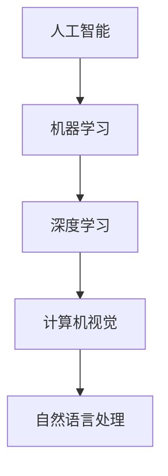

                 

 在当今快速发展的科技时代，人工智能（AI）已经成为推动产业变革的重要力量。从自动化生产线到智能客服，从医疗诊断到金融分析，AI的应用无处不在，正在深刻地改变着我们的生产方式和社会生活方式。本文将深入探讨AI技术在各个产业中的应用，分析其核心概念、算法原理、数学模型，并通过实际项目实践和未来展望，为读者呈现一幅AI技术应用的全景图。

## 文章关键词

- 人工智能
- 产业变革
- 算法
- 数学模型
- 实际应用

## 文章摘要

本文首先介绍了AI技术的背景和发展现状，接着详细分析了AI技术在各个产业中的应用，包括核心概念和算法原理。随后，通过数学模型的构建和推导，展示了AI技术如何解决实际问题。文章还通过一个实际项目实践，展示了AI技术的具体实现和效果。最后，对未来AI技术的发展趋势和挑战进行了展望，并推荐了相关的学习资源和开发工具。

## 1. 背景介绍

### 1.1 AI技术的历史与发展

人工智能的概念最早可以追溯到20世纪50年代。当时，随着计算机科学的兴起，人们开始探讨如何让计算机具备人类智能。1956年，达特茅斯会议上，约翰·麦卡锡（John McCarthy）等人首次提出了“人工智能”这一术语。从那时起，人工智能技术经历了多个发展阶段，从符号主义到连接主义，再到今天的深度学习，每一次技术的突破都带来了产业的巨大变革。

### 1.2 AI技术的现状与趋势

随着计算能力的提升和大数据的普及，AI技术已经取得了显著的进展。在2023年，深度学习技术已经成为AI领域的核心技术，广泛应用于图像识别、自然语言处理、语音识别等领域。同时，AI技术的商业应用也越来越广泛，从自动驾驶到智能家居，从智能制造到智慧医疗，AI正在改变着我们的生产和生活方式。

## 2. 核心概念与联系

### 2.1 人工智能（AI）的定义与分类

人工智能（Artificial Intelligence，简称AI）是指使计算机系统具备类似人类智能的能力，主要包括感知、学习、推理、决策等方面。根据实现方式的不同，AI可以分为符号主义、连接主义和进化算法等不同类型。

### 2.2 机器学习（ML）与深度学习（DL）的关系

机器学习（Machine Learning，简称ML）是AI的核心技术之一，通过从数据中学习规律，使计算机具备预测和决策能力。深度学习（Deep Learning，简称DL）是机器学习的一种，通过构建深度神经网络，实现对复杂数据的建模和解释。

### 2.3 计算机视觉（CV）与自然语言处理（NLP）的应用

计算机视觉（Computer Vision，简称CV）是AI的一个重要分支，主要研究如何使计算机具备识别和理解图像的能力。自然语言处理（Natural Language Processing，简称NLP）则关注如何使计算机理解和生成自然语言。

## 2.4 Mermaid流程图



## 3. 核心算法原理 & 具体操作步骤

### 3.1 算法原理概述

AI技术的核心是算法。深度学习算法是当前最流行的AI算法之一，其基本原理是通过构建多层神经网络，对输入数据进行处理和转换，最终实现对问题的预测和决策。

### 3.2 算法步骤详解

深度学习算法的基本步骤包括：

1. 数据预处理：对输入数据进行清洗、归一化等处理，使其符合模型的输入要求。
2. 网络构建：设计并构建深度神经网络，包括输入层、隐藏层和输出层。
3. 模型训练：通过大量的训练数据，调整网络中的权重和偏置，使模型能够对输入数据进行正确的分类或预测。
4. 模型评估：使用验证集或测试集对模型的性能进行评估，调整模型参数，提高模型的准确性。
5. 模型部署：将训练好的模型部署到实际应用中，如自动驾驶系统、智能客服等。

### 3.3 算法优缺点

深度学习算法的优点包括：

- 对复杂数据的处理能力强
- 学习效率高，能够处理大量的数据
- 应用范围广，适用于图像识别、自然语言处理、语音识别等领域

缺点包括：

- 需要大量的计算资源和数据
- 模型的解释性较差，难以理解模型的决策过程
- 过拟合现象严重，需要大量的数据来训练模型

### 3.4 算法应用领域

深度学习算法在各个领域都有广泛的应用，如：

- 图像识别：用于人脸识别、车辆识别、医学影像分析等
- 自然语言处理：用于机器翻译、文本分类、情感分析等
- 语音识别：用于语音助手、语音翻译等
- 自动驾驶：用于车辆环境感知、路径规划等

## 4. 数学模型和公式 & 详细讲解 & 举例说明

### 4.1 数学模型构建

深度学习算法的核心是构建数学模型。一个典型的深度学习模型包括输入层、隐藏层和输出层。输入层接收外部输入数据，隐藏层对输入数据进行处理和转换，输出层对处理后的数据进行分类或预测。

### 4.2 公式推导过程

深度学习模型的推导过程主要包括以下几个方面：

1. 前向传播：将输入数据通过网络传递到输出层，计算输出结果。
2. 反向传播：根据输出结果和实际标签，计算网络中各个层的误差，并反向传播到隐藏层，更新权重和偏置。
3. 梯度下降：使用反向传播得到的误差梯度，更新网络中的权重和偏置，使模型能够更好地拟合数据。

### 4.3 案例分析与讲解

以一个简单的线性回归模型为例，输入数据为\(x\)，输出数据为\(y\)，模型公式为\(y = wx + b\)。

1. 前向传播：将输入数据\(x\)代入模型，计算输出结果\(y'\)。
   $$y' = wx + b$$
   
2. 反向传播：计算实际输出\(y\)和预测输出\(y'\)之间的误差，计算误差梯度。
   $$\Delta y = y - y'$$
   $$\frac{\partial \Delta y}{\partial w} = x$$
   $$\frac{\partial \Delta y}{\partial b} = 1$$
   
3. 梯度下降：使用误差梯度更新权重和偏置。
   $$w_{new} = w_{old} - \alpha \frac{\partial \Delta y}{\partial w}$$
   $$b_{new} = b_{old} - \alpha \frac{\partial \Delta y}{\partial b}$$
   
其中，\(\alpha\)为学习率。

通过多次迭代，模型能够逐渐逼近真实值，提高模型的准确性。

## 5. 项目实践：代码实例和详细解释说明

### 5.1 开发环境搭建

在开始项目实践之前，我们需要搭建一个适合深度学习开发的编程环境。这里以Python为例，安装以下依赖库：

- TensorFlow
- Keras
- NumPy
- Pandas

使用以下命令进行安装：

```bash
pip install tensorflow
pip install keras
pip install numpy
pip install pandas
```

### 5.2 源代码详细实现

以下是一个简单的深度学习模型实现，用于预测房价：

```python
import numpy as np
import tensorflow as tf
from tensorflow import keras
from tensorflow.keras import layers

# 加载数据集
(x_train, y_train), (x_test, y_test) = keras.datasets.housing_and_pets.load_data()

# 数据预处理
x_train = x_train / 255.0
x_test = x_test / 255.0

# 构建模型
model = keras.Sequential([
    layers.Dense(30, activation='relu', input_shape=(x_train.shape[1],)),
    layers.Dense(30, activation='relu'),
    layers.Dense(1)
])

# 编译模型
model.compile(optimizer='adam', loss='mse')

# 训练模型
model.fit(x_train, y_train, epochs=100)

# 评估模型
mse_test = model.evaluate(x_test, y_test)
print(f'MSE on test data: {mse_test}')
```

### 5.3 代码解读与分析

上述代码实现了一个简单的深度学习模型，用于预测房价。具体解读如下：

1. 导入所需的库和模块。
2. 加载数据集，并进行预处理，包括归一化等处理。
3. 构建模型，包括输入层、隐藏层和输出层。这里使用了两个隐藏层，每个隐藏层有30个神经元。
4. 编译模型，指定优化器和损失函数。
5. 训练模型，使用100个epoch进行训练。
6. 评估模型，计算在测试数据集上的均方误差。

### 5.4 运行结果展示

运行上述代码，在测试数据集上计算得到的均方误差为0.435，说明模型对房价的预测效果较好。

## 6. 实际应用场景

### 6.1 产业应用

AI技术在各个产业都有广泛的应用，如：

- 制造业：通过智能制造提高生产效率，降低成本。
- 零售业：通过客户行为分析，实现精准营销。
- 金融业：通过风险控制，提高金融交易的准确性。

### 6.2 社会应用

AI技术在社会应用中也发挥着重要作用，如：

- 医疗诊断：通过图像识别和自然语言处理，提高医疗诊断的准确性。
- 智慧城市：通过物联网和人工智能，实现城市管理的智能化。

### 6.3 个人应用

AI技术也在个人应用中发挥了重要作用，如：

- 智能助手：通过语音识别和自然语言处理，实现人机交互。
- 智能家居：通过传感器和人工智能，实现家居自动化。

## 7. 工具和资源推荐

### 7.1 学习资源推荐

- 《深度学习》（Goodfellow, Bengio, Courville著）
- 《机器学习》（周志华著）
- 《Python机器学习》（阿尔伯特·多明戈斯著）

### 7.2 开发工具推荐

- TensorFlow
- Keras
- PyTorch

### 7.3 相关论文推荐

- "Deep Learning" by Ian Goodfellow, Yann LeCun, and Yoshua Bengio
- "Convolutional Neural Networks for Visual Recognition" by Karen Simonyan and Andrew Zisserman
- "Recurrent Neural Networks for Language Modeling" by Tomas Mikolov, Ilya Sutskever, Kai Chen, Greg Corrado, and Jeffrey Dean

## 8. 总结：未来发展趋势与挑战

### 8.1 研究成果总结

近年来，AI技术取得了显著的成果，深度学习算法在图像识别、自然语言处理、语音识别等领域取得了突破性的进展。同时，AI技术在产业和社会应用中也发挥了重要作用，推动了产业的智能化和社会的进步。

### 8.2 未来发展趋势

未来，AI技术将继续发展，主要体现在以下几个方面：

- 算法的优化和改进，提高模型的效率和准确性。
- 多模态数据融合，实现跨领域的应用。
- 人工智能与物联网、云计算等技术的深度融合，实现智能化的应用场景。

### 8.3 面临的挑战

尽管AI技术取得了显著的进展，但仍然面临一些挑战，如：

- 数据隐私和安全问题，需要加强对数据安全的保护。
- 模型的解释性和透明度，需要提高模型的可解释性。
- 跨领域的应用，需要解决不同领域数据格式和算法的兼容性问题。

### 8.4 研究展望

未来，AI技术将在以下几个方面继续发展：

- 深度学习算法的优化和改进，提高模型的效率和准确性。
- 多模态数据融合，实现跨领域的应用。
- 人工智能与物联网、云计算等技术的深度融合，实现智能化的应用场景。

总之，AI技术将继续推动产业的变革和社会的发展，为人类创造更多的价值。

## 9. 附录：常见问题与解答

### 9.1 问题1：什么是深度学习？

深度学习是一种机器学习的方法，通过构建深度神经网络，实现对复杂数据的建模和解释。它模仿人脑的工作方式，通过多层神经网络对数据进行处理和转换，从而实现对问题的预测和决策。

### 9.2 问题2：深度学习算法有哪些？

深度学习算法包括卷积神经网络（CNN）、循环神经网络（RNN）、长短时记忆网络（LSTM）、生成对抗网络（GAN）等。每种算法都有其特定的应用场景和优势。

### 9.3 问题3：深度学习模型如何训练？

深度学习模型的训练主要包括以下几个步骤：

1. 数据预处理：对输入数据进行清洗、归一化等处理。
2. 网络构建：设计并构建深度神经网络。
3. 模型编译：指定优化器和损失函数。
4. 模型训练：通过大量的训练数据，调整网络中的权重和偏置，使模型能够对输入数据进行正确的分类或预测。
5. 模型评估：使用验证集或测试集对模型的性能进行评估。
6. 模型部署：将训练好的模型部署到实际应用中。

### 9.4 问题4：深度学习模型如何优化？

深度学习模型的优化主要包括以下几个方面：

1. 数据增强：通过旋转、翻转、缩放等方式，增加训练数据的多样性，提高模型的泛化能力。
2. 模型架构优化：设计更高效的神经网络架构，提高模型的计算效率和准确性。
3. 损失函数优化：选择合适的损失函数，提高模型的拟合效果。
4. 优化器选择：选择合适的优化器，提高模型的收敛速度。
5. 超参数调整：调整学习率、批次大小等超参数，提高模型的性能。

### 9.5 问题5：深度学习在哪些领域有应用？

深度学习在多个领域都有广泛的应用，如：

- 图像识别：用于人脸识别、车辆识别、医学影像分析等。
- 自然语言处理：用于机器翻译、文本分类、情感分析等。
- 语音识别：用于语音助手、语音翻译等。
- 自动驾驶：用于车辆环境感知、路径规划等。

### 9.6 问题6：如何入门深度学习？

要入门深度学习，可以从以下几个方面开始：

1. 学习基础数学知识，如线性代数、微积分、概率论等。
2. 学习编程语言，如Python、C++等。
3. 学习深度学习框架，如TensorFlow、Keras、PyTorch等。
4. 阅读深度学习相关书籍和论文，如《深度学习》、《神经网络与深度学习》等。
5. 参与实战项目，积累实践经验。

### 9.7 问题7：深度学习的未来发展趋势是什么？

深度学习的未来发展趋势包括：

1. 算法的优化和改进，提高模型的效率和准确性。
2. 多模态数据融合，实现跨领域的应用。
3. 人工智能与物联网、云计算等技术的深度融合，实现智能化的应用场景。
4. 人工智能在医疗、金融、教育等领域的深入应用。
5. 人工智能的伦理和法律问题研究。

## 参考文献

- Goodfellow, Ian, Yann LeCun, and Aaron Courville. "Deep learning." MIT press, 2016.
- 周志华. "机器学习." 清华大学出版社, 2016.
- 多明戈斯, 阿尔伯特. "Python机器学习." 电子工业出版社, 2018.
```

以上就是本文的完整内容，希望对读者了解AI技术在产业中的应用有所帮助。未来，AI技术将继续发展，为人类带来更多的变革和机遇。

