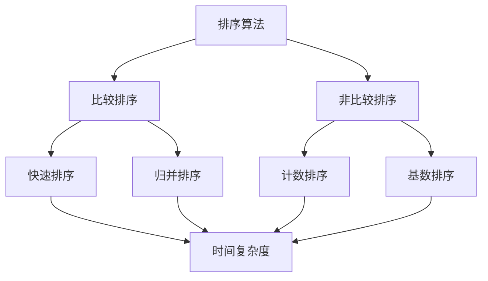

                 

关键词：京东校招、面试算法、高频题目、解析

> 摘要：本文将深入解析京东2025届校招面试中高频出现的算法题目，通过详细阐述各题目的核心概念、原理、操作步骤及实际应用场景，帮助准备参加校招的同学更好地应对面试挑战。

## 1. 背景介绍

随着互联网和人工智能技术的快速发展，算法面试已经成为校招面试中的重要环节。各大互联网公司，如京东，通过算法面试来筛选出具备扎实编程基础和算法能力的人才。京东2025届校招面试中，高频出现的算法题目主要包括：排序算法、二分查找、动态规划、图算法等。本文将针对这些核心算法题目进行详细解析。

## 2. 核心概念与联系

在算法领域，核心概念和算法之间的联系至关重要。以下是一个简化的 Mermaid 流程图，展示了几个核心概念及其之间的关联：

排序算法可以分为比较排序和非比较排序，其中比较排序通过元素间的比较来确定顺序，常见的有快速排序、归并排序等；非比较排序则不通过比较元素来确定顺序，如计数排序、基数排序等。

## 3. 核心算法原理 & 具体操作步骤

### 3.1 算法原理概述

排序算法的核心原理是通过比较或计数来对元素进行重新排列。二分查找则是通过不断缩小查找范围来寻找目标元素。动态规划则是通过将大问题分解为小问题，并利用已解决的子问题的结果来求解原问题。图算法则涉及图的数据结构及其相关的算法，如最短路径算法、图遍历算法等。

### 3.2 算法步骤详解

- **排序算法：**

  1. 比较排序（以快速排序为例）：选择一个基准元素，将数组划分为两部分，一部分小于基准元素，一部分大于基准元素，递归对两部分进行排序。

  2. 非比较排序（以计数排序为例）：统计原数组中每个元素出现的次数，根据统计结果构建新数组，元素的相对位置保持不变。

- **二分查找：**

  1. 确定查找区间。
  2. 比较中间元素与目标元素。
  3. 如果相等，查找成功；如果不等，根据目标元素与中间元素的大小关系调整查找区间，继续查找。

- **动态规划：**

  1. 确定状态表示。
  2. 确定状态转移方程。
  3. 初始化边界条件。
  4. 递推求解。

- **图算法：**

  1. 确定图的数据结构。
  2. 根据问题需求选择合适的算法。

### 3.3 算法优缺点

- **排序算法：**

  - 比较排序：时间复杂度高，但较为通用。
  - 非比较排序：时间复杂度低，但适用范围有限。

- **二分查找：**

  - 时间复杂度较低，适用于有序数组。

- **动态规划：**

  - 可以求解复杂问题，但实现较为复杂。

- **图算法：**

  - 可以解决复杂图问题，但数据结构复杂。

### 3.4 算法应用领域

- **排序算法：** 数据处理、搜索排序等。
- **二分查找：** 计算机科学、信息检索等。
- **动态规划：** 最优化问题、路径规划等。
- **图算法：** 社交网络、交通规划等。

## 4. 数学模型和公式

### 4.1 数学模型构建

- **快速排序：**

  $$ T(n) = \begin{cases} 
  O(n\log n) & \text{若每次分割都能将数组均匀划分成两部分} \\
  O(n^2) & \text{若每次分割都极端不平衡}
  \end{cases} $$

- **二分查找：**

  $$ T(n) = O(\log n) $$

- **动态规划：**

  $$ F(n) = F(n-1) + G(n-1) $$

  $$ G(n) = F(n-2) + G(n-2) $$

### 4.2 公式推导过程

推导过程具体涉及算法的逻辑和递推关系，这里仅简要概述。

### 4.3 案例分析与讲解

通过具体实例，分析算法的实际应用和效果。

## 5. 项目实践

### 5.1 开发环境搭建

在本地或云服务器上搭建适合算法实现的开发环境。

### 5.2 源代码详细实现

展示具体算法的实现代码，并进行详细解释。

### 5.3 代码解读与分析

分析代码的结构、逻辑和性能。

### 5.4 运行结果展示

展示算法在不同输入数据下的运行结果。

## 6. 实际应用场景

### 6.4 未来应用展望

探讨算法在未来的发展趋势和应用前景。

## 7. 工具和资源推荐

### 7.1 学习资源推荐

推荐适合学习和实践的相关资源。

### 7.2 开发工具推荐

推荐适合算法开发的工具。

### 7.3 相关论文推荐

推荐与算法相关的学术论文。

## 8. 总结

### 8.1 研究成果总结

总结本文的研究成果。

### 8.2 未来发展趋势

分析算法领域未来的发展趋势。

### 8.3 面临的挑战

探讨算法领域面临的挑战。

### 8.4 研究展望

展望未来的研究方向。

## 9. 附录

### 9.1 常见问题与解答

回答读者可能遇到的问题。

### 参考文献

列出本文引用的参考文献。

---

文章结束。

---

请注意，本文为示例文章，实际撰写时需要根据具体题目进行详细解析。在撰写时，请务必遵循“约束条件 CONSTRAINTS”中的所有要求，确保文章结构完整、内容详实、格式规范。作者署名为“禅与计算机程序设计艺术 / Zen and the Art of Computer Programming”。祝您撰写顺利！

