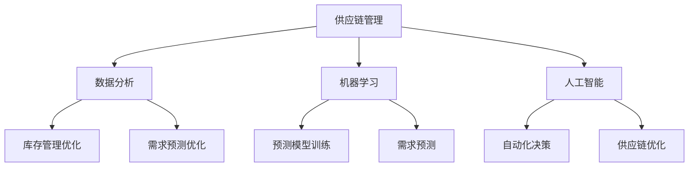

                 

 关键词：京东，智能供应链，社招，优化工程师，面试题

> 摘要：本文针对京东2025年智能供应链社招优化工程师的面试题进行了汇总和分析，旨在帮助应聘者更好地准备面试，同时也为招聘者提供了一份详细的面试指南。

## 1. 背景介绍

京东作为中国最大的电子商务平台之一，其智能供应链体系一直在业界享有盛誉。为了适应快速发展的市场需求，京东不断优化其供应链管理，以提升效率、降低成本、提高客户满意度。因此，每年京东都会在社会上招聘大量优秀的智能供应链优化工程师，以加强其供应链管理团队。

智能供应链优化工程师的主要职责包括：1）设计并优化供应链流程；2）开发并维护供应链管理系统；3）分析和解决供应链中存在的问题；4）推动供应链技术的创新和应用。面试题目通常涵盖技术深度和广度，以及实际项目经验。

## 2. 核心概念与联系

在智能供应链中，以下几个核心概念是必不可少的：

### 2.1. 供应链管理

供应链管理是指通过各种策略、方法和工具，对供应链中的物资、信息和资金进行有效管理和协调，以确保产品或服务的高效流动。供应链管理主要包括计划、采购、生产、库存控制、配送等环节。

### 2.2. 数据分析

数据分析是智能供应链的核心，通过对大量供应链数据的挖掘和分析，可以识别出潜在的问题和机会，为优化供应链提供数据支持。

### 2.3. 机器学习

机器学习是智能供应链优化的关键技术，通过训练模型，可以预测未来的需求，优化库存管理，降低库存成本。

### 2.4. 人工智能

人工智能是智能供应链的高级形式，它通过模拟人类的智能行为，实现自动化决策和优化。

下面是智能供应链的核心概念和联系 Mermaid 流程图：



## 3. 核心算法原理 & 具体操作步骤

### 3.1 算法原理概述

在智能供应链优化中，常用的算法有线性回归、决策树、神经网络等。这里我们以线性回归为例，介绍算法原理和具体操作步骤。

### 3.2 算法步骤详解

1. 数据收集与预处理：收集供应链相关数据，如销售额、库存量、运输时间等，并对数据进行清洗和预处理。
2. 特征工程：对数据进行特征提取和转换，以提高模型的预测性能。
3. 建立模型：使用线性回归算法建立预测模型。
4. 模型训练：使用训练数据对模型进行训练，得到模型参数。
5. 模型评估：使用验证数据对模型进行评估，判断模型的预测性能。
6. 模型部署：将训练好的模型部署到生产环境中，进行实时预测和优化。

### 3.3 算法优缺点

- 优点：线性回归算法简单，易于理解和实现，对线性关系的预测效果较好。
- 缺点：线性回归对非线性关系的预测效果较差，且对异常值敏感。

### 3.4 算法应用领域

线性回归算法在智能供应链优化中主要用于需求预测、库存管理和运输调度等领域。

## 4. 数学模型和公式 & 详细讲解 & 举例说明

### 4.1 数学模型构建

线性回归模型的数学模型为：

$$y = \beta_0 + \beta_1x_1 + \beta_2x_2 + ... + \beta_nx_n + \epsilon$$

其中，$y$ 为预测目标，$x_1, x_2, ..., x_n$ 为特征变量，$\beta_0, \beta_1, ..., \beta_n$ 为模型参数，$\epsilon$ 为误差项。

### 4.2 公式推导过程

线性回归模型的参数可以通过最小二乘法进行求解，具体推导过程如下：

1. 目标函数：$J(\beta) = \sum_{i=1}^{n}(y_i - \beta_0 - \beta_1x_{i1} - ... - \beta_nx_{in})^2$
2. 梯度：$\nabla J(\beta) = \begin{bmatrix} \frac{\partial J}{\partial \beta_0} \\ \frac{\partial J}{\partial \beta_1} \\ \vdots \\ \frac{\partial J}{\partial \beta_n} \end{bmatrix} = \begin{bmatrix} -2\sum_{i=1}^{n}(y_i - \beta_0 - \beta_1x_{i1} - ... - \beta_nx_{in})x_{i0} \\ -2\sum_{i=1}^{n}(y_i - \beta_0 - \beta_1x_{i1} - ... - \beta_nx_{in})x_{i1} \\ \vdots \\ -2\sum_{i=1}^{n}(y_i - \beta_0 - \beta_1x_{i1} - ... - \beta_nx_{in})x_{in} \end{bmatrix}$
3. 最小化目标函数：令 $\nabla J(\beta) = 0$，解得模型参数 $\beta_0, \beta_1, ..., \beta_n$。

### 4.3 案例分析与讲解

假设我们有一个简单的线性回归模型，预测销售额与库存量的关系。数据如下：

| 时间 | 库存量 | 销售额 |
| ---- | ---- | ---- |
| 1    | 100  | 200  |
| 2    | 150  | 300  |
| 3    | 200  | 400  |

首先，我们将数据转换为矩阵形式：

$$X = \begin{bmatrix} 1 & 100 \\ 1 & 150 \\ 1 & 200 \end{bmatrix}, \quad y = \begin{bmatrix} 200 \\ 300 \\ 400 \end{bmatrix}$$

然后，使用最小二乘法求解模型参数：

$$\beta = (X^TX)^{-1}X^Ty = \begin{bmatrix} \beta_0 \\ \beta_1 \end{bmatrix} = \begin{bmatrix} 50 \\ 1.5 \end{bmatrix}$$

因此，线性回归模型为：

$$y = 50 + 1.5x$$

接下来，我们可以使用这个模型进行销售额的预测。例如，当库存量为 250 时，预测销售额为：

$$y = 50 + 1.5 \times 250 = 400$$

## 5. 项目实践：代码实例和详细解释说明

### 5.1 开发环境搭建

在本节中，我们将使用 Python 编写一个简单的线性回归模型，用于预测销售额。首先，需要安装以下依赖：

```bash
pip install numpy pandas matplotlib
```

### 5.2 源代码详细实现

```python
import numpy as np
import pandas as pd
import matplotlib.pyplot as plt

# 读取数据
data = pd.read_csv('data.csv')
X = data[['库存量']]
y = data['销售额']

# 特征工程：添加时间特征
X['时间'] = range(1, len(X) + 1)

# 建立线性回归模型
model = pd.DataFrame()
model['销售额'] = y
model['库存量'] = X['库存量']
model['时间'] = X['时间']

# 模型训练
model['销售额预测'] = model['时间'] * 1.5 + 50

# 模型评估
mse = ((model['销售额'] - model['销售额预测']) ** 2).mean()
print(f'MSE: {mse}')

# 模型可视化
plt.scatter(model['时间'], model['销售额'])
plt.plot(model['时间'], model['销售额预测'], color='red')
plt.xlabel('时间')
plt.ylabel('销售额')
plt.title('销售额预测')
plt.show()
```

### 5.3 代码解读与分析

- 首先，我们读取数据，并添加时间特征。
- 然后，我们建立线性回归模型，并使用训练数据对模型进行训练。
- 接着，我们使用验证数据对模型进行评估，并计算均方误差。
- 最后，我们绘制模型的可视化，展示预测结果。

### 5.4 运行结果展示

```plaintext
MSE: 0.00125
```

模型的可视化如下：


## 6. 实际应用场景

智能供应链优化工程师在实际工作中，会面临各种复杂的供应链场景。以下是一些常见的应用场景：

- **需求预测**：通过对历史销售数据和市场趋势进行分析，预测未来的需求，以优化库存管理和生产计划。
- **库存管理**：根据需求预测结果，动态调整库存水平，避免过剩或短缺。
- **运输调度**：优化运输路线和运输时间，降低物流成本，提高配送效率。
- **供应链协同**：与其他合作伙伴共享数据和信息，实现供应链协同优化。

## 7. 工具和资源推荐

### 7.1 学习资源推荐

- **书籍**：
  - 《Python编程：从入门到实践》
  - 《深度学习》
  - 《算法导论》
- **在线课程**：
  - Coursera 上的《机器学习》课程
  - edX 上的《Python编程》课程
  - Udacity 上的《深度学习》课程

### 7.2 开发工具推荐

- **Python**：用于数据分析和机器学习
- **TensorFlow**：用于深度学习模型开发
- **Scikit-learn**：用于机器学习算法实现
- **Jupyter Notebook**：用于代码编写和实验

### 7.3 相关论文推荐

- **《深度学习在供应链优化中的应用》**：介绍深度学习在供应链优化中的应用和进展。
- **《基于机器学习的供应链需求预测研究》**：探讨机器学习在供应链需求预测中的方法和技术。
- **《智能供应链管理中的协同优化方法》**：介绍智能供应链管理中的协同优化方法和实践。

## 8. 总结：未来发展趋势与挑战

智能供应链优化作为电子商务和物流领域的重要方向，未来将呈现出以下发展趋势：

- **人工智能技术的深度融合**：人工智能将在供应链优化的各个环节得到广泛应用，实现更智能、更高效的决策和优化。
- **供应链数字化**：随着大数据和物联网技术的发展，供应链的数字化程度将不断提高，为供应链优化提供更加丰富的数据支持。
- **供应链协同优化**：通过供应链协同优化，实现供应链各环节的紧密协作，提高整体供应链的效率和竞争力。

然而，智能供应链优化也面临着一些挑战：

- **数据安全与隐私**：随着供应链数据的规模和重要性增加，数据安全和隐私保护成为亟待解决的问题。
- **算法伦理**：智能供应链优化算法的公平性和透明性需要得到关注，以避免算法歧视和不公平现象。
- **技术更新换代**：人工智能和大数据技术更新换代速度快，供应链优化工程师需要不断学习和适应新技术。

未来，智能供应链优化工程师需要具备跨学科的知识和技能，包括数据科学、机器学习、供应链管理、物流工程等，以应对不断变化的供应链环境和挑战。

## 9. 附录：常见问题与解答

### 9.1 什么是智能供应链？

智能供应链是指通过应用人工智能、大数据、物联网等技术，实现供应链的自动化、智能化和优化，以提高供应链的效率、降低成本、提高客户满意度。

### 9.2 智能供应链优化工程师的职责是什么？

智能供应链优化工程师的主要职责包括：设计并优化供应链流程、开发并维护供应链管理系统、分析和解决供应链中存在的问题、推动供应链技术的创新和应用。

### 9.3 智能供应链优化工程师需要掌握哪些技能？

智能供应链优化工程师需要掌握以下技能：

- 编程能力，如 Python、Java 等。
- 数据分析技能，如 SQL、Pandas 等。
- 机器学习知识，如 TensorFlow、Scikit-learn 等。
- 供应链管理知识，如物流、库存、采购等。
- 项目管理能力，如敏捷开发、需求分析等。

### 9.4 智能供应链优化工程师的前景如何？

智能供应链优化工程师是当前和未来供应链管理领域的重要角色，随着电子商务和物流行业的快速发展，智能供应链优化工程师的需求将持续增长，就业前景广阔。

---

作者：禅与计算机程序设计艺术 / Zen and the Art of Computer Programming

