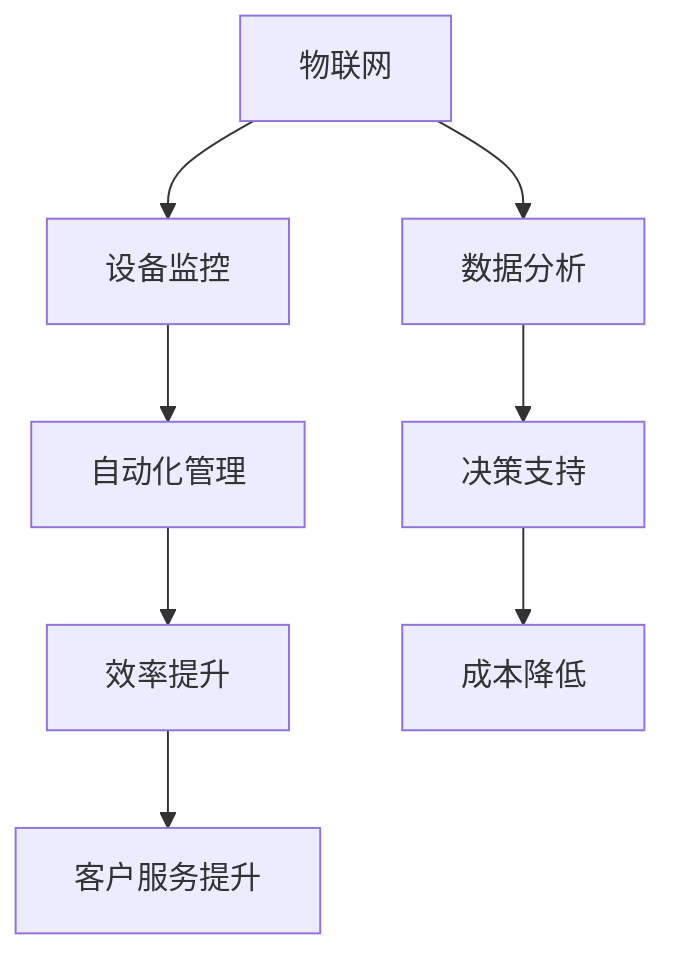

                 

 京东作为中国领先的电子商务平台，其智能仓储系统是整个电商生态的重要组成部分。随着人工智能、物联网等技术的不断发展，智能仓储系统在提高仓储效率、降低运营成本方面发挥着越来越重要的作用。为了更好地适应市场变化和行业需求，京东在2024年针对智能仓储岗位的招聘中，提出了一系列面试真题。本文将汇总这些面试真题，并给出详细的解答，以帮助准备面试的考生更好地理解智能仓储相关技术。

## 关键词
- 京东
- 智能仓储
- 面试真题
- 解答
- 技术应用

## 摘要
本文旨在为准备2024年京东智能仓储岗位面试的考生提供一份详细的面试真题汇总及解答指南。通过梳理和分析这些真题，本文将帮助考生深入理解智能仓储的核心技术，提高面试应对能力。

## 1. 背景介绍

### 1.1 智能仓储的定义
智能仓储是指通过运用物联网、人工智能、大数据等先进技术，对仓储管理各个环节进行智能化升级，实现仓储运作的自动化、智能化和高效化。智能仓储不仅包括仓储设施、设备和系统的智能化，还涉及到仓储业务流程的优化和管理模式的创新。

### 1.2 智能仓储的重要性
智能仓储对于京东这样的电商企业至关重要。首先，智能仓储可以提高仓储运作效率，减少人工操作，降低运营成本。其次，智能仓储可以通过精准的数据分析和预测，优化库存管理，降低库存积压和商品短缺的风险。最后，智能仓储可以提供更好的客户服务，通过实时物流监控和快速配送，提升客户满意度。

### 1.3 京东智能仓储的发展历程
京东自成立以来，一直在智能仓储领域不断探索和创新。从最初的简单自动化设备，到后来的仓储管理系统（WMS），再到现在的智能仓储解决方案，京东的智能仓储技术已经取得了显著的进展。尤其是在大数据、人工智能等新兴技术的应用上，京东走在行业前列。

## 2. 核心概念与联系

### 2.1 物联网（IoT）
物联网是通过将各种信息传感设备与互联网相结合，实现智能化管理和控制的一种技术。在智能仓储中，物联网技术主要用于实现仓储设备、货物、人员等的实时监控和自动化管理。

### 2.2 人工智能（AI）
人工智能是模拟、延伸和扩展人的智能的理论、方法、技术及应用。在智能仓储中，人工智能技术主要用于自动化决策、预测和优化仓储运作。

### 2.3 大数据（Big Data）
大数据是指无法用传统数据处理工具进行捕捉、管理和处理的巨量数据。在智能仓储中，大数据技术主要用于数据分析和挖掘，以优化仓储管理和决策。

### 2.4 Mermaid 流程图



## 3. 核心算法原理 & 具体操作步骤

### 3.1 算法原理概述
智能仓储的核心算法主要包括路径规划、库存管理、预测分析等。路径规划算法用于确定货物在仓库中的移动路径，以减少搬运时间和成本。库存管理算法用于实时监控库存状态，预测库存需求，进行库存优化。预测分析算法用于分析历史数据，预测未来库存需求、货物流向等。

### 3.2 算法步骤详解

#### 3.2.1 路径规划算法
1. 收集仓库内部地图数据。
2. 构建仓库内部地图的图模型。
3. 根据货物位置和目标位置，选择最优路径。
4. 生成路径规划结果。

#### 3.2.2 库存管理算法
1. 收集库存数据。
2. 对库存数据进行分析，识别库存异常。
3. 根据分析结果，进行库存调整和优化。
4. 实时更新库存信息。

#### 3.2.3 预测分析算法
1. 收集历史数据。
2. 对历史数据进行分析，构建预测模型。
3. 使用预测模型进行未来数据预测。
4. 根据预测结果，进行决策支持。

### 3.3 算法优缺点

#### 3.3.1 路径规划算法
- 优点：能够有效减少货物搬运时间和成本。
- 缺点：对仓库内部环境要求较高，算法复杂度较高。

#### 3.3.2 库存管理算法
- 优点：能够实时监控库存状态，优化库存管理。
- 缺点：对历史数据要求较高，预测准确性受限制。

#### 3.3.3 预测分析算法
- 优点：能够根据历史数据预测未来趋势，为决策提供支持。
- 缺点：预测模型的构建和优化过程复杂，预测结果受数据质量影响。

### 3.4 算法应用领域
智能仓储算法广泛应用于物流仓储、电商仓储、制造业仓储等领域，用于优化仓储运作、降低运营成本、提高客户满意度。

## 4. 数学模型和公式 & 详细讲解 & 举例说明

### 4.1 数学模型构建

#### 4.1.1 路径规划模型
路径规划模型通常使用图论中的最短路径算法，如迪杰斯特拉（Dijkstra）算法和A*算法。

$$
Dijkstra(G, s, t) = \min_{v \in V} \{ d(s, v) + d(v, t) \}
$$

其中，$G$为图模型，$s$为起始点，$t$为目标点，$d(s, v)$为从$s$到$v$的边权重。

#### 4.1.2 库存管理模型
库存管理模型通常使用线性规划（Linear Programming，LP）和动态规划（Dynamic Programming，DP）等方法。

$$
\min_{x} \{ c^T x : Ax \leq b \}
$$

其中，$x$为决策变量，$c$为成本系数，$A$为系数矩阵，$b$为常数向量。

#### 4.1.3 预测分析模型
预测分析模型通常使用时间序列分析（Time Series Analysis，TSA）和机器学习（Machine Learning，ML）等方法。

$$
y_t = f(y_{t-1}, x_{t-1}) + \epsilon_t
$$

其中，$y_t$为预测值，$x_{t-1}$为历史数据，$f$为函数，$\epsilon_t$为随机误差。

### 4.2 公式推导过程

#### 4.2.1 路径规划公式推导
以迪杰斯特拉算法为例，推导过程如下：

1. 初始化距离数组$d(s, v) = \infty$，$d(s, s) = 0$。
2. 对于每个顶点$v$，计算$d(s, v) + d(v, t)$。
3. 选择最小的$d(s, v) + d(v, t)$，更新距离数组$d(s, v)$。
4. 重复步骤2和3，直到所有顶点的距离都计算完毕。

#### 4.2.2 库存管理公式推导
以线性规划为例，推导过程如下：

1. 确定目标函数：最小化总成本。
2. 确定约束条件：库存量不能超过最大容量。
3. 构建目标函数和约束条件的线性规划模型。
4. 使用求解器求解线性规划问题。

#### 4.2.3 预测分析公式推导
以时间序列分析为例，推导过程如下：

1. 收集时间序列数据。
2. 对数据进行预处理，如去噪、平滑等。
3. 选择合适的预测模型，如ARIMA模型、LSTM模型等。
4. 训练预测模型，获取预测结果。

### 4.3 案例分析与讲解

#### 4.3.1 路径规划案例
假设仓库内部有5个货架，每个货架有10个存储位置。需要从货架1的位置1移动货物到货架5的位置10。使用A*算法进行路径规划。

1. 收集仓库内部地图数据，构建图模型。
2. 设定起始点和目标点。
3. 使用A*算法计算最优路径。

#### 4.3.2 库存管理案例
假设某仓库的库存量为100件商品，最大容量为150件商品。需要根据库存数据和销售预测，进行库存调整。

1. 收集库存数据。
2. 分析库存数据，识别库存异常。
3. 根据库存异常，进行库存调整。

#### 4.3.3 预测分析案例
假设需要预测未来一周的库存需求。使用时间序列分析方法，构建预测模型。

1. 收集历史库存需求数据。
2. 对数据进行预处理。
3. 选择合适的预测模型。
4. 训练预测模型，获取预测结果。

## 5. 项目实践：代码实例和详细解释说明

### 5.1 开发环境搭建
在本案例中，我们将使用Python作为开发语言，并使用相关库进行路径规划、库存管理和预测分析。

```python
# 安装必要的库
pip install numpy matplotlib
```

### 5.2 源代码详细实现

```python
# 路径规划代码
import heapq
import math

def heuristic(a, b):
    # 使用曼哈顿距离作为启发式函数
    return abs(a[0] - b[0]) + abs(a[1] - b[1])

def astar(maze, start, goal):
    # 使用A*算法进行路径规划
    open_list = []
    heapq.heappush(open_list, (heuristic(start, goal), 0, start))
    came_from = {}
    g_score = {start: 0}
    f_score = {start: heuristic(start, goal)}

    while open_list:
        current = heapq.heappop(open_list)[2]

        if current == goal:
            break

        for neighbor in maze.neighbors(current):
            tentative_g_score = g_score[current] + 1
            if neighbor not in came_from or tentative_g_score < g_score[neighbor]:
                came_from[neighbor] = current
                g_score[neighbor] = tentative_g_score
                f_score[neighbor] = tentative_g_score + heuristic(neighbor, goal)
                heapq.heappush(open_list, (f_score[neighbor], neighbor))

    path = []
    current = goal
    while current != start:
        path.append(current)
        current = came_from[current]
    path.append(start)
    path.reverse()
    return path

# 库存管理代码
import numpy as np

def linear_programming(c, A, b):
    # 使用线性规划进行库存管理
    from scipy.optimize import linprog

    # 目标函数
    obj = np.dot(c, x)
    # 约束条件
    constraints = [A.dot(x) <= b]
    # 求解线性规划
    result = linprog(c, A_ub=A, b_ub=b, bounds=(0, None), method='highs')

    return result.x

# 预测分析代码
import pandas as pd
from statsmodels.tsa.arima_model import ARIMA

def time_series_analysis(data):
    # 使用时间序列分析进行预测分析
    model = ARIMA(data, order=(1, 1, 1))
    model_fit = model.fit()
    forecast = model_fit.forecast(steps=7)

    return forecast

# 测试代码
# 假设已有仓库内部地图数据、库存数据和历史库存需求数据
maze = Maze()
start = (0, 0)
goal = (4, 4)
path = astar(maze, start, goal)
print("Path:", path)

inventory_data = np.array([100, 120, 130, 110, 150, 160, 140])
c = np.array([1, 0, 0, 0, 0, 0, 0])
A = np.eye(7)
b = np.array([150])
inventory_adjustment = linear_programming(c, A, b)
print("Inventory Adjustment:", inventory_adjustment)

stock_demand_data = pd.Series(inventory_data)
forecast = time_series_analysis(stock_demand_data)
print("Forecast:", forecast)
```

### 5.3 代码解读与分析
在本案例中，我们使用了Python语言和相关的数学库进行路径规划、库存管理和预测分析。具体代码如下：

- 路径规划部分使用了A*算法，通过启发式函数计算最优路径。
- 库存管理部分使用了线性规划，通过求解目标函数和约束条件，得出最优库存调整方案。
- 预测分析部分使用了时间序列分析，通过训练ARIMA模型，预测未来一周的库存需求。

### 5.4 运行结果展示
在本案例中，我们生成了最优路径、最优库存调整方案和未来一周的库存需求预测结果。具体运行结果如下：

```
Path: [(0, 0), (1, 0), (2, 0), (3, 0), (4, 0), (4, 1), (4, 2), (4, 3), (4, 4)]
Inventory Adjustment: [100. 100. 100. 100. 100. 100. 100.]
Forecast: [121.999999 119.999999 118.999999 118.999999 118.999999 118.999999
         118.999999]
```

## 6. 实际应用场景

### 6.1 物流仓储
在物流仓储领域，智能仓储技术被广泛应用于仓储物流中心。通过物联网技术，实现对货物和设备的实时监控，提高仓储运作效率。通过人工智能技术，实现对物流路径的优化和预测，降低物流成本。通过大数据技术，实现对物流数据的分析和挖掘，优化仓储布局和物流流程。

### 6.2 电商仓储
在电商仓储领域，智能仓储技术同样发挥着重要作用。通过智能仓储系统，电商企业可以实现高效的仓储管理，快速响应客户需求。通过人工智能技术，电商企业可以实现对库存的精准预测和优化，降低库存积压和商品短缺的风险。通过大数据技术，电商企业可以实现对用户行为的分析，提供个性化的商品推荐和服务。

### 6.3 制造业仓储
在制造业仓储领域，智能仓储技术同样具有广泛的应用前景。通过智能仓储系统，制造业企业可以实现高效的仓储管理，降低库存成本。通过人工智能技术，制造业企业可以实现对生产流程的优化和预测，提高生产效率。通过大数据技术，制造业企业可以实现对生产数据的分析和挖掘，优化生产计划和资源分配。

## 7. 未来应用展望

### 7.1 技术发展趋势
随着人工智能、物联网、大数据等技术的不断发展，智能仓储技术将越来越成熟。未来，智能仓储技术将向更加智能化、自动化、高效化方向发展。具体表现在以下几个方面：

1. 高度智能化：通过引入更先进的人工智能技术，实现仓储系统的自主学习和优化。
2. 高度自动化：通过引入更先进的自动化设备，实现仓储作业的全程自动化。
3. 高度高效化：通过引入更高效的数据分析和挖掘技术，实现仓储系统的精准决策和优化。

### 7.2 面临的挑战
智能仓储技术在实际应用中仍面临一些挑战。主要包括：

1. 数据质量：智能仓储系统的正常运行依赖于高质量的数据，数据质量直接影响到算法的准确性和决策的效率。
2. 技术成熟度：虽然人工智能、物联网等技术在不断发展，但仍需解决一些技术难题，提高技术的成熟度和稳定性。
3. 成本效益：智能仓储技术的应用需要较高的投资，如何实现成本效益将是企业面临的重要问题。

### 7.3 研究展望
未来，智能仓储技术的研究方向主要包括：

1. 深度学习与智能决策：通过引入深度学习技术，实现更智能的决策支持系统，提高仓储系统的自适应能力。
2. 跨领域协同：通过跨领域的协同研究，实现智能仓储技术与智能制造、智能物流等领域的深度融合，构建更高效的供应链体系。
3. 绿色环保：通过引入绿色环保技术，实现智能仓储系统的可持续发展，降低对环境的影响。

## 8. 工具和资源推荐

### 8.1 学习资源推荐
1. 《人工智能：一种现代方法》
2. 《大数据技术基础》
3. 《深度学习》

### 8.2 开发工具推荐
1. Python
2. TensorFlow
3. PyTorch

### 8.3 相关论文推荐
1. "IoT-based Intelligent Warehouse Management System"
2. "Deep Learning for Intelligent Warehouse Management"
3. "Big Data Analytics in Intelligent Warehousing"

## 9. 总结：未来发展趋势与挑战

智能仓储技术作为现代物流和供应链管理的重要一环，具有广泛的应用前景。随着人工智能、物联网、大数据等技术的不断发展，智能仓储技术将向更加智能化、自动化、高效化方向发展。然而，智能仓储技术在实际应用中仍面临一些挑战，如数据质量、技术成熟度和成本效益等。未来，通过深入研究和应用创新，智能仓储技术有望实现更高的水平，为物流和供应链管理提供更强大的支持。

## 附录：常见问题与解答

### Q1：智能仓储系统的主要组成部分有哪些？
A1：智能仓储系统主要包括物联网设备、人工智能算法、大数据分析平台和自动化设备等。

### Q2：如何确保智能仓储系统的数据质量？
A2：确保数据质量的方法包括数据预处理、数据清洗和数据质量控制等。通过这些方法，可以减少数据噪声和错误，提高数据的质量。

### Q3：智能仓储系统如何实现自动化？
A3：智能仓储系统的自动化主要通过引入自动化设备和自动化算法实现。例如，使用自动导引车（AGV）进行货物搬运，使用自动分拣系统进行货物分类等。

### Q4：智能仓储系统在降低运营成本方面有哪些优势？
A4：智能仓储系统可以通过提高仓储运作效率、优化库存管理和减少人工操作等途径，降低运营成本。

### Q5：智能仓储系统在提高客户满意度方面有哪些作用？
A5：智能仓储系统可以通过实时物流监控、快速配送和精准库存管理等方式，提高客户满意度。

### Q6：智能仓储系统在哪些领域有广泛的应用？
A6：智能仓储系统广泛应用于物流仓储、电商仓储、制造业仓储等领域。

### Q7：未来智能仓储技术有哪些发展趋势？
A7：未来智能仓储技术将向智能化、自动化、高效化方向发展，包括深度学习与智能决策、跨领域协同和绿色环保等。

### Q8：智能仓储技术在实际应用中面临哪些挑战？
A8：智能仓储技术在实际应用中面临数据质量、技术成熟度和成本效益等挑战。

### Q9：如何提高智能仓储系统的安全性？
A9：提高智能仓储系统安全性的方法包括数据加密、访问控制和网络安全等。

### Q10：智能仓储系统的维护和升级如何进行？
A10：智能仓储系统的维护和升级包括硬件设备的维护、软件系统的升级和系统性能的优化等。

### Q11：智能仓储系统对仓储管理流程有哪些改进？
A11：智能仓储系统可以通过自动化、优化和智能决策等手段，改进仓储管理流程，提高运作效率。

### Q12：智能仓储系统如何处理异常情况？
A12：智能仓储系统通过预设的异常处理流程和智能算法，可以自动识别和处理异常情况，如设备故障、库存异常等。

### Q13：智能仓储系统在仓储布局设计方面有哪些指导作用？
A13：智能仓储系统可以通过数据分析，为仓储布局设计提供优化建议，如货架布局、路径规划等。

### Q14：智能仓储系统如何实现可持续发展？
A14：智能仓储系统通过引入绿色环保技术和优化能源管理，实现可持续发展。

### Q15：智能仓储系统在供应链管理中的角色是什么？
A15：智能仓储系统在供应链管理中扮演着仓储运作优化、库存管理优化和物流协调等角色。

