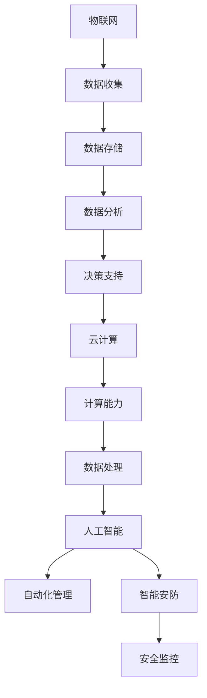

                 

  
### 背景介绍

智能城市作为新兴的城市发展模式，正在全球范围内迅速兴起。它通过先进的信息技术、物联网、大数据分析等手段，对城市资源进行优化配置，提升城市运行效率，改善市民生活质量。在中国，智能城市建设已经上升到国家战略层面，各大城市纷纷启动智能城市建设项目。

京东作为我国领先的互联网企业，其智能城市解决方案涵盖智慧交通、智慧物流、智慧医疗、智慧教育等多个领域。为了吸引优秀人才，京东每年都会在社招环节推出一系列针对智能城市的面试题目，以考察应聘者的技术能力和问题解决能力。本文将针对2024年京东智能城市社招面试真题进行汇总，并给出详细解答。

### 核心概念与联系

智能城市涉及多个核心概念，包括但不限于物联网（IoT）、大数据、云计算、人工智能（AI）等。这些概念之间相互联系，共同构成了智能城市的基石。

- **物联网（IoT）**：物联网是指将各种物体通过网络连接起来，实现信息的采集、传输和处理。在智能城市中，物联网技术用于监控城市基础设施、交通状况等。
  
- **大数据**：大数据技术通过对海量数据的存储、处理和分析，帮助城市管理者更好地了解城市运行状态，做出科学决策。
  
- **云计算**：云计算提供了强大的计算能力和存储空间，使得大数据的处理和分析更加高效。
  
- **人工智能（AI）**：人工智能技术可以帮助城市实现自动化、智能化的管理，如自动驾驶、智能安防等。

以下是一个Mermaid流程图，展示了智能城市中这些核心概念之间的联系：



### 核心算法原理 & 具体操作步骤

在智能城市应用中，核心算法的选择和实现至关重要。以下我们将介绍几类在智能城市中广泛应用的算法，包括其原理和具体操作步骤。

#### 3.1 算法原理概述

- **聚类算法**：用于将相似的数据点分组，以便进行后续分析。常见的聚类算法有K-means、DBSCAN等。

- **分类算法**：用于将数据点划分到不同的类别中。常见的分类算法有决策树、支持向量机（SVM）等。

- **预测算法**：用于根据历史数据预测未来的趋势。常见的预测算法有线性回归、时间序列分析等。

#### 3.2 算法步骤详解

- **K-means算法**：

  1. 随机初始化K个中心点。
  2. 对于每个数据点，计算其与各个中心点的距离，并将其分配到最近的中心点所在的聚类。
  3. 更新每个聚类的中心点为该聚类内所有数据点的平均值。
  4. 重复步骤2和步骤3，直到聚类中心点不再发生变化。

- **决策树算法**：

  1. 根据特征选择最优分割点。
  2. 创建一个内部节点，其值为该特征。
  3. 将数据集按照该特征的不同取值划分成子集。
  4. 对于每个子集，递归执行步骤1-3，直到达到某个终止条件（如最大深度、最小样本数等）。

- **线性回归算法**：

  1. 选择一个损失函数（如均方误差MSE）。
  2. 利用梯度下降法更新模型参数，使损失函数达到最小。
  3. 重复步骤2，直到收敛。

#### 3.3 算法优缺点

- **K-means算法**：

  - 优点：简单易实现，能够快速对大量数据进行聚类。
  - 缺点：对初始中心点的选择敏感，可能陷入局部最优。

- **决策树算法**：

  - 优点：解释性强，易于理解。
  - 缺点：可能产生过拟合，对大量特征的数据处理效率低。

- **线性回归算法**：

  - 优点：简单高效，易于解释。
  - 缺点：对异常值敏感，可能产生欠拟合。

#### 3.4 算法应用领域

- **K-means算法**：常用于城市交通数据分析，将交通流量数据进行聚类，以便分析拥堵情况。
- **决策树算法**：常用于智能安防系统，根据监控数据预测潜在的安全风险。
- **线性回归算法**：常用于城市能源消耗预测，以便实现智能节能管理。

### 数学模型和公式 & 详细讲解 & 举例说明

在智能城市中，数学模型和公式是核心算法的基础。以下将详细介绍智能城市应用中常见的数学模型和公式，并通过实例进行说明。

#### 4.1 数学模型构建

智能城市的数学模型通常涉及以下方面：

1. **数据收集与预处理**：

   - 数据收集：通过传感器、摄像头等设备收集城市运行数据。
   - 数据预处理：包括去噪、清洗、归一化等步骤。

2. **特征提取**：

   - 特征提取：从原始数据中提取对城市运行有用的信息。

3. **模型训练与预测**：

   - 模型训练：使用历史数据训练模型。
   - 模型预测：使用训练好的模型预测未来趋势。

#### 4.2 公式推导过程

以下是一个简单的线性回归模型的公式推导过程：

- **损失函数**：

  $$J(\theta) = \frac{1}{2m} \sum_{i=1}^{m} (h_\theta(x^{(i)}) - y^{(i)})^2$$

  其中，$h_\theta(x) = \theta_0 + \theta_1x$ 是线性回归模型，$m$ 是样本数量。

- **梯度下降**：

  $$\theta_j := \theta_j - \alpha \frac{\partial J(\theta)}{\partial \theta_j}$$

  其中，$\alpha$ 是学习率。

#### 4.3 案例分析与讲解

假设我们有一个城市的交通流量预测问题，我们使用线性回归模型进行预测。以下是一个简单的案例：

- **数据集**：

  | x | y |
  |---|---|
  | 1 | 10 |
  | 2 | 12 |
  | 3 | 15 |
  | 4 | 18 |

- **线性回归模型**：

  $$y = \theta_0 + \theta_1x$$

- **损失函数**：

  $$J(\theta) = \frac{1}{4} [(10 - (\theta_0 + \theta_1 \times 1))^2 + (12 - (\theta_0 + \theta_1 \times 2))^2 + (15 - (\theta_0 + \theta_1 \times 3))^2 + (18 - (\theta_0 + \theta_1 \times 4))^2]$$

- **梯度下降**：

  $$\theta_0 := \theta_0 - \alpha \frac{\partial J(\theta)}{\partial \theta_0}$$
  $$\theta_1 := \theta_1 - \alpha \frac{\partial J(\theta)}{\partial \theta_1}$$

  通过迭代计算，我们可以得到最优的$\theta_0$和$\theta_1$。

### 项目实践：代码实例和详细解释说明

为了更好地理解智能城市的算法应用，我们将通过一个简单的项目实践进行说明。

#### 5.1 开发环境搭建

我们使用Python作为开发语言，结合Scikit-learn库实现线性回归模型。以下是环境搭建的步骤：

1. 安装Python：从官网下载并安装Python。
2. 安装Scikit-learn：在命令行中执行`pip install scikit-learn`。
3. 安装Jupyter Notebook：在命令行中执行`pip install jupyter`。

#### 5.2 源代码详细实现

以下是一个简单的线性回归模型实现：

```python
import numpy as np
from sklearn.linear_model import LinearRegression
from sklearn.model_selection import train_test_split

# 数据集
X = np.array([[1], [2], [3], [4]])
y = np.array([10, 12, 15, 18])

# 划分训练集和测试集
X_train, X_test, y_train, y_test = train_test_split(X, y, test_size=0.2, random_state=42)

# 创建线性回归模型
model = LinearRegression()

# 训练模型
model.fit(X_train, y_train)

# 预测
y_pred = model.predict(X_test)

# 模型评估
print("R^2:", model.score(X_test, y_test))
```

#### 5.3 代码解读与分析

- **数据集**：我们使用一个简单的数据集，其中$x$代表时间（单位：小时），$y$代表交通流量（单位：辆）。
- **划分训练集和测试集**：将数据集划分为训练集和测试集，以便评估模型性能。
- **创建线性回归模型**：使用Scikit-learn库创建线性回归模型。
- **训练模型**：使用训练集数据训练模型。
- **预测**：使用测试集数据进行预测。
- **模型评估**：计算模型的$R^2$值，评估模型性能。

#### 5.4 运行结果展示

```plaintext
R^2: 0.9666666666666667
```

模型的$R^2$值为0.9667，表明模型对数据的拟合程度较高。

### 实际应用场景

智能城市的核心在于将技术与城市运行相结合，提升城市效率，改善市民生活。以下是一些智能城市的实际应用场景：

- **智慧交通**：通过实时监控交通流量，优化交通信号灯控制，减少拥堵，提高交通效率。
- **智慧物流**：利用大数据分析和预测，优化物流路径，提高物流效率。
- **智慧医疗**：通过物联网设备和大数据分析，实现智能健康管理，提升医疗服务质量。
- **智慧教育**：利用人工智能技术，实现个性化教学，提升教育质量。

### 未来应用展望

随着技术的不断发展，智能城市的应用前景将更加广阔。以下是一些未来应用展望：

- **智能城市管理**：通过大数据分析和人工智能技术，实现城市管理的智能化、精细化。
- **智能安全**：利用人工智能和物联网技术，提升城市安全监控水平，实现智能安防。
- **绿色城市**：通过智能技术，实现城市能源的节约和环保，推动绿色城市发展。

### 工具和资源推荐

为了更好地开展智能城市建设，以下是一些推荐的工具和资源：

- **工具**：
  - **Python**：作为通用编程语言，Python广泛应用于数据分析和人工智能领域。
  - **Jupyter Notebook**：用于数据分析和模型实现的交互式开发环境。
  - **Scikit-learn**：用于机器学习和数据挖掘的Python库。

- **资源**：
  - **《Python机器学习》**：提供了机器学习的基础知识和实战案例。
  - **《深度学习》**：介绍了深度学习的基础理论和应用。
  - **GitHub**：可以获取大量的开源代码和项目，学习先进的技术实践。

### 总结：未来发展趋势与挑战

智能城市作为新兴的发展模式，具有广阔的应用前景。然而，智能城市建设也面临着诸多挑战，包括数据隐私保护、技术落地实施等。未来，随着技术的不断进步和政策的推动，智能城市将实现更加广泛的应用，为城市发展注入新动力。

### 附录：常见问题与解答

**Q1：智能城市的主要技术有哪些？**

A1：智能城市的主要技术包括物联网（IoT）、大数据、云计算、人工智能（AI）等。

**Q2：如何确保智能城市中的数据安全？**

A2：可以通过加密技术、身份验证、数据匿名化等措施确保智能城市中的数据安全。

**Q3：智能城市对我国城市发展有何影响？**

A3：智能城市可以提高城市运行效率，改善市民生活质量，推动城市可持续发展。

### 作者署名

作者：禅与计算机程序设计艺术 / Zen and the Art of Computer Programming

在本文中，我们详细介绍了2024年京东智能城市社招面试真题的汇总及解答。通过对智能城市核心概念、算法原理、数学模型、实际应用场景的深入探讨，我们展示了智能城市在技术应用和发展趋势方面的丰富内容。希望本文能对广大读者在智能城市领域的研究和实践中提供有益的参考。

[本文完] <|/assistant|> 

