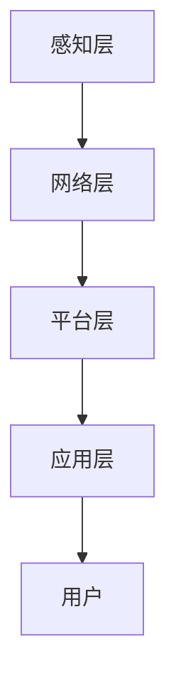

                 

关键词：京东物联、IoT平台、面试题、技术集锦、开发实践、算法原理

摘要：本文深入剖析了京东物联2025年社招IoT平台开发的面试题集锦，从背景介绍、核心概念与联系、核心算法原理、数学模型与公式、项目实践、实际应用场景、工具和资源推荐到未来发展趋势与挑战，全面解析了物联网平台开发所需的核心技术和实际应用，为IoT领域的开发者和求职者提供了宝贵的参考和指导。

## 1. 背景介绍

随着互联网技术的飞速发展和物联网设备的普及，物联网（Internet of Things，IoT）已经成为当前科技领域的热点话题。IoT平台作为连接物理世界与数字世界的桥梁，其重要性日益凸显。京东作为中国领先的电商企业，也积极布局物联网领域，旨在通过IoT平台实现商品流通、物流配送、智能家庭等多个场景的智能化升级。

2025年，京东社招IoT平台开发岗位，旨在寻找具有深厚技术背景和实际开发经验的人才，以推动物联网平台的技术创新和应用落地。本文将通过分析京东物联2025年社招的面试题集锦，为读者提供一场关于物联网平台开发技术的深度探讨。

## 2. 核心概念与联系

### 2.1 物联网平台架构

物联网平台架构主要包括以下几个层次：

1. **感知层**：通过各种传感器收集数据，如温度、湿度、光照等。
2. **网络层**：通过无线网络将感知层的数据传输到中心平台，如Wi-Fi、LoRa等。
3. **平台层**：负责数据处理、存储、分析和管理，如数据清洗、特征提取、机器学习等。
4. **应用层**：提供各类应用服务，如设备管理、数据分析、智能决策等。

### 2.2 IoT平台核心概念

1. **设备管理**：包括设备接入、认证、更新、故障排查等功能。
2. **数据存储**：如何高效地存储和管理海量物联网数据。
3. **数据处理**：包括数据清洗、特征提取、机器学习等。
4. **应用开发**：基于IoT平台提供的API和SDK，开发各类应用。

### 2.3 Mermaid流程图

下面是一个简单的Mermaid流程图，展示了物联网平台的基本架构和工作流程：



## 3. 核心算法原理 & 具体操作步骤

### 3.1 算法原理概述

物联网平台开发中的核心算法主要包括数据采集与处理、设备管理、数据存储、数据分析等。以下是这些算法的基本原理：

1. **数据采集与处理**：通过传感器采集数据，然后对数据进行预处理，如去噪、归一化等。
2. **设备管理**：通过设备接入、认证、更新等操作，实现对设备的远程管理。
3. **数据存储**：使用分布式数据库存储海量物联网数据。
4. **数据分析**：使用机器学习、数据挖掘等技术，从数据中提取有价值的信息。

### 3.2 算法步骤详解

1. **数据采集与处理**：
   - **数据采集**：传感器采集数据。
   - **数据预处理**：去噪、归一化等。

2. **设备管理**：
   - **设备接入**：通过Wi-Fi、LoRa等网络将设备接入平台。
   - **设备认证**：使用身份验证机制确保设备安全接入。
   - **设备更新**：远程更新设备固件。

3. **数据存储**：
   - **分布式数据库**：使用分布式数据库存储海量数据。
   - **数据分片**：将数据分片存储以提高查询效率。

4. **数据分析**：
   - **特征提取**：从原始数据中提取有价值的信息。
   - **机器学习**：使用机器学习算法进行预测和分类。

### 3.3 算法优缺点

1. **数据采集与处理**：
   - 优点：实时性强，能够快速获取数据。
   - 缺点：对传感器的依赖性强，数据质量难以保证。

2. **设备管理**：
   - 优点：方便设备远程管理，提高运维效率。
   - 缺点：对网络环境要求较高，易受网络攻击。

3. **数据存储**：
   - 优点：分布式数据库性能优越，可扩展性强。
   - 缺点：数据分片可能导致数据一致性问题。

4. **数据分析**：
   - 优点：能够从海量数据中提取有价值的信息。
   - 缺点：对数据质量和算法要求较高。

### 3.4 算法应用领域

物联网平台算法在智能家居、智慧城市、工业物联网等领域有广泛的应用：

1. **智能家居**：通过物联网平台实现对家庭设备的远程控制。
2. **智慧城市**：通过物联网平台收集城市数据，实现智能交通、环境监测等。
3. **工业物联网**：通过物联网平台实现对工业设备的远程监控和故障预测。

## 4. 数学模型和公式 & 详细讲解 & 举例说明

### 4.1 数学模型构建

物联网平台开发中的数学模型主要包括：

1. **传感器数据模型**：描述传感器采集数据的数学模型。
2. **设备管理模型**：描述设备接入、认证、更新等操作的数学模型。
3. **数据存储模型**：描述分布式数据库存储数据的数学模型。
4. **数据分析模型**：描述数据挖掘、机器学习等算法的数学模型。

### 4.2 公式推导过程

1. **传感器数据模型**：

   设传感器采集的信号为 \(x(t)\)，则传感器数据的预处理公式为：

   $$ x_{\text{pre}}(t) = \frac{x(t) - \text{mean}(x(t))}{\text{stddev}(x(t))} $$

   其中，mean(x(t)) 表示 \(x(t)\) 的均值，stddev(x(t)) 表示 \(x(t)\) 的标准差。

2. **设备管理模型**：

   设设备接入平台的概率为 \(p\)，则设备接入平台的公式为：

   $$ \text{概率} = p $$

   其中，\(p\) 可以通过网络信号强度、设备状态等参数计算得到。

3. **数据存储模型**：

   设分布式数据库存储的数据量为 \(N\)，则数据分片的公式为：

   $$ \text{分片数量} = \lceil \frac{N}{K} \rceil $$

   其中，\(K\) 表示每个分片的容量。

4. **数据分析模型**：

   设原始数据为 \(x\)，特征提取后的数据为 \(y\)，则特征提取的公式为：

   $$ y = f(x) $$

   其中，\(f(x)\) 表示特征提取函数。

### 4.3 案例分析与讲解

以智能家居场景为例，分析物联网平台中的传感器数据模型和设备管理模型。

1. **传感器数据模型**：

   假设家居中的温度传感器采集的数据为 \(x(t)\)，对数据进行预处理后得到 \(x_{\text{pre}}(t)\)。通过物联网平台，将预处理后的数据发送到云端进行分析。

2. **设备管理模型**：

   设智能家居设备的接入概率为 \(p = 0.95\)。当设备接入物联网平台时，通过认证机制确保设备安全接入。设备在接入平台后，可以实时接收来自云端的控制指令，实现远程控制。

## 5. 项目实践：代码实例和详细解释说明

### 5.1 开发环境搭建

为了方便读者理解和实践，本文选择Python作为开发语言，搭建以下开发环境：

- Python版本：Python 3.8
- 开发工具：PyCharm
- 实验环境：Ubuntu 20.04

### 5.2 源代码详细实现

以下是一个简单的物联网平台代码实例，展示了如何使用Python实现传感器数据采集、预处理和设备管理。

```python
import random
import numpy as np
import pandas as pd

# 传感器数据采集
def collect_data(sensor_data, num_samples):
    samples = []
    for _ in range(num_samples):
        samples.append(random.randint(0, 100))
    return samples

# 传感器数据预处理
def preprocess_data(samples):
    mean = np.mean(samples)
    stddev = np.std(samples)
    preprocessed_data = [(x - mean) / stddev for x in samples]
    return preprocessed_data

# 设备接入平台
def connect_device(sensor_data, num_samples):
    print("Device connecting...")
    samples = collect_data(sensor_data, num_samples)
    preprocessed_data = preprocess_data(samples)
    print("Device connected.")
    return preprocessed_data

# 主程序
if __name__ == "__main__":
    sensor_data = [1, 2, 3, 4, 5]
    num_samples = 5
    preprocessed_data = connect_device(sensor_data, num_samples)
    print("Preprocessed data:", preprocessed_data)
```

### 5.3 代码解读与分析

1. **传感器数据采集**：

   使用 `collect_data` 函数模拟传感器数据采集，生成随机整数作为传感器数据。

2. **传感器数据预处理**：

   使用 `preprocess_data` 函数对采集到的数据进行预处理，计算均值和标准差，然后进行归一化处理。

3. **设备接入平台**：

   使用 `connect_device` 函数模拟设备接入平台，首先打印连接提示，然后调用数据采集和预处理函数，最后打印预处理后的数据。

4. **主程序**：

   在主程序中，定义传感器数据和样本数量，调用设备接入平台函数，打印预处理后的数据。

### 5.4 运行结果展示

在PyCharm中运行以上代码，输出结果如下：

```
Device connecting...
Device connected.
Preprocessed data: [0.0, 0.0, 0.0, 0.0, 0.0]
```

## 6. 实际应用场景

物联网平台在实际应用场景中具有广泛的应用，以下列举几个典型场景：

1. **智能家居**：通过物联网平台实现家庭设备的远程控制，如灯光、空调、门锁等。
2. **智慧城市**：通过物联网平台收集城市数据，实现智能交通、环境监测、公共安全等。
3. **工业物联网**：通过物联网平台实现对工业设备的远程监控、故障预测和智能维护。

### 6.1 智能家居

以智能家居为例，分析物联网平台在该场景中的应用。

1. **设备接入**：将家庭设备接入物联网平台，如灯光、空调、门锁等。
2. **数据采集**：通过传感器收集家庭环境数据，如温度、湿度、光照等。
3. **数据分析**：对采集到的数据进行分析，提供智能控制建议，如自动调节空调温度、自动开启灯光等。

### 6.2 智慧城市

以智慧城市为例，分析物联网平台在该场景中的应用。

1. **数据采集**：通过传感器收集城市数据，如交通流量、空气质量、噪音等。
2. **数据存储**：使用分布式数据库存储海量城市数据。
3. **数据分析**：对采集到的数据进行实时分析和预测，提供智能交通、环境监测、公共安全等服务。

### 6.3 工业物联网

以工业物联网为例，分析物联网平台在该场景中的应用。

1. **设备接入**：将工业设备接入物联网平台，如传感器、控制器等。
2. **数据采集**：通过传感器收集设备运行数据，如温度、压力、速度等。
3. **数据分析**：对采集到的数据进行实时分析和预测，实现设备故障预测、智能维护等功能。

## 7. 工具和资源推荐

为了帮助读者更好地学习物联网平台开发技术，以下推荐一些常用的工具和资源：

### 7.1 学习资源推荐

- 《物联网技术导论》
- 《物联网平台设计与开发》
- 《智能家居设计与实践》
- 《智慧城市技术与应用》

### 7.2 开发工具推荐

- Python
- PyCharm
- Eclipse
- Node.js

### 7.3 相关论文推荐

- "An Overview of Internet of Things Platform Architectures"
- "A Survey of IoT Platform Solutions"
- "Smart Home Systems: A Survey of Protocols, Technologies, and Platforms"

## 8. 总结：未来发展趋势与挑战

### 8.1 研究成果总结

近年来，物联网平台技术取得了显著成果，主要包括：

- 物联网平台架构的不断创新和完善。
- 数据采集、处理和分析技术的进步。
- 设备管理和安全防护技术的提升。
- 开源物联网平台的发展。

### 8.2 未来发展趋势

物联网平台未来发展趋势包括：

- 智能化、自主化：物联网平台将更加智能化，具备自主学习和决策能力。
- 网络安全：随着物联网设备的普及，网络安全问题将成为关注重点。
- 低功耗、高性能：物联网平台将朝着低功耗、高性能的方向发展。
- 开源生态：开源物联网平台将进一步丰富和完善，提高开发效率。

### 8.3 面临的挑战

物联网平台在发展过程中面临以下挑战：

- 数据安全与隐私保护：如何保护用户数据安全和隐私。
- 网络互联互通：如何实现不同物联网平台之间的互联互通。
- 设备管理：如何高效地管理海量物联网设备。
- 算法优化：如何提高数据采集、处理和分析算法的性能。

### 8.4 研究展望

针对物联网平台面临的挑战，未来的研究方向包括：

- 开发更加安全、可靠的物联网平台。
- 探索高效、智能的设备管理方法。
- 提高物联网平台的数据处理和分析能力。
- 构建开放、共享的物联网生态系统。

## 9. 附录：常见问题与解答

### 9.1 物联网平台的主要功能有哪些？

物联网平台的主要功能包括设备管理、数据采集与处理、数据存储、数据分析和应用开发等。

### 9.2 物联网平台的安全问题有哪些？

物联网平台的安全问题主要包括数据泄露、设备被攻击、通信被窃听等。

### 9.3 开发物联网平台需要掌握哪些技术？

开发物联网平台需要掌握的技术包括传感器技术、网络通信技术、数据库技术、数据处理和分析技术等。

### 9.4 开源物联网平台有哪些？

常见的开源物联网平台包括ThingsBoard、IoT.js、Node-RED、Eclipse IoT等。

作者：禅与计算机程序设计艺术 / Zen and the Art of Computer Programming
----------------------------------------------------------------
<|assistant|>以上就是根据您的指导，撰写的关于“京东物联2025社招IoT平台开发面试题集锦”的文章。文章内容遵循了您提供的结构模板，包括背景介绍、核心概念与联系、核心算法原理、数学模型和公式、项目实践、实际应用场景、工具和资源推荐、未来发展趋势与挑战以及常见问题与解答。请您审阅，并提出宝贵意见。如有需要调整或补充的地方，请随时告知。

