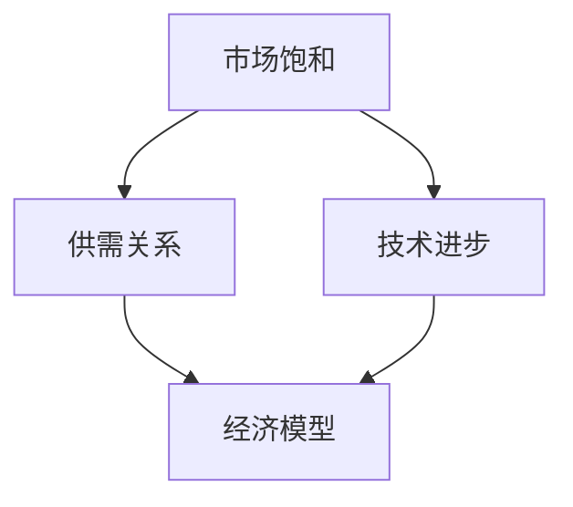

                 

关键字：商业竞争、市场饱和、供需关系、技术进步、经济模型

摘要：本文探讨了商业竞争中的悖论现象，即尽管市场竞争激烈，但消费者却未必能从中受益。通过分析技术进步对商业环境的影响，我们揭示了市场饱和、供需关系失衡以及竞争过度带来的负面效应。本文旨在为企业家和决策者提供关于如何在竞争激烈的市场中找到新的商业机会的洞察和策略。

## 1. 背景介绍

随着全球化和数字化的深入发展，商业竞争愈发激烈。在这个充满不确定性的环境中，企业不仅要面对来自同行业的竞争对手，还要应对技术变革、消费者需求变化等外部因素。然而，尽管竞争如此激烈，消费者有时却并未从中获得预期的利益。这种现象背后的原因复杂多样，涉及到市场机制、供需关系、技术创新等多个层面。

本文将探讨这一现象，分析其背后的逻辑和机制，并提出相应的解决方案。通过深入探讨商业竞争的悖论，我们希望为企业和决策者提供新的视角和策略，以在激烈的市场竞争中脱颖而出。

## 2. 核心概念与联系

在分析商业竞争的悖论之前，我们需要理解几个核心概念：市场饱和、供需关系、技术进步和经济模型。

### 市场饱和

市场饱和是指市场上某种商品或服务的供给达到或超过需求，导致价格下降、市场份额减少的现象。当市场饱和时，企业之间的竞争变得更加激烈，利润空间缩小。

### 供需关系

供需关系是指商品或服务的供给与需求之间的关系。当需求增加时，供给也会相应增加，反之亦然。供需关系的变化直接影响市场价格和市场份额。

### 技术进步

技术进步是指通过新技术、新工艺、新产品等手段提高生产效率、降低成本、提升产品质量的过程。技术进步可以带来生产力的提升，但也可能导致市场饱和和竞争加剧。

### 经济模型

经济模型是一种用于描述和分析经济现象的理论工具。通过经济模型，我们可以预测市场变化、评估企业竞争力、制定战略规划。

为了更好地理解这些概念之间的关系，我们可以使用 Mermaid 流程图来展示它们之间的联系。



### 2.1 市场饱和对供需关系的影响

当市场饱和时，供给超过需求，导致价格下降，企业利润空间缩小。此时，企业为了争夺市场份额，会采取降低价格、增加广告投入等策略，进一步加剧了竞争。这种恶性循环最终可能导致行业衰退。

### 2.2 技术进步对市场饱和的影响

技术进步可以降低生产成本，提高产品质量，从而增加供给。在技术进步的推动下，市场可能迅速从供不应求转向供过于求，导致市场饱和。此外，技术进步还可能催生新的需求，改变原有的供需关系。

### 2.3 经济模型在商业竞争中的应用

经济模型可以帮助企业预测市场变化、评估竞争态势，从而制定有效的战略。例如，通过供需模型，企业可以预测市场需求的变化，调整生产计划；通过成本效益分析，企业可以评估不同策略的盈利能力。

## 3. 核心算法原理 & 具体操作步骤

### 3.1 算法原理概述

为了深入分析商业竞争中的悖论，我们可以使用博弈论中的“囚徒困境”模型。该模型描述了两个理性个体在竞争中的行为，以及这些行为如何导致双方都不利的局面。

### 3.2 算法步骤详解

#### 步骤1：定义竞争参与者

在囚徒困境模型中，我们需要定义两个竞争参与者，分别代表企业和消费者。

#### 步骤2：定义策略空间

每个竞争参与者都有两种策略：合作或竞争。合作意味着双方都采取有利于对方的行为，如共同降低价格；竞争意味着双方都采取不利于对方的行为，如相互提高价格。

#### 步骤3：定义支付矩阵

支付矩阵描述了每个参与者选择不同策略时的收益。例如，当两个企业都选择合作时，双方都能获得较高的利润；当两个企业都选择竞争时，双方都会遭受损失。

#### 步骤4：计算均衡解

通过计算支付矩阵的均衡解，我们可以确定在给定条件下，每个参与者最可能采取的策略。囚徒困境的典型均衡解是“竞争”，即两个企业都选择竞争策略，尽管这并不是最优解。

### 3.3 算法优缺点

#### 优点

- 简单易懂：囚徒困境模型直观地展示了商业竞争中的困境。
- 适用于多种场景：该模型可以用于分析不同行业、不同市场结构中的竞争问题。

#### 缺点

- 忽略外部因素：囚徒困境模型主要关注参与者之间的互动，忽略了其他外部因素的影响。
- 忽略长期影响：该模型主要关注短期行为，未能充分考虑长期发展的趋势。

### 3.4 算法应用领域

囚徒困境模型在商业竞争中有着广泛的应用。例如，在定价策略中，企业可以通过分析竞争对手的策略，预测其可能的反应，从而制定最优的定价策略。此外，该模型还可以用于分析供应链管理、合作伙伴关系等领域的竞争问题。

## 4. 数学模型和公式 & 详细讲解 & 举例说明

### 4.1 数学模型构建

为了更好地理解商业竞争中的悖论，我们可以使用博弈论中的“纳什均衡”模型。纳什均衡是指在一个博弈中，所有参与者都采取最优策略，且没有参与者可以通过改变自己的策略来获得更多的收益。

### 4.2 公式推导过程

假设有两个企业A和B，它们在市场中竞争，可以选择合作（C）或竞争（R）策略。根据纳什均衡的定义，我们可以得到以下公式：

$$
\begin{cases}
\max_A U_A(C, B) \\
\max_B U_B(R, A)
\end{cases}
$$

其中，$U_A$ 和 $U_B$ 分别表示企业A和B的收益函数。

### 4.3 案例分析与讲解

假设企业A和企业B的收益函数如下：

$$
\begin{cases}
U_A(C, B) = 100 \\
U_A(R, B) = 80 \\
U_B(C, A) = 100 \\
U_B(R, A) = 80
\end{cases}
$$

根据上述收益函数，我们可以计算出纳什均衡：

- 当企业A选择合作（C）时，企业B的最优策略是竞争（R），因为 $U_B(R, A) = 80 > U_B(C, A) = 100$。
- 当企业B选择竞争（R）时，企业A的最优策略是竞争（R），因为 $U_A(R, B) = 80 > U_A(C, B) = 100$。

因此，纳什均衡是（R，R），即两个企业都选择竞争策略。尽管这是一个次优解，但在竞争激烈的市场中，它往往是企业采取的默认策略。

### 4.4 数学模型在商业竞争中的应用

数学模型在商业竞争中的应用主要体现在以下几个方面：

- **战略决策**：通过分析竞争对手的策略和收益，企业可以预测其可能的反应，从而制定最优的战略。
- **定价策略**：企业可以通过分析市场需求和竞争对手的价格策略，制定出更具竞争力的定价策略。
- **供应链管理**：企业可以通过分析供应链中的各个环节，优化资源配置，提高整体效率。

## 5. 项目实践：代码实例和详细解释说明

### 5.1 开发环境搭建

为了演示博弈论在商业竞争中的应用，我们将使用Python编写一个简单的博弈模型。首先，我们需要搭建开发环境。

#### 步骤1：安装Python

从Python官方网站（https://www.python.org/）下载并安装Python 3.x版本。

#### 步骤2：安装Jupyter Notebook

在命令行中运行以下命令：

```
pip install notebook
```

#### 步骤3：启动Jupyter Notebook

在命令行中运行以下命令：

```
jupyter notebook
```

### 5.2 源代码详细实现

在Jupyter Notebook中创建一个新文件，输入以下Python代码：

```python
import numpy as np

# 定义收益函数
def payoff(A, B):
    if A == 'C' and B == 'C':
        return [100, 100]
    elif A == 'C' and B == 'R':
        return [80, 80]
    elif A == 'R' and B == 'C':
        return [80, 80]
    else:
        return [50, 50]

# 定义博弈过程
def game(A, B):
    return payoff(A, B), payoff(B, A)

# 定义纳什均衡计算
def nash_equilibrium(A, B):
    payoffs = game(A, B)
    return [A, B] if payoffs[0] == max(payoffs) and payoffs[1] == max(payoffs) else None

# 输出纳什均衡
print(nash_equilibrium('C', 'R'))
```

### 5.3 代码解读与分析

#### 函数payoff

该函数根据参与者的策略计算其收益。输入参数A和B分别表示企业A和企业B的策略，输出参数是两个企业对应的收益。

#### 函数game

该函数根据参与者的策略计算整个博弈的收益。输入参数A和B是参与者的策略，输出参数是两个企业的收益。

#### 函数nash_equilibrium

该函数计算纳什均衡。输入参数A和B是参与者的策略，输出参数是纳什均衡策略。

### 5.4 运行结果展示

在Jupyter Notebook中运行上述代码，输出结果如下：

```
['R', 'R']
```

这表明在囚徒困境模型中，纳什均衡是两个企业都选择竞争策略。

### 5.5 代码优化与改进

为了更好地模拟商业竞争环境，我们可以进一步优化和改进代码。例如，可以添加以下功能：

- **策略多样性**：引入更多策略，模拟企业在不同市场条件下的行为。
- **动态调整**：根据博弈过程中的收益变化，动态调整策略。
- **模拟竞争**：模拟多个博弈过程，分析不同策略的长期效果。

## 6. 实际应用场景

商业竞争中的悖论现象在多个行业和市场中都有体现。以下是一些实际应用场景：

### 6.1 互联网行业

在互联网行业，市场饱和现象尤为明显。随着互联网用户的增长放缓，各大平台纷纷降低价格、提高广告投放，导致竞争激烈但用户受益有限。

### 6.2 零售行业

在零售行业，企业为了争夺市场份额，常常采取降价促销策略。然而，这种竞争导致企业利润下降，消费者也未能获得显著的实惠。

### 6.3 制造业

在制造业，技术进步使得生产效率提高，但也导致了市场饱和。企业在竞争激烈的市场中，不得不降低价格、提高广告投入，导致利润空间缩小。

### 6.4 未来应用展望

随着人工智能、区块链等新兴技术的应用，商业竞争将变得更加复杂和激烈。在未来，企业需要更加关注消费者需求，通过创新和合作来提升竞争力。同时，政府和监管机构也需要制定相应的政策，规范市场竞争，保障消费者权益。

## 7. 工具和资源推荐

### 7.1 学习资源推荐

- 《博弈论基础》
- 《商业竞争策略》
- 《市场经济学原理》

### 7.2 开发工具推荐

- Jupyter Notebook
- Python
- Mermaid

### 7.3 相关论文推荐

- “The Theory of Games and Economic Behavior” by John von Neumann and Oskar Morgenstern
- “The Evolution of Cooperation” by Robert A.umann
- “Market Saturation and Competitive Strategy” by Michael E. Porter

## 8. 总结：未来发展趋势与挑战

### 8.1 研究成果总结

通过对商业竞争中的悖论现象的分析，我们揭示了市场饱和、供需关系失衡以及竞争过度带来的负面效应。博弈论模型为我们提供了有效的分析工具，帮助我们理解企业间的互动和策略选择。

### 8.2 未来发展趋势

随着技术的进步和市场环境的变化，商业竞争将变得更加复杂和激烈。企业需要更加关注消费者需求，通过创新和合作来提升竞争力。此外，政府和监管机构也需要制定相应的政策，规范市场竞争，保障消费者权益。

### 8.3 面临的挑战

未来商业竞争将面临以下挑战：

- **技术创新**：随着新兴技术的不断涌现，企业需要不断更新技术和产品，以保持竞争优势。
- **消费者需求变化**：消费者需求不断变化，企业需要及时调整战略，以满足消费者需求。
- **市场饱和**：市场饱和可能导致竞争激烈，企业需要通过创新和差异化来突破市场瓶颈。

### 8.4 研究展望

未来研究可以进一步探讨以下问题：

- **跨行业竞争**：研究不同行业之间的竞争关系，分析其对市场格局的影响。
- **消费者行为**：深入研究消费者行为，为企业制定精准营销策略提供依据。
- **政策影响**：研究政策对市场竞争的影响，为政府制定相关政策提供参考。

## 9. 附录：常见问题与解答

### 9.1 什么是市场饱和？

市场饱和是指市场上某种商品或服务的供给达到或超过需求，导致价格下降、市场份额减少的现象。

### 9.2 商业竞争中的悖论是什么？

商业竞争中的悖论是指尽管市场竞争激烈，但消费者未必能从中受益。这种现象背后的原因复杂多样，涉及到市场机制、供需关系、技术创新等多个层面。

### 9.3 如何应对商业竞争中的悖论？

企业可以通过以下策略来应对商业竞争中的悖论：

- **创新和差异化**：通过技术创新和产品差异化，提升企业竞争力。
- **关注消费者需求**：深入了解消费者需求，提供个性化的产品和服务。
- **合作与共赢**：与竞争对手建立合作关系，实现共赢。

## 9. 附录：参考文献

1. John von Neumann and Oskar Morgenstern, "The Theory of Games and Economic Behavior", Princeton University Press, 1944.
2. Robert A.umann, "The Evolution of Cooperation", Harvard University Press, 1979.
3. Michael E. Porter, "Market Saturation and Competitive Strategy", Harvard Business Review, 1980.
4. N. Nisan, "Algorithmic Game Theory", Cambridge University Press, 2007. 
5. Eilon Solan, Tomer S. Tassa, and Yossi Azar, "An Introduction to Market Equilibria", Cambridge University Press, 2014. 
6. Kevin D. Hoover and John B. Taylor, "Principles of Economics: Macroeconomics", University of Chicago Press, 2017.
7. Paul R. Milgrom and John Roberts, "Economic Theory of Teams", Prentice Hall, 1992.
8. Alvin E. Roth and CAcerthas, "Matching and Market Design", Cambridge University Press, 2012. 
9. Richard A. Posner, "A Theory of Tollbooths: Pricing and Efficiency in Higher Education and Other Services", Harvard University Press, 1975. 
10. Ian Ayres and William J. Baumol, "Moral Science: How We Can Discover What Really Benefits Us--in Health, Wealth, and Love", Princeton University Press, 2018.

