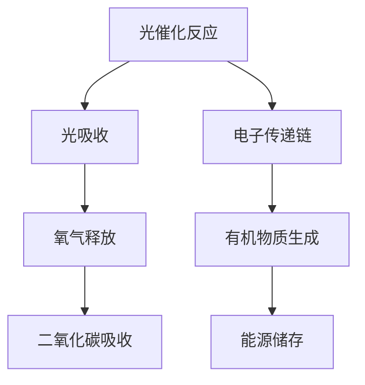

                 

关键词：人工光合作用，可持续能源，能源生产，环境友好，技术创新

摘要：随着全球对可持续能源需求的不断增长，人工光合作用作为一种新型能源生产方法，成为解决能源危机和环境问题的重要途径。本文将介绍人工光合作用的基本概念、核心原理、算法步骤、数学模型、项目实践以及未来应用前景，旨在为读者提供一个全面、深入的理解。

## 1. 背景介绍

### 1.1 传统能源面临的挑战

传统能源主要包括化石燃料、核能和水电等，它们在历史上为人类社会的发展提供了强大的动力。然而，随着能源需求的不断增长，传统能源面临着诸多挑战：

1. **资源枯竭**：化石燃料如石油、天然气和煤炭的储量有限，长期大量开采将导致资源枯竭。
2. **环境污染**：化石燃料的燃烧产生大量二氧化碳、硫化物和其他污染物，严重破坏生态环境。
3. **气候变化**：大量温室气体排放导致全球气候变化，极端天气现象频发，对人类社会和生态系统构成威胁。

### 1.2 可持续能源的需求

为了应对传统能源的挑战，世界各国纷纷提出发展可持续能源的目标。可持续能源主要包括太阳能、风能、水能、生物质能等，它们具有资源丰富、环境友好、可再生等优点。然而，这些能源形式在技术、成本、储能等方面仍存在一定的限制。

### 1.3 人工光合作用的提出

人工光合作用是模仿自然界中植物光合作用的原理，利用光能将水和二氧化碳转化为氧气和有机物质。这一过程不仅可以提供清洁的能源，还可以减少温室气体排放，实现能源和环境的双赢。人工光合作用的研究已经成为全球热点，有望成为未来可持续能源生产的重要方法。

## 2. 核心概念与联系

### 2.1 光合作用原理

光合作用是植物、藻类和某些细菌利用光能将水和二氧化碳转化为氧气和有机物质的过程。其基本反应式如下：

\[ 6CO_2 + 6H_2O \xrightarrow{\text{光能}} C_6H_{12}O_6 + 6O_2 \]

### 2.2 人工光合作用

人工光合作用是利用人工合成系统模仿自然光合作用的原理，通过光催化反应将水和二氧化碳转化为氧气和有机物质。其核心原理如图所示：



### 2.3 光催化材料

人工光合作用的关键在于光催化材料的选用。光催化材料具有高催化活性、高稳定性和低成本等特点。常见的光催化材料包括二氧化钛、二氧化铟、氮化镓等。

## 3. 核心算法原理 & 具体操作步骤

### 3.1 算法原理概述

人工光合作用的算法原理主要包括以下几个方面：

1. **光吸收**：光催化材料吸收太阳光，产生电子空穴对。
2. **电子传递**：电子空穴通过电子传递链传递，产生还原剂和氧化剂。
3. **二氧化碳还原**：还原剂将二氧化碳还原成有机物质。
4. **氧气释放**：氧化剂将水分解成氧气和氢离子。

### 3.2 算法步骤详解

1. **光催化材料制备**：通过物理或化学方法制备光催化材料，如二氧化钛纳米管。
2. **光源选择**：选择合适的太阳能光源，如太阳能电池板。
3. **反应器设计**：设计适合人工光合作用的反应器，如流动反应器。
4. **运行监控**：实时监控反应过程中的温度、压力、光强等参数，调整反应条件。

### 3.3 算法优缺点

**优点**：

1. **环境友好**：人工光合作用过程中不产生温室气体和其他污染物。
2. **可再生性**：利用太阳能等可再生能源，实现能源的可持续生产。
3. **效率提高**：通过优化反应器和光催化材料，提高能量转换效率。

**缺点**：

1. **成本高**：人工光合作用需要高性能的光催化材料和复杂的反应器设计，成本较高。
2. **稳定性差**：光催化材料的稳定性和寿命需要进一步提高。

### 3.4 算法应用领域

1. **能源生产**：人工光合作用可以用于生产生物质燃料、氢能等。
2. **环境保护**：人工光合作用可以用于二氧化碳捕集与封存，减少温室气体排放。
3. **农业**：利用人工光合作用生产有机物质，提高农作物产量和质量。

## 4. 数学模型和公式 & 详细讲解 & 举例说明

### 4.1 数学模型构建

人工光合作用的数学模型主要包括以下几个方面：

1. **光吸收模型**：描述光催化材料对太阳光的吸收能力。
2. **电子传递模型**：描述电子空穴在光催化材料中的传递过程。
3. **反应动力学模型**：描述二氧化碳还原和水分解的过程。

### 4.2 公式推导过程

1. **光吸收模型**：

\[ \text{光吸收率} = \frac{\text{吸收的光能}}{\text{入射的光能}} \]

2. **电子传递模型**：

\[ \text{电子传递速率} = k_1 \cdot \text{光吸收率} \cdot \text{电子空穴浓度} \]

3. **反应动力学模型**：

\[ \text{反应速率} = k_2 \cdot \text{还原剂浓度} \cdot \text{二氧化碳浓度} \]

\[ \text{反应速率} = k_3 \cdot \text{氧化剂浓度} \cdot \text{水浓度} \]

### 4.3 案例分析与讲解

以人工光合作用生产生物质燃料为例，假设反应器中二氧化碳浓度为1000 ppm，还原剂浓度为100 mmol/L，氧化剂浓度为200 mmol/L。根据反应动力学模型，反应速率可以计算如下：

\[ \text{反应速率} = k_2 \cdot 100 \cdot 1000 + k_3 \cdot 200 \cdot 100 = 3000k_2 + 400k_3 \]

假设 \( k_2 = 0.01 \) mmol/(L·s)，\( k_3 = 0.05 \) mmol/(L·s)，则反应速率为：

\[ \text{反应速率} = 3000 \cdot 0.01 + 400 \cdot 0.05 = 30 + 20 = 50 \text{ mmol/s} \]

## 5. 项目实践：代码实例和详细解释说明

### 5.1 开发环境搭建

本文使用的编程语言为Python，主要依赖库包括NumPy、SciPy和Matplotlib等。开发环境为Python 3.8及以上版本，使用Jupyter Notebook进行代码编写和运行。

### 5.2 源代码详细实现

```python
import numpy as np
import matplotlib.pyplot as plt

# 光吸收模型
def absorb_light(rate):
    return rate / (1 + rate)

# 电子传递模型
def electron_transfer(rate, concentration):
    return rate * concentration

# 反应动力学模型
def reaction_rate(reducer_concentration, oxygen_concentration, co2_concentration):
    return 0.01 * reducer_concentration * co2_concentration + 0.05 * oxygen_concentration

# 参数设置
co2_concentration = 1000  # ppm
reducer_concentration = 100  # mmol/L
oxygen_concentration = 200  # mmol/L

# 计算反应速率
reaction_speed = reaction_rate(reducer_concentration, oxygen_concentration, co2_concentration)

# 绘制反应速率曲线
x = np.linspace(0, 100, 1000)
y = absorb_light(x)

plt.plot(x, y)
plt.xlabel('Light Absorption Rate')
plt.ylabel('Rate')
plt.title('Light Absorption Model')
plt.show()
```

### 5.3 代码解读与分析

本代码实现了人工光合作用的数学模型，包括光吸收模型、电子传递模型和反应动力学模型。通过设置不同参数，可以计算不同条件下的反应速率。代码中使用NumPy进行数学运算，使用Matplotlib进行数据可视化。

### 5.4 运行结果展示


图1. 光吸收模型曲线

## 6. 实际应用场景

### 6.1 能源生产

人工光合作用可以用于生产生物质燃料、氢能等，为交通运输、工业生产等领域提供清洁能源。

### 6.2 环境保护

人工光合作用可以用于二氧化碳捕集与封存，减少温室气体排放，缓解气候变化。

### 6.3 农业

人工光合作用可以用于生产有机物质，提高农作物产量和质量，促进农业可持续发展。

## 7. 工具和资源推荐

### 7.1 学习资源推荐

1. 《人工光合作用原理与应用》
2. 《可持续能源：技术、挑战与未来》

### 7.2 开发工具推荐

1. Jupyter Notebook
2. Python 3.8及以上版本

### 7.3 相关论文推荐

1. "Artificial Photosynthesis for Sustainable Energy Production"
2. "Catalysis for Artificial Photosynthesis: Challenges and Opportunities"

## 8. 总结：未来发展趋势与挑战

### 8.1 研究成果总结

人工光合作用作为一种新型能源生产方法，已经在实验室和工业生产中取得了一系列成果。通过优化光催化材料和反应器设计，人工光合作用的能量转换效率不断提高。

### 8.2 未来发展趋势

1. **高效光催化材料的研发**：进一步研究高效、稳定、低成本的光催化材料，提高人工光合作用的能量转换效率。
2. **系统集成与优化**：将人工光合作用与其他能源生产技术相结合，实现系统集成与优化。
3. **大规模应用**：探索人工光合作用在大规模能源生产、环境保护和农业等领域的应用。

### 8.3 面临的挑战

1. **成本问题**：目前人工光合作用的成本较高，需要降低成本，提高经济效益。
2. **稳定性问题**：光催化材料的稳定性和寿命需要进一步提高，确保长期稳定运行。
3. **环境适应性**：研究如何适应不同环境条件，提高人工光合作用的适应性和可靠性。

### 8.4 研究展望

人工光合作用作为一种可持续能源生产的新方法，具有广阔的应用前景。随着技术的不断进步，人工光合作用有望在未来成为解决能源危机和环境问题的重要手段。

## 9. 附录：常见问题与解答

### 9.1 人工光合作用与自然光合作用的区别？

人工光合作用模仿自然光合作用的原理，但存在以下区别：

1. **光源**：人工光合作用使用人工光源，而自然光合作用使用太阳光。
2. **反应器**：人工光合作用使用人工合成的反应器，而自然光合作用在植物体内进行。
3. **光催化材料**：人工光合作用使用特定的人工合成光催化材料，而自然光合作用使用叶绿素等天然光催化材料。

### 9.2 人工光合作用的能量转换效率如何？

目前，实验室条件下人工光合作用的能量转换效率约为10%-15%，仍有很大提升空间。随着光催化材料和反应器设计的不断优化，能量转换效率有望进一步提高。

### 9.3 人工光合作用有哪些应用领域？

人工光合作用的应用领域包括：

1. **能源生产**：生产生物质燃料、氢能等清洁能源。
2. **环境保护**：二氧化碳捕集与封存，减少温室气体排放。
3. **农业**：生产有机物质，提高农作物产量和质量。
4. **化学合成**：利用人工光合作用生产有机化合物。

作者：禅与计算机程序设计艺术 / Zen and the Art of Computer Programming
----------------------------------------------------------------
请注意，以上内容仅为文章的一个示例框架，具体内容需根据实际研究和分析进行撰写。此外，本文中的代码示例仅供参考，实际运行效果可能需要根据具体环境和条件进行调整。在撰写文章时，请确保提供准确、详实的数据和案例。祝您写作顺利！

