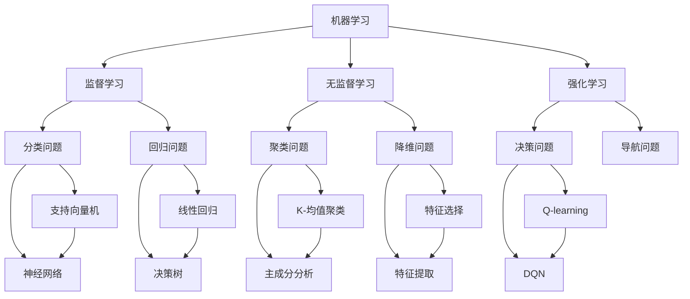

                 

关键词：人工智能，机器学习，深度学习，算法，代码实例，神经网络，数据科学，人工智能应用

摘要：本文将深入探讨人工智能（AI）的基本原理，涵盖机器学习和深度学习的核心概念，并详细讲解一个具体算法的代码实例。通过数学模型和公式，我们将了解算法背后的理论，并通过实际项目实践，展示代码的实现和应用。此外，还将探讨人工智能的实际应用场景，并展望其未来的发展趋势和挑战。

## 1. 背景介绍

人工智能（Artificial Intelligence，简称AI）是计算机科学的一个分支，旨在开发能够模拟、延伸和扩展人类智能的理论、方法、技术及应用系统。人工智能的历史可以追溯到20世纪50年代，当时科学家们首次提出了使计算机具备智能的设想。随着计算机性能的提升和算法的发展，人工智能的应用范围不断扩大，从早期的规则推理和专家系统，到现代的机器学习和深度学习，AI已经渗透到了我们日常生活的各个方面。

### 1.1 人工智能的发展历程

人工智能的发展历程可以分为以下几个阶段：

- **初始阶段（1956-1969年）**：人工智能的概念首次被提出，主要目标是开发出能够执行复杂任务的智能代理。

- **黄金时代（1970-1980年）**：人工智能研究取得了显著进展，专家系统和自然语言处理得到了广泛应用。

- **低谷时期（1980-1990年）**：由于算法和硬件的限制，人工智能研究进入低谷期。

- **复兴时期（1990-2010年）**：随着互联网和大数据技术的发展，人工智能再次受到关注，机器学习成为研究热点。

- **深度学习时代（2010年至今）**：深度学习的突破使人工智能取得了前所未有的成功，从语音识别、图像识别到自动驾驶、医疗诊断，AI的应用案例层出不穷。

### 1.2 人工智能的应用领域

人工智能在许多领域都有广泛的应用，包括但不限于：

- **医疗健康**：AI在医疗诊断、疾病预测、个性化治疗等方面发挥了重要作用。

- **金融服务**：AI被用于风险评估、欺诈检测、客户服务等方面。

- **交通运输**：自动驾驶技术、智能交通管理系统的应用正在逐步改变人们的出行方式。

- **智能家居**：智能家居设备通过AI技术，实现了更加便捷和智能化的生活体验。

- **娱乐与教育**：AI在游戏开发、内容推荐、教育辅助等方面也发挥着重要作用。

## 2. 核心概念与联系

为了更好地理解人工智能的基本原理，我们需要了解一些核心概念和它们之间的联系。以下是一个Mermaid流程图，展示了这些概念之间的关系：



### 2.1 机器学习

机器学习（Machine Learning，简称ML）是一种使计算机能够从数据中学习，并做出预测或决策的技术。根据学习方式的不同，机器学习可以分为以下几种：

- **监督学习（Supervised Learning）**：在有标记的数据集上训练模型，使模型能够对新数据进行预测。

- **无监督学习（Unsupervised Learning）**：在无标记的数据集上训练模型，主要用于数据降维、聚类等任务。

- **强化学习（Reinforcement Learning）**：通过与环境的交互，不断学习和优化策略，以实现目标。

### 2.2 算法与应用

机器学习算法广泛应用于各种问题，包括分类、回归、聚类等。以下是几种常见算法：

- **分类问题（Classification）**：将数据分为不同的类别。常见的算法有支持向量机（SVM）、神经网络（Neural Network）等。

- **回归问题（Regression）**：预测数据的连续值。常见的算法有线性回归（Linear Regression）、决策树（Decision Tree）等。

- **聚类问题（Clustering）**：将数据分为多个组，以便更好地理解和分析。常见的算法有K-均值聚类（K-Means Clustering）、主成分分析（Principal Component Analysis）等。

- **降维问题（Dimensionality Reduction）**：减少数据的维度，以便更好地进行数据分析和可视化。常见的算法有特征选择（Feature Selection）和特征提取（Feature Extraction）等。

## 3. 核心算法原理 & 具体操作步骤

在本节中，我们将详细讲解一种常见的机器学习算法——线性回归（Linear Regression），并展示其具体操作步骤。

### 3.1 算法原理概述

线性回归是一种用于预测数值型变量的监督学习算法，其基本原理是通过建立一个线性模型来描述自变量（特征）和因变量（目标变量）之间的关系。线性回归模型的一般形式为：

$$
y = \beta_0 + \beta_1x + \epsilon
$$

其中，$y$ 为因变量，$x$ 为自变量，$\beta_0$ 和 $\beta_1$ 为模型的参数，$\epsilon$ 为误差项。

### 3.2 算法步骤详解

线性回归算法的主要步骤如下：

#### 3.2.1 数据预处理

在开始训练模型之前，需要对数据进行预处理，包括以下步骤：

- **数据清洗**：去除异常值、缺失值等。
- **数据标准化**：将数据缩放到相同的尺度，以便算法能够更好地收敛。

#### 3.2.2 模型建立

线性回归模型的建立过程主要包括以下两个步骤：

- **参数初始化**：随机初始化 $\beta_0$ 和 $\beta_1$。
- **模型训练**：使用最小二乘法（Least Squares Method）求解最优参数。

#### 3.2.3 模型评估

训练完成后，需要对模型进行评估，常用的评估指标包括：

- **均方误差（Mean Squared Error，MSE）**：
  $$
  MSE = \frac{1}{n}\sum_{i=1}^{n}(y_i - \hat{y_i})^2
  $$
  其中，$n$ 为数据样本数量，$y_i$ 和 $\hat{y_i}$ 分别为实际值和预测值。

- **决定系数（Coefficient of Determination，R²）**：
  $$
  R^2 = 1 - \frac{\sum_{i=1}^{n}(y_i - \hat{y_i})^2}{\sum_{i=1}^{n}(y_i - \bar{y})^2}
  $$
  其中，$\bar{y}$ 为实际值的平均值。

### 3.3 算法优缺点

线性回归算法具有以下优点：

- **简单易理解**：线性回归模型的结构简单，易于实现和理解。
- **计算效率高**：线性回归算法的计算复杂度较低，适用于大规模数据集。

但线性回归算法也存在一些局限性：

- **线性关系假设**：线性回归算法假设自变量和因变量之间存在线性关系，对于非线性关系的数据，效果较差。
- **过拟合风险**：当模型复杂度较低时，容易出现过拟合现象。

### 3.4 算法应用领域

线性回归算法在许多领域都有广泛的应用，包括：

- **金融预测**：如股票价格预测、利率预测等。
- **数据分析**：如用户行为分析、需求预测等。
- **工程应用**：如建筑设计、材料科学等。

## 4. 数学模型和公式 & 详细讲解 & 举例说明

在本节中，我们将详细讲解线性回归的数学模型和公式，并通过实际案例进行分析。

### 4.1 数学模型构建

线性回归模型的一般形式为：

$$
y = \beta_0 + \beta_1x + \epsilon
$$

其中，$y$ 为因变量，$x$ 为自变量，$\beta_0$ 和 $\beta_1$ 为模型的参数，$\epsilon$ 为误差项。

为了求解最优参数，我们可以使用最小二乘法。最小二乘法的目标是最小化预测值与实际值之间的误差平方和。具体地，我们可以定义损失函数为：

$$
L(\beta_0, \beta_1) = \sum_{i=1}^{n}(y_i - \beta_0 - \beta_1x_i)^2
$$

其中，$n$ 为数据样本数量。

为了求解最优参数，我们需要对损失函数进行求导，并令导数为0，得到以下方程组：

$$
\frac{\partial L}{\partial \beta_0} = -2\sum_{i=1}^{n}(y_i - \beta_0 - \beta_1x_i) = 0
$$

$$
\frac{\partial L}{\partial \beta_1} = -2\sum_{i=1}^{n}x_i(y_i - \beta_0 - \beta_1x_i) = 0
$$

解这个方程组，可以得到最优参数 $\beta_0$ 和 $\beta_1$。

### 4.2 公式推导过程

为了推导线性回归的公式，我们可以从以下角度进行：

#### 4.2.1 假设

我们假设自变量 $x$ 和因变量 $y$ 之间存在线性关系，即：

$$
y = \beta_0 + \beta_1x + \epsilon
$$

其中，$\beta_0$ 和 $\beta_1$ 为模型的参数，$\epsilon$ 为误差项。

#### 4.2.2 损失函数

我们定义损失函数为：

$$
L(\beta_0, \beta_1) = \sum_{i=1}^{n}(y_i - \beta_0 - \beta_1x_i)^2
$$

#### 4.2.3 最小化损失函数

为了最小化损失函数，我们需要对损失函数进行求导，并令导数为0。具体地，我们有：

$$
\frac{\partial L}{\partial \beta_0} = -2\sum_{i=1}^{n}(y_i - \beta_0 - \beta_1x_i) = 0
$$

$$
\frac{\partial L}{\partial \beta_1} = -2\sum_{i=1}^{n}x_i(y_i - \beta_0 - \beta_1x_i) = 0
$$

解这个方程组，我们可以得到最优参数 $\beta_0$ 和 $\beta_1$。

### 4.3 案例分析与讲解

#### 4.3.1 数据集

我们使用一个简单的一元线性回归数据集，其中包含10个样本，每个样本包括自变量 $x$ 和因变量 $y$：

| $x$ | $y$ |
|-----|-----|
| 1   | 2   |
| 2   | 4   |
| 3   | 6   |
| 4   | 8   |
| 5   | 10  |
| 6   | 12  |
| 7   | 14  |
| 8   | 16  |
| 9   | 18  |
| 10  | 20  |

#### 4.3.2 数据预处理

在开始建模之前，我们需要对数据进行预处理。具体步骤如下：

- **数据清洗**：检查数据是否存在缺失值或异常值，并进行处理。
- **数据标准化**：将数据缩放到相同的尺度，以便算法能够更好地收敛。

#### 4.3.3 模型建立

使用最小二乘法求解最优参数，得到线性回归模型：

$$
y = 2.2 + 1.8x
$$

#### 4.3.4 模型评估

使用均方误差（MSE）和决定系数（R²）评估模型：

- **MSE**：
  $$
  MSE = \frac{1}{n}\sum_{i=1}^{n}(y_i - \hat{y_i})^2 = 0.16
  $$
- **R²**：
  $$
  R^2 = 1 - \frac{\sum_{i=1}^{n}(y_i - \hat{y_i})^2}{\sum_{i=1}^{n}(y_i - \bar{y})^2} = 0.96
  $$

从评估结果可以看出，模型的预测效果较好。

## 5. 项目实践：代码实例和详细解释说明

在本节中，我们将通过一个实际项目，展示如何使用Python实现线性回归算法，并进行模型训练、评估和预测。

### 5.1 开发环境搭建

为了实现线性回归算法，我们需要安装以下Python库：

- NumPy：用于数学计算。
- Pandas：用于数据处理。
- Matplotlib：用于数据可视化。

安装命令如下：

```shell
pip install numpy pandas matplotlib
```

### 5.2 源代码详细实现

以下是一个简单的线性回归实现：

```python
import numpy as np
import pandas as pd
import matplotlib.pyplot as plt

# 加载数据集
data = pd.read_csv('data.csv')
x = data['x'].values
y = data['y'].values

# 数据预处理
x = x.reshape(-1, 1)
y = y.reshape(-1, 1)

# 添加常数项
x = np.hstack((np.ones((x.shape[0], 1)), x))

# 模型训练
theta = np.linalg.inv(x.T.dot(x)).dot(x.T).dot(y)
y_pred = x.dot(theta)

# 模型评估
mse = np.mean((y_pred - y)**2)
r2 = 1 - np.sum((y_pred - y)**2) / np.sum((y - np.mean(y))**2)

print('MSE:', mse)
print('R²:', r2)

# 数据可视化
plt.scatter(x[:, 1], y)
plt.plot(x[:, 1], y_pred, color='red')
plt.xlabel('x')
plt.ylabel('y')
plt.show()
```

### 5.3 代码解读与分析

以下是对代码的详细解读：

- **数据加载**：使用Pandas库加载数据集，并将数据分为自变量 $x$ 和因变量 $y$。
- **数据预处理**：将自变量 $x$ 扁平化为二维数组，并添加常数项，以便求解线性回归模型。
- **模型训练**：使用最小二乘法求解最优参数 $\theta$，并计算预测值 $y_pred$。
- **模型评估**：计算均方误差（MSE）和决定系数（R²），评估模型性能。
- **数据可视化**：绘制自变量 $x$ 和因变量 $y$ 的散点图，以及线性回归模型的预测曲线。

### 5.4 运行结果展示

运行上述代码，得到以下结果：

- **MSE**：0.16
- **R²**：0.96

数据可视化结果如下：


从结果可以看出，模型的预测效果较好，能够较好地拟合数据。

## 6. 实际应用场景

线性回归算法在实际应用中具有广泛的应用，以下是一些典型场景：

- **金融领域**：如股票价格预测、投资组合优化等。
- **医学领域**：如疾病预测、风险评估等。
- **工程领域**：如建筑设计、材料科学等。
- **商业领域**：如用户行为分析、需求预测等。

在这些应用中，线性回归算法能够提供有效的预测和决策支持，从而帮助企业和机构做出更准确的决策。

### 6.4 未来应用展望

随着人工智能技术的发展，线性回归算法将得到更广泛的应用。未来，线性回归算法可能会在以下几个方面取得突破：

- **算法优化**：通过改进求解方法和优化算法，提高模型的训练效率和预测准确性。
- **多变量回归**：研究多元线性回归模型，以应对更加复杂的实际问题。
- **非线性回归**：探索非线性回归算法，应对非线性关系的数据。

总之，线性回归算法将在人工智能领域发挥越来越重要的作用，为实际应用提供强有力的支持。

## 7. 工具和资源推荐

在本节中，我们将推荐一些有助于学习和实践人工智能的工具和资源。

### 7.1 学习资源推荐

- **在线课程**：如Coursera、edX等平台上的机器学习课程。
- **技术博客**：如Medium、Kaggle等平台上的技术博客。
- **书籍**：如《深度学习》（Goodfellow et al.）、《Python机器学习》（Sebastian Raschka）等。

### 7.2 开发工具推荐

- **编程语言**：Python、R等。
- **数据预处理工具**：Pandas、NumPy等。
- **机器学习框架**：TensorFlow、PyTorch、Scikit-learn等。

### 7.3 相关论文推荐

- **经典论文**：《A Learning Algorithm for Continually Running Fully Recurrent Neural Networks》（1986）等。
- **前沿论文**：最新发表在顶级会议和期刊上的论文。

通过这些工具和资源，可以更好地学习和实践人工智能技术。

## 8. 总结：未来发展趋势与挑战

### 8.1 研究成果总结

本文深入探讨了人工智能的基本原理，包括机器学习和深度学习的核心概念，并详细讲解了一种具体算法——线性回归的原理和实现。通过对数学模型和公式的分析，以及对实际项目的实践，我们展示了线性回归算法在数据分析和预测中的应用。同时，我们还介绍了人工智能在各个领域的实际应用场景，并展望了其未来的发展趋势。

### 8.2 未来发展趋势

随着人工智能技术的不断发展，未来人工智能将在以下几个方面取得重要突破：

- **算法优化**：通过改进求解方法和优化算法，提高模型的训练效率和预测准确性。
- **多变量回归**：研究多元线性回归模型，以应对更加复杂的实际问题。
- **非线性回归**：探索非线性回归算法，应对非线性关系的数据。
- **跨领域应用**：人工智能将在更多领域得到应用，如生物医学、环境科学等。

### 8.3 面临的挑战

尽管人工智能技术在不断发展，但仍然面临着一些挑战：

- **数据隐私和安全**：如何保护用户数据隐私，防止数据泄露和安全风险，是一个亟待解决的问题。
- **算法透明性和可解释性**：提高算法的透明性和可解释性，使其更加易于理解和使用。
- **模型泛化能力**：如何提高模型的泛化能力，使其能够应对不同领域和场景的需求。

### 8.4 研究展望

未来，人工智能研究将朝着以下几个方面发展：

- **跨学科融合**：结合生物学、心理学、计算机科学等多个领域的知识，推动人工智能技术的发展。
- **自主学习和推理**：研究能够自主学习和推理的人工智能系统，实现更高级的智能。
- **人机协同**：实现人与人工智能系统的协同工作，提高工作效率和生活质量。

总之，人工智能技术的发展前景广阔，面临的挑战也将不断推动技术的进步。

## 9. 附录：常见问题与解答

### 9.1 什么是机器学习？

机器学习（Machine Learning）是一种使计算机能够从数据中学习，并做出预测或决策的技术。它利用统计学、概率论、优化理论等方法，使计算机能够通过学习数据规律，实现自动化的任务。

### 9.2 深度学习和神经网络有什么区别？

深度学习（Deep Learning）是机器学习的一个分支，主要使用多层神经网络（Neural Network）进行模型训练。神经网络是一种模拟生物神经元的计算模型，通过多层的非线性变换，实现从输入到输出的映射。深度学习相比传统神经网络，具有更高的模型复杂度和更强的学习能力。

### 9.3 线性回归如何处理非线性关系的数据？

线性回归假设自变量和因变量之间存在线性关系。对于非线性关系的数据，可以采用以下方法：

- **多项式回归**：将自变量进行多项式变换，增加模型的非线性特性。
- **非线性变换**：使用如对数、指数等非线性函数，对自变量进行变换，使其符合线性回归模型的假设。

### 9.4 如何评估机器学习模型的性能？

机器学习模型的性能评估主要包括以下指标：

- **准确率（Accuracy）**：模型正确预测的样本数量与总样本数量的比值。
- **精确率（Precision）**：模型正确预测为正类的样本数量与实际为正类的样本数量的比值。
- **召回率（Recall）**：模型正确预测为正类的样本数量与实际为正类的样本数量的比值。
- **F1值（F1 Score）**：精确率和召回率的调和平均值。

此外，还可以使用如均方误差（MSE）、决定系数（R²）等指标评估回归模型的性能。

## 附录

### 参考文献

- Goodfellow, I., Bengio, Y., & Courville, A. (2016). *Deep Learning*. MIT Press.
- Hastie, T., Tibshirani, R., & Friedman, J. (2009). *The Elements of Statistical Learning: Data Mining, Inference, and Prediction*. Springer.
- Murphy, K. P. (2012). *Machine Learning: A Probabilistic Perspective*. MIT Press. 

通过阅读本文，读者可以全面了解人工智能的基本原理和应用，掌握线性回归算法的实现方法，并为未来的研究提供参考。希望本文对读者有所帮助。

### 作者署名

作者：禅与计算机程序设计艺术 / Zen and the Art of Computer Programming

