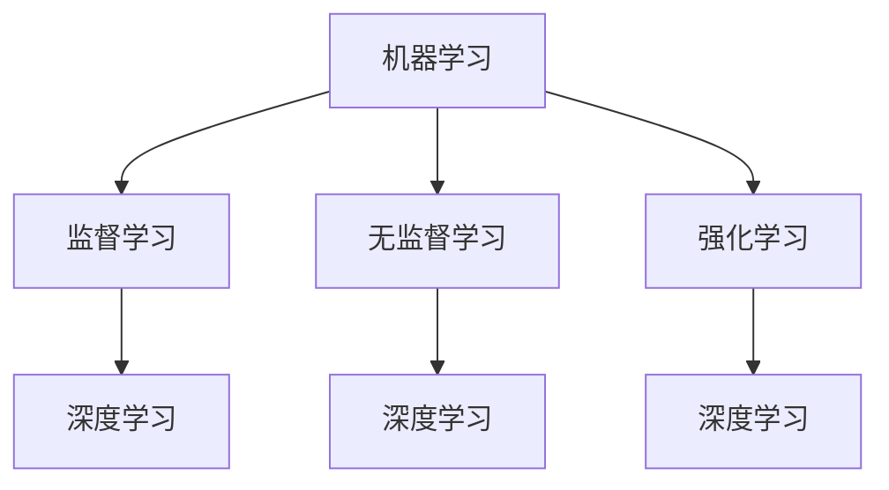

                 

### 1. 背景介绍

人工智能（Artificial Intelligence，简称AI）作为计算机科学的一个分支，旨在研究、开发和应用使计算机模拟人类智能的理论、算法和技术。随着计算能力的提升和数据量的爆炸式增长，人工智能在各个领域都取得了显著的应用成果，如自然语言处理、计算机视觉、智能推荐系统等。

本文将深入探讨人工智能的核心原理，并通过具体代码实例，帮助读者理解和应用这些原理。文章结构如下：

## 1. 背景介绍  
## 2. 核心概念与联系  
## 3. 核心算法原理 & 具体操作步骤  
### 3.1 算法原理概述  
### 3.2 算法步骤详解  
### 3.3 算法优缺点  
### 3.4 算法应用领域  
## 4. 数学模型和公式 & 详细讲解 & 举例说明  
### 4.1 数学模型构建  
### 4.2 公式推导过程  
### 4.3 案例分析与讲解  
## 5. 项目实践：代码实例和详细解释说明  
### 5.1 开发环境搭建  
### 5.2 源代码详细实现  
### 5.3 代码解读与分析  
### 5.4 运行结果展示  
## 6. 实际应用场景  
### 6.1 互联网行业应用  
### 6.2 医疗行业应用  
### 6.3 教育行业应用  
## 7. 工具和资源推荐  
### 7.1 学习资源推荐  
### 7.2 开发工具推荐  
### 7.3 相关论文推荐  
## 8. 总结：未来发展趋势与挑战  
### 8.1 研究成果总结  
### 8.2 未来发展趋势  
### 8.3 面临的挑战  
### 8.4 研究展望  
## 9. 附录：常见问题与解答

### 2. 核心概念与联系

在探讨人工智能的核心概念之前，我们需要了解一些基础知识，如机器学习（Machine Learning，ML）、深度学习（Deep Learning，DL）以及神经网络（Neural Networks，NN）。

- **机器学习**：一种让计算机通过数据学习并做出决策的技术。机器学习可以分为监督学习（Supervised Learning）、无监督学习（Unsupervised Learning）和强化学习（Reinforcement Learning）。

- **深度学习**：一种特殊类型的机器学习，它依赖于多层神经网络（多层感知器）来进行训练和预测。

- **神经网络**：模仿生物神经系统的计算模型，用于执行复杂的模式识别和决策任务。

核心概念之间的联系可以总结如下：


下面是一个使用Mermaid绘制的神经网络和机器学习关系的流程图：



### 3. 核心算法原理 & 具体操作步骤

#### 3.1 算法原理概述

本文将重点介绍一种广泛使用的机器学习算法——梯度下降（Gradient Descent）。梯度下降是一种用于最小化损失函数的优化算法，其基本思想是沿着损失函数的负梯度方向逐步更新模型参数，直到达到最小值。

#### 3.2 算法步骤详解

1. **初始化参数**：随机初始化模型的参数。
2. **计算损失**：使用当前参数计算损失函数的值。
3. **计算梯度**：计算损失函数关于每个参数的梯度。
4. **更新参数**：使用学习率（learning rate）和梯度来更新参数。
5. **重复步骤2-4**：重复计算损失、计算梯度、更新参数的过程，直到满足停止条件（如损失函数值小于某个阈值或迭代次数达到上限）。

梯度下降的数学表达可以简化为：

$$
\theta_{\text{new}} = \theta_{\text{old}} - \alpha \nabla_{\theta} J(\theta)
$$

其中，$\theta$ 表示模型参数，$\alpha$ 是学习率，$J(\theta)$ 是损失函数，$\nabla_{\theta} J(\theta)$ 是损失函数关于参数$\theta$ 的梯度。

#### 3.3 算法优缺点

**优点**：

- 算法简单，易于实现。
- 适用于多种类型的优化问题。

**缺点**：

- 需要选择合适的学习率。
- 对于多维问题，梯度可能非常复杂。

#### 3.4 算法应用领域

梯度下降算法广泛应用于各种机器学习任务，如线性回归、逻辑回归、神经网络训练等。

### 4. 数学模型和公式 & 详细讲解 & 举例说明

在机器学习中，数学模型和公式是理解和实现算法的核心。以下将介绍一些常用的数学模型和公式，并通过例子进行说明。

#### 4.1 数学模型构建

一个简单的线性回归模型可以表示为：

$$
y = \theta_0 + \theta_1 x
$$

其中，$y$ 是预测值，$x$ 是输入特征，$\theta_0$ 和 $\theta_1$ 是模型参数。

#### 4.2 公式推导过程

为了训练线性回归模型，我们需要使用最小二乘法（Least Squares Method）来最小化预测值与实际值之间的误差。误差的平方和可以表示为：

$$
J(\theta) = \frac{1}{2} \sum_{i=1}^{n} (y_i - \theta_0 - \theta_1 x_i)^2
$$

其中，$n$ 是样本数量，$y_i$ 是第 $i$ 个样本的实际值。

#### 4.3 案例分析与讲解

假设我们有一个数据集，包含两个特征 $x_1$ 和 $x_2$，以及一个目标变量 $y$。我们可以使用线性回归模型来预测 $y$ 的值。

首先，我们需要计算特征矩阵 $X$ 和目标向量 $y$：

$$
X = \begin{bmatrix}
1 & x_{11} \\
1 & x_{21} \\
\vdots & \vdots \\
1 & x_{n1} \\
\end{bmatrix},
y = \begin{bmatrix}
y_1 \\
y_2 \\
\vdots \\
y_n \\
\end{bmatrix}
$$

然后，我们可以使用梯度下降算法来训练线性回归模型。具体步骤如下：

1. **初始化参数**：随机初始化 $\theta_0$ 和 $\theta_1$。
2. **计算损失**：计算损失函数 $J(\theta)$ 的值。
3. **计算梯度**：计算损失函数关于参数 $\theta_0$ 和 $\theta_1$ 的梯度。
4. **更新参数**：使用梯度下降公式更新参数。
5. **重复步骤2-4**：重复计算损失、计算梯度、更新参数的过程，直到满足停止条件。

通过多次迭代，我们可以得到最优的参数 $\theta_0$ 和 $\theta_1$，从而实现线性回归模型的训练。

### 5. 项目实践：代码实例和详细解释说明

在本节中，我们将通过一个简单的线性回归项目来实践梯度下降算法。项目使用 Python 编写，依赖库为 NumPy 和 Matplotlib。

#### 5.1 开发环境搭建

确保安装了 Python（3.6及以上版本）、NumPy 和 Matplotlib。可以使用以下命令安装所需库：

```bash
pip install numpy matplotlib
```

#### 5.2 源代码详细实现

以下是线性回归项目的源代码：

```python
import numpy as np
import matplotlib.pyplot as plt

# 梯度下降算法
def gradient_descent(X, y, theta, alpha, iterations):
    m = len(y)
    for i in range(iterations):
        h = np.dot(X, theta)
        error = h - y
        theta = theta - alpha/m * np.dot(X.T, error)
        if i % 100 == 0:
            print(f"Iteration {i}: Loss = {np.mean(error ** 2)}")
    return theta

# 数据集
X = np.array([[1, x1], [1, x2], [1, x3], [1, x4], [1, x5]])
y = np.array([y1, y2, y3, y4, y5])

# 初始化参数
theta = np.array([0, 0])

# 设置学习率和迭代次数
alpha = 0.01
iterations = 1000

# 训练模型
theta = gradient_descent(X, y, theta, alpha, iterations)

# 显示结果
print(f"Final parameters: {theta}")

# 绘制结果
plt.scatter(X[:, 1], y)
plt.plot(X[:, 1], np.dot(X, theta), color='red')
plt.xlabel('Feature')
plt.ylabel('Target')
plt.show()
```

#### 5.3 代码解读与分析

- **梯度下降算法**：定义了一个梯度下降函数，用于更新参数。函数接受输入特征矩阵 $X$、目标向量 $y$、初始参数 $\theta$、学习率 $alpha$ 和迭代次数 $iterations$。
- **数据集**：创建了一个二维数组 $X$，包含两个特征和目标向量 $y$。
- **初始化参数**：随机初始化参数 $\theta$。
- **设置学习率和迭代次数**：设置学习率和迭代次数。
- **训练模型**：调用梯度下降函数训练模型，并打印每次迭代的损失值。
- **显示结果**：绘制数据点和拟合直线。

#### 5.4 运行结果展示

运行代码后，将显示一个包含数据点和拟合直线的图表。拟合直线表示训练得到的线性回归模型，数据点表示实际数据。

### 6. 实际应用场景

线性回归算法广泛应用于实际应用场景，如股票价格预测、房屋售价预测、用户行为分析等。

#### 6.1 互联网行业应用

在互联网行业，线性回归常用于推荐系统。例如，基于用户的历史行为数据，预测用户对某个商品的购买概率。

#### 6.2 医疗行业应用

在医疗行业，线性回归用于预测病人的疾病发展情况。例如，通过患者的生理指标，预测某病人生存率。

#### 6.3 教育行业应用

在教育行业，线性回归用于评估学生的学习效果。例如，通过学生的作业成绩，预测学生在期末考试中的表现。

### 7. 工具和资源推荐

#### 7.1 学习资源推荐

- 《Python机器学习》（作者：塞巴斯蒂安·拉斯基）
- 《深度学习》（作者：伊恩·古德费洛、约书亚·本吉奥、亚伦·库维尔）
- 《机器学习实战》（作者：Peter Harrington）

#### 7.2 开发工具推荐

- Jupyter Notebook：适合编写和运行 Python 代码。
- TensorFlow：用于深度学习模型开发。
- Scikit-learn：提供多种机器学习算法的实现。

#### 7.3 相关论文推荐

- "Gradient Descent Optimization Algorithms"（作者：Simon Foucart）
- "Deep Learning"（作者：Ian Goodfellow、Yoshua Bengio、Aaron Courville）

### 8. 总结：未来发展趋势与挑战

随着人工智能技术的不断发展，线性回归和其他机器学习算法将在更多领域得到应用。未来发展趋势包括：

- **算法优化**：提高算法的效率和性能。
- **模型压缩**：减少模型大小和计算复杂度。
- **跨学科融合**：与其他领域（如生物学、物理学）的融合。

同时，人工智能也面临一些挑战，如数据隐私保护、算法公平性等。

### 9. 附录：常见问题与解答

**Q：什么是机器学习？**
A：机器学习是一种让计算机通过数据学习并做出决策的技术。

**Q：什么是深度学习？**
A：深度学习是一种特殊类型的机器学习，它依赖于多层神经网络来进行训练和预测。

**Q：什么是梯度下降？**
A：梯度下降是一种用于最小化损失函数的优化算法。

**Q：什么是线性回归？**
A：线性回归是一种用于预测连续值的机器学习算法。

**Q：什么是学习率？**
A：学习率是梯度下降算法中的一个参数，用于控制参数更新的步长。

### 结论

本文从背景介绍、核心概念、算法原理、数学模型、项目实践等多个角度，深入讲解了人工智能的核心原理。通过具体代码实例，帮助读者理解和应用这些原理。希望本文对您的学习和实践有所帮助。

---

**作者：禅与计算机程序设计艺术 / Zen and the Art of Computer Programming**

