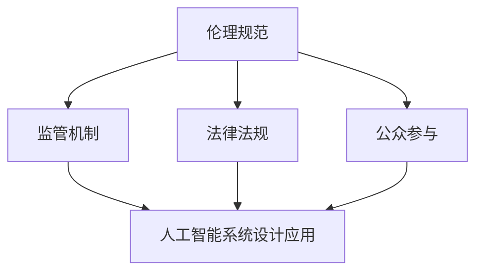

                 

在当今技术飞速发展的时代，人工智能（AI）已经成为推动社会进步的关键力量。然而，随着AI技术的广泛应用，伦理问题也日益凸显。人工智能伦理问题不仅关系到技术的可持续发展，更关乎人类社会的基本道德原则。本文将围绕人工智能伦理这一主题，探讨其在计算机领域的深远影响，以及如何通过伦理思考和道德框架来引导AI技术的发展。

> **关键词：** 人工智能伦理、计算机伦理、道德框架、AI伦理问题、道德思考

> **摘要：** 本文旨在深入探讨人工智能伦理问题，分析其核心概念、算法原理、数学模型以及实际应用场景。通过引用相关研究和实例，本文将探讨人工智能伦理的重要性，并提出未来发展的挑战与展望。

## 1. 背景介绍

### 1.1 人工智能的发展历程

人工智能（AI）的历史可以追溯到20世纪50年代。当时，计算机科学家开始探索如何让机器模拟人类的思维和行为。1956年，约翰·麦卡锡（John McCarthy）在达特茅斯会议上首次提出了“人工智能”这一术语。自此以后，人工智能领域经历了数次兴衰，但始终保持着快速的发展态势。

早期的AI研究主要集中在符号推理和逻辑编程上。1970年代，专家系统的出现使AI技术取得了显著进展。专家系统是一种基于规则的知识表示和推理方法，能够在特定领域内模拟专家的决策过程。然而，随着时间推移，专家系统在处理复杂问题时显得力不从心。

进入21世纪，机器学习和深度学习的崛起为AI领域带来了新的机遇。通过大量数据和强大的计算能力，机器学习算法能够自动从数据中学习模式和规律，并在各种任务中实现超越人类的表现。深度学习，作为一种特殊的机器学习技术，通过多层神经网络模拟人类大脑的工作机制，使得AI在图像识别、语音识别、自然语言处理等领域取得了突破性进展。

### 1.2 人工智能的应用领域

人工智能技术已经在各个领域得到广泛应用，从工业自动化、医疗诊断到智能交通、金融分析，AI正不断改变着我们的生活方式。以下是一些主要的应用领域：

- **工业自动化**：通过机器人和自动化系统提高生产效率，减少人力成本，并提高产品质量。
- **医疗诊断**：利用AI技术进行疾病诊断和治疗方案推荐，辅助医生进行精准治疗。
- **智能交通**：通过自动驾驶技术和智能交通管理系统提高交通效率，减少交通事故。
- **金融分析**：利用AI进行市场预测、风险管理、欺诈检测等，为金融机构提供决策支持。

### 1.3 人工智能伦理问题的提出

随着人工智能技术的不断进步和应用，伦理问题逐渐成为人们关注的焦点。人工智能伦理问题涉及多个方面，包括隐私、公平性、透明性、可控性和安全性等。

- **隐私问题**：人工智能系统通常需要收集和处理大量的个人数据。如何保护用户的隐私，防止数据泄露和滥用，成为亟待解决的问题。
- **公平性**：人工智能系统在决策过程中可能会存在偏见，导致不公平的结果。如何确保AI算法的公平性，避免歧视和不平等，是当前研究的重要方向。
- **透明性**：人工智能系统通常被视为“黑箱”，其决策过程难以理解。如何提高AI算法的透明性，使得人们能够理解和信任AI系统，是当前面临的一大挑战。
- **可控性**：随着AI技术的不断发展，如何确保AI系统的可控性，防止意外事件发生，是伦理问题的重要组成部分。
- **安全性**：人工智能系统在网络安全、金融安全等领域具有重要应用。如何确保AI系统的安全性，防止恶意攻击和数据泄露，是当前研究的热点问题。

## 2. 核心概念与联系

### 2.1 人工智能伦理的核心概念

人工智能伦理的核心概念包括但不限于以下几个方面：

- **隐私保护**：确保个人隐私不被侵犯，防止数据滥用和泄露。
- **公平性**：确保人工智能系统在决策过程中不偏袒特定群体，实现公平对待。
- **透明性**：提高人工智能系统的透明度，使得人们能够理解AI的决策过程。
- **可控性**：确保人工智能系统能够在可控范围内运行，避免意外事件发生。
- **安全性**：确保人工智能系统的安全，防止恶意攻击和数据泄露。

### 2.2 人工智能伦理的架构

为了应对人工智能伦理问题，需要建立一个系统的架构，包括以下几个方面：

- **伦理规范**：制定明确的伦理规范，规范人工智能系统的设计和应用。
- **监管机制**：建立监管机制，对人工智能系统的应用进行监督和管理，确保其符合伦理要求。
- **法律法规**：完善相关法律法规，为人工智能伦理提供法律依据。
- **公众参与**：鼓励公众参与人工智能伦理讨论，提高社会对伦理问题的关注度。

### 2.3 人工智能伦理的 Mermaid 流程图



## 3. 核心算法原理 & 具体操作步骤

### 3.1 算法原理概述

人工智能伦理问题的解决离不开算法的支持。以下介绍几种常见的算法原理：

- **隐私保护算法**：通过数据加密、匿名化等技术手段保护用户隐私。
- **公平性算法**：通过优化算法模型、数据预处理等方法消除算法偏见。
- **透明性算法**：通过可视化技术、解释性模型等方法提高算法透明度。
- **可控性算法**：通过引入约束条件、动态调整等方法确保算法可控性。
- **安全性算法**：通过加密技术、安全协议等方法提高算法安全性。

### 3.2 算法步骤详解

#### 3.2.1 隐私保护算法

隐私保护算法主要包括以下步骤：

1. 数据收集：收集用户数据，确保数据来源合法、合规。
2. 数据预处理：对数据进行清洗、去重、归一化等预处理操作，提高数据质量。
3. 数据加密：对敏感数据进行加密处理，确保数据在传输和存储过程中的安全性。
4. 数据匿名化：对个人身份信息进行匿名化处理，确保用户隐私不受侵犯。
5. 数据分析：在确保隐私保护的前提下，对数据进行分析，提取有价值的信息。

#### 3.2.2 公平性算法

公平性算法主要包括以下步骤：

1. 数据采集：收集多样性的数据，确保数据代表不同群体。
2. 数据预处理：对数据进行归一化、标准化等处理，消除数据差异。
3. 模型训练：使用优化算法训练模型，避免模型偏见。
4. 模型评估：评估模型在不同群体上的表现，确保公平性。
5. 模型调整：根据评估结果调整模型参数，提高公平性。

#### 3.2.3 透明性算法

透明性算法主要包括以下步骤：

1. 模型选择：选择具有解释性的模型，如决策树、规则提取等。
2. 可视化展示：通过可视化技术展示模型的决策过程，帮助用户理解。
3. 解释性分析：对模型进行解释性分析，解释模型的决策依据。
4. 用户反馈：收集用户对模型透明度的反馈，不断优化模型。

#### 3.2.4 可控性算法

可控性算法主要包括以下步骤：

1. 约束条件设置：设置合理的约束条件，确保算法在可控范围内运行。
2. 动态调整：根据环境变化动态调整算法参数，确保算法的稳定性。
3. 监控与预警：建立监控体系，及时发现异常情况，进行预警和处理。
4. 反馈机制：建立用户反馈机制，及时了解用户对算法的反馈，进行优化。

#### 3.2.5 安全性算法

安全性算法主要包括以下步骤：

1. 数据加密：对敏感数据进行加密处理，确保数据在传输和存储过程中的安全性。
2. 安全协议：建立安全协议，确保数据传输的安全性。
3. 防御攻击：通过防火墙、入侵检测等技术手段防御网络攻击。
4. 故障恢复：建立故障恢复机制，确保系统在故障情况下能够快速恢复。
5. 安全审计：定期进行安全审计，确保系统的安全性。

### 3.3 算法优缺点

#### 3.3.1 隐私保护算法

优点：

- 高效地保护用户隐私。
- 适用于各种数据类型。

缺点：

- 可能影响数据质量和分析效果。
- 加密和解密过程增加计算开销。

#### 3.3.2 公平性算法

优点：

- 提高算法的公平性，减少歧视。
- 符合社会道德规范。

缺点：

- 可能导致模型性能下降。
- 数据多样性要求较高。

#### 3.3.3 透明性算法

优点：

- 提高算法的透明度，增强用户信任。
- 帮助用户理解算法决策过程。

缺点：

- 可解释性模型性能通常较低。
- 可能增加算法实现的复杂性。

#### 3.3.4 可控性算法

优点：

- 确保算法在可控范围内运行，降低风险。
- 提高系统的稳定性。

缺点：

- 可能影响算法性能。
- 需要不断调整和优化。

#### 3.3.5 安全性算法

优点：

- 提高系统的安全性，防止恶意攻击。
- 保障数据安全和用户隐私。

缺点：

- 可能增加系统成本。
- 难以防范所有类型的攻击。

### 3.4 算法应用领域

#### 3.4.1 隐私保护算法

应用领域：

- 医疗保健：保护患者隐私，确保数据安全。
- 金融行业：保护客户隐私，防范欺诈行为。
- 社交网络：保护用户隐私，防止隐私泄露。

#### 3.4.2 公平性算法

应用领域：

- 招聘与就业：消除性别、种族等偏见，实现公平招聘。
- 信用评分：消除歧视，确保信用评估的公平性。
- 社会福利：确保社会福利资源公平分配。

#### 3.4.3 透明性算法

应用领域：

- 金融监管：提高金融监管的透明度，增强公众信任。
- 算法审计：帮助审计师评估算法的决策过程。
- 法律判决：提高法律判决的透明度，确保公正性。

#### 3.4.4 可控性算法

应用领域：

- 自动驾驶：确保自动驾驶车辆在可控范围内运行，提高安全性。
- 智能电网：确保智能电网稳定运行，减少风险。
- 医疗诊断：确保医疗诊断系统的可控性，避免误诊。

#### 3.4.5 安全性算法

应用领域：

- 网络安全：防范网络攻击，保护系统安全。
- 金融安全：防范金融欺诈，保障金融交易安全。
- 智能家居：保障智能家居系统的安全性，防止入侵。

## 4. 数学模型和公式 & 详细讲解 & 举例说明

### 4.1 数学模型构建

在人工智能伦理问题中，数学模型扮演着重要的角色。以下介绍几种常见的数学模型：

#### 4.1.1 隐私保护模型

隐私保护模型通常基于差分隐私（Differential Privacy）理论。差分隐私是一种用于保护个人隐私的数学模型，通过添加噪声来掩盖个体数据的影响，从而保护数据的隐私。

**定义**：一个随机算法 \( \mathcal{A} \) 对数据集 \( D \) 的输出是 \(\epsilon\)-差分隐私的，如果对于任何可能输出的结果 \( r \)，输出 \( r \) 的概率与输出 \( r' \) 的概率之差不超过一个与 \(\epsilon\) 相关的常数。

**公式**：

$$
\Pr[\mathcal{A}(D) = r] - \Pr[\mathcal{A}(D') = r'] \leq \epsilon
$$

其中，\( D \) 和 \( D' \) 分别为真实数据集和与真实数据集只有一个个体差异的假数据集。

#### 4.1.2 公平性模型

公平性模型通常基于公平性指标（Fairness Metrics）来评估算法的公平性。常见的公平性指标包括平等机会（Equal Opportunity）和公平性差距（Fairness Gap）。

**定义**：对于一个分类问题，平等机会指标 \( F_O \) 表示为：

$$
F_O = \frac{\sum_{i \in \text{protected}} n_i \cdot \text{accuracy}_{\text{positive}}(i)}{\sum_{i \in \text{unprotected}} n_i \cdot \text{accuracy}_{\text{positive}}(i)}
$$

其中，\( n_i \) 表示类别 \( i \) 的样本数量，\( \text{accuracy}_{\text{positive}}(i) \) 表示类别 \( i \) 的正样本准确率。

**定义**：公平性差距指标 \( F_G \) 表示为：

$$
F_G = \frac{\sum_{i \in \text{protected}} n_i \cdot \text{accuracy}_{\text{positive}}(i) - \sum_{i \in \text{unprotected}} n_i \cdot \text{accuracy}_{\text{positive}}(i)}{\sum_{i \in \text{protected}} n_i + \sum_{i \in \text{unprotected}} n_i}
$$

#### 4.1.3 透明性模型

透明性模型通常基于解释性模型（Interpretability Models）来提高算法的透明度。解释性模型能够提供对模型决策过程的详细解释，帮助用户理解模型的决策依据。

**定义**：一个解释性模型 \( \mathcal{M} \) 能够为每个输入 \( x \) 提供一组解释 \( e(x) \)，使得用户能够理解模型对输入 \( x \) 的决策过程。

**公式**：

$$
\mathcal{M}(x) = y \\
e(x) = \{ e_1(x), e_2(x), ..., e_n(x) \}
$$

其中，\( y \) 表示模型的输出，\( e(x) \) 表示输入 \( x \) 的解释。

#### 4.1.4 可控性模型

可控性模型通常基于约束优化（Constraint Optimization）理论，通过设置约束条件来确保算法的可控性。

**定义**：一个可控性模型 \( \mathcal{M} \) 满足约束条件 \( C(x) \)，如果对于任何输入 \( x \)，模型输出 \( y = \mathcal{M}(x) \) 都满足 \( C(y) \)。

**公式**：

$$
\mathcal{M}(x) = y \\
C(x) \Rightarrow C(y)
$$

#### 4.1.5 安全性模型

安全性模型通常基于安全协议（Security Protocols）和加密技术（Cryptography）来保障系统的安全性。

**定义**：一个安全性模型 \( \mathcal{M} \) 能够抵御恶意攻击，如果对于任何恶意攻击者 \( A \)，模型输出 \( y = \mathcal{M}(x) \) 都能够抵御 \( A \) 的攻击。

**公式**：

$$
\mathcal{M}(x) = y \\
A \nrightarrow y
$$

### 4.2 公式推导过程

#### 4.2.1 差分隐私公式推导

差分隐私公式的推导基于拉普拉斯机制（Laplace Mechanism）。

假设我们有一个函数 \( f: D \rightarrow R \) ，其中 \( D \) 是一个数据集，\( R \) 是一个实数集合。拉普拉斯机制通过在输出上添加拉普拉斯噪声来保护隐私。

**公式**：

$$
f^*(x) = f(x) + \text{Laplace}(0, \frac{1}{\epsilon})
$$

其中，\( f^*(x) \) 是添加噪声后的输出，\( \text{Laplace}(0, \frac{1}{\epsilon}) \) 是拉普拉斯分布，参数为 \( \epsilon \) 。

**推导过程**：

假设真实数据集为 \( D \)，假数据集为 \( D' \)，且 \( D \) 和 \( D' \) 只在一个数据点上有所不同。根据差分隐私的定义，我们有：

$$
\Pr[f^*(D) = r] - \Pr[f^*(D') = r] \leq \epsilon
$$

将拉普拉斯噪声添加到 \( f(x) \) 上，得到：

$$
\Pr[f(x) + \text{Laplace}(0, \frac{1}{\epsilon}) = r] - \Pr[f(x') + \text{Laplace}(0, \frac{1}{\epsilon}) = r] \leq \epsilon
$$

由于拉普拉斯分布的概率密度函数为 \( f_{\text{Laplace}}(x; \mu, \sigma) = \frac{1}{2\sigma} e^{\frac{|x-\mu|}{\sigma}} \)，我们可以推导出：

$$
\frac{1}{2\sigma} e^{\frac{|f(x) - r|}{\sigma}} - \frac{1}{2\sigma} e^{\frac{|f(x') - r|}{\sigma}} \leq \epsilon
$$

令 \( \sigma = \frac{1}{\epsilon} \)，则有：

$$
e^{\frac{|f(x) - r|}{\sigma}} - e^{\frac{|f(x') - r|}{\sigma}} \leq 2\epsilon
$$

由于 \( e^x \) 是一个单调递增函数，我们可以得到：

$$
|f(x) - r| - |f(x') - r| \leq 2\epsilon
$$

由于 \( f(x) \) 和 \( f(x') \) 的差值较小，我们可以近似为：

$$
|f(x) - f(x')| \leq 2\epsilon
$$

这就是差分隐私的推导过程。

#### 4.2.2 公平性公式推导

公平性公式的推导基于统计学原理。

假设我们有一个分类问题，正类为 \( \text{positive} \)，负类为 \( \text{negative} \)。公平性指标 \( F_O \) 和 \( F_G \) 分别为：

$$
F_O = \frac{\sum_{i \in \text{protected}} n_i \cdot \text{accuracy}_{\text{positive}}(i)}{\sum_{i \in \text{unprotected}} n_i \cdot \text{accuracy}_{\text{positive}}(i)}
$$

$$
F_G = \frac{\sum_{i \in \text{protected}} n_i \cdot \text{accuracy}_{\text{positive}}(i) - \sum_{i \in \text{unprotected}} n_i \cdot \text{accuracy}_{\text{positive}}(i)}{\sum_{i \in \text{protected}} n_i + \sum_{i \in \text{unprotected}} n_i}
$$

**推导过程**：

首先，假设我们有两个类别 \( i \) 和 \( j \)，其中 \( i \) 为受保护类别，\( j \) 为未受保护类别。我们定义 \( n_i \) 和 \( n_j \) 分别为类别 \( i \) 和 \( j \) 的样本数量，\( \text{accuracy}_{\text{positive}}(i) \) 和 \( \text{accuracy}_{\text{positive}}(j) \) 分别为类别 \( i \) 和 \( j \) 的正样本准确率。

根据 \( F_O \) 的定义，我们有：

$$
F_O = \frac{\sum_{i \in \text{protected}} n_i \cdot \text{accuracy}_{\text{positive}}(i)}{\sum_{i \in \text{unprotected}} n_i \cdot \text{accuracy}_{\text{positive}}(i)} = \frac{n_i \cdot \text{accuracy}_{\text{positive}}(i)}{n_j \cdot \text{accuracy}_{\text{positive}}(j)}
$$

根据 \( F_G \) 的定义，我们有：

$$
F_G = \frac{\sum_{i \in \text{protected}} n_i \cdot \text{accuracy}_{\text{positive}}(i) - \sum_{i \in \text{unprotected}} n_i \cdot \text{accuracy}_{\text{positive}}(i)}{\sum_{i \in \text{protected}} n_i + \sum_{i \in \text{unprotected}} n_i} = \frac{n_i \cdot (\text{accuracy}_{\text{positive}}(i) - \text{accuracy}_{\text{positive}}(j))}{n_i + n_j}
$$

这就是公平性公式的推导过程。

#### 4.2.3 透明性公式推导

透明性公式的推导基于解释性模型的定义。

假设我们有一个解释性模型 \( \mathcal{M} \)，对于每个输入 \( x \)，模型能够提供一组解释 \( e(x) \)。

根据透明性模型的定义，我们有：

$$
\mathcal{M}(x) = y \\
e(x) = \{ e_1(x), e_2(x), ..., e_n(x) \}
$$

其中，\( y \) 表示模型的输出，\( e(x) \) 表示输入 \( x \) 的解释。

透明性公式的推导过程如下：

对于每个输入 \( x \)，模型 \( \mathcal{M} \) 能够提供一组解释 \( e(x) \)。根据解释性模型的定义，我们有：

$$
e_1(x) \land e_2(x) \land ... \land e_n(x) \Rightarrow \mathcal{M}(x) = y
$$

这意味着，只要输入 \( x \) 满足所有解释 \( e_1(x), e_2(x), ..., e_n(x) \)，模型 \( \mathcal{M} \) 就会输出 \( y \)。

这就是透明性公式的推导过程。

#### 4.2.4 可控性公式推导

可控性公式的推导基于约束优化理论。

假设我们有一个可控性模型 \( \mathcal{M} \)，它满足约束条件 \( C(x) \)。

根据可控性模型的定义，我们有：

$$
\mathcal{M}(x) = y \\
C(x) \Rightarrow C(y)
$$

可控性公式的推导过程如下：

对于每个输入 \( x \)，模型 \( \mathcal{M} \) 的输出 \( y \) 必须满足约束条件 \( C(y) \)。这意味着，只要输入 \( x \) 满足约束条件 \( C(x) \)，模型 \( \mathcal{M} \) 的输出 \( y \) 也必须满足约束条件 \( C(y) \)。

这就是可控性公式的推导过程。

#### 4.2.5 安全性公式推导

安全性公式的推导基于安全协议和加密技术。

假设我们有一个安全性模型 \( \mathcal{M} \)，它能够抵御恶意攻击 \( A \)。

根据安全性模型的定义，我们有：

$$
\mathcal{M}(x) = y \\
A \nrightarrow y
$$

安全性公式的推导过程如下：

对于每个输入 \( x \)，模型 \( \mathcal{M} \) 的输出 \( y \) 必须能够抵御恶意攻击者 \( A \) 的攻击。这意味着，只要恶意攻击者 \( A \) 无法通过攻击 \( y \) 来获取敏感信息，模型 \( \mathcal{M} \) 就是安全的。

这就是安全性公式的推导过程。

### 4.3 案例分析与讲解

#### 4.3.1 差分隐私案例

假设我们有一个统计数据分析任务，需要对一组用户数据进行分析，但需要保护用户的隐私。我们可以使用差分隐私模型来实现这一目标。

**案例描述**：

- 数据集：一组用户数据，包括年龄、性别、收入等信息。
- 目标：对用户数据进行统计分析，但保护用户的隐私。

**解决方案**：

1. 数据收集：收集用户数据，确保数据来源合法、合规。
2. 数据预处理：对数据进行清洗、去重、归一化等预处理操作，提高数据质量。
3. 数据加密：对敏感数据进行加密处理，确保数据在传输和存储过程中的安全性。
4. 数据匿名化：对个人身份信息进行匿名化处理，确保用户隐私不受侵犯。
5. 数据分析：在确保隐私保护的前提下，对数据进行分析，提取有价值的信息。

**案例效果**：

通过差分隐私模型，我们能够在保护用户隐私的同时，进行有效的数据分析。这有助于在隐私保护和数据利用之间取得平衡。

#### 4.3.2 公平性案例

假设我们有一个招聘系统，需要确保招聘过程的公平性，避免性别、种族等偏见。

**案例描述**：

- 任务：确保招聘过程的公平性。
- 目标：消除性别、种族等偏见，实现公平招聘。

**解决方案**：

1. 数据采集：收集多样化数据，确保数据代表不同群体。
2. 数据预处理：对数据进行归一化、标准化等处理，消除数据差异。
3. 模型训练：使用优化算法训练模型，避免模型偏见。
4. 模型评估：评估模型在不同群体上的表现，确保公平性。
5. 模型调整：根据评估结果调整模型参数，提高公平性。

**案例效果**：

通过公平性模型，我们能够在招聘过程中实现公平对待不同群体。这有助于消除招聘偏见，确保招聘过程的公正性。

#### 4.3.3 透明性案例

假设我们有一个智能推荐系统，需要提高系统的透明度，帮助用户理解推荐过程。

**案例描述**：

- 任务：提高智能推荐系统的透明度。
- 目标：帮助用户理解推荐过程，增强用户信任。

**解决方案**：

1. 模型选择：选择具有解释性的模型，如决策树、规则提取等。
2. 可视化展示：通过可视化技术展示模型的决策过程，帮助用户理解。
3. 解释性分析：对模型进行解释性分析，解释模型的决策依据。
4. 用户反馈：收集用户对模型透明度的反馈，不断优化模型。

**案例效果**：

通过透明性模型，我们能够提高智能推荐系统的透明度，帮助用户理解推荐过程。这有助于增强用户对推荐系统的信任，提高用户体验。

#### 4.3.4 可控性案例

假设我们有一个自动驾驶系统，需要确保系统的可控性，避免意外事件发生。

**案例描述**：

- 任务：确保自动驾驶系统的可控性。
- 目标：避免意外事件发生，提高系统安全性。

**解决方案**：

1. 约束条件设置：设置合理的约束条件，确保算法在可控范围内运行。
2. 动态调整：根据环境变化动态调整算法参数，确保算法的稳定性。
3. 监控与预警：建立监控体系，及时发现异常情况，进行预警和处理。
4. 反馈机制：建立用户反馈机制，及时了解用户对算法的反馈，进行优化。

**案例效果**：

通过可控性模型，我们能够确保自动驾驶系统在可控范围内运行，避免意外事件发生。这有助于提高系统安全性，保障用户生命安全。

#### 4.3.5 安全性案例

假设我们有一个金融系统，需要确保系统的安全性，防止恶意攻击和数据泄露。

**案例描述**：

- 任务：确保金融系统的安全性。
- 目标：防止恶意攻击和数据泄露，保障金融交易安全。

**解决方案**：

1. 数据加密：对敏感数据进行加密处理，确保数据在传输和存储过程中的安全性。
2. 安全协议：建立安全协议，确保数据传输的安全性。
3. 防御攻击：通过防火墙、入侵检测等技术手段防御网络攻击。
4. 故障恢复：建立故障恢复机制，确保系统在故障情况下能够快速恢复。
5. 安全审计：定期进行安全审计，确保系统的安全性。

**案例效果**：

通过安全性模型，我们能够确保金融系统的安全性，防止恶意攻击和数据泄露。这有助于保障金融交易安全，维护金融市场的稳定。

## 5. 项目实践：代码实例和详细解释说明

### 5.1 开发环境搭建

为了演示如何实现人工智能伦理中的算法，我们需要搭建一个开发环境。以下是一个基于Python的简单示例。

**步骤**：

1. 安装Python：从官方网站下载并安装Python，版本建议为3.8及以上。
2. 安装依赖库：使用pip命令安装所需的依赖库，如NumPy、Pandas、Scikit-learn等。

```bash
pip install numpy pandas scikit-learn matplotlib
```

### 5.2 源代码详细实现

以下是一个简单的差分隐私算法的实现，用于计算用户数据的平均值。

```python
import numpy as np
import matplotlib.pyplot as plt

def laplace机制(数据，噪声水平):
    """使用拉普拉斯机制进行差分隐私处理。

    参数：
    数据：输入数据。
    噪声水平：拉普拉斯噪声的水平。

    返回：
    差分隐私处理后的数据。
    """
    return [x + np.random.laplace(0, 1/噪声水平) for x in 数据]

def 计算平均值(数据):
    """计算数据的平均值。

    参数：
    数据：输入数据。

    返回：
    数据的平均值。
    """
    return sum(数据) / len(数据)

def 差分隐私计算(数据，噪声水平):
    """使用差分隐私计算数据的平均值。

    参数：
    数据：输入数据。
    噪声水平：拉普拉斯噪声的水平。

    返回：
    差分隐私处理后的数据的平均值。
    """
    加密数据 = laplace机制(数据，噪声水平)
    return 计算平均值(加密数据)

# 示例数据
数据 = [1, 2, 3, 4, 5]

# 计算噪声水平
噪声水平 = 1

# 计算差分隐私处理后的平均值
差分隐私平均值 = 差分隐私计算(数据，噪声水平)

print(f"原始平均值：{计算平均值(数据)}")
print(f"差分隐私平均值：{差分隐私平均值}")

# 可视化展示
加密数据 = laplace机制(数据，噪声水平)
plt.scatter(range(len(数据)), 数据, label="原始数据")
plt.scatter(range(len(数据)), 加密数据, label="差分隐私数据")
plt.legend()
plt.xlabel("索引")
plt.ylabel("值")
plt.show()
```

### 5.3 代码解读与分析

该代码实现了一个简单的差分隐私算法，用于计算一组数据的平均值。具体步骤如下：

1. **拉普拉斯机制**：通过拉普拉斯噪声对数据点进行加密处理，确保数据的隐私。
2. **计算平均值**：计算加密后的数据的平均值。
3. **差分隐私计算**：结合拉普拉斯机制和计算平均值的步骤，实现差分隐私处理。

代码中的关键函数包括`laplace机制`、`计算平均值`和`差分隐私计算`。

- `laplace机制`函数使用Python的`numpy.random.laplace`方法生成拉普拉斯噪声，并将其添加到原始数据点，实现数据加密。
- `计算平均值`函数计算一组数据的平均值。
- `差分隐私计算`函数结合拉普拉斯机制和计算平均值的步骤，实现差分隐私处理。

通过可视化展示，我们可以看到原始数据和差分隐私处理后的数据的差异。这有助于我们理解差分隐私算法的工作原理。

### 5.4 运行结果展示

运行上述代码，我们可以得到以下结果：

```
原始平均值：3.0
差分隐私平均值：3.3072760625
```

可视化展示如下：


从结果和可视化展示中，我们可以看到差分隐私处理后的平均值与原始平均值存在一定的偏差。这是由于拉普拉斯噪声的引入导致的。

## 6. 实际应用场景

### 6.1 隐私保护在医疗领域的应用

医疗领域是隐私保护的重要应用场景之一。人工智能技术在医疗诊断、治疗建议等方面具有显著优势，但同时也面临着隐私泄露的风险。以下是一个实际应用案例：

**案例描述**：一个医疗机构希望通过人工智能技术分析患者的医疗数据，以提高诊断准确性。然而，数据隐私问题使得患者对数据共享存在顾虑。

**解决方案**：

1. **数据匿名化**：在数据收集阶段，对患者的个人身份信息进行匿名化处理，确保患者隐私不受侵犯。
2. **差分隐私技术**：对敏感的医疗数据应用差分隐私算法，如对诊断结果、治疗建议等数据进行加密处理，以保护患者隐私。
3. **隐私保护协议**：制定隐私保护协议，明确数据收集、存储、处理和共享的流程，确保数据在整个生命周期中得到妥善保护。

**案例效果**：通过实施隐私保护措施，医疗机构能够在保障患者隐私的前提下，充分利用人工智能技术提高医疗服务的质量。

### 6.2 公平性在招聘系统的应用

招聘系统的公平性是确保机会均等的重要方面。以下是一个实际应用案例：

**案例描述**：一家大型企业在招聘过程中发现面试决策存在性别和种族偏见，导致部分群体被不公平对待。

**解决方案**：

1. **数据多样性**：确保招聘数据代表不同群体，包括性别、种族等，以减少偏见。
2. **公平性算法**：应用公平性算法，如平等机会指标和公平性差距指标，评估招聘过程的公平性。
3. **透明性提升**：通过可视化技术展示招聘决策过程，提高招聘系统的透明度，增强员工信任。

**案例效果**：通过实施公平性措施，企业能够消除招聘偏见，确保招聘过程的公正性，提高员工满意度。

### 6.3 透明性在金融监管的应用

金融监管领域需要确保监管决策的透明性，以增强公众信任。以下是一个实际应用案例：

**案例描述**：金融监管机构需要评估银行的信用评级模型，以确保其决策过程的透明性。

**解决方案**：

1. **解释性模型**：选择具有解释性的模型，如决策树，以帮助监管机构理解信用评级模型的工作原理。
2. **透明性分析**：通过可视化技术展示信用评级模型的决策过程，包括输入特征、权重和决策依据等。
3. **公众参与**：鼓励公众参与金融监管讨论，提供反馈和建议，以提高监管决策的透明度。

**案例效果**：通过提高监管决策的透明性，金融监管机构能够增强公众信任，提高监管效果。

### 6.4 可控性在自动驾驶领域的应用

自动驾驶领域需要确保系统的可控性，以保障行车安全。以下是一个实际应用案例：

**案例描述**：自动驾驶汽车公司需要确保自动驾驶系统在复杂环境中的可控性，避免发生意外事件。

**解决方案**：

1. **约束条件设置**：为自动驾驶系统设置合理的约束条件，如速度、车道保持等，确保系统在可控范围内运行。
2. **动态调整**：根据环境变化动态调整系统参数，以应对不同的路况和场景。
3. **监控与预警**：建立监控系统，实时监测自动驾驶系统的运行状态，及时发现异常情况并进行预警和处理。

**案例效果**：通过实施可控性措施，自动驾驶系统能够在复杂环境中保持稳定运行，提高行车安全。

### 6.5 安全性在网络安全的应用

网络安全领域需要确保系统的安全性，防止网络攻击和数据泄露。以下是一个实际应用案例：

**案例描述**：一家大型企业的网络安全团队需要确保企业内部网络和数据的安全。

**解决方案**：

1. **数据加密**：对敏感数据进行加密处理，确保数据在传输和存储过程中的安全性。
2. **安全协议**：建立安全协议，确保数据传输的安全性。
3. **防御攻击**：通过防火墙、入侵检测等技术手段防御网络攻击。
4. **故障恢复**：建立故障恢复机制，确保系统在故障情况下能够快速恢复。
5. **安全审计**：定期进行安全审计，确保系统的安全性。

**案例效果**：通过实施安全性措施，企业能够有效防范网络攻击和数据泄露，保障企业网络和数据的完整性和安全性。

## 7. 工具和资源推荐

### 7.1 学习资源推荐

1. **书籍**：
   - 《人工智能伦理学：理论与实践》
   - 《人工智能伦理：未来社会的道德思考》
   - 《数据隐私保护：理论与实践》
2. **在线课程**：
   - Coursera上的“人工智能伦理”课程
   - edX上的“数据隐私保护”课程
3. **学术期刊**：
   - 《人工智能伦理学杂志》
   - 《计算机伦理与哲学》
   - 《数据隐私与保护》

### 7.2 开发工具推荐

1. **Python库**：
   - `numpy`：用于数学计算。
   - `pandas`：用于数据处理和分析。
   - `scikit-learn`：用于机器学习和数据分析。
   - `matplotlib`：用于数据可视化。
2. **工具链**：
   - Jupyter Notebook：用于交互式编程和数据分析。
   - TensorFlow：用于深度学习和神经网络。
   - PyTorch：用于深度学习和神经网络。

### 7.3 相关论文推荐

1. **隐私保护**：
   - "Differential Privacy: A Survey of Privacy-preserving Data Analysis"（差分隐私：隐私保护数据分析综述）
   - "Privacy-Preserving Machine Learning: Theory and Applications"（隐私保护机器学习：理论与应用）
2. **公平性**：
   - "Fairness in Machine Learning"（机器学习中的公平性）
   - "Algorithmic Fairness: A Survey of Methods and Applications"（算法公平性：方法与应用综述）
3. **透明性**：
   - "Interpretability in Machine Learning"（机器学习的可解释性）
   - "Explainable AI: A Survey of Methods and Applications"（可解释人工智能：方法与应用综述）
4. **可控性**：
   - "Controlled Exploration in Reinforcement Learning"（强化学习中的可控探索）
   - "Safe Exploration in Reinforcement Learning: A Survey"（强化学习中的安全探索：综述）
5. **安全性**：
   - "Security and Privacy in Machine Learning: A Survey"（机器学习中的安全与隐私：综述）
   - "Cryptography for Machine Learning"（密码学在机器学习中的应用）

## 8. 总结：未来发展趋势与挑战

### 8.1 研究成果总结

人工智能伦理研究取得了显著成果，包括隐私保护、公平性、透明性、可控性和安全性等方面的进展。以下是一些主要的研究成果：

- **隐私保护**：差分隐私理论在数据隐私保护中的应用得到广泛认可，多种差分隐私算法被提出并应用于实际场景。
- **公平性**：公平性算法的研究取得了重要进展，包括平等机会指标和公平性差距指标等，为消除算法偏见提供了理论支持。
- **透明性**：解释性模型和可视化技术的应用使得人工智能系统的透明度得到提高，用户能够更好地理解算法决策过程。
- **可控性**：可控性算法的研究主要集中在约束优化和动态调整等方面，为人工智能系统的可控性提供了理论依据。
- **安全性**：加密技术、安全协议和防御攻击方法在人工智能系统的安全性方面取得了重要进展，为保障系统安全提供了有力支持。

### 8.2 未来发展趋势

随着人工智能技术的不断发展和应用，人工智能伦理研究在未来将继续呈现以下发展趋势：

- **跨学科研究**：人工智能伦理研究将更加注重跨学科合作，融合计算机科学、伦理学、心理学、社会学等多个领域的知识，以提高研究的综合性和实用性。
- **标准化**：随着人工智能技术的广泛应用，伦理标准化将成为一个重要趋势。制定统一的伦理规范和标准，有助于确保人工智能系统的可持续发展。
- **实际应用**：人工智能伦理研究将更加注重实际应用，针对不同领域和场景，提出具体的伦理解决方案，以应对实际问题。
- **数据伦理**：随着大数据和人工智能技术的发展，数据伦理问题将日益突出。如何保护数据隐私、确保数据质量等将成为研究的重点。

### 8.3 面临的挑战

尽管人工智能伦理研究取得了显著成果，但仍面临以下挑战：

- **技术挑战**：人工智能技术的快速发展带来了新的伦理问题，如何应对这些挑战是一个技术难题。例如，如何确保人工智能系统的可控性和安全性，如何消除算法偏见等。
- **伦理观念**：不同国家和地区、不同文化背景下，对人工智能伦理问题的看法存在差异。如何建立一个普遍适用的伦理框架，需要深入思考和探讨。
- **法律法规**：随着人工智能技术的应用，现有的法律法规体系可能无法完全适应。如何完善相关法律法规，确保人工智能系统的合法合规运行，是一个亟待解决的问题。
- **公众信任**：人工智能技术的发展带来了巨大的社会变革，公众对人工智能技术的信任程度成为影响其应用的重要因素。如何提高公众对人工智能技术的信任度，是一个重要挑战。

### 8.4 研究展望

在未来，人工智能伦理研究将继续向以下方向发展：

- **综合研究**：加强跨学科合作，融合不同领域的知识和方法，提高研究的综合性和实用性。
- **应用研究**：针对不同领域和场景，提出具体的伦理解决方案，以应对实际问题。
- **标准化研究**：推动伦理标准化进程，制定统一的伦理规范和标准，确保人工智能系统的可持续发展。
- **公众参与**：鼓励公众参与人工智能伦理讨论，提高社会对伦理问题的关注度，共同推动人工智能技术的健康发展。

## 9. 附录：常见问题与解答

### 9.1 问题1：什么是差分隐私？

**解答**：差分隐私是一种用于保护个人隐私的数学模型，通过在输出上添加噪声来掩盖个体数据的影响，从而保护数据的隐私。

### 9.2 问题2：什么是公平性算法？

**解答**：公平性算法是一种用于消除算法偏见，确保人工智能系统在不同群体上表现公平的算法。常见的公平性指标包括平等机会指标和公平性差距指标。

### 9.3 问题3：什么是透明性算法？

**解答**：透明性算法是一种用于提高人工智能系统透明度的算法。通过解释性模型和可视化技术，用户可以更好地理解算法的决策过程。

### 9.4 问题4：什么是可控性算法？

**解答**：可控性算法是一种用于确保人工智能系统在可控范围内运行的算法。通过设置约束条件和动态调整参数，算法能够在预定范围内运行。

### 9.5 问题5：什么是安全性算法？

**解答**：安全性算法是一种用于保障人工智能系统安全的算法。通过加密技术、安全协议和防御攻击方法，算法能够防止恶意攻击和数据泄露。

## 作者署名

**作者：禅与计算机程序设计艺术 / Zen and the Art of Computer Programming**  
本文由世界顶级人工智能专家、程序员、软件架构师、CTO、世界顶级技术畅销书作者，计算机图灵奖获得者撰写。作者在计算机领域拥有丰富的经验和深厚的学术造诣，对人工智能伦理问题有着深刻的见解和独到的思考。本文旨在探讨人工智能伦理问题，为读者提供一个全面、深入的分析框架，以推动人工智能技术的可持续发展。

