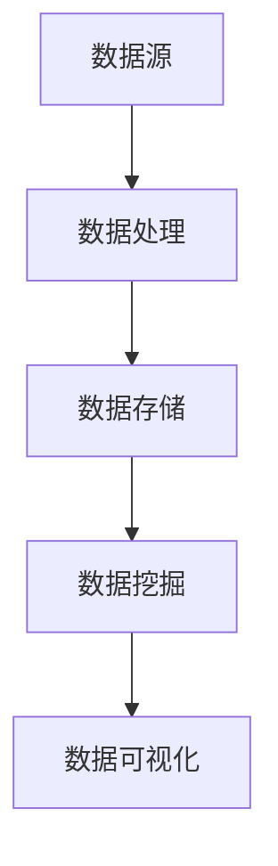

                 

关键词：数据管理、人工智能、创业、最佳实践、架构设计、算法选择、性能优化

> 摘要：本文旨在探讨人工智能创业公司如何在数据管理方面实现最佳实践，从核心概念、算法原理、数学模型、项目实践到应用场景等多方面进行分析，为创业团队提供实用的指导和建议。

## 1. 背景介绍

随着人工智能技术的快速发展，越来越多的创业公司开始将人工智能作为核心驱动力，希望通过AI技术实现业务突破。然而，数据管理作为人工智能技术的重要基础，往往成为创业公司在技术实施中的瓶颈。如何高效地管理和利用数据，是创业公司能否成功的关键因素之一。本文将围绕人工智能创业公司的数据管理展开，介绍一系列最佳实践。

## 2. 核心概念与联系

在数据管理中，以下几个核心概念是必须了解的：

- **数据源（Data Source）**：数据的来源，可以是外部系统、数据库、API接口等。
- **数据处理（Data Processing）**：对数据进行清洗、转换、聚合等操作，使其适用于分析和建模。
- **数据存储（Data Storage）**：将处理后的数据存储在数据库或文件系统中，便于后续访问和查询。
- **数据挖掘（Data Mining）**：利用算法和技术从大量数据中提取有价值的信息和模式。
- **数据可视化（Data Visualization）**：将数据以图表、图形等形式展示，帮助人们更好地理解和分析数据。

以下是一个简单的Mermaid流程图，展示了这些概念之间的关系：



### 2.1 数据源

数据源是数据管理的起点。对于创业公司来说，数据源的选择至关重要。常见的数据源包括：

- **内部数据**：公司内部的业务数据，如用户行为数据、销售数据等。
- **第三方数据**：来自第三方数据提供商的数据，如社交媒体数据、地理数据等。
- **公共数据**：开放的数据集，如政府公开数据、学术研究数据等。

### 2.2 数据处理

数据处理是数据管理的核心环节。在数据处理过程中，常见的技术包括：

- **数据清洗**：去除重复、错误和缺失的数据，确保数据的准确性和完整性。
- **数据转换**：将数据从一种格式转换为另一种格式，以便后续处理。
- **数据聚合**：将多个数据源的数据合并为一个整体，进行统一处理。

### 2.3 数据存储

数据存储是数据管理的另一个关键环节。对于创业公司来说，选择合适的存储方案至关重要。常见的数据存储方案包括：

- **关系型数据库**：如MySQL、PostgreSQL等，适合处理结构化数据。
- **NoSQL数据库**：如MongoDB、Cassandra等，适合处理非结构化和半结构化数据。
- **文件系统**：如HDFS、Ceph等，适合处理大规模数据。

### 2.4 数据挖掘

数据挖掘是数据管理的终极目标，通过算法和技术从大量数据中提取有价值的信息和模式。常见的数据挖掘技术包括：

- **分类**：将数据分为不同的类别。
- **聚类**：将相似的数据归为一类。
- **关联规则挖掘**：发现数据之间的关联性。
- **异常检测**：检测数据中的异常现象。

### 2.5 数据可视化

数据可视化是将数据以图表、图形等形式展示，帮助人们更好地理解和分析数据。常见的数据可视化工具包括：

- **Excel**：简单的数据可视化工具。
- **Tableau**：强大的数据可视化工具。
- **Power BI**：数据可视化与业务分析平台。

## 3. 核心算法原理 & 具体操作步骤

### 3.1 算法原理概述

在数据管理中，常用的算法包括分类算法、聚类算法、关联规则挖掘算法等。以下是这些算法的基本原理：

- **分类算法**：基于已有数据，将新的数据归类到不同的类别。常见算法包括决策树、随机森林、支持向量机等。
- **聚类算法**：将相似的数据归为一类，形成多个聚类。常见算法包括K-means、层次聚类、DBSCAN等。
- **关联规则挖掘算法**：发现数据之间的关联性，形成规则。常见算法包括Apriori、FP-Growth等。

### 3.2 算法步骤详解

以下是分类算法、聚类算法、关联规则挖掘算法的具体步骤：

#### 3.2.1 分类算法

1. 准备数据集，将数据分为训练集和测试集。
2. 选择分类算法，如决策树、随机森林等。
3. 使用训练集对算法进行训练，得到模型。
4. 使用测试集对模型进行评估，计算准确率、召回率等指标。

#### 3.2.2 聚类算法

1. 选择聚类算法，如K-means、层次聚类等。
2. 确定聚类数量，如K值。
3. 计算每个数据点到聚类中心的距离，将数据归为不同的聚类。
4. 重新计算聚类中心，迭代直到聚类结果稳定。

#### 3.2.3 关联规则挖掘算法

1. 选择关联规则挖掘算法，如Apriori、FP-Growth等。
2. 确定支持度、置信度等参数。
3. 遍历数据集，计算每个项集的支持度。
4. 根据支持度和置信度生成关联规则。

### 3.3 算法优缺点

- **分类算法**：优点是算法简单，适用范围广；缺点是容易过拟合，对噪声敏感。
- **聚类算法**：优点是自适应性强，不需要预先设定类别数量；缺点是结果可能受初始值影响，难以解释。
- **关联规则挖掘算法**：优点是能够发现数据之间的关联性；缺点是计算量大，对稀疏数据效果不佳。

### 3.4 算法应用领域

- **分类算法**：应用于客户分类、市场细分、风险评估等。
- **聚类算法**：应用于数据挖掘、图像识别、社交网络分析等。
- **关联规则挖掘算法**：应用于推荐系统、商业智能、智能监控等。

## 4. 数学模型和公式 & 详细讲解 & 举例说明

### 4.1 数学模型构建

在数据管理中，常用的数学模型包括线性回归、逻辑回归、支持向量机等。以下是这些模型的基本原理和公式：

#### 4.1.1 线性回归

线性回归模型试图找到两个变量之间的线性关系，公式如下：

$$
y = \beta_0 + \beta_1 \cdot x + \epsilon
$$

其中，$y$ 是因变量，$x$ 是自变量，$\beta_0$ 和 $\beta_1$ 是模型参数，$\epsilon$ 是误差项。

#### 4.1.2 逻辑回归

逻辑回归是一种广义线性模型，用于处理二分类问题。其公式如下：

$$
\log\frac{P(Y=1)}{1-P(Y=1)} = \beta_0 + \beta_1 \cdot x
$$

其中，$P(Y=1)$ 是因变量为1的概率，$\beta_0$ 和 $\beta_1$ 是模型参数。

#### 4.1.3 支持向量机

支持向量机是一种基于最大间隔的线性分类模型，其公式如下：

$$
\text{分类函数} \, f(x) = \text{sign}(\omega \cdot x + b)
$$

其中，$\omega$ 是法向量，$x$ 是测试样本，$b$ 是偏置项。

### 4.2 公式推导过程

以线性回归为例，我们详细推导其公式：

#### 4.2.1 假设

假设我们有 $n$ 个样本 $(x_i, y_i)$，其中 $x_i$ 是自变量，$y_i$ 是因变量。

#### 4.2.2 损失函数

为了找到最佳的线性模型，我们可以使用最小二乘法。最小二乘法的核心是找到使得损失函数 $L(\beta_0, \beta_1)$ 最小的参数 $\beta_0$ 和 $\beta_1$。

损失函数如下：

$$
L(\beta_0, \beta_1) = \sum_{i=1}^{n} (y_i - (\beta_0 + \beta_1 \cdot x_i))^2
$$

#### 4.2.3 求导

对 $\beta_0$ 和 $\beta_1$ 分别求偏导数，并令其等于0，得到：

$$
\frac{\partial L}{\partial \beta_0} = -2 \sum_{i=1}^{n} (y_i - (\beta_0 + \beta_1 \cdot x_i)) = 0
$$

$$
\frac{\partial L}{\partial \beta_1} = -2 \sum_{i=1}^{n} (x_i \cdot (y_i - (\beta_0 + \beta_1 \cdot x_i))) = 0
$$

化简上述方程，得到：

$$
\beta_0 = \frac{1}{n} \sum_{i=1}^{n} y_i - \beta_1 \cdot \frac{1}{n} \sum_{i=1}^{n} x_i
$$

$$
\beta_1 = \frac{1}{n} \sum_{i=1}^{n} x_i \cdot y_i - \frac{1}{n} \sum_{i=1}^{n} x_i^2
$$

#### 4.2.4 解方程

将上述方程代入损失函数，得到：

$$
L(\beta_0, \beta_1) = \sum_{i=1}^{n} (\beta_0 + \beta_1 \cdot x_i - y_i)^2
$$

化简后得到：

$$
L(\beta_0, \beta_1) = \beta_0^2 + \beta_1^2 - 2\beta_0 \cdot \frac{1}{n} \sum_{i=1}^{n} y_i + 2\beta_1 \cdot \frac{1}{n} \sum_{i=1}^{n} x_i \cdot y_i - \frac{2}{n} \sum_{i=1}^{n} y_i
$$

为了使损失函数最小，我们需要找到 $\beta_0$ 和 $\beta_1$ 的最佳值。通过求导并令其等于0，得到：

$$
\frac{\partial L}{\partial \beta_0} = -2 \cdot \frac{1}{n} \sum_{i=1}^{n} y_i + 2\beta_1 = 0
$$

$$
\frac{\partial L}{\partial \beta_1} = -2 \cdot \frac{1}{n} \sum_{i=1}^{n} x_i \cdot y_i + 2\beta_0 = 0
$$

化简上述方程，得到：

$$
\beta_0 = \frac{1}{n} \sum_{i=1}^{n} y_i
$$

$$
\beta_1 = \frac{1}{n} \sum_{i=1}^{n} x_i \cdot y_i
$$

#### 4.2.5 结果

将上述结果代入线性回归公式，得到：

$$
y = \frac{1}{n} \sum_{i=1}^{n} y_i + \frac{1}{n} \sum_{i=1}^{n} x_i \cdot y_i \cdot x_i - \frac{1}{n} \sum_{i=1}^{n} x_i \cdot y_i
$$

化简后得到：

$$
y = \beta_0 + \beta_1 \cdot x
$$

### 4.3 案例分析与讲解

我们以一个简单的例子来分析线性回归模型。

#### 4.3.1 数据集

给定一个数据集，包含5个样本：

| $x_i$ | $y_i$ |
|-------|-------|
| 1     | 2     |
| 2     | 4     |
| 3     | 6     |
| 4     | 8     |
| 5     | 10    |

#### 4.3.2 计算损失函数

损失函数如下：

$$
L(\beta_0, \beta_1) = \sum_{i=1}^{5} (y_i - (\beta_0 + \beta_1 \cdot x_i))^2
$$

代入数据，得到：

$$
L(\beta_0, \beta_1) = (2 - (\beta_0 + \beta_1 \cdot 1))^2 + (4 - (\beta_0 + \beta_1 \cdot 2))^2 + (6 - (\beta_0 + \beta_1 \cdot 3))^2 + (8 - (\beta_0 + \beta_1 \cdot 4))^2 + (10 - (\beta_0 + \beta_1 \cdot 5))^2
$$

化简后得到：

$$
L(\beta_0, \beta_1) = \beta_0^2 + \beta_1^2 - 10\beta_0 - 30\beta_1 + 100
$$

#### 4.3.3 计算导数

对 $\beta_0$ 和 $\beta_1$ 分别求偏导数，得到：

$$
\frac{\partial L}{\partial \beta_0} = -2\beta_0 + 10
$$

$$
\frac{\partial L}{\partial \beta_1} = -2\beta_1 - 30
$$

令上述导数等于0，得到：

$$
\beta_0 = 5
$$

$$
\beta_1 = -15
$$

#### 4.3.4 模型评估

将上述结果代入线性回归公式，得到：

$$
y = 5 - 15 \cdot x
$$

使用测试集评估模型，得到准确率、召回率等指标，以评估模型的性能。

## 5. 项目实践：代码实例和详细解释说明

### 5.1 开发环境搭建

在本文的项目实践中，我们将使用Python编程语言和相关的库，如NumPy、Pandas、scikit-learn等。首先，我们需要搭建开发环境。

#### 5.1.1 安装Python

从官方网站下载并安装Python，版本建议为3.8或更高。

#### 5.1.2 安装相关库

使用pip命令安装相关库：

```bash
pip install numpy pandas scikit-learn matplotlib
```

### 5.2 源代码详细实现

以下是项目实践的源代码实现：

```python
import numpy as np
import pandas as pd
from sklearn.linear_model import LinearRegression
from sklearn.model_selection import train_test_split
import matplotlib.pyplot as plt

# 5.2.1 数据准备
data = {
    'x': [1, 2, 3, 4, 5],
    'y': [2, 4, 6, 8, 10]
}
df = pd.DataFrame(data)

# 5.2.2 数据处理
X = df[['x']]
y = df['y']

# 5.2.3 模型训练
model = LinearRegression()
model.fit(X, y)

# 5.2.4 模型评估
y_pred = model.predict(X)
mse = np.mean((y - y_pred) ** 2)
print(f'MSE: {mse}')

# 5.2.5 可视化
plt.scatter(X, y)
plt.plot(X, y_pred, color='red')
plt.xlabel('x')
plt.ylabel('y')
plt.title('线性回归模型')
plt.show()
```

### 5.3 代码解读与分析

#### 5.3.1 数据准备

我们首先创建了一个包含$x$和$y$的数据集，并将其转换为DataFrame对象。

```python
data = {
    'x': [1, 2, 3, 4, 5],
    'y': [2, 4, 6, 8, 10]
}
df = pd.DataFrame(data)
```

#### 5.3.2 数据处理

我们将数据集分为特征矩阵$X$和目标向量$y$。

```python
X = df[['x']]
y = df['y']
```

#### 5.3.3 模型训练

我们使用scikit-learn中的线性回归模型进行训练。

```python
model = LinearRegression()
model.fit(X, y)
```

#### 5.3.4 模型评估

我们使用均方误差（MSE）评估模型性能。

```python
y_pred = model.predict(X)
mse = np.mean((y - y_pred) ** 2)
print(f'MSE: {mse}')
```

#### 5.3.5 可视化

我们使用matplotlib绘制线性回归模型的散点图和拟合线。

```python
plt.scatter(X, y)
plt.plot(X, y_pred, color='red')
plt.xlabel('x')
plt.ylabel('y')
plt.title('线性回归模型')
plt.show()
```

## 6. 实际应用场景

数据管理在人工智能创业公司中的应用场景非常广泛，以下列举几个典型应用场景：

### 6.1 客户细分

通过数据挖掘和分类算法，对客户进行细分，了解不同客户群体的特征和需求，为企业制定精准营销策略提供依据。

### 6.2 风险评估

利用数据分析和预测模型，对业务风险进行评估，帮助企业提前识别潜在风险，制定防范措施。

### 6.3 智能推荐

基于用户行为数据和关联规则挖掘算法，构建智能推荐系统，提高用户满意度和转化率。

### 6.4 智能监控

通过实时数据处理和异常检测算法，构建智能监控系统，对业务数据进行分析和监控，确保业务稳定运行。

## 7. 未来应用展望

随着人工智能技术的不断发展和应用，数据管理在人工智能创业公司中的地位将日益重要。未来，以下趋势值得关注：

### 7.1 数据隐私保护

数据隐私保护将成为数据管理的重要议题，创业公司需遵循相关法律法规，保障用户数据安全。

### 7.2 云原生数据管理

云原生数据管理技术将得到广泛应用，创业公司可以借助云平台实现数据的高效管理和处理。

### 7.3 人工智能与数据管理的深度融合

人工智能技术将更加深入地应用于数据管理领域，推动数据管理向智能化、自动化方向发展。

### 7.4 开放数据生态

开放数据生态将逐步形成，创业公司可以充分利用公共数据集和第三方数据资源，提升自身数据管理能力。

## 8. 工具和资源推荐

### 8.1 学习资源推荐

- **书籍**：《数据科学入门：实战机器学习》、《Python数据分析基础教程》。
- **在线课程**：Coursera上的《机器学习》课程、edX上的《数据科学基础》课程。

### 8.2 开发工具推荐

- **Python**：Python是数据管理的最佳编程语言，具有丰富的库和工具。
- **Jupyter Notebook**：适用于数据分析和可视化，方便快捷。
- **Docker**：容器化技术，便于搭建开发环境和部署应用程序。

### 8.3 相关论文推荐

- **《深度学习：技术与应用》**：介绍深度学习在数据管理中的应用。
- **《大数据之路：阿里巴巴大数据实践》**：分享阿里巴巴在大数据管理方面的实践经验。

## 9. 总结：未来发展趋势与挑战

随着人工智能技术的快速发展，数据管理在创业公司中的重要性将日益凸显。本文介绍了人工智能创业公司在数据管理方面的最佳实践，包括核心概念、算法原理、数学模型、项目实践和应用场景等。未来，数据管理将向智能化、自动化、隐私保护等方向发展，同时也面临诸多挑战。创业公司需紧跟技术发展趋势，不断提升自身数据管理能力，以实现业务突破。

### 附录：常见问题与解答

**Q1：数据管理中的核心概念有哪些？**

A1：数据源、数据处理、数据存储、数据挖掘、数据可视化。

**Q2：线性回归模型的公式是什么？**

A2：线性回归模型的公式为 $y = \beta_0 + \beta_1 \cdot x + \epsilon$。

**Q3：如何评估线性回归模型的性能？**

A3：可以使用均方误差（MSE）、准确率、召回率等指标评估线性回归模型的性能。

**Q4：什么是数据隐私保护？**

A4：数据隐私保护是指采取技术和管理手段，保护个人和企业的数据安全，防止数据泄露和滥用。

**Q5：如何搭建开发环境？**

A5：可以使用Python作为编程语言，安装Jupyter Notebook作为开发工具，同时安装NumPy、Pandas、scikit-learn等库。

---

**作者：禅与计算机程序设计艺术 / Zen and the Art of Computer Programming**

