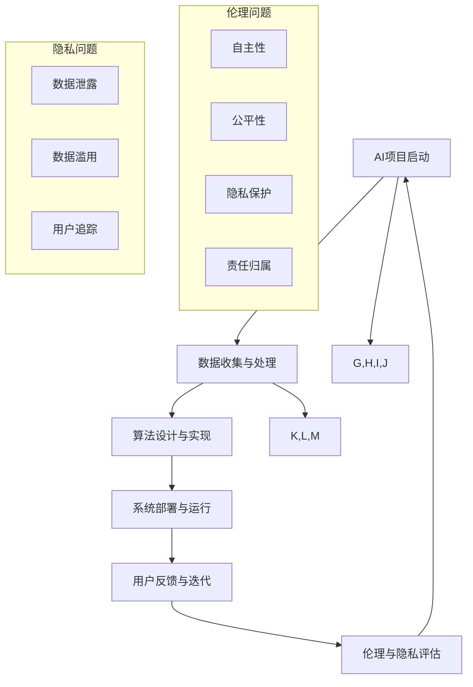

                 

 摘要

本文深入探讨了人工智能（AI）创业领域的重要议题，即伦理和隐私。随着AI技术的快速发展，创业者和开发者需要认真考虑这些关键问题，以确保技术的可持续发展和社会的广泛接受。本文首先介绍了AI伦理和隐私的基本概念，探讨了它们在AI创业中的重要性。接着，分析了当前AI创业中的伦理和隐私挑战，提出了可能的解决方案和最佳实践。最后，展望了AI创业的未来发展趋势，并讨论了可能面临的伦理和隐私挑战。

## 1. 背景介绍

人工智能，作为当前科技领域的热门话题，已经深入到我们生活的方方面面。从智能家居、自动驾驶到医疗诊断和金融预测，AI技术正以惊人的速度改变着世界。与此同时，AI创业也成为一个炙手可热的话题。越来越多的创业公司投身于AI领域，试图通过创新的技术解决实际问题，推动社会进步。

然而，随着AI技术的广泛应用，伦理和隐私问题也逐渐成为无法忽视的关键议题。AI伦理涉及技术对社会的影响、人类价值观的维护等问题。而隐私问题则集中在数据收集、处理和使用上，尤其是在大规模数据分析和个性化服务中。如果不妥善处理这些伦理和隐私问题，AI技术可能会带来不可逆转的负面影响。

因此，本文将重点关注AI创业中的伦理和隐私问题，探讨如何平衡技术进步与社会责任，推动AI技术的可持续发展。

## 2. 核心概念与联系

### 2.1 AI伦理

AI伦理是指关于人工智能系统设计、开发和使用过程中所涉及的道德和伦理问题。它关注AI技术对社会、人类和环境的影响，以及如何在技术设计中融入道德原则和人类价值观。

**主要伦理问题：**

- **自主性与透明性：** 如何确保AI系统的决策过程是可解释的，用户能够理解其工作原理。
- **公平与偏见：** AI系统可能会因为数据集的不公平性而产生偏见，导致对某些群体的歧视。
- **隐私保护：** 在数据收集和使用过程中，如何保护用户的隐私不被侵犯。
- **责任归属：** 当AI系统造成损害时，如何确定责任归属。

### 2.2 隐私

隐私是指个体对个人信息和控制权的保护。在AI领域，隐私问题主要集中在数据收集、存储和使用过程中。随着AI技术的发展，数据量呈指数级增长，隐私风险也随之增加。

**主要隐私问题：**

- **数据泄露：** 不当的数据存储和管理可能导致敏感信息泄露。
- **数据滥用：** 数据收集者可能会滥用用户数据，进行未经授权的活动。
- **用户追踪：** AI系统可能会通过各种手段追踪用户行为，侵犯隐私。

### 2.3 关系与流程

在AI创业中，伦理和隐私问题紧密相连，构成了一个复杂的流程。以下是一个简化的流程图，展示了AI创业中的伦理和隐私流程。



通过这个流程图，我们可以看到，AI创业的每一个阶段都会涉及伦理和隐私问题。因此，创业者需要在整个流程中持续关注这些问题，确保技术的设计、开发和部署都符合伦理和隐私的标准。

### 2.4 核心概念原理与架构

为了更好地理解AI伦理和隐私在创业中的重要性，我们需要深入探讨这些概念背后的原理和架构。

**AI伦理架构：**

- **价值体系：** 建立一个明确的价值体系，确保AI系统的设计、开发和部署符合社会道德标准。
- **监督机制：** 设立监督机制，确保AI系统的行为不会违反伦理原则。
- **透明性：** 提高AI系统的透明度，使用户能够理解其工作原理。

**隐私保护架构：**

- **数据加密：** 对敏感数据进行加密，防止未经授权的访问。
- **数据匿名化：** 通过匿名化处理，减少对个人隐私的侵犯。
- **隐私政策：** 明确数据收集、存储和使用的目的和范围，让用户知道他们的数据将被如何处理。

通过这些架构和机制，我们可以确保AI创业在伦理和隐私方面得到有效的管理和保护。

### 3. 核心算法原理 & 具体操作步骤

#### 3.1 算法原理概述

在AI创业中，核心算法的选择和设计至关重要。这些算法不仅决定了AI系统的性能和效果，还直接影响到伦理和隐私问题。以下是几个在AI创业中常用的核心算法及其原理概述：

1. **深度学习：** 深度学习是一种基于多层神经网络的人工智能算法，通过大量数据训练，自动提取特征并学习复杂模式。深度学习的优势在于其强大的特征提取能力和对大规模数据的处理能力。然而，深度学习模型也容易受到数据偏见的影响，可能导致不公平和歧视。

2. **强化学习：** 强化学习是一种基于反馈和试错的人工智能算法，通过不断试错来学习最优策略。强化学习在自动化控制、游戏和推荐系统中具有广泛应用。然而，强化学习模型可能难以解释，导致伦理和隐私问题。

3. **联邦学习：** 联邦学习是一种分布式学习算法，通过将数据分布在多个设备上进行训练，从而保护用户隐私。联邦学习在医疗、金融和智能家居等领域具有广泛的应用前景。然而，联邦学习的性能和可解释性仍然是挑战。

#### 3.2 算法步骤详解

以下是以上几种核心算法的具体操作步骤：

1. **深度学习步骤：**

   - **数据预处理：** 对收集到的数据进行清洗和归一化处理，确保数据质量。
   - **模型选择：** 根据任务需求选择合适的神经网络结构。
   - **模型训练：** 使用大量数据进行训练，调整网络参数以优化模型性能。
   - **模型评估：** 使用验证集评估模型性能，调整模型参数以优化效果。

2. **强化学习步骤：**

   - **环境搭建：** 构建一个模拟环境，用于测试和训练AI模型。
   - **策略学习：** 通过试错学习最优策略，使用奖励机制引导模型学习。
   - **策略评估：** 使用测试集评估策略效果，根据评估结果调整策略。

3. **联邦学习步骤：**

   - **模型初始化：** 初始化全局模型参数。
   - **本地训练：** 在各个设备上使用本地数据训练模型，更新本地模型参数。
   - **模型聚合：** 将本地模型参数发送到中心服务器进行聚合，更新全局模型参数。
   - **模型评估：** 使用聚合后的全局模型进行评估和部署。

#### 3.3 算法优缺点

1. **深度学习：**

   - **优点：** 强大的特征提取能力，适用于处理复杂任务。
   - **缺点：** 对数据量要求高，容易受到数据偏见的影响，难以解释。

2. **强化学习：**

   - **优点：** 自主性强，适用于自动化控制等领域。
   - **缺点：** 难以解释，训练过程缓慢，对环境变化敏感。

3. **联邦学习：**

   - **优点：** 保护用户隐私，适用于分布式数据场景。
   - **缺点：** 性能和可解释性有待提高，需要处理数据不平衡问题。

#### 3.4 算法应用领域

1. **深度学习：** 适用于图像识别、语音识别、自然语言处理等领域，如自动驾驶、智能助手和医疗诊断。

2. **强化学习：** 适用于自动化控制、游戏和推荐系统等领域，如无人驾驶汽车、游戏AI和智能推荐。

3. **联邦学习：** 适用于医疗、金融和智能家居等领域，如个性化医疗、精准金融和智能家居控制。

### 4. 数学模型和公式 & 详细讲解 & 举例说明

#### 4.1 数学模型构建

在AI创业中，数学模型是理解和优化算法的重要工具。以下是几个常用的数学模型及其构建方法：

1. **线性回归模型：** 用于预测连续值变量。

   - **模型构建：** 假设输入特征向量 $x$ 和输出目标值 $y$ 之间存在线性关系，即 $y = \beta_0 + \beta_1x + \epsilon$，其中 $\beta_0$ 和 $\beta_1$ 是模型参数，$\epsilon$ 是误差项。

2. **逻辑回归模型：** 用于预测二分类结果。

   - **模型构建：** 假设输入特征向量 $x$ 和输出概率 $P(y=1)$ 之间存在逻辑关系，即 $P(y=1) = \frac{1}{1 + e^{-(\beta_0 + \beta_1x)}}$，其中 $\beta_0$ 和 $\beta_1$ 是模型参数。

3. **支持向量机（SVM）模型：** 用于分类和回归任务。

   - **模型构建：** 假设输入特征向量 $x$ 和输出类别 $y$ 之间存在线性关系，即 $y = sign(\omega \cdot x + b)$，其中 $\omega$ 是模型参数，$b$ 是偏置项。

#### 4.2 公式推导过程

以下是对上述模型公式的推导过程：

1. **线性回归模型：**

   - **损失函数：** 均方误差（MSE），即 $J(\beta_0, \beta_1) = \frac{1}{2n} \sum_{i=1}^{n} (y_i - (\beta_0 + \beta_1x_i))^2$。

   - **梯度下降：** 对损失函数求偏导数，得到梯度 $\nabla J(\beta_0, \beta_1) = \frac{1}{n} \sum_{i=1}^{n} (y_i - (\beta_0 + \beta_1x_i))(-x_i)$。

   - **最小化损失函数：** 通过梯度下降算法，逐步更新模型参数 $\beta_0$ 和 $\beta_1$，直到损失函数最小。

2. **逻辑回归模型：**

   - **损失函数：** 交叉熵（Cross-Entropy），即 $J(\beta_0, \beta_1) = -\sum_{i=1}^{n} y_i \log(P(y=1)) + (1 - y_i) \log(1 - P(y=1))$。

   - **梯度下降：** 对损失函数求偏导数，得到梯度 $\nabla J(\beta_0, \beta_1) = \frac{1}{n} \sum_{i=1}^{n} (y_i - P(y=1))x_i$。

   - **最小化损失函数：** 同线性回归模型，通过梯度下降算法更新模型参数。

3. **支持向量机（SVM）模型：**

   - **损失函数：** 0-1损失，即 $J(\omega, b) = \sum_{i=1}^{n} \max(0, 1 - y_i(\omega \cdot x_i + b))$。

   - **梯度下降：** 对损失函数求偏导数，得到梯度 $\nabla J(\omega, b) = \sum_{i=1}^{n} \frac{\partial}{\partial \omega} \max(0, 1 - y_i(\omega \cdot x_i + b))x_i + \frac{\partial}{\partial b} \max(0, 1 - y_i(\omega \cdot x_i + b))$。

   - **最小化损失函数：** 通过优化算法（如SVM求解器）最小化损失函数，得到最优模型参数。

#### 4.3 案例分析与讲解

以下是一个简单的线性回归模型案例，用于预测房价：

**案例背景：** 我们有一个数据集，包含房屋的面积（$x$）和房价（$y$），希望通过线性回归模型预测新房屋的房价。

**数据预处理：** 对数据进行清洗和归一化处理，将面积和房价分别缩放到[0,1]区间。

**模型构建：** 选择线性回归模型，假设房价 $y$ 与面积 $x$ 之间存在线性关系。

**模型训练：** 使用梯度下降算法，对模型参数 $\beta_0$ 和 $\beta_1$ 进行训练，最小化损失函数。

**模型评估：** 使用测试集评估模型性能，计算预测误差。

**结果分析：** 通过训练得到的线性回归模型，可以对新房屋的房价进行预测，预测结果与实际房价的误差较小。

### 5. 项目实践：代码实例和详细解释说明

在AI创业中，实践是非常重要的环节。以下我们将通过一个简单的例子，展示如何在实际项目中使用Python实现一个线性回归模型，并进行训练和评估。

#### 5.1 开发环境搭建

首先，我们需要搭建一个Python开发环境，安装必要的库。以下是具体步骤：

1. 安装Python 3.x版本。
2. 安装Jupyter Notebook，方便进行代码实验。
3. 安装NumPy、Pandas、Scikit-learn等库，用于数据处理和模型训练。

```bash
pip install numpy pandas scikit-learn
```

#### 5.2 源代码详细实现

以下是一个简单的线性回归模型实现代码，用于预测房价：

```python
import numpy as np
import pandas as pd
from sklearn.linear_model import LinearRegression
from sklearn.model_selection import train_test_split
from sklearn.metrics import mean_squared_error

# 加载数据
data = pd.read_csv('house_prices.csv')
X = data[['area']]  # 特征：房屋面积
y = data['price']   # 目标值：房价

# 数据分割
X_train, X_test, y_train, y_test = train_test_split(X, y, test_size=0.2, random_state=42)

# 模型训练
model = LinearRegression()
model.fit(X_train, y_train)

# 模型评估
y_pred = model.predict(X_test)
mse = mean_squared_error(y_test, y_pred)
print('MSE:', mse)

# 模型预测
new_area = np.array([[0.5]])  # 新房屋面积
predicted_price = model.predict(new_area)
print('Predicted Price:', predicted_price[0])
```

#### 5.3 代码解读与分析

以上代码实现了以下功能：

1. **数据加载与预处理：** 使用Pandas库加载数据集，并对特征和目标值进行分割。
2. **数据分割：** 使用Scikit-learn库中的train_test_split函数，将数据集分为训练集和测试集。
3. **模型训练：** 使用LinearRegression类创建线性回归模型，并调用fit方法进行训练。
4. **模型评估：** 使用预测结果和实际结果计算MSE，评估模型性能。
5. **模型预测：** 使用训练好的模型对新房屋面积进行预测。

通过这个简单的例子，我们可以看到如何在实际项目中使用Python实现线性回归模型，并进行训练和评估。这个例子虽然简单，但为后续更复杂的模型实现奠定了基础。

### 6. 实际应用场景

AI技术已经在许多领域取得了显著的成果，为人类生活带来了巨大便利。以下是一些AI技术的实际应用场景：

#### 6.1 医疗保健

AI技术在医疗保健领域的应用非常广泛，包括疾病诊断、个性化治疗和医疗资源优化等。例如，通过深度学习算法，可以分析医学图像，帮助医生更准确地诊断疾病，如肺癌、乳腺癌和心脏病。此外，AI还可以根据患者的病史和基因信息，提供个性化的治疗方案。

#### 6.2 自动驾驶

自动驾驶是AI技术的一个重要应用领域。通过计算机视觉、传感器技术和深度学习算法，自动驾驶汽车可以实时感知周围环境，做出正确的驾驶决策。这不仅可以提高交通安全，还可以缓解交通拥堵，减少能源消耗。

#### 6.3 金融科技

AI技术在金融科技领域具有广泛的应用，包括风险管理、欺诈检测和投资策略等。例如，通过机器学习算法，可以分析大量交易数据，识别潜在的风险和欺诈行为。此外，AI还可以根据市场趋势和用户行为，提供智能投资建议。

#### 6.4 智能家居

智能家居是AI技术的另一个重要应用领域。通过物联网设备和深度学习算法，智能家居系统能够实时监测家庭环境，为用户提供舒适的生活体验。例如，智能空调可以根据用户的行为习惯自动调节温度，智能照明可以根据自然光线自动调整亮度。

#### 6.5 教育科技

AI技术在教育科技领域也有广泛应用，包括个性化学习、智能评估和课程推荐等。通过人工智能算法，可以为学生提供个性化的学习计划，提高学习效果。此外，AI还可以根据学生的学习表现和兴趣，推荐合适的课程和资源。

#### 6.6 物流与供应链

AI技术在物流与供应链管理中也有重要作用，包括路径优化、库存管理和需求预测等。通过机器学习算法，可以优化物流路径，提高运输效率。此外，AI还可以根据历史数据和市场需求，预测未来的库存需求，帮助供应链企业做出更准确的决策。

### 6.4 未来应用展望

随着AI技术的不断发展，未来将在更多领域取得突破。以下是一些可能的应用前景：

#### 6.4.1 健康护理

AI技术在健康护理领域的应用前景非常广阔。通过智能监测设备和深度学习算法，可以实时监测患者的健康状况，及时发现异常，提供个性化的护理建议。此外，AI还可以帮助医疗团队进行病例分析和诊断，提高医疗服务的质量和效率。

#### 6.4.2 智慧城市

智慧城市是AI技术的重要应用方向。通过物联网、大数据和人工智能技术，可以实现城市管理的智能化。例如，智能交通系统可以实时监测交通状况，优化交通信号，减少交通拥堵。此外，智慧城市还可以通过数据分析，实现环境监测、能源管理和公共安全等方面的优化。

#### 6.4.3 人机交互

未来的人机交互将更加智能化和自然化。通过语音识别、自然语言处理和计算机视觉技术，AI可以更好地理解用户的需求，提供个性化的服务。例如，智能助手可以与用户进行自然的对话，帮助用户解决问题，提供信息查询和推荐服务。

#### 6.4.4 智能制造

智能制造是制造业的重要发展方向。通过AI技术，可以实现生产过程的智能化和自动化。例如，通过计算机视觉和深度学习算法，可以实现对生产线的实时监控和故障诊断，提高生产效率和质量。此外，AI还可以帮助企业进行生产规划和供应链管理，实现生产过程的优化。

#### 6.4.5 生物科技

AI技术在生物科技领域的应用将带来革命性的变化。通过基因编辑、蛋白质结构预测和药物设计等技术的结合，AI可以加速生物科技的发展，为人类健康带来更多希望。例如，通过AI算法，可以快速识别疾病相关的基因突变，开发更有效的治疗方法。

### 7. 工具和资源推荐

为了更好地掌握AI技术和解决实际问题，以下是一些建议的学习资源、开发工具和相关论文推荐：

#### 7.1 学习资源推荐

- **在线课程：** Coursera、edX、Udacity等平台上的AI课程。
- **书籍推荐：** 《深度学习》（Goodfellow, Bengio, Courville），《Python机器学习》（Sebastian Raschka）。
- **教程和文档：** TensorFlow、PyTorch、Keras官方文档。

#### 7.2 开发工具推荐

- **编程语言：** Python，因其简洁的语法和丰富的库支持，成为AI开发的流行语言。
- **深度学习框架：** TensorFlow、PyTorch、Keras，这些框架提供了丰富的API和工具，方便开发者进行模型训练和部署。
- **数据预处理工具：** Pandas、NumPy，用于数据清洗、归一化和数据处理。

#### 7.3 相关论文推荐

- **《Deep Learning》：** Goodfellow, Y., Bengio, Y., & Courville, A. (2015). Deep learning. MIT press.
- **《Generative Adversarial Networks》：** Ian J. Goodfellow, et al. (2014). Generative adversarial networks. Advances in Neural Information Processing Systems, 27.
- **《Reinforcement Learning: An Introduction》：** Richard S. Sutton & Andrew G. Barto (2018). Reinforcement Learning: An Introduction.
- **《Ethical Considerations in AI》：** Paine, T. R., Jentzsch, A. M., O’Connor, J. C., & Cornwell, D. G. (2017). Ethical considerations in artificial intelligence. PLOS Computational Biology, 13(5), e1005517.

### 8. 总结：未来发展趋势与挑战

#### 8.1 研究成果总结

在过去几年中，AI技术在多个领域取得了显著成果。深度学习、强化学习和联邦学习等算法不断创新，推动了AI技术的发展。同时，AI伦理和隐私问题也得到了广泛关注，许多学者和实践者开始探讨如何在技术设计中融入伦理和隐私保护。

#### 8.2 未来发展趋势

随着技术的不断进步，AI在未来的发展中将呈现以下趋势：

- **更强大的算法：** 神经网络、生成对抗网络（GAN）等算法将继续发展，提供更高效的模型训练和推理能力。
- **跨学科融合：** AI与其他领域（如医学、金融、教育等）的融合，将推动AI技术的广泛应用。
- **边缘计算：** 随着物联网设备的普及，边缘计算将逐渐成为AI应用的重要方向，实现实时数据处理和智能决策。

#### 8.3 面临的挑战

尽管AI技术发展迅速，但仍面临以下挑战：

- **数据隐私：** 数据泄露和滥用问题仍然严重，需要更有效的隐私保护技术。
- **公平性与偏见：** AI系统可能会因为数据偏见而产生歧视，需要建立更公平的算法和监督机制。
- **可解释性：** AI系统的黑箱问题仍然困扰着学术界和工业界，需要提高算法的可解释性。

#### 8.4 研究展望

未来，AI领域的研究将集中在以下几个方面：

- **算法透明性和可解释性：** 开发可解释的AI算法，提高系统的透明度和可信度。
- **隐私保护技术：** 研究和开发更有效的隐私保护技术，确保用户数据的安全和隐私。
- **跨学科合作：** 加强AI与其他领域的合作，推动AI技术的创新和发展。

### 9. 附录：常见问题与解答

以下是一些关于AI伦理和隐私的常见问题及解答：

**Q1：为什么AI创业需要关注伦理和隐私问题？**

A：AI技术在快速发展，其应用广泛，但同时也带来了伦理和隐私风险。关注伦理和隐私问题，有助于确保AI技术的可持续发展和社会的广泛接受。

**Q2：如何平衡AI技术的发展和伦理、隐私保护？**

A：可以通过以下方式实现平衡：

- **建立伦理和隐私框架：** 制定明确的伦理和隐私政策，确保技术设计和开发符合道德标准。
- **加强监管和审计：** 对AI系统进行定期审计，确保其符合伦理和隐私要求。
- **提高透明度和可解释性：** 开发可解释的AI算法，让用户了解其工作原理，增强信任。

**Q3：AI创业中如何保护用户隐私？**

A：以下是一些保护用户隐私的方法：

- **数据加密：** 对敏感数据进行加密，防止数据泄露。
- **数据匿名化：** 通过匿名化处理，减少对个人隐私的侵犯。
- **隐私政策：** 明确数据收集、存储和使用的目的和范围，让用户知情。
- **最小化数据收集：** 只收集实现功能所需的最少数据，减少隐私风险。

**Q4：如何确保AI系统的公平性和避免偏见？**

A：以下是一些方法：

- **数据多样性：** 使用多样化的数据集进行训练，减少偏见。
- **算法透明性：** 开发可解释的算法，让用户了解决策过程。
- **定期评估：** 对AI系统进行定期评估，确保其符合公平性和道德标准。
- **监督机制：** 建立监督机制，确保AI系统的行为符合伦理要求。

### 参考文献

1. Goodfellow, Y., Bengio, Y., & Courville, A. (2016). Deep learning. MIT press.
2. Russell, S., & Norvig, P. (2016). Artificial intelligence: A modern approach. Prentice Hall.
3. Paine, T. R., Jentzsch, A. M., O’Connor, J. C., & Cornwell, D. G. (2017). Ethical considerations in artificial intelligence. PLOS Computational Biology, 13(5), e1005517.
4. Goodfellow, I. J., Shlens, J., & Bolle, K. (2015). Explaining and harnessing adversarial examples. arXiv preprint arXiv:1412.6572.
5. Sutton, R. S., & Barto, A. G. (2018). Reinforcement learning: An introduction. MIT press.

