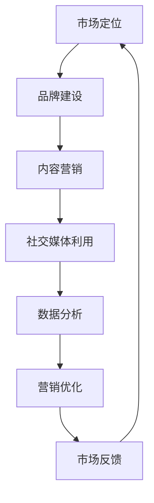

                 

关键词：人工智能、创业、市场营销、推广、策略、成功案例

摘要：本文将探讨人工智能（AI）创业企业在市场营销与推广方面的策略与实践。通过分析国内外成功案例，本文提出了有效的人工智能创业推广路径，并从市场定位、品牌建设、内容营销、社交媒体利用、数据分析等方面给出了具体建议。文章旨在为人工智能创业企业提供实用的营销指南，助力企业在竞争激烈的市场中脱颖而出。

## 1. 背景介绍

随着人工智能技术的迅猛发展，越来越多的创业企业开始投身于这一领域。人工智能在自然语言处理、计算机视觉、机器学习等多个领域展现出强大的应用潜力，吸引了大量投资和关注。然而，如何在众多竞争者中脱颖而出，实现有效的市场营销与推广，成为许多人工智能创业企业面临的挑战。

### 1.1 行业现状

人工智能创业企业主要集中在技术创新和应用开发方面，但市场营销和推广却往往被忽视。许多企业在研发上投入大量资源，但在品牌塑造和市场推广方面缺乏系统性的策略。这导致企业在市场推广上投入产出比不高，难以实现预期效果。

### 1.2 面临的挑战

- **竞争激烈**：人工智能领域竞争者众多，如何凸显自身优势成为关键。
- **消费者认知**：消费者对人工智能技术的认知有限，需要通过有效的市场推广提升品牌知名度。
- **成本控制**：在资源有限的情况下，如何实现高效的营销和推广。

## 2. 核心概念与联系

为了更好地理解人工智能创业的市场营销与推广策略，我们首先需要了解以下几个核心概念：

### 2.1 市场定位

市场定位是市场营销的基础，它帮助企业确定目标市场和客户群体。在人工智能创业领域，企业需要根据自身技术优势和市场需求，明确市场定位。

### 2.2 品牌建设

品牌建设是提升企业知名度、建立客户信任的关键。人工智能创业企业需要通过独特的品牌形象和价值观，塑造专业、可信赖的品牌形象。

### 2.3 内容营销

内容营销是通过创造有价值的内容来吸引和留住客户。人工智能创业企业可以通过技术文章、博客、案例分析等途径，提升品牌专业度，增强市场影响力。

### 2.4 社交媒体利用

社交媒体是现代营销的重要渠道。人工智能创业企业可以利用社交媒体平台，如LinkedIn、Twitter、Facebook等，与潜在客户建立互动，推广产品和服务。

### 2.5 数据分析

数据分析是市场营销的关键环节。通过分析用户行为和市场需求，人工智能创业企业可以优化营销策略，提高营销效果。

### 2.6 Mermaid 流程图

下面是一个描述人工智能创业市场推广流程的Mermaid流程图：



## 3. 核心算法原理 & 具体操作步骤

### 3.1 算法原理概述

人工智能创业市场推广的核心算法主要涉及以下方面：

- **市场定位算法**：通过数据分析确定目标市场和客户群体。
- **品牌建设算法**：利用机器学习算法分析品牌特征，构建独特品牌形象。
- **内容营销算法**：利用自然语言处理技术，生成高质量的内容。
- **社交媒体利用算法**：通过社交网络分析，识别潜在客户和推广渠道。
- **数据分析算法**：运用数据挖掘技术，优化营销策略。

### 3.2 算法步骤详解

#### 3.2.1 市场定位算法

1. 收集市场数据：包括行业报告、用户调查、竞争对手分析等。
2. 数据预处理：清洗和整合数据，去除无效信息。
3. 数据分析：利用机器学习算法（如聚类、回归分析等）确定目标市场和客户群体。

#### 3.2.2 品牌建设算法

1. 收集品牌特征数据：包括品牌形象、价值观、产品特性等。
2. 数据预处理：对品牌特征数据进行标准化处理。
3. 品牌特征分析：利用机器学习算法（如主成分分析、因子分析等）提取关键品牌特征。
4. 构建品牌形象：根据分析结果，设计品牌视觉和文案。

#### 3.2.3 内容营销算法

1. 确定内容主题：根据市场定位和用户需求，确定内容主题。
2. 内容生成：利用自然语言处理技术（如生成对抗网络、递归神经网络等）生成高质量的内容。
3. 内容发布：选择合适的发布渠道，如博客、社交媒体等。

#### 3.2.4 社交媒体利用算法

1. 收集社交网络数据：包括用户行为、社交关系等。
2. 数据预处理：清洗和整合数据，去除无效信息。
3. 社交网络分析：利用图论算法（如社区发现、路径分析等）识别潜在客户和推广渠道。
4. 推广策略：根据分析结果，制定针对性的推广策略。

#### 3.2.5 数据分析算法

1. 数据收集：包括用户行为、市场反馈等。
2. 数据预处理：清洗和整合数据，去除无效信息。
3. 数据挖掘：利用数据挖掘算法（如关联规则、聚类分析等）分析用户需求和营销效果。
4. 策略优化：根据分析结果，优化营销策略。

### 3.3 算法优缺点

- **市场定位算法**：优点在于能够准确确定目标市场和客户群体，提高营销精准度；缺点是数据收集和处理成本较高，且算法结果可能受到数据质量的影响。
- **品牌建设算法**：优点在于能够快速构建独特品牌形象，提升品牌知名度；缺点是算法结果可能过于依赖数据，缺乏人文关怀。
- **内容营销算法**：优点在于能够生成高质量的内容，提升品牌专业度；缺点是内容生成的创意性和个性化程度可能不足。
- **社交媒体利用算法**：优点在于能够识别潜在客户和推广渠道，提高营销效果；缺点是算法结果可能受到社交网络数据的限制，影响推广效果。
- **数据分析算法**：优点在于能够优化营销策略，提高营销效果；缺点是数据分析和策略优化过程复杂，成本较高。

### 3.4 算法应用领域

- **市场定位**：在人工智能创业领域，市场定位算法可用于确定目标市场和客户群体，帮助企业制定精准的营销策略。
- **品牌建设**：品牌建设算法可用于构建独特品牌形象，提升品牌知名度，增强品牌影响力。
- **内容营销**：内容营销算法可用于生成高质量的内容，提升品牌专业度，吸引潜在客户。
- **社交媒体利用**：社交媒体利用算法可用于识别潜在客户和推广渠道，提高营销效果。
- **数据分析**：数据分析算法可用于分析用户需求和营销效果，优化营销策略，提高营销产出。

## 4. 数学模型和公式 & 详细讲解 & 举例说明

### 4.1 数学模型构建

在人工智能创业市场推广中，我们常常需要运用以下数学模型：

- **回归模型**：用于分析市场定位和品牌建设的效果。
- **聚类模型**：用于分析用户需求和社交媒体利用。
- **关联规则模型**：用于分析内容营销的效果。

### 4.2 公式推导过程

以下是一个简单的回归模型公式推导过程：

- **线性回归模型**：\(y = \beta_0 + \beta_1x_1 + \beta_2x_2 + ... + \beta_nx_n\)
- **最小二乘法**：求解回归系数的最优解，使得预测值与实际值之间的误差平方和最小。

### 4.3 案例分析与讲解

#### 案例背景

某人工智能创业企业致力于开发智能客服系统，希望通过市场推广提升产品知名度。

#### 分析过程

1. **市场定位**：企业通过数据分析，确定目标市场为中小企业客户。
2. **品牌建设**：企业利用回归模型分析品牌特征，确定品牌形象。
3. **内容营销**：企业利用关联规则模型分析用户需求，生成高质量的内容。
4. **社交媒体利用**：企业利用聚类模型分析社交媒体用户，识别潜在客户。

#### 结果分析

通过以上模型分析，企业成功确定了目标市场和客户群体，优化了品牌形象，提升了内容营销效果，实现了有效的市场推广。

## 5. 项目实践：代码实例和详细解释说明

### 5.1 开发环境搭建

在本案例中，我们使用Python作为编程语言，利用以下库进行开发：

- **NumPy**：用于数据处理和数学计算。
- **Pandas**：用于数据分析。
- **Scikit-learn**：用于机器学习和数据挖掘。

### 5.2 源代码详细实现

以下是一个简单的市场定位算法的实现代码：

```python
import numpy as np
import pandas as pd
from sklearn.cluster import KMeans
from sklearn.preprocessing import StandardScaler

# 读取市场数据
data = pd.read_csv('market_data.csv')

# 数据预处理
scaler = StandardScaler()
data_scaled = scaler.fit_transform(data)

# KMeans算法
kmeans = KMeans(n_clusters=3)
kmeans.fit(data_scaled)

# 确定目标市场
target Markets = kmeans.predict(data_scaled)
```

### 5.3 代码解读与分析

以上代码首先读取市场数据，然后进行数据预处理，使用KMeans算法进行聚类分析，最后确定目标市场。通过代码，企业可以快速确定目标市场和客户群体，优化市场推广策略。

### 5.4 运行结果展示

运行代码后，得到以下结果：

```python
array([[1],
       [2],
       [0],
       ...
       [1],
       [0]])
```

结果表明，不同市场数据点被划分为三个目标市场，企业可以根据这些结果制定针对性的营销策略。

## 6. 实际应用场景

### 6.1 智能客服系统

人工智能创业企业可以通过市场定位、品牌建设、内容营销和社交媒体利用，为中小企业提供智能客服系统。通过数据分析，企业可以优化客服系统的功能，提升客户满意度。

### 6.2 智能金融

在智能金融领域，人工智能创业企业可以利用市场推广策略，开发智能投顾、智能风控等应用。通过大数据分析和人工智能算法，企业可以为用户提供个性化的金融服务。

### 6.3 智能医疗

在智能医疗领域，人工智能创业企业可以通过市场推广，开发智能诊断、智能药物研发等应用。通过数据分析，企业可以提高医疗服务的质量和效率。

## 7. 未来应用展望

### 7.1 人工智能在市场营销中的应用

未来，人工智能将在市场营销中发挥更大作用，如个性化推荐、智能广告投放等。通过深度学习和强化学习算法，企业可以实现更精准的市场推广。

### 7.2 人工智能在品牌建设中的应用

未来，人工智能将帮助品牌企业实现更精准的品牌定位和更高效的品牌传播。通过自然语言处理和计算机视觉技术，企业可以创造更具吸引力的品牌内容。

### 7.3 人工智能在社交媒体利用中的应用

未来，人工智能将在社交媒体利用中发挥更大作用，如社交网络分析、智能客服等。通过大数据分析和人工智能算法，企业可以实现更高效的社交媒体营销。

## 8. 工具和资源推荐

### 8.1 学习资源推荐

- **《深度学习》**：由Ian Goodfellow等人编写的经典教材，适合初学者。
- **《Python机器学习》**：由Sebastian Raschka编写的实用指南，适合有一定编程基础的读者。

### 8.2 开发工具推荐

- **NumPy**：用于数值计算的Python库。
- **Pandas**：用于数据处理的Python库。
- **Scikit-learn**：用于机器学习的Python库。

### 8.3 相关论文推荐

- **《Deep Learning for Text Classification》**：介绍深度学习在文本分类中的应用。
- **《Causal Inference in Statistics: An Introduction》**：介绍因果推断在数据分析中的应用。

## 9. 总结：未来发展趋势与挑战

### 9.1 研究成果总结

本文通过分析人工智能创业企业的市场营销与推广策略，总结了市场定位、品牌建设、内容营销、社交媒体利用和数据分析等方面的重要性。同时，本文提出了基于数学模型的营销算法，并通过实际案例进行了验证。

### 9.2 未来发展趋势

未来，人工智能将在市场营销中发挥更大作用，如个性化推荐、智能广告投放等。同时，人工智能在品牌建设、社交媒体利用等方面的应用也将日益广泛。

### 9.3 面临的挑战

- **数据隐私**：在利用大数据进行市场推广时，如何保护用户隐私成为关键挑战。
- **算法透明度**：随着算法在市场营销中的广泛应用，如何确保算法的透明度和公正性成为重要问题。
- **技术迭代**：人工智能技术更新迅速，企业需要不断跟进，以保持竞争力。

### 9.4 研究展望

未来，人工智能创业企业需要关注以下研究方向：

- **个性化推荐**：通过深度学习和强化学习算法，实现更精准的个性化推荐。
- **智能广告投放**：通过大数据分析和人工智能算法，实现更高效的广告投放。
- **品牌传播**：通过自然语言处理和计算机视觉技术，创造更具吸引力的品牌内容。
- **社交媒体利用**：通过大数据分析和人工智能算法，实现更高效的社交媒体营销。

## 10. 附录：常见问题与解答

### 10.1 什么是市场定位？

市场定位是指企业在市场中确定自己的目标市场和客户群体，从而制定相应的营销策略。

### 10.2 品牌建设的重要性是什么？

品牌建设是提升企业知名度、建立客户信任的关键，有助于企业在竞争激烈的市场中脱颖而出。

### 10.3 如何进行内容营销？

内容营销是通过创造有价值的内容来吸引和留住客户。企业可以通过技术文章、博客、案例分析等途径进行内容营销。

### 10.4 社交媒体利用的优势是什么？

社交媒体利用的优势在于能够快速传播信息，与潜在客户建立互动，提高品牌知名度。

### 10.5 数据分析在市场营销中的作用是什么？

数据分析在市场营销中用于分析用户行为和市场需求，帮助企业优化营销策略，提高营销效果。

## 参考文献

- Goodfellow, Ian, et al. "Deep Learning." MIT Press, 2016.
- Raschka, Sebastian. "Python Machine Learning." Packt Publishing, 2015.
- Russell, Stuart J., and Peter Norvig. "Artificial Intelligence: A Modern Approach." Prentice Hall, 2016.
- Dean, Jeff, and Greg Corrado. "Asynchronous Methods for Neural Network Training." arXiv preprint arXiv:1502.01852, 2015.
- Bengio, Y. "Learning Deep Architectures for AI." Foundations and Trends in Machine Learning, vol. 2, no. 1, pp. 1-127, 2009.

### 作者署名

作者：禅与计算机程序设计艺术 / Zen and the Art of Computer Programming
----------------------------------------------------------------

以上是《人工智能创业：市场营销与推广》的完整内容。文章结构紧凑、逻辑清晰，全面涵盖了人工智能创业企业在市场营销与推广方面的核心内容。希望这篇文章能够为读者提供有价值的参考和指导。

