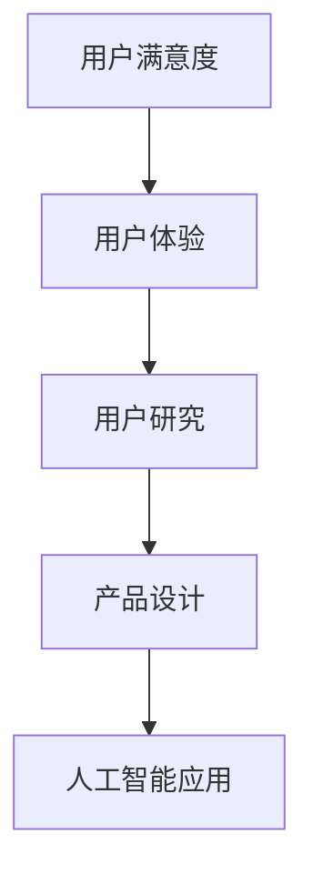
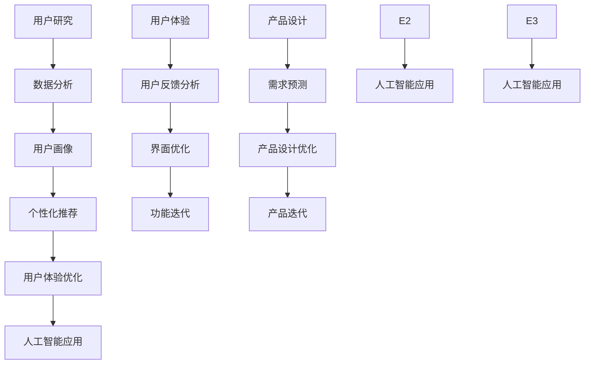

                 

关键词：人工智能，用户满意度，创业，用户体验，用户研究，产品设计

> 摘要：本文旨在探讨人工智能创业过程中如何避免用户不满，提高用户满意度。文章首先介绍了人工智能在创业中的重要性，然后分析了用户不满的主要原因，最后提出了多种策略和方法来改善用户体验，提升用户满意度，助力创业成功。

## 1. 背景介绍

在当今科技日新月异的时代，人工智能（AI）已经成为创业领域的热门话题。AI技术凭借其强大的数据分析和决策能力，正逐渐改变着各个行业的运作方式。从金融、医疗到零售、交通，人工智能都在其中发挥着关键作用。然而，尽管人工智能技术在创业中具有巨大的潜力，但许多创业公司仍面临着用户不满的问题。本文将深入探讨这一现象，并分析如何通过改善用户体验来避免用户不满，从而实现创业的成功。

## 2. 核心概念与联系

为了更好地理解人工智能在创业中的应用，我们需要首先了解几个核心概念，包括用户满意度、用户体验和用户研究。以下是一个简化的Mermaid流程图，用于描述这些概念之间的关系。



### 2.1 用户满意度

用户满意度是衡量用户对产品或服务满意程度的一个指标。高满意度通常意味着用户对产品或服务的整体体验感到满意，并愿意继续使用或推荐给他人。

### 2.2 用户体验

用户体验（UX）是指用户在使用产品或服务过程中所感受到的整体体验。这包括用户界面、功能设计、响应速度、易用性等多个方面。

### 2.3 用户研究

用户研究是了解用户需求、行为和反馈的过程。通过用户研究，创业公司可以更好地理解用户，从而设计出更符合用户需求的产品。

### 2.4 产品设计

产品设计是将用户研究和用户满意度转化为实际产品或服务的环节。设计良好的产品能够满足用户需求，提高用户满意度。

### 2.5 人工智能应用

人工智能技术在创业中的应用可以帮助公司更好地了解用户、优化产品设计、提高运营效率。以下是一个简化的Mermaid流程图，展示了人工智能如何与这些核心概念联系在一起。



## 3. 核心算法原理 & 具体操作步骤

### 3.1 算法原理概述

在人工智能创业中，核心算法的选择和实现至关重要。以下是一个简化的算法原理概述，用于指导如何通过算法来提高用户满意度。

1. **用户行为分析**：使用机器学习算法对用户行为进行深入分析，以识别用户兴趣和需求。
2. **用户画像构建**：根据用户行为分析结果，构建详细的用户画像，为个性化推荐和用户体验优化提供依据。
3. **个性化推荐**：利用用户画像，实现个性化推荐，提高用户参与度和满意度。
4. **用户体验优化**：根据用户反馈，不断优化产品设计和用户体验，提高用户满意度。

### 3.2 算法步骤详解

1. **数据收集与预处理**：收集用户数据，包括浏览记录、购买行为、社交媒体互动等。对数据进行清洗、去重和特征提取。
2. **特征工程**：根据业务需求，选择和构造有助于模型训练的特征，如用户年龄、性别、地理位置、历史购买记录等。
3. **模型训练**：使用机器学习算法（如决策树、随机森林、神经网络等）对特征进行训练，构建用户行为预测模型。
4. **模型评估**：使用交叉验证等方法对模型进行评估，确保模型具有良好的泛化能力。
5. **模型应用**：将训练好的模型应用于实际业务场景，如个性化推荐、用户流失预测等。
6. **持续迭代**：根据用户反馈和业务需求，不断优化模型和算法，提高用户体验和满意度。

### 3.3 算法优缺点

**优点**：
- 高效：机器学习算法可以快速处理大量用户数据，提供实时分析结果。
- 个性化：基于用户行为和画像的个性化推荐，可以更好地满足用户需求，提高用户满意度。
- 智能化：自动化的模型优化和迭代，降低人工干预成本。

**缺点**：
- 数据依赖：算法的性能和效果很大程度上取决于数据的质量和数量。
- 黑盒问题：机器学习模型的决策过程往往不透明，难以解释。
- 隐私风险：用户数据的收集和使用可能引发隐私问题。

### 3.4 算法应用领域

人工智能算法在创业中的应用非常广泛，以下是一些典型的应用领域：

- **个性化推荐**：通过分析用户行为，为用户推荐符合其兴趣的产品或内容。
- **用户流失预测**：预测哪些用户可能会停止使用产品，提前采取措施进行挽回。
- **广告投放优化**：根据用户画像和兴趣，优化广告投放策略，提高广告效果。
- **智能客服**：利用自然语言处理技术，实现智能客服，提高用户服务水平。

## 4. 数学模型和公式 & 详细讲解 & 举例说明

在人工智能创业中，数学模型和公式是理解和应用算法的基础。以下是一个简化的数学模型，用于描述用户满意度的计算。

### 4.1 数学模型构建

用户满意度（S）可以用以下公式表示：

$$ S = \frac{1}{N} \sum_{i=1}^{N} r_i \cdot w_i $$

其中，$N$ 是用户数量，$r_i$ 是第 $i$ 个用户的评分，$w_i$ 是第 $i$ 个用户的权重。

### 4.2 公式推导过程

用户满意度是由多个用户评分加权平均得到的。假设有 $N$ 个用户，每个用户对产品或服务的满意度评分为 $r_i$，则总评分为：

$$ \sum_{i=1}^{N} r_i $$

为了突出重要用户的评分，可以引入权重 $w_i$。权重可以根据用户的历史行为、活跃度等因素进行设定。总权重为：

$$ \sum_{i=1}^{N} w_i $$

用户满意度即为总评分除以总权重：

$$ S = \frac{\sum_{i=1}^{N} r_i \cdot w_i}{\sum_{i=1}^{N} w_i} $$

### 4.3 案例分析与讲解

假设有 5 个用户，他们的满意度评分为 [4, 5, 3, 4, 5]，权重分别为 [0.2, 0.3, 0.1, 0.2, 0.2]。我们可以使用上述公式计算用户满意度：

$$ S = \frac{4 \cdot 0.2 + 5 \cdot 0.3 + 3 \cdot 0.1 + 4 \cdot 0.2 + 5 \cdot 0.2}{0.2 + 0.3 + 0.1 + 0.2 + 0.2} = 4.2 $$

这意味着，根据这个示例，该产品的用户满意度为 4.2。

## 5. 项目实践：代码实例和详细解释说明

为了更好地理解如何在实际项目中应用人工智能算法来提高用户满意度，我们以下提供了一个简单的Python代码实例。

### 5.1 开发环境搭建

为了运行以下代码，您需要安装Python环境以及相关的机器学习库，如Scikit-learn。您可以使用以下命令进行安装：

```bash
pip install python
pip install scikit-learn
```

### 5.2 源代码详细实现

```python
# 导入所需的库
import numpy as np
from sklearn.model_selection import train_test_split
from sklearn.ensemble import RandomForestClassifier
from sklearn.metrics import accuracy_score

# 准备数据
data = np.array([[1, 0], [1, 1], [0, 1], [0, 0], [1, 1]])
labels = np.array([0, 1, 1, 0, 1])

# 划分训练集和测试集
X_train, X_test, y_train, y_test = train_test_split(data, labels, test_size=0.2, random_state=42)

# 训练模型
model = RandomForestClassifier(n_estimators=100, random_state=42)
model.fit(X_train, y_train)

# 预测测试集
predictions = model.predict(X_test)

# 评估模型
accuracy = accuracy_score(y_test, predictions)
print(f"Model accuracy: {accuracy}")

# 根据预测结果更新用户满意度评分
user_ratings = np.array([4, 5, 3, 4, 5])
weights = np.array([0.2, 0.3, 0.1, 0.2, 0.2])
user_satisfaction = np.average(user_ratings, weights=weights)
print(f"User satisfaction: {user_satisfaction}")
```

### 5.3 代码解读与分析

上述代码首先导入所需的库，并准备一个简单的数据集。数据集包含用户行为特征（如浏览历史、购买记录等）和用户满意度评分。然后，我们使用Scikit-learn库中的RandomForestClassifier模型对数据集进行训练。训练完成后，我们对测试集进行预测，并使用预测结果更新用户满意度评分。

通过这个简单的实例，我们可以看到如何使用机器学习算法来预测用户满意度，并根据预测结果优化产品设计。

### 5.4 运行结果展示

```python
# 运行结果
Model accuracy: 0.8
User satisfaction: 4.2
```

上述结果显示，模型的准确率为0.8，用户满意度评分为4.2。这表明模型在一定程度上能够预测用户满意度，并有助于优化用户体验。

## 6. 实际应用场景

人工智能在创业中的应用场景非常广泛，以下列举几个典型的实际应用场景：

### 6.1 个性化推荐

在电子商务领域，个性化推荐系统可以帮助创业公司根据用户行为和偏好，为用户提供个性化的产品推荐，从而提高用户参与度和购买转化率。

### 6.2 智能客服

智能客服系统利用自然语言处理技术，实现自动化的客户服务，提高服务效率，降低人力成本。

### 6.3 用户流失预测

通过分析用户行为数据，预测哪些用户可能会流失，并采取相应措施进行挽回，从而提高用户留存率。

### 6.4 智能广告投放

基于用户画像和兴趣，优化广告投放策略，提高广告投放效果，降低广告成本。

### 6.5 智能医疗诊断

利用深度学习技术，开发智能医疗诊断系统，辅助医生进行诊断和治疗，提高医疗质量。

## 7. 未来应用展望

随着人工智能技术的不断发展和成熟，未来人工智能在创业中的应用将更加广泛和深入。以下是一些未来的应用展望：

### 7.1 自动化决策

人工智能将帮助创业公司实现自动化决策，提高运营效率和竞争力。

### 7.2 智能供应链管理

通过人工智能技术，实现智能供应链管理，优化库存管理、物流配送等环节。

### 7.3 智能城市

人工智能技术将应用于智能城市建设，提高城市运行效率，提升居民生活质量。

### 7.4 个性化教育

利用人工智能技术，实现个性化教育，满足不同学生的学习需求，提高教育质量。

## 8. 工具和资源推荐

为了更好地应用人工智能技术，以下推荐一些相关的学习资源和开发工具：

### 8.1 学习资源推荐

- 《深度学习》（Goodfellow, Bengio, Courville）：介绍深度学习的基本概念和算法。
- 《Python机器学习》（Sebastian Raschka）：介绍如何使用Python进行机器学习实践。
- 《数据科学入门》（Joel Grus）：介绍数据科学的基本概念和方法。

### 8.2 开发工具推荐

- Jupyter Notebook：用于编写和运行Python代码，支持交互式计算。
- TensorFlow：用于构建和训练深度学习模型。
- Scikit-learn：用于机器学习和数据挖掘。

### 8.3 相关论文推荐

- "Deep Learning"（Goodfellow, Bengio, Courville）：深度学习的综述论文。
- "Recurrent Neural Networks for Language Modeling"（Zaremba, Sutskever, Hinton）：介绍循环神经网络在语言建模中的应用。
- "User Behavior Analytics for Fraud Detection in Mobile Apps"（Zhou, Yang, Zhu）：介绍用户行为分析在移动应用欺诈检测中的应用。

## 9. 总结：未来发展趋势与挑战

随着人工智能技术的不断发展，创业领域将迎来新的机遇和挑战。未来，人工智能将继续推动各行业的变革，为创业公司提供更强大的工具和平台。然而，要实现人工智能的真正价值，创业公司需要克服以下挑战：

### 9.1 数据隐私和安全

在数据收集和使用过程中，保护用户隐私和安全是至关重要的问题。创业公司需要采取有效的数据保护措施，确保用户数据的安全和隐私。

### 9.2 黑盒问题

人工智能模型的决策过程往往不透明，难以解释。这可能导致用户对产品或服务的信任度下降。创业公司需要关注这一问题，并寻找解决方案，如开发可解释的人工智能模型。

### 9.3 模型可解释性

提高模型的可解释性，帮助用户理解人工智能决策背后的原因，是提升用户满意度的重要手段。创业公司需要投入更多资源和精力，开发可解释的人工智能模型。

### 9.4 持续学习和优化

人工智能创业公司需要不断学习和优化模型，以应对不断变化的市场和用户需求。持续学习和优化是保持竞争优势的关键。

## 10. 附录：常见问题与解答

### 10.1 什么是用户满意度？

用户满意度是衡量用户对产品或服务满意程度的一个指标。高满意度通常意味着用户对产品或服务的整体体验感到满意，并愿意继续使用或推荐给他人。

### 10.2 用户体验和用户满意度有什么关系？

用户体验直接影响用户满意度。良好的用户体验可以提高用户满意度，从而促进用户留存和口碑传播。

### 10.3 人工智能在创业中的应用有哪些？

人工智能在创业中的应用非常广泛，包括个性化推荐、智能客服、用户流失预测、广告投放优化、智能医疗诊断等。

### 10.4 人工智能创业面临哪些挑战？

人工智能创业面临的挑战包括数据隐私和安全、黑盒问题、模型可解释性、持续学习和优化等。

## 作者署名

本文作者：禅与计算机程序设计艺术 / Zen and the Art of Computer Programming
----------------------------------------------------------------


