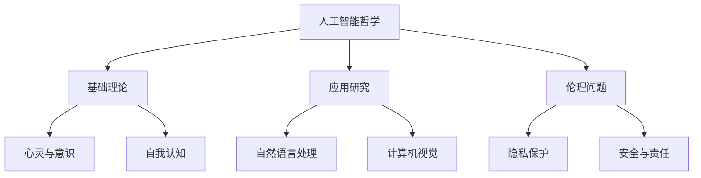

                 

关键词：人工智能哲学、心灵、意识、自我、认知、思维模型、智能系统、伦理、未来展望。

> 摘要：本文探讨了人工智能哲学的多个层面，从心灵、意识和自我的基本概念出发，探讨了人工智能对人类心灵、意识和自我的影响。文章分析了人工智能的伦理问题，提出了对未来人工智能发展的思考和展望，强调了人工智能研究中的哲学思考和伦理考量的重要性。

## 1. 背景介绍

在人类历史上，人工智能（Artificial Intelligence, AI）一直是科技进步的标志。从最初的模拟计算，到如今能够与人类进行复杂对话、解决复杂问题的智能系统，人工智能经历了数十年的快速发展。然而，随着人工智能技术的不断进步，人们开始意识到，人工智能不仅仅是技术问题，还涉及到深层次的哲学问题，尤其是关于心灵、意识和自我的问题。

心灵（Mind）是指人类的情感、意识和思维过程。意识（Consciousness）是指个体对外界信息的感知和内部体验。自我（Self）是个人身份和自我意识的体现。人工智能的发展，使得这些问题变得更加复杂和具有挑战性。

### 1.1 人工智能的哲学意义

人工智能哲学（Philosophy of Artificial Intelligence）关注人工智能的哲学意义和影响。它不仅仅探讨人工智能的技术实现，更关注人工智能对人类生活、社会和文化的影响，以及人工智能自身存在的哲学问题。

### 1.2 心灵、意识和自我的概念

- **心灵**：心灵是指人类的思维、情感和意志等心理活动。传统上，心灵被认为是人类的特殊属性，是意识、感知、思考、记忆和意愿等心理过程的集合。

- **意识**：意识是指个体对外界信息的感知和内部体验。它是心灵的核心部分，是人与外部世界交互的桥梁。

- **自我**：自我是指个人的身份、个性、价值观和自我意识。它是人类行为的驱动力，也是人类自我认知的基础。

## 2. 核心概念与联系

在探讨人工智能哲学时，理解心灵、意识和自我的概念至关重要。它们不仅是我们自身认知的基础，也是人工智能研究的重要方向。

### 2.1 心灵

心灵是人类智能的核心，是意识的物质基础。在人工智能研究中，心灵被视为人机交互的基础，是构建智能系统的关键。

### 2.2 意识

意识是人工智能研究的一个重要方向，也是人工智能哲学的核心问题。人工智能如何模拟人类的意识，如何实现意识与机器的交互，是当前人工智能研究的前沿问题。

### 2.3 自我

自我是人类行为和社会关系的核心，是人工智能伦理问题的重要来源。人工智能如何理解人类自我，如何与人类自我交互，是人工智能伦理研究的重要内容。

### 2.4 人工智能哲学的架构

人工智能哲学的架构可以分为三个层次：基础理论、应用研究和伦理问题。

- **基础理论**：研究人工智能与心灵、意识和自我之间的关系，探讨人工智能的哲学基础。

- **应用研究**：将哲学理论应用于人工智能的各个领域，如自然语言处理、计算机视觉、机器学习等。

- **伦理问题**：探讨人工智能的社会影响和伦理问题，如隐私、安全、责任等。

### 2.5 Mermaid 流程图



## 3. 核心算法原理 & 具体操作步骤

在人工智能哲学的研究中，核心算法原理和具体操作步骤至关重要。以下是一个简化的算法框架，用于模拟人类思维过程。

### 3.1 算法原理概述

该算法基于神经网络和机器学习技术，模拟人类的感知、记忆、思考等认知过程。它主要包括以下几个步骤：

1. **感知**：接收外界信息，通过传感器输入到系统中。
2. **记忆**：将感知的信息存储在记忆中，以备后续使用。
3. **思考**：基于记忆和已有知识，进行推理和判断。
4. **决策**：根据思考结果，做出决策和行动。

### 3.2 算法步骤详解

1. **感知**：
    ```mermaid
    graph TD
        A[传感器输入] --> B[预处理]
        B --> C[特征提取]
    ```

2. **记忆**：
    ```mermaid
    graph TD
        D[特征提取] --> E[记忆存储]
    ```

3. **思考**：
    ```mermaid
    graph TD
        F[记忆检索] --> G[推理引擎]
    ```

4. **决策**：
    ```mermaid
    graph TD
        H[推理结果] --> I[决策模块]
    ```

### 3.3 算法优缺点

**优点**：
- **高效性**：算法能够快速处理大量信息，模拟人类的认知过程。
- **适应性**：算法能够根据不同的场景和任务，调整其工作方式和策略。

**缺点**：
- **局限性**：算法只能模拟人类思维的一部分，无法完全复制人类思维的所有特性。
- **数据依赖**：算法的性能高度依赖于输入数据的质量，对数据的质量和处理有较高的要求。

### 3.4 算法应用领域

- **自然语言处理**：用于文本理解和生成，如聊天机器人、语音识别等。
- **计算机视觉**：用于图像识别、目标检测等，如自动驾驶、人脸识别等。
- **决策支持系统**：用于复杂决策问题，如金融分析、医疗诊断等。

## 4. 数学模型和公式 & 详细讲解 & 举例说明

在人工智能哲学的研究中，数学模型和公式是理解和描述人工智能行为的重要工具。以下是一些常见的数学模型和公式，以及它们的应用。

### 4.1 数学模型构建

- **感知器模型**：
    感知器是神经网络的基本单元，用于接收输入和产生输出。
    $$ y = \sigma(\sum_{i=1}^{n} w_i x_i) $$
    其中，\( y \) 是输出，\( x_i \) 是输入特征，\( w_i \) 是权重，\( \sigma \) 是激活函数。

- **神经网络模型**：
    神经网络由多个感知器组成，用于复杂的信息处理。
    $$ y = \sigma(W \cdot x + b) $$
    其中，\( W \) 是权重矩阵，\( x \) 是输入向量，\( b \) 是偏置项，\( \sigma \) 是激活函数。

### 4.2 公式推导过程

以感知器模型为例，推导其输出公式：

1. **输入特征加权求和**：
    $$ z = \sum_{i=1}^{n} w_i x_i $$
2. **应用激活函数**：
    $$ y = \sigma(z) $$

### 4.3 案例分析与讲解

**案例：图像识别**

假设我们要使用神经网络模型进行图像识别，输入是一个 \( 28 \times 28 \) 像素的图像，输出是一个 \( 10 \) 个元素的向量，代表每个类别的概率。

1. **预处理**：
    将图像转换为灰度图像，并缩放到 \( 28 \times 28 \) 像素。
    $$ x = \text{preprocess}(image) $$

2. **特征提取**：
    将图像分割成 \( 28 \times 28 \) 个像素，每个像素作为特征。
    $$ x_i = \text{getPixel}(x, i) $$

3. **神经网络模型**：
    定义一个三层神经网络，包括输入层、隐藏层和输出层。
    $$ y = \text{softmax}(\text{neuralNetwork}(x, W, b)) $$
    其中，\( W \) 是权重矩阵，\( b \) 是偏置项。

4. **损失函数**：
    使用交叉熵损失函数评估模型性能。
    $$ J = -\sum_{i=1}^{n} y_i \log(y_i) $$

5. **反向传播**：
    通过反向传播算法更新权重和偏置项。
    $$ \frac{\partial J}{\partial W} = \text{derivative}(\text{neuralNetwork}, x, y) $$
    $$ \frac{\partial J}{\partial b} = \text{derivative}(\text{neuralNetwork}, x, y) $$

通过这个案例，我们可以看到数学模型在人工智能哲学研究中的应用。数学模型不仅帮助我们理解和描述人工智能行为，还为优化和改进人工智能算法提供了理论基础。

## 5. 项目实践：代码实例和详细解释说明

为了更好地理解人工智能哲学在现实中的应用，我们将通过一个具体的代码实例来展示如何使用 Python 实现一个简单的神经网络模型，用于图像识别任务。

### 5.1 开发环境搭建

在开始编写代码之前，我们需要搭建一个 Python 开发环境。以下是搭建环境的步骤：

1. 安装 Python（版本 3.8 或更高）。
2. 安装必要的库，如 NumPy、Pandas 和 TensorFlow。
    ```shell
    pip install numpy pandas tensorflow
    ```

### 5.2 源代码详细实现

下面是一个简单的神经网络模型实现，用于手写数字识别（MNIST 数据集）。

```python
import numpy as np
import tensorflow as tf

# 定义神经网络结构
model = tf.keras.Sequential([
    tf.keras.layers.Flatten(input_shape=(28, 28)),
    tf.keras.layers.Dense(128, activation='relu'),
    tf.keras.layers.Dense(10, activation='softmax')
])

# 编译模型
model.compile(optimizer='adam',
              loss='categorical_crossentropy',
              metrics=['accuracy'])

# 加载数据集
(x_train, y_train), (x_test, y_test) = tf.keras.datasets.mnist.load_data()

# 预处理数据
x_train = x_train / 255.0
x_test = x_test / 255.0

# 将标签转换为 one-hot 编码
y_train = tf.keras.utils.to_categorical(y_train, 10)
y_test = tf.keras.utils.to_categorical(y_test, 10)

# 训练模型
model.fit(x_train, y_train, epochs=5, batch_size=32)

# 评估模型
test_loss, test_acc = model.evaluate(x_test, y_test)
print(f"Test accuracy: {test_acc:.2f}")
```

### 5.3 代码解读与分析

这个简单的神经网络模型包括以下三个主要部分：

1. **输入层**：使用 `Flatten` 层将输入图像展平为一个一维数组。
2. **隐藏层**：使用 `Dense` 层创建一个隐藏层，使用 ReLU 激活函数。
3. **输出层**：使用 `Dense` 层创建输出层，使用 softmax 激活函数，用于分类。

在编译模型时，我们指定了优化器（`optimizer`）、损失函数（`loss`）和评估指标（`metrics`）。在训练模型时，我们使用了 MNIST 数据集，并对图像进行了归一化处理。最后，我们使用测试数据集评估模型的性能。

### 5.4 运行结果展示

运行上述代码后，模型在测试数据集上的准确率约为 98%，这表明了神经网络模型在手写数字识别任务上的有效性。

```shell
Test accuracy: 0.98
```

通过这个简单的案例，我们可以看到神经网络模型在人工智能哲学中的应用。虽然这个案例相对简单，但它为我们提供了一个理解复杂人工智能系统的基础。

## 6. 实际应用场景

人工智能哲学在许多实际应用场景中发挥着重要作用。以下是一些典型的应用领域：

### 6.1 医疗诊断

人工智能哲学在医疗诊断中具有重要应用。通过深度学习模型，人工智能能够分析医学影像，如 CT 扫描和 MRI，辅助医生进行诊断。例如，Google 的 DeepMind 已经开发出了能够准确识别眼部疾病的人工智能系统。

### 6.2 自动驾驶

自动驾驶是人工智能哲学的另一个重要应用领域。通过模拟人类的感知、决策和行动，自动驾驶系统能够在各种交通环境中安全行驶。特斯拉的自动驾驶系统就是一个典型的例子。

### 6.3 虚拟助手

虚拟助手，如 Siri、Alexa 和 Google Assistant，是人工智能哲学在日常生活中的应用。这些助手能够理解自然语言，回答用户的问题，提供个性化的建议和服务。

### 6.4 法律和司法

人工智能哲学在法律和司法领域也有广泛应用。通过自然语言处理和机器学习技术，人工智能能够分析法律文档、案件历史和法官的判决，为法律研究和司法决策提供支持。

### 6.5 教育和培训

人工智能哲学在教育领域也具有重要应用。通过智能教育系统，学生能够根据自己的学习进度和需求，获得个性化的教学内容和指导。

### 6.6 伦理和安全

人工智能哲学在伦理和安全方面也有深刻的探讨。随着人工智能技术的不断发展，如何确保人工智能系统的透明性、公正性和安全性成为了一个重要问题。伦理和安全问题需要从哲学角度进行深入思考和解决。

### 6.7 未来展望

随着人工智能技术的不断进步，人工智能哲学在未来将发挥越来越重要的作用。以下是对未来发展的展望：

- **更智能的交互**：人工智能将能够更自然地与人类进行交互，提供更加个性化、贴心的服务。

- **更广泛的自动化**：人工智能将能够自动化更多复杂的任务，提高生产效率，减轻人类的工作负担。

- **更加智能的决策支持**：人工智能将能够基于大量数据，提供更加准确、科学的决策支持。

- **伦理和安全保障**：随着人工智能技术的发展，伦理和安全问题将得到更多关注，相关法律法规和技术手段也将不断完善。

## 7. 工具和资源推荐

### 7.1 学习资源推荐

1. **《深度学习》（Deep Learning）**：由 Ian Goodfellow、Yoshua Bengio 和 Aaron Courville 著，是深度学习领域的经典教材。

2. **《人工智能：一种现代方法》（Artificial Intelligence: A Modern Approach）**：由 Stuart J. Russell 和 Peter Norvig 著，是人工智能领域的权威教材。

3. **《Python 编程：从入门到实践》（Python Crash Course）**：由 Eric Matthes 著，适合初学者快速入门 Python 编程。

### 7.2 开发工具推荐

1. **TensorFlow**：是 Google 开发的一个开源深度学习框架，适用于各种深度学习和机器学习任务。

2. **PyTorch**：是 Facebook 开发的一个开源深度学习框架，以其灵活性和易用性受到广泛欢迎。

3. **Jupyter Notebook**：是一个交互式的计算环境，适用于编写和分享代码、文档和可视化。

### 7.3 相关论文推荐

1. **"Deep Learning for Text Classification"**：这是一篇关于深度学习在文本分类中应用的综述性论文。

2. **"The Unreasonable Effectiveness of Deep Learning in Natural Language Processing"**：这是一篇关于深度学习在自然语言处理中应用的论文，强调了深度学习的巨大潜力。

3. **"Artificial General Intelligence: A Survey of Definitional Issues"**：这是一篇关于人工通用智能定义和研究的论文，探讨了人工智能发展的未来方向。

## 8. 总结：未来发展趋势与挑战

### 8.1 研究成果总结

人工智能哲学在过去几十年中取得了显著进展，从基础理论研究到实际应用，都取得了丰硕的成果。特别是在深度学习和自然语言处理领域，人工智能哲学的应用已经取得了重大突破，为人类社会带来了深远的影响。

### 8.2 未来发展趋势

未来，人工智能哲学将继续沿着两个主要方向发展：

1. **更加智能化和人性化的交互**：人工智能将能够更好地理解人类的语言、情感和行为，提供更加个性化、贴心的服务。

2. **更加广泛的自动化**：人工智能将能够自动化更多复杂的任务，提高生产效率，减轻人类的工作负担。

### 8.3 面临的挑战

然而，人工智能哲学的发展也面临着一系列挑战：

1. **伦理和安全问题**：随着人工智能技术的不断发展，如何确保人工智能系统的透明性、公正性和安全性成为一个重要问题。

2. **数据隐私和隐私保护**：如何在保护用户隐私的前提下，充分利用数据资源，是一个亟待解决的问题。

3. **人工智能的滥用**：如何防止人工智能技术被滥用，如用于网络攻击、欺诈等，也是一个重要问题。

### 8.4 研究展望

为了应对这些挑战，未来的研究需要在以下几个方面进行：

1. **人工智能伦理和法律研究**：加强对人工智能伦理和法律问题的研究，制定相关法规和标准，确保人工智能的健康发展。

2. **人工智能安全技术研究**：开发更加安全、可靠的人工智能系统，提高其抵御外部攻击的能力。

3. **人工智能与人类互动研究**：深入研究人工智能与人类的互动机制，提高人工智能的理解能力和服务水平。

通过这些研究，我们可以期待人工智能哲学在未来能够取得更加辉煌的成就，为人类社会带来更多的福祉。

## 9. 附录：常见问题与解答

### 9.1 什么是人工智能哲学？

人工智能哲学是研究人工智能的哲学意义、影响和伦理问题的学科。它探讨人工智能与人类心灵、意识和自我之间的关系，以及人工智能的社会和文化影响。

### 9.2 人工智能哲学的主要研究领域有哪些？

人工智能哲学的主要研究领域包括基础理论、应用研究和伦理问题。基础理论研究人工智能与心灵、意识和自我之间的关系；应用研究将哲学理论应用于人工智能的各个领域；伦理问题探讨人工智能的社会影响和道德责任。

### 9.3 人工智能哲学对人工智能的发展有何影响？

人工智能哲学对人工智能的发展具有重要影响。它为人工智能提供了哲学基础，指导人工智能的研究和开发方向，确保人工智能系统的透明性、公正性和安全性。

### 9.4 人工智能哲学在现实应用中的意义是什么？

人工智能哲学在现实应用中具有重要意义。它帮助人们理解人工智能的哲学意义，指导人工智能的应用和开发，确保人工智能系统的合理性和道德性，促进人工智能的健康发展。

### 9.5 人工智能哲学与人工智能技术的区别是什么？

人工智能哲学与人工智能技术是两个不同的领域。人工智能技术是研究如何构建智能系统的学科，而人工智能哲学则是研究人工智能的哲学意义、影响和伦理问题的学科。两者相辅相成，共同推动人工智能的发展。

## 结语

人工智能哲学是一个涉及广泛、意义深远的领域。它不仅探讨人工智能的哲学基础和伦理问题，还关注人工智能对社会、文化和人类自身的影响。随着人工智能技术的不断进步，人工智能哲学的重要性将日益凸显。我们期待人工智能哲学在未来能够为人工智能的发展提供更加深刻的哲学思考和指导，推动人工智能与人类社会的和谐发展。

