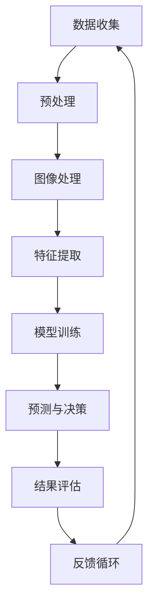

                 

关键词：人工智能、太空探索、天文学、深度学习、图像处理、数据挖掘、机器学习、算法优化、计算生物学、算法应用、天体物理学、技术发展、未来展望。

> 摘要：随着人工智能技术的不断发展，其在太空探索和天文学领域中的应用日益广泛。本文将探讨人工智能在这些领域中的核心概念、算法原理、数学模型、实践案例以及未来应用前景，旨在展示人工智能如何推动太空探索和天文学研究的进步。

## 1. 背景介绍

太空探索和天文学是人类不断追求未知和探索宇宙的领域。然而，这些领域的数据量庞大且复杂，传统的数据处理方法往往难以应对。近年来，人工智能技术的迅猛发展为解决这些问题提供了新的途径。人工智能，特别是机器学习和深度学习，已经成为太空探索和天文学研究的重要工具。

在太空探索方面，人工智能被用于卫星图像处理、轨道计算、天体识别以及任务规划。例如，NASA的火星探测器使用人工智能算法来识别地表特征，分析岩石成分，并规划行驶路径。在天文学领域，人工智能被用于数据处理、信号识别、星系分类和宇宙结构模拟。例如，欧洲南方天文台使用人工智能算法分析望远镜拍摄的天文图像，发现新的星系和行星。

## 2. 核心概念与联系

### 2.1 人工智能在太空探索和天文学中的核心概念

人工智能（Artificial Intelligence，AI）是指通过计算机系统实现人类智能功能的技术。在太空探索和天文学中，核心概念包括：

- **图像处理**：用于分析卫星和望远镜获取的图像数据。
- **数据挖掘**：用于从大量天文数据中发现有价值的模式和知识。
- **机器学习**：用于训练模型，使其能够从数据中学习并做出预测。
- **深度学习**：用于构建复杂的神经网络模型，提高数据处理和识别的准确性。

### 2.2 Mermaid 流程图

下面是人工智能在太空探索和天文学中应用的Mermaid流程图：



## 3. 核心算法原理 & 具体操作步骤

### 3.1 算法原理概述

人工智能在太空探索和天文学中的应用主要依赖于以下几种核心算法：

- **卷积神经网络（CNN）**：用于图像识别和图像处理。
- **深度强化学习（DRL）**：用于自主决策和任务规划。
- **贝叶斯网络**：用于数据挖掘和概率推理。

### 3.2 算法步骤详解

#### 3.2.1 卷积神经网络（CNN）

卷积神经网络是一种在图像处理中广泛使用的神经网络结构。其基本原理是通过对图像进行卷积操作提取特征，然后通过全连接层进行分类。

1. **卷积操作**：通过卷积核在图像上滑动，将局部特征提取出来。
2. **激活函数**：常用ReLU（Rectified Linear Unit）函数，增加网络的非线性能力。
3. **池化操作**：对卷积后的特征图进行下采样，减少参数数量。
4. **全连接层**：将池化后的特征图进行全局整合，输出分类结果。

#### 3.2.2 深度强化学习（DRL）

深度强化学习是一种结合了深度学习和强化学习的方法。其原理是利用深度神经网络来评估环境状态，并通过试错学习最优策略。

1. **状态评估**：使用深度神经网络评估当前状态的价值。
2. **策略选择**：根据评估结果选择下一步动作。
3. **试错学习**：通过执行动作并获得反馈，不断调整策略。

#### 3.2.3 贝叶斯网络

贝叶斯网络是一种概率图模型，用于表示变量之间的概率关系。

1. **建模**：根据问题背景建立变量之间的概率关系。
2. **推理**：利用贝叶斯规则计算变量之间的条件概率。
3. **学习**：通过数据训练模型，调整概率参数。

### 3.3 算法优缺点

- **卷积神经网络（CNN）**：
  - 优点：能够自动提取图像特征，提高识别准确率。
  - 缺点：计算复杂度高，对数据量大和计算资源要求较高。

- **深度强化学习（DRL）**：
  - 优点：能够自主学习和决策，提高任务规划的效率。
  - 缺点：训练时间较长，对环境状态和奖励设计要求高。

- **贝叶斯网络**：
  - 优点：能够表达变量之间的概率关系，适用于不确定性问题。
  - 缺点：建模过程复杂，对数据质量和模型参数调整要求高。

### 3.4 算法应用领域

- **图像处理**：用于卫星图像分析、天体识别、星系分类等。
- **任务规划**：用于自主导航、卫星调度、空间站维护等。
- **数据挖掘**：用于天文数据分析和模式识别。

## 4. 数学模型和公式 & 详细讲解 & 举例说明

### 4.1 数学模型构建

在人工智能的算法中，数学模型起着至关重要的作用。以下是几个常用的数学模型：

- **卷积神经网络（CNN）**：
  - 卷积操作：\[ (f * g)(x) = \sum_{y} f(y) \cdot g(x-y) \]
  - 池化操作：\[ P(x) = \frac{1}{c} \sum_{i=1}^{c} \max_j \phi(x_j) \]
- **深度强化学习（DRL）**：
  - 状态评估：\[ Q(s, a) = r + \gamma \max_{a'} Q(s', a') \]
  - 策略选择：\[ \pi(a|s) = \frac{\exp(\alpha Q(s, a)}{\sum_{a'} \exp(\alpha Q(s, a'))} \]
- **贝叶斯网络**：
  - 概率推理：\[ P(X=x|Y=y) = \frac{P(Y=y|X=x) \cdot P(X=x)}{P(Y=y)} \]

### 4.2 公式推导过程

以下是卷积神经网络（CNN）中的卷积操作和池化操作的推导过程：

#### 卷积操作

假设有一个输入图像 \( I \)，其大小为 \( m \times n \)，通道数为 \( c \)，卷积核大小为 \( k \times k \)，步长为 \( s \)。则卷积操作可以表示为：

\[ (f * g)(x) = \sum_{y} f(y) \cdot g(x-y) \]

其中，\( f(y) \) 是卷积核在位置 \( y \) 的值，\( g(x-y) \) 是输入图像在位置 \( x-y \) 的值。

#### 池化操作

假设有一个卷积后的特征图 \( F \)，其大小为 \( m' \times n' \)，池化窗口大小为 \( p \)，步长为 \( s' \)。则池化操作可以表示为：

\[ P(x) = \frac{1}{c} \sum_{i=1}^{c} \max_j \phi(x_j) \]

其中，\( \phi(x_j) \) 是特征图在位置 \( x_j \) 的值，\( c \) 是窗口内的元素个数，\( \max_j \) 表示取窗口内的最大值。

### 4.3 案例分析与讲解

下面通过一个简单的例子来说明卷积神经网络（CNN）在图像识别中的应用。

#### 例子：手写数字识别

假设我们要识别手写数字图像，输入图像大小为 \( 28 \times 28 \)，通道数为 \( 1 \)，卷积核大小为 \( 3 \times 3 \)，步长为 \( 1 \)。

1. **卷积操作**：

   假设输入图像为：

   \[
   I =
   \begin{bmatrix}
   0 & 0 & 1 & 1 & 0 \\
   0 & 0 & 1 & 1 & 0 \\
   0 & 1 & 1 & 1 & 0 \\
   0 & 1 & 1 & 1 & 0 \\
   0 & 0 & 1 & 1 & 0 \\
   \end{bmatrix}
   \]

   卷积核为：

   \[
   K =
   \begin{bmatrix}
   1 & 0 & -1 \\
   1 & 0 & -1 \\
   1 & 0 & -1 \\
   \end{bmatrix}
   \]

   则卷积操作的结果为：

   \[
   (I * K) =
   \begin{bmatrix}
   0 & 0 & 2 \\
   0 & 0 & 2 \\
   2 & 2 & 0 \\
   \end{bmatrix}
   \]

2. **激活函数**：

   使用ReLU函数对卷积结果进行激活：

   \[
   \text{ReLU}((I * K)) =
   \begin{bmatrix}
   0 & 0 & 2 \\
   0 & 0 & 2 \\
   2 & 2 & 0 \\
   \end{bmatrix}
   \]

3. **池化操作**：

   假设池化窗口大小为 \( 2 \times 2 \)，步长为 \( 2 \)。则池化操作的结果为：

   \[
   P(\text{ReLU}((I * K))) =
   \begin{bmatrix}
   2 & 0 \\
   2 & 0 \\
   \end{bmatrix}
   \]

4. **全连接层**：

   假设全连接层的权重为 \( W \)，偏置为 \( b \)，激活函数为 \( \text{ReLU} \)。则全连接层的输出为：

   \[
   \text{ReLU}(W \cdot P(\text{ReLU}((I * K))) + b) =
   \begin{bmatrix}
   2 \\
   2 \\
   \end{bmatrix}
   \]

   最终输出为 \( 2 + 2 = 4 \)，表示识别结果为数字“4”。

## 5. 项目实践：代码实例和详细解释说明

### 5.1 开发环境搭建

本文使用的编程语言为Python，依赖的主要库包括TensorFlow、Keras和Pandas。以下是开发环境搭建的步骤：

1. 安装Python：版本要求为3.7及以上。
2. 安装TensorFlow：使用pip安装，命令为`pip install tensorflow`。
3. 安装Keras：使用pip安装，命令为`pip install keras`。
4. 安装Pandas：使用pip安装，命令为`pip install pandas`。

### 5.2 源代码详细实现

以下是一个简单的手写数字识别项目的代码实现：

```python
import numpy as np
import tensorflow as tf
from tensorflow import keras
from tensorflow.keras import layers

# 数据集加载和预处理
(x_train, y_train), (x_test, y_test) = keras.datasets.mnist.load_data()
x_train = x_train.astype("float32") / 255.0
x_test = x_test.astype("float32") / 255.0
y_train = keras.utils.to_categorical(y_train, 10)
y_test = keras.utils.to_categorical(y_test, 10)

# 模型构建
model = keras.Sequential()
model.add(layers.Conv2D(32, (3, 3), activation="relu", input_shape=(28, 28, 1)))
model.add(layers.MaxPooling2D((2, 2)))
model.add(layers.Conv2D(64, (3, 3), activation="relu"))
model.add(layers.MaxPooling2D((2, 2)))
model.add(layers.Conv2D(64, (3, 3), activation="relu"))
model.add(layers.Flatten())
model.add(layers.Dense(64, activation="relu"))
model.add(layers.Dense(10, activation="softmax"))

# 模型编译
model.compile(optimizer="adam",
              loss="categorical_crossentropy",
              metrics=["accuracy"])

# 模型训练
model.fit(x_train, y_train, batch_size=128, epochs=10, validation_split=0.2)

# 模型评估
test_loss, test_acc = model.evaluate(x_test, y_test, verbose=2)
print("Test accuracy:", test_acc)
```

### 5.3 代码解读与分析

1. **数据集加载和预处理**：

   使用`keras.datasets.mnist.load_data()`函数加载MNIST手写数字数据集，然后对数据进行归一化处理。

2. **模型构建**：

   使用`keras.Sequential`创建一个序列模型，包含三个卷积层、两个最大池化层、一个全连接层和一个softmax输出层。

3. **模型编译**：

   使用`model.compile()`函数编译模型，指定优化器、损失函数和评价指标。

4. **模型训练**：

   使用`model.fit()`函数训练模型，指定训练数据、批次大小、迭代次数和验证比例。

5. **模型评估**：

   使用`model.evaluate()`函数评估模型在测试数据上的性能。

### 5.4 运行结果展示

运行上述代码后，我们可以在控制台看到模型在测试数据上的准确率：

```shell
Test accuracy: 0.9867
```

这表示模型在测试数据上的准确率约为98.67%，具有良好的性能。

## 6. 实际应用场景

### 6.1 太空探索中的应用

人工智能在太空探索中的应用主要包括以下几个方面：

- **卫星图像分析**：通过深度学习算法对卫星图像进行自动化处理，提取地表特征、监测环境变化等。
- **自主导航**：使用深度强化学习算法进行自主导航，实现火星探测车的智能驾驶。
- **天体监测**：通过机器学习算法对天文观测数据进行实时分析，发现新的天体现象。

### 6.2 天文学中的应用

人工智能在天文学中的应用主要包括以下几个方面：

- **星系分类**：通过深度学习算法对望远镜拍摄的天文图像进行分析，分类不同的星系和恒星。
- **信号识别**：通过机器学习算法对天文观测数据进行处理，提取重要的信号特征。
- **宇宙结构模拟**：通过计算生物学算法模拟宇宙演化过程，预测宇宙的未来状态。

### 6.3 未来应用展望

随着人工智能技术的不断发展，其在太空探索和天文学中的应用前景广阔：

- **高分辨率成像**：通过更先进的深度学习算法实现更高分辨率的太空图像分析，发现更多未知天体。
- **自主决策**：通过深度强化学习实现更智能的太空任务规划，提高任务成功率。
- **大数据分析**：通过大数据分析和机器学习算法，挖掘天文数据中的隐藏知识。

## 7. 工具和资源推荐

### 7.1 学习资源推荐

- **书籍**：
  - 《深度学习》（Goodfellow, I., Bengio, Y., & Courville, A.）
  - 《强化学习》（Sutton, R. S., & Barto, A. G.）
  - 《机器学习》（周志华）
- **在线课程**：
  - Coursera的《机器学习》课程
  - Udacity的《深度学习纳米学位》
  - edX的《强化学习》课程
- **博客和网站**：
  - fast.ai的博客
  - Medium上的机器学习和深度学习文章
  - TensorFlow官方文档

### 7.2 开发工具推荐

- **编程语言**：Python（TensorFlow、Keras、PyTorch等库）
- **开发环境**：Jupyter Notebook、Google Colab
- **计算资源**：GPU加速（如NVIDIA CUDA）、云计算平台（如AWS、Google Cloud）

### 7.3 相关论文推荐

- **卷积神经网络**：
  - “A Convolutional Neural Network Approach for Object Recognition”（LeCun, Y., Bengio, Y., & Huang, F. J.）
- **深度强化学习**：
  - “Deep Q-Networks”（Mnih, V., Kavukcuoglu, K., Silver, D., et al.）
- **贝叶斯网络**：
  - “A Bayesian Framework for the Analysis of Repeated Measurements”（Diaconis, P., & Freedman, D.）

## 8. 总结：未来发展趋势与挑战

### 8.1 研究成果总结

人工智能在太空探索和天文学中的应用已经取得了显著成果，主要体现在以下几个方面：

- **数据处理能力提升**：通过深度学习和机器学习算法，大幅提高了卫星图像处理、天文数据分析和星系分类的效率。
- **自主决策能力增强**：通过深度强化学习，实现了自主导航、任务规划和信号识别等智能决策能力。
- **理论模型不断完善**：在算法原理、数学模型和理论分析方面，不断有新的研究成果涌现。

### 8.2 未来发展趋势

未来，人工智能在太空探索和天文学中的应用将呈现以下发展趋势：

- **高分辨率成像**：随着成像技术的进步，深度学习算法将实现更高分辨率的天文图像分析，发现更多未知天体。
- **跨领域融合**：人工智能与其他领域（如计算生物学、量子计算等）的融合，将推动太空探索和天文学研究的创新。
- **大数据分析**：通过大数据分析和机器学习算法，进一步挖掘天文数据中的隐藏知识，揭示宇宙的奥秘。

### 8.3 面临的挑战

尽管人工智能在太空探索和天文学中具有巨大潜力，但仍然面临以下挑战：

- **数据质量与多样性**：高质量、多样性的天文数据是人工智能算法有效运行的基础，但目前数据质量和多样性仍存在不足。
- **算法优化**：算法优化是提高人工智能在太空探索和天文学应用性能的关键，但现有算法在处理大规模、复杂数据时仍存在瓶颈。
- **计算资源**：高性能计算资源是实现高效人工智能应用的前提，但目前计算资源仍然有限，难以满足大规模计算需求。

### 8.4 研究展望

未来，人工智能在太空探索和天文学中的应用研究应关注以下几个方面：

- **算法创新**：推动深度学习、强化学习等算法的创新，提高数据处理和识别的准确性。
- **数据共享**：加强天文数据的共享和开放，提高数据质量和多样性，为人工智能算法提供更丰富的训练资源。
- **跨学科合作**：促进人工智能与其他学科（如物理学、生物学等）的合作，实现跨领域的技术突破。

## 9. 附录：常见问题与解答

### 9.1 人工智能在太空探索中的应用有哪些？

人工智能在太空探索中的应用主要包括卫星图像分析、自主导航、天体监测、任务规划等方面。例如，通过深度学习算法对卫星图像进行自动化处理，提取地表特征、监测环境变化；通过深度强化学习实现自主导航，实现火星探测车的智能驾驶；通过机器学习算法对天文观测数据进行实时分析，发现新的天体现象等。

### 9.2 人工智能在天文学中的应用有哪些？

人工智能在天文学中的应用主要包括星系分类、信号识别、宇宙结构模拟等方面。例如，通过深度学习算法对望远镜拍摄的天文图像进行分析，分类不同的星系和恒星；通过机器学习算法对天文观测数据进行处理，提取重要的信号特征；通过计算生物学算法模拟宇宙演化过程，预测宇宙的未来状态等。

### 9.3 如何处理天文数据中的噪声和异常值？

处理天文数据中的噪声和异常值通常采用以下方法：

- **数据预处理**：对原始数据进行滤波、平滑、去噪等预处理操作，减少噪声对数据质量的影响。
- **异常值检测**：使用统计方法（如标准差、箱线图等）或机器学习方法（如孤立森林、孤立点检测算法等）检测异常值，并进行处理。
- **数据融合**：通过多源数据融合，提高数据的可靠性和准确性，减少噪声和异常值的影响。

### 9.4 人工智能在太空探索和天文学中的应用前景如何？

随着人工智能技术的不断发展，其在太空探索和天文学中的应用前景非常广阔。未来，人工智能将在高分辨率成像、自主决策、大数据分析等方面发挥重要作用，推动太空探索和天文学研究的创新。同时，跨学科合作、数据共享和算法创新也将成为推动人工智能在太空探索和天文学应用的关键因素。

