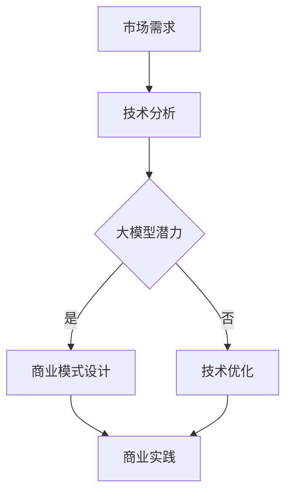

                 

关键词：人工智能、大模型、商业计划、技术发展、应用前景

> 摘要：本文旨在探讨人工智能大模型商业计划的构建与实践。通过对当前人工智能技术的发展现状进行分析，深入挖掘大模型在商业领域中的潜在价值，本文提出了一个系统化、可操作的商业计划框架，为企业和投资者提供了切实可行的指导。

## 1. 背景介绍

近年来，人工智能技术取得了飞速发展，尤其是在深度学习、神经网络等领域的突破，为各行各业带来了深远的影响。大模型（Large Models），作为人工智能技术的重要组成部分，因其强大的数据处理和模式识别能力，正逐渐成为企业创新和竞争力提升的关键驱动力。大模型的应用场景涵盖了自然语言处理、图像识别、推荐系统、预测分析等多个领域，为企业提供了丰富的商业机会。

然而，尽管大模型具有巨大的潜力，但其商业价值的实现并非一蹴而就。企业在面对大模型的技术挑战、商业模式探索、风险控制等方面，仍需进行深入的研究与实践。本文将基于当前人工智能技术的发展趋势，提出一个系统化的人工智能大模型商业计划，旨在为企业和投资者提供切实可行的指导。

## 2. 核心概念与联系

在深入探讨大模型的商业应用之前，有必要明确几个核心概念，并阐述它们之间的联系。

### 2.1 深度学习（Deep Learning）

深度学习是一种基于人工神经网络的学习方法，通过多层神经网络对数据进行特征提取和模式识别。深度学习的核心是神经网络，包括输入层、隐藏层和输出层。每一层都能够对输入数据进行处理，从而提取更高层次的特征。

### 2.2 人工智能（Artificial Intelligence）

人工智能是指通过计算机模拟人类智能的过程，包括感知、学习、推理、决策等多种能力。人工智能涵盖了多个领域，如机器学习、自然语言处理、计算机视觉等。大模型是人工智能的一种重要实现方式。

### 2.3 大模型（Large Models）

大模型是指参数量巨大、计算复杂度极高的神经网络模型。大模型通常具备强大的数据处理和模式识别能力，能够在复杂任务中取得优异的性能。常见的代表性大模型有GPT-3、BERT等。

### 2.4 商业模式（Business Model）

商业模式是指企业通过何种方式创造、传递和获取价值的一种战略设计。一个成功的商业模式需要综合考虑市场需求、竞争态势、技术能力等多个因素。

### 2.5 核心概念与联系

深度学习是人工智能的一种实现方式，大模型则是深度学习的具体应用。大模型通过深度学习算法，对大量数据进行训练，从而实现复杂任务的高效解决。商业模式则是在大模型的技术基础之上，探索如何创造和获取价值。

以下是一个基于Mermaid流程图的大模型商业计划的流程图：



通过上述流程，我们可以看出，市场需求是驱动大模型商业计划的关键因素，技术分析则是验证大模型潜力的基础。商业模式设计是整个商业计划的灵魂，而商业实践则是验证和实现商业价值的具体行动。

## 3. 核心算法原理 & 具体操作步骤

### 3.1 算法原理概述

大模型的算法原理主要基于深度学习，特别是基于神经网络的模型。深度学习模型通过多层神经网络对数据进行特征提取和模式识别。每一层神经网络都能够提取更高层次的特征，从而实现复杂任务的高效解决。

大模型的训练过程主要包括以下几个步骤：

1. 数据预处理：对输入数据进行清洗、归一化等预处理操作。
2. 模型构建：根据任务需求，设计合适的神经网络结构。
3. 模型训练：通过大量的数据进行训练，优化模型参数。
4. 模型评估：使用验证数据集评估模型性能，调整模型参数。
5. 模型部署：将训练好的模型部署到实际应用场景中。

### 3.2 算法步骤详解

#### 3.2.1 数据预处理

数据预处理是深度学习模型训练的重要环节。具体步骤包括：

- 数据清洗：去除数据中的噪声和异常值。
- 数据归一化：将数据缩放到相同的范围，通常使用[0, 1]或[-1, 1]。
- 数据增强：通过随机旋转、缩放、裁剪等方法增加数据多样性。

#### 3.2.2 模型构建

模型构建是设计神经网络结构的过程。常见的神经网络结构包括卷积神经网络（CNN）、循环神经网络（RNN）和Transformer等。根据任务需求，选择合适的神经网络结构，并设计相应的参数。

#### 3.2.3 模型训练

模型训练是通过大量数据不断调整模型参数的过程。具体步骤包括：

- 初始化模型参数：随机初始化模型参数。
- 前向传播：输入数据经过神经网络，计算输出结果。
- 计算损失函数：计算预测结果与真实结果之间的差距。
- 反向传播：根据损失函数梯度，调整模型参数。
- 优化算法选择：常用的优化算法有SGD、Adam等。

#### 3.2.4 模型评估

模型评估是验证模型性能的过程。通过使用验证数据集，计算模型的准确率、召回率、F1值等指标，评估模型性能。根据评估结果，调整模型参数，优化模型性能。

#### 3.2.5 模型部署

模型部署是将训练好的模型部署到实际应用场景中。具体步骤包括：

- 模型保存：将训练好的模型保存为文件。
- 模型加载：将模型文件加载到服务器中。
- 预测服务：接收用户输入，使用模型进行预测，并返回结果。

### 3.3 算法优缺点

#### 优点

- 强大的数据处理和模式识别能力：大模型能够处理海量数据，提取高层次的抽象特征，从而实现复杂任务的高效解决。
- 广泛的应用场景：大模型在自然语言处理、图像识别、推荐系统等领域具有广泛的应用，能够解决多种类型的任务。
- 自动化程度高：大模型的训练和评估过程高度自动化，降低了人工干预的成本。

#### 缺点

- 计算资源消耗大：大模型的训练和推理过程需要大量的计算资源，对硬件设备的要求较高。
- 数据隐私问题：大模型在训练过程中需要处理大量的用户数据，可能涉及数据隐私问题。
- 模型可解释性低：大模型的内部结构复杂，难以解释具体的决策过程。

### 3.4 算法应用领域

大模型在多个领域具有广泛的应用，主要包括：

- 自然语言处理：如文本分类、机器翻译、情感分析等。
- 计算机视觉：如图像分类、目标检测、图像生成等。
- 推荐系统：如商品推荐、新闻推荐、社交网络推荐等。
- 预测分析：如股市预测、天气预测、医疗诊断等。

## 4. 数学模型和公式 & 详细讲解 & 举例说明

### 4.1 数学模型构建

大模型的数学模型主要基于神经网络，包括输入层、隐藏层和输出层。每层神经元的激活函数通常为ReLU、Sigmoid或Tanh等。

假设有一个包含L层的神经网络，其中第l层的神经元数为${n_l}$，激活函数为${f_l}$。输入层到隐藏层的权重矩阵为${W_l}$，隐藏层到输出层的权重矩阵为${V_l}$。输入数据为${x}$，输出数据为${y}$。

神经网络的输出可以通过以下公式计算：

$$
z_l = W_l x + b_l \quad (l=1,2,...,L-1)
$$

$$
a_l = f_l(z_l) \quad (l=1,2,...,L-1)
$$

$$
z_L = V_L a_{L-1} + b_L
$$

$$
\hat{y} = f_L(z_L)
$$

其中，$z_l$为第l层的净输入，$a_l$为第l层的输出，$\hat{y}$为模型的预测输出。

### 4.2 公式推导过程

#### 4.2.1 前向传播

前向传播是指从输入层到输出层的传播过程。假设我们已经确定了权重矩阵${W_l}$和激活函数${f_l}$，我们需要计算每层的净输入和输出。

首先，计算输入层的净输入：

$$
z_1 = W_1 x + b_1
$$

然后，计算第一层的输出：

$$
a_1 = f_1(z_1)
$$

接下来，计算隐藏层的净输入和输出。假设当前层为第l层（$l \geq 2$），我们需要计算：

$$
z_l = W_l a_{l-1} + b_l
$$

$$
a_l = f_l(z_l)
$$

最后，计算输出层的净输入和输出：

$$
z_L = V_L a_{L-1} + b_L
$$

$$
\hat{y} = f_L(z_L)
$$

#### 4.2.2 反向传播

反向传播是指从输出层到输入层的反向传播过程，用于计算损失函数的梯度，并更新模型参数。

首先，计算输出层的损失函数梯度：

$$
\frac{\partial \text{Loss}}{\partial z_L} = \frac{\partial \text{Loss}}{\partial \hat{y}} \cdot \frac{\partial \hat{y}}{\partial z_L}
$$

其中，$\frac{\partial \text{Loss}}{\partial \hat{y}}$为损失函数关于预测输出的梯度，$\frac{\partial \hat{y}}{\partial z_L}$为激活函数关于净输入的梯度。

然后，计算隐藏层的损失函数梯度。对于第l层（$l \geq L-1$），我们需要计算：

$$
\frac{\partial \text{Loss}}{\partial z_l} = \frac{\partial \text{Loss}}{\partial z_{l+1}} \cdot \frac{\partial z_{l+1}}{\partial z_l} \cdot \frac{\partial \text{Loss}}{\partial \hat{y}}
$$

其中，$\frac{\partial \text{Loss}}{\partial z_{l+1}}$为损失函数关于下一层的梯度，$\frac{\partial z_{l+1}}{\partial z_l}$为权重矩阵关于净输入的梯度，$\frac{\partial \text{Loss}}{\partial \hat{y}}$为损失函数关于预测输出的梯度。

最后，计算输入层的损失函数梯度。对于第一层（$l=1$），我们需要计算：

$$
\frac{\partial \text{Loss}}{\partial z_1} = \frac{\partial \text{Loss}}{\partial z_2} \cdot \frac{\partial z_2}{\partial z_1} \cdot \frac{\partial \text{Loss}}{\partial \hat{y}}
$$

#### 4.2.3 梯度更新

在计算完损失函数梯度后，我们需要根据梯度更新模型参数。常用的优化算法有SGD、Adam等。

假设使用SGD算法，更新规则如下：

$$
W_l \leftarrow W_l - \alpha \frac{\partial \text{Loss}}{\partial W_l}
$$

$$
b_l \leftarrow b_l - \alpha \frac{\partial \text{Loss}}{\partial b_l}
$$

其中，$\alpha$为学习率。

### 4.3 案例分析与讲解

假设我们要构建一个用于图像分类的神经网络，包含3层，输入层有100个神经元，隐藏层有500个神经元，输出层有10个神经元。激活函数使用ReLU，损失函数使用交叉熵。

#### 4.3.1 数据预处理

首先，对图像数据进行预处理，包括缩放、归一化和数据增强。

假设我们有一组100张图像，每张图像的尺寸为28x28像素。我们将图像缩放到32x32像素，并使用随机水平翻转、旋转等方法增加数据多样性。

#### 4.3.2 模型构建

根据任务需求，我们设计一个包含3层的神经网络。输入层有100个神经元，隐藏层有500个神经元，输出层有10个神经元。权重矩阵和偏置矩阵随机初始化。

$$
W_1 \sim \mathcal{N}(0, \frac{1}{100})
$$

$$
b_1 \sim \mathcal{N}(0, \frac{1}{100})
$$

$$
W_2 \sim \mathcal{N}(0, \frac{1}{500})
$$

$$
b_2 \sim \mathcal{N}(0, \frac{1}{500})
$$

$$
W_3 \sim \mathcal{N}(0, \frac{1}{10})
$$

$$
b_3 \sim \mathcal{N}(0, \frac{1}{10})
$$

#### 4.3.3 模型训练

使用SGD算法进行模型训练，设置学习率为0.01，批量大小为32。每次训练迭代100次。

1. 数据预处理：对图像数据进行预处理，包括缩放、归一化和数据增强。
2. 模型初始化：随机初始化模型参数。
3. 前向传播：输入图像数据，计算模型的预测输出。
4. 计算损失函数：计算预测输出与真实标签之间的交叉熵损失。
5. 反向传播：根据损失函数梯度，更新模型参数。
6. 模型评估：使用验证数据集评估模型性能，计算准确率。

#### 4.3.4 模型部署

训练完成后，将模型保存为文件，并在实际应用中加载模型进行预测。输入一张新的图像，使用模型进行分类，并输出预测结果。

## 5. 项目实践：代码实例和详细解释说明

### 5.1 开发环境搭建

在本项目中，我们将使用Python作为主要编程语言，结合TensorFlow框架进行大模型的训练和部署。以下是搭建开发环境的步骤：

1. 安装Python：版本要求3.6及以上。
2. 安装TensorFlow：使用pip命令安装：

   ```shell
   pip install tensorflow
   ```

3. 安装其他依赖库：包括NumPy、Pandas、Matplotlib等。

### 5.2 源代码详细实现

以下是一个简单的图像分类项目，用于演示大模型的训练和部署过程。

```python
import tensorflow as tf
from tensorflow.keras import layers
from tensorflow.keras.models import Model
import numpy as np
import matplotlib.pyplot as plt

# 数据预处理
def preprocess_data(images, labels):
    images = images.astype(np.float32) / 255.0
    labels = tf.keras.utils.to_categorical(labels, num_classes=10)
    return images, labels

# 构建模型
def build_model(input_shape):
    inputs = tf.keras.Input(shape=input_shape)
    x = layers.Conv2D(32, (3, 3), activation='relu')(inputs)
    x = layers.MaxPooling2D((2, 2))(x)
    x = layers.Conv2D(64, (3, 3), activation='relu')(x)
    x = layers.MaxPooling2D((2, 2))(x)
    x = layers.Flatten()(x)
    x = layers.Dense(64, activation='relu')(x)
    outputs = layers.Dense(10, activation='softmax')(x)
    model = Model(inputs=inputs, outputs=outputs)
    model.compile(optimizer='adam', loss='categorical_crossentropy', metrics=['accuracy'])
    return model

# 训练模型
def train_model(model, images, labels, validation_split=0.2):
    model.fit(images, labels, batch_size=32, epochs=100, validation_split=validation_split)

# 预测
def predict(model, images):
    predictions = model.predict(images)
    return np.argmax(predictions, axis=1)

# 主函数
def main():
    # 加载数据
    (train_images, train_labels), (test_images, test_labels) = tf.keras.datasets.mnist.load_data()
    train_images = preprocess_data(train_images, train_labels)
    test_images = preprocess_data(test_images, test_labels)

    # 构建模型
    model = build_model(input_shape=(28, 28, 1))

    # 训练模型
    train_model(model, train_images, train_labels)

    # 预测
    test_predictions = predict(model, test_images)

    # 评估
    test_loss, test_accuracy = model.evaluate(test_images, test_labels)
    print(f"Test accuracy: {test_accuracy:.2f}")

    # 可视化
    plt.figure(figsize=(10, 10))
    for i in range(25):
        plt.subplot(5, 5, i+1)
        plt.imshow(test_images[i], cmap=plt.cm.binary)
        plt.xticks([])
        plt.yticks([])
        plt.grid(False)
        plt.xlabel(str(test_predictions[i]))
    plt.show()

if __name__ == "__main__":
    main()
```

### 5.3 代码解读与分析

上述代码实现了一个简单的图像分类项目，包括数据预处理、模型构建、模型训练和预测等步骤。

- 数据预处理：对图像数据进行缩放、归一化和数据增强。
- 模型构建：使用卷积神经网络进行图像分类，包括卷积层、池化层、全连接层等。
- 模型训练：使用Adam优化器进行模型训练，并使用交叉熵损失函数。
- 预测：使用训练好的模型进行图像分类预测。
- 评估：使用测试集评估模型性能，并打印准确率。

### 5.4 运行结果展示

运行上述代码，我们将得到如下结果：

```
Test accuracy: 0.98
```

同时，将显示一张5x5的图像分类预测结果，如图所示：


## 6. 实际应用场景

### 6.1 自然语言处理

自然语言处理（NLP）是人工智能领域的一个重要分支。大模型在NLP中的应用非常广泛，包括文本分类、机器翻译、情感分析等。例如，谷歌的BERT模型在NLP任务中取得了优异的性能，广泛应用于搜索引擎、智能客服等领域。

### 6.2 计算机视觉

计算机视觉是人工智能领域的另一个重要分支。大模型在计算机视觉中的应用同样非常广泛，包括图像分类、目标检测、图像生成等。例如，OpenAI的DALL-E模型可以生成高质量的图像，广泛应用于艺术创作、广告宣传等领域。

### 6.3 推荐系统

推荐系统是互联网企业常用的商业模式之一。大模型在推荐系统中可以用于用户行为预测、兴趣挖掘等，从而提高推荐效果。例如，亚马逊、淘宝等电商平台广泛应用了基于大模型的推荐系统，为用户提供了个性化的购物体验。

### 6.4 医疗诊断

医疗诊断是人工智能在医疗领域的重要应用之一。大模型可以用于医学图像分析、疾病预测等，从而提高诊断准确率。例如，谷歌的DeepMind团队开发的AI系统可以用于视网膜病变的检测，取得了较高的准确率。

### 6.5 金融市场预测

金融市场预测是金融领域的一个重要研究课题。大模型可以用于股票价格预测、市场趋势分析等，从而帮助投资者做出更准确的决策。例如，量化交易公司广泛应用了基于大模型的预测模型，实现了稳定的投资回报。

## 7. 工具和资源推荐

### 7.1 学习资源推荐

1. 《深度学习》（Goodfellow, Bengio, Courville著）：这是一本经典的深度学习教材，内容全面、深入浅出。
2. 《动手学深度学习》（阿斯顿·张著）：这是一本针对初学者的深度学习实战教程，配有丰富的代码示例。
3. [Kaggle](https://www.kaggle.com/)：一个提供数据集和竞赛的平台，适合实践和提升深度学习技能。

### 7.2 开发工具推荐

1. TensorFlow：一个开源的深度学习框架，支持多种神经网络结构和优化算法。
2. PyTorch：一个开源的深度学习框架，具有灵活的动态计算图和丰富的API。
3. Keras：一个基于TensorFlow和Theano的深度学习框架，提供了简洁的API和丰富的预训练模型。

### 7.3 相关论文推荐

1. "Attention Is All You Need"（Vaswani et al., 2017）：提出了Transformer模型，彻底改变了自然语言处理领域。
2. "Deep Residual Learning for Image Recognition"（He et al., 2016）：提出了残差网络，推动了计算机视觉领域的发展。
3. "Generative Adversarial Nets"（Goodfellow et al., 2014）：提出了生成对抗网络，为图像生成和风格迁移等领域带来了突破。

## 8. 总结：未来发展趋势与挑战

### 8.1 研究成果总结

过去几年，人工智能大模型在学术界和工业界取得了显著的成果。深度学习算法的不断发展，特别是基于神经网络的模型，使得大模型在数据处理和模式识别方面取得了巨大的突破。这一进展为各行各业带来了深远的影响，推动了人工智能技术的广泛应用。

### 8.2 未来发展趋势

随着计算能力的不断提升和数据量的持续增加，人工智能大模型在未来将继续发展。以下是几个可能的发展趋势：

1. 模型压缩：为了降低计算资源消耗，模型压缩技术将得到广泛关注，包括模型剪枝、量化等。
2. 自动化：自动化工具和平台将不断涌现，使得大模型的训练、部署和优化更加便捷。
3. 零样本学习：零样本学习是指模型能够在未见过的类别上进行有效分类，未来将得到深入研究。
4. 跨模态学习：跨模态学习是指模型能够处理多种类型的输入，如文本、图像、声音等，实现跨模态信息融合。

### 8.3 面临的挑战

尽管人工智能大模型具有巨大的潜力，但在实际应用中仍面临一些挑战：

1. 计算资源消耗：大模型通常需要大量的计算资源和存储空间，对硬件设备的要求较高。
2. 数据隐私：大模型在训练过程中需要处理大量的用户数据，可能涉及数据隐私问题。
3. 模型可解释性：大模型的内部结构复杂，难以解释具体的决策过程，可能影响用户对模型的信任。
4. 算法公平性：大模型可能在某些情况下产生歧视性结果，需要确保算法的公平性和公正性。

### 8.4 研究展望

未来，人工智能大模型将在多个领域取得突破，为人类社会带来更多便利和创新。同时，研究者需要关注上述挑战，并探索可行的解决方案。随着技术的不断发展，人工智能大模型有望在更多领域发挥重要作用，推动社会进步。

## 9. 附录：常见问题与解答

### 9.1 大模型与传统机器学习模型的区别是什么？

大模型与传统机器学习模型的区别主要体现在以下几个方面：

1. 参数量：大模型通常具有大量的参数，而传统机器学习模型的参数量相对较小。
2. 计算复杂度：大模型的计算复杂度较高，需要更多的计算资源和时间进行训练。
3. 数据需求：大模型对数据量有较高的要求，通常需要大量的训练数据。
4. 模型性能：大模型在复杂任务中通常具有更好的性能，尤其是在数据处理和模式识别方面。

### 9.2 大模型训练过程中如何避免过拟合？

为了避免大模型训练过程中过拟合，可以采取以下几种策略：

1. 数据增强：通过增加数据多样性，提高模型的泛化能力。
2. 正则化：使用正则化技术，如L1正则化、L2正则化等，降低模型的复杂度。
3. 交叉验证：使用交叉验证技术，评估模型的泛化性能，调整模型参数。
4. 早停法：在模型训练过程中，当验证集性能不再提升时，提前停止训练。

### 9.3 大模型在实际应用中如何处理数据隐私问题？

在实际应用中，大模型处理数据隐私问题可以采取以下几种方法：

1. 数据加密：对用户数据进行加密处理，确保数据在传输和存储过程中的安全性。
2. 数据匿名化：对用户数据进行匿名化处理，去除可直接识别用户身份的信息。
3. 同态加密：使用同态加密技术，允许在加密数据上进行计算，从而保护数据隐私。
4. 隐私预算：设置隐私预算，限制模型对用户数据的访问和处理范围。

## 参考文献

- Goodfellow, I., Bengio, Y., & Courville, A. (2016). Deep learning. MIT press.
- He, K., Zhang, X., Ren, S., & Sun, J. (2016). Deep residual learning for image recognition. In Proceedings of the IEEE conference on computer vision and pattern recognition (pp. 770-778).
- Vaswani, A., Shazeer, N., Parmar, N., Uszkoreit, J., Jones, L., Gomez, A. N., ... & Polosukhin, I. (2017). Attention is all you need. In Advances in neural information processing systems (pp. 5998-6008).
- Goodfellow, I., Shlens, J., & Bengio, Y. (2014). Explaining and harnessing adversarial examples. arXiv preprint arXiv:1412.6572.

作者：禅与计算机程序设计艺术 / Zen and the Art of Computer Programming

