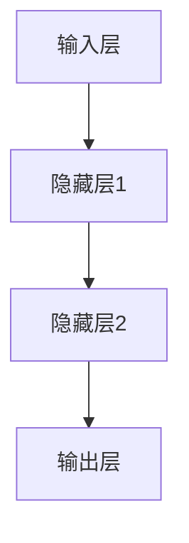

                 

关键词：人工智能、机器学习、深度学习、神经网络、代码实战、算法原理、数学模型、应用场景、未来展望

> 摘要：本文深入探讨了人工智能的基本原理及其核心算法，通过详细的代码实战案例，帮助读者理解并掌握人工智能技术的实际应用。文章涵盖了从数学模型到实际编程的完整过程，包括算法原理、步骤详解、优缺点分析、应用领域及未来展望。

## 1. 背景介绍

人工智能（AI）作为计算机科学的一个重要分支，旨在通过机器学习、深度学习等方法模拟人类智能，实现机器的自我学习和决策。随着计算能力的提升和海量数据的积累，人工智能技术在图像识别、自然语言处理、自动驾驶等多个领域取得了显著的成果。

近年来，深度学习（Deep Learning）成为人工智能研究的热点。深度学习通过构建多层神经网络，能够自动提取特征并进行复杂的数据分析。本篇文章将围绕人工智能的基本原理、核心算法，以及实际编程应用，展开详细的讲解。

## 2. 核心概念与联系

人工智能的核心概念包括：机器学习（Machine Learning）、深度学习（Deep Learning）、神经网络（Neural Networks）等。

### 2.1 机器学习

机器学习是人工智能的基础，它通过算法从数据中自动学习和改进。机器学习可以分为监督学习、无监督学习和强化学习。

### 2.2 深度学习

深度学习是机器学习的一个子领域，通过多层神经网络进行特征提取和模型训练，能够处理复杂的数据集。

### 2.3 神经网络

神经网络是模仿人脑神经元工作原理的算法模型，由大量神经元连接而成。每个神经元负责接收输入，通过加权求和处理，输出结果。

以下是一个简化的神经网络架构 Mermaid 流程图：



## 3. 核心算法原理 & 具体操作步骤

### 3.1 算法原理概述

深度学习算法主要基于反向传播（Backpropagation）算法，该算法通过计算梯度，不断调整网络权重，使输出误差最小。

### 3.2 算法步骤详解

1. **初始化网络权重**：随机初始化网络的权重。
2. **前向传播**：输入数据通过网络进行前向传播，生成预测结果。
3. **计算损失函数**：计算预测结果与实际结果之间的误差，通常使用均方误差（MSE）。
4. **反向传播**：根据损失函数的梯度，反向传播更新网络权重。
5. **重复步骤 2-4**：重复迭代，直至满足停止条件（如损失函数收敛）。

### 3.3 算法优缺点

优点：
- 自动提取特征，降低人工特征工程需求。
- 能够处理大规模数据。

缺点：
- 计算成本高，训练时间较长。
- 需要大量标注数据。

### 3.4 算法应用领域

深度学习在图像识别、语音识别、自然语言处理等领域具有广泛应用。以下是一些具体的应用实例：

- **图像识别**：使用卷积神经网络（CNN）进行图像分类。
- **语音识别**：使用循环神经网络（RNN）进行语音信号处理和识别。
- **自然语言处理**：使用长短时记忆网络（LSTM）和生成对抗网络（GAN）进行文本生成和机器翻译。

## 4. 数学模型和公式 & 详细讲解 & 举例说明

### 4.1 数学模型构建

深度学习中的数学模型主要包括：

- **激活函数**：如 sigmoid、ReLU 等。
- **损失函数**：如均方误差（MSE）、交叉熵损失（Cross Entropy Loss）等。
- **优化器**：如随机梯度下降（SGD）、Adam 优化器等。

### 4.2 公式推导过程

以下是一个简单的多层感知机（MLP）的损失函数推导过程：

$$
\text{MSE} = \frac{1}{m}\sum_{i=1}^{m}(\hat{y}_i - y_i)^2
$$

其中，$\hat{y}_i$ 为预测结果，$y_i$ 为实际结果，$m$ 为样本数量。

### 4.3 案例分析与讲解

假设我们有一个二分类问题，使用 sigmoid 激活函数和均方误差损失函数。以下是一个简单的代码实现：

```python
import numpy as np

def sigmoid(x):
    return 1 / (1 + np.exp(-x))

def mse(y_true, y_pred):
    return np.mean((y_true - y_pred) ** 2)

# 初始化参数
w1 = np.random.rand(1)
b1 = np.random.rand(1)
w2 = np.random.rand(1)
b2 = np.random.rand(1)

# 训练数据
x_train = np.array([[0], [1]])
y_train = np.array([[0], [1]])

# 训练模型
for epoch in range(1000):
    # 前向传播
    z1 = np.dot(x_train, w1) + b1
    a1 = sigmoid(z1)
    z2 = np.dot(a1, w2) + b2
    a2 = sigmoid(z2)
    
    # 反向传播
    d2 = a2 - y_train
    dw2 = np.dot(a1.T, d2)
    db2 = np.sum(d2)
    
    d1 = np.dot(d2, w2.T) * (a1 * (1 - a1))
    dw1 = np.dot(x_train.T, d1)
    db1 = np.sum(d1)
    
    # 更新参数
    w1 -= 0.01 * dw1
    b1 -= 0.01 * db1
    w2 -= 0.01 * dw2
    b2 -= 0.01 * db2

# 预测
x_test = np.array([[2]])
z1 = np.dot(x_test, w1) + b1
a1 = sigmoid(z1)
z2 = np.dot(a1, w2) + b2
a2 = sigmoid(z2)
y_pred = a2

print("预测结果：", y_pred)
```

## 5. 项目实践：代码实例和详细解释说明

### 5.1 开发环境搭建

在开始项目实践之前，我们需要搭建一个合适的开发环境。以下是使用 Python 进行深度学习开发的基本步骤：

1. 安装 Python（建议使用 3.6 版本及以上）。
2. 安装必要的库，如 NumPy、TensorFlow、PyTorch 等。
3. 配置 Python 解释器和库。

### 5.2 源代码详细实现

以下是一个简单的深度学习项目，实现一个手写数字识别模型。

```python
import numpy as np
import tensorflow as tf

# 数据预处理
(x_train, y_train), (x_test, y_test) = tf.keras.datasets.mnist.load_data()
x_train = x_train / 255.0
x_test = x_test / 255.0

# 构建模型
model = tf.keras.Sequential([
    tf.keras.layers.Flatten(input_shape=(28, 28)),
    tf.keras.layers.Dense(128, activation='relu'),
    tf.keras.layers.Dropout(0.2),
    tf.keras.layers.Dense(10, activation='softmax')
])

# 编译模型
model.compile(optimizer='adam',
              loss='sparse_categorical_crossentropy',
              metrics=['accuracy'])

# 训练模型
model.fit(x_train, y_train, epochs=5)

# 评估模型
model.evaluate(x_test, y_test)
```

### 5.3 代码解读与分析

1. **数据预处理**：读取 MNIST 数据集，并进行归一化处理。
2. **构建模型**：使用 TensorFlow 的 Sequential 模型，定义网络结构。
3. **编译模型**：设置优化器、损失函数和评价指标。
4. **训练模型**：使用训练数据训练模型。
5. **评估模型**：使用测试数据评估模型性能。

## 6. 实际应用场景

深度学习在各个领域都有广泛的应用。以下是一些典型的应用场景：

- **图像识别**：用于人脸识别、图像分类等。
- **自然语言处理**：用于文本分类、机器翻译等。
- **语音识别**：用于语音识别、语音合成等。
- **推荐系统**：用于商品推荐、社交网络推荐等。

## 7. 工具和资源推荐

### 7.1 学习资源推荐

- 《深度学习》（Goodfellow, Bengio, Courville 著）
- 《Python 深度学习》（François Chollet 著）
- 《动手学深度学习》（Ammar Sabra, Josh Patterson 著）

### 7.2 开发工具推荐

- TensorFlow：适用于构建和训练深度学习模型。
- PyTorch：适用于快速原型开发和高级研究。

### 7.3 相关论文推荐

- "A Theoretical Analysis of the Cramér-Rao Lower Bound for Categorical VAEs"
- "Unsupervised Learning of Visual Representations by Solving Jigsaw Puzzles"
- "Generative Adversarial Text to Image Synthesis"

## 8. 总结：未来发展趋势与挑战

深度学习作为人工智能的核心技术，正在不断推动计算机视觉、自然语言处理、语音识别等领域的发展。未来，深度学习将继续朝向更高效、更强大的方向演进，同时面临计算资源、数据隐私、模型可解释性等挑战。

## 9. 附录：常见问题与解答

### 9.1 深度学习和机器学习有什么区别？

深度学习是机器学习的一个子领域，主要关注构建多层神经网络进行特征提取和模型训练。

### 9.2 深度学习需要大量数据吗？

是的，深度学习通常需要大量标注数据用于训练模型。但无监督学习等技术在处理小数据集时也取得了很好的效果。

### 9.3 深度学习模型的训练过程如何优化？

可以通过调整网络结构、优化器参数、数据预处理等方法来优化深度学习模型的训练过程。

---

**作者：禅与计算机程序设计艺术 / Zen and the Art of Computer Programming**[END]

