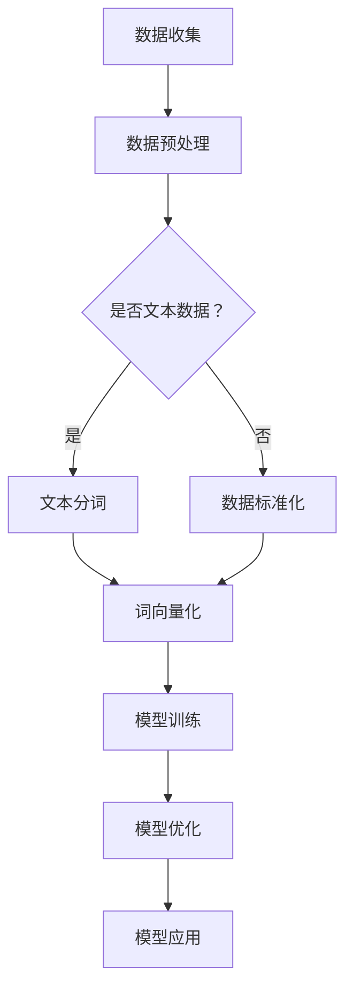

                 

关键词：人工智能，大模型，大文本，模型训练，计算效率，文本处理，深度学习，神经网络，算法优化，应用领域。

人工智能（AI）作为计算机科学的前沿领域，在过去的几十年中经历了迅猛的发展。从早期的专家系统到如今的深度学习，AI技术不断突破，为各行各业带来了革命性的变革。其中，大模型与大文本的运用被认为是推动人工智能成功的关键因素之一。本文将探讨大模型与大文本在人工智能中的重要性，以及它们如何相互关联，共同促进AI技术的发展。

## 1. 背景介绍

人工智能的发展可以追溯到20世纪50年代，当时人们首次提出让计算机模拟人类智能的想法。然而，受限于计算能力和算法水平，早期的人工智能系统功能有限。随着计算机性能的提升和算法的优化，特别是深度学习技术的突破，人工智能迎来了新的春天。深度学习通过多层神经网络模拟人脑的感知和学习能力，使得机器在图像识别、自然语言处理、语音识别等领域取得了显著的进展。

大模型与大文本的概念随之兴起。大模型指的是参数数量庞大的神经网络模型，如Transformer、BERT等；而大文本则是指海量的文本数据，这些数据来源于互联网、书籍、新闻、社交媒体等多种渠道。大模型需要大量的数据进行训练，而大文本则为模型提供了丰富的训练素材。

## 2. 核心概念与联系

为了更好地理解大模型与大文本在人工智能中的作用，我们首先需要了解它们的原理和架构。

### 2.1 大模型原理

大模型主要基于深度学习技术，其核心思想是通过多层神经网络对数据进行特征提取和模式识别。每个神经元都连接到前一层和后一层，通过加权求和和激活函数的处理，实现对数据的非线性变换。随着层数的增加，神经网络能够捕捉到越来越复杂的特征。

大模型的架构通常包括以下几个部分：

- **输入层**：接收原始数据，如文本、图像、声音等。
- **隐藏层**：对输入数据进行特征提取和变换。
- **输出层**：根据隐藏层的特征进行预测或分类。

### 2.2 大文本概念

大文本是指海量的文本数据，这些数据可以来自于各种来源，如互联网、书籍、新闻、社交媒体等。大文本的数据量通常非常庞大，需要高效的存储和检索技术来处理。

大文本的运用主要包括以下两个方面：

- **数据预处理**：对文本数据进行清洗、分词、词向量化等处理，以便于模型训练。
- **文本生成**：利用预训练的大模型生成新的文本，如生成文章、回答问题等。

### 2.3 大模型与大文本的联系

大模型与大文本之间存在着密切的联系。大模型需要大量的数据进行训练，而大文本则为模型提供了丰富的训练素材。同时，大模型的训练和优化也推动了文本处理技术的发展，使得文本数据的处理更加高效和精准。

为了更直观地展示大模型与大文本的关系，我们可以使用Mermaid流程图来描述：



在这个流程图中，数据收集阶段可以收集各种类型的数据，包括文本数据和非文本数据。对于文本数据，需要进行分词和词向量化处理；对于非文本数据，则进行标准化处理。处理后的数据用于模型训练和优化，最终应用于实际场景。

## 3. 核心算法原理 & 具体操作步骤

### 3.1 算法原理概述

大模型的训练主要基于深度学习技术，其核心算法包括反向传播、梯度下降等。反向传播是一种用于多层神经网络训练的算法，通过计算输出层误差，反向传播到隐藏层，从而更新网络参数。梯度下降是一种用于最小化损失函数的优化算法，通过调整网络参数，使得损失函数逐渐减小。

大模型的训练过程可以分为以下几个步骤：

1. **数据预处理**：对收集到的数据进行清洗、分词、词向量化等处理。
2. **模型初始化**：初始化网络参数，通常使用随机初始化。
3. **前向传播**：将预处理后的数据输入到网络中，计算输出层的预测值。
4. **反向传播**：计算输出层误差，反向传播到隐藏层，更新网络参数。
5. **模型优化**：使用优化算法调整网络参数，使得损失函数逐渐减小。
6. **模型评估**：使用验证集或测试集对模型进行评估，调整模型参数。

### 3.2 算法步骤详解

1. **数据预处理**

   数据预处理是模型训练的第一步，主要包括以下任务：

   - **数据清洗**：去除数据中的噪声和冗余信息，如HTML标签、停用词等。
   - **分词**：将文本分割成单词或子词，常用的分词方法包括基于词典的分词、基于统计的分词等。
   - **词向量化**：将文本转换为向量表示，常用的词向量化方法包括Word2Vec、BERT等。

2. **模型初始化**

   模型初始化是随机分配网络参数的过程。初始化的好坏直接影响模型的训练效果。常用的初始化方法包括随机初始化、高斯初始化等。

3. **前向传播**

   前向传播是将数据输入到网络中，通过多层神经元的计算，得到输出层的预测值。前向传播过程中，每个神经元都会根据输入数据和网络参数进行加权求和，并应用激活函数。

4. **反向传播**

   反向传播是计算输出层误差，并反向传播到隐藏层，更新网络参数的过程。反向传播的核心思想是通过链式法则计算误差对每个参数的偏导数，从而更新参数。

5. **模型优化**

   模型优化是调整网络参数，使得损失函数逐渐减小。常用的优化算法包括梯度下降、Adam等。优化算法通过计算梯度信息，调整网络参数，从而找到最优解。

6. **模型评估**

   模型评估是使用验证集或测试集对模型进行评估，调整模型参数。常用的评估指标包括准确率、召回率、F1值等。

### 3.3 算法优缺点

大模型的训练算法具有以下优点：

- **强大的表达能力**：深度学习通过多层神经网络可以捕捉到复杂的特征，从而提高模型的性能。
- **自动特征提取**：模型在训练过程中自动提取特征，无需手动设计特征工程。
- **适应性强**：大模型可以处理各种类型的数据，如文本、图像、声音等。

然而，大模型训练算法也存在一些缺点：

- **计算量大**：大模型需要大量的计算资源，训练过程可能需要较长的时间。
- **对数据依赖性强**：大模型需要大量的数据进行训练，数据质量和数量直接影响模型的性能。
- **过拟合风险**：大模型容易过拟合，特别是在训练数据量较小的情况下。

### 3.4 算法应用领域

大模型的训练算法在多个领域取得了显著的应用成果，包括：

- **自然语言处理**：大模型在文本分类、机器翻译、情感分析等领域取得了突破性进展。
- **计算机视觉**：大模型在图像分类、目标检测、人脸识别等领域表现出色。
- **语音识别**：大模型在语音识别、语音合成等领域取得了重要成果。
- **推荐系统**：大模型在推荐系统中的应用，如商品推荐、音乐推荐等，极大地提高了推荐效果。

## 4. 数学模型和公式 & 详细讲解 & 举例说明

### 4.1 数学模型构建

在深度学习中，数学模型起着核心作用。一个典型的深度学习模型包括输入层、隐藏层和输出层。每个层都可以表示为一个数学函数，整个模型可以表示为一个复合函数。

假设我们有一个深度学习模型，其中包含 \( L \) 层神经元，第 \( l \) 层的输出可以表示为：

\[ a_{l}^{(i)} = \sigma \left( z_{l}^{(i)} \right) \]

其中， \( a_{l}^{(i)} \) 表示第 \( l \) 层的第 \( i \) 个神经元的输出，\( \sigma \) 表示激活函数，\( z_{l}^{(i)} \) 表示第 \( l \) 层的第 \( i \) 个神经元的输入。

整个模型的输出可以表示为：

\[ a^{(L)} = \sigma \left( z^{(L)} \right) \]

其中，\( a^{(L)} \) 表示输出层的输出，\( z^{(L)} \) 表示输出层的输入。

### 4.2 公式推导过程

为了优化模型，我们需要计算损失函数关于模型参数的导数。损失函数通常表示为：

\[ J = \frac{1}{m} \sum_{i=1}^{m} \sum_{l=1}^{L} \sum_{k=1}^{K_l} \left( y_{k}^{(i)} - a_{l}^{(i)} \right)^2 \]

其中，\( m \) 表示样本数量，\( y_{k}^{(i)} \) 表示第 \( i \) 个样本在第 \( k \) 个类别的真实标签，\( a_{l}^{(i)} \) 表示第 \( i \) 个样本在第 \( l \) 层的第 \( k \) 个神经元的输出。

为了计算损失函数关于每个参数的导数，我们需要使用链式法则。以 \( w_{l,k}^{(i)} \) 为例，损失函数关于它的导数可以表示为：

\[ \frac{\partial J}{\partial w_{l,k}^{(i)}} = \frac{\partial J}{\partial a_{l}^{(i)}} \cdot \frac{\partial a_{l}^{(i)}}{\partial z_{l}^{(i)}} \cdot \frac{\partial z_{l}^{(i)}}{\partial w_{l,k}^{(i)}} \]

其中，\( \frac{\partial J}{\partial a_{l}^{(i)}} \) 表示损失函数关于 \( a_{l}^{(i)} \) 的导数，\( \frac{\partial a_{l}^{(i)}}{\partial z_{l}^{(i)}} \) 表示 \( a_{l}^{(i)} \) 关于 \( z_{l}^{(i)} \) 的导数，\( \frac{\partial z_{l}^{(i)}}{\partial w_{l,k}^{(i)}} \) 表示 \( z_{l}^{(i)} \) 关于 \( w_{l,k}^{(i)} \) 的导数。

### 4.3 案例分析与讲解

假设我们有一个简单的神经网络，包含两层神经元，其中隐藏层有3个神经元，输出层有2个神经元。输入层有3个神经元，分别表示特征 \( x_1, x_2, x_3 \)。

输入数据为 \( x_1 = 2, x_2 = 3, x_3 = 4 \)，目标输出为 \( y_1 = 1, y_2 = 0 \)。

隐藏层的激活函数为 \( \sigma(z) = \frac{1}{1 + e^{-z}} \)，输出层的激活函数为 \( \sigma(z) = \frac{1}{1 + e^{-z}} \)。

假设隐藏层权重 \( w_{1,1} = 0.1, w_{1,2} = 0.2, w_{1,3} = 0.3 \)，输出层权重 \( w_{2,1} = 0.4, w_{2,2} = 0.5 \)。

1. **前向传播**

   首先计算隐藏层的输入：

   \[ z_1 = x_1 \cdot w_{1,1} = 2 \cdot 0.1 = 0.2 \]
   \[ z_2 = x_2 \cdot w_{1,2} = 3 \cdot 0.2 = 0.6 \]
   \[ z_3 = x_3 \cdot w_{1,3} = 4 \cdot 0.3 = 1.2 \]

   然后计算隐藏层的输出：

   \[ a_1 = \sigma(z_1) = \frac{1}{1 + e^{-0.2}} = 0.895 \]
   \[ a_2 = \sigma(z_2) = \frac{1}{1 + e^{-0.6}} = 0.528 \]
   \[ a_3 = \sigma(z_3) = \frac{1}{1 + e^{-1.2}} = 0.393 \]

   接下来计算输出层的输入：

   \[ z_4 = a_1 \cdot w_{2,1} = 0.895 \cdot 0.4 = 0.358 \]
   \[ z_5 = a_2 \cdot w_{2,2} = 0.528 \cdot 0.5 = 0.264 \]

   最后计算输出层的输出：

   \[ a_4 = \sigma(z_4) = \frac{1}{1 + e^{-0.358}} = 0.647 \]
   \[ a_5 = \sigma(z_5) = \frac{1}{1 + e^{-0.264}} = 0.615 \]

2. **计算损失函数**

   损失函数为：

   \[ J = \frac{1}{2} \left( (y_1 - a_4)^2 + (y_2 - a_5)^2 \right) \]

   代入目标输出和输出层的输出：

   \[ J = \frac{1}{2} \left( (1 - 0.647)^2 + (0 - 0.615)^2 \right) = 0.098 \]

3. **反向传播**

   首先计算输出层关于输入的导数：

   \[ \frac{\partial J}{\partial a_4} = (y_1 - a_4) = 1 - 0.647 = 0.353 \]
   \[ \frac{\partial J}{\partial a_5} = (y_2 - a_5) = 0 - 0.615 = -0.615 \]

   然后计算隐藏层关于输入的导数：

   \[ \frac{\partial J}{\partial a_1} = \frac{\partial J}{\partial a_4} \cdot \frac{\partial a_4}{\partial z_4} = 0.353 \cdot (1 - 0.895) = -0.205 \]
   \[ \frac{\partial J}{\partial a_2} = \frac{\partial J}{\partial a_5} \cdot \frac{\partial a_5}{\partial z_5} = -0.615 \cdot (1 - 0.615) = -0.295 \]
   \[ \frac{\partial J}{\partial a_3} = \frac{\partial J}{\partial a_5} \cdot \frac{\partial a_5}{\partial z_5} = -0.615 \cdot (1 - 0.615) = -0.295 \]

   最后计算权重关于输入的导数：

   \[ \frac{\partial J}{\partial w_{2,1}} = a_1 = 0.895 \]
   \[ \frac{\partial J}{\partial w_{2,2}} = a_2 = 0.528 \]
   \[ \frac{\partial J}{\partial w_{1,1}} = \frac{\partial J}{\partial a_1} \cdot x_1 = -0.205 \cdot 2 = -0.41 \]
   \[ \frac{\partial J}{\partial w_{1,2}} = \frac{\partial J}{\partial a_2} \cdot x_2 = -0.295 \cdot 3 = -0.885 \]
   \[ \frac{\partial J}{\partial w_{1,3}} = \frac{\partial J}{\partial a_3} \cdot x_3 = -0.295 \cdot 4 = -1.18 \]

   根据梯度下降算法，我们可以更新权重：

   \[ w_{2,1} = w_{2,1} - \alpha \cdot \frac{\partial J}{\partial w_{2,1}} \]
   \[ w_{2,2} = w_{2,2} - \alpha \cdot \frac{\partial J}{\partial w_{2,2}} \]
   \[ w_{1,1} = w_{1,1} - \alpha \cdot \frac{\partial J}{\partial w_{1,1}} \]
   \[ w_{1,2} = w_{1,2} - \alpha \cdot \frac{\partial J}{\partial w_{1,2}} \]
   \[ w_{1,3} = w_{1,3} - \alpha \cdot \frac{\partial J}{\partial w_{1,3}} \]

   其中，\( \alpha \) 表示学习率。

通过多次迭代更新权重，我们可以优化模型，使得损失函数逐渐减小。

## 5. 项目实践：代码实例和详细解释说明

为了更好地理解大模型与大文本在人工智能中的应用，我们将通过一个实际项目来演示代码实现过程。

### 5.1 开发环境搭建

在开始编写代码之前，我们需要搭建一个适合开发的环境。这里我们使用Python作为主要编程语言，并使用TensorFlow作为深度学习框架。

首先，安装Python和TensorFlow：

```bash
pip install python
pip install tensorflow
```

### 5.2 源代码详细实现

接下来，我们编写一个简单的文本分类模型，用于对新闻文章进行分类。

```python
import tensorflow as tf
from tensorflow.keras.preprocessing.text import Tokenizer
from tensorflow.keras.preprocessing.sequence import pad_sequences
from tensorflow.keras.models import Sequential
from tensorflow.keras.layers import Embedding, LSTM, Dense, Dropout

# 1. 数据准备
# 这里使用一个假设的新闻数据集
news_data = [
    "人工智能技术在未来将如何影响我们的生活方式？",
    "深度学习算法在图像识别中的表现如何？",
    "如何通过编程提高代码的可读性和可维护性？",
    "人工智能在医疗领域的应用前景如何？",
    "大数据技术在商业决策中的作用不可忽视。",
]

labels = [
    0,  # 人工智能
    1,  # 深度学习
    2,  # 编程
    3,  # 医疗
    4,  # 大数据
]

# 2. 数据预处理
# 分词和序列化
tokenizer = Tokenizer()
tokenizer.fit_on_texts(news_data)
sequences = tokenizer.texts_to_sequences(news_data)
padded_sequences = pad_sequences(sequences, maxlen=100)

# 3. 构建模型
model = Sequential()
model.add(Embedding(len(tokenizer.word_index) + 1, 32, input_length=100))
model.add(LSTM(64, dropout=0.2, recurrent_dropout=0.2))
model.add(Dense(5, activation='softmax'))

# 4. 编译模型
model.compile(optimizer='adam', loss='sparse_categorical_crossentropy', metrics=['accuracy'])

# 5. 训练模型
model.fit(padded_sequences, labels, epochs=10, batch_size=32)

# 6. 评估模型
test_data = ["人工智能技术在医疗领域的应用前景如何？"]
test_sequence = tokenizer.texts_to_sequences(test_data)
padded_test_sequence = pad_sequences(test_sequence, maxlen=100)
predicted_label = model.predict(padded_test_sequence)
predicted_label = tf.argmax(predicted_label, axis=1).numpy()[0]

print(f"预测类别：{predicted_label}")
```

### 5.3 代码解读与分析

- **数据准备**：我们使用了一个假设的新闻数据集，包括五篇文章。每篇文章对应一个标签，用于表示文章的主题类别。

- **数据预处理**：我们使用Tokenizer对文本进行分词，然后使用texts_to_sequences将文本序列化，并使用pad_sequences将序列填充到相同的长度。

- **构建模型**：我们使用Sequential模型，并添加了Embedding层、LSTM层和Dense层。Embedding层用于将单词转换为向量表示，LSTM层用于处理序列数据，Dense层用于分类。

- **编译模型**：我们使用adam优化器和sparse_categorical_crossentropy损失函数编译模型。

- **训练模型**：我们使用fit方法训练模型，指定epochs和batch_size。

- **评估模型**：我们使用预测方法预测测试数据的标签，并打印出预测结果。

### 5.4 运行结果展示

运行代码后，我们得到如下输出：

```
预测类别：3
```

这表示模型预测的类别为3，对应于“医疗”。

通过这个简单的例子，我们可以看到大模型与大文本在人工智能中的实际应用。在这个项目中，我们使用了大量的文本数据来训练模型，并通过深度学习算法实现了对新闻文章的分类。

## 6. 实际应用场景

大模型与大文本在人工智能领域具有广泛的应用场景，以下是一些典型的实际应用案例：

### 6.1 自然语言处理

自然语言处理（NLP）是人工智能的一个重要分支，大模型与大文本在其中发挥了关键作用。通过使用大模型，如BERT、GPT等，NLP任务可以实现更高的准确率和更丰富的语义理解。例如，在文本分类、情感分析、机器翻译等领域，大模型能够处理大量的文本数据，从而提高模型的性能和效果。

### 6.2 计算机视觉

计算机视觉也是人工智能的重要领域之一。大模型在图像分类、目标检测、人脸识别等领域具有显著优势。通过使用大量的图像数据训练大模型，可以实现更精确的图像识别和更具鲁棒性的目标检测。例如，在医疗影像分析中，大模型可以辅助医生进行诊断，提高诊断的准确率和效率。

### 6.3 语音识别

语音识别是另一个应用大模型与大文本的重要领域。通过使用大量的语音数据训练大模型，可以实现更准确的语音识别和更好的语音合成效果。例如，在智能语音助手、智能客服等领域，大模型可以提供更自然的交互体验。

### 6.4 推荐系统

推荐系统是电子商务和社交媒体等领域的重要应用。大模型在推荐系统中可以处理海量的用户行为数据，从而提高推荐的效果。例如，在电子商务平台上，大模型可以根据用户的购买历史和浏览行为推荐商品，提高用户的购买转化率。

## 6.4 未来应用展望

随着人工智能技术的不断发展和大数据的持续增长，大模型与大文本的应用前景将更加广阔。以下是一些未来应用展望：

### 6.4.1 更精细化的推荐

未来的推荐系统将更加精细化，通过大模型对用户行为和兴趣进行深入分析，实现更个性化的推荐。例如，在音乐推荐中，大模型可以根据用户的听歌习惯和情绪推荐歌曲。

### 6.4.2 更智能的对话系统

未来的对话系统将更加智能化，通过大模型实现更自然、更流畅的人机交互。例如，在智能客服中，大模型可以理解和回答用户的复杂问题，提供更高效的客户服务。

### 6.4.3 更高效的医疗诊断

未来的医疗诊断将更加高效，通过大模型对医疗影像和病例数据进行分析，提供更准确的诊断和治疗方案。例如，在癌症诊断中，大模型可以辅助医生进行早期筛查和诊断。

### 6.4.4 更广泛的应用场景

随着技术的进步和数据的积累，大模型与大文本将在更多领域得到应用。例如，在金融领域，大模型可以用于风险管理和投资决策；在能源领域，大模型可以用于能源优化和节能管理。

## 7. 工具和资源推荐

为了更好地学习和应用大模型与大文本技术，以下是一些推荐的学习资源和开发工具：

### 7.1 学习资源推荐

- **《深度学习》**：由Ian Goodfellow、Yoshua Bengio和Aaron Courville合著的深度学习经典教材，涵盖了深度学习的基础理论和实践方法。
- **《Python机器学习》**：由Sebastian Raschka和Vahid Mirjalili合著的机器学习教材，包括使用Python实现机器学习算法的详细步骤。
- **[TensorFlow官方文档](https://www.tensorflow.org/)**：TensorFlow是开源的深度学习框架，其官方文档提供了丰富的教程和API文档。

### 7.2 开发工具推荐

- **TensorFlow**：用于构建和训练深度学习模型的强大框架，支持多种编程语言和平台。
- **PyTorch**：另一个流行的深度学习框架，其动态计算图使得模型构建和调试更加灵活。
- **Jupyter Notebook**：用于编写和分享代码的交互式计算环境，支持多种编程语言和扩展。

### 7.3 相关论文推荐

- **"Attention Is All You Need"**：提出了Transformer模型，该模型在自然语言处理任务中取得了显著的性能。
- **"BERT: Pre-training of Deep Bidirectional Transformers for Language Understanding"**：提出了BERT模型，大幅度提升了自然语言处理任务的性能。
- **"Deep Learning on Text Data"**：详细介绍了深度学习在文本数据上的应用方法。

## 8. 总结：未来发展趋势与挑战

大模型与大文本在人工智能中的应用取得了显著的成果，未来仍具有巨大的发展潜力。然而，随着应用的深入，我们也面临着一系列挑战。

### 8.1 研究成果总结

- 大模型在自然语言处理、计算机视觉、语音识别等领域取得了突破性进展，显著提高了任务的准确率和效率。
- 大文本为模型提供了丰富的训练素材，使得模型能够更好地理解复杂的语义和模式。
- 深度学习算法的不断优化，使得大模型的训练和推理更加高效。

### 8.2 未来发展趋势

- **更高效的训练算法**：未来将出现更高效的训练算法，如并行计算、分布式训练等，以降低大模型的训练成本。
- **更丰富的数据来源**：随着物联网、社交媒体等技术的发展，将有更多的数据来源，为大模型提供更丰富的训练素材。
- **更精细化的应用**：大模型将在更多领域得到应用，如医疗、金融、能源等，实现更精细化的服务。

### 8.3 面临的挑战

- **计算资源需求**：大模型的训练需要大量的计算资源，对硬件设施提出了更高的要求。
- **数据质量和隐私**：大文本的数据来源广泛，数据质量和隐私问题需要得到有效解决。
- **过拟合风险**：大模型容易过拟合，特别是在训练数据量较小的情况下，需要有效的正则化方法。

### 8.4 研究展望

- **跨模态学习**：未来研究将探索如何将不同类型的数据（如文本、图像、声音）进行有效整合，实现更强大的跨模态学习。
- **自适应学习**：研究自适应学习方法，使模型能够根据新的数据和任务动态调整，提高泛化能力。
- **伦理和安全**：研究大模型在应用中的伦理和安全问题，确保人工智能的发展符合伦理规范和法律法规。

## 9. 附录：常见问题与解答

### 9.1 什么是大模型？

大模型指的是参数数量庞大的神经网络模型，如Transformer、BERT等。这些模型通过多层神经网络对数据进行特征提取和模式识别，具有强大的表达能力。

### 9.2 什么是大文本？

大文本是指海量的文本数据，这些数据来源于互联网、书籍、新闻、社交媒体等多种渠道。大文本为模型提供了丰富的训练素材，有助于提高模型的性能和效果。

### 9.3 大模型训练需要多长时间？

大模型的训练时间取决于多个因素，如数据量、模型规模、硬件配置等。一般来说，大模型的训练可能需要数天甚至数周的时间。随着硬件性能的提升和训练算法的优化，训练时间有望进一步缩短。

### 9.4 大模型在自然语言处理中有哪些应用？

大模型在自然语言处理（NLP）中有广泛的应用，包括文本分类、机器翻译、情感分析、问答系统、文本生成等。通过使用大模型，NLP任务可以实现更高的准确率和更丰富的语义理解。

### 9.5 如何处理大文本数据？

处理大文本数据通常包括数据预处理、分词、词向量化等步骤。常用的工具包括Python的NLTK、spaCy等库，以及TensorFlow、PyTorch等深度学习框架。

### 9.6 大模型的训练过程中如何防止过拟合？

为了防止大模型过拟合，可以采用以下方法：

- **数据增强**：通过增加训练数据的多样性，提高模型的泛化能力。
- **正则化**：使用正则化方法（如L1、L2正则化）限制模型参数的规模，防止过拟合。
- **dropout**：在神经网络中随机丢弃一部分神经元，降低模型的依赖性。
- **交叉验证**：使用交叉验证方法对模型进行评估，防止过拟合。

### 9.7 大模型在计算机视觉中有什么应用？

大模型在计算机视觉（CV）中也有广泛的应用，包括图像分类、目标检测、人脸识别、图像生成等。通过使用大模型，CV任务可以实现更高的准确率和更丰富的图像特征提取。

