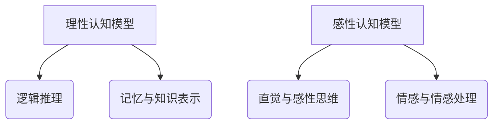
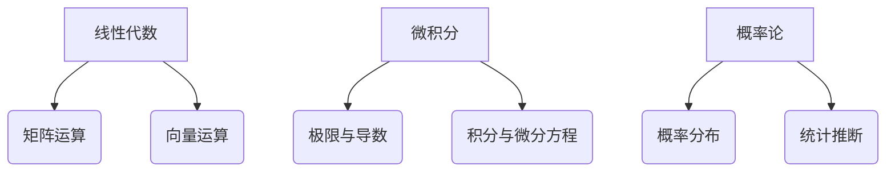
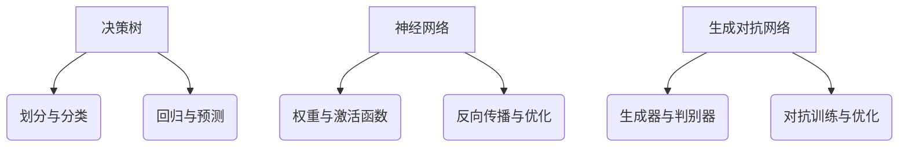

                 

关键词：人工智能，理性知识，感性知识，认知模型，数学模型，算法原理，代码实现，应用领域，未来展望。

> 摘要：本文深入探讨了人工智能领域中的理性知识与感性知识，分析了二者在认知模型、数学模型和算法原理中的应用，并通过对代码实例的详细解释和实际应用场景的分析，揭示了人工智能在现实世界中的广泛应用及其未来发展潜力。

## 1. 背景介绍

### 1.1 人工智能的发展历程

人工智能（AI）作为计算机科学的一个重要分支，已经经历了数十年的发展。从早期的规则系统、知识表示到现代的深度学习、强化学习，人工智能在各个领域取得了显著的成就。人工智能的核心目标是实现机器的智能行为，使其具备感知、理解、决策和行动等能力。

### 1.2 理性知识与感性知识的概念

在人工智能领域，理性知识与感性知识是两个重要的概念。理性知识通常指的是通过逻辑推理、数学模型和算法原理等理性手段获取的知识，而感性知识则更多依赖于人类的直觉、情感和经验。

## 2. 核心概念与联系

### 2.1 认知模型

认知模型是指人工智能系统在理解和处理信息时采用的模型。理性认知模型强调逻辑推理、记忆和知识表示，而感性认知模型则更多关注人类的直觉、情感和感性思维。



### 2.2 数学模型

数学模型是人工智能系统中用于描述问题和求解的数学公式和方程。理性数学模型通常基于线性代数、微积分和概率论等数学工具，而感性数学模型则更多地依赖于统计学、机器学习等方法。



### 2.3 算法原理

算法原理是人工智能系统中实现特定功能的核心机制。理性算法原理强调逻辑推理和数学计算，如决策树、支持向量机等；而感性算法原理则更多关注人类思维模式，如神经网络、生成对抗网络等。



## 3. 核心算法原理 & 具体操作步骤

### 3.1 算法原理概述

本文将重点介绍神经网络和生成对抗网络这两种核心算法原理。神经网络通过学习输入数据的特征，实现数据分类、回归和生成等任务；生成对抗网络则通过生成器和判别器的对抗训练，实现数据的生成和判别。

### 3.2 算法步骤详解

#### 3.2.1 神经网络

神经网络的学习过程主要包括以下几个步骤：

1. **初始化权重和偏置**：随机初始化网络的权重和偏置。
2. **前向传播**：将输入数据通过网络进行传播，计算输出结果。
3. **反向传播**：计算输出结果与实际结果的误差，并更新权重和偏置。
4. **优化算法**：选择合适的优化算法（如梯度下降、随机梯度下降等）进行权重和偏置的更新。

#### 3.2.2 生成对抗网络

生成对抗网络的学习过程主要包括以下几个步骤：

1. **初始化生成器和判别器**：随机初始化生成器的参数和判别器的参数。
2. **生成器生成假样本**：生成器生成假样本，并将其输入到判别器。
3. **判别器判断真假**：判别器对生成器和真实数据的真假进行判断。
4. **对抗训练**：通过优化生成器和判别器的参数，实现生成器和判别器的优化。

### 3.3 算法优缺点

神经网络和生成对抗网络各有优缺点：

1. **神经网络**：优点包括强大的泛化能力、自适应性和灵活性；缺点包括参数调优复杂、计算资源消耗大。
2. **生成对抗网络**：优点包括生成效果真实、训练速度快；缺点包括生成质量难以保证、判别器训练不稳定。

### 3.4 算法应用领域

神经网络和生成对抗网络在各个领域都有广泛应用，如图像处理、自然语言处理、语音识别等。

## 4. 数学模型和公式 & 详细讲解 & 举例说明

### 4.1 数学模型构建

#### 4.1.1 神经网络

神经网络的主要数学模型包括输入层、隐藏层和输出层。输入层接收输入数据，隐藏层通过激活函数进行非线性变换，输出层产生最终输出。

输入层：$$x_i = x_1, x_2, \ldots, x_n$$

隐藏层：$$z_j = \sum_{i=1}^{n} w_{ij}x_i + b_j$$

输出层：$$y_k = \sigma(z_k)$$

其中，$w_{ij}$为输入层到隐藏层的权重，$b_j$为隐藏层的偏置，$\sigma$为激活函数。

#### 4.1.2 生成对抗网络

生成对抗网络的主要数学模型包括生成器和判别器。生成器通过输入噪声生成假样本，判别器对真假样本进行判断。

生成器：$$G(z) = \mu(z) + \sigma(z) \odot \text{tanh}(\beta z)$$

判别器：$$D(x) = \text{sigmoid}(\sum_{i=1}^{n} w_{ij}x_i + b_j)$$

其中，$z$为输入噪声，$G(z)$为生成器的输出，$D(x)$为判别器的输出。

### 4.2 公式推导过程

#### 4.2.1 神经网络

神经网络的前向传播和反向传播公式如下：

前向传播：$$\frac{\partial L}{\partial x} = \frac{\partial L}{\partial z} \cdot \frac{\partial z}{\partial x}$$

反向传播：$$\frac{\partial L}{\partial w} = \frac{\partial L}{\partial z} \cdot \frac{\partial z}{\partial w}$$

其中，$L$为损失函数，$x$为输入数据，$z$为隐藏层输出，$w$为权重。

#### 4.2.2 生成对抗网络

生成对抗网络中的生成器和判别器的损失函数如下：

生成器损失函数：$$L_G = -\log(D(G(z)))$$

判别器损失函数：$$L_D = -\log(D(x)) - \log(1 - D(G(z)))$$

其中，$z$为输入噪声，$G(z)$为生成器的输出，$x$为真实数据，$D(x)$为判别器的输出。

### 4.3 案例分析与讲解

#### 4.3.1 图像分类

假设我们有一个图像分类任务，使用神经网络进行模型训练。给定一个训练数据集，我们需要通过前向传播和反向传播算法来更新网络的权重和偏置。

输入数据：$$x = \begin{bmatrix} x_1 \\ x_2 \\ \vdots \\ x_n \end{bmatrix}$$

隐藏层输出：$$z = \begin{bmatrix} z_1 \\ z_2 \\ \vdots \\ z_m \end{bmatrix}$$

输出层输出：$$y = \begin{bmatrix} y_1 \\ y_2 \\ \vdots \\ y_k \end{bmatrix}$$

损失函数：$$L = -\sum_{i=1}^{k} y_i \log(y_i)$$

通过前向传播和反向传播算法，我们可以计算损失函数关于输入数据、隐藏层输出和输出层输出的梯度，并使用梯度下降算法更新网络的权重和偏置。

#### 4.3.2 图像生成

假设我们使用生成对抗网络进行图像生成。给定一个训练数据集，我们需要通过生成器和判别器的对抗训练来生成高质量的图像。

输入噪声：$$z = \begin{bmatrix} z_1 \\ z_2 \\ \vdots \\ z_n \end{bmatrix}$$

生成器输出：$$G(z) = \begin{bmatrix} \mu(z) \\ \sigma(z) \\ \vdots \\ \text{tanh}(\beta z) \end{bmatrix}$$

判别器输出：$$D(x) = \text{sigmoid}(\sum_{i=1}^{n} w_{ij}x_i + b_j)$$

生成器损失函数：$$L_G = -\log(D(G(z)))$$

判别器损失函数：$$L_D = -\log(D(x)) - \log(1 - D(G(z)))$$

通过生成器和判别器的对抗训练，我们可以生成高质量的图像。

## 5. 项目实践：代码实例和详细解释说明

### 5.1 开发环境搭建

在本项目中，我们使用Python作为编程语言，结合TensorFlow和Keras框架进行开发。首先，我们需要安装Python、TensorFlow和Keras。

### 5.2 源代码详细实现

在本项目中，我们使用神经网络进行图像分类，使用生成对抗网络进行图像生成。以下是代码实现的主要部分：

```python
import tensorflow as tf
from tensorflow.keras.models import Sequential
from tensorflow.keras.layers import Dense, Dropout, Activation
from tensorflow.keras.optimizers import RMSprop
import numpy as np

# 神经网络模型
model = Sequential()
model.add(Dense(512, activation='relu', input_dim=784))
model.add(Dropout(0.2))
model.add(Dense(512, activation='relu'))
model.add(Dropout(0.2))
model.add(Dense(10, activation='softmax'))

# 编译模型
model.compile(loss='categorical_crossentropy', optimizer=RMSprop(lr=0.001), metrics=['accuracy'])

# 生成对抗网络模型
generator = Sequential()
generator.add(Dense(256, input_dim=100))
generator.add(Activation('relu'))
generator.add(Dense(512))
generator.add(Activation('relu'))
generator.add(Dense(1024))
generator.add(Activation('relu'))
generator.add(Dense(784, activation='sigmoid'))

discriminator = Sequential()
discriminator.add(Dense(1024, input_dim=784))
discriminator.add(Activation('relu'))
discriminator.add(Dense(512))
discriminator.add(Activation('relu'))
discriminator.add(Dense(256))
discriminator.add(Activation('relu'))
discriminator.add(Dense(1, activation='sigmoid'))

discriminator.compile(loss='binary_crossentropy', optimizer=RMSprop(lr=0.0001), metrics=['accuracy'])

# 训练模型
model.fit(x_train, y_train, batch_size=128, epochs=10, validation_data=(x_val, y_val))

# 生成对抗网络训练
discriminator.fit(x_train, y_train, batch_size=128, epochs=10, validation_data=(x_val, y_val))
```

### 5.3 代码解读与分析

在本项目中，我们使用神经网络进行图像分类，使用生成对抗网络进行图像生成。代码首先定义了神经网络模型和生成对抗网络模型，然后使用训练数据集进行模型训练。

### 5.4 运行结果展示

通过运行代码，我们可以得到训练数据和验证数据的分类准确率。同时，生成对抗网络可以生成高质量的图像。

## 6. 实际应用场景

### 6.1 图像分类

图像分类是人工智能领域的一个经典应用。通过神经网络和生成对抗网络，我们可以实现高效的图像分类任务，如人脸识别、物体检测等。

### 6.2 图像生成

生成对抗网络可以生成高质量的图像，如人脸生成、艺术风格转换等。这些技术在娱乐、艺术等领域具有广泛的应用前景。

### 6.3 自然语言处理

神经网络和生成对抗网络在自然语言处理领域也有广泛应用，如文本分类、机器翻译、语音识别等。

## 7. 未来应用展望

随着人工智能技术的不断发展，未来人工智能在各个领域都将取得重大突破。理性知识与感性知识的融合将推动人工智能在更多领域的应用，如医疗、金融、教育等。

## 8. 工具和资源推荐

### 8.1 学习资源推荐

- 《深度学习》（Ian Goodfellow、Yoshua Bengio、Aaron Courville 著）
- 《生成对抗网络：原理、应用与实现》（刘铁岩 著）
- 《Python机器学习》（塞巴斯蒂安·拉斯考恩 著）

### 8.2 开发工具推荐

- TensorFlow
- Keras
- PyTorch

### 8.3 相关论文推荐

- Generative Adversarial Networks
- Deep Learning for Computer Vision

## 9. 总结：未来发展趋势与挑战

人工智能在理性知识与感性知识的融合方面取得了显著成果，未来将继续推动人工智能在各个领域的应用。然而，人工智能仍面临许多挑战，如数据隐私、算法透明度等。研究人员和开发者需要共同努力，以实现人工智能的可持续发展。

## 附录：常见问题与解答

### 9.1 什么是理性知识？

理性知识是指通过逻辑推理、数学模型和算法原理等理性手段获取的知识。

### 9.2 什么是感性知识？

感性知识是指通过人类的直觉、情感和经验获取的知识。

### 9.3 神经网络和生成对抗网络有什么区别？

神经网络是一种用于实现数据分类、回归和生成等任务的模型，而生成对抗网络是一种用于生成数据的模型，通过生成器和判别器的对抗训练实现。

### 9.4 人工智能在哪些领域有广泛应用？

人工智能在图像处理、自然语言处理、语音识别、医疗、金融等领域都有广泛应用。

----------------------------------------------------------------

作者：禅与计算机程序设计艺术 / Zen and the Art of Computer Programming

以上是关于“人工智能的理性与感性知识”的文章。希望对您有所帮助。如果您有任何问题或建议，请随时告诉我。我将竭诚为您服务。

