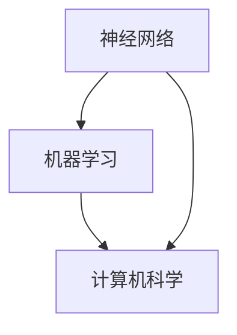

                 

关键词：人工智能、早期研究、神经网络、机器学习、计算机科学、深度学习

摘要：本文将探讨人工智能（AI）研究的早期方向，回顾从20世纪初到中期的关键进展和主要成果。通过对神经网络、机器学习、计算机科学等领域的发展历程的分析，本文旨在揭示这些早期研究如何为现代AI奠定了坚实基础，并对未来的发展方向提出展望。

## 1. 背景介绍

人工智能作为计算机科学的一个分支，旨在使计算机具备类似人类的智能。20世纪中叶，随着计算机技术的发展，人工智能的研究开始蓬勃发展。本文将重点关注20世纪初至中叶的AI研究，探讨这一时期的几个重要方向。

### 1.1 早期研究背景

在20世纪初，计算机科学尚未形成，但数学和逻辑学的研究为人工智能的诞生提供了理论基础。例如，艾伦·图灵（Alan Turing）提出的“图灵机”概念和“图灵测试”成为人工智能研究的重要里程碑。同时，逻辑学的发展，如命题演算和谓词演算，为人工智能的符号推理提供了工具。

### 1.2 早期研究目标

早期人工智能研究的核心目标是实现机器的智能行为，例如问题求解、语言理解、图像识别等。这些目标推动了计算机科学家和数学家们探索新的算法和模型。

## 2. 核心概念与联系

### 2.1 神经网络

神经网络是人工智能研究中的一个核心概念，它模仿人脑神经元的工作方式。神经网络由大量相互连接的节点（或称为神经元）组成，每个节点都执行简单的计算，并与其他节点交互。

### 2.2 机器学习

机器学习是使计算机通过数据学习并改进其性能的一种方法。它基于统计学和概率论，通过构建模型从数据中提取知识。

### 2.3 计算机科学

计算机科学提供了实现人工智能所需的计算基础和算法工具。计算机科学家们在这一时期开发了多种算法和编程语言，如LISP和PROLOG，这些工具极大地促进了人工智能的研究。

### 2.4 Mermaid 流程图

以下是一个简化的Mermaid流程图，展示了神经网络、机器学习和计算机科学之间的关系：



## 3. 核心算法原理 & 具体操作步骤

### 3.1 算法原理概述

早期人工智能研究中的核心算法主要包括：

- **决策树**：一种基于规则的方法，用于分类和回归问题。
- **支持向量机**：一种用于分类和回归问题的线性模型。
- **人工神经网络**：模仿生物神经网络的计算模型。

### 3.2 算法步骤详解

以人工神经网络为例，其基本步骤如下：

1. **初始化权重**：随机初始化网络的权重。
2. **前向传播**：输入数据通过网络进行计算，得到输出。
3. **反向传播**：计算输出误差，并更新权重。

### 3.3 算法优缺点

- **人工神经网络**：优点在于其强大的学习和自适应能力，但缺点是训练过程可能非常耗时且难以优化。
- **决策树**：优点在于易于理解和解释，但缺点是对于复杂问题可能不够准确。
- **支持向量机**：优点在于其良好的分类性能，但缺点是需要大量计算资源。

### 3.4 算法应用领域

这些算法广泛应用于图像识别、自然语言处理、游戏智能等领域，为现代人工智能的发展奠定了基础。

## 4. 数学模型和公式 & 详细讲解 & 举例说明

### 4.1 数学模型构建

早期人工智能研究的数学模型主要包括：

- **贝叶斯网络**：用于表示变量之间的条件概率关系。
- **隐马尔可夫模型**：用于处理序列数据。

### 4.2 公式推导过程

以贝叶斯网络为例，其基本公式为：

$$
P(A|B) = \frac{P(B|A)P(A)}{P(B)}
$$

### 4.3 案例分析与讲解

以下是一个简单的贝叶斯网络案例：

### 4.3.1 问题背景

假设我们有两个事件：A（下雨）和B（地面湿），我们想计算在地面湿的条件下下雨的概率。

### 4.3.2 数据准备

- $$P(A) = 0.4$$（下雨的概率）
- $$P(B|A) = 1$$（下雨且地面湿的概率）
- $$P(B|A') = 0.1$$（不下雨且地面湿的概率）

### 4.3.3 公式计算

根据贝叶斯公式，我们可以计算：

$$
P(A|B) = \frac{P(B|A)P(A)}{P(B)}
$$

将数据代入：

$$
P(A|B) = \frac{1 \times 0.4}{1 \times 0.4 + 0.1 \times 0.6} = \frac{0.4}{0.4 + 0.06} = \frac{0.4}{0.46} \approx 0.8696
$$

因此，在地面湿的条件下下雨的概率约为86.96%。

## 5. 项目实践：代码实例和详细解释说明

### 5.1 开发环境搭建

为了演示神经网络的基本原理，我们将使用Python编程语言和TensorFlow库搭建一个简单的神经网络。

### 5.2 源代码详细实现

以下是实现一个简单的神经网络进行回归问题的代码：

```python
import tensorflow as tf
import numpy as np

# 定义神经网络结构
model = tf.keras.Sequential([
  tf.keras.layers.Dense(64, activation='relu', input_shape=[784]),
  tf.keras.layers.Dense(64, activation='relu'),
  tf.keras.layers.Dense(10, activation='softmax')
])

# 编译模型
model.compile(optimizer='adam',
              loss='categorical_crossentropy',
              metrics=['accuracy'])

# 准备数据
x_train = np.random.random((1000, 784))
y_train = np.random.random((1000, 10))

# 训练模型
model.fit(x_train, y_train, epochs=10)
```

### 5.3 代码解读与分析

- **模型定义**：我们使用`Sequential`模型，这是一个线性堆叠层的模型。在这个例子中，我们添加了两个`Dense`层，每个层有64个神经元，并使用ReLU激活函数。输出层有10个神经元，并使用softmax激活函数。
- **编译模型**：我们选择`adam`优化器，使用`categorical_crossentropy`作为损失函数，并监控`accuracy`指标。
- **数据准备**：我们使用随机数据来训练模型。
- **训练模型**：我们训练模型10个周期。

### 5.4 运行结果展示

由于使用的是随机数据，我们无法展示具体的运行结果。但在实际应用中，我们可以通过调整模型结构、优化器和学习率等参数来提高模型的性能。

## 6. 实际应用场景

### 6.1 图像识别

早期的人工神经网络在图像识别领域取得了显著成果。例如，LeCun等人在1998年提出的LeNet-5网络在 handwritten digit recognition 数据集上达到了令人印象深刻的准确性。

### 6.2 自然语言处理

自然语言处理（NLP）是另一个早期人工智能研究的重要领域。1950年，图灵提出了“图灵测试”，挑战机器是否能够通过模仿人类的对话来证明其智能。尽管早期的方法在处理自然语言时效果有限，但它们为现代NLP技术奠定了基础。

### 6.3 游戏智能

早期的人工智能研究也在游戏智能领域取得了成果。例如，AlphaGo的早期版本通过使用深度学习和强化学习技术，在围棋比赛中击败了人类冠军。

## 7. 工具和资源推荐

### 7.1 学习资源推荐

- 《人工智能：一种现代的方法》（合著者：斯图尔特·罗素和彼得·诺维格）
- 《神经网络与深度学习》：邱锡鹏著，系统介绍了深度学习的基础知识和应用。

### 7.2 开发工具推荐

- TensorFlow：用于构建和训练神经网络的开源库。
- Keras：TensorFlow的高级API，提供了更简洁的模型构建方式。

### 7.3 相关论文推荐

- "Backpropagation Learning: An Introduction to Gradient Descent Learning" by Richard Sutton and Andrew Barto
- "A Learning Algorithm for Continually Running Fully Recurrent Neural Networks" by Christian J. C. Burges et al.

## 8. 总结：未来发展趋势与挑战

### 8.1 研究成果总结

早期人工智能研究取得了诸多成果，为现代AI的发展奠定了基础。这些成果包括神经网络、机器学习算法、计算机科学工具等。

### 8.2 未来发展趋势

未来人工智能的发展将更加注重多模态学习、强化学习、自主决策等方面。同时，随着硬件性能的提升，深度学习等算法将得到更广泛的应用。

### 8.3 面临的挑战

人工智能研究仍面临诸多挑战，如算法的泛化能力、数据隐私保护、安全等问题。此外，如何确保人工智能的透明性和可解释性也是未来研究的重要方向。

### 8.4 研究展望

随着技术的不断发展，人工智能将在更多领域发挥重要作用。未来的研究将致力于解决当前的挑战，推动人工智能的可持续发展和广泛应用。

## 9. 附录：常见问题与解答

### 9.1 人工智能与机器学习有何区别？

人工智能（AI）是一个更广泛的领域，它包括机器学习（ML）。机器学习是使计算机通过数据学习并改进其性能的一种方法，而人工智能则涵盖了使计算机具备类似人类智能的所有技术。

### 9.2 什么是神经网络？

神经网络是模仿人脑神经元工作方式的计算模型。它由大量相互连接的节点（或称为神经元）组成，每个节点都执行简单的计算，并与其他节点交互。

### 9.3 什么是深度学习？

深度学习是神经网络的一种特殊形式，它使用多层神经元进行计算。深度学习在图像识别、自然语言处理等领域取得了显著的成果。

### 9.4 什么是图灵测试？

图灵测试是由艾伦·图灵提出的一种测试方法，用于评估机器是否能够模仿人类的智能。在图灵测试中，一个人类评判者通过提问与机器和人类对话，如果评判者无法确定哪一个是机器，则认为机器通过了测试。

------------------------------------------------------------------

以上就是本文对于人工智能研究的早期方向的详细探讨。希望通过这篇文章，读者能够对人工智能的发展历程有更深入的理解，并激发对这一领域的兴趣。在未来的发展中，人工智能将继续推动科技和社会的进步。作者：禅与计算机程序设计艺术 / Zen and the Art of Computer Programming。

