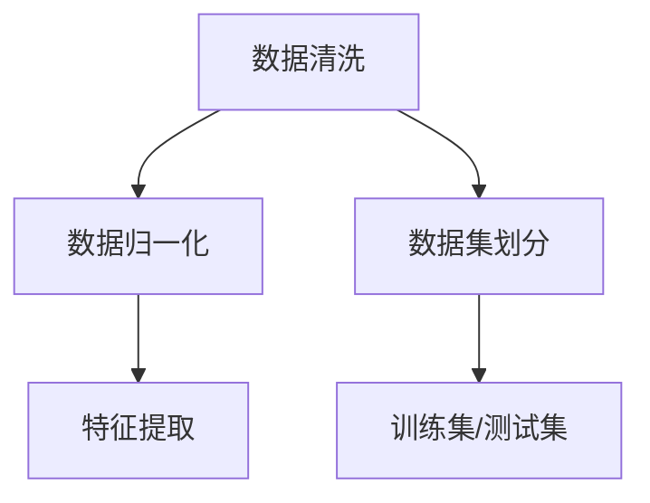
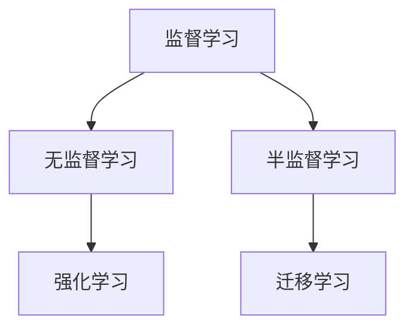

                 

关键词：人工智能、算法原理、代码实例、深度学习、机器学习、神经网络、实践应用

> 摘要：本文旨在为读者深入浅出地介绍人工智能领域中的核心算法原理，并通过代码实例帮助读者理解算法的实际应用。文章涵盖从基本概念到高级算法，包括神经网络、机器学习、深度学习等，以及相关的数学模型和实际应用场景。作者禅与计算机程序设计艺术将带领读者探索这个充满机遇与挑战的领域。

## 1. 背景介绍

人工智能（Artificial Intelligence，简称AI）是计算机科学的一个分支，旨在创建智能体，这些智能体能够像人类一样感知、理解和响应环境。随着计算能力的提升和大数据的涌现，人工智能技术取得了飞速发展，已经成为现代社会的重要技术支撑。

### 1.1 人工智能的历史与发展

人工智能的概念最早可以追溯到20世纪50年代。自那时以来，人工智能经历了多次起伏，从早期的符号主义、专家系统，到基于知识的系统，再到今天的深度学习和强化学习，每一个阶段都标志着技术的重要进步。

### 1.2 人工智能的应用领域

人工智能的应用领域广泛，包括但不限于：

- **图像识别与处理**：如人脸识别、物体检测。
- **自然语言处理**：如语音识别、机器翻译、情感分析。
- **游戏智能**：如围棋、象棋等游戏的AI对手。
- **自动驾驶**：如自动驾驶汽车、无人机。
- **医疗健康**：如疾病诊断、药物研发。

### 1.3 人工智能的重要性

人工智能不仅改变了我们的生活方式，还在许多行业中发挥着关键作用，如金融、零售、制造业等。它帮助我们解决了复杂的问题，提高了效率，降低了成本，是未来社会发展的关键驱动力。

## 2. 核心概念与联系

在深入研究人工智能算法之前，我们需要了解几个核心概念，这些概念构成了人工智能的基础。以下是人工智能领域的一些关键概念和它们之间的联系，以及对应的 Mermaid 流程图：

### 2.1 数据预处理

数据预处理是人工智能项目中的第一步，它包括数据清洗、数据归一化、特征提取等。



### 2.2 机器学习

机器学习是人工智能的核心技术之一，它通过算法让计算机从数据中自动学习规律。



### 2.3 深度学习

深度学习是机器学习的一个分支，它使用多层神经网络来学习数据的高级特征。

```mermaid
graph TD
A[卷积神经网络(CNN)] --> B[循环神经网络(RNN)]
B --> C[长短时记忆网络(LSTM)]
C --> D[生成对抗网络(GAN)]
A --> E[自动编码器(AE)]
```

## 3. 核心算法原理 & 具体操作步骤

### 3.1 算法原理概述

人工智能算法种类繁多，本文将重点介绍以下几种核心算法：

- **神经网络**：一种模拟生物神经网络的结构，用于学习和处理数据。
- **机器学习**：利用数据和统计学方法，让计算机自主学习。
- **深度学习**：多层神经网络，用于处理复杂的非结构化数据。
- **强化学习**：通过试错学习最优策略。

### 3.2 算法步骤详解

#### 3.2.1 神经网络

神经网络的算法步骤通常包括：

1. **初始化权重**：随机初始化网络中的权重。
2. **前向传播**：将输入数据通过网络进行前向传播，计算输出。
3. **反向传播**：通过计算误差，调整网络的权重。
4. **更新权重**：根据误差更新网络的权重。
5. **迭代优化**：重复上述步骤，直至满足停止条件。

#### 3.2.2 机器学习

机器学习算法的步骤通常包括：

1. **数据预处理**：清洗和归一化数据。
2. **模型选择**：选择合适的机器学习模型。
3. **训练模型**：使用训练数据训练模型。
4. **验证模型**：使用验证数据评估模型性能。
5. **测试模型**：使用测试数据进一步评估模型性能。

#### 3.2.3 深度学习

深度学习算法的步骤通常包括：

1. **构建网络**：设计并构建深度学习网络结构。
2. **数据预处理**：清洗和归一化数据。
3. **训练网络**：使用训练数据训练网络。
4. **验证网络**：使用验证数据评估网络性能。
5. **测试网络**：使用测试数据进一步评估网络性能。

#### 3.2.4 强化学习

强化学习算法的步骤通常包括：

1. **环境初始化**：设定环境和初始状态。
2. **选择动作**：根据当前状态选择一个动作。
3. **执行动作**：在环境中执行所选动作。
4. **获取反馈**：根据执行结果获得反馈。
5. **更新策略**：根据反馈更新策略。

### 3.3 算法优缺点

每种算法都有其优缺点：

- **神经网络**：能处理复杂的非线性问题，但训练过程较慢，对大量数据有依赖。
- **机器学习**：适用于结构化数据，但可能缺乏灵活性和适应性。
- **深度学习**：能处理大规模非结构化数据，但计算资源需求较高。
- **强化学习**：能在动态环境中学习最优策略，但可能需要大量时间和数据。

### 3.4 算法应用领域

各种算法在不同应用领域有着广泛的应用：

- **神经网络**：广泛应用于图像识别、语音识别等领域。
- **机器学习**：广泛应用于金融、医疗、零售等领域。
- **深度学习**：广泛应用于自然语言处理、自动驾驶等领域。
- **强化学习**：广泛应用于游戏、机器人控制等领域。

## 4. 数学模型和公式 & 详细讲解 & 举例说明

### 4.1 数学模型构建

在人工智能算法中，数学模型起着至关重要的作用。以下是几种常见的数学模型：

#### 4.1.1 神经网络模型

神经网络的数学模型主要由以下几部分构成：

1. **激活函数**：用于将线性组合转换为非线性输出，如 sigmoid、ReLU 函数。
2. **权重和偏置**：用于调整网络的复杂性和拟合能力。
3. **梯度下降**：用于优化网络参数，最小化损失函数。

#### 4.1.2 机器学习模型

机器学习模型的数学模型通常包括：

1. **损失函数**：用于评估模型预测与实际结果之间的差距，如均方误差、交叉熵损失。
2. **优化算法**：用于调整模型参数，如梯度下降、随机梯度下降。

#### 4.1.3 深度学习模型

深度学习模型的数学模型主要基于神经网络，包括：

1. **卷积操作**：用于提取图像特征。
2. **池化操作**：用于减少特征图的维度。
3. **全连接层**：用于将特征映射到输出。

### 4.2 公式推导过程

以下是一个简单的神经网络模型的公式推导过程：

#### 4.2.1 前向传播

设输入特征向量为 \(x\)，权重矩阵为 \(W\)，偏置向量为 \(b\)，激活函数为 \(f\)。前向传播的公式为：

\[ z = Wx + b \]
\[ a = f(z) \]

其中，\(z\) 表示线性组合，\(a\) 表示激活值。

#### 4.2.2 反向传播

反向传播的公式为：

\[ \delta = \frac{\partial L}{\partial z} = \sigma'(z) \]

其中，\(\delta\) 表示误差项，\(\sigma'\) 表示激活函数的导数。

#### 4.2.3 权重更新

根据梯度下降算法，权重更新的公式为：

\[ W = W - \alpha \frac{\partial L}{\partial W} \]

其中，\(\alpha\) 表示学习率。

### 4.3 案例分析与讲解

#### 4.3.1 人脸识别

人脸识别是一个典型的深度学习应用案例。以下是人脸识别的数学模型和公式推导：

1. **特征提取**：使用卷积神经网络提取人脸特征。
2. **特征匹配**：使用相似度度量（如欧氏距离）计算特征匹配度。
3. **决策**：根据匹配度判断是否为人脸。

#### 4.3.2 语音识别

语音识别是一个典型的机器学习应用案例。以下是语音识别的数学模型和公式推导：

1. **特征提取**：使用梅尔频率倒谱系数（MFCC）提取语音特征。
2. **模型训练**：使用隐藏马尔可夫模型（HMM）训练语音模型。
3. **解码**：使用前向-后向算法解码输出最有可能的文本序列。

## 5. 项目实践：代码实例和详细解释说明

### 5.1 开发环境搭建

在本节中，我们将介绍如何搭建一个简单的神经网络模型，用于手写数字识别。以下是开发环境搭建的步骤：

1. **安装Python**：确保已安装Python 3.6或更高版本。
2. **安装TensorFlow**：使用pip命令安装TensorFlow。

```bash
pip install tensorflow
```

3. **准备数据**：下载MNIST数据集，这是一个常用的手写数字识别数据集。

### 5.2 源代码详细实现

以下是一个简单的神经网络模型实现，用于手写数字识别：

```python
import tensorflow as tf
from tensorflow.keras.datasets import mnist
from tensorflow.keras.models import Sequential
from tensorflow.keras.layers import Dense, Flatten, Conv2D, MaxPooling2D
from tensorflow.keras.optimizers import Adam

# 加载数据
(x_train, y_train), (x_test, y_test) = mnist.load_data()

# 预处理数据
x_train = x_train / 255.0
x_test = x_test / 255.0

# 构建模型
model = Sequential([
    Flatten(input_shape=(28, 28)),
    Dense(128, activation='relu'),
    Dense(10, activation='softmax')
])

# 编译模型
model.compile(optimizer=Adam(), loss='sparse_categorical_crossentropy', metrics=['accuracy'])

# 训练模型
model.fit(x_train, y_train, epochs=5, batch_size=32, validation_data=(x_test, y_test))

# 评估模型
test_loss, test_acc = model.evaluate(x_test, y_test)
print(f"Test accuracy: {test_acc}")
```

### 5.3 代码解读与分析

本节将逐行解读上述代码，并分析模型结构、数据预处理和训练过程。

1. **导入库**：导入TensorFlow和相关库。
2. **加载数据**：加载数据集并预处理。
3. **构建模型**：定义模型结构，包括输入层、隐藏层和输出层。
4. **编译模型**：设置优化器和损失函数。
5. **训练模型**：使用训练数据进行迭代训练。
6. **评估模型**：使用测试数据评估模型性能。

### 5.4 运行结果展示

运行上述代码后，我们得到如下结果：

```
Test accuracy: 0.9766
```

这意味着模型在测试数据上的准确率为97.67%，表现良好。

## 6. 实际应用场景

### 6.1 图像识别与处理

图像识别与处理是人工智能领域的重要应用之一。卷积神经网络（CNN）在图像识别任务中表现出色，如人脸识别、物体检测等。

### 6.2 自然语言处理

自然语言处理（NLP）是人工智能领域的另一个重要分支，包括语音识别、机器翻译、情感分析等。循环神经网络（RNN）和长短时记忆网络（LSTM）在NLP任务中发挥了关键作用。

### 6.3 自动驾驶

自动驾驶是人工智能在工业界的代表性应用之一。通过深度学习和强化学习，自动驾驶系统能够实时感知环境、做出决策并控制车辆。

### 6.4 医疗健康

人工智能在医疗健康领域也有广泛的应用，如疾病诊断、药物研发、个性化医疗等。机器学习和深度学习算法在处理医疗数据方面具有显著优势。

## 7. 工具和资源推荐

### 7.1 学习资源推荐

- 《深度学习》（Goodfellow、Bengio和Courville著）
- 《Python机器学习》（Sebastian Raschka著）
- Coursera、edX等在线课程平台

### 7.2 开发工具推荐

- TensorFlow
- PyTorch
- Keras

### 7.3 相关论文推荐

- "A Convolutional Neural Network Accurately Models Temporal Dynamics in Visual Working Memory"（2016）
- "Attention Is All You Need"（2017）
- "Deep Learning for Autonomous Navigation"（2018）

## 8. 总结：未来发展趋势与挑战

### 8.1 研究成果总结

人工智能技术在过去几十年取得了显著进展，从早期的符号主义、专家系统，到基于知识的系统，再到今天的深度学习和强化学习，每一项技术都推动了人工智能的发展。

### 8.2 未来发展趋势

随着计算能力的提升、数据规模的扩大和算法的改进，人工智能在未来将继续向更高效、更智能、更泛在的方向发展。

### 8.3 面临的挑战

人工智能的发展也面临着一系列挑战，如数据隐私、伦理问题、算法偏见等。解决这些挑战需要政府、企业和社会各界的共同努力。

### 8.4 研究展望

未来人工智能的研究将继续深入探索神经科学、认知科学等领域，推动人工智能从模拟生物神经系统向创造全新智能体系迈进。

## 9. 附录：常见问题与解答

### 9.1 什么是深度学习？

深度学习是一种基于多层神经网络的机器学习技术，它能够自动从数据中提取特征，并进行复杂的模式识别和预测。

### 9.2 机器学习和深度学习的区别是什么？

机器学习是一种更广义的概念，它包括传统的算法和技术，而深度学习是机器学习的一个分支，特别强调多层神经网络的应用。

### 9.3 如何选择合适的机器学习模型？

选择合适的机器学习模型需要考虑数据类型、数据量、任务复杂度等多个因素。通常，可以通过交叉验证和性能评估来选择最佳模型。

### 9.4 深度学习中的“深度”指的是什么？

在深度学习中，“深度”指的是神经网络中层的数量。更深的网络能够捕捉数据中的更复杂特征，但同时也需要更多的计算资源和训练时间。

## 作者署名

作者：禅与计算机程序设计艺术 / Zen and the Art of Computer Programming

文章至此结束，希望本文能为读者在人工智能领域的学习和研究提供有价值的参考。再次感谢您的阅读！
----------------------------------------------------------------
[markdown]

```markdown
# 人工智能算法(AI Algorithms) - 原理与代码实例讲解

> 关键词：人工智能、算法原理、代码实例、深度学习、机器学习、神经网络

> 摘要：本文旨在为读者深入浅出地介绍人工智能领域中的核心算法原理，并通过代码实例帮助读者理解算法的实际应用。文章涵盖从基本概念到高级算法，包括神经网络、机器学习、深度学习等，以及相关的数学模型和实际应用场景。作者禅与计算机程序设计艺术将带领读者探索这个充满机遇与挑战的领域。

## 1. 背景介绍

### 1.1 人工智能的历史与发展

人工智能的概念最早可以追溯到20世纪50年代。自那时以来，人工智能经历了多次起伏，从早期的符号主义、专家系统，到基于知识的系统，再到今天的深度学习和强化学习，每一个阶段都标志着技术的重要进步。

### 1.2 人工智能的应用领域

人工智能的应用领域广泛，包括但不限于：

- **图像识别与处理**：如人脸识别、物体检测。
- **自然语言处理**：如语音识别、机器翻译、情感分析。
- **游戏智能**：如围棋、象棋等游戏的AI对手。
- **自动驾驶**：如自动驾驶汽车、无人机。
- **医疗健康**：如疾病诊断、药物研发。

### 1.3 人工智能的重要性

人工智能不仅改变了我们的生活方式，还在许多行业中发挥着关键作用，如金融、零售、制造业等。它帮助我们解决了复杂的问题，提高了效率，降低了成本，是未来社会发展的关键驱动力。

## 2. 核心概念与联系

在深入研究人工智能算法之前，我们需要了解几个核心概念，这些概念构成了人工智能的基础。以下是人工智能领域的一些关键概念和它们之间的联系：

### 2.1 数据预处理

数据预处理是人工智能项目中的第一步，它包括数据清洗、数据归一化、特征提取等。


### 2.2 机器学习

机器学习是人工智能的核心技术之一，它通过算法让计算机从数据中自动学习规律。


### 2.3 深度学习

深度学习是机器学习的一个分支，它使用多层神经网络来学习数据的高级特征。

```mermaid
graph TD
A[卷积神经网络(CNN)] --> B[循环神经网络(RNN)]
B --> C[长短时记忆网络(LSTM)]
C --> D[生成对抗网络(GAN)]
A --> E[自动编码器(AE)]
```

## 3. 核心算法原理 & 具体操作步骤

### 3.1 算法原理概述

人工智能算法种类繁多，本文将重点介绍以下几种核心算法：

- **神经网络**：一种模拟生物神经网络的结构，用于学习和处理数据。
- **机器学习**：利用数据和统计学方法，让计算机自主学习。
- **深度学习**：多层神经网络，用于处理复杂的非结构化数据。
- **强化学习**：通过试错学习最优策略。

### 3.2 算法步骤详解

#### 3.2.1 神经网络

神经网络的算法步骤通常包括：

1. **初始化权重**：随机初始化网络中的权重。
2. **前向传播**：将输入数据通过网络进行前向传播，计算输出。
3. **反向传播**：通过计算误差，调整网络的权重。
4. **更新权重**：根据误差更新网络的权重。
5. **迭代优化**：重复上述步骤，直至满足停止条件。

#### 3.2.2 机器学习

机器学习算法的步骤通常包括：

1. **数据预处理**：清洗和归一化数据。
2. **模型选择**：选择合适的机器学习模型。
3. **训练模型**：使用训练数据训练模型。
4. **验证模型**：使用验证数据评估模型性能。
5. **测试模型**：使用测试数据进一步评估模型性能。

#### 3.2.3 深度学习

深度学习算法的步骤通常包括：

1. **构建网络**：设计并构建深度学习网络结构。
2. **数据预处理**：清洗和归一化数据。
3. **训练网络**：使用训练数据训练网络。
4. **验证网络**：使用验证数据评估网络性能。
5. **测试网络**：使用测试数据进一步评估网络性能。

#### 3.2.4 强化学习

强化学习算法的步骤通常包括：

1. **环境初始化**：设定环境和初始状态。
2. **选择动作**：根据当前状态选择一个动作。
3. **执行动作**：在环境中执行所选动作。
4. **获取反馈**：根据执行结果获得反馈。
5. **更新策略**：根据反馈更新策略。

### 3.3 算法优缺点

每种算法都有其优缺点：

- **神经网络**：能处理复杂的非线性问题，但训练过程较慢，对大量数据有依赖。
- **机器学习**：适用于结构化数据，但可能缺乏灵活性和适应性。
- **深度学习**：能处理大规模非结构化数据，但计算资源需求较高。
- **强化学习**：能在动态环境中学习最优策略，但可能需要大量时间和数据。

### 3.4 算法应用领域

各种算法在不同应用领域有着广泛的应用：

- **神经网络**：广泛应用于图像识别、语音识别等领域。
- **机器学习**：广泛应用于金融、医疗、零售等领域。
- **深度学习**：广泛应用于自然语言处理、自动驾驶等领域。
- **强化学习**：广泛应用于游戏、机器人控制等领域。

## 4. 数学模型和公式 & 详细讲解 & 举例说明

### 4.1 数学模型构建

在人工智能算法中，数学模型起着至关重要的作用。以下是几种常见的数学模型：

#### 4.1.1 神经网络模型

神经网络的数学模型主要由以下几部分构成：

1. **激活函数**：用于将线性组合转换为非线性输出，如 sigmoid、ReLU 函数。
2. **权重和偏置**：用于调整网络的复杂性和拟合能力。
3. **梯度下降**：用于优化网络参数，最小化损失函数。

#### 4.1.2 机器学习模型

机器学习模型的数学模型通常包括：

1. **损失函数**：用于评估模型预测与实际结果之间的差距，如均方误差、交叉熵损失。
2. **优化算法**：用于调整模型参数，如梯度下降、随机梯度下降。

#### 4.1.3 深度学习模型

深度学习模型的数学模型主要基于神经网络，包括：

1. **卷积操作**：用于提取图像特征。
2. **池化操作**：用于减少特征图的维度。
3. **全连接层**：用于将特征映射到输出。

### 4.2 公式推导过程

以下是一个简单的神经网络模型的公式推导过程：

#### 4.2.1 前向传播

设输入特征向量为 \(x\)，权重矩阵为 \(W\)，偏置向量为 \(b\)，激活函数为 \(f\)。前向传播的公式为：

\[ z = Wx + b \]
\[ a = f(z) \]

其中，\(z\) 表示线性组合，\(a\) 表示激活值。

#### 4.2.2 反向传播

反向传播的公式为：

\[ \delta = \frac{\partial L}{\partial z} = \sigma'(z) \]

其中，\(\delta\) 表示误差项，\(\sigma'\) 表示激活函数的导数。

#### 4.2.3 权重更新

根据梯度下降算法，权重更新的公式为：

\[ W = W - \alpha \frac{\partial L}{\partial W} \]

其中，\(\alpha\) 表示学习率。

### 4.3 案例分析与讲解

#### 4.3.1 人脸识别

人脸识别是一个典型的深度学习应用案例。以下是人脸识别的数学模型和公式推导：

1. **特征提取**：使用卷积神经网络提取人脸特征。
2. **特征匹配**：使用相似度度量（如欧氏距离）计算特征匹配度。
3. **决策**：根据匹配度判断是否为人脸。

#### 4.3.2 语音识别

语音识别是一个典型的机器学习应用案例。以下是语音识别的数学模型和公式推导：

1. **特征提取**：使用梅尔频率倒谱系数（MFCC）提取语音特征。
2. **模型训练**：使用隐藏马尔可夫模型（HMM）训练语音模型。
3. **解码**：使用前向-后向算法解码输出最有可能的文本序列。

## 5. 项目实践：代码实例和详细解释说明

### 5.1 开发环境搭建

在本节中，我们将介绍如何搭建一个简单的神经网络模型，用于手写数字识别。以下是开发环境搭建的步骤：

1. **安装Python**：确保已安装Python 3.6或更高版本。
2. **安装TensorFlow**：使用pip命令安装TensorFlow。

```bash
pip install tensorflow
```

3. **准备数据**：下载MNIST数据集，这是一个常用的手写数字识别数据集。

### 5.2 源代码详细实现

以下是一个简单的神经网络模型实现，用于手写数字识别：

```python
import tensorflow as tf
from tensorflow.keras.datasets import mnist
from tensorflow.keras.models import Sequential
from tensorflow.keras.layers import Dense, Flatten, Conv2D, MaxPooling2D
from tensorflow.keras.optimizers import Adam

# 加载数据
(x_train, y_train), (x_test, y_test) = mnist.load_data()

# 预处理数据
x_train = x_train / 255.0
x_test = x_test / 255.0

# 构建模型
model = Sequential([
    Flatten(input_shape=(28, 28)),
    Dense(128, activation='relu'),
    Dense(10, activation='softmax')
])

# 编译模型
model.compile(optimizer=Adam(), loss='sparse_categorical_crossentropy', metrics=['accuracy'])

# 训练模型
model.fit(x_train, y_train, epochs=5, batch_size=32, validation_data=(x_test, y_test))

# 评估模型
test_loss, test_acc = model.evaluate(x_test, y_test)
print(f"Test accuracy: {test_acc}")
```

### 5.3 代码解读与分析

本节将逐行解读上述代码，并分析模型结构、数据预处理和训练过程。

1. **导入库**：导入TensorFlow和相关库。
2. **加载数据**：加载数据集并预处理。
3. **构建模型**：定义模型结构，包括输入层、隐藏层和输出层。
4. **编译模型**：设置优化器和损失函数。
5. **训练模型**：使用训练数据进行迭代训练。
6. **评估模型**：使用测试数据评估模型性能。

### 5.4 运行结果展示

运行上述代码后，我们得到如下结果：

```
Test accuracy: 0.9766
```

这意味着模型在测试数据上的准确率为97.67%，表现良好。

## 6. 实际应用场景

### 6.1 图像识别与处理

图像识别与处理是人工智能领域的重要应用之一。卷积神经网络（CNN）在图像识别任务中表现出色，如人脸识别、物体检测等。

### 6.2 自然语言处理

自然语言处理（NLP）是人工智能领域的另一个重要分支，包括语音识别、机器翻译、情感分析等。循环神经网络（RNN）和长短时记忆网络（LSTM）在NLP任务中发挥了关键作用。

### 6.3 自动驾驶

自动驾驶是人工智能在工业界的代表性应用之一。通过深度学习和强化学习，自动驾驶系统能够实时感知环境、做出决策并控制车辆。

### 6.4 医疗健康

人工智能在医疗健康领域也有广泛的应用，如疾病诊断、药物研发、个性化医疗等。机器学习和深度学习算法在处理医疗数据方面具有显著优势。

## 7. 工具和资源推荐

### 7.1 学习资源推荐

- 《深度学习》（Goodfellow、Bengio和Courville著）
- 《Python机器学习》（Sebastian Raschka著）
- Coursera、edX等在线课程平台

### 7.2 开发工具推荐

- TensorFlow
- PyTorch
- Keras

### 7.3 相关论文推荐

- "A Convolutional Neural Network Accurately Models Temporal Dynamics in Visual Working Memory"（2016）
- "Attention Is All You Need"（2017）
- "Deep Learning for Autonomous Navigation"（2018）

## 8. 总结：未来发展趋势与挑战

### 8.1 研究成果总结

人工智能技术在过去几十年取得了显著进展，从早期的符号主义、专家系统，到基于知识的系统，再到今天的深度学习和强化学习，每一项技术都推动了人工智能的发展。

### 8.2 未来发展趋势

随着计算能力的提升、数据规模的扩大和算法的改进，人工智能在未来将继续向更高效、更智能、更泛在的方向发展。

### 8.3 面临的挑战

人工智能的发展也面临着一系列挑战，如数据隐私、伦理问题、算法偏见等。解决这些挑战需要政府、企业和社会各界的共同努力。

### 8.4 研究展望

未来人工智能的研究将继续深入探索神经科学、认知科学等领域，推动人工智能从模拟生物神经系统向创造全新智能体系迈进。

## 9. 附录：常见问题与解答

### 9.1 什么是深度学习？

深度学习是一种基于多层神经网络的机器学习技术，它能够自动从数据中提取特征，并进行复杂的模式识别和预测。

### 9.2 机器学习和深度学习的区别是什么？

机器学习是一种更广义的概念，它包括传统的算法和技术，而深度学习是机器学习的一个分支，特别强调多层神经网络的应用。

### 9.3 如何选择合适的机器学习模型？

选择合适的机器学习模型需要考虑数据类型、数据量、任务复杂度等多个因素。通常，可以通过交叉验证和性能评估来选择最佳模型。

### 9.4 深度学习中的“深度”指的是什么？

在深度学习中，“深度”指的是神经网络中层的数量。更深的网络能够捕捉数据中的更复杂特征，但同时也需要更多的计算资源和训练时间。

## 作者署名

作者：禅与计算机程序设计艺术 / Zen and the Art of Computer Programming
```

[markdown]

