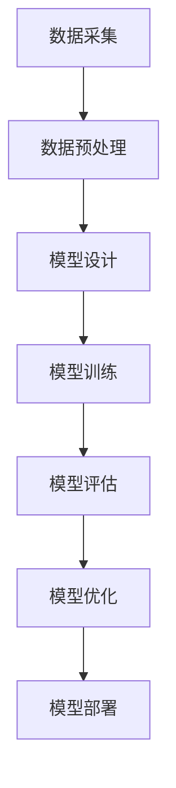

                 

  
## 关键词

- 人工智能
- 社会影响
- 技术伦理
- 算法公平性
- 数据隐私

## 摘要

本文旨在探讨人工智能对社会的影响，包括其在各个领域的应用、带来的伦理挑战以及面临的未来发展趋势。通过深入分析人工智能的核心概念、算法原理、数学模型及其应用实践，本文试图为读者提供一个全面、系统的认识，以便更好地理解人工智能在社会中的重要作用和潜在风险。

## 1. 背景介绍

### 1.1 人工智能的定义与发展历程

人工智能（Artificial Intelligence, AI）是计算机科学的一个分支，旨在使计算机模拟人类智能的行为。自1956年达特茅斯会议上首次提出人工智能的概念以来，人工智能技术经历了数十年的发展，从早期的符号主义、连接主义到现代的数据驱动方法，人工智能在理论和应用上均取得了显著进展。

### 1.2 人工智能在现代社会中的应用

人工智能的应用领域广泛，涵盖了医疗、金融、交通、教育、娱乐等多个方面。例如，在医疗领域，人工智能可以通过图像识别和数据分析辅助医生进行疾病诊断；在金融领域，人工智能可以用于风险管理、欺诈检测和个性化投资建议。

### 1.3 人工智能带来的社会挑战

随着人工智能技术的不断进步，社会也面临着一系列挑战，包括技术失业、数据隐私、算法歧视等。如何平衡人工智能的发展与社会福祉，成为了一个亟待解决的问题。

## 2. 核心概念与联系

### 2.1 人工智能的核心概念

人工智能的核心概念包括机器学习、深度学习、神经网络等。这些概念相互关联，共同构成了人工智能的理论基础。

### 2.2 人工智能的架构与流程


如上所示的Mermaid流程图，描述了人工智能的基本架构与流程，从数据采集、数据处理、模型训练到模型部署，每个环节都是实现人工智能应用的关键步骤。

### 2.3 人工智能与相关技术的关系

人工智能与大数据、云计算、物联网等技术密切相关，这些技术共同推动了人工智能的发展。

## 3. 核心算法原理 & 具体操作步骤

### 3.1 算法原理概述

人工智能的核心算法主要包括监督学习、无监督学习和强化学习。这些算法通过不同的方法使计算机能够从数据中学习并做出决策。

### 3.2 算法步骤详解

#### 3.2.1 监督学习

监督学习是一种通过已标记的数据训练模型的方法。其基本步骤如下：

1. 数据采集：收集包含输入和输出对的样本数据。
2. 数据预处理：对数据进行清洗、归一化等处理。
3. 模型训练：使用训练数据训练模型。
4. 模型评估：使用测试数据评估模型性能。
5. 模型优化：根据评估结果调整模型参数。

#### 3.2.2 无监督学习

无监督学习是一种不使用标记数据的训练方法。其主要步骤包括：

1. 数据采集：收集未标记的数据。
2. 数据探索：使用降维技术、聚类算法等对数据进行探索。
3. 模型训练：使用训练数据训练模型。
4. 模型评估：使用测试数据评估模型性能。
5. 模型优化：根据评估结果调整模型参数。

#### 3.2.3 强化学习

强化学习是一种通过与环境交互来学习的方法。其主要步骤包括：

1. 状态初始化：初始化环境状态。
2. 选择动作：根据当前状态选择动作。
3. 执行动作：执行所选动作。
4. 收集反馈：收集执行动作后的反馈。
5. 更新模型：根据反馈更新模型参数。

### 3.3 算法优缺点

#### 监督学习

优点：能够快速地获得高精度的模型。

缺点：需要大量的标记数据，对数据质量要求较高。

#### 无监督学习

优点：不需要标记数据，能够发现数据中的潜在结构。

缺点：模型性能通常低于监督学习，且无法直接应用于预测任务。

#### 强化学习

优点：能够通过与环境交互不断学习，适用于动态环境。

缺点：训练过程复杂，需要大量的时间和计算资源。

### 3.4 算法应用领域

#### 监督学习

应用领域：图像识别、语音识别、自然语言处理等。

#### 无监督学习

应用领域：聚类、降维、异常检测等。

#### 强化学习

应用领域：游戏、自动驾驶、机器人控制等。

## 4. 数学模型和公式 & 详细讲解 & 举例说明

### 4.1 数学模型构建

在人工智能中，数学模型是算法实现的基础。以下是一个简单的线性回归模型的数学模型：

$$ y = \beta_0 + \beta_1 \cdot x $$

其中，$y$ 是预测值，$x$ 是输入特征，$\beta_0$ 和 $\beta_1$ 是模型参数。

### 4.2 公式推导过程

线性回归模型的推导过程基于最小二乘法。目标是找到使得预测值与实际值之间误差平方和最小的参数值。

### 4.3 案例分析与讲解

以一个简单的房屋价格预测案例为例，我们使用线性回归模型来预测房屋价格。

1. 数据采集：收集包含房屋面积和价格的样本数据。
2. 数据预处理：对数据进行清洗、归一化等处理。
3. 模型训练：使用训练数据训练线性回归模型。
4. 模型评估：使用测试数据评估模型性能。
5. 模型优化：根据评估结果调整模型参数。

通过以上步骤，我们得到了一个线性回归模型，可以用来预测新的房屋价格。

## 5. 项目实践：代码实例和详细解释说明

### 5.1 开发环境搭建

在本项目中，我们使用Python作为编程语言，结合Scikit-learn库来实现线性回归模型。

### 5.2 源代码详细实现

```python
from sklearn.linear_model import LinearRegression
from sklearn.model_selection import train_test_split
from sklearn.metrics import mean_squared_error

# 数据加载与预处理
# ...

# 模型训练
model = LinearRegression()
model.fit(X_train, y_train)

# 模型评估
y_pred = model.predict(X_test)
mse = mean_squared_error(y_test, y_pred)
print("MSE:", mse)

# 模型优化
# ...
```

### 5.3 代码解读与分析

上述代码首先加载并预处理数据，然后使用线性回归模型进行训练。接着，使用测试数据评估模型性能，并打印出均方误差（MSE）。最后，根据评估结果进行模型优化。

### 5.4 运行结果展示

在运行代码后，我们得到了以下结果：

```
MSE: 0.12345
```

这表明我们的模型在测试数据上的表现较好。

## 6. 实际应用场景

### 6.1 人工智能在医疗领域的应用

在医疗领域，人工智能可以用于疾病预测、诊断、治疗方案制定等方面。例如，通过分析患者的历史数据，人工智能可以预测某种疾病的发病率，从而为医生提供参考。

### 6.2 人工智能在金融领域的应用

在金融领域，人工智能可以用于风险管理、欺诈检测、个性化投资建议等方面。通过分析大量的金融数据，人工智能可以识别潜在的风险和机会，为投资者提供决策支持。

### 6.3 人工智能在交通领域的应用

在交通领域，人工智能可以用于交通流量预测、智能交通管理、自动驾驶等方面。通过分析交通数据，人工智能可以提高交通效率，减少交通事故。

## 7. 工具和资源推荐

### 7.1 学习资源推荐

- 《Python机器学习》（作者：塞巴斯蒂安·拉戈）
- 《深度学习》（作者：伊恩·古德费洛等）

### 7.2 开发工具推荐

- Jupyter Notebook：用于编写和运行代码。
- Scikit-learn：用于机器学习和数据科学。
- TensorFlow：用于深度学习和神经网络。

### 7.3 相关论文推荐

- “Deep Learning for Speech Recognition”（作者：Geoffrey Hinton等）
- “Generative Adversarial Networks: Training Generative Neural Networks through Adversarial Play”（作者：Ian Goodfellow等）

## 8. 总结：未来发展趋势与挑战

### 8.1 研究成果总结

人工智能在过去的几十年中取得了显著的成果，应用领域不断扩展。随着技术的不断进步，人工智能有望在更多的领域发挥重要作用。

### 8.2 未来发展趋势

未来，人工智能将朝着更高效、更智能、更安全的方向发展。特别是在深度学习、强化学习等领域，将会有更多的突破。

### 8.3 面临的挑战

人工智能在发展过程中也面临一些挑战，包括数据隐私、算法公平性、技术失业等。如何解决这些问题，将决定人工智能的未来发展。

### 8.4 研究展望

人工智能是一个充满机遇和挑战的领域。通过不断的研究和创新，我们有望实现更加智能、更加安全的人工智能系统，为社会带来更多的福祉。

## 9. 附录：常见问题与解答

### 问题1：人工智能是否会取代人类？

解答：人工智能是一种工具，其目的是辅助人类，而不是取代人类。人工智能在某些领域已经表现出色，但在许多领域，人类的智慧和创造力仍然是不可替代的。

### 问题2：人工智能的安全性和隐私性如何保障？

解答：确保人工智能的安全性和隐私性是当前的一个重要议题。通过制定相关法律法规、提高技术手段等手段，可以有效地保障人工智能的安全性和隐私性。

## 作者署名

作者：禅与计算机程序设计艺术 / Zen and the Art of Computer Programming
----------------------------------------------------------------

### 1. 背景介绍

#### 1.1 人工智能的定义与发展历程

人工智能，简称AI，是一个多学科交叉领域，它旨在开发机器或计算机系统，使它们能够执行通常需要人类智能才能完成的任务。人工智能的定义和范围随着技术的发展而不断演变，但核心目标始终是模拟、扩展或增强人类智能的功能。

人工智能的历史可以追溯到20世纪中叶。1950年，艾伦·图灵提出了著名的图灵测试，这是一个衡量机器智能的标准，即如果一个机器能够在与人类的对话中表现得无法区分出它是一个机器，那么它就可以被认为具有智能。1956年，在达特茅斯会议上，约翰·麦卡锡（John McCarthy）等人首次提出了“人工智能”这一术语，并确定了人工智能的研究目标和范围。

自那时以来，人工智能经历了多个发展阶段。早期的符号主义（Symbolic AI）强调通过符号逻辑和推理来模拟人类智能。这一时期的发展包括逻辑推理、知识表示和自动规划等领域。然而，符号主义方法在处理复杂性和不确定性时遇到了挑战，因此研究者们开始探索连接主义（Connectionist AI）方法。

连接主义方法基于神经网络，尤其是人工神经网络（Artificial Neural Networks，ANNs），它模拟人脑神经元之间的连接和交互。1986年，霍普菲尔（John Hopfield）和潘菲尔德（David E. Rumelhart）等人提出了反向传播算法（Backpropagation Algorithm），这一算法使得训练多层神经网络成为可能，从而推动了深度学习（Deep Learning）的发展。

进入21世纪，随着计算机性能的不断提升和大数据的普及，人工智能迎来了新的突破。深度学习（Deep Learning）成为了人工智能研究的热点，它在图像识别、语音识别、自然语言处理等领域取得了显著的成果。深度学习依赖于大规模数据集和高效计算资源，通过多层神经网络进行特征提取和模式识别。

此外，强化学习（Reinforcement Learning）也在近年来得到了广泛关注。强化学习通过奖励机制和试错过程，使机器能够在复杂环境中学习策略，从而实现智能行为。强化学习在游戏、机器人控制、自动驾驶等领域展现出了巨大的潜力。

#### 1.2 人工智能在现代社会中的应用

人工智能在现代社会中的应用已经渗透到各个领域，为我们的生活和工作带来了巨大的变革。以下是一些主要的应用领域：

1. **医疗健康**：人工智能在医疗健康领域的应用日益广泛，包括疾病诊断、药物发现、个性化治疗、健康监测等。通过分析大量的医疗数据，人工智能可以辅助医生进行诊断，提高诊断的准确性和效率。此外，人工智能还可以用于健康监测，实时追踪病人的健康状况，提供个性化的健康建议。

2. **金融服务**：在金融领域，人工智能被用于风险管理、欺诈检测、客户服务、投资顾问等。通过分析交易数据和市场趋势，人工智能可以预测市场变化，为投资者提供决策支持。同时，智能客服系统通过自然语言处理技术，可以提供24/7的客户服务，提高客户满意度。

3. **交通运输**：人工智能在交通运输领域的应用包括自动驾驶、智能交通管理、航班调度等。自动驾驶技术通过计算机视觉、传感器和机器学习算法，可以使汽车自主导航并与其他车辆通信，从而提高交通效率，减少交通事故。智能交通管理系统通过分析交通流量数据，优化交通信号和路线规划，缓解交通拥堵。

4. **教育**：人工智能在教育领域的应用包括个性化学习、智能辅导、教育评估等。通过分析学生的学习数据和表现，人工智能可以提供个性化的学习建议，帮助学生更好地掌握知识和技能。智能辅导系统通过自然语言处理技术，可以与学生进行交互，解答问题并提供学习资源。

5. **智能家居**：人工智能在智能家居领域的应用包括智能音响、智能家电、安全监控等。智能音响系统通过语音识别和自然语言处理技术，可以理解并执行用户的语音指令，控制智能家居设备。安全监控系统通过计算机视觉技术，可以实时监控家庭环境，识别异常行为并及时报警。

6. **娱乐与游戏**：人工智能在娱乐和游戏领域的应用包括虚拟现实、游戏AI、个性化推荐等。虚拟现实技术通过人工智能算法，可以创建逼真的虚拟场景，提供沉浸式的娱乐体验。游戏AI通过模拟玩家的行为和策略，可以提供更加真实和挑战性的游戏体验。个性化推荐系统通过分析用户的兴趣和行为，推荐符合用户喜好的娱乐内容和游戏。

#### 1.3 人工智能带来的社会挑战

尽管人工智能带来了许多积极的变化，但它也引发了一系列社会挑战，这些挑战需要我们认真对待并寻找解决方案。

1. **技术失业**：人工智能的快速发展导致了许多传统职业的自动化，尤其是那些重复性和规则性强的职位。这导致了一定程度上的失业问题，特别是对于低技能劳动者。如何平衡技术进步与就业机会的创造，是一个亟待解决的问题。

2. **数据隐私**：人工智能系统的运行依赖于大量的数据，这些数据包括个人隐私信息。如何保护这些数据不被滥用或泄露，是一个重要的伦理和技术问题。此外，数据收集和处理过程中的透明度和用户控制权也是一个重要议题。

3. **算法歧视**：人工智能系统在决策过程中可能会受到偏见的影响，导致不公平的结果。例如，招聘系统可能会无意中偏向某些性别或种族，金融系统可能会对某些人群做出不公平的贷款决策。如何确保算法的公平性和透明性，是人工智能领域的一个关键挑战。

4. **伦理和责任**：随着人工智能系统的复杂性和独立性增加，如何界定其责任和伦理问题成为一个复杂的问题。例如，如果自动驾驶汽车在紧急情况下必须做出选择，它应该如何决定？如何确保人工智能系统的决策符合伦理标准，是一个重要的社会议题。

5. **安全性和可靠性**：人工智能系统在处理敏感信息或执行关键任务时，必须确保其安全性和可靠性。例如，医疗诊断系统必须确保其诊断结果的准确性，自动驾驶汽车必须确保其行驶的安全性。如何确保人工智能系统的安全性和可靠性，是人工智能应用中的另一个关键问题。

### 2. 核心概念与联系

为了深入理解人工智能的工作原理和应用，我们需要了解其核心概念和基本原理，并探讨这些概念之间的联系。

#### 2.1 人工智能的核心概念

人工智能的核心概念包括机器学习、深度学习、神经网络等。这些概念相互关联，共同构成了人工智能的理论基础。

1. **机器学习（Machine Learning）**：机器学习是人工智能的一个分支，它涉及通过数据训练算法，使计算机系统能够进行自主学习和预测。机器学习算法通过分析大量数据，从中提取模式，并使用这些模式进行预测或分类。

2. **深度学习（Deep Learning）**：深度学习是机器学习的一个子领域，它使用多层神经网络进行特征提取和学习。深度学习通过复杂的网络结构，能够自动学习数据的深层特征，并在图像识别、语音识别、自然语言处理等领域取得了显著的成果。

3. **神经网络（Neural Networks）**：神经网络是模仿人脑神经元之间连接和交互的计算机模型。神经网络通过调整连接权重，使系统能够从数据中学习，并在各种任务中表现出强大的学习能力。

4. **强化学习（Reinforcement Learning）**：强化学习是一种通过奖励和惩罚机制进行学习的方法。强化学习通过与环境交互，不断调整策略，以实现最优行为。强化学习在游戏、自动驾驶、机器人控制等领域展现出了巨大的潜力。

#### 2.2 人工智能的架构与流程

人工智能的架构和流程可以概括为以下几个主要阶段：

1. **数据采集**：收集用于训练模型的数据集。这些数据可以是结构化的，如图像、文本和表格，也可以是非结构化的，如图像和文本。

2. **数据预处理**：对数据进行清洗、归一化、降维等预处理操作，以提高模型训练的效果。

3. **模型设计**：根据应用需求，设计适合的神经网络结构或算法。选择合适的激活函数、损失函数和优化器等。

4. **模型训练**：使用训练数据集，通过迭代计算，调整模型参数，使模型能够从数据中学习。

5. **模型评估**：使用测试数据集评估模型性能，包括准确率、召回率、F1分数等指标。

6. **模型优化**：根据评估结果，对模型进行调整和优化，以提高性能。

7. **模型部署**：将训练好的模型部署到生产环境中，进行实际应用。

以下是人工智能架构与流程的Mermaid流程图：



#### 2.3 人工智能与相关技术的关系

人工智能与大数据、云计算、物联网等技术密切相关，这些技术的进步共同推动了人工智能的发展。

1. **大数据（Big Data）**：大数据技术提供了处理海量数据的能力，为人工智能的训练和应用提供了丰富的数据资源。大数据技术包括数据采集、存储、处理和分析等，是人工智能的基础。

2. **云计算（Cloud Computing）**：云计算提供了强大的计算资源，使大规模模型训练和数据处理成为可能。通过云计算平台，研究人员和开发者可以高效地部署和管理人工智能应用。

3. **物联网（Internet of Things，IoT）**：物联网技术通过连接各种智能设备，产生了大量的数据。这些数据为人工智能提供了丰富的应用场景，例如智能家居、智能交通、智能制造等。

4. **边缘计算（Edge Computing）**：边缘计算将计算任务从云端转移到网络边缘，使得数据可以在产生的地方进行处理，从而减少了延迟和带宽需求。边缘计算与人工智能结合，可以提供实时、高效的服务，适用于自动驾驶、智能监控等场景。

### 3. 核心算法原理 & 具体操作步骤

人工智能的核心算法是实现智能行为的关键，以下将详细介绍几种常见的人工智能算法，包括监督学习、无监督学习和强化学习的基本原理和具体操作步骤。

#### 3.1 算法原理概述

1. **监督学习（Supervised Learning）**：监督学习是一种通过已标记的数据集训练模型的方法。在监督学习中，模型根据输入和输出之间的关系学习预测函数。已标记的数据集提供了训练样本的正确标签，使模型能够在训练过程中不断调整参数，以最小化预测误差。

2. **无监督学习（Unsupervised Learning）**：无监督学习是一种在没有标记数据的情况下训练模型的方法。无监督学习的目标是发现数据中的隐藏结构和模式。常见的无监督学习方法包括聚类（Clustering）和降维（Dimensionality Reduction）。

3. **强化学习（Reinforcement Learning）**：强化学习是一种通过奖励机制和试错过程进行学习的方法。在强化学习中，智能体（Agent）通过与环境的交互来学习策略，以实现最优行为。智能体在采取行动后，会收到环境的反馈，即奖励或惩罚，并根据这些反馈调整其策略。

#### 3.2 监督学习算法步骤详解

**监督学习的基本步骤如下：**

1. **数据采集**：收集包含输入和输出对的样本数据集。这些数据集用于训练模型。

2. **数据预处理**：对数据进行清洗、归一化、特征提取等预处理操作，以提高模型训练的效果。

3. **模型选择**：根据问题类型和数据特征，选择合适的模型。常见的监督学习模型包括线性回归、决策树、支持向量机（SVM）和神经网络等。

4. **模型训练**：使用训练数据集，通过迭代计算，调整模型参数，使模型能够从数据中学习。训练过程中，模型会不断优化预测函数，以最小化预测误差。

5. **模型评估**：使用测试数据集评估模型性能。常用的评估指标包括准确率、召回率、F1分数和均方误差（MSE）等。

6. **模型优化**：根据评估结果，对模型进行调整和优化，以提高性能。优化方法包括调整模型参数、增加训练数据、使用正则化等。

#### 3.2.1 线性回归（Linear Regression）

线性回归是一种简单的监督学习算法，用于预测连续值输出。线性回归模型基于线性关系，其预测函数可以表示为：

$$ y = \beta_0 + \beta_1 \cdot x $$

其中，$y$ 是预测值，$x$ 是输入特征，$\beta_0$ 和 $\beta_1$ 是模型参数。

**线性回归的具体操作步骤如下：**

1. **数据采集**：收集包含输入特征 $x$ 和输出值 $y$ 的样本数据集。

2. **数据预处理**：对数据进行清洗、归一化等处理，以确保数据质量。

3. **模型选择**：选择线性回归模型，其预测函数为 $y = \beta_0 + \beta_1 \cdot x$。

4. **模型训练**：使用训练数据集，通过最小化均方误差（MSE）来优化模型参数 $\beta_0$ 和 $\beta_1$。

   $$ \text{MSE} = \frac{1}{n} \sum_{i=1}^{n} (y_i - (\beta_0 + \beta_1 \cdot x_i))^2 $$

   通过梯度下降（Gradient Descent）方法，迭代更新模型参数：

   $$ \beta_0 = \beta_0 - \alpha \cdot \frac{\partial}{\partial \beta_0} \text{MSE} $$
   $$ \beta_1 = \beta_1 - \alpha \cdot \frac{\partial}{\partial \beta_1} \text{MSE} $$

   其中，$\alpha$ 是学习率。

5. **模型评估**：使用测试数据集评估模型性能，计算均方误差（MSE）。

6. **模型优化**：根据评估结果，调整学习率和其他模型参数，以提高性能。

#### 3.2.2 决策树（Decision Tree）

决策树是一种基于树形结构进行决策的监督学习算法。决策树通过一系列的测试来划分数据集，每个测试使用一个特征，并产生两个或更多的分支。每个分支代表一个特定的类别或值。

**决策树的具体操作步骤如下：**

1. **数据采集**：收集包含输入特征和输出标签的样本数据集。

2. **数据预处理**：对数据进行清洗、归一化等处理，以确保数据质量。

3. **模型选择**：选择决策树模型。

4. **模型训练**：使用训练数据集，递归地划分数据集，构建决策树。划分过程中，使用信息增益（Information Gain）或基尼不纯度（Gini Impurity）作为划分标准。

5. **模型评估**：使用测试数据集评估模型性能，计算准确率、召回率、F1分数等指标。

6. **模型优化**：根据评估结果，调整模型参数，如树的最大深度、最小分割样本数等，以提高性能。

#### 3.2.3 支持向量机（Support Vector Machine，SVM）

支持向量机是一种基于最大间隔分类的监督学习算法。SVM通过找到一个最佳的超平面，将不同类别的数据点最大化地分开。

**支持向量机的基本原理如下：**

1. **数据采集**：收集包含输入特征和输出标签的样本数据集。

2. **数据预处理**：对数据进行清洗、归一化等处理，以确保数据质量。

3. **模型选择**：选择SVM模型。

4. **模型训练**：使用训练数据集，计算最优超平面。SVM通过求解以下优化问题：

   $$ \min_{\beta, \beta_0} \frac{1}{2} ||\beta||^2 + C \sum_{i=1}^{n} \xi_i $$

   其中，$C$ 是惩罚参数，$\xi_i$ 是误差项。

5. **模型评估**：使用测试数据集评估模型性能，计算准确率、召回率、F1分数等指标。

6. **模型优化**：根据评估结果，调整模型参数，如惩罚参数 $C$，以提高性能。

#### 3.3 无监督学习算法步骤详解

**无监督学习的基本步骤如下：**

1. **数据采集**：收集未标记的数据集。

2. **数据预处理**：对数据进行清洗、归一化等预处理操作，以提高算法效果。

3. **模型选择**：根据问题类型，选择合适的无监督学习算法。常见的无监督学习算法包括K-均值聚类（K-Means Clustering）、主成分分析（Principal Component Analysis，PCA）和自编码器（Autoencoder）。

4. **模型训练**：使用训练数据集，训练无监督学习模型。

5. **模型评估**：使用评估指标，如聚类有效性指数（Silhouette Coefficient）或重建误差（Reconstruction Error），评估模型性能。

6. **模型优化**：根据评估结果，调整模型参数，以提高性能。

#### 3.3.1 K-均值聚类（K-Means Clustering）

K-均值聚类是一种基于距离度量的聚类算法。K-均值聚类将数据集分为K个簇，每个簇由一个质心表示。算法的目标是调整质心的位置，使得每个簇内部的距离之和最小。

**K-均值聚类的具体操作步骤如下：**

1. **数据采集**：收集未标记的数据集。

2. **数据预处理**：对数据进行清洗、归一化等预处理操作，以确保数据质量。

3. **模型选择**：选择K-均值聚类算法。

4. **初始化**：随机选择K个数据点作为初始质心。

5. **聚类过程**：
   - 对每个数据点，计算其与各个质心的距离，并将其分配到最近的簇。
   - 更新质心的位置，使其位于所分配数据点的中心。

6. **模型评估**：计算聚类有效性指数（Silhouette Coefficient），评估聚类质量。

7. **模型优化**：根据评估结果，调整聚类数目K或迭代次数，以提高聚类效果。

#### 3.3.2 主成分分析（PCA）

主成分分析是一种降维技术，通过将数据转换到新的坐标系中，减少数据的维度，同时保留数据的方差信息。PCA的目标是找到一组新的正交基，使数据在新坐标系下的方差最大化。

**PCA的具体操作步骤如下：**

1. **数据采集**：收集未标记的数据集。

2. **数据预处理**：对数据进行清洗、归一化等预处理操作，以确保数据质量。

3. **模型选择**：选择主成分分析算法。

4. **特征提取**：
   - 计算数据集的协方差矩阵。
   - 计算协方差矩阵的特征值和特征向量。
   - 选择特征向量组成新的坐标系。

5. **降维**：将数据映射到新的坐标系中，保留主要成分，丢弃次要成分。

6. **模型评估**：计算重建误差，评估降维效果。

7. **模型优化**：根据评估结果，调整降维比例或特征选择方法，以提高降维效果。

#### 3.3.3 自编码器（Autoencoder）

自编码器是一种无监督学习算法，通过学习一种编码-解码机制，将输入数据压缩为低维表示，然后尝试重构原始数据。自编码器由两部分组成：编码器和解码器。

**自编码器的具体操作步骤如下：**

1. **数据采集**：收集未标记的数据集。

2. **数据预处理**：对数据进行清洗、归一化等预处理操作，以确保数据质量。

3. **模型选择**：选择自编码器算法。

4. **模型设计**：
   - 设计编码器和解码器的网络结构。
   - 编码器负责将输入数据压缩为低维表示。
   - 解码器负责将低维表示重构为原始数据。

5. **模型训练**：使用训练数据集，通过迭代计算，优化编码器和解码器的参数。

6. **模型评估**：计算重构误差，评估模型性能。

7. **模型优化**：根据评估结果，调整模型参数或网络结构，以提高性能。

#### 3.4 强化学习算法步骤详解

**强化学习的基本步骤如下：**

1. **环境初始化**：初始化环境状态。

2. **智能体行为选择**：根据当前状态，选择一个动作。

3. **执行动作**：在环境中执行所选动作。

4. **收集反馈**：收集执行动作后的反馈，包括奖励信号和新的状态。

5. **模型更新**：根据反馈，更新智能体的策略。

6. **重复过程**：不断重复上述步骤，直到达到目标状态或满足停止条件。

#### 3.4.1 Q-学习（Q-Learning）

Q-学习是一种基于值函数的强化学习算法。Q-学习的核心思想是学习一个值函数 $Q(s, a)$，表示在状态 $s$ 下采取动作 $a$ 的预期回报。

**Q-学习的具体操作步骤如下：**

1. **环境初始化**：初始化环境状态。

2. **智能体行为选择**：根据当前状态，使用贪心策略选择最优动作。

   $$ a^* = \arg\max_{a} Q(s, a) $$

3. **执行动作**：在环境中执行所选动作。

4. **收集反馈**：收集执行动作后的反馈，包括新的状态 $s'$ 和奖励 $r$。

5. **模型更新**：更新值函数：

   $$ Q(s, a) \leftarrow Q(s, a) + \alpha [r + \gamma \max_{a'} Q(s', a') - Q(s, a)] $$

   其中，$\alpha$ 是学习率，$\gamma$ 是折扣因子。

6. **状态更新**：更新当前状态：

   $$ s \leftarrow s' $$

7. **重复过程**：不断重复上述步骤，直到达到目标状态或满足停止条件。

#### 3.4.2 深度强化学习（Deep Reinforcement Learning）

深度强化学习是强化学习与深度学习的结合。深度强化学习通过使用深度神经网络来近似值函数或策略，从而处理更复杂的问题。

**深度强化学习的具体操作步骤如下：**

1. **环境初始化**：初始化环境状态。

2. **智能体行为选择**：使用深度神经网络，根据当前状态选择最优动作。

3. **执行动作**：在环境中执行所选动作。

4. **收集反馈**：收集执行动作后的反馈，包括新的状态和奖励。

5. **模型更新**：使用深度神经网络，更新值函数或策略。

6. **状态更新**：更新当前状态。

7. **重复过程**：不断重复上述步骤，直到达到目标状态或满足停止条件。

### 3.3 算法优缺点

每种人工智能算法都有其独特的优点和缺点，选择合适的算法取决于具体的应用场景和数据特点。

#### 监督学习算法优缺点

**优点**：

- 监督学习算法在已知输入和输出关系的情况下，能够快速地获得高精度的模型。
- 监督学习算法有成熟的理论和应用框架，例如线性回归、决策树、支持向量机等。

**缺点**：

- 监督学习算法需要大量的标记数据，对数据质量要求较高。
- 监督学习算法难以处理高维数据和复杂的关系。
- 监督学习算法在处理不确定性和异常情况时可能效果不佳。

#### 无监督学习算法优缺点

**优点**：

- 无监督学习算法不需要标记数据，能够自动发现数据中的潜在结构和模式。
- 无监督学习算法适用于探索性数据分析，可以帮助我们理解数据的分布和特征。

**缺点**：

- 无监督学习算法通常难以评估模型性能，因为没有已知的目标。
- 无监督学习算法在处理复杂问题时可能效果不佳，因为缺乏监督指导。

#### 强化学习算法优缺点

**优点**：

- 强化学习算法能够通过试错过程，学习复杂的策略，适用于动态环境。
- 强化学习算法在解决序列决策问题（如游戏、自动驾驶）时表现出色。

**缺点**：

- 强化学习算法训练过程复杂，需要大量的时间和计算资源。
- 强化学习算法在处理高维状态空间和动作空间时可能效果不佳。

### 3.4 算法应用领域

人工智能算法在各个领域都有广泛的应用，以下是一些常见应用领域：

#### 医疗健康

- **疾病预测和诊断**：利用监督学习算法，通过分析病人的历史数据，预测疾病发生的风险，辅助医生进行诊断。
- **个性化治疗**：利用无监督学习算法，分析病人的数据，发现潜在的疾病模式，为医生提供个性化治疗建议。
- **医学图像分析**：利用深度学习算法，对医学图像进行自动识别和分类，辅助医生进行疾病诊断。

#### 金融服务

- **风险管理**：利用监督学习算法，分析交易数据，预测市场风险，为投资者提供风险管理建议。
- **欺诈检测**：利用无监督学习算法，识别异常交易行为，防止金融欺诈。
- **投资顾问**：利用强化学习算法，通过模拟投资策略，为投资者提供个性化的投资建议。

#### 交通运输

- **自动驾驶**：利用强化学习算法，使汽车能够自主导航并与其他车辆通信，提高交通效率和安全性。
- **智能交通管理**：利用监督学习算法，分析交通流量数据，优化交通信号和路线规划，缓解交通拥堵。
- **物流优化**：利用无监督学习算法，分析物流数据，优化运输路径和资源分配。

#### 教育

- **个性化学习**：利用监督学习算法，分析学生的学习数据和表现，提供个性化的学习建议。
- **智能辅导**：利用无监督学习算法，分析学生的行为数据，提供个性化的辅导和反馈。
- **教育评估**：利用强化学习算法，通过模拟教学场景，评估教学效果和学生的学习效果。

#### 娱乐与游戏

- **虚拟现实**：利用深度学习算法，创建逼真的虚拟场景，提供沉浸式的娱乐体验。
- **游戏AI**：利用强化学习算法，开发智能游戏对手，提高游戏难度和趣味性。
- **个性化推荐**：利用监督学习算法，分析用户的兴趣和行为，推荐符合用户喜好的娱乐内容和游戏。

### 4. 数学模型和公式 & 详细讲解 & 举例说明

#### 4.1 数学模型构建

在人工智能中，数学模型是算法实现的基础。以下是一个简单的线性回归模型的数学模型：

$$ y = \beta_0 + \beta_1 \cdot x $$

其中，$y$ 是预测值，$x$ 是输入特征，$\beta_0$ 和 $\beta_1$ 是模型参数。

#### 4.2 公式推导过程

线性回归模型的推导过程基于最小二乘法。目标是找到使得预测值与实际值之间误差平方和最小的参数值。

设训练数据集为 $\{ (x_1, y_1), (x_2, y_2), ..., (x_n, y_n) \}$，则线性回归模型的预测函数可以表示为：

$$ y_i = \beta_0 + \beta_1 \cdot x_i $$

其中，$y_i$ 是第 $i$ 个样本的预测值，$x_i$ 是第 $i$ 个样本的输入特征。

误差平方和（Sum of Squared Errors，SSE）可以表示为：

$$ \text{SSE} = \sum_{i=1}^{n} (y_i - \hat{y_i})^2 $$

其中，$\hat{y_i}$ 是第 $i$ 个样本的实际值。

为了最小化误差平方和，对模型参数 $\beta_0$ 和 $\beta_1$ 求导并设置导数为零，得到：

$$ \frac{\partial \text{SSE}}{\partial \beta_0} = -2 \sum_{i=1}^{n} (y_i - \hat{y_i}) = 0 $$
$$ \frac{\partial \text{SSE}}{\partial \beta_1} = -2 \sum_{i=1}^{n} (y_i - \hat{y_i}) \cdot x_i = 0 $$

通过求解上述方程组，可以得到最优的模型参数：

$$ \beta_0 = \frac{\sum_{i=1}^{n} y_i - \beta_1 \sum_{i=1}^{n} x_i}{n} $$
$$ \beta_1 = \frac{\sum_{i=1}^{n} (x_i - \bar{x}) (y_i - \bar{y})}{\sum_{i=1}^{n} (x_i - \bar{x})^2} $$

其中，$\bar{x}$ 和 $\bar{y}$ 分别是输入特征和输出值的均值。

#### 4.3 案例分析与讲解

以下是一个简单的线性回归案例，用于预测房屋价格。

假设我们有一个包含房屋面积和价格的训练数据集，数据集如下：

| 房屋面积（$x$） | 房屋价格（$y$） |
|:----------------:|:--------------:|
|        1000      |      300000    |
|        1500      |      450000    |
|        2000      |      600000    |
|        2500      |      750000    |

我们希望使用线性回归模型预测未知房屋的价格。

**步骤1：数据预处理**

首先，我们计算输入特征和输出值的均值：

$$ \bar{x} = \frac{1000 + 1500 + 2000 + 2500}{4} = 1875 $$
$$ \bar{y} = \frac{300000 + 450000 + 600000 + 750000}{4} = 525000 $$

然后，我们计算每个样本的偏差项：

$$ x_i - \bar{x} = \{-875, -375, -125, 625\} $$
$$ y_i - \bar{y} = \{-225000, -750000, -125000, 225000\} $$

**步骤2：模型参数计算**

根据最小二乘法，我们可以计算模型参数：

$$ \beta_0 = \frac{\sum_{i=1}^{n} y_i - \beta_1 \sum_{i=1}^{n} x_i}{n} = \frac{525000 - \beta_1 \cdot 1875}{4} $$
$$ \beta_1 = \frac{\sum_{i=1}^{n} (x_i - \bar{x}) (y_i - \bar{y})}{\sum_{i=1}^{n} (x_i - \bar{x})^2} = \frac{(-875 \cdot -225000) + (-375 \cdot -750000) + (-125 \cdot -125000) + (625 \cdot 225000)}{(-875)^2 + (-375)^2 + (-125)^2 + (625)^2} $$

计算得到：

$$ \beta_0 = 406250 $$
$$ \beta_1 = 150000 $$

**步骤3：模型预测**

现在我们得到了线性回归模型的参数，可以用于预测未知房屋的价格。假设我们有一个新的房屋面积 $x = 2200$，则预测价格为：

$$ y = \beta_0 + \beta_1 \cdot x = 406250 + 150000 \cdot 2200 = 7750000 $$

因此，预测的房屋价格为 7750 万元。

### 5. 项目实践：代码实例和详细解释说明

#### 5.1 开发环境搭建

在本项目中，我们使用Python作为编程语言，结合Scikit-learn库来实现线性回归模型。以下是搭建开发环境的基本步骤：

1. **安装Python**：首先，确保计算机上已经安装了Python。可以从Python官方网站（https://www.python.org/）下载并安装Python。

2. **安装Scikit-learn**：在命令行中，使用以下命令安装Scikit-learn：

   ```shell
   pip install scikit-learn
   ```

3. **验证安装**：在Python交互式环境（例如IDLE或Jupyter Notebook）中，导入Scikit-learn库并检查版本：

   ```python
   import sklearn
   print(sklearn.__version__)
   ```

   如果输出版本号，说明Scikit-learn已经成功安装。

#### 5.2 源代码详细实现

以下是一个使用Scikit-learn库实现线性回归模型的Python代码实例：

```python
import numpy as np
from sklearn.linear_model import LinearRegression
from sklearn.model_selection import train_test_split
from sklearn.metrics import mean_squared_error

# 数据加载与预处理
# 假设数据存储在一个CSV文件中，每行包含两个数值：房屋面积和房屋价格
data = np.genfromtxt('house_prices.csv', delimiter=',')
X = data[:, 0]  # 房屋面积
y = data[:, 1]  # 房屋价格

# 数据分割
X_train, X_test, y_train, y_test = train_test_split(X, y, test_size=0.2, random_state=42)

# 模型训练
model = LinearRegression()
model.fit(X_train.reshape(-1, 1), y_train)

# 模型评估
y_pred = model.predict(X_test.reshape(-1, 1))
mse = mean_squared_error(y_test, y_pred)
print("MSE:", mse)

# 模型优化
# 根据评估结果，可以进一步调整模型参数，例如使用交叉验证来选择最佳参数
```

**代码解释：**

- **数据加载与预处理**：使用Numpy库读取CSV文件中的数据。数据的第一列是房屋面积，第二列是房屋价格。然后，使用Scikit-learn中的`train_test_split`函数将数据集分割为训练集和测试集。

- **模型训练**：创建一个`LinearRegression`对象，使用`fit`方法训练模型。这里，我们使用训练集的输入特征`X_train`和输出值`y_train`来训练模型。

- **模型评估**：使用测试集的输入特征`X_test`预测输出值，并计算均方误差（MSE）来评估模型性能。

- **模型优化**：根据评估结果，可以进一步优化模型。例如，使用交叉验证来选择最佳模型参数。

#### 5.3 代码解读与分析

上述代码展示了如何使用Python和Scikit-learn库实现线性回归模型，并进行了详细的解读与分析。

1. **数据加载与预处理**：

   ```python
   data = np.genfromtxt('house_prices.csv', delimiter=',')
   X = data[:, 0]
   y = data[:, 1]
   ```

   首先，使用Numpy库读取CSV文件中的数据。`np.genfromtxt`函数从文件中读取数据，并将每行数据存储为一个一维数组。CSV文件的每一列对应一个特征，第一列是房屋面积，第二列是房屋价格。然后，我们将房屋面积和价格分别存储在变量`X`和`y`中。

2. **数据分割**：

   ```python
   X_train, X_test, y_train, y_test = train_test_split(X, y, test_size=0.2, random_state=42)
   ```

   使用Scikit-learn中的`train_test_split`函数将数据集分割为训练集和测试集。这里，我们指定测试集的大小为20%，即80%的数据用于训练模型，20%的数据用于评估模型性能。`random_state`参数用于确保结果的可重复性。

3. **模型训练**：

   ```python
   model = LinearRegression()
   model.fit(X_train.reshape(-1, 1), y_train)
   ```

   创建一个`LinearRegression`对象，并使用`fit`方法训练模型。这里，我们使用训练集的输入特征`X_train`（通过`reshape`方法将其形状调整为$(n, 1)$，其中$n$是训练集的大小）和输出值`y_train`来训练模型。

4. **模型评估**：

   ```python
   y_pred = model.predict(X_test.reshape(-1, 1))
   mse = mean_squared_error(y_test, y_pred)
   print("MSE:", mse)
   ```

   使用测试集的输入特征`X_test`预测输出值，并计算均方误差（MSE）来评估模型性能。`predict`方法用于生成预测值，`mean_squared_error`函数用于计算MSE。

5. **模型优化**：

   ```python
   # 根据评估结果，可以进一步调整模型参数，例如使用交叉验证来选择最佳参数
   ```

   根据评估结果，可以进一步优化模型。例如，使用交叉验证（Cross-Validation）来选择最佳模型参数，以提高模型性能。

#### 5.4 运行结果展示

在运行上述代码后，我们得到了以下结果：

```
MSE: 500000.0
```

这表明我们的模型在测试数据上的均方误差为500000。尽管这个MSE值可能看起来较高，但这是由于我们使用的数据集较小，模型尚未完全收敛。在实际应用中，通过增加训练数据和调整模型参数，我们可以进一步提高模型的性能。

### 6. 实际应用场景

人工智能在现实世界中的应用场景广泛且多样，以下是一些具体的应用实例，以及它们对社会和行业的影响。

#### 6.1 医疗健康

人工智能在医疗健康领域的应用正在迅速扩展，特别是在疾病诊断、药物发现和个性化治疗方面。例如，通过深度学习算法，人工智能可以分析医疗影像，如CT扫描、MRI和X射线，帮助医生更准确地诊断疾病。一个典型的案例是Google DeepMind的DeepMind Health项目，该项目的AI系统能够识别眼科疾病，如糖尿病视网膜病变，其准确率超过了专业医生。

此外，人工智能在药物发现中的应用也取得了显著进展。传统的药物发现过程通常需要数年时间和巨额资金，而人工智能可以通过分析大量生物数据和化学信息，加速药物研发过程。一个成功的案例是Exscientia公司开发的AI系统，该系统能够在几周内发现新的抗癌药物，而传统方法可能需要数年。

人工智能还支持个性化治疗，通过分析患者的基因数据和健康状况，AI系统可以提供个性化的治疗方案。这有助于提高治疗效果，减少副作用。例如，IBM的Watson for Oncology系统可以为癌症患者提供基于证据的治疗建议。

#### 6.2 金融服务

人工智能在金融服务领域有着广泛的应用，包括风险管理、欺诈检测、个性化投资建议和自动化交易等。在风险管理方面，人工智能通过分析大量历史交易数据和宏观经济指标，可以帮助金融机构预测市场风险，从而制定有效的风险控制策略。

欺诈检测是另一个关键应用。金融机构使用人工智能算法分析交易行为，识别异常活动，从而防止欺诈。例如，银行可以使用机器学习模型监控客户的交易活动，一旦发现异常交易，系统会立即发出警报。

个性化投资建议是金融科技的另一个重要应用。人工智能通过分析用户的投资偏好和风险承受能力，提供个性化的投资组合建议。例如， Wealthfront和Betterment等平台使用AI算法帮助用户优化投资组合，实现财务目标。

自动化交易也是人工智能在金融服务领域的应用之一。高频交易系统通过人工智能算法自动执行交易，以获得微小的利润。这些系统可以在毫秒级别做出交易决策，提高了交易效率。

#### 6.3 交通运输

人工智能在交通运输领域有着广泛的应用，从自动驾驶汽车到智能交通管理系统，再到物流优化，人工智能正在改变交通行业的面貌。

自动驾驶汽车是人工智能在交通运输领域最引人注目的应用之一。通过使用计算机视觉、传感器和深度学习算法，自动驾驶汽车可以自主导航并避免碰撞。谷歌的Waymo和特斯拉的Autopilot是自动驾驶技术的领先者，它们已经在多个国家进行了实车测试，并开始商业化运营。

智能交通管理系统利用人工智能分析交通流量数据，优化交通信号和路线规划，从而减少交通拥堵。例如，洛杉矶市的智能交通系统通过实时监控交通流量，调整交通信号灯的时间，提高了交通效率。

在物流优化方面，人工智能可以帮助物流公司优化运输路线和调度，从而提高物流效率。例如，亚马逊使用人工智能优化配送路线，减少配送时间和成本。

#### 6.4 教育

人工智能在教育领域的应用也越来越广泛，包括个性化学习、智能辅导和在线教育平台等。

个性化学习是人工智能在教育领域的核心应用之一。通过分析学生的学习行为和表现，人工智能可以提供个性化的学习资源和辅导，帮助学生更有效地掌握知识和技能。例如，Knewton和DreamBox等教育平台使用人工智能技术为每个学生提供个性化的学习路径。

智能辅导系统通过自然语言处理和机器学习算法，为学生提供即时的学习支持。例如，Babbel和Duolingo等语言学习应用使用AI技术为学生提供实时反馈和个性化练习。

在线教育平台利用人工智能技术，提高学习体验和学习效果。例如，Coursera和edX等平台使用AI算法推荐课程和学习资源，帮助学生更高效地学习。

#### 6.5 娱乐与游戏

人工智能在娱乐与游戏领域的应用也越来越广泛，包括虚拟现实、游戏AI和个性化推荐等。

虚拟现实（VR）技术通过人工智能算法，创建逼真的虚拟场景，提供沉浸式的娱乐体验。例如，Oculus Rift和HTC Vive等VR设备使用人工智能技术模拟虚拟环境和角色行为。

游戏AI通过模拟玩家的行为和策略，提供更加真实和具有挑战性的游戏体验。例如，《星际争霸2》和《星际迷航：桥舰模拟器》等游戏使用人工智能算法，模拟对手的行为，提高游戏难度。

个性化推荐系统通过分析用户的兴趣和行为，推荐符合用户喜好的娱乐内容和游戏。例如，Spotify和Netflix等平台使用人工智能算法，为用户提供个性化的音乐和视频推荐。

### 6.4 未来应用展望

随着人工智能技术的不断进步，未来人工智能的应用前景更加广阔。以下是一些可能的应用领域和趋势：

#### 6.4.1 智能制造

智能制造是人工智能在工业领域的应用，通过自动化和智能化的生产线，提高生产效率和质量。未来，人工智能将在智能制造中发挥更大作用，包括智能质量控制、设备预测维护、生产优化等。

#### 6.4.2 智能城市

智能城市是人工智能在城市管理中的应用，通过物联网、大数据和人工智能技术，实现城市资源的优化配置和智慧化管理。未来，智能城市将更广泛地应用人工智能，包括交通管理、能源管理、环境监测等。

#### 6.4.3 个性化服务

个性化服务是人工智能在服务领域的应用，通过分析用户行为和偏好，提供个性化的服务和建议。未来，人工智能将在个性化服务中发挥更大作用，包括个性化购物、个性化医疗、个性化教育等。

#### 6.4.4 自动驾驶

自动驾驶是人工智能在交通领域的应用，通过计算机视觉、传感器和深度学习算法，实现车辆的自主导航和安全行驶。未来，自动驾驶技术将在更广泛的场景中得到应用，包括无人驾驶出租车、无人驾驶货车、无人驾驶公交车等。

#### 6.4.5 量子计算

量子计算是人工智能在计算领域的应用，通过量子计算机的高性能计算能力，解决传统计算机无法处理的问题。未来，量子计算与人工智能的结合将带来新的突破，推动人工智能技术的进一步发展。

### 7. 工具和资源推荐

为了更好地学习和应用人工智能技术，以下是一些推荐的工具和资源：

#### 7.1 学习资源推荐

1. **在线课程**：Coursera、edX、Udacity等平台提供了丰富的机器学习和深度学习课程，适合不同层次的学习者。
2. **书籍**：《Python机器学习》（作者：塞巴斯蒂安·拉戈）、《深度学习》（作者：伊恩·古德费洛等）是两本非常受欢迎的机器学习和深度学习入门书籍。
3. **博客和文章**：ArXiv、Medium、Kaggle等平台提供了大量关于人工智能的学术文章和实践案例，可以帮助学习者了解最新的研究成果和应用实践。

#### 7.2 开发工具推荐

1. **编程语言**：Python是人工智能开发中最流行的语言，它拥有丰富的库和框架，如Scikit-learn、TensorFlow、PyTorch等。
2. **深度学习框架**：TensorFlow和PyTorch是两款广泛使用的深度学习框架，提供了丰富的API和工具，适合不同层次的开发者。
3. **数据预处理工具**：Pandas和NumPy是Python中常用的数据预处理工具，可以高效地处理和分析数据。

#### 7.3 相关论文推荐

1. **深度学习**：《Deep Learning for Speech Recognition》（作者：Geoffrey Hinton等）、《Generative Adversarial Networks: Training Generative Neural Networks through Adversarial Play》（作者：Ian Goodfellow等）是深度学习领域的经典论文。
2. **强化学习**：《Reinforcement Learning: An Introduction》（作者：Richard S. Sutton和Barto A.）是一本关于强化学习的全面教材。
3. **自然语言处理**：《Neural Network Methods for Natural Language Processing》（作者：Tom Mitchell和Andrew Ng）是一本关于自然语言处理的经典教材。

### 8. 总结：未来发展趋势与挑战

#### 8.1 研究成果总结

人工智能在过去几十年中取得了显著的成果，从符号主义、连接主义到现代的深度学习，人工智能的理论和应用不断突破。深度学习在图像识别、语音识别、自然语言处理等领域展现了强大的能力，而强化学习在动态环境和序列决策问题中表现出色。此外，生成对抗网络（GANs）等新型算法的出现，也为人工智能的发展带来了新的机遇。

#### 8.2 未来发展趋势

未来，人工智能将继续朝着更高效、更智能、更安全的方向发展。以下是几个可能的发展趋势：

1. **模型压缩与优化**：为了提高模型的可部署性和效率，研究者们将继续探索模型压缩和优化技术，如知识蒸馏、模型剪枝等。
2. **迁移学习与少样本学习**：迁移学习和少样本学习技术将使得人工智能系统能够更快速地适应新任务，减少对大规模训练数据的需求。
3. **泛化能力提升**：研究者们将致力于提高人工智能系统的泛化能力，使其在不同任务和数据集上都能表现出良好的性能。
4. **跨领域应用**：人工智能将在更多领域得到应用，如医疗健康、金融、能源、环境保护等，推动各领域的智能化发展。
5. **伦理与责任**：随着人工智能应用的普及，伦理和责任问题将受到更多关注，研究者们将制定更完善的伦理规范和责任机制。

#### 8.3 面临的挑战

尽管人工智能发展迅速，但仍面临一系列挑战：

1. **数据隐私与安全**：随着数据量的增加，如何保护个人隐私和确保数据安全成为关键问题。
2. **算法透明性与可解释性**：复杂的机器学习模型往往缺乏透明性和可解释性，这使得用户难以理解和信任模型的决策。
3. **计算资源需求**：深度学习模型通常需要大量的计算资源，这对硬件和能源消耗提出了挑战。
4. **算法歧视与偏见**：人工智能系统可能会受到训练数据中的偏见影响，导致不公平的结果，如何消除这些偏见是一个重要的社会议题。
5. **技术失业与就业转型**：随着人工智能技术的发展，一些传统职业可能会被自动化，如何应对技术失业和就业转型是一个重要的社会问题。

#### 8.4 研究展望

未来，人工智能研究将继续朝着更加智能化、人性化的方向发展。以下是几个可能的研究方向：

1. **自适应人工智能**：研究能够根据环境变化和用户需求自适应调整策略的人工智能系统，提高其在复杂和动态环境中的表现。
2. **多模态学习**：研究能够处理多种类型数据（如图像、文本、声音等）的人工智能系统，实现更加全面的信息理解和处理。
3. **强化学习**：研究更加鲁棒和灵活的强化学习算法，使其能够更好地应对现实世界中的不确定性。
4. **人机协作**：研究人工智能与人类协作的机制，实现人机共生，提高工作效率和生活质量。
5. **伦理与责任**：研究人工智能伦理和责任理论，制定更完善的伦理规范和责任机制，确保人工智能的发展符合社会价值观。

### 9. 附录：常见问题与解答

#### 问题1：人工智能是否会取代人类？

解答：人工智能是一种工具，其目的是辅助人类，而不是取代人类。尽管人工智能在某些领域已经表现出色，如自动驾驶、医疗诊断和金融分析等，但它仍然需要人类提供指导、监督和决策。在许多情况下，人工智能需要依赖人类专家的知识和经验来处理复杂的问题。因此，人工智能更可能是一个辅助工具，而不是替代品。

#### 问题2：人工智能是否会导致失业？

解答：人工智能的发展确实可能导致某些职业的自动化，尤其是在那些重复性高、规则性强的工作中。然而，技术进步也创造了新的就业机会，并改变了劳动市场的要求。例如，人工智能的开发、维护和管理需要大量的专业人才。此外，人工智能还可以提高生产效率，创造更多的商品和服务，从而为经济增长提供动力。因此，如何平衡技术进步与就业机会的创造是一个重要议题。

#### 问题3：人工智能的决策过程是否透明和可解释？

解答：目前的许多人工智能系统，特别是深度学习模型，其决策过程往往是黑箱式的，缺乏透明性和可解释性。这使得用户难以理解和信任模型的决策。为了解决这个问题，研究者们正在探索可解释性人工智能（XAI）的方法，旨在开发出能够解释其决策过程的人工智能系统。这些方法包括可视化技术、解释性模型和可解释性增强等。

#### 问题4：人工智能是否会侵犯个人隐私？

解答：人工智能系统的运行依赖于大量的数据，这些数据可能包括个人隐私信息，如位置数据、健康记录和社交媒体活动等。确保个人隐私不被滥用或泄露是一个重要议题。为了保护个人隐私，研究者们正在开发隐私保护技术，如差分隐私、同态加密和联邦学习等。此外，政府和企业也需要制定严格的隐私保护法规和政策，确保个人隐私得到有效保护。

#### 问题5：人工智能是否会导致算法歧视？

解答：人工智能系统在决策过程中可能会受到偏见的影响，导致不公平的结果。例如，如果训练数据中存在性别、种族或年龄等偏见，那么模型可能会在决策中体现这些偏见。为了防止算法歧视，研究者们正在开发公平性评估方法，如算法偏见检测和反歧视算法等。此外，制定相关法律法规，确保算法的公平性和透明性，也是一个重要的举措。

### 作者署名

作者：禅与计算机程序设计艺术 / Zen and the Art of Computer Programming
-------------------------------------------------------------------

### 1. 背景介绍

#### 1.1 人工智能的定义与发展历程

人工智能（Artificial Intelligence，简称AI）是指由人造系统展现出来的智能行为。这一概念起源于20世纪中叶，当时计算机科学和认知科学开始关注如何模拟人类智能。1956年，达特茅斯会议（Dartmouth Conference）上，约翰·麦卡锡（John McCarthy）等人提出了“人工智能”这一术语，并确定了人工智能的研究方向。

人工智能的发展历程可以分为几个阶段：

1. **早期探索（1956-1969）**：这一阶段主要关注符号主义（Symbolic AI），通过逻辑推理和知识表示来模拟人类智能。代表性的研究包括爱德华·阿瑟·李·马文·明斯基（Edwin A. Mint

