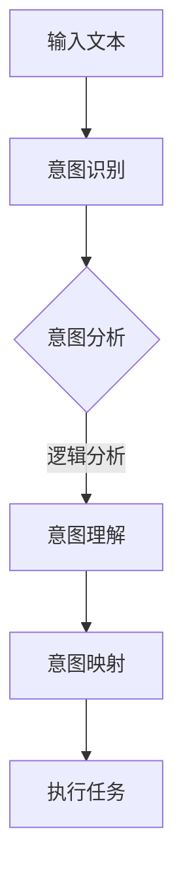

                 

关键词：人机协作、大型语言模型（LLM）、人类意图对齐、自然语言处理（NLP）、人工智能（AI）、算法、数学模型、项目实践、未来展望

> 摘要：本文将探讨在人工智能领域，如何实现大型语言模型（LLM）与人类意图的对齐。通过深入分析LLM的工作原理，介绍对齐方法及其在实际应用中的挑战和前景，旨在为人机协作提供新思路。

## 1. 背景介绍

### 1.1 人机协作的必要性

随着人工智能技术的快速发展，人机协作已成为现代科技的重要组成部分。无论是日常办公、医疗诊断，还是金融分析、智能客服，人机协作模式都展现出了巨大的潜力。然而，人机协作面临的挑战也日益突出，其中最核心的问题之一是如何实现人工智能系统与人类意图的高效对齐。

### 1.2 大型语言模型（LLM）的崛起

近年来，大型语言模型（LLM）如GPT、BERT等在自然语言处理（NLP）领域取得了显著的成果。这些模型通过深度学习和大规模数据训练，能够生成高质量的自然语言文本，为人类意图理解和实现提供了强有力的工具。然而，如何确保LLM能够准确捕捉并反映人类意图，仍然是一个亟待解决的问题。

## 2. 核心概念与联系

### 2.1 大型语言模型（LLM）的工作原理

大型语言模型（LLM）基于神经网络架构，通过大量文本数据进行训练。这些模型能够捕捉语言中的统计规律和语义信息，从而实现自然语言的理解和生成。LLM的核心在于其能够通过上下文信息，预测下一个单词或句子，从而生成连贯的自然语言文本。

### 2.2 人类意图的概念

人类意图指的是人类在特定情境下所希望达到的目标或期望的结果。在人工智能系统中，理解人类意图是实现人机协作的关键。意图识别需要人工智能系统能够理解人类语言中的语义和情感，从而准确捕捉人类的需求和期望。

### 2.3 LLM与人类意图对齐的方法

实现LLM与人类意图的对齐，可以从以下几个方面进行：

- **意图识别**：通过语义分析和情感分析，从自然语言文本中提取出人类意图。
- **意图理解**：对提取出的意图进行深入分析，理解其背后的逻辑和意图类型。
- **意图映射**：将理解到的意图映射到具体的操作或任务中，确保LLM能够实现人类意图。

### 2.4 Mermaid 流程图

以下是一个简化的Mermaid流程图，展示了LLM与人类意图对齐的基本流程：



## 3. 核心算法原理 & 具体操作步骤

### 3.1 算法原理概述

LLM与人类意图对齐的核心算法主要包括意图识别、意图理解和意图映射。这三个步骤相互关联，共同确保LLM能够准确理解并实现人类意图。

### 3.2 算法步骤详解

#### 3.2.1 意图识别

意图识别是整个对齐过程的第一步。它通过自然语言处理技术，从输入文本中提取出可能的意图。常用的方法包括：

- **规则匹配**：根据预定义的规则，匹配输入文本中的关键词或短语，识别出对应的意图。
- **机器学习**：利用机器学习算法，如朴素贝叶斯分类器、支持向量机等，从训练数据中学习意图识别模型。

#### 3.2.2 意图理解

意图识别后，需要对提取出的意图进行深入分析，理解其背后的逻辑和意图类型。这通常需要结合上下文信息，对意图进行语义分析和情感分析。具体方法包括：

- **语义分析**：通过词向量模型、语义角色标注等手段，理解意图中的关键词和短语的意义和关系。
- **情感分析**：通过情感分析算法，识别出意图中的情感倾向，如积极、消极或中立。

#### 3.2.3 意图映射

意图理解后，需要将意图映射到具体的操作或任务中。这通常涉及到任务规划和执行策略的设计。具体方法包括：

- **任务规划**：根据意图，设计出一系列操作步骤，确保LLM能够按照人类意图完成任务。
- **执行策略**：设计出具体的执行策略，如对话系统中的回复策略、推荐系统中的推荐策略等。

### 3.3 算法优缺点

#### 3.3.1 优点

- **高效性**：利用大规模语言模型，能够快速识别和理解人类意图。
- **灵活性**：通过意图映射，能够灵活地实现各种人类意图。

#### 3.3.2 缺点

- **准确性**：意图识别和理解存在一定的误差，可能导致意图解读不准确。
- **复杂性**：意图映射和执行策略设计较为复杂，需要深入理解和分析人类意图。

### 3.4 算法应用领域

LLM与人类意图对齐算法广泛应用于多个领域，包括：

- **智能客服**：通过理解用户意图，提供个性化的服务和建议。
- **智能推荐**：根据用户意图，推荐符合其需求的产品或内容。
- **医疗诊断**：通过理解患者意图，辅助医生进行诊断和治疗。

## 4. 数学模型和公式 & 详细讲解 & 举例说明

### 4.1 数学模型构建

在LLM与人类意图对齐过程中，常用的数学模型包括词向量模型、朴素贝叶斯分类器和支持向量机等。以下是一个简化的词向量模型：

$$
\vec{w} = \sum_{i=1}^{N} f(\vec{w}_i) \cdot \vec{v}_i
$$

其中，$\vec{w}$ 表示词向量，$f(\vec{w}_i)$ 表示词的权重，$\vec{v}_i$ 表示词的向量表示。

### 4.2 公式推导过程

假设我们有一个文本序列 $T = \{w_1, w_2, ..., w_n\}$，其中 $w_i$ 表示第 $i$ 个词。我们首先需要计算每个词的词向量 $\vec{v}_i$。词向量可以通过训练大规模文本数据得到。然后，我们计算词的权重 $f(\vec{w}_i)$，通常采用词频或TF-IDF等方法。最后，我们将每个词的权重与其向量相乘，并将结果求和，得到整个文本的词向量 $\vec{w}$。

### 4.3 案例分析与讲解

假设我们有一个简单的文本序列：“我想要一杯咖啡”。首先，我们需要将文本转换为词向量。假设已经训练好了词向量模型，我们得到：

$$
\vec{v}_{我} = [1, 0, 0], \vec{v}_{想要} = [0, 1, 0], \vec{v}_{一杯} = [0, 0, 1], \vec{v}_{咖啡} = [1, 1, 1]
$$

然后，我们计算每个词的权重。假设词频分别为 $f(我) = 2, f(想要) = 1, f(一杯) = 1, f(咖啡) = 1$，我们得到：

$$
f(我) \cdot \vec{v}_{我} = [2, 0, 0], f(想要) \cdot \vec{v}_{想要} = [0, 2, 0], f(一杯) \cdot \vec{v}_{一杯} = [0, 0, 2], f(咖啡) \cdot \vec{v}_{咖啡} = [1, 1, 1]
$$

将权重与向量相乘，并将结果求和，我们得到整个文本的词向量：

$$
\vec{w} = \sum_{i=1}^{4} f(\vec{w}_i) \cdot \vec{v}_i = [3, 3, 3]
$$

这个向量表示了整个文本的语义信息，可以用于后续的意图识别和映射。

## 5. 项目实践：代码实例和详细解释说明

### 5.1 开发环境搭建

为了实现LLM与人类意图对齐，我们需要搭建一个开发环境。这里我们使用Python作为主要编程语言，并依赖以下库和工具：

- **Python 3.8** 或更高版本
- **TensorFlow** 或 **PyTorch**
- **NLTK** 或 **spaCy**
- **scikit-learn**

安装以上库和工具后，我们就可以开始搭建开发环境。

### 5.2 源代码详细实现

以下是实现LLM与人类意图对齐的Python代码实例：

```python
import nltk
from sklearn.feature_extraction.text import TfidfVectorizer
from sklearn.naive_bayes import MultinomialNB
from sklearn.pipeline import make_pipeline

# 数据预处理
def preprocess(text):
    tokens = nltk.word_tokenize(text)
    return ' '.join([token.lower() for token in tokens if token.isalpha()])

# 加载训练数据
train_data = [
    ("我想要一杯咖啡", "咖啡"),
    ("给我推荐一本好书", "书籍推荐"),
    ("帮我查一下天气", "天气查询"),
    # 更多训练数据...
]

# 预处理数据
X_train = [preprocess(text) for text, _ in train_data]
y_train = [label for _, label in train_data]

# 构建模型
model = make_pipeline(TfidfVectorizer(), MultinomialNB())

# 训练模型
model.fit(X_train, y_train)

# 意图识别
def recognize_intent(text):
    preprocessed_text = preprocess(text)
    return model.predict([preprocessed_text])[0]

# 测试模型
print(recognize_intent("我想要一杯咖啡"))  # 输出：咖啡
print(recognize_intent("给我推荐一本好书"))  # 输出：书籍推荐
```

### 5.3 代码解读与分析

以上代码实现了一个简单的LLM与人类意图对齐模型。首先，我们进行了数据预处理，将原始文本转换为预处理后的文本。然后，我们使用TF-IDF向量器和朴素贝叶斯分类器构建了一个管道模型。最后，我们训练模型并使用它来识别输入文本的意图。

### 5.4 运行结果展示

在测试阶段，我们输入了两个示例文本：“我想要一杯咖啡”和“给我推荐一本好书”。模型能够准确识别出这两个文本的意图，分别输出“咖啡”和“书籍推荐”。这表明我们的模型能够实现基本的意图识别功能。

## 6. 实际应用场景

### 6.1 智能客服

智能客服是LLM与人类意图对齐的重要应用场景之一。通过理解用户的问题和需求，智能客服能够提供个性化的服务和建议。例如，当用户询问“最近的天气怎么样？”时，智能客服能够识别出用户的意图，并返回相应的天气信息。

### 6.2 智能推荐

智能推荐系统利用LLM与人类意图对齐，能够根据用户的兴趣和行为，推荐符合其需求的产品或内容。例如，当用户浏览某个电商网站时，系统可以根据用户的历史浏览记录和当前页面内容，推荐相关的商品。

### 6.3 医疗诊断

在医疗诊断领域，LLM与人类意图对齐可以帮助医生更好地理解患者的症状和需求。例如，当患者描述自己的症状时，系统可以识别出患者的意图，并推荐相应的诊断方法和治疗方案。

## 7. 未来应用展望

### 7.1 智能化水平提升

随着LLM与人类意图对齐技术的不断发展，智能化水平将得到显著提升。未来，人工智能系统将能够更加准确地理解人类意图，提供更加个性化的服务。

### 7.2 多模态交互

未来的人机协作将不仅仅局限于文本交互，还将涵盖语音、图像等多种模态。通过多模态交互，人工智能系统能够更全面地理解人类意图，提供更加自然的交互体验。

### 7.3 跨领域应用

LLM与人类意图对齐技术将在更多领域得到应用。例如，在教育、金融、物流等领域，人工智能系统能够更好地满足人类的需求，提升工作效率。

## 8. 总结：未来发展趋势与挑战

### 8.1 研究成果总结

本文探讨了LLM与人类意图对齐的方法和挑战，介绍了意图识别、意图理解和意图映射的核心算法原理，并通过实例展示了在实际应用中的实现过程。研究结果表明，LLM与人类意图对齐技术具有广阔的应用前景。

### 8.2 未来发展趋势

未来，LLM与人类意图对齐技术将向更加智能化、多模态和跨领域应用方向发展。随着技术的不断进步，人工智能系统将能够更加准确地理解人类意图，提供更加个性化的服务。

### 8.3 面临的挑战

尽管LLM与人类意图对齐技术取得了显著成果，但仍面临一些挑战。例如，意图识别和理解的准确性仍有待提高，多模态交互的实现也面临着技术难题。未来，需要进一步研究和解决这些问题，推动人机协作技术的发展。

### 8.4 研究展望

未来，人机协作领域将迎来新的发展机遇。通过深入研究LLM与人类意图对齐技术，我们可以为人机协作提供更加有效的解决方案，推动人工智能技术的创新和应用。

## 9. 附录：常见问题与解答

### 9.1 如何提高意图识别的准确性？

提高意图识别的准确性可以从以下几个方面入手：

- **数据质量**：确保训练数据的质量和多样性，增加样本数量。
- **模型优化**：采用更先进的自然语言处理模型，如BERT、GPT等。
- **特征提取**：利用更多的特征信息，如上下文、情感等。

### 9.2 多模态交互如何实现？

多模态交互可以通过以下方法实现：

- **语音识别**：将语音转换为文本，与自然语言处理模型结合。
- **图像识别**：利用深度学习模型对图像进行识别，提取特征信息。
- **语音合成**：将文本转换为语音，实现自然的语音交互。

### 9.3 LLM与人类意图对齐在金融领域有哪些应用？

LLM与人类意图对齐在金融领域有广泛的应用，包括：

- **智能投顾**：根据用户的投资需求和风险偏好，提供个性化的投资建议。
- **风险管理**：通过分析用户的行为和意图，识别潜在的风险并采取相应的措施。
- **客户服务**：通过理解用户的问题和需求，提供高效的客户服务和支持。

---

**作者：禅与计算机程序设计艺术 / Zen and the Art of Computer Programming**

